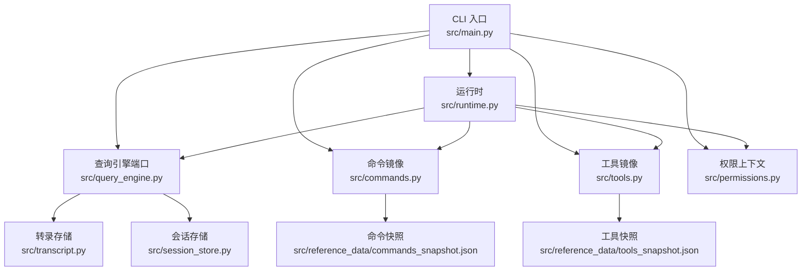
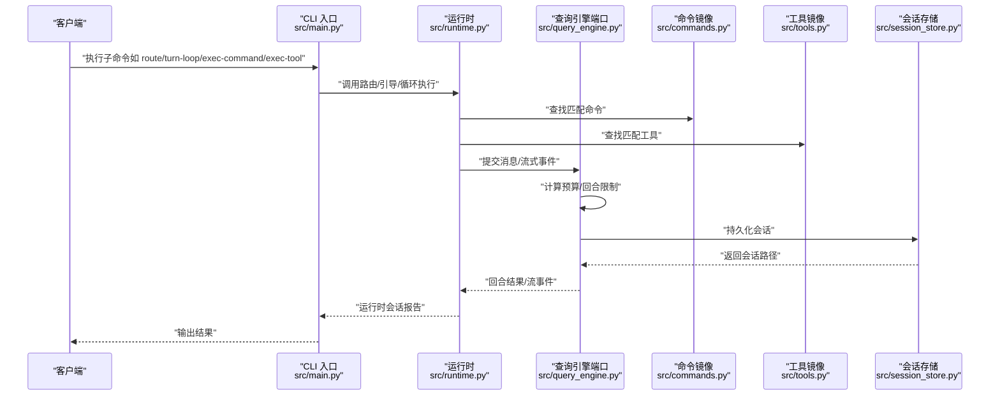
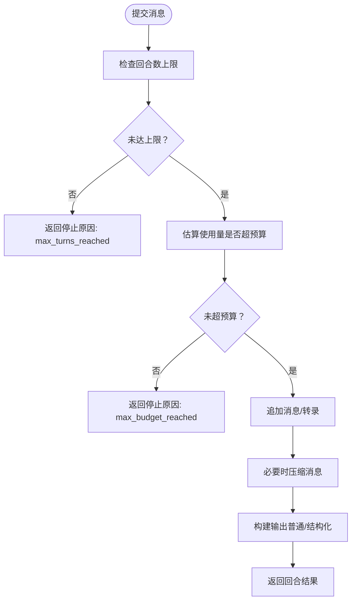
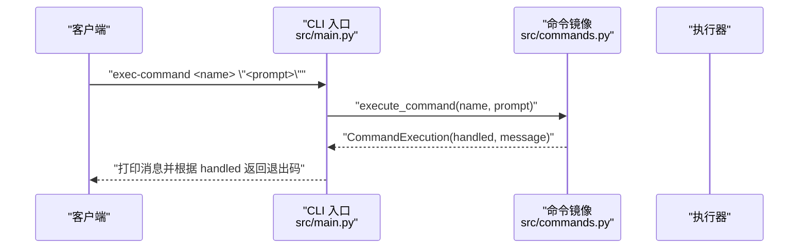
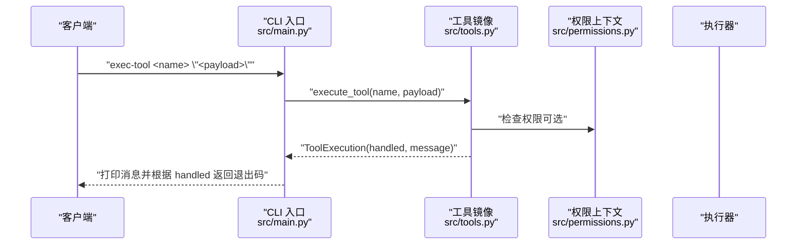
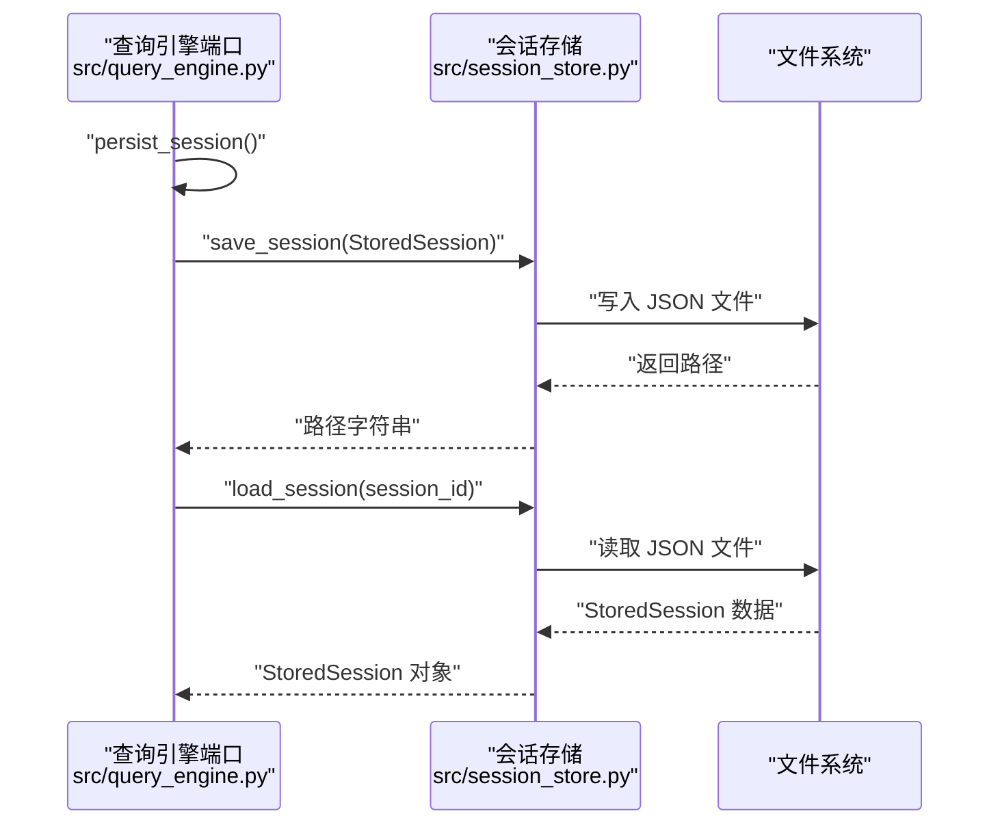
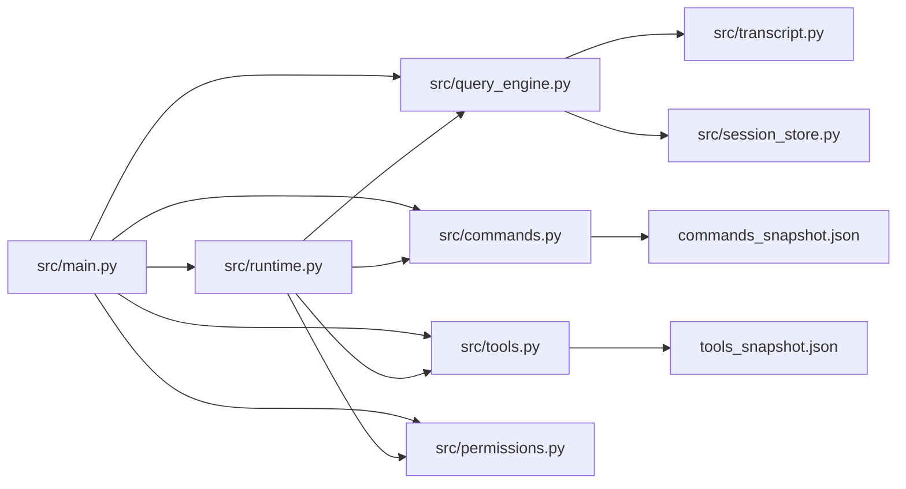

# API 参考

<cite>
**本文引用的文件**
- [src/main.py](file://src/main.py)
- [src/query_engine.py](file://src/query_engine.py)
- [src/runtime.py](file://src/runtime.py)
- [src/commands.py](file://src/commands.py)
- [src/tools.py](file://src/tools.py)
- [src/models.py](file://src/models.py)
- [src/transcript.py](file://src/transcript.py)
- [src/session_store.py](file://src/session_store.py)
- [src/tool_pool.py](file://src/tool_pool.py)
- [src/permissions.py](file://src/permissions.py)
- [src/reference_data/commands_snapshot.json](file://src/reference_data/commands_snapshot.json)
- [src/reference_data/tools_snapshot.json](file://src/reference_data/tools_snapshot.json)
- [README.md](file://README.md)
</cite>

## 目录
1. [简介](#简介)
2. [项目结构](#项目结构)
3. [核心组件](#核心组件)
4. [架构总览](#架构总览)
5. [详细组件分析](#详细组件分析)
6. [依赖关系分析](#依赖关系分析)
7. [性能考虑](#性能考虑)
8. [故障排查指南](#故障排查指南)
9. [结论](#结论)
10. [附录](#附录)

## 简介
本文件为 CLAW 项目的 API 技术参考，聚焦以下能力与接口：
- 查询引擎 API：用于提交用户消息、生成回合结果、流式事件输出、会话持久化与摘要渲染。
- 命令执行 API：通过镜像的命令清单路由并执行命令，返回执行结果与消息。
- 工具执行 API：通过镜像的工具清单路由并执行工具，支持权限过滤与简单模式筛选。
- 会话管理 API：保存与加载会话，管理对话转录与使用统计。

文档同时覆盖认证方式、错误码与异常处理、调用示例、版本控制与兼容策略、性能优化与最佳实践等。

## 项目结构
CLAW 的 Python 端以模块化方式组织，核心入口为 CLI，核心运行时与查询引擎位于独立模块中；命令与工具通过快照清单进行镜像管理；会话与转录通过数据类与存储函数进行持久化。

图表来源
- [src/main.py:1-214](file://src/main.py#L1-L214)
- [src/runtime.py:1-193](file://src/runtime.py#L1-L193)
- [src/query_engine.py:1-194](file://src/query_engine.py#L1-L194)
- [src/commands.py:1-91](file://src/commands.py#L1-L91)
- [src/tools.py:1-97](file://src/tools.py#L1-L97)
- [src/transcript.py:1-24](file://src/transcript.py#L1-L24)
- [src/session_store.py:1-36](file://src/session_store.py#L1-L36)
- [src/reference_data/commands_snapshot.json:1-200](file://src/reference_data/commands_snapshot.json#L1-L200)
- [src/reference_data/tools_snapshot.json:1-200](file://src/reference_data/tools_snapshot.json#L1-L200)

章节来源
- [src/main.py:1-214](file://src/main.py#L1-L214)
- [README.md:82-111](file://README.md#L82-L111)

## 核心组件
- 查询引擎端口（QueryEnginePort）
  - 负责回合提交、流式事件、会话持久化、摘要渲染与令牌预算控制。
  - 关键字段：会话 ID、消息列表、权限拒绝记录、使用统计、转录存储。
  - 关键方法：submit_message、stream_submit_message、persist_session、render_summary。
- 运行时（PortRuntime）
  - 路由提示词到命令/工具匹配，构建执行注册表，驱动查询引擎并生成运行时会话报告。
  - 关键方法：route_prompt、bootstrap_session、run_turn_loop。
- 命令与工具镜像
  - 从 JSON 快照加载镜像清单，提供查找、过滤与执行占位。
  - 关键方法：get_command、get_commands、find_commands、execute_command、get_tool、get_tools、find_tools、execute_tool。
- 权限上下文（ToolPermissionContext）
  - 支持按名称与前缀拒绝工具，用于工具过滤。
- 会话与转录
  - 会话存储：保存/加载会话至本地 JSON 文件。
  - 转录存储：维护消息列表、紧凑与刷新状态。

章节来源
- [src/query_engine.py:15-194](file://src/query_engine.py#L15-L194)
- [src/runtime.py:89-193](file://src/runtime.py#L89-L193)
- [src/commands.py:13-91](file://src/commands.py#L13-L91)
- [src/tools.py:14-97](file://src/tools.py#L14-L97)
- [src/permissions.py:6-21](file://src/permissions.py#L6-L21)
- [src/session_store.py:8-36](file://src/session_store.py#L8-L36)
- [src/transcript.py:6-24](file://src/transcript.py#L6-L24)

## 架构总览
下图展示 CLI 如何协调运行时、查询引擎、命令/工具镜像与会话存储，形成完整的 API 能力链路。

图表来源
- [src/main.py:94-214](file://src/main.py#L94-L214)
- [src/runtime.py:89-193](file://src/runtime.py#L89-L193)
- [src/query_engine.py:61-150](file://src/query_engine.py#L61-L150)
- [src/session_store.py:19-35](file://src/session_store.py#L19-L35)

## 详细组件分析

### 查询引擎 API
- 功能概述
  - 提交用户消息并生成回合结果，支持结构化输出与预算控制。
  - 流式事件输出，包含开始、匹配、权限拒绝、增量文本与结束事件。
  - 会话持久化与摘要渲染，便于审计与复现。
- 请求/响应与参数
  - submit_message(prompt, matched_commands=(), matched_tools=(), denied_tools=())
    - 输入：prompt 字符串；可选匹配的命令/工具名称元组；可选权限拒绝列表。
    - 输出：回合结果对象，包含 prompt、output、匹配项、权限拒绝、使用统计、停止原因。
  - stream_submit_message(...)
    - 流式事件序列：message_start → command_match → tool_match → permission_denial → message_delta → message_stop。
    - message_stop 包含 usage、stop_reason、transcript_size。
  - persist_session()
    - 将当前会话写入 .port_sessions/<session_id>.json，并返回路径字符串。
  - render_summary()
    - 渲染工作区摘要，包含清单、命令/工具表面数量、会话信息、预算与转录状态。
- 错误与异常
  - 当达到最大回合数或预算上限时，停止原因分别为 max_turns_reached 与 max_budget_reached。
  - 结构化输出失败时抛出运行时错误。
- 性能与优化
  - compact_after_turns 控制内存中消息压缩阈值，避免无限增长。
  - 使用 LRU 缓存加载命令/工具快照，减少重复 IO。
- 版本与兼容
  - 配置项 max_turns、max_budget_tokens、structured_output、structured_retry_limit 作为行为边界，变更需谨慎评估。
  - 摘要渲染包含版本相关统计，便于对比。

图表来源
- [src/query_engine.py:61-104](file://src/query_engine.py#L61-L104)
- [src/query_engine.py:129-132](file://src/query_engine.py#L129-L132)
- [src/query_engine.py:152-169](file://src/query_engine.py#L152-L169)

章节来源
- [src/query_engine.py:15-194](file://src/query_engine.py#L15-L194)
- [src/transcript.py:6-24](file://src/transcript.py#L6-L24)
- [src/session_store.py:19-35](file://src/session_store.py#L19-L35)

### 命令执行 API
- 功能概述
  - 通过命令快照镜像检索命令，支持过滤插件与技能命令。
  - 执行命令返回占位消息，指示镜像行为。
- 请求/响应与参数
  - get_command(name) → PortingModule | None
  - get_commands(include_plugin_commands=True, include_skill_commands=True) → tuple[PortingModule, ...]
  - find_commands(query, limit=20) → list[PortingModule]
  - execute_command(name, prompt='') → CommandExecution
    - 返回 handled 与 message 字段；未找到命令时 handled=False。
- 权限与过滤
  - 通过运行时或工具池装配时传入 ToolPermissionContext 过滤工具，命令侧不直接参与工具权限。
- 示例
  - 列出命令清单：python3 -m src.main commands
  - 执行命令：python3 -m src.main exec-command <name> "<prompt>"
- 错误与异常
  - 未知命令返回 handled=False 与错误消息。

图表来源
- [src/main.py:200-207](file://src/main.py#L200-L207)
- [src/commands.py:75-80](file://src/commands.py#L75-L80)

章节来源
- [src/commands.py:13-91](file://src/commands.py#L13-L91)
- [src/reference_data/commands_snapshot.json:1-200](file://src/reference_data/commands_snapshot.json#L1-L200)
- [src/main.py:84-91](file://src/main.py#L84-L91)

### 工具执行 API
- 功能概述
  - 通过工具快照镜像检索工具，支持简单模式与 MCP 过滤，结合权限上下文进行拒绝。
  - 执行工具返回占位消息，指示镜像行为。
- 请求/响应与参数
  - get_tool(name) → PortingModule | None
  - get_tools(simple_mode=False, include_mcp=True, permission_context=None) → tuple[PortingModule, ...]
  - find_tools(query, limit=20) → list[PortingModule]
  - execute_tool(name, payload='') → ToolExecution
    - 返回 handled 与 message 字段；未找到工具时 handled=False。
- 权限与过滤
  - ToolPermissionContext 支持按名称与前缀拒绝工具。
  - 运行时在特定场景下推断权限拒绝（例如 Bash 类工具）。
- 示例
  - 列出工具清单：python3 -m src.main tools
  - 执行工具：python3 -m src.main exec-tool <name> "<payload>"
- 错误与异常
  - 未知工具返回 handled=False 与错误消息。

图表来源
- [src/main.py:204-207](file://src/main.py#L204-L207)
- [src/tools.py:81-86](file://src/tools.py#L81-L86)
- [src/permissions.py:18-21](file://src/permissions.py#L18-L21)

章节来源
- [src/tools.py:14-97](file://src/tools.py#L14-L97)
- [src/permissions.py:6-21](file://src/permissions.py#L6-L21)
- [src/tool_pool.py:28-37](file://src/tool_pool.py#L28-L37)
- [src/reference_data/tools_snapshot.json:1-200](file://src/reference_data/tools_snapshot.json#L1-L200)

### 会话管理 API
- 功能概述
  - 保存会话：将当前会话写入 .port_sessions/<session_id>.json。
  - 加载会话：读取指定会话并返回 StoredSession。
  - 转录管理：维护消息列表、紧凑与刷新状态。
- 请求/响应与参数
  - save_session(session: StoredSession, directory=None) → Path
  - load_session(session_id: str, directory=None) → StoredSession
  - TranscriptStore.append/compact/replay/flush
- 数据模型
  - StoredSession：session_id、messages、input_tokens、output_tokens。
  - UsageSummary：input_tokens、output_tokens，支持按回合累加。
- 示例
  - 保存会话：persist_session() 返回路径。
  - 加载会话：python3 -m src.main load-session <session_id>

图表来源
- [src/query_engine.py:140-150](file://src/query_engine.py#L140-L150)
- [src/session_store.py:19-35](file://src/session_store.py#L19-L35)

章节来源
- [src/session_store.py:8-36](file://src/session_store.py#L8-L36)
- [src/transcript.py:6-24](file://src/transcript.py#L6-L24)
- [src/models.py:28-37](file://src/models.py#L28-L37)

## 依赖关系分析
- 组件耦合
  - CLI 通过子命令分发到运行时、查询引擎、命令/工具镜像与权限上下文。
  - 运行时依赖查询引擎进行回合处理，依赖命令/工具镜像进行路由与执行占位。
  - 查询引擎依赖转录存储与会话存储完成会话生命周期管理。
- 外部依赖
  - JSON 快照文件提供命令/工具清单，作为只读数据源。
  - 文件系统用于会话持久化。

图表来源
- [src/main.py:1-214](file://src/main.py#L1-L214)
- [src/runtime.py:1-193](file://src/runtime.py#L1-L193)
- [src/query_engine.py:1-194](file://src/query_engine.py#L1-L194)
- [src/commands.py:1-91](file://src/commands.py#L1-L91)
- [src/tools.py:1-97](file://src/tools.py#L1-L97)
- [src/transcript.py:1-24](file://src/transcript.py#L1-L24)
- [src/session_store.py:1-36](file://src/session_store.py#L1-L36)
- [src/reference_data/commands_snapshot.json:1-200](file://src/reference_data/commands_snapshot.json#L1-L200)
- [src/reference_data/tools_snapshot.json:1-200](file://src/reference_data/tools_snapshot.json#L1-L200)

章节来源
- [src/main.py:1-214](file://src/main.py#L1-L214)
- [src/runtime.py:1-193](file://src/runtime.py#L1-L193)
- [src/query_engine.py:1-194](file://src/query_engine.py#L1-L194)

## 性能考虑
- 回合预算与内存控制
  - max_budget_tokens 控制输入/输出令牌总量，避免资源耗尽。
  - compact_after_turns 与内部紧凑逻辑限制内存中消息长度，提升长对话稳定性。
- 缓存与快照
  - 命令/工具快照使用 LRU 缓存，减少重复解析开销。
- I/O 与持久化
  - 会话保存为单文件 JSON，建议批量操作或异步写入以降低阻塞。
- 并发与流式
  - 流式事件适合实时 UI 或 SSE 场景，注意客户端缓冲与重连策略。

## 故障排查指南
- 常见错误与处理
  - 未知命令/工具：handled=False，message 中包含“未知”提示。请核对名称大小写与快照清单。
  - 最大回合数到达：stop_reason=max_turns_reached。调整 max_turns 或清理历史。
  - 预算超限：stop_reason=max_budget_reached。检查 prompt 长度与结构化输出开销。
  - 结构化输出失败：抛出运行时错误。检查输出内容可序列化性。
  - 权限拒绝：运行时可能推断并注入权限拒绝，工具侧也可通过 ToolPermissionContext 拒绝。
- 定位步骤
  - 使用 CLI 子命令验证清单与路由：commands、tools、route、bootstrap。
  - 查看运行时会话报告中的历史与执行摘要，定位问题阶段。
  - 检查 .port_sessions 目录下的会话文件，确认持久化状态。

章节来源
- [src/commands.py:75-80](file://src/commands.py#L75-L80)
- [src/tools.py:81-86](file://src/tools.py#L81-L86)
- [src/query_engine.py:68-95](file://src/query_engine.py#L68-L95)
- [src/query_engine.py:162-169](file://src/query_engine.py#L162-L169)
- [src/runtime.py:169-174](file://src/runtime.py#L169-L174)

## 结论
CLAW 的 Python 端提供了清晰的查询引擎、命令/工具镜像与会话管理能力，配合 CLI 子命令实现从路由到执行再到持久化的完整链路。通过预算控制、紧凑策略与权限上下文，系统在可用性与安全性之间取得平衡。建议在生产集成中关注流式事件的客户端处理、会话文件的备份与迁移策略，并遵循配置项的向后兼容原则。

## 附录

### 认证方法
- 当前实现未内置认证层，所有操作基于本地文件系统与进程内数据结构。若在服务化场景使用，请在网关或代理层添加认证与授权。

### 错误代码与异常处理机制
- 退出码
  - 0：成功
  - 1：命令/工具执行失败（handled=False）
  - 2：未知命令（CLI 参数错误）
- 异常
  - 结构化输出渲染失败：抛出运行时错误。
  - 会话加载/保存：JSON 解析/文件读写异常由调用方捕获与处理。

章节来源
- [src/main.py:208-209](file://src/main.py#L208-L209)
- [src/query_engine.py:162-169](file://src/query_engine.py#L162-L169)

### 调用示例与集成指南
- 渲染工作区摘要
  - python3 -m src.main summary
- 打印工作区清单
  - python3 -m src.main manifest
- 列出命令/工具
  - python3 -m src.main commands --limit 10
  - python3 -m src.main tools --limit 10
- 路由与引导会话
  - python3 -m src.main route "<prompt>" --limit 5
  - python3 -m src.main bootstrap "<prompt>" --limit 5
- 循环对话
  - python3 -m src.main turn-loop "<prompt>" --limit 5 --max-turns 3 --structured-output
- 保存/加载会话
  - python3 -m src.main flush-transcript "<prompt>"
  - python3 -m src.main load-session <session_id>
- 执行命令/工具
  - python3 -m src.main exec-command <name> "<prompt>"
  - python3 -m src.main exec-tool <name> "<payload>"

章节来源
- [src/main.py:94-214](file://src/main.py#L94-L214)
- [README.md:112-149](file://README.md#L112-L149)

### 版本控制与向后兼容性策略
- 行为边界
  - QueryEngineConfig 的 max_turns、max_budget_tokens、structured_output、structured_retry_limit 作为行为边界，变更需谨慎评估。
- 渲染一致性
  - render_summary 与运行时会话报告包含版本相关统计，便于对比与回归。
- 快照清单
  - commands_snapshot.json 与 tools_snapshot.json 作为只读数据源，变更应伴随清单更新与兼容测试。

章节来源
- [src/query_engine.py:15-22](file://src/query_engine.py#L15-L22)
- [src/query_engine.py:171-193](file://src/query_engine.py#L171-L193)
- [src/runtime.py:139-151](file://src/runtime.py#L139-L151)