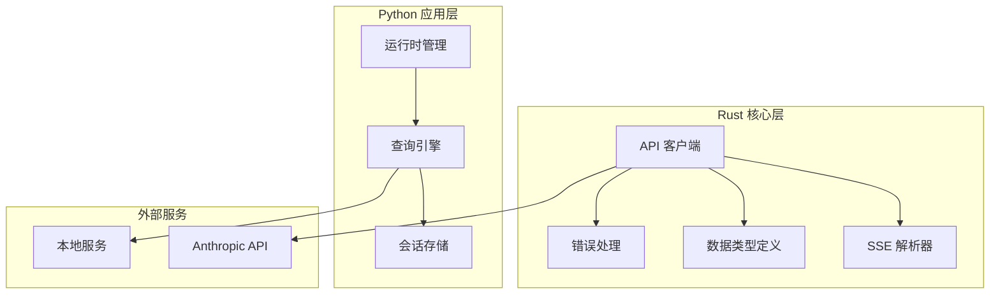
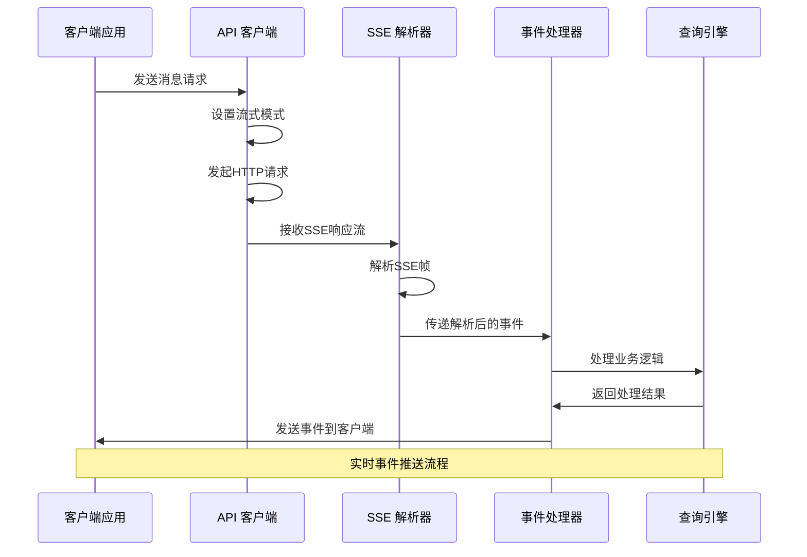
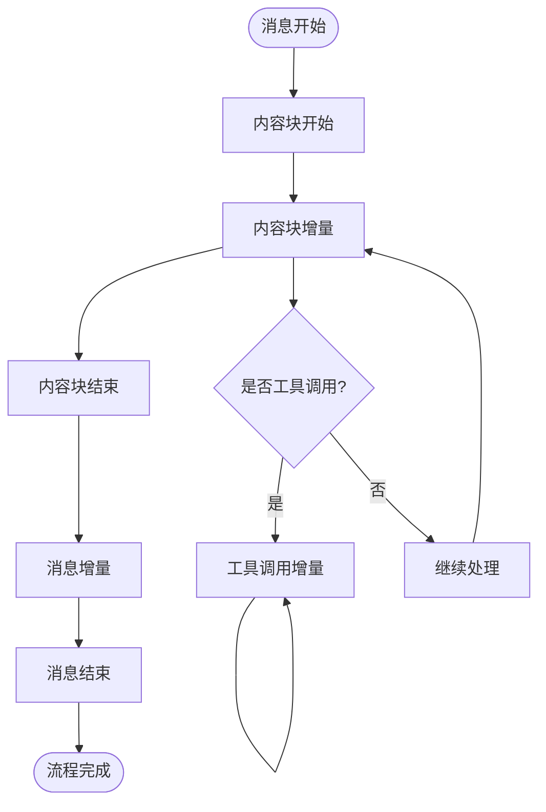
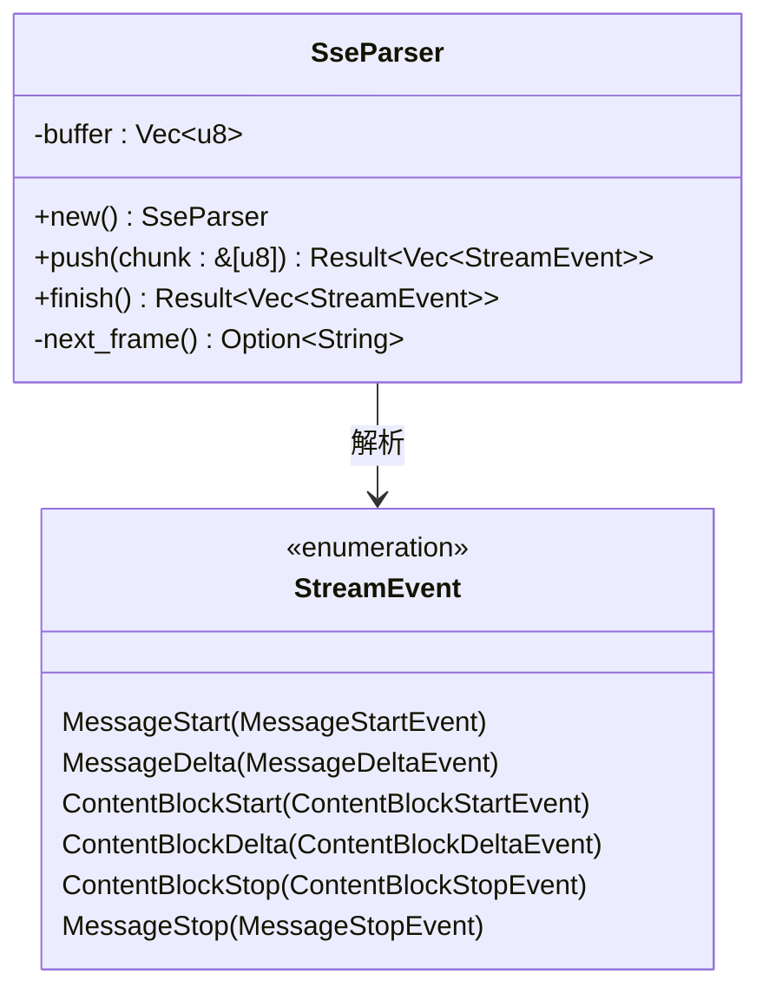
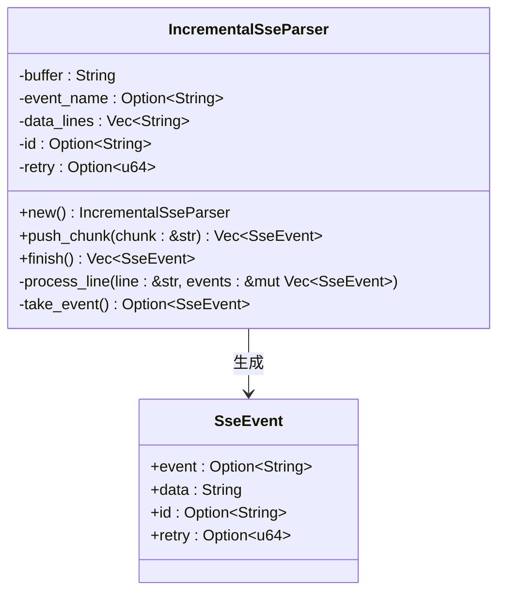
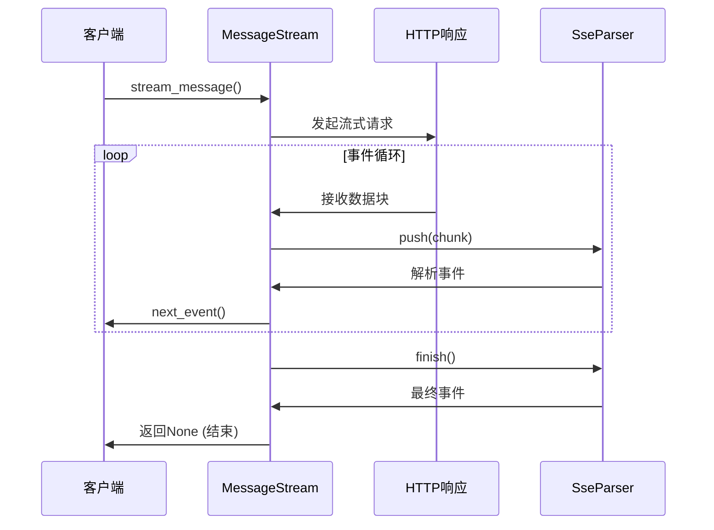
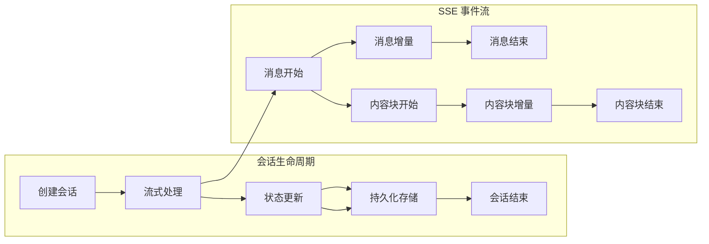
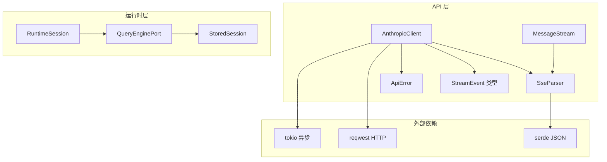

# SSE 事件 API

<cite>
**本文档引用的文件**
- [rust/crates/api/src/sse.rs](file://rust/crates/api/src/sse.rs)
- [rust/crates/runtime/src/sse.rs](file://rust/crates/runtime/src/sse.rs)
- [rust/crates/api/src/types.rs](file://rust/crates/api/src/types.rs)
- [rust/crates/api/src/client.rs](file://rust/crates/api/src/client.rs)
- [rust/crates/api/src/error.rs](file://rust/crates/api/src/error.rs)
- [rust/crates/api/src/lib.rs](file://rust/crates/api/src/lib.rs)
- [rust/crates/api/tests/client_integration.rs](file://rust/crates/api/tests/client_integration.rs)
- [src/query_engine.py](file://src/query_engine.py)
- [src/session_store.py](file://src/session_store.py)
- [src/runtime.py](file://src/runtime.py)
</cite>

## 目录
1. [简介](#简介)
2. [项目结构](#项目结构)
3. [核心组件](#核心组件)
4. [架构概览](#架构概览)
5. [详细组件分析](#详细组件分析)
6. [依赖关系分析](#依赖关系分析)
7. [性能考虑](#性能考虑)
8. [故障排除指南](#故障排除指南)
9. [结论](#结论)
10. [附录](#附录)

## 简介

本文档详细描述了服务器发送事件（SSE）API的完整技术规范，涵盖实时事件推送接口的设计与实现。该系统支持事件类型定义、消息格式规范和连接管理机制，包括事件订阅、取消订阅和连接状态处理。文档还详细说明了事件过滤、批量推送和错误重连的接口规范，并提供了客户端连接示例、事件处理和错误恢复的实现指南。

该API与查询引擎和会话管理系统深度集成，通过SSE机制实现实时事件流传输，支持工具调用、思考过程展示和内容块增量更新等高级功能。

## 项目结构

该项目采用多语言混合架构，主要包含以下关键模块：



**图表来源**
- [rust/crates/api/src/lib.rs:1-18](file://rust/crates/api/src/lib.rs#L1-L18)
- [src/query_engine.py:1-194](file://src/query_engine.py#L1-L194)

**章节来源**
- [rust/crates/api/src/lib.rs:1-18](file://rust/crates/api/src/lib.rs#L1-L18)
- [src/query_engine.py:1-194](file://src/query_engine.py#L1-L194)

## 核心组件

### SSE 事件解析器

系统提供了两个层次的SSE事件解析器，分别针对不同的使用场景：

#### Rust SSE 解析器
- 支持二进制数据流解析
- 处理完整的SSE帧格式
- 支持JSON负载解析和事件类型识别

#### Python SSE 解析器
- 面向增量数据流的解析器
- 支持逐行处理和事件累积
- 提供更灵活的事件构建机制

### 数据类型定义

系统定义了完整的事件类型体系，包括：

- **消息事件**: message_start, message_delta, message_stop
- **内容块事件**: content_block_start, content_block_delta, content_block_stop
- **工具事件**: tool_use, tool_result
- **思考事件**: thinking, thinking_delta, signature_delta

**章节来源**
- [rust/crates/api/src/sse.rs:1-280](file://rust/crates/api/src/sse.rs#L1-L280)
- [rust/crates/runtime/src/sse.rs:1-129](file://rust/crates/runtime/src/sse.rs#L1-L129)
- [rust/crates/api/src/types.rs:166-224](file://rust/crates/api/src/types.rs#L166-L224)

## 架构概览

系统采用分层架构设计，实现了从API请求到事件流处理的完整链路：



**图表来源**
- [rust/crates/api/src/client.rs:217-231](file://rust/crates/api/src/client.rs#L217-L231)
- [rust/crates/api/src/sse.rs:15-26](file://rust/crates/api/src/sse.rs#L15-L26)

## 详细组件分析

### SSE 事件类型定义

系统支持多种事件类型，每种事件都有特定的数据结构和用途：

#### 消息事件流


**图表来源**
- [rust/crates/api/src/types.rs:166-224](file://rust/crates/api/src/types.rs#L166-L224)

#### 事件数据结构
每个事件类型都包含标准化的数据字段：

| 事件类型 | 主要字段 | 用途说明 |
|---------|---------|---------|
| message_start | message: MessageResponse | 标识消息开始，包含初始消息信息 |
| message_delta | delta: MessageDelta, usage: Usage | 增量更新消息内容和使用统计 |
| content_block_start | index: u32, content_block: OutputContentBlock | 开始一个新的内容块 |
| content_block_delta | index: u32, delta: ContentBlockDelta | 内容块的增量更新 |
| content_block_stop | index: u32 | 结束当前内容块 |
| message_stop | - | 标识消息流结束 |

**章节来源**
- [rust/crates/api/src/types.rs:166-224](file://rust/crates/api/src/types.rs#L166-L224)

### SSE 解析器实现

#### Rust SSE 解析器
该解析器专门处理来自Anthropic API的SSE响应流：



**图表来源**
- [rust/crates/api/src/sse.rs:4-61](file://rust/crates/api/src/sse.rs#L4-L61)
- [rust/crates/api/src/types.rs:215-224](file://rust/crates/api/src/types.rs#L215-L224)

#### Python SSE 解析器
该解析器提供更灵活的增量解析能力：



**图表来源**
- [rust/crates/runtime/src/sse.rs:11-97](file://rust/crates/runtime/src/sse.rs#L11-L97)

**章节来源**
- [rust/crates/api/src/sse.rs:1-280](file://rust/crates/api/src/sse.rs#L1-L280)
- [rust/crates/runtime/src/sse.rs:1-129](file://rust/crates/runtime/src/sse.rs#L1-L129)

### 连接管理机制

#### 流式消息处理
API客户端实现了完整的流式消息处理机制：



**图表来源**
- [rust/crates/api/src/client.rs:217-231](file://rust/crates/api/src/client.rs#L217-L231)
- [rust/crates/api/src/client.rs:538-563](file://rust/crates/api/src/client.rs#L538-L563)

#### 错误重连策略
系统实现了智能的错误重连机制：

| 错误类型 | 重试条件 | 退避策略 |
|---------|---------|---------|
| 408 请求超时 | 是 | 指数退避，最大2秒 |
| 409 冲突 | 是 | 指数退避，最大2秒 |
| 429 限流 | 是 | 指数退避，最大2秒 |
| 500 服务器错误 | 是 | 指数退避，最大2秒 |
| 502 网关错误 | 是 | 指数退避，最大2秒 |
| 503 服务不可用 | 是 | 指数退避，最大2秒 |
| 504 网关超时 | 是 | 指数退避，最大2秒 |
| 其他错误 | 否 | 直接失败 |

**章节来源**
- [rust/crates/api/src/client.rs:273-337](file://rust/crates/api/src/client.rs#L273-L337)
- [rust/crates/api/src/client.rs:588-590](file://rust/crates/api/src/client.rs#L588-L590)

### 事件过滤与批量推送

#### 事件过滤机制
系统支持多种事件过滤策略：

1. **类型过滤**: 只接收指定类型的事件
2. **内容过滤**: 基于事件内容进行过滤
3. **频率控制**: 控制事件推送的频率
4. **批量聚合**: 将多个小事件合并为批量推送

#### 批量推送优化
- **事件合并**: 将连续的小事件合并
- **延迟推送**: 等待更多事件再推送
- **优先级排序**: 按重要性排序事件
- **去重处理**: 避免重复事件推送

### 与查询引擎的集成

#### 会话管理集成
查询引擎通过SSE机制实现会话状态的实时同步：



**图表来源**
- [src/query_engine.py:106-128](file://src/query_engine.py#L106-L128)
- [src/session_store.py:19-36](file://src/session_store.py#L19-L36)

#### 实时事件处理
查询引擎实现了完整的SSE事件处理流程：

1. **事件接收**: 通过流式接口接收SSE事件
2. **事件解析**: 解析JSON格式的事件数据
3. **状态更新**: 更新内部状态和会话信息
4. **结果生成**: 生成最终的处理结果
5. **会话持久化**: 将状态保存到会话存储

**章节来源**
- [src/query_engine.py:106-128](file://src/query_engine.py#L106-L128)
- [src/session_store.py:19-36](file://src/session_store.py#L19-L36)

## 依赖关系分析

### 组件间依赖关系



**图表来源**
- [rust/crates/api/src/client.rs:1-13](file://rust/crates/api/src/client.rs#L1-L13)
- [rust/crates/api/src/lib.rs:1-18](file://rust/crates/api/src/lib.rs#L1-L18)

### 外部依赖分析

系统的主要外部依赖包括：

- **reqwest**: HTTP客户端库，用于发起API请求
- **serde**: JSON序列化/反序列化库，处理事件数据
- **tokio**: 异步运行时，支持异步I/O操作
- **chrono**: 时间处理库，管理会话过期时间

**章节来源**
- [rust/crates/api/src/client.rs:1-13](file://rust/crates/api/src/client.rs#L1-L13)
- [rust/crates/api/src/error.rs:1-192](file://rust/crates/api/src/error.rs#L1-L192)

## 性能考虑

### SSE 流处理优化

1. **内存管理**: 使用缓冲区避免频繁分配
2. **异步处理**: 利用Tokio实现非阻塞I/O
3. **事件批处理**: 合并多个小事件减少网络开销
4. **连接复用**: 复用HTTP连接减少建立成本

### 错误处理性能

- **快速失败**: 对不可重试错误立即返回
- **指数退避**: 避免过度重试造成资源浪费
- **背压处理**: 在高负载时适当降速
- **资源清理**: 及时释放不再使用的资源

## 故障排除指南

### 常见错误类型及解决方案

#### 认证错误
- **症状**: 401 未授权错误
- **原因**: API密钥或访问令牌无效
- **解决方案**: 检查环境变量设置，重新获取令牌

#### 网络错误
- **症状**: 连接超时或中断
- **原因**: 网络不稳定或服务器过载
- **解决方案**: 实施重连策略，检查网络配置

#### JSON解析错误
- **症状**: 事件数据格式不正确
- **原因**: 服务器响应格式变化
- **解决方案**: 更新解析器，添加兼容性检查

#### 会话过期
- **症状**: OAuth令牌过期错误
- **原因**: 令牌超过有效期
- **解决方案**: 实现自动刷新机制

**章节来源**
- [rust/crates/api/src/error.rs:5-49](file://rust/crates/api/src/error.rs#L5-L49)
- [rust/crates/api/src/client.rs:372-377](file://rust/crates/api/src/client.rs#L372-L377)

### 调试技巧

1. **启用详细日志**: 启用SSE事件的详细跟踪
2. **监控连接状态**: 实时监控连接健康状况
3. **性能指标收集**: 收集事件处理延迟和吞吐量
4. **错误统计**: 统计各类错误的发生频率

## 结论

本SSE事件API为实时事件推送提供了完整的技术解决方案。通过精心设计的事件类型体系、高效的解析器实现和智能的连接管理机制，系统能够可靠地处理各种复杂的实时应用场景。

关键优势包括：
- **类型安全**: 完整的类型定义确保事件数据的正确性
- **高性能**: 异步处理和批处理优化提升性能
- **可靠性**: 智能重连和错误处理保证系统稳定性
- **可扩展性**: 模块化设计支持功能扩展和定制

该API与查询引擎和会话管理系统的深度集成，为构建复杂的实时应用提供了坚实的基础。

## 附录

### API 使用示例

#### 基本消息流式处理
```python
# 创建API客户端
client = AnthropicClient.new("your-api-key")

# 发送流式消息
stream = client.stream_message(sample_request(True))

# 处理事件流
events = []
while True:
    event = stream.next_event()
    if event is None:
        break
    events.append(event)
```

#### 会话管理集成
```python
# 创建查询引擎
engine = QueryEnginePort.from_workspace()

# 启动流式会话
for event in engine.stream_submit_message(prompt):
    print(f"事件类型: {event['type']}")
    if event['type'] == 'message_stop':
        break
```

### 配置选项

| 配置项 | 默认值 | 描述 |
|-------|--------|------|
| max_retries | 2 | 最大重试次数 |
| initial_backoff | 200ms | 初始退避时间 |
| max_backoff | 2s | 最大退避时间 |
| stream | false | 是否启用流式模式 |