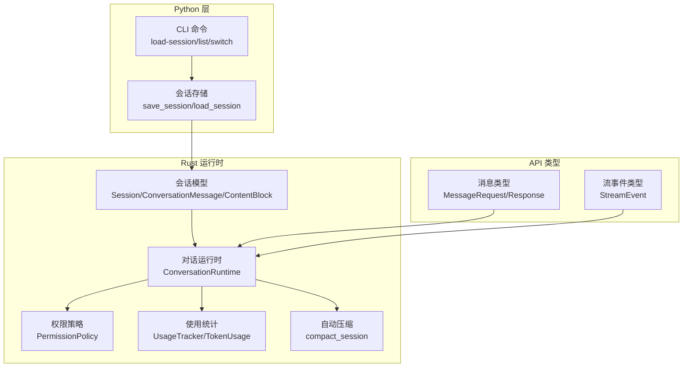
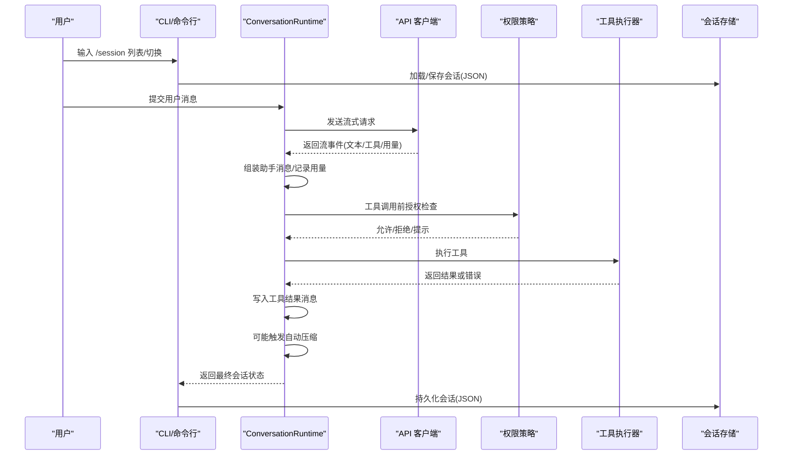
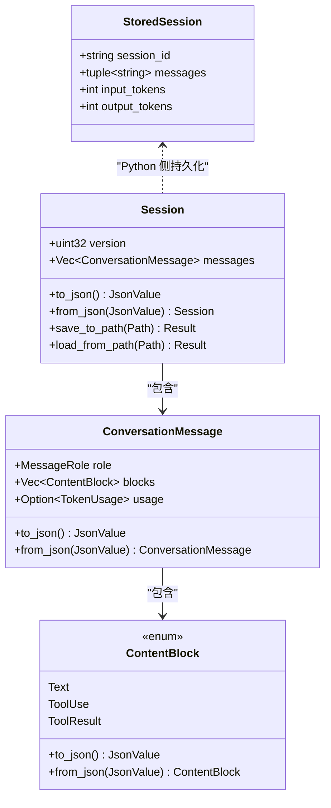
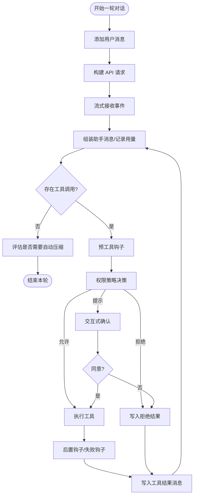
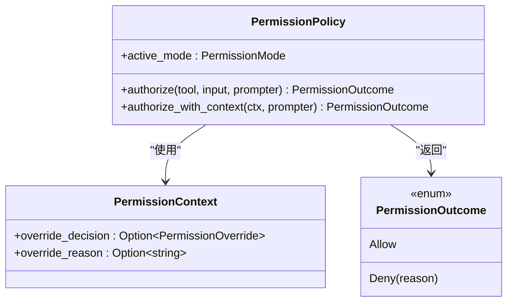
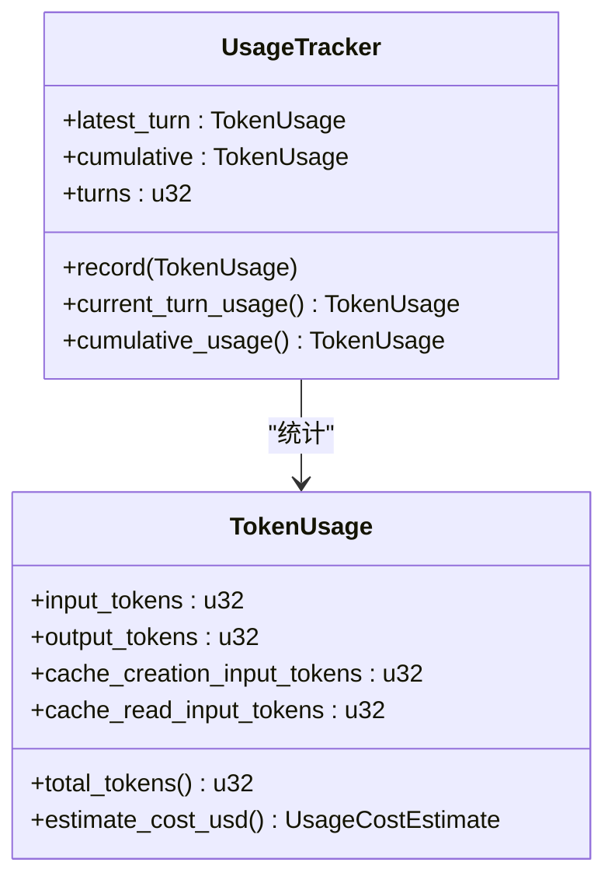
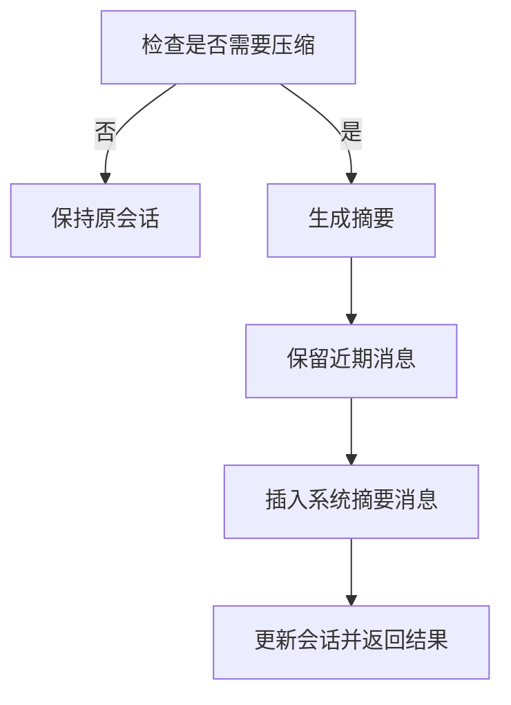
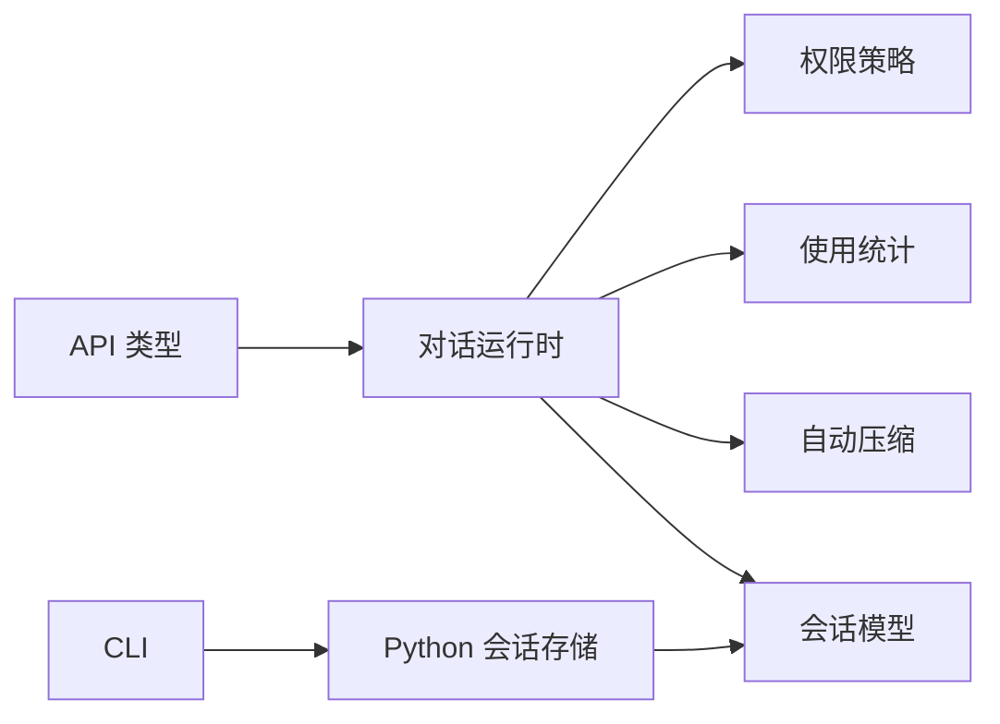

# 会话管理 API

<cite>
**本文引用的文件**
- [src/session_store.py](file://src/session_store.py)
- [src/main.py](file://src/main.py)
- [rust/crates/runtime/src/session.rs](file://rust/crates/runtime/src/session.rs)
- [rust/crates/runtime/src/conversation.rs](file://rust/crates/runtime/src/conversation.rs)
- [rust/crates/runtime/src/usage.rs](file://rust/crates/runtime/src/usage.rs)
- [rust/crates/runtime/src/permissions.rs](file://rust/crates/runtime/src/permissions.rs)
- [rust/crates/runtime/src/compact.rs](file://rust/crates/runtime/src/compact.rs)
- [rust/crates/api/src/types.rs](file://rust/crates/api/src/types.rs)
- [rust/crates/api/src/lib.rs](file://rust/crates/api/src/lib.rs)
- [rust/crates/rusty-claude-cli/src/main.rs](file://rust/crates/rusty-claude-cli/src/main.rs)
- [src/permissions.py](file://src/permissions.py)
</cite>

## 目录
1. [简介](#简介)
2. [项目结构](#项目结构)
3. [核心组件](#核心组件)
4. [架构总览](#架构总览)
5. [详细组件分析](#详细组件分析)
6. [依赖分析](#依赖分析)
7. [性能考虑](#性能考虑)
8. [故障排查指南](#故障排查指南)
9. [结论](#结论)
10. [附录](#附录)

## 简介
本文件为“会话管理 API”的权威接口文档，覆盖会话的创建、维护、持久化与恢复、状态查询、配置与超时、并发控制、权限集成以及使用统计等全生命周期能力。文档以 Rust 运行时为核心，同时说明 Python 层的会话加载与 CLI 操作，并给出调用流程图、类图与错误处理策略，帮助开发者在不同语言与运行环境下正确集成与扩展。

## 项目结构
围绕会话管理的关键模块分布如下：
- Rust 运行时：会话数据模型、消息与内容块、对话循环、权限策略、使用统计与自动压缩
- Python 层：会话持久化（JSON 文件）与命令行加载
- API 类型：消息请求/响应、流事件、工具定义与选择
- CLI：会话列表、切换与生成会话 ID 的辅助逻辑

图表来源
- [rust/crates/runtime/src/session.rs:42-136](file://rust/crates/runtime/src/session.rs#L42-L136)
- [rust/crates/runtime/src/conversation.rs:104-576](file://rust/crates/runtime/src/conversation.rs#L104-L576)
- [rust/crates/runtime/src/permissions.rs:91-325](file://rust/crates/runtime/src/permissions.rs#L91-L325)
- [rust/crates/runtime/src/usage.rs:162-209](file://rust/crates/runtime/src/usage.rs#L162-L209)
- [rust/crates/runtime/src/compact.rs:88-131](file://rust/crates/runtime/src/compact.rs#L88-L131)
- [rust/crates/api/src/types.rs:4-224](file://rust/crates/api/src/types.rs#L4-L224)
- [src/session_store.py:19-36](file://src/session_store.py#L19-L36)
- [src/main.py:65-170](file://src/main.py#L65-L170)

章节来源
- [src/session_store.py:19-36](file://src/session_store.py#L19-L36)
- [src/main.py:65-170](file://src/main.py#L65-L170)
- [rust/crates/runtime/src/session.rs:42-136](file://rust/crates/runtime/src/session.rs#L42-L136)
- [rust/crates/runtime/src/conversation.rs:104-576](file://rust/crates/runtime/src/conversation.rs#L104-L576)
- [rust/crates/runtime/src/usage.rs:162-209](file://rust/crates/runtime/src/usage.rs#L162-L209)
- [rust/crates/runtime/src/permissions.rs:91-325](file://rust/crates/runtime/src/permissions.rs#L91-L325)
- [rust/crates/runtime/src/compact.rs:88-131](file://rust/crates/runtime/src/compact.rs#L88-L131)
- [rust/crates/api/src/types.rs:4-224](file://rust/crates/api/src/types.rs#L4-L224)

## 核心组件
- 会话模型与持久化
  - Rust 侧：会话版本、消息数组、消息角色与内容块、序列化/反序列化
  - Python 侧：会话 ID、消息列表、输入/输出 token 统计、保存/加载 JSON 文件
- 对话运行时
  - 用户输入 → 构造请求 → 流式事件 → 组装助手消息 → 工具调用 → 权限校验 → 结果写回 → 自动压缩
- 权限控制
  - 模式（只读/工作区写/危险全权/提示/允许）、规则（允许/拒绝/询问）、钩子覆盖
- 使用统计与成本估算
  - TokenUsage、累计与单轮统计、按模型定价估算
- 自动压缩
  - 基于阈值估计 token 数量，保留近期消息，生成系统摘要消息
- API 类型
  - 请求/响应、内容块、工具定义与选择、流事件

章节来源
- [rust/crates/runtime/src/session.rs:42-136](file://rust/crates/runtime/src/session.rs#L42-L136)
- [src/session_store.py:8-36](file://src/session_store.py#L8-L36)
- [rust/crates/runtime/src/conversation.rs:316-501](file://rust/crates/runtime/src/conversation.rs#L316-L501)
- [rust/crates/runtime/src/permissions.rs:91-325](file://rust/crates/runtime/src/permissions.rs#L91-L325)
- [rust/crates/runtime/src/usage.rs:162-209](file://rust/crates/runtime/src/usage.rs#L162-L209)
- [rust/crates/runtime/src/compact.rs:88-131](file://rust/crates/runtime/src/compact.rs#L88-L131)
- [rust/crates/api/src/types.rs:4-224](file://rust/crates/api/src/types.rs#L4-L224)

## 架构总览
下图展示从用户输入到会话持久化的端到端流程，包括权限决策、工具执行与自动压缩。

图表来源
- [rust/crates/rusty-claude-cli/src/main.rs:1510-1551](file://rust/crates/rusty-claude-cli/src/main.rs#L1510-L1551)
- [rust/crates/runtime/src/conversation.rs:316-501](file://rust/crates/runtime/src/conversation.rs#L316-L501)
- [rust/crates/runtime/src/permissions.rs:165-284](file://rust/crates/runtime/src/permissions.rs#L165-L284)
- [rust/crates/runtime/src/compact.rs:88-131](file://rust/crates/runtime/src/compact.rs#L88-L131)
- [src/session_store.py:19-36](file://src/session_store.py#L19-L36)

## 详细组件分析

### 会话模型与持久化
- Rust 会话模型
  - 版本字段、消息数组、消息角色与内容块（文本/工具调用/工具结果）
  - 序列化/反序列化支持，含 token 使用信息
- Python 会话存储
  - 保存：将会话写入目录下的 JSON 文件
  - 加载：从 JSON 文件读取并构造会话对象
- CLI 会话管理
  - 列出会话、切换活动会话、生成会话 ID、解析会话引用

图表来源
- [rust/crates/runtime/src/session.rs:42-136](file://rust/crates/runtime/src/session.rs#L42-L136)
- [rust/crates/runtime/src/session.rs:144-249](file://rust/crates/runtime/src/session.rs#L144-L249)
- [rust/crates/runtime/src/session.rs:251-325](file://rust/crates/runtime/src/session.rs#L251-L325)
- [src/session_store.py:8-36](file://src/session_store.py#L8-L36)

章节来源
- [rust/crates/runtime/src/session.rs:42-136](file://rust/crates/runtime/src/session.rs#L42-L136)
- [rust/crates/runtime/src/session.rs:144-249](file://rust/crates/runtime/src/session.rs#L144-L249)
- [rust/crates/runtime/src/session.rs:251-325](file://rust/crates/runtime/src/session.rs#L251-L325)
- [src/session_store.py:8-36](file://src/session_store.py#L8-L36)
- [rust/crates/rusty-claude-cli/src/main.rs:1795-1819](file://rust/crates/rusty-claude-cli/src/main.rs#L1795-L1819)

### 对话运行时与工具执行
- 运行时职责
  - 将用户输入加入消息历史，发起 API 请求，聚合流事件，组装助手消息
  - 收集工具调用，进行权限决策，执行工具，写回工具结果
  - 记录 token 使用，可能触发自动压缩
- 工具执行器
  - 静态注册处理器，按名称分发执行
- 权限策略
  - 基于模式与规则的授权，支持钩子覆盖（允许/拒绝/提示）

图表来源
- [rust/crates/runtime/src/conversation.rs:316-501](file://rust/crates/runtime/src/conversation.rs#L316-L501)
- [rust/crates/runtime/src/permissions.rs:165-284](file://rust/crates/runtime/src/permissions.rs#L165-L284)
- [rust/crates/runtime/src/compact.rs:88-131](file://rust/crates/runtime/src/compact.rs#L88-L131)

章节来源
- [rust/crates/runtime/src/conversation.rs:316-501](file://rust/crates/runtime/src/conversation.rs#L316-L501)
- [rust/crates/runtime/src/permissions.rs:91-325](file://rust/crates/runtime/src/permissions.rs#L91-L325)
- [rust/crates/runtime/src/compact.rs:88-131](file://rust/crates/runtime/src/compact.rs#L88-L131)

### 权限控制与集成
- 权限模式
  - 只读、工作区写、危险全权、提示、允许
- 规则系统
  - allow/deny/ask 规则，支持精确匹配、前缀匹配与通配
- 钩子覆盖
  - 允许/拒绝/要求提示，优先级高于规则
- Python 侧工具权限上下文
  - 名称黑名单与前缀黑名单判定

图表来源
- [rust/crates/runtime/src/permissions.rs:91-325](file://rust/crates/runtime/src/permissions.rs#L91-L325)
- [src/permissions.py:6-21](file://src/permissions.py#L6-L21)

章节来源
- [rust/crates/runtime/src/permissions.rs:91-325](file://rust/crates/runtime/src/permissions.rs#L91-L325)
- [src/permissions.py:6-21](file://src/permissions.py#L6-L21)

### 使用统计与成本估算
- TokenUsage
  - 输入/输出/缓存写/缓存读 token
- UsageTracker
  - 单轮与累计统计、回合数
- 成本估算
  - 按模型定价估算总成本，支持默认与指定模型

图表来源
- [rust/crates/runtime/src/usage.rs:28-107](file://rust/crates/runtime/src/usage.rs#L28-L107)
- [rust/crates/runtime/src/usage.rs:162-209](file://rust/crates/runtime/src/usage.rs#L162-L209)

章节来源
- [rust/crates/runtime/src/usage.rs:28-107](file://rust/crates/runtime/src/usage.rs#L28-L107)
- [rust/crates/runtime/src/usage.rs:162-209](file://rust/crates/runtime/src/usage.rs#L162-L209)

### 自动压缩与恢复
- 压缩条件
  - 超过阈值且可压缩段长度大于保留近期消息数
- 压缩结果
  - 生成系统摘要消息，保留近期消息，更新会话
- 恢复流程
  - 通过加载 JSON 会话文件恢复状态；CLI 支持列出与切换

图表来源
- [rust/crates/runtime/src/compact.rs:37-47](file://rust/crates/runtime/src/compact.rs#L37-L47)
- [rust/crates/runtime/src/compact.rs:88-131](file://rust/crates/runtime/src/compact.rs#L88-L131)

章节来源
- [rust/crates/runtime/src/compact.rs:37-47](file://rust/crates/runtime/src/compact.rs#L37-L47)
- [rust/crates/runtime/src/compact.rs:88-131](file://rust/crates/runtime/src/compact.rs#L88-L131)
- [rust/crates/rusty-claude-cli/src/main.rs:1821-1853](file://rust/crates/rusty-claude-cli/src/main.rs#L1821-L1853)

### API 类型与流式事件
- 请求/响应
  - 消息请求包含模型、最大 token、消息数组、系统提示、工具定义与选择
  - 响应包含消息 ID、角色、内容块、用量、停止原因等
- 流事件
  - 消息开始/增量、内容块开始/增量/停止、消息停止
- 工具定义与结果
  - 工具名称、描述、输入 schema；工具结果支持文本与 JSON

章节来源
- [rust/crates/api/src/types.rs:4-224](file://rust/crates/api/src/types.rs#L4-L224)
- [rust/crates/api/src/lib.rs:6-17](file://rust/crates/api/src/lib.rs#L6-L17)

## 依赖分析
- 组件耦合
  - ConversationRuntime 依赖 Session、权限策略、工具执行器、使用统计与自动压缩
  - API 类型被 ConversationRuntime 用于构建请求与解析流事件
  - Python 会话存储与 CLI 依赖 Rust 会话模型进行读写
- 外部依赖
  - JSON 解析/渲染、文件系统 IO、环境变量（自动压缩阈值）

图表来源
- [rust/crates/runtime/src/conversation.rs:104-186](file://rust/crates/runtime/src/conversation.rs#L104-L186)
- [rust/crates/api/src/types.rs:4-224](file://rust/crates/api/src/types.rs#L4-L224)
- [src/session_store.py:19-36](file://src/session_store.py#L19-L36)
- [rust/crates/rusty-claude-cli/src/main.rs:1510-1551](file://rust/crates/rusty-claude-cli/src/main.rs#L1510-L1551)

章节来源
- [rust/crates/runtime/src/conversation.rs:104-186](file://rust/crates/runtime/src/conversation.rs#L104-L186)
- [rust/crates/api/src/types.rs:4-224](file://rust/crates/api/src/types.rs#L4-L224)
- [src/session_store.py:19-36](file://src/session_store.py#L19-L36)
- [rust/crates/rusty-claude-cli/src/main.rs:1510-1551](file://rust/crates/rusty-claude-cli/src/main.rs#L1510-L1551)

## 性能考虑
- 自动压缩
  - 基于估计 token 数量而非实际 token，减少上下文开销
  - 保留近期消息，避免丢失最新上下文
- 使用统计
  - 累计与单轮统计分离，便于监控与成本控制
- 流式处理
  - 事件驱动的消息拼接，降低内存峰值
- 权限钩子
  - 在工具调用前后执行，避免不必要的执行路径

[本节为通用指导，无需特定文件来源]

## 故障排查指南
- 会话加载失败
  - 检查 JSON 文件是否存在、格式是否正确、字段是否缺失
  - Rust 侧会抛出格式/IO 错误，Python 侧读取异常
- 权限拒绝
  - 检查权限模式与规则配置，确认工具名称与输入是否匹配规则
  - 钩子覆盖优先级高于规则
- 工具执行错误
  - 查看工具执行器返回的错误信息，确认工具名称与输入 schema
- 自动压缩未触发
  - 检查阈值设置与会话长度，确认可压缩段长度是否超过阈值
- CLI 会话操作
  - 确认会话 ID 或文件路径有效，使用列表查看可用会话

章节来源
- [rust/crates/runtime/src/session.rs:48-77](file://rust/crates/runtime/src/session.rs#L48-L77)
- [rust/crates/runtime/src/permissions.rs:165-284](file://rust/crates/runtime/src/permissions.rs#L165-L284)
- [rust/crates/runtime/src/compact.rs:37-47](file://rust/crates/runtime/src/compact.rs#L37-L47)
- [rust/crates/rusty-claude-cli/src/main.rs:1510-1551](file://rust/crates/rusty-claude-cli/src/main.rs#L1510-L1551)

## 结论
该会话管理 API 以 Rust 运行时为核心，结合 Python 存储与 CLI 工具，提供了完整的会话生命周期管理能力。通过权限策略、使用统计、自动压缩与流式事件处理，既保证了安全性与可观测性，也兼顾了性能与易用性。建议在生产环境中配合配置文件与钩子机制，实现细粒度的权限控制与审计追踪。

[本节为总结，无需特定文件来源]

## 附录

### 接口规范与调用示例

- 会话创建与加载
  - Python 侧
    - 保存会话：将会话写入目标目录，文件名为会话 ID + .json
    - 加载会话：根据会话 ID 读取 JSON 并构造对象
  - CLI 侧
    - 列出会话：遍历会话目录，显示最近修改时间与消息数量
    - 切换会话：加载指定会话并重建运行时
    - 生成会话 ID：基于当前时间毫秒数生成唯一标识

- 会话状态查询
  - 查询消息数量、输入/输出 token 统计
  - 获取累计用量与单轮用量

- 权限控制集成
  - 在工具调用前进行权限决策，支持钩子覆盖
  - 规则匹配工具名称与输入内容，必要时弹窗确认

- 使用统计与成本估算
  - 记录每轮 token 使用，支持按模型估算成本
  - 输出汇总行，包含总 token、输入/输出/缓存写/缓存读与总费用

- 自动压缩与恢复
  - 当满足阈值时自动生成系统摘要消息并保留近期消息
  - 通过 JSON 文件恢复会话状态

章节来源
- [src/session_store.py:19-36](file://src/session_store.py#L19-L36)
- [src/main.py:167-170](file://src/main.py#L167-L170)
- [rust/crates/rusty-claude-cli/src/main.rs:1510-1551](file://rust/crates/rusty-claude-cli/src/main.rs#L1510-L1551)
- [rust/crates/runtime/src/usage.rs:162-209](file://rust/crates/runtime/src/usage.rs#L162-L209)
- [rust/crates/runtime/src/permissions.rs:165-284](file://rust/crates/runtime/src/permissions.rs#L165-L284)
- [rust/crates/runtime/src/compact.rs:88-131](file://rust/crates/runtime/src/compact.rs#L88-L131)