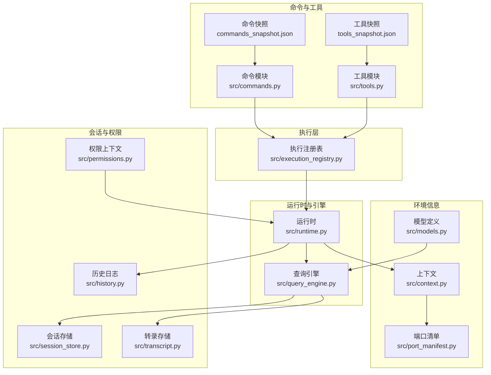
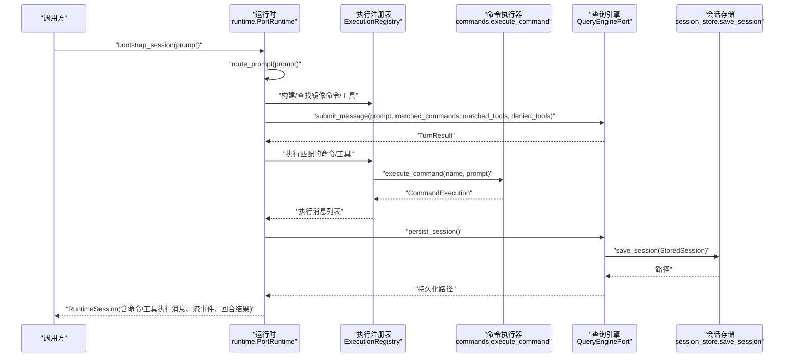
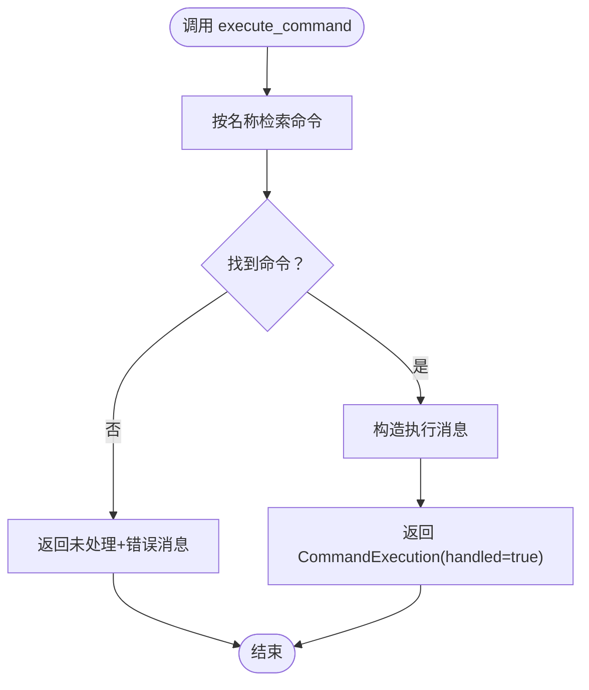
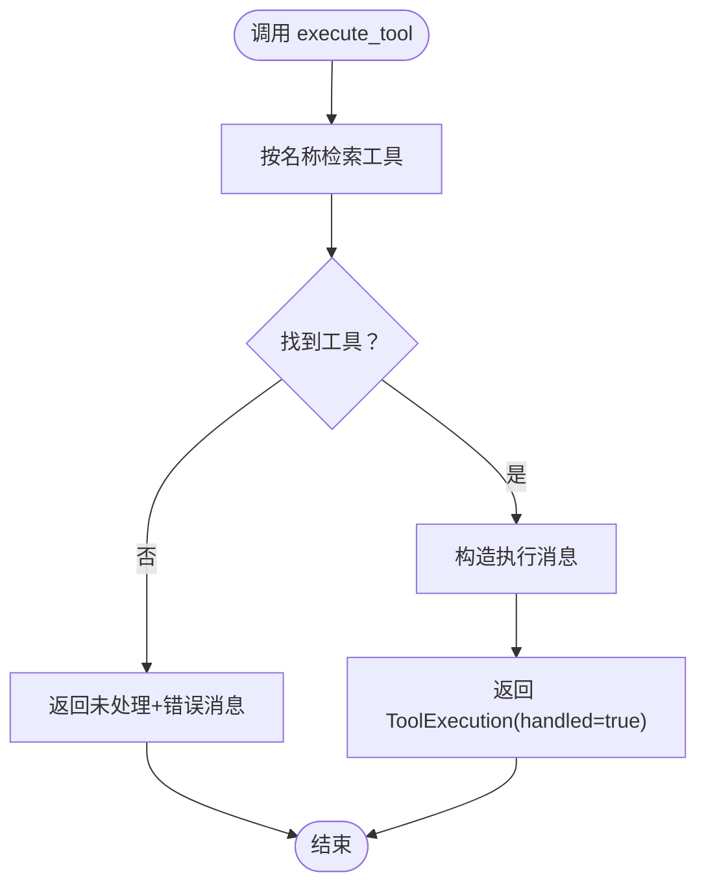
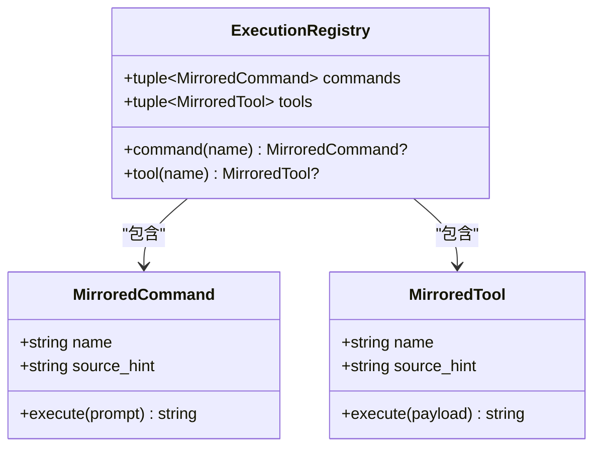
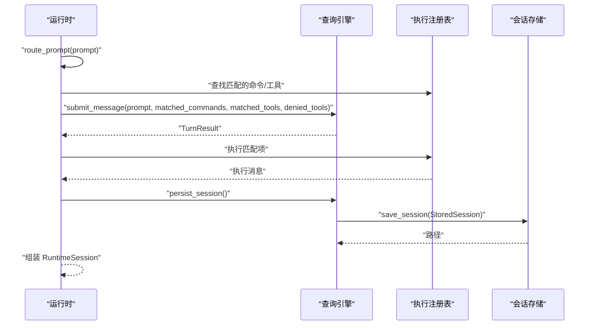
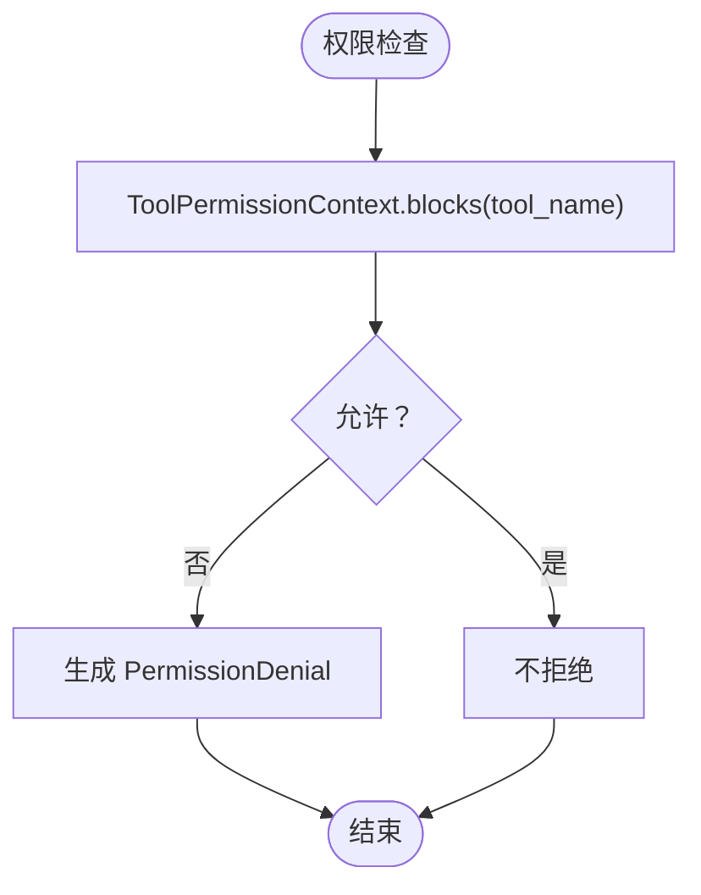
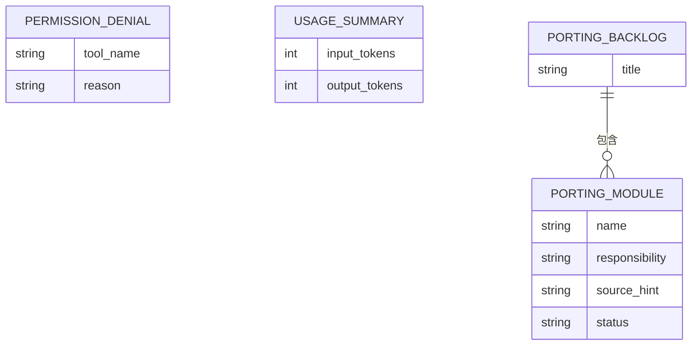
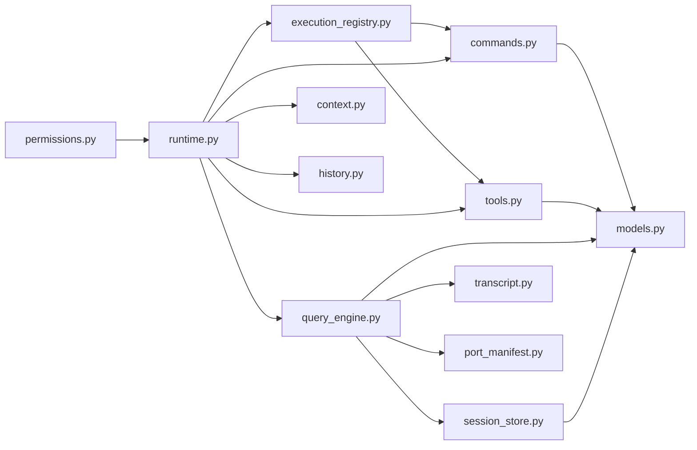

# 命令执行 API

<cite>
**本文引用的文件**
- [src/commands.py](file://src/commands.py)
- [src/tools.py](file://src/tools.py)
- [src/execution_registry.py](file://src/execution_registry.py)
- [src/runtime.py](file://src/runtime.py)
- [src/query_engine.py](file://src/query_engine.py)
- [src/session_store.py](file://src/session_store.py)
- [src/permissions.py](file://src/permissions.py)
- [src/models.py](file://src/models.py)
- [src/context.py](file://src/context.py)
- [src/transcript.py](file://src/transcript.py)
- [src/history.py](file://src/history.py)
- [src/port_manifest.py](file://src/port_manifest.py)
- [src/reference_data/commands_snapshot.json](file://src/reference_data/commands_snapshot.json)
- [src/reference_data/tools_snapshot.json](file://src/reference_data/tools_snapshot.json)
</cite>

## 目录
1. [简介](#简介)
2. [项目结构](#项目结构)
3. [核心组件](#核心组件)
4. [架构总览](#架构总览)
5. [详细组件分析](#详细组件分析)
6. [依赖分析](#依赖分析)
7. [性能考虑](#性能考虑)
8. [故障排查指南](#故障排查指南)
9. [结论](#结论)
10. [附录](#附录)

## 简介
本文件为“命令执行 API”的全面技术文档，聚焦于命令解析、执行流程与结果反馈机制，覆盖权限验证、执行状态跟踪、错误处理策略，并说明命令注册、动态加载与生命周期管理接口。文档同时解释命令执行与会话管理的集成关系，提供调用示例、参数验证规则与返回值格式说明，帮助开发者在不直接接触底层实现细节的情况下正确使用该 API。

## 项目结构
该系统围绕“命令镜像”与“工具镜像”两条主线构建，通过快照文件描述可执行能力面，运行时通过路由匹配选择命令或工具，结合查询引擎进行对话回合与会话持久化。关键模块如下：
- 命令与工具元数据：从 JSON 快照加载，形成只读集合
- 执行注册表：将镜像命令/工具包装为可执行对象
- 运行时：负责提示词路由、权限推断、回合循环与会话组装
- 查询引擎：承载对话回合、令牌预算控制、结构化输出与会话持久化
- 会话存储：保存/加载会话，支持转录压缩与重放
- 权限上下文：基于名称与前缀的工具访问控制
- 上下文与清单：提供工作区上下文与模块清单渲染

**图表来源**
- [src/commands.py:1-91](file://src/commands.py#L1-L91)
- [src/tools.py:1-97](file://src/tools.py#L1-L97)
- [src/execution_registry.py:1-52](file://src/execution_registry.py#L1-L52)
- [src/runtime.py:1-193](file://src/runtime.py#L1-L193)
- [src/query_engine.py:1-194](file://src/query_engine.py#L1-L194)
- [src/session_store.py:1-36](file://src/session_store.py#L1-L36)
- [src/permissions.py:1-21](file://src/permissions.py#L1-L21)
- [src/context.py:1-48](file://src/context.py#L1-L48)
- [src/transcript.py:1-24](file://src/transcript.py#L1-L24)
- [src/history.py:1-23](file://src/history.py#L1-L23)
- [src/port_manifest.py:1-53](file://src/port_manifest.py#L1-L53)
- [src/models.py:1-50](file://src/models.py#L1-L50)

**章节来源**
- [src/commands.py:1-91](file://src/commands.py#L1-L91)
- [src/tools.py:1-97](file://src/tools.py#L1-L97)
- [src/execution_registry.py:1-52](file://src/execution_registry.py#L1-L52)
- [src/runtime.py:1-193](file://src/runtime.py#L1-L193)
- [src/query_engine.py:1-194](file://src/query_engine.py#L1-L194)
- [src/session_store.py:1-36](file://src/session_store.py#L1-L36)
- [src/permissions.py:1-21](file://src/permissions.py#L1-L21)
- [src/context.py:1-48](file://src/context.py#L1-L48)
- [src/transcript.py:1-24](file://src/transcript.py#L1-L24)
- [src/history.py:1-23](file://src/history.py#L1-L23)
- [src/port_manifest.py:1-53](file://src/port_manifest.py#L1-L53)
- [src/models.py:1-50](file://src/models.py#L1-L50)

## 核心组件
- 命令与工具镜像
  - 命令镜像：从命令快照加载，提供命令名称、职责与来源提示；支持按名称检索、模糊查询、索引渲染等
  - 工具镜像：从工具快照加载，提供工具名称、职责与来源提示；支持权限过滤、简单模式筛选等
- 执行注册表
  - 将镜像命令/工具封装为可执行对象，暴露统一的 execute 接口，便于运行时调度
- 运行时
  - 路由提示词，匹配命令与工具；推断权限拒绝；驱动查询引擎提交回合；组装会话并持久化
- 查询引擎
  - 提交消息、流式事件、令牌预算控制、结构化输出、会话持久化与转录管理
- 会话与权限
  - 会话存取、转录压缩与重放、历史记录、权限上下文（基于名称/前缀）

**章节来源**
- [src/commands.py:75-91](file://src/commands.py#L75-L91)
- [src/tools.py:81-97](file://src/tools.py#L81-L97)
- [src/execution_registry.py:9-52](file://src/execution_registry.py#L9-L52)
- [src/runtime.py:89-193](file://src/runtime.py#L89-L193)
- [src/query_engine.py:35-194](file://src/query_engine.py#L35-L194)
- [src/session_store.py:8-36](file://src/session_store.py#L8-L36)
- [src/permissions.py:6-21](file://src/permissions.py#L6-L21)

## 架构总览
命令执行 API 的端到端流程如下：
- 输入提示词，运行时进行分词与匹配，生成候选命令/工具列表
- 查询引擎根据回合限制与预算控制输出当前回合结果
- 执行注册表将匹配项映射为可执行对象并触发执行
- 结果经查询引擎格式化后返回，同时写入会话存储与转录

**图表来源**
- [src/runtime.py:109-152](file://src/runtime.py#L109-L152)
- [src/execution_registry.py:47-52](file://src/execution_registry.py#L47-L52)
- [src/commands.py:75-81](file://src/commands.py#L75-L81)
- [src/query_engine.py:61-104](file://src/query_engine.py#L61-L104)
- [src/session_store.py:19-24](file://src/session_store.py#L19-L24)

## 详细组件分析

### 命令执行接口规范
- 接口目标
  - 提供命令解析、执行与结果反馈的统一入口
  - 支持权限推断与错误处理
  - 与会话管理集成，支持回合循环与持久化
- 关键函数与行为
  - 命令检索与索引
    - 按名称精确匹配（大小写不敏感）
    - 模糊查询（名称或来源提示包含关键词）
    - 渲染命令索引（可限制数量与查询条件）
  - 命令执行
    - execute_command(name, prompt): 返回 CommandExecution 对象，包含是否已处理与消息
    - 若未找到命令，返回未处理状态与错误消息
  - 结果结构
    - CommandExecution 包含 name、source_hint、prompt、handled、message 字段
- 参数与返回值
  - 参数
    - name: 命令名称（字符串）
    - prompt: 用户提示词（字符串，默认空串）
    - limit: 查询/索引限制（整数，默认 20）
  - 返回值
    - 命令检索：PortingModule 或 None
    - 命令执行：CommandExecution
    - 索引渲染：字符串（多行文本）
- 错误处理
  - 未知命令：handled=false，message 包含错误提示
  - 其他异常：由上层调用方捕获并处理（本模块不抛出异常）

**图表来源**
- [src/commands.py:75-81](file://src/commands.py#L75-L81)

**章节来源**
- [src/commands.py:48-91](file://src/commands.py#L48-L91)
- [src/commands.py:75-81](file://src/commands.py#L75-L81)
- [src/models.py:14-21](file://src/models.py#L14-L21)

### 工具执行接口规范
- 接口目标
  - 提供工具检索、权限过滤与执行的统一入口
- 关键函数与行为
  - 工具检索与过滤
    - 按名称检索、模糊查询、权限上下文过滤、简单模式筛选、MCP 过滤
  - 工具执行
    - execute_tool(name, payload): 返回 ToolExecution 对象，包含是否已处理与消息
    - 若未找到工具，返回未处理状态与错误消息
- 参数与返回值
  - 参数
    - name: 工具名称（字符串）
    - payload: 工具载荷（字符串，默认空串）
    - simple_mode: 是否仅保留少数核心工具（布尔，默认 False）
    - include_mcp: 是否包含 MCP 工具（布尔，默认 True）
    - permission_context: 权限上下文（ToolPermissionContext，默认 None）
  - 返回值
    - 工具检索：PortingModule 或 None
    - 工具执行：ToolExecution
- 错误处理
  - 未知工具：handled=false，message 包含错误提示

**图表来源**
- [src/tools.py:81-87](file://src/tools.py#L81-L87)

**章节来源**
- [src/tools.py:62-97](file://src/tools.py#L62-L97)
- [src/tools.py:81-87](file://src/tools.py#L81-L87)
- [src/permissions.py:6-21](file://src/permissions.py#L6-L21)

### 执行注册表与生命周期
- 组件职责
  - 将镜像命令/工具封装为可执行对象（MirroredCommand/MirroredTool）
  - 提供统一的 command/tool 查找方法
  - 在运行时构建注册表，驱动执行
- 生命周期
  - 构建：build_execution_registry() 一次性创建
  - 使用：运行时按需查找并执行
  - 销毁：无显式销毁逻辑，随进程生命周期结束

**图表来源**
- [src/execution_registry.py:9-52](file://src/execution_registry.py#L9-L52)

**章节来源**
- [src/execution_registry.py:27-52](file://src/execution_registry.py#L27-L52)

### 运行时与会话管理集成
- 路由与匹配
  - 将提示词分词后与命令/工具名称、来源提示进行评分匹配
  - 优先选取各类型首个高分项，再补充其他候选
- 权限推断
  - 针对特定工具（如 Bash）推断权限拒绝
- 回合与持久化
  - 通过查询引擎提交回合，获取 TurnResult
  - 收集命令/工具执行消息，组装 RuntimeSession
  - 持久化会话至文件系统

**图表来源**
- [src/runtime.py:89-152](file://src/runtime.py#L89-L152)
- [src/query_engine.py:140-150](file://src/query_engine.py#L140-L150)
- [src/session_store.py:19-24](file://src/session_store.py#L19-L24)

**章节来源**
- [src/runtime.py:89-193](file://src/runtime.py#L89-L193)
- [src/query_engine.py:61-104](file://src/query_engine.py#L61-L104)

### 权限验证与错误处理策略
- 权限验证
  - ToolPermissionContext 支持基于名称集合与前缀集合的阻断判断
  - 运行时对工具匹配进行权限推断，生成 PermissionDenial 列表
- 错误处理
  - 命令/工具未知：返回未处理状态与错误消息
  - 回合超限或预算超支：查询引擎设置停止原因并返回当前回合结果
  - 结构化输出失败：重试并最终抛出运行时错误

**图表来源**
- [src/permissions.py:18-21](file://src/permissions.py#L18-L21)
- [src/runtime.py:169-174](file://src/runtime.py#L169-L174)

**章节来源**
- [src/permissions.py:6-21](file://src/permissions.py#L6-L21)
- [src/runtime.py:169-174](file://src/runtime.py#L169-L174)
- [src/query_engine.py:61-104](file://src/query_engine.py#L61-L104)

### 数据模型与快照加载
- 数据模型
  - PortingModule：命令/工具元数据
  - PermissionDenial：权限拒绝
  - UsageSummary：令牌用量统计
  - PortingBacklog：回溯清单摘要
- 快照加载
  - 命令与工具分别从 JSON 文件加载，缓存为只读元组
  - 提供构建回溯清单、名称列表、检索与查询函数

**图表来源**
- [src/models.py:14-50](file://src/models.py#L14-L50)
- [src/commands.py:22-42](file://src/commands.py#L22-L42)
- [src/tools.py:23-42](file://src/tools.py#L23-L42)

**章节来源**
- [src/models.py:14-50](file://src/models.py#L14-L50)
- [src/commands.py:22-42](file://src/commands.py#L22-L42)
- [src/tools.py:23-42](file://src/tools.py#L23-L42)

## 依赖分析
- 模块耦合
  - commands 与 tools 依赖 models 定义的数据结构
  - execution_registry 依赖 commands 与 tools 的镜像集合
  - runtime 依赖 commands、tools、execution_registry、query_engine、context、history
  - query_engine 依赖 models、session_store、transcript、port_manifest
  - session_store 依赖 models 的 StoredSession
  - permissions 与 runtime 协作完成权限推断
- 外部依赖
  - JSON 快照文件作为静态配置源
  - 文件系统用于会话持久化

**图表来源**
- [src/commands.py:1-91](file://src/commands.py#L1-L91)
- [src/tools.py:1-97](file://src/tools.py#L1-L97)
- [src/execution_registry.py:1-52](file://src/execution_registry.py#L1-L52)
- [src/runtime.py:1-193](file://src/runtime.py#L1-L193)
- [src/query_engine.py:1-194](file://src/query_engine.py#L1-L194)
- [src/session_store.py:1-36](file://src/session_store.py#L1-L36)
- [src/permissions.py:1-21](file://src/permissions.py#L1-L21)
- [src/context.py:1-48](file://src/context.py#L1-L48)
- [src/transcript.py:1-24](file://src/transcript.py#L1-L24)
- [src/history.py:1-23](file://src/history.py#L1-L23)
- [src/port_manifest.py:1-53](file://src/port_manifest.py#L1-L53)
- [src/models.py:1-50](file://src/models.py#L1-L50)

**章节来源**
- [src/commands.py:1-91](file://src/commands.py#L1-L91)
- [src/tools.py:1-97](file://src/tools.py#L1-L97)
- [src/execution_registry.py:1-52](file://src/execution_registry.py#L1-L52)
- [src/runtime.py:1-193](file://src/runtime.py#L1-L193)
- [src/query_engine.py:1-194](file://src/query_engine.py#L1-L194)
- [src/session_store.py:1-36](file://src/session_store.py#L1-L36)
- [src/permissions.py:1-21](file://src/permissions.py#L1-L21)
- [src/context.py:1-48](file://src/context.py#L1-L48)
- [src/transcript.py:1-24](file://src/transcript.py#L1-L24)
- [src/history.py:1-23](file://src/history.py#L1-L23)
- [src/port_manifest.py:1-53](file://src/port_manifest.py#L1-L53)
- [src/models.py:1-50](file://src/models.py#L1-L50)

## 性能考虑
- 缓存策略
  - 命令与工具快照加载使用 LRU 缓存，避免重复 IO
- 内存与时间复杂度
  - 命令/工具检索为线性扫描，适合小到中等规模清单
  - 路由评分基于分词集合，复杂度与提示词长度和清单规模相关
- 会话与转录
  - 转录在达到阈值后进行压缩，减少内存占用
  - 会话持久化采用异步写入，降低阻塞风险

[本节为通用性能建议，无需具体文件分析]

## 故障排查指南
- 常见问题
  - 未知命令/工具：检查名称大小写与拼写，确认快照中是否存在
  - 权限被拒绝：检查 ToolPermissionContext 的 deny_names 与 deny_prefixes 设置
  - 回合超限或预算超支：调整 QueryEngineConfig 的 max_turns 与 max_budget_tokens
  - 结构化输出失败：检查负载是否可序列化，必要时禁用结构化输出
- 调试建议
  - 启用历史记录与会话持久化，复现问题场景
  - 使用索引渲染功能快速定位可用命令/工具
  - 分步调用运行时路由与查询引擎，定位瓶颈

**章节来源**
- [src/commands.py:75-81](file://src/commands.py#L75-L81)
- [src/tools.py:81-87](file://src/tools.py#L81-L87)
- [src/runtime.py:169-174](file://src/runtime.py#L169-L174)
- [src/query_engine.py:61-104](file://src/query_engine.py#L61-L104)
- [src/history.py:12-23](file://src/history.py#L12-L23)

## 结论
命令执行 API 以“镜像命令/工具 + 执行注册表 + 运行时 + 查询引擎”的分层设计，实现了从提示词路由、权限推断、执行调度到会话持久化的完整闭环。其接口简洁、职责清晰，既满足快速集成需求，又具备良好的扩展性与可观测性。通过合理的参数校验、错误处理与性能优化策略，可在实际工程中稳定落地。

[本节为总结性内容，无需具体文件分析]

## 附录

### API 规范速查
- 命令
  - 名称检索：get_command(name)
  - 模糊查询：find_commands(query, limit)
  - 执行：execute_command(name, prompt)
  - 索引渲染：render_command_index(limit, query)
- 工具
  - 名称检索：get_tool(name)
  - 权限过滤：filter_tools_by_permission_context(tools, permission_context)
  - 简单模式：get_tools(simple_mode=True)
  - 执行：execute_tool(name, payload)
  - 索引渲染：render_tool_index(limit, query)
- 注册表
  - 构建：build_execution_registry()
  - 查找：ExecutionRegistry.command(name)/tool(name)
- 运行时
  - 路由：PortRuntime.route_prompt(prompt, limit)
  - 会话：PortRuntime.bootstrap_session(prompt, limit)
  - 回合循环：PortRuntime.run_turn_loop(prompt, limit, max_turns, structured_output)
- 查询引擎
  - 配置：QueryEngineConfig
  - 提交：QueryEnginePort.submit_message(...)
  - 流式：QueryEnginePort.stream_submit_message(...)
  - 持久化：QueryEnginePort.persist_session()

**章节来源**
- [src/commands.py:52-91](file://src/commands.py#L52-L91)
- [src/tools.py:48-97](file://src/tools.py#L48-L97)
- [src/execution_registry.py:47-52](file://src/execution_registry.py#L47-L52)
- [src/runtime.py:89-167](file://src/runtime.py#L89-L167)
- [src/query_engine.py:15-194](file://src/query_engine.py#L15-L194)