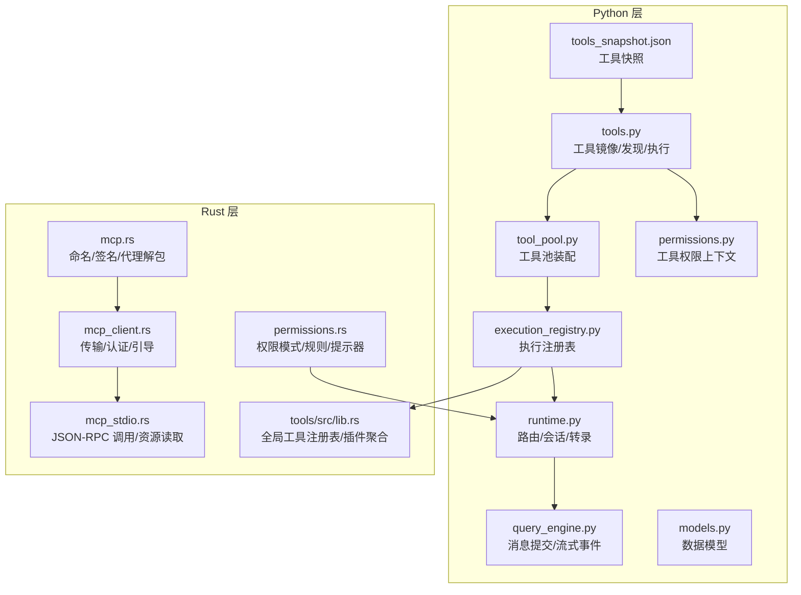
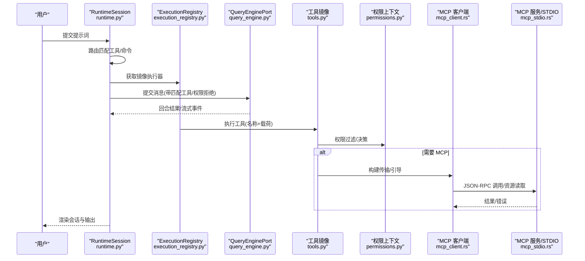
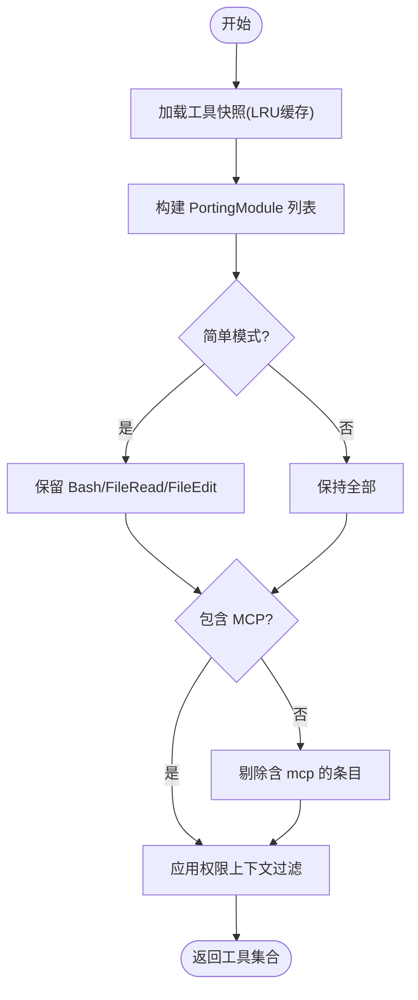
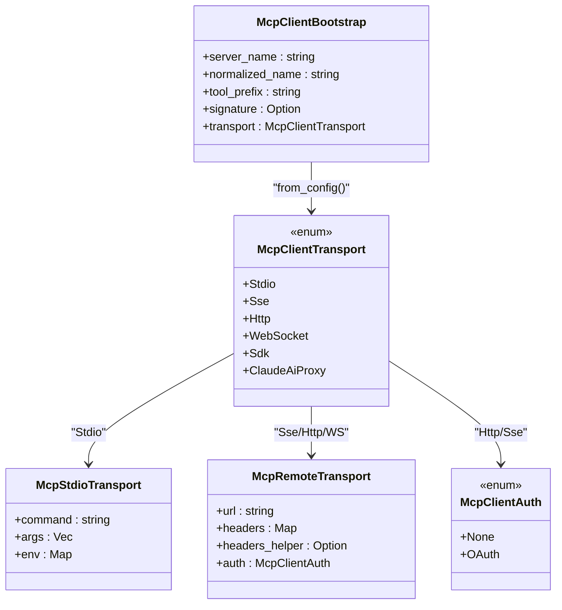
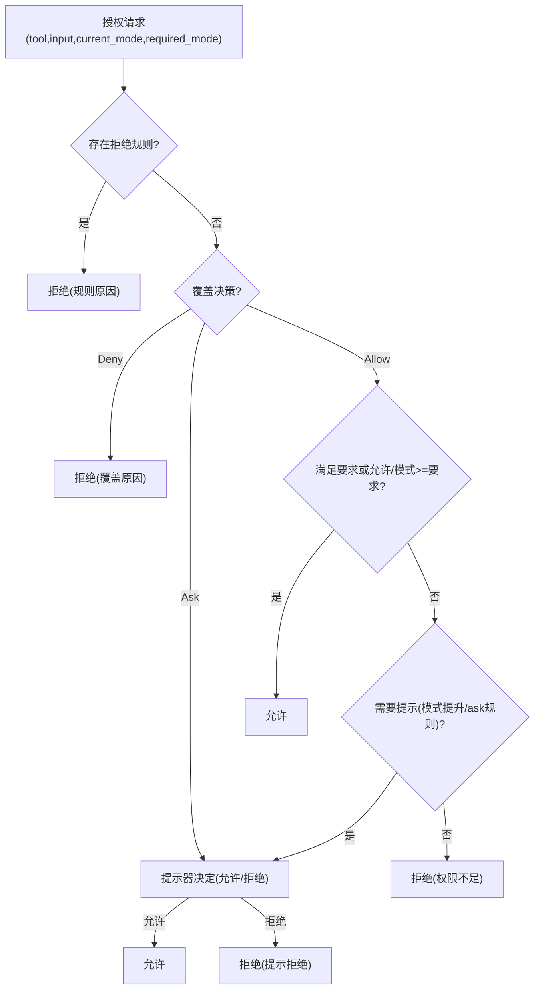
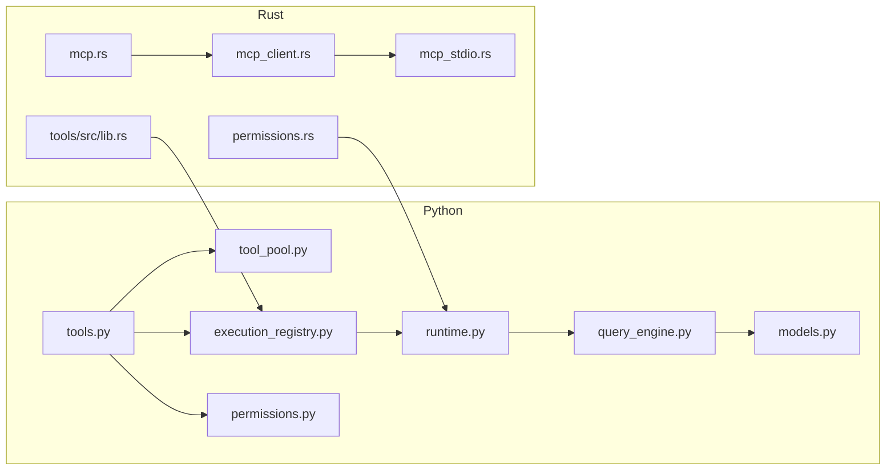

# 工具执行 API

<cite>
**本文引用的文件**
- [src/tools.py](file://src/tools.py)
- [src/tool_pool.py](file://src/tool_pool.py)
- [src/execution_registry.py](file://src/execution_registry.py)
- [src/permissions.py](file://src/permissions.py)
- [src/runtime.py](file://src/runtime.py)
- [src/models.py](file://src/models.py)
- [src/query_engine.py](file://src/query_engine.py)
- [src/reference_data/tools_snapshot.json](file://src/reference_data/tools_snapshot.json)
- [rust/crates/runtime/src/mcp.rs](file://rust/crates/runtime/src/mcp.rs)
- [rust/crates/runtime/src/mcp_client.rs](file://rust/crates/runtime/src/mcp_client.rs)
- [rust/crates/runtime/src/mcp_stdio.rs](file://rust/crates/runtime/src/mcp_stdio.rs)
- [rust/crates/runtime/src/permissions.rs](file://rust/crates/runtime/src/permissions.rs)
- [rust/crates/tools/src/lib.rs](file://rust/crates/tools/src/lib.rs)
</cite>

## 目录
1. [简介](#简介)
2. [项目结构](#项目结构)
3. [核心组件](#核心组件)
4. [架构总览](#架构总览)
5. [详细组件分析](#详细组件分析)
6. [依赖分析](#依赖分析)
7. [性能考虑](#性能考虑)
8. [故障排查指南](#故障排查指南)
9. [结论](#结论)
10. [附录：API 规范与示例](#附录api-规范与示例)

## 简介
本文件为“工具执行 API”的技术参考文档，覆盖以下主题：
- 工具发现、调用与结果处理机制
- 工具聚合、MCP 协议支持与权限控制接口
- 工具注册、动态加载与生命周期管理
- 具体调用示例、参数格式与错误处理方案
- 工具执行与权限系统的集成方式与安全机制

该系统由 Python 层的工具镜像与路由、会话与查询引擎，以及 Rust 层的 MCP 客户端、权限策略与插件工具注册表共同组成，形成从“意图识别—工具匹配—权限校验—执行—结果回流”的闭环。

## 项目结构
围绕工具执行的关键模块分布如下：
- Python 层
  - 工具镜像与索引：tools.py、tool_pool.py、permissions.py、models.py、reference_data/tools_snapshot.json
  - 执行编排：execution_registry.py、runtime.py、query_engine.py
- Rust 层
  - MCP 支持：mcp.rs、mcp_client.rs、mcp_stdio.rs
  - 权限策略：permissions.rs
  - 插件与工具注册：tools/src/lib.rs

图表来源
- [src/tools.py:1-97](file://src/tools.py#L1-L97)
- [src/tool_pool.py:1-38](file://src/tool_pool.py#L1-L38)
- [src/permissions.py:1-21](file://src/permissions.py#L1-L21)
- [src/execution_registry.py:1-52](file://src/execution_registry.py#L1-L52)
- [src/runtime.py:1-193](file://src/runtime.py#L1-L193)
- [src/query_engine.py:1-194](file://src/query_engine.py#L1-L194)
- [src/models.py:1-50](file://src/models.py#L1-L50)
- [src/reference_data/tools_snapshot.json:1-800](file://src/reference_data/tools_snapshot.json#L1-L800)
- [rust/crates/runtime/src/mcp.rs:1-301](file://rust/crates/runtime/src/mcp.rs#L1-L301)
- [rust/crates/runtime/src/mcp_client.rs:1-237](file://rust/crates/runtime/src/mcp_client.rs#L1-L237)
- [rust/crates/runtime/src/mcp_stdio.rs:181-1351](file://rust/crates/runtime/src/mcp_stdio.rs#L181-L1351)
- [rust/crates/runtime/src/permissions.rs:1-676](file://rust/crates/runtime/src/permissions.rs#L1-L676)
- [rust/crates/tools/src/lib.rs:218-258](file://rust/crates/tools/src/lib.rs#L218-L258)

章节来源
- [src/tools.py:1-97](file://src/tools.py#L1-L97)
- [src/tool_pool.py:1-38](file://src/tool_pool.py#L1-L38)
- [src/permissions.py:1-21](file://src/permissions.py#L1-L21)
- [src/execution_registry.py:1-52](file://src/execution_registry.py#L1-L52)
- [src/runtime.py:1-193](file://src/runtime.py#L1-L193)
- [src/query_engine.py:1-194](file://src/query_engine.py#L1-L194)
- [src/models.py:1-50](file://src/models.py#L1-L50)
- [src/reference_data/tools_snapshot.json:1-800](file://src/reference_data/tools_snapshot.json#L1-L800)
- [rust/crates/runtime/src/mcp.rs:1-301](file://rust/crates/runtime/src/mcp.rs#L1-L301)
- [rust/crates/runtime/src/mcp_client.rs:1-237](file://rust/crates/runtime/src/mcp_client.rs#L1-L237)
- [rust/crates/runtime/src/mcp_stdio.rs:181-1351](file://rust/crates/runtime/src/mcp_stdio.rs#L181-L1351)
- [rust/crates/runtime/src/permissions.rs:1-676](file://rust/crates/runtime/src/permissions.rs#L1-L676)
- [rust/crates/tools/src/lib.rs:218-258](file://rust/crates/tools/src/lib.rs#L218-L258)

## 核心组件
- 工具镜像与发现
  - 通过工具快照构建工具集合，支持按名称、源路径提示词检索与过滤（含简单模式与是否包含 MCP 工具）
  - 提供工具权限过滤能力，结合工具权限上下文进行屏蔽
- 工具池装配
  - 将过滤后的工具集合封装为可渲染的工具池对象
- 执行注册表
  - 将工具与命令映射为可执行的镜像对象，并提供按名称查找
- 路由与会话
  - 基于提示词分词与工具元信息打分，选择候选工具/命令
  - 构建运行时会话，收集命令与工具执行消息、权限拒绝、流式事件与最终输出
- 查询引擎
  - 提交消息、生成回合结果、流式事件与会话持久化
- Rust 层 MCP 支持
  - 名称规范化、工具前缀生成、服务器签名与 CCR 代理 URL 解包
  - 传输类型抽象（STDIO/HTTP/SSE/WS/OAuth/SDK/代理）、客户端引导
  - JSON-RPC 工具调用与资源读取，错误响应处理
- 权限策略
  - 模式驱动（只读/工作区写/危险全权/提示/允许），规则匹配（允许/拒绝/询问），提示器接口
- 插件与工具注册
  - 全局工具注册表聚合插件工具，执行时解析输入并分发到内置或插件处理器

章节来源
- [src/tools.py:23-97](file://src/tools.py#L23-L97)
- [src/tool_pool.py:28-38](file://src/tool_pool.py#L28-L38)
- [src/execution_registry.py:27-52](file://src/execution_registry.py#L27-L52)
- [src/runtime.py:89-193](file://src/runtime.py#L89-L193)
- [src/query_engine.py:35-194](file://src/query_engine.py#L35-L194)
- [rust/crates/runtime/src/mcp.rs:7-81](file://rust/crates/runtime/src/mcp.rs#L7-L81)
- [rust/crates/runtime/src/mcp_client.rs:48-120](file://rust/crates/runtime/src/mcp_client.rs#L48-L120)
- [rust/crates/runtime/src/mcp_stdio.rs:181-1351](file://rust/crates/runtime/src/mcp_stdio.rs#L181-L1351)
- [rust/crates/runtime/src/permissions.rs:99-325](file://rust/crates/runtime/src/permissions.rs#L99-L325)
- [rust/crates/tools/src/lib.rs:218-258](file://rust/crates/tools/src/lib.rs#L218-L258)

## 架构总览
下图展示从用户提示到工具执行与结果回流的整体流程，以及 Rust 层 MCP 与权限策略的集成点。

图表来源
- [src/runtime.py:109-152](file://src/runtime.py#L109-L152)
- [src/execution_registry.py:47-52](file://src/execution_registry.py#L47-L52)
- [src/query_engine.py:61-128](file://src/query_engine.py#L61-L128)
- [src/tools.py:81-87](file://src/tools.py#L81-L87)
- [src/permissions.py:11-21](file://src/permissions.py#L11-L21)
- [rust/crates/runtime/src/mcp_client.rs:57-68](file://rust/crates/runtime/src/mcp_client.rs#L57-L68)
- [rust/crates/runtime/src/mcp_stdio.rs:181-1351](file://rust/crates/runtime/src/mcp_stdio.rs#L181-L1351)

## 详细组件分析

### 组件一：工具发现与镜像执行
- 工具快照与缓存
  - 通过 LRU 缓存加载工具快照，转换为镜像模块集合
- 发现与过滤
  - 支持简单模式（仅 Bash/FileRead/FileEdit）与排除 MCP
  - 权限上下文屏蔽特定工具名或前缀
- 执行镜像
  - 未知工具返回未处理状态与消息；已知工具返回“将处理”的描述性消息

图表来源
- [src/tools.py:23-73](file://src/tools.py#L23-L73)
- [src/permissions.py:11-21](file://src/permissions.py#L11-L21)

章节来源
- [src/tools.py:23-97](file://src/tools.py#L23-L97)
- [src/permissions.py:11-21](file://src/permissions.py#L11-L21)

### 组件二：工具池装配
- 将过滤后的工具集合封装为工具池对象，支持渲染 Markdown 摘要
- 作为后续执行注册表与运行时会话的输入

章节来源
- [src/tool_pool.py:28-38](file://src/tool_pool.py#L28-L38)

### 组件三：执行注册表
- 将工具与命令分别映射为镜像执行器
- 提供按名称查找，用于运行时直接调用

章节来源
- [src/execution_registry.py:27-52](file://src/execution_registry.py#L27-L52)

### 组件四：路由与会话
- 路由
  - 对提示词进行分词，基于工具名称、源路径提示词与职责进行打分，优先选择命令与工具
- 会话
  - 收集上下文、设置、启动步骤、系统初始化消息、历史、命令/工具执行消息、流式事件与最终输出
  - 权限拒绝推断（如 Bash 类工具在当前镜像中被限制）

章节来源
- [src/runtime.py:89-193](file://src/runtime.py#L89-L193)

### 组件五：查询引擎
- 提交消息与流式事件
  - 生成 message_start/message_delta/message_stop 等事件
  - 记录匹配的命令/工具与权限拒绝
- 会话持久化
  - 保存会话与令牌用量

章节来源
- [src/query_engine.py:61-150](file://src/query_engine.py#L61-L150)

### 组件六：MCP 协议支持（Rust）
- 名称与前缀
  - 规范化工具/服务器名称，生成工具前缀，便于统一标识
- 服务器签名
  - 基于配置内容生成稳定签名，支持 STDIO/HTTP/SSE/WS/SDK/代理等
- 传输与引导
  - 抽象传输类型与认证（OAuth/无），从配置生成引导信息
- JSON-RPC 调用
  - 支持列出工具、调用工具、读取资源，错误码与消息标准化

图表来源
- [rust/crates/runtime/src/mcp_client.rs:6-120](file://rust/crates/runtime/src/mcp_client.rs#L6-L120)

章节来源
- [rust/crates/runtime/src/mcp.rs:7-81](file://rust/crates/runtime/src/mcp.rs#L7-L81)
- [rust/crates/runtime/src/mcp_client.rs:6-120](file://rust/crates/runtime/src/mcp_client.rs#L6-L120)
- [rust/crates/runtime/src/mcp_stdio.rs:181-1351](file://rust/crates/runtime/src/mcp_stdio.rs#L181-L1351)

### 组件七：权限控制接口
- 模式与覆盖
  - 模式：只读/工作区写/危险全权/提示/允许
  - 上下文覆盖：允许/拒绝/询问，可携带原因
- 规则匹配
  - 允许/拒绝/询问规则，支持任意/精确/前缀匹配
  - 从输入 JSON 中提取敏感字段（如命令/路径/URL 等）作为匹配主体
- 授权流程
  - 优先拒绝规则，其次检查覆盖，再评估询问/允许规则与模式阈值，必要时触发提示器

图表来源
- [rust/crates/runtime/src/permissions.rs:99-325](file://rust/crates/runtime/src/permissions.rs#L99-L325)

章节来源
- [rust/crates/runtime/src/permissions.rs:99-325](file://rust/crates/runtime/src/permissions.rs#L99-L325)

### 组件八：插件与工具注册（动态加载）
- 全局工具注册表
  - 聚合插件工具，执行时根据名称查找并分发到内置或插件处理器
  - 输入 JSON 校验与错误包装
- 生命周期
  - 插件管理器负责安装、初始化与关闭，确保运行时生命周期一致

章节来源
- [rust/crates/tools/src/lib.rs:218-258](file://rust/crates/tools/src/lib.rs#L218-L258)

## 依赖分析
- Python 层内部依赖
  - tools.py 依赖 models 与 permissions，提供工具集合与权限过滤
  - tool_pool.py 依赖 tools 与 permissions，装配工具池
  - execution_registry.py 依赖 tools 与 commands，构建执行镜像
  - runtime.py 依赖 tools、execution_registry、query_engine 与 models
  - query_engine.py 依赖 tools、commands、models、session_store、transcript
- Rust 层依赖
  - mcp.rs 与 mcp_client.rs 为 MCP 传输与引导的核心
  - mcp_stdio.rs 提供 JSON-RPC 实现
  - permissions.rs 为权限策略核心
  - tools/src/lib.rs 负责工具注册与插件聚合

图表来源
- [src/tools.py:1-97](file://src/tools.py#L1-L97)
- [src/tool_pool.py:1-38](file://src/tool_pool.py#L1-L38)
- [src/execution_registry.py:1-52](file://src/execution_registry.py#L1-L52)
- [src/runtime.py:1-193](file://src/runtime.py#L1-L193)
- [src/query_engine.py:1-194](file://src/query_engine.py#L1-L194)
- [src/permissions.py:1-21](file://src/permissions.py#L1-L21)
- [src/models.py:1-50](file://src/models.py#L1-L50)
- [rust/crates/runtime/src/mcp.rs:1-301](file://rust/crates/runtime/src/mcp.rs#L1-L301)
- [rust/crates/runtime/src/mcp_client.rs:1-237](file://rust/crates/runtime/src/mcp_client.rs#L1-L237)
- [rust/crates/runtime/src/mcp_stdio.rs:181-1351](file://rust/crates/runtime/src/mcp_stdio.rs#L181-L1351)
- [rust/crates/runtime/src/permissions.rs:1-676](file://rust/crates/runtime/src/permissions.rs#L1-L676)
- [rust/crates/tools/src/lib.rs:218-258](file://rust/crates/tools/src/lib.rs#L218-L258)

## 性能考虑
- 工具快照缓存
  - 使用 LRU 缓存避免重复解析工具快照
- 分词与打分
  - 路由阶段对提示词进行轻量分词与集合匹配，复杂度与提示词长度线性相关
- 会话压缩
  - 当消息数量超过阈值时，仅保留最近若干条，降低上下文开销
- 权限规则匹配
  - 规则列表较短时，匹配成本低；建议合理组织规则以减少扫描范围

[本节为通用指导，无需列出具体文件来源]

## 故障排查指南
- 工具未找到
  - 现象：执行返回“未知镜像工具”
  - 排查：确认工具名称大小写、是否被权限上下文屏蔽、是否在工具快照中
- 权限拒绝
  - 现象：工具被拒绝或触发提示
  - 排查：检查权限模式、规则配置、覆盖上下文与提示器决策
- MCP 调用失败
  - 现象：JSON-RPC 错误响应（如 -32001）
  - 排查：核对传输配置、认证参数、服务器可达性与协议版本
- 会话持久化异常
  - 现象：保存失败或令牌统计异常
  - 排查：检查存储路径权限、序列化失败重试逻辑

章节来源
- [src/tools.py:81-87](file://src/tools.py#L81-L87)
- [rust/crates/runtime/src/mcp_stdio.rs:1429-1453](file://rust/crates/runtime/src/mcp_stdio.rs#L1429-L1453)
- [src/query_engine.py:140-150](file://src/query_engine.py#L140-L150)

## 结论
本系统通过“Python 工具镜像 + Rust MCP/权限”双层架构，实现了从工具发现、路由匹配、权限控制到执行与结果回流的完整链路。Python 层负责工具快照与会话编排，Rust 层提供稳健的 MCP 通信与严格的权限策略，二者协同保证了功能完整性与安全性。

[本节为总结，无需列出具体文件来源]

## 附录：API 规范与示例

### 工具发现与过滤 API
- 接口
  - 加载工具快照：返回工具模块元组
  - 构建工具池：返回工具池对象
  - 获取工具集合：支持简单模式、是否包含 MCP、权限上下文过滤
  - 按名称/提示词检索：返回匹配工具列表
- 参数
  - simple_mode: 布尔，是否仅保留 Bash/FileRead/FileEdit
  - include_mcp: 布尔，是否包含 MCP 工具
  - permission_context: 工具权限上下文，屏蔽指定名称或前缀
  - query/limit: 检索关键词与上限
- 返回
  - 工具模块元组或工具池对象
- 示例
  - 获取简单模式工具集合
  - 按关键词“Bash”检索工具并限制返回数量

章节来源
- [src/tools.py:23-97](file://src/tools.py#L23-L97)
- [src/tool_pool.py:28-38](file://src/tool_pool.py#L28-L38)

### 工具执行 API
- 接口
  - 执行工具：传入工具名称与载荷，返回执行结果对象（含是否处理、消息）
- 参数
  - name: 工具名称
  - payload: 字符串载荷（描述性或 JSON 字符串）
- 返回
  - 工具执行结果对象（handled/message/source_hint）
- 示例
  - 执行 Bash 工具并传入命令字符串
  - 执行 FileRead 工具并传入文件路径

章节来源
- [src/tools.py:81-87](file://src/tools.py#L81-L87)

### 执行注册表 API
- 接口
  - 构建执行注册表：将工具与命令映射为镜像执行器
  - 查找执行器：按名称返回命令或工具执行器
- 返回
  - 注册表对象与执行器实例

章节来源
- [src/execution_registry.py:47-52](file://src/execution_registry.py#L47-L52)

### 路由与会话 API
- 接口
  - 路由提示词：返回候选工具/命令及其得分
  - 引导会话：构建运行时会话，包含上下文、设置、历史、执行消息、流式事件与最终输出
- 参数
  - prompt: 用户提示词
  - limit/max_turns/structured_output: 控制路由数量、最大回合数与结构化输出
- 返回
  - 路由匹配列表与运行时会话对象

章节来源
- [src/runtime.py:89-193](file://src/runtime.py#L89-L193)

### 查询引擎 API
- 接口
  - 提交消息：返回回合结果（含匹配工具/命令、权限拒绝、使用统计、停止原因）
  - 流式提交：产生 message_start/message_delta/message_stop 等事件
  - 会话持久化：保存会话与令牌用量
- 参数
  - prompt/matched_commands/matched_tools/denied_tools: 输入与匹配/拒绝信息
- 返回
  - 回合结果对象与事件流

章节来源
- [src/query_engine.py:61-150](file://src/query_engine.py#L61-L150)

### 权限控制 API
- 接口
  - 权限模式：只读/工作区写/危险全权/提示/允许
  - 权限规则：允许/拒绝/询问，支持任意/精确/前缀匹配
  - 授权：根据工具名与输入进行授权决策，必要时触发提示器
- 参数
  - tool_name/input/current_mode/required_mode/permission_context/prompter
- 返回
  - 允许/拒绝（含原因）

章节来源
- [rust/crates/runtime/src/permissions.rs:99-325](file://rust/crates/runtime/src/permissions.rs#L99-L325)

### MCP 协议 API（Rust）
- 接口
  - 名称规范化与工具前缀生成
  - 服务器签名与 CCR 代理 URL 解包
  - 传输类型与认证配置
  - JSON-RPC 工具调用与资源读取
- 参数
  - 配置对象（STDIO/HTTP/SSE/WS/OAuth/SDK/代理）
  - 工具名称与参数
- 返回
  - 成功结果或标准错误码/消息

章节来源
- [rust/crates/runtime/src/mcp.rs:7-81](file://rust/crates/runtime/src/mcp.rs#L7-L81)
- [rust/crates/runtime/src/mcp_client.rs:6-120](file://rust/crates/runtime/src/mcp_client.rs#L6-L120)
- [rust/crates/runtime/src/mcp_stdio.rs:181-1351](file://rust/crates/runtime/src/mcp_stdio.rs#L181-L1351)

### 插件与工具注册 API（Rust）
- 接口
  - 聚合插件工具
  - 执行工具：解析输入 JSON 并分发到内置或插件处理器
- 参数
  - 工具名称与输入 JSON
- 返回
  - 执行结果字符串或错误

章节来源
- [rust/crates/tools/src/lib.rs:218-258](file://rust/crates/tools/src/lib.rs#L218-L258)