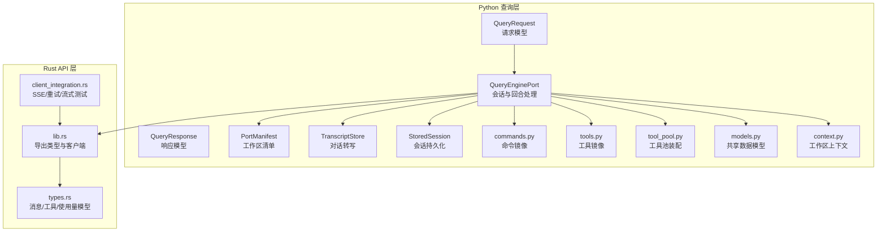
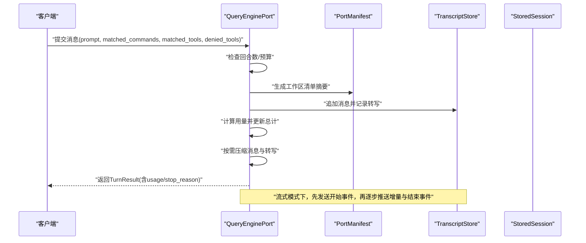
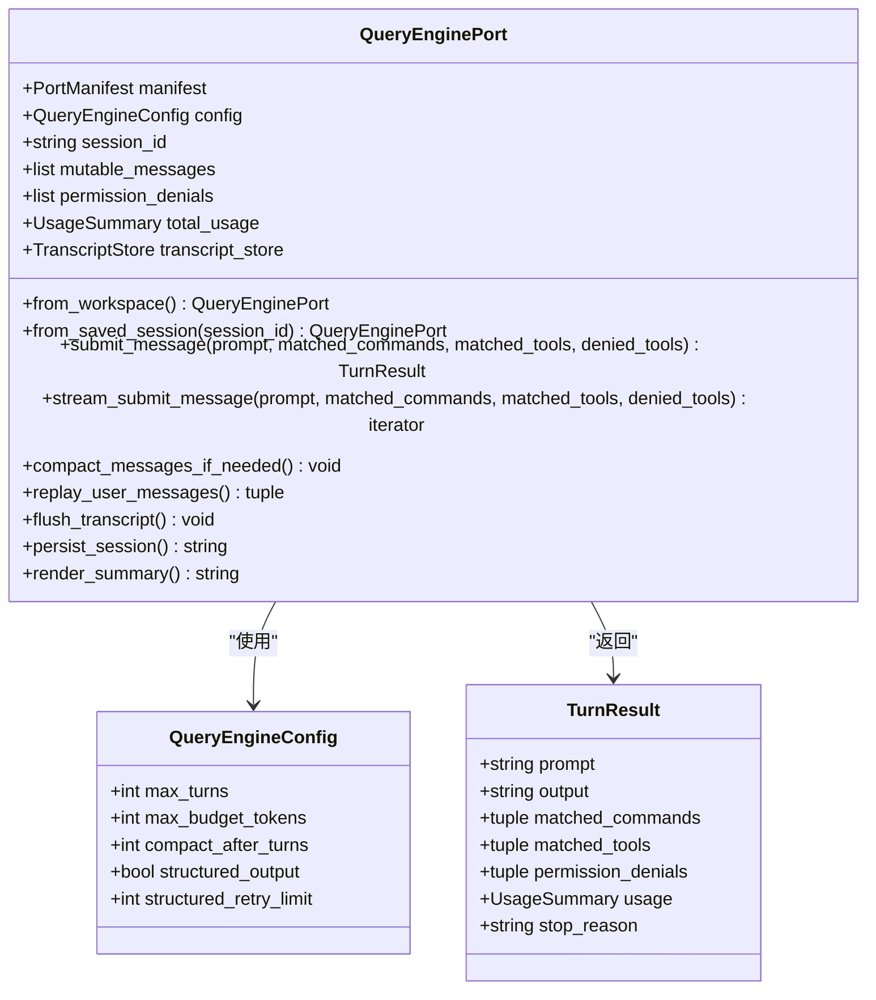
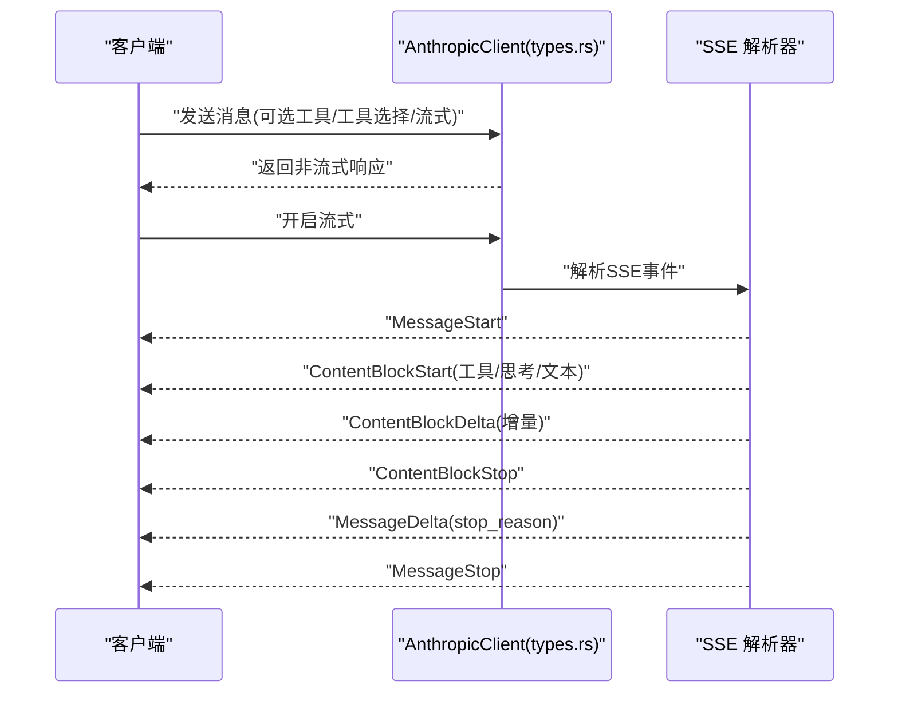
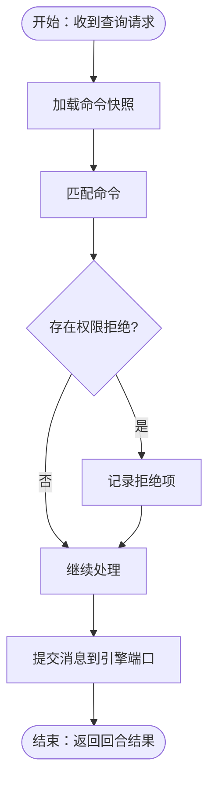
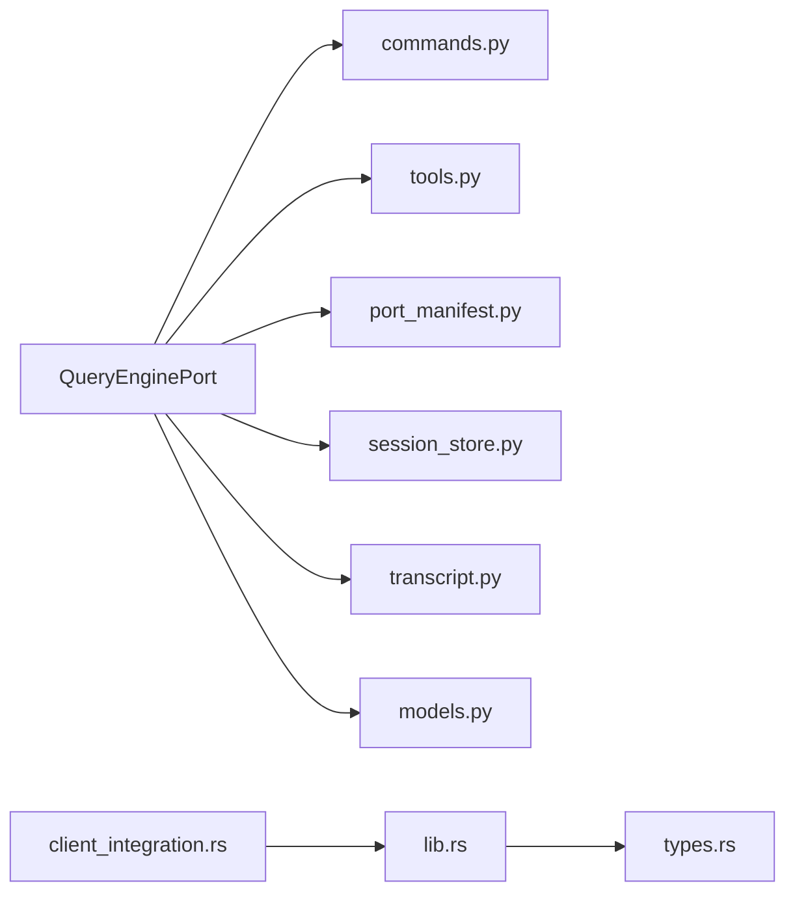
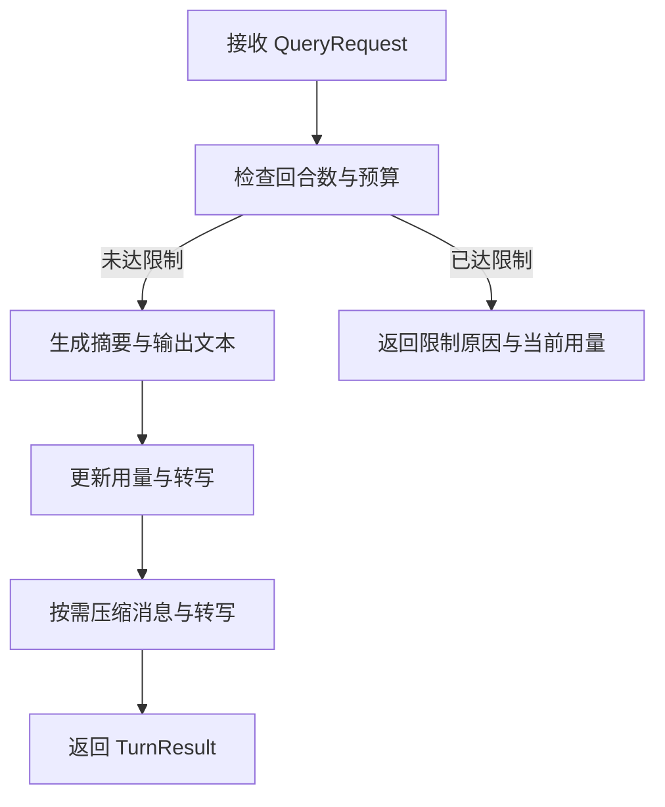

# 查询引擎 API

<cite>
**本文引用的文件**
- [src/query_engine.py](file://src/query_engine.py)
- [src/query.py](file://src/query.py)
- [src/context.py](file://src/context.py)
- [src/commands.py](file://src/commands.py)
- [src/tools.py](file://src/tools.py)
- [src/tool_pool.py](file://src/tool_pool.py)
- [src/models.py](file://src/models.py)
- [src/port_manifest.py](file://src/port_manifest.py)
- [src/session_store.py](file://src/session_store.py)
- [src/transcript.py](file://src/transcript.py)
- [rust/crates/api/src/lib.rs](file://rust/crates/api/src/lib.rs)
- [rust/crates/api/src/types.rs](file://rust/crates/api/src/types.rs)
- [rust/crates/api/tests/client_integration.rs](file://rust/crates/api/tests/client_integration.rs)
- [src/reference_data/commands_snapshot.json](file://src/reference_data/commands_snapshot.json)
- [src/reference_data/tools_snapshot.json](file://src/reference_data/tools_snapshot.json)
</cite>

## 目录
1. [简介](#简介)
2. [项目结构](#项目结构)
3. [核心组件](#核心组件)
4. [架构总览](#架构总览)
5. [详细组件分析](#详细组件分析)
6. [依赖关系分析](#依赖关系分析)
7. [性能考量](#性能考量)
8. [故障排查指南](#故障排查指南)
9. [结论](#结论)
10. [附录](#附录)

## 简介
本文件为“查询引擎 API”的权威接口文档，面向需要在系统中集成或扩展查询能力的开发者。文档覆盖以下要点：
- 查询请求与响应的数据模型与字段定义
- 查询处理流程、上下文管理与会话持久化机制
- 结果返回格式与流式输出事件模型
- 与命令系统（Commands）和工具系统（Tools）的集成方式及数据流转
- 错误处理与异常场景说明
- 性能优化建议与最佳实践

## 项目结构
查询引擎位于 Python 源码树中，围绕会话、转写、预算控制与命令/工具匹配展开；同时通过 Rust 的 API 客户端对接外部推理服务（如 Anthropic），并提供 SSE 流式事件解析。

图表来源
- [src/query_engine.py:1-194](file://src/query_engine.py#L1-L194)
- [src/query.py:1-14](file://src/query.py#L1-L14)
- [src/port_manifest.py:1-53](file://src/port_manifest.py#L1-L53)
- [src/transcript.py:1-24](file://src/transcript.py#L1-L24)
- [src/session_store.py:1-36](file://src/session_store.py#L1-L36)
- [src/commands.py:1-91](file://src/commands.py#L1-L91)
- [src/tools.py:1-97](file://src/tools.py#L1-L97)
- [src/tool_pool.py:1-38](file://src/tool_pool.py#L1-L38)
- [src/models.py:1-50](file://src/models.py#L1-L50)
- [src/context.py:1-48](file://src/context.py#L1-L48)
- [rust/crates/api/src/lib.rs:1-18](file://rust/crates/api/src/lib.rs#L1-L18)
- [rust/crates/api/src/types.rs:1-224](file://rust/crates/api/src/types.rs#L1-L224)
- [rust/crates/api/tests/client_integration.rs:1-565](file://rust/crates/api/tests/client_integration.rs#L1-L565)

章节来源
- [src/query_engine.py:1-194](file://src/query_engine.py#L1-L194)
- [src/query.py:1-14](file://src/query.py#L1-L14)
- [rust/crates/api/src/lib.rs:1-18](file://rust/crates/api/src/lib.rs#L1-L18)
- [rust/crates/api/src/types.rs:1-224](file://rust/crates/api/src/types.rs#L1-L224)

## 核心组件
- 查询请求与响应
  - 请求模型：包含用户输入提示词
  - 响应模型：包含文本内容
- 查询引擎端口（QueryEnginePort）
  - 会话管理：保存会话 ID、消息列表、权限拒绝记录、累计用量
  - 转写存储：记录对话历史并支持压缩
  - 配置：最大回合数、最大预算令牌、结构化输出开关与重试限制
  - 处理方法：提交消息、流式提交消息、回合结果对象
- 工作区清单（PortManifest）
  - 统计顶层模块、文件数量，并以 Markdown 形式渲染
- 会话持久化（StoredSession）
  - 将会话序列化到本地目录，支持加载与保存
- 命令与工具镜像
  - 从快照 JSON 加载命令/工具元数据，提供查找、过滤与执行占位
- 工具池装配（ToolPool）
  - 基于权限上下文与模式选项装配可用工具集合
- 共享模型（models.py）
  - 权限拒绝、用量统计、模块/子系统描述、回溯清单等
- 上下文构建（context.py）
  - 构建工作区根路径、文件计数与归档可用性信息

章节来源
- [src/query.py:6-14](file://src/query.py#L6-L14)
- [src/query_engine.py:15-104](file://src/query_engine.py#L15-L104)
- [src/port_manifest.py:12-53](file://src/port_manifest.py#L12-L53)
- [src/session_store.py:8-36](file://src/session_store.py#L8-L36)
- [src/commands.py:13-81](file://src/commands.py#L13-L81)
- [src/tools.py:14-87](file://src/tools.py#L14-L87)
- [src/tool_pool.py:10-38](file://src/tool_pool.py#L10-L38)
- [src/models.py:6-50](file://src/models.py#L6-L50)
- [src/context.py:7-48](file://src/context.py#L7-L48)

## 架构总览
查询引擎 API 的核心交互链路如下：
- 客户端发起查询请求（文本提示）
- 引擎端口接收请求，进行回合预算与回合数检查
- 计算输出文本（可选结构化格式），更新用量与转写
- 返回回合结果；若启用流式，则分阶段推送事件
- 可选：与命令/工具系统协作（当前为镜像元数据与占位执行）

图表来源
- [src/query_engine.py:61-127](file://src/query_engine.py#L61-L127)
- [src/port_manifest.py:30-53](file://src/port_manifest.py#L30-L53)
- [src/transcript.py:11-24](file://src/transcript.py#L11-L24)
- [src/session_store.py:19-36](file://src/session_store.py#L19-L36)

## 详细组件分析

### 查询请求与响应模型
- QueryRequest
  - 字段：prompt（字符串）
- QueryResponse
  - 字段：text（字符串）

章节来源
- [src/query.py:6-14](file://src/query.py#L6-L14)

### QueryEnginePort（查询引擎端口）
- 关键职责
  - 会话生命周期管理：创建、恢复、持久化
  - 回合处理：预算与回合数控制、用量统计、转写压缩
  - 输出格式：普通文本或结构化 JSON（带重试）
  - 流式输出：事件类型包括消息开始、命令/工具匹配、权限拒绝、增量文本、消息停止
- 数据结构
  - 配置：QueryEngineConfig（最大回合、最大预算、紧凑阈值、结构化输出、重试次数）
  - 回合结果：TurnResult（prompt、output、matched_commands、matched_tools、permission_denials、usage、stop_reason）
  - 端口：QueryEnginePort（manifest、config、session_id、mutable_messages、permission_denials、total_usage、transcript_store）
- 方法
  - from_workspace / from_saved_session：构建端口实例
  - submit_message：提交单轮消息并返回回合结果
  - stream_submit_message：流式提交消息，按事件类型推送
  - compact_messages_if_needed：按阈值压缩消息与转写
  - replay_user_messages / flush_transcript：转写回放与刷新
  - persist_session：保存会话至本地
  - render_summary：生成工作区与会话摘要

图表来源
- [src/query_engine.py:15-104](file://src/query_engine.py#L15-L104)

章节来源
- [src/query_engine.py:15-194](file://src/query_engine.py#L15-L194)

### 流式输出事件模型（Rust API）
- 事件类型
  - MessageStart：消息开始，携带初始响应头
  - ContentBlockStart：内容块开始（文本/思考/工具调用）
  - ContentBlockDelta：内容块增量（文本/思考/签名/工具输入片段）
  - ContentBlockStop：内容块结束
  - MessageDelta：消息增量（包含停止原因等）
  - MessageStop：消息结束
- 消息请求/响应
  - MessageRequest：模型、最大输出令牌、消息数组、系统提示、工具定义、工具选择、是否流式
  - MessageResponse：消息 ID、角色、内容块、模型、停止原因、使用量、请求 ID
- 使用量
  - Usage：输入/输出令牌，以及缓存相关字段

图表来源
- [rust/crates/api/src/types.rs:4-224](file://rust/crates/api/src/types.rs#L4-L224)
- [rust/crates/api/tests/client_integration.rs:120-205](file://rust/crates/api/tests/client_integration.rs#L120-L205)

章节来源
- [rust/crates/api/src/types.rs:4-224](file://rust/crates/api/src/types.rs#L4-L224)
- [rust/crates/api/tests/client_integration.rs:120-284](file://rust/crates/api/tests/client_integration.rs#L120-L284)

### 命令系统集成
- 命令镜像
  - 从快照 JSON 加载命令元数据，提供名称、职责、来源提示
  - 支持查找、过滤（插件/技能）、执行占位（返回可执行动作描述）
- 与查询引擎的集成
  - 查询端口在回合中可传入 matched_commands 与 denied_tools，用于记录与展示
  - 查询端口在结构化输出中可包含命令/工具匹配与权限拒绝信息

图表来源
- [src/commands.py:22-81](file://src/commands.py#L22-L81)
- [src/query_engine.py:61-104](file://src/query_engine.py#L61-L104)

章节来源
- [src/commands.py:13-91](file://src/commands.py#L13-L91)
- [src/reference_data/commands_snapshot.json:1-200](file://src/reference_data/commands_snapshot.json#L1-L200)

### 工具系统集成
- 工具镜像
  - 从快照 JSON 加载工具元数据，支持简单模式、MCP 过滤与权限上下文过滤
  - 提供工具索引渲染、查找与执行占位
- 工具池装配
  - 基于权限上下文与模式选项装配可用工具集合
- 与查询引擎的集成
  - 查询端口在回合中可传入 matched_tools 与 denied_tools，用于记录与展示
  - 查询端口在结构化输出中可包含工具匹配与权限拒绝信息

章节来源
- [src/tools.py:14-97](file://src/tools.py#L14-L97)
- [src/tool_pool.py:10-38](file://src/tool_pool.py#L10-L38)
- [src/reference_data/tools_snapshot.json:1-200](file://src/reference_data/tools_snapshot.json#L1-L200)

### 上下文与工作区清单
- 工作区上下文
  - 包含源码根、测试根、资源根、归档根、文件计数与归档可用性
- 工作区清单
  - 统计顶层模块与文件数量，生成 Markdown 渲染

章节来源
- [src/context.py:7-48](file://src/context.py#L7-L48)
- [src/port_manifest.py:12-53](file://src/port_manifest.py#L12-L53)

### 会话持久化与转写
- 会话持久化
  - 保存 StoredSession 至本地目录，支持加载
- 转写存储
  - 追加消息、压缩保留最近 N 条、回放与刷新标记

章节来源
- [src/session_store.py:8-36](file://src/session_store.py#L8-L36)
- [src/transcript.py:6-24](file://src/transcript.py#L6-L24)

## 依赖关系分析
- 查询引擎端口依赖
  - 命令与工具镜像：用于匹配与记录
  - 工作区清单：用于摘要渲染
  - 会话存储：用于保存/加载
  - 转写存储：用于记录对话历史
  - 共享模型：用量统计、权限拒绝等
- Rust API 层依赖
  - 类型定义与客户端封装，提供消息请求/响应、SSE 事件解析与重试策略

图表来源
- [src/query_engine.py:7-12](file://src/query_engine.py#L7-L12)
- [rust/crates/api/src/lib.rs:1-18](file://rust/crates/api/src/lib.rs#L1-L18)
- [rust/crates/api/tests/client_integration.rs:1-10](file://rust/crates/api/tests/client_integration.rs#L1-L10)

章节来源
- [src/query_engine.py:1-12](file://src/query_engine.py#L1-L12)
- [rust/crates/api/src/lib.rs:1-18](file://rust/crates/api/src/lib.rs#L1-L18)

## 性能考量
- 回合预算与紧凑策略
  - 合理设置最大回合数与最大预算令牌，避免内存膨胀与超预算
  - 在达到紧凑阈值后仅保留最近 N 条消息，降低上下文长度
- 结构化输出重试
  - 结构化输出失败时自动重试有限次数，确保稳定性
- 流式输出
  - 使用 SSE 流式事件可尽早感知工具调用与中间增量，提升用户体验
- 工具与命令过滤
  - 在工具池装配时按需过滤（如简单模式、MCP 排除、权限限制），减少不必要的上下文与调用

章节来源
- [src/query_engine.py:161-169](file://src/query_engine.py#L161-L169)
- [src/query_engine.py:129-132](file://src/query_engine.py#L129-L132)
- [src/tool_pool.py:28-38](file://src/tool_pool.py#L28-L38)
- [rust/crates/api/tests/client_integration.rs:120-205](file://rust/crates/api/tests/client_integration.rs#L120-L205)

## 故障排查指南
- 常见错误与处理
  - 达到最大回合数：stop_reason 为 max_turns_reached，建议清理历史或调整阈值
  - 超过预算令牌：stop_reason 为 max_budget_reached，建议缩短提示或减少工具调用
  - 结构化输出渲染失败：触发重试上限后抛出运行时错误，检查输出内容是否可序列化
  - 未知命令/工具：执行占位返回未识别条目，确认名称大小写与来源提示
- 会话加载失败
  - 检查会话文件是否存在、JSON 格式是否正确
- 流式事件解析
  - 确认 SSE 事件顺序与类型，关注 MessageDelta 中的 stop_reason 与 MessageStop

章节来源
- [src/query_engine.py:68-95](file://src/query_engine.py#L68-L95)
- [src/query_engine.py:161-169](file://src/query_engine.py#L161-L169)
- [src/session_store.py:27-36](file://src/session_store.py#L27-L36)
- [rust/crates/api/tests/client_integration.rs:286-365](file://rust/crates/api/tests/client_integration.rs#L286-L365)

## 结论
查询引擎 API 提供了简洁而强大的会话与回合处理能力，结合命令/工具镜像与工作区清单，能够快速构建面向代码迁移与工程理解的智能查询体验。通过合理的预算与紧凑策略、结构化输出与流式事件，可在保证性能的同时提供良好的交互体验。建议在生产环境中配合严格的权限控制与日志审计，持续监控用量与错误率。

## 附录

### 接口规范（请求/响应与参数）
- 请求模型
  - QueryRequest
    - 字段
      - prompt: 字符串，必填
- 响应模型
  - QueryResponse
    - 字段
      - text: 字符串，必填
- 回合结果（内部）
  - TurnResult
    - 字段
      - prompt: 字符串
      - output: 字符串
      - matched_commands: 元组（字符串）
      - matched_tools: 元组（字符串）
      - permission_denials: 元组（权限拒绝）
      - usage: 用量统计
      - stop_reason: 字符串（完成/达到回合上限/达到预算）
- 配置
  - QueryEngineConfig
    - 字段
      - max_turns: 整数
      - max_budget_tokens: 整数
      - compact_after_turns: 整数
      - structured_output: 布尔
      - structured_retry_limit: 整数

章节来源
- [src/query.py:6-14](file://src/query.py#L6-L14)
- [src/query_engine.py:15-33](file://src/query_engine.py#L15-L33)

### 查询处理流程（步骤图）

图表来源
- [src/query_engine.py:61-104](file://src/query_engine.py#L61-L104)

### 流式输出事件类型（节选）
- MessageStart：消息开始
- ContentBlockStart：内容块开始（文本/思考/工具）
- ContentBlockDelta：内容块增量（文本/思考/签名/工具输入片段）
- ContentBlockStop：内容块结束
- MessageDelta：消息增量（包含 stop_reason）
- MessageStop：消息结束

章节来源
- [rust/crates/api/src/types.rs:166-224](file://rust/crates/api/src/types.rs#L166-L224)