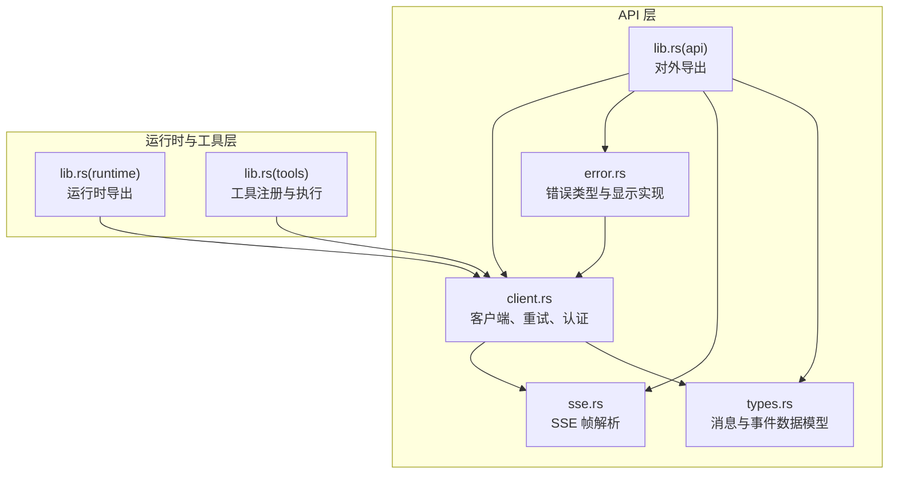
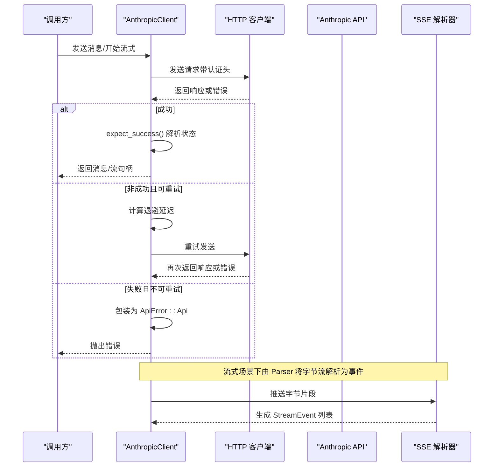
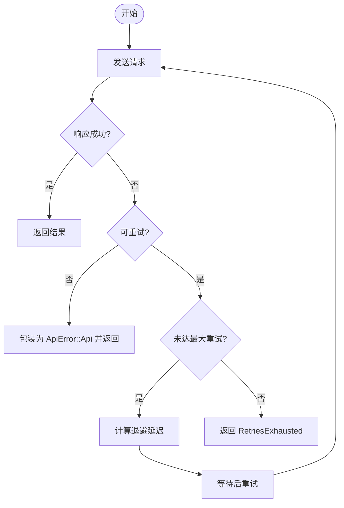
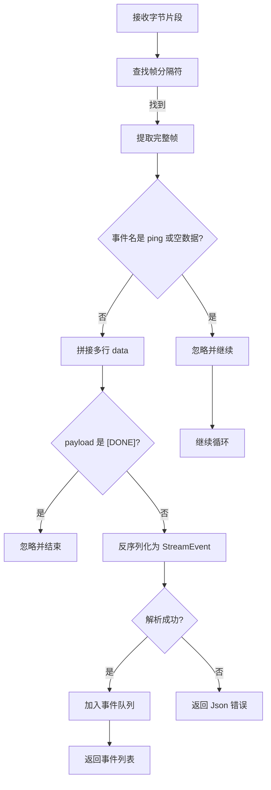
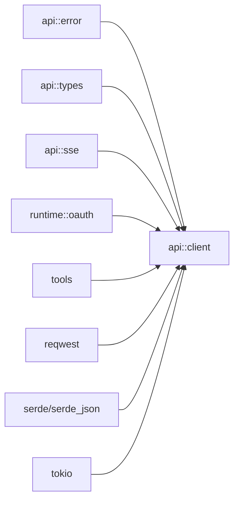

# 错误处理 API

<cite>
**本文引用的文件**
- [error.rs](file://rust/crates/api/src/error.rs)
- [lib.rs](file://rust/crates/api/src/lib.rs)
- [client.rs](file://rust/crates/api/src/client.rs)
- [sse.rs](file://rust/crates/api/src/sse.rs)
- [types.rs](file://rust/crates/api/src/types.rs)
- [lib.rs（运行时）](file://rust/crates/runtime/src/lib.rs)
- [lib.rs（工具集）](file://rust/crates/tools/src/lib.rs)
- [client_integration.rs（测试）](file://rust/crates/api/tests/client_integration.rs)
</cite>

## 目录
1. [简介](#简介)
2. [项目结构](#项目结构)
3. [核心组件](#核心组件)
4. [架构总览](#架构总览)
5. [详细组件分析](#详细组件分析)
6. [依赖分析](#依赖分析)
7. [性能考虑](#性能考虑)
8. [故障排查指南](#故障排查指南)
9. [结论](#结论)
10. [附录](#附录)

## 简介
本文件为“错误处理 API”的技术参考文档，聚焦于 Rust 子系统中与 API 调用、流式事件解析、重试策略及错误传播相关的错误模型与处理机制。内容覆盖：
- 错误码与错误分类
- 异常处理与错误传播
- 错误包装与恢复流程
- 错误信息格式与国际化支持现状
- 日志与监控集成建议
- 与各模块 API 的集成关系与统一错误响应格式

## 项目结构
围绕错误处理的关键文件位于 Rust 子系统的 api、runtime、tools 模块中，形成“错误类型定义 → 客户端调用与重试 → SSE 流解析 → 类型模型”的闭环。



图表来源
- [error.rs:1-192](file://rust/crates/api/src/error.rs#L1-L192)
- [client.rs:1-995](file://rust/crates/api/src/client.rs#L1-L995)
- [sse.rs:1-280](file://rust/crates/api/src/sse.rs#L1-L280)
- [types.rs:1-224](file://rust/crates/api/src/types.rs#L1-L224)
- [lib.rs（运行时）:1-94](file://rust/crates/runtime/src/lib.rs#L1-L94)
- [lib.rs（工具集）:1-800](file://rust/crates/tools/src/lib.rs#L1-L800)

章节来源
- [lib.rs（API 导出）:1-18](file://rust/crates/api/src/lib.rs#L1-L18)

## 核心组件
- 错误类型与分类：集中定义在 error.rs 中，覆盖认证失败、网络错误、JSON 解析错误、API 返回错误、重试耗尽、SSE 帧错误、退避溢出等。
- 客户端与重试：client.rs 提供 AnthropicClient，内置指数退避重试策略、请求头应用、OAuth 令牌刷新与保存。
- SSE 解析：sse.rs 将原始字节流切分为帧，过滤 ping/[DONE] 等无效事件，解析为统一的 StreamEvent。
- 数据模型：types.rs 定义消息请求/响应、内容块、事件等结构，便于统一错误映射与日志输出。
- 运行时与工具：runtime 与 tools 模块通过 API 客户端进行外部调用，错误向上抛出或转换为 ApiError。

章节来源
- [error.rs:5-30](file://rust/crates/api/src/error.rs#L5-L30)
- [client.rs:104-337](file://rust/crates/api/src/client.rs#L104-L337)
- [sse.rs:4-101](file://rust/crates/api/src/sse.rs#L4-L101)
- [types.rs:4-224](file://rust/crates/api/src/types.rs#L4-L224)

## 架构总览
下图展示从调用到错误传播的整体流程，包括重试、错误包装与事件解析：



图表来源
- [client.rs:273-337](file://rust/crates/api/src/client.rs#L273-L337)
- [client.rs:565-590](file://rust/crates/api/src/client.rs#L565-L590)
- [sse.rs:15-101](file://rust/crates/api/src/sse.rs#L15-L101)

## 详细组件分析

### 错误类型与分类
- 分类要点
  - 认证相关：缺少密钥、OAuth 过期、认证失败、环境变量读取失败。
  - 网络与 IO：HTTP 错误、IO 错误、JSON 解析错误。
  - API 返回：携带状态码、错误类型、消息体与是否可重试标记。
  - 重试：重试次数耗尽，携带最后一次错误。
  - SSE：帧格式非法、解析失败。
  - 退避：指数退避溢出（位移溢出）。
- 可重试判定
  - HTTP 错误：连接、超时、请求错误。
  - API 返回：根据状态码集合判断；同时保留 retryable 标记。
  - 其他：如认证失败、IO、JSON、SSE 非法、退避溢出等不可重试。
- 显示实现
  - 对用户可见的错误消息包含明确提示与上下文，例如多提供商矩阵说明、过期令牌指引等。

```mermaid
classDiagram
class ApiError {
+is_retryable() bool
+Display(fmt)
}
class MissingApiKey
class ExpiredOAuthToken
class Auth(String)
class InvalidApiKeyEnv(VarError)
class Http(reqwest : : Error)
class Io(std : : io : : Error)
class Json(serde_json : : Error)
class Api {
+status
+error_type
+message
+body
+retryable
}
class RetriesExhausted {
+attempts
+last_error
}
class InvalidSseFrame(&'static str)
class BackoffOverflow {
+attempt
+base_delay
}
ApiError <|-- MissingApiKey
ApiError <|-- ExpiredOAuthToken
ApiError <|-- Auth
ApiError <|-- InvalidApiKeyEnv
ApiError <|-- Http
ApiError <|-- Io
ApiError <|-- Json
ApiError <|-- Api
ApiError <|-- RetriesExhausted
ApiError <|-- InvalidSseFrame
ApiError <|-- BackoffOverflow
```

图表来源
- [error.rs:5-30](file://rust/crates/api/src/error.rs#L5-L30)
- [error.rs:32-49](file://rust/crates/api/src/error.rs#L32-L49)

章节来源
- [error.rs:5-124](file://rust/crates/api/src/error.rs#L5-L124)
- [error.rs:126-148](file://rust/crates/api/src/error.rs#L126-L148)

### 客户端与重试策略
- 关键行为
  - 指数退避：以 2 的幂次增长，上限受最大退避限制。
  - 可重试条件：HTTP 连接/超时/请求错误，或 API 返回标记 retryable。
  - 最大重试次数：max_retries 控制尝试上限，超过则返回 RetriesExhausted。
  - 请求头应用：优先使用 Bearer Token，其次使用 x-api-key。
  - OAuth 支持：加载/刷新令牌，保存至运行时持久化存储。
- 请求 ID：从响应头提取 request-id 或 x-request-id，注入到消息响应或流句柄中，便于追踪。
- 错误包装：将底层错误统一包装为 ApiError，保持上层一致处理。



图表来源
- [client.rs:273-337](file://rust/crates/api/src/client.rs#L273-L337)
- [client.rs:565-590](file://rust/crates/api/src/client.rs#L565-L590)

章节来源
- [client.rs:104-190](file://rust/crates/api/src/client.rs#L104-L190)
- [client.rs:273-337](file://rust/crates/api/src/client.rs#L273-L337)
- [client.rs:515-521](file://rust/crates/api/src/client.rs#L515-L521)

### SSE 流解析与错误传播
- 帧解析
  - 支持 CRLF/LF 分隔符，忽略注释行与 ping 事件，跳过 [DONE] 结束标记。
  - 将 data 行拼接后反序列化为 StreamEvent。
- 错误处理
  - 无法解析的帧返回 InvalidSseFrame 错误。
  - 解析 JSON 失败返回 Json 错误。
- 流式消费
  - MessageStream 维护缓冲区与事件队列，按需从网络读取并解析。



图表来源
- [sse.rs:15-101](file://rust/crates/api/src/sse.rs#L15-L101)

章节来源
- [sse.rs:4-101](file://rust/crates/api/src/sse.rs#L4-L101)
- [client.rs:523-563](file://rust/crates/api/src/client.rs#L523-L563)

### 数据模型与统一错误响应
- 消息请求/响应、内容块、事件等结构统一定义，便于在错误路径中携带上下文（如 request_id、usage、stop_reason 等）。
- 错误包装时保留 API 返回的错误类型与消息，便于统一日志与监控。

章节来源
- [types.rs:4-224](file://rust/crates/api/src/types.rs#L4-L224)
- [client.rs:565-590](file://rust/crates/api/src/client.rs#L565-L590)

### 与运行时和工具模块的集成
- 运行时（runtime）：提供 OAuth 配置、令牌加载/保存、权限管理等能力，被 API 客户端用于认证与刷新。
- 工具集（tools）：通过 API 客户端发起外部调用，错误向上抛出，由调用方决定重试或降级。

章节来源
- [lib.rs（运行时）:62-68](file://rust/crates/runtime/src/lib.rs#L62-L68)
- [lib.rs（工具集）:6-21](file://rust/crates/tools/src/lib.rs#L6-L21)

## 依赖分析
- 模块耦合
  - api::client 依赖 api::error、api::types、api::sse，以及 runtime 的 OAuth 能力。
  - tools 依赖 api 与 runtime，形成“工具执行 → API 调用 → 错误传播”的链路。
- 外部依赖
  - reqwest 用于 HTTP 请求与状态码判断。
  - serde/serde_json 用于请求/响应与 SSE 数据的序列化/反序列化。
  - tokio 用于异步重试与流式读取。



图表来源
- [client.rs:1-12](file://rust/crates/api/src/client.rs#L1-L12)
- [lib.rs（运行时）:62-68](file://rust/crates/runtime/src/lib.rs#L62-L68)
- [lib.rs（工具集）:6-21](file://rust/crates/tools/src/lib.rs#L6-L21)

章节来源
- [client.rs:1-12](file://rust/crates/api/src/client.rs#L1-L12)
- [lib.rs（运行时）:62-68](file://rust/crates/runtime/src/lib.rs#L62-L68)
- [lib.rs（工具集）:6-21](file://rust/crates/tools/src/lib.rs#L6-L21)

## 性能考虑
- 指数退避上限：避免长时间阻塞，确保在服务过载时快速失败。
- 流式解析：SSE 解析采用增量缓冲，减少内存峰值。
- 请求头最小化：仅在必要时附加认证头，降低请求开销。
- 重试次数与延迟：合理配置 max_retries 与初始/最大退避，平衡成功率与延迟。

## 故障排查指南
- 常见错误定位
  - 缺少密钥：检查 ANTHROPIC_API_KEY 与 ANTHROPIC_AUTH_TOKEN 是否设置且非空。
  - OAuth 过期：确认 refresh_token 是否存在，若不存在则需要重新授权。
  - API 返回错误：查看 Api 错误中的状态码、错误类型与消息体，结合 retryable 字段判断是否可重试。
  - 重试耗尽：确认 max_retries 设置与网络状况，必要时增加重试次数或调整退避参数。
  - SSE 帧错误：检查上游服务是否遵循 SSE 协议，是否存在非法帧或缺失 data 行。
- 日志与追踪
  - 使用 request_id 与 x-request-id 追踪请求链路。
  - 在调用方记录 ApiError 的 Display 文本，便于问题复现。
- 监控集成
  - 将错误类型（如 Api、Http、Io、RetriesExhausted、BackoffOverflow）作为指标维度上报。
  - 统计 retryable 与非 retryable 的比例，评估上游稳定性。

章节来源
- [client_integration.rs（测试）:286-365](file://rust/crates/api/tests/client_integration.rs#L286-L365)
- [client.rs:515-521](file://rust/crates/api/src/client.rs#L515-L521)

## 结论
该错误处理 API 通过统一的 ApiError 类型与客户端重试机制，实现了对认证、网络、API 返回、SSE 等多种错误场景的一致化处理。配合请求 ID 与事件模型，能够满足可观测性与可恢复性的需求。建议在生产环境中：
- 明确重试策略与退避上限；
- 将错误类型与指标纳入监控；
- 在调用方按错误类别采取差异化处理（重试/降级/告警）。

## 附录

### 错误码与错误分类对照
- 认证类
  - 缺少密钥：MissingApiKey
  - OAuth 过期：ExpiredOAuthToken
  - 认证失败：Auth(String)
  - 环境变量读取失败：InvalidApiKeyEnv(VarError)
- 网络与 IO
  - HTTP 错误：Http(reqwest::Error)
  - IO 错误：Io(std::io::Error)
  - JSON 解析错误：Json(serde_json::Error)
- API 返回
  - Api：包含状态码、错误类型、消息、原始 body 与 retryable 标记
- 重试与退避
  - RetriesExhausted：包含尝试次数与最后一次错误
  - BackoffOverflow：包含尝试次数与基础延迟
- SSE
  - InvalidSseFrame(&'static str)

章节来源
- [error.rs:5-30](file://rust/crates/api/src/error.rs#L5-L30)

### 错误传播与包装接口规范
- 传播路径
  - 底层错误（reqwest、std::io、serde_json、环境变量）统一映射为 ApiError。
  - API 返回错误经 expect_success 包装为 Api，保留 retryable 标记。
  - 流式解析错误经 sse::parse_frame 包装为 ApiError。
- 恢复接口
  - 客户端提供 with_retry_policy 自定义重试策略。
  - OAuth 刷新接口支持自动刷新过期令牌并保存新令牌。
  - MessageStream 提供 next_event 异步迭代事件，遇到错误立即返回。

章节来源
- [error.rs:126-148](file://rust/crates/api/src/error.rs#L126-L148)
- [client.rs:180-190](file://rust/crates/api/src/client.rs#L180-L190)
- [client.rs:253-271](file://rust/crates/api/src/client.rs#L253-L271)
- [client.rs:532-563](file://rust/crates/api/src/client.rs#L532-L563)

### 错误信息格式与国际化支持
- 当前实现
  - 错误 Display 文本为固定英文描述，便于日志与自动化解析。
  - 错误类型与消息来源于上游 API 的 error envelope，保留 error_type 与 message 字段。
- 国际化建议
  - 在调用方或网关层根据语言环境选择本地化文案。
  - 保留 error_type 与 message 字段，便于前端或 SDK 层做本地化渲染。

章节来源
- [client.rs:565-590](file://rust/crates/api/src/client.rs#L565-L590)
- [error.rs:51-121](file://rust/crates/api/src/error.rs#L51-L121)

### 与各模块 API 的集成关系
- api::client 作为统一入口，向 runtime 与 tools 暴露一致的错误语义。
- runtime 提供 OAuth 与权限相关错误类型，tools 通过 API 客户端调用外部服务，错误向上冒泡。
- 类型模型（types.rs）贯穿错误路径，便于在日志与监控中携带上下文信息。

章节来源
- [lib.rs（运行时）:62-68](file://rust/crates/runtime/src/lib.rs#L62-L68)
- [lib.rs（工具集）:6-21](file://rust/crates/tools/src/lib.rs#L6-L21)