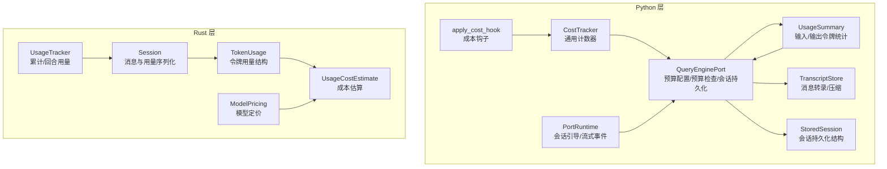
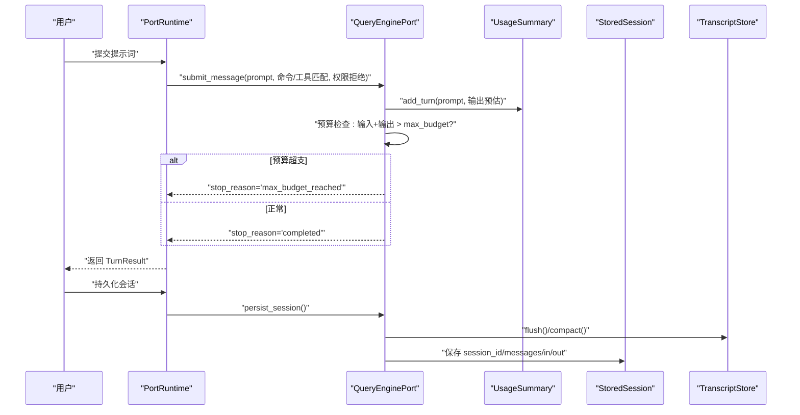
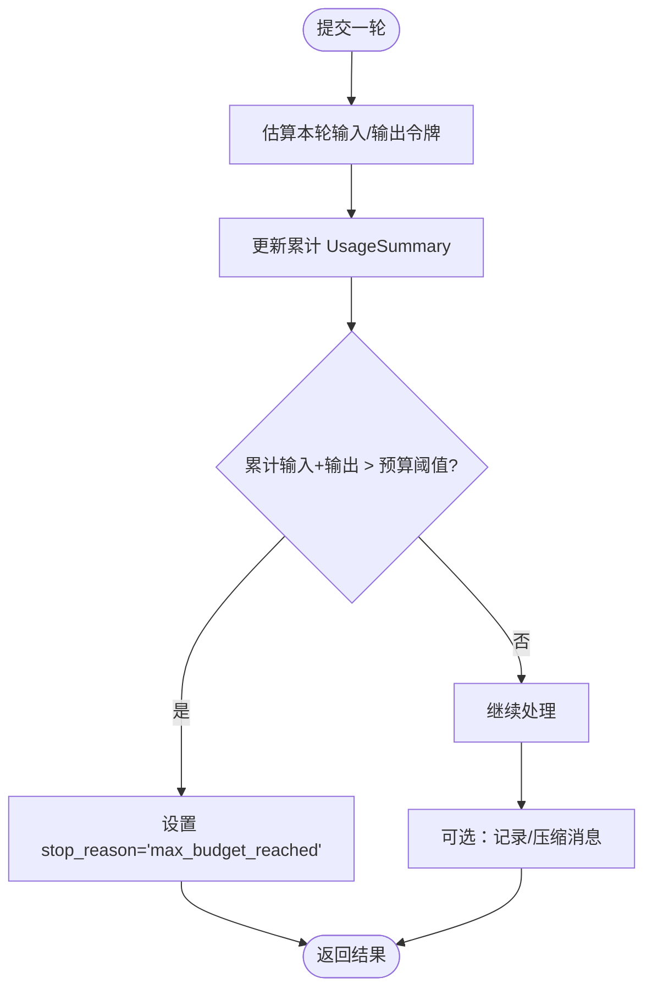
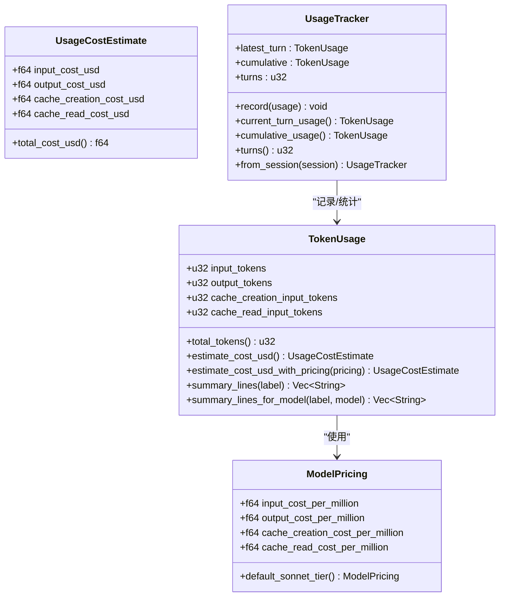
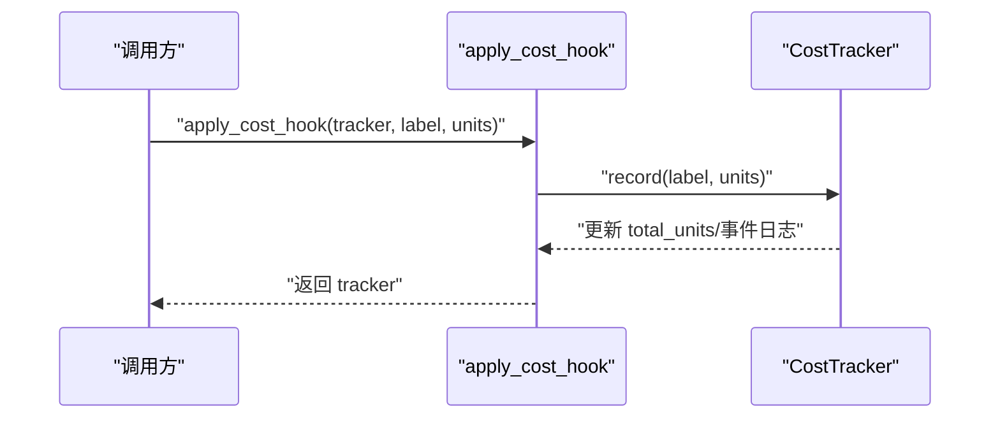
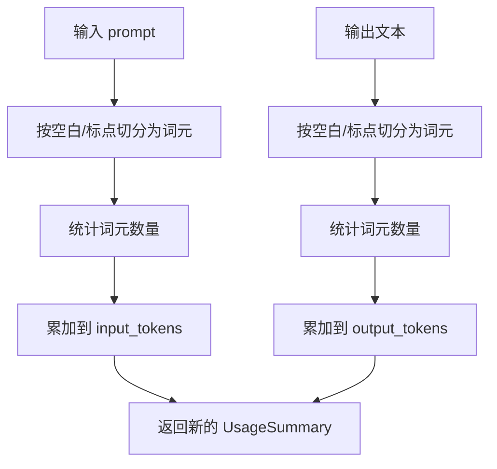
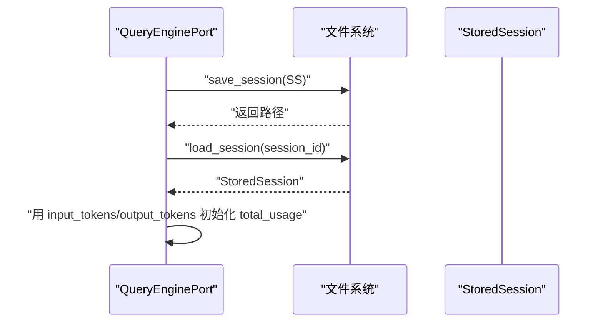
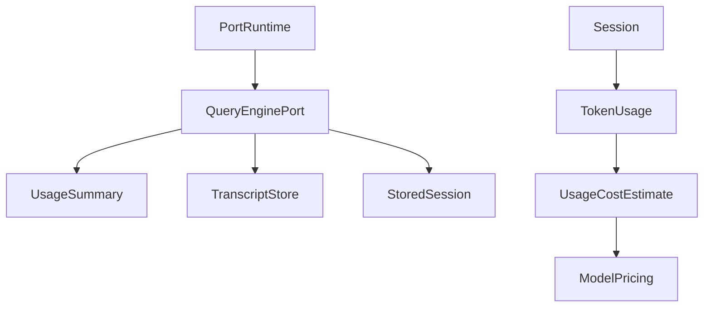

# 令牌预算控制

<cite>
**本文引用的文件**
- [src/cost_tracker.py](file://src/cost_tracker.py)
- [src/costHook.py](file://src/costHook.py)
- [src/query_engine.py](file://src/query_engine.py)
- [src/models.py](file://src/models.py)
- [src/session_store.py](file://src/session_store.py)
- [src/transcript.py](file://src/transcript.py)
- [src/runtime.py](file://src/runtime.py)
- [rust/crates/runtime/src/usage.rs](file://rust/crates/runtime/src/usage.rs)
- [rust/crates/runtime/src/session.rs](file://rust/crates/runtime/src/session.rs)
</cite>

## 目录
1. [简介](#简介)
2. [项目结构](#项目结构)
3. [核心组件](#核心组件)
4. [架构总览](#架构总览)
5. [详细组件分析](#详细组件分析)
6. [依赖分析](#依赖分析)
7. [性能考虑](#性能考虑)
8. [故障排查指南](#故障排查指南)
9. [结论](#结论)
10. [附录](#附录)

## 简介
本技术文档聚焦 CLAW 项目的“令牌预算控制”能力，系统性阐述输入/输出令牌计数、成本估算与跟踪、预算限制与中断策略、成本钩子机制、实时预算监控与会话持久化等关键实现。文档同时提供不同模型的成本对比、优化建议与最佳实践，帮助在对话长度与响应质量之间取得平衡，并给出预算预警、通知与手动干预的使用指南。

## 项目结构
围绕令牌预算控制的关键代码分布在 Python 层（预算配置、会话存储、转录）与 Rust 层（令牌用量结构、成本估算、会话序列化）。下图展示与预算控制直接相关的模块与交互关系：

**图表来源**
- [src/query_engine.py:15-44](file://src/query_engine.py#L15-L44)
- [src/transcript.py:6-24](file://src/transcript.py#L6-L24)
- [src/session_store.py:8-36](file://src/session_store.py#L8-L36)
- [src/cost_tracker.py:6-14](file://src/cost_tracker.py#L6-L14)
- [src/costHook.py:6-9](file://src/costHook.py#L6-L9)
- [src/models.py:29-37](file://src/models.py#L29-L37)
- [rust/crates/runtime/src/usage.rs:28-52](file://rust/crates/runtime/src/usage.rs#L28-L52)
- [rust/crates/runtime/src/usage.rs:54-77](file://rust/crates/runtime/src/usage.rs#L54-L77)
- [rust/crates/runtime/src/usage.rs:162-209](file://rust/crates/runtime/src/usage.rs#L162-L209)
- [rust/crates/runtime/src/session.rs:39-46](file://rust/crates/runtime/src/session.rs#L39-L46)
- [rust/crates/runtime/src/session.rs:327-358](file://rust/crates/runtime/src/session.rs#L327-L358)

**章节来源**
- [src/query_engine.py:15-44](file://src/query_engine.py#L15-L44)
- [src/transcript.py:6-24](file://src/transcript.py#L6-L24)
- [src/session_store.py:8-36](file://src/session_store.py#L8-L36)
- [src/cost_tracker.py:6-14](file://src/cost_tracker.py#L6-L14)
- [src/costHook.py:6-9](file://src/costHook.py#L6-L9)
- [src/models.py:29-37](file://src/models.py#L29-L37)
- [rust/crates/runtime/src/usage.rs:28-52](file://rust/crates/runtime/src/usage.rs#L28-L52)
- [rust/crates/runtime/src/usage.rs:54-77](file://rust/crates/runtime/src/usage.rs#L54-L77)
- [rust/crates/runtime/src/usage.rs:162-209](file://rust/crates/runtime/src/usage.rs#L162-L209)
- [rust/crates/runtime/src/session.rs:39-46](file://rust/crates/runtime/src/session.rs#L39-L46)
- [rust/crates/runtime/src/session.rs:327-358](file://rust/crates/runtime/src/session.rs#L327-L358)

## 核心组件
- 预算配置与检查：QueryEngineConfig 提供 max_budget_tokens 等预算参数；QueryEnginePort 在每轮提交时进行预算检查并决定是否中断。
- 输入/输出令牌统计：UsageSummary 提供按词元粗略估算的输入/输出令牌累计；QueryEnginePort 将其用于预算预测。
- 成本估算与模型定价：Rust 模块提供 TokenUsage、UsageCostEstimate、ModelPricing，支持按模型估算成本。
- 会话持久化：StoredSession 记录会话 ID、消息与累计令牌；QueryEnginePort 在持久化时写入 input_tokens、output_tokens。
- 成本钩子：apply_cost_hook 通过 CostTracker.record 记录单位，便于扩展更细粒度的成本追踪。
- 转录与压缩：TranscriptStore 管理消息列表与 flush 状态，避免重复写盘。

**章节来源**
- [src/query_engine.py:15-44](file://src/query_engine.py#L15-L44)
- [src/query_engine.py:61-104](file://src/query_engine.py#L61-L104)
- [src/models.py:29-37](file://src/models.py#L29-L37)
- [rust/crates/runtime/src/usage.rs:54-77](file://rust/crates/runtime/src/usage.rs#L54-L77)
- [rust/crates/runtime/src/usage.rs:88-107](file://rust/crates/runtime/src/usage.rs#L88-L107)
- [src/session_store.py:8-36](file://src/session_store.py#L8-L36)
- [src/costHook.py:6-9](file://src/costHook.py#L6-L9)
- [src/cost_tracker.py:6-14](file://src/cost_tracker.py#L6-L14)
- [src/transcript.py:6-24](file://src/transcript.py#L6-L24)

## 架构总览
下图展示从用户输入到预算检查、成本估算与会话持久化的端到端流程：

**图表来源**
- [src/runtime.py:109-152](file://src/runtime.py#L109-L152)
- [src/query_engine.py:61-104](file://src/query_engine.py#L61-L104)
- [src/query_engine.py:140-150](file://src/query_engine.py#L140-L150)
- [src/transcript.py:22-24](file://src/transcript.py#L22-L24)
- [src/session_store.py:19-36](file://src/session_store.py#L19-L36)

## 详细组件分析

### 组件一：预算配置与预算检查（QueryEnginePort）
- 配置项：max_budget_tokens 控制输入与输出令牌总量阈值；max_turns 控制对话轮次上限。
- 预算检查逻辑：对当前轮次的 prompt 与输出进行粗略估算，累加到 total_usage 后与 max_budget_tokens 对比，若超支则设置 stop_reason 为“max_budget_reached”，否则为“completed”。
- 会话持久化：在 persist_session 中将 input_tokens、output_tokens 写入 StoredSession，便于后续加载与成本复盘。

**图表来源**
- [src/query_engine.py:61-104](file://src/query_engine.py#L61-L104)
- [src/query_engine.py:140-150](file://src/query_engine.py#L140-L150)

**章节来源**
- [src/query_engine.py:15-44](file://src/query_engine.py#L15-L44)
- [src/query_engine.py:61-104](file://src/query_engine.py#L61-L104)
- [src/query_engine.py:140-150](file://src/query_engine.py#L140-L150)

### 组件二：成本估算与模型定价（Rust）
- TokenUsage：记录 input_tokens、output_tokens、cache_creation_input_tokens、cache_read_input_tokens。
- ModelPricing：内置默认定价与按模型（如 haiku/opus/sonnet）的差异化定价。
- UsageCostEstimate：基于 TokenUsage 与 ModelPricing 计算各分项成本与总成本。
- UsageTracker：从会话消息中重建累计用量，支持回合级与累计级用量查询。

**图表来源**
- [rust/crates/runtime/src/usage.rs:28-52](file://rust/crates/runtime/src/usage.rs#L28-L52)
- [rust/crates/runtime/src/usage.rs:54-77](file://rust/crates/runtime/src/usage.rs#L54-L77)
- [rust/crates/runtime/src/usage.rs:88-107](file://rust/crates/runtime/src/usage.rs#L88-L107)
- [rust/crates/runtime/src/usage.rs:162-209](file://rust/crates/runtime/src/usage.rs#L162-L209)

**章节来源**
- [rust/crates/runtime/src/usage.rs:28-52](file://rust/crates/runtime/src/usage.rs#L28-L52)
- [rust/crates/runtime/src/usage.rs:54-77](file://rust/crates/runtime/src/usage.rs#L54-L77)
- [rust/crates/runtime/src/usage.rs:88-107](file://rust/crates/runtime/src/usage.rs#L88-L107)
- [rust/crates/runtime/src/usage.rs:162-209](file://rust/crates/runtime/src/usage.rs#L162-L209)

### 组件三：成本钩子与通用计数器（Python）
- CostTracker：提供 total_units 与事件日志 events 的简单计数器。
- apply_cost_hook：通过 tracker.record(label, units) 记录单位，便于在业务流程中插入细粒度成本标记点。

**图表来源**
- [src/costHook.py:6-9](file://src/costHook.py#L6-L9)
- [src/cost_tracker.py:6-14](file://src/cost_tracker.py#L6-L14)

**章节来源**
- [src/costHook.py:6-9](file://src/costHook.py#L6-L9)
- [src/cost_tracker.py:6-14](file://src/cost_tracker.py#L6-L14)

### 组件四：输入/输出令牌统计（UsageSummary）
- 采用词元切分作为粗略估算，add_turn 返回新的 UsageSummary，便于在预算检查前进行“投影式”预测。
- 该统计仅用于预算控制，不等同于真实模型的 tokenizer 计数。

**图表来源**
- [src/models.py:33-37](file://src/models.py#L33-L37)

**章节来源**
- [src/models.py:29-37](file://src/models.py#L29-L37)

### 组件五：会话持久化与加载（StoredSession）
- 持久化：persist_session 将 session_id、messages、input_tokens、output_tokens 写入 JSON 文件。
- 加载：load_session 读取 JSON 并恢复 StoredSession，QueryEnginePort 可据此重建运行状态。

**图表来源**
- [src/query_engine.py:140-150](file://src/query_engine.py#L140-L150)
- [src/session_store.py:19-36](file://src/session_store.py#L19-L36)

**章节来源**
- [src/query_engine.py:140-150](file://src/query_engine.py#L140-L150)
- [src/session_store.py:19-36](file://src/session_store.py#L19-L36)

### 组件六：转录与压缩（TranscriptStore）
- append：追加消息并标记未 flush。
- compact：当消息数量超过阈值时仅保留最近若干条，降低内存与 IO 压力。
- flush：标记已持久化，避免重复写盘。

**章节来源**
- [src/transcript.py:6-24](file://src/transcript.py#L6-L24)

## 依赖分析
- Python 层内部依赖清晰：QueryEnginePort 依赖 UsageSummary、TranscriptStore、StoredSession；PortRuntime 作为上层编排调用 QueryEnginePort。
- Rust 层与 Python 层通过会话 JSON 结构互通：Session 结构体包含消息与可选 usage 字段；TokenUsage 与 UsageCostEstimate 由 Rust 侧提供成本估算能力。
- 成本钩子与通用计数器为可插拔扩展点，可在业务流程中注入更细粒度的成本标签。

**图表来源**
- [src/query_engine.py:35-44](file://src/query_engine.py#L35-L44)
- [src/models.py:29-37](file://src/models.py#L29-L37)
- [src/transcript.py:6-24](file://src/transcript.py#L6-L24)
- [src/session_store.py:8-36](file://src/session_store.py#L8-L36)
- [src/runtime.py:89-152](file://src/runtime.py#L89-L152)
- [rust/crates/runtime/src/session.rs:39-46](file://rust/crates/runtime/src/session.rs#L39-L46)
- [rust/crates/runtime/src/usage.rs:28-52](file://rust/crates/runtime/src/usage.rs#L28-L52)
- [rust/crates/runtime/src/usage.rs:88-107](file://rust/crates/runtime/src/usage.rs#L88-L107)

**章节来源**
- [src/query_engine.py:35-44](file://src/query_engine.py#L35-L44)
- [src/runtime.py:89-152](file://src/runtime.py#L89-L152)
- [rust/crates/runtime/src/session.rs:39-46](file://rust/crates/runtime/src/session.rs#L39-L46)
- [rust/crates/runtime/src/usage.rs:28-52](file://rust/crates/runtime/src/usage.rs#L28-L52)

## 性能考虑
- 预算检查为 O(1) 操作，开销极低；但词元切分估算可能与真实 tokenizer 差异较大，建议在高精度场景引入真实分词器。
- TranscriptStore 的 compact 与 flush 有助于控制内存占用与 IO 放大；合理设置 compact_after_turns 可在性能与可观测性间平衡。
- Rust 侧的成本估算为纯数值计算，复杂度低；但在大规模会话复盘时，建议按需选择模型定价或使用默认定价以减少分支判断。

[本节为通用指导，无需列出具体文件来源]

## 故障排查指南
- 预算提前触发：若发现频繁出现“max_budget_reached”，检查 max_budget_tokens 设置与 UsageSummary 的估算偏差；必要时提高阈值或优化 prompt。
- 会话加载异常：确认 .port_sessions 下的 JSON 文件格式正确，字段完整；注意 input_tokens、output_tokens 是否存在。
- 成本估算差异：若需要与上游服务一致的成本估算，确保传入正确的模型名以启用对应 ModelPricing；否则将使用默认定价。
- 转录未刷新：若多次执行 persist_session 且内容未变化，检查 TranscriptStore.flush 的调用时机。

**章节来源**
- [src/query_engine.py:61-104](file://src/query_engine.py#L61-L104)
- [src/session_store.py:19-36](file://src/session_store.py#L19-L36)
- [rust/crates/runtime/src/usage.rs:54-77](file://rust/crates/runtime/src/usage.rs#L54-L77)
- [rust/crates/runtime/src/session.rs:327-358](file://rust/crates/runtime/src/session.rs#L327-L358)
- [src/transcript.py:22-24](file://src/transcript.py#L22-L24)

## 结论
CLAW 的令牌预算控制以“预算配置 + 投影式估算 + 会话持久化”为核心，结合 Rust 侧的成本估算能力，实现了低成本、可扩展的预算管理方案。通过成本钩子与 UsageTracker，系统具备进一步精细化成本追踪的扩展空间。建议在生产环境中根据实际模型与业务场景调整预算阈值与成本估算策略，以实现对话长度与响应质量的最佳平衡。

[本节为总结性内容，无需列出具体文件来源]

## 附录

### 不同模型的成本对比与建议
- Haiku：输入/输出成本较低，适合轻量任务与快速迭代。
- Opus：输入/输出成本较高，适合高质量生成与复杂推理。
- Sonnet：默认定价，平衡成本与性能，适合大多数常规任务。
- 建议：优先使用与上游一致的模型名以启用精确定价；若未知模型，系统将使用默认定价进行估算。

**章节来源**
- [rust/crates/runtime/src/usage.rs:54-77](file://rust/crates/runtime/src/usage.rs#L54-L77)
- [rust/crates/runtime/src/usage.rs:88-107](file://rust/crates/runtime/src/usage.rs#L88-L107)

### 预算超支检测与自动中断策略
- 触发条件：累计输入与输出令牌之和超过 max_budget_tokens。
- 中断原因：stop_reason 设为“max_budget_reached”，随后不再继续生成。
- 建议：在高预算场景下提高阈值；在严格控制成本场景下结合 Prompt 工程与工具调用减少输出冗余。

**章节来源**
- [src/query_engine.py:89-90](file://src/query_engine.py#L89-L90)
- [src/query_engine.py:96-104](file://src/query_engine.py#L96-L104)

### 实时预算监控与会话持久化
- 实时监控：QueryEnginePort.render_summary 输出当前会话的使用总计与预算配置，便于快速核对。
- 会话持久化：保存 input_tokens、output_tokens 以便后续审计与复盘。
- 建议：定期导出会话摘要，建立预算使用趋势分析。

**章节来源**
- [src/query_engine.py:171-194](file://src/query_engine.py#L171-L194)
- [src/query_engine.py:140-150](file://src/query_engine.py#L140-L150)

### 成本钩子与手动干预
- 成本钩子：apply_cost_hook 可在关键节点记录单位，便于后续统计与告警。
- 手动干预：通过调整 QueryEngineConfig 的 max_budget_tokens 或 max_turns，以及在 Prompt 中减少冗余信息，达到预算控制目的。

**章节来源**
- [src/costHook.py:6-9](file://src/costHook.py#L6-L9)
- [src/cost_tracker.py:6-14](file://src/cost_tracker.py#L6-L14)
- [src/query_engine.py:15-22](file://src/query_engine.py#L15-L22)