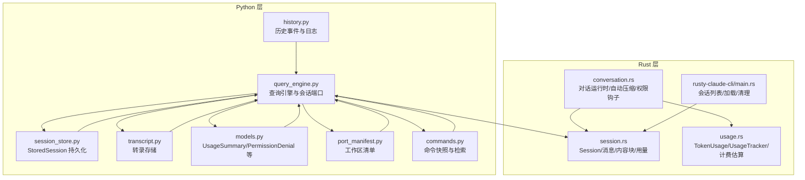
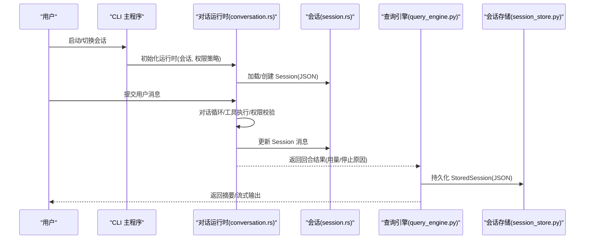
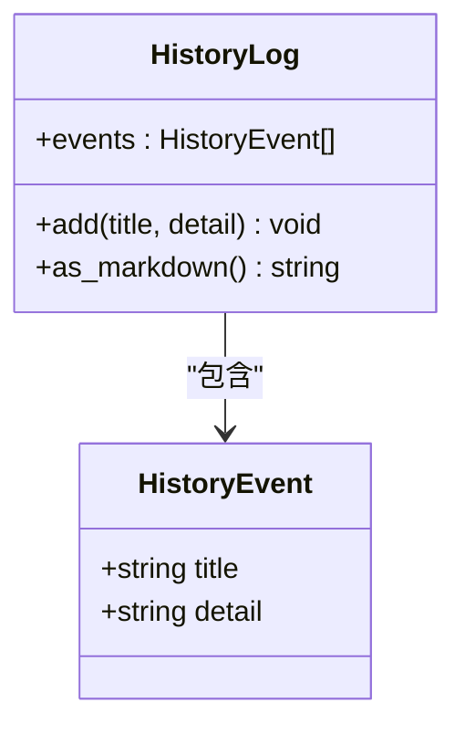
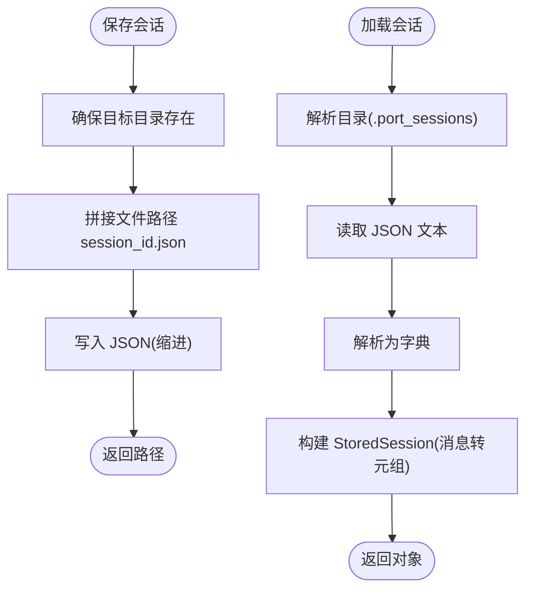
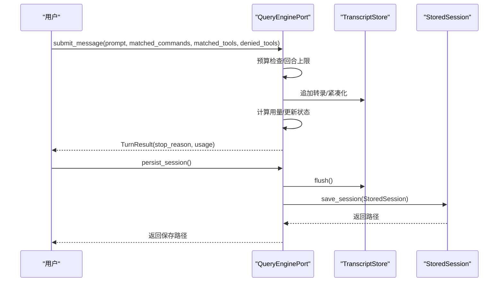
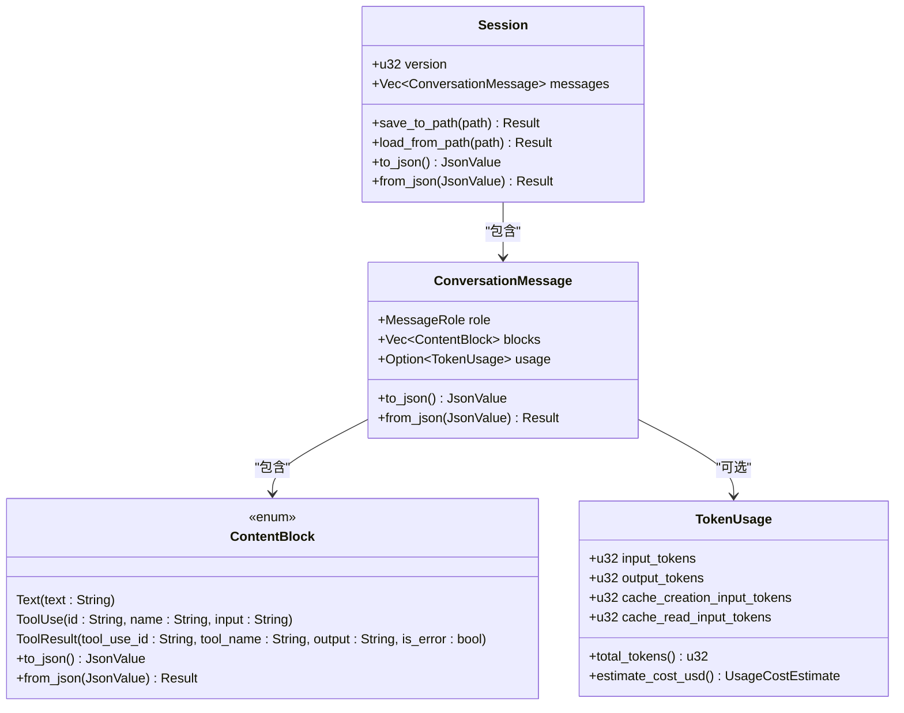
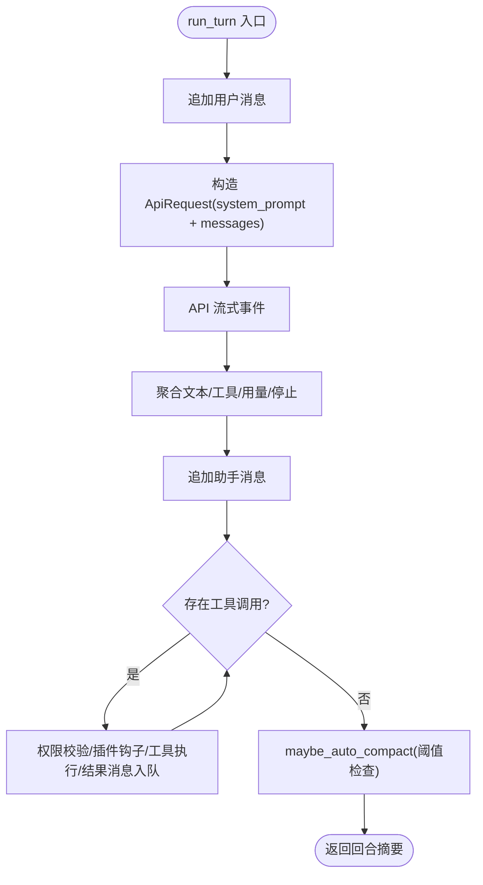
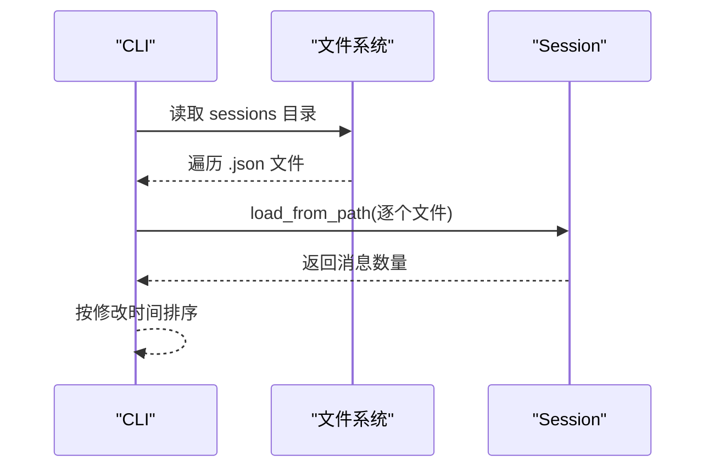
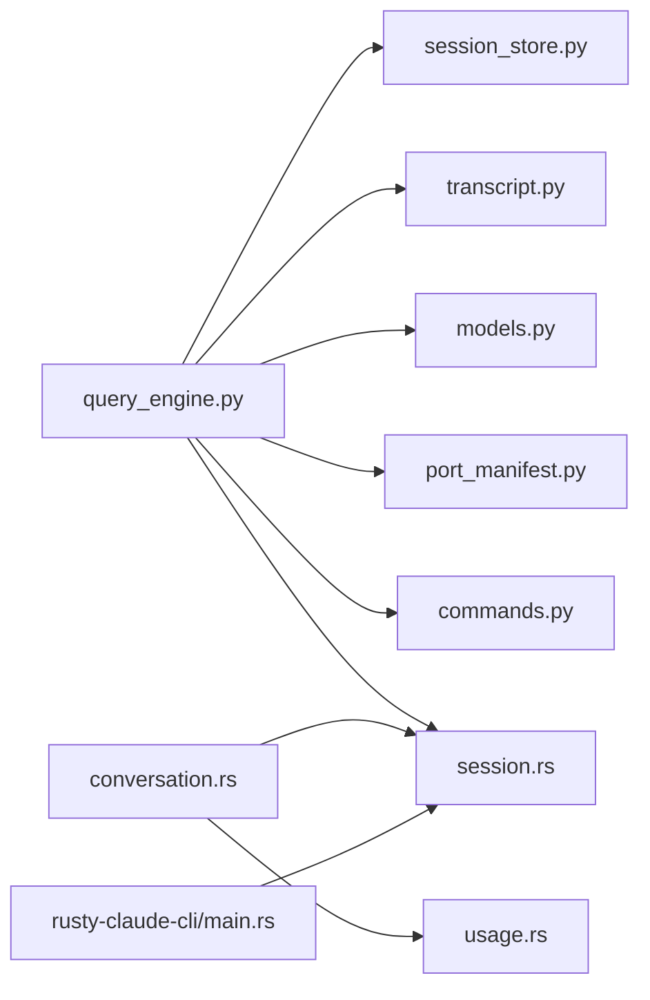

# 会话历史管理

<cite>
**本文引用的文件**
- [src/history.py](file://src/history.py)
- [src/session_store.py](file://src/session_store.py)
- [src/query_engine.py](file://src/query_engine.py)
- [src/transcript.py](file://src/transcript.py)
- [src/models.py](file://src/models.py)
- [src/port_manifest.py](file://src/port_manifest.py)
- [src/commands.py](file://src/commands.py)
- [rust/crates/runtime/src/session.rs](file://rust/crates/runtime/src/session.rs)
- [rust/crates/runtime/src/conversation.rs](file://rust/crates/runtime/src/conversation.rs)
- [rust/crates/runtime/src/usage.rs](file://rust/crates/runtime/src/usage.rs)
- [rust/crates/rusty-claude-cli/src/main.rs](file://rust/crates/rusty-claude-cli/src/main.rs)
- [rust/.claude/sessions/session-1775007453382.json](file://rust/.claude/sessions/session-1775007453382.json)
- [rust/.claude/sessions/session-1775008427969.json](file://rust/.claude/sessions/session-1775008427969.json)
</cite>

## 目录
1. [简介](#简介)
2. [项目结构](#项目结构)
3. [核心组件](#核心组件)
4. [架构总览](#架构总览)
5. [详细组件分析](#详细组件分析)
6. [依赖分析](#依赖分析)
7. [性能考虑](#性能考虑)
8. [故障排查指南](#故障排查指南)
9. [结论](#结论)
10. [附录](#附录)

## 简介
本文件面向 CLAW 项目的“会话历史管理”能力，系统化阐述历史记录的存储格式、检索与索引策略、分类与标签体系、搜索实现、批量操作、清理与归档机制、导出与迁移、备份与恢复、隐私与访问控制、删除策略、查询优化与缓存、性能调优以及历史数据分析与统计报告的使用方法。文档以代码为依据，结合可视化图示帮助读者快速理解并高效使用该功能。

## 项目结构
围绕会话历史管理的关键模块与文件如下：
- Python 层：历史事件与日志、会话持久化、查询引擎、转录存储、模型与清单等
- Rust 层：会话序列化/反序列化、对话运行时、令牌用量统计与计费估算、CLI 会话管理

图表来源
- [src/history.py:1-23](file://src/history.py#L1-L23)
- [src/session_store.py:1-36](file://src/session_store.py#L1-L36)
- [src/query_engine.py:1-194](file://src/query_engine.py#L1-L194)
- [src/transcript.py:1-24](file://src/transcript.py#L1-L24)
- [src/models.py:1-50](file://src/models.py#L1-L50)
- [src/port_manifest.py:1-53](file://src/port_manifest.py#L1-L53)
- [src/commands.py:1-91](file://src/commands.py#L1-L91)
- [rust/crates/runtime/src/session.rs:1-433](file://rust/crates/runtime/src/session.rs#L1-L433)
- [rust/crates/runtime/src/conversation.rs:1-800](file://rust/crates/runtime/src/conversation.rs#L1-L800)
- [rust/crates/runtime/src/usage.rs:1-310](file://rust/crates/runtime/src/usage.rs#L1-L310)
- [rust/crates/rusty-claude-cli/src/main.rs:1795-1853](file://rust/crates/rusty-claude-cli/src/main.rs#L1795-L1853)

章节来源
- [src/history.py:1-23](file://src/history.py#L1-L23)
- [src/session_store.py:1-36](file://src/session_store.py#L1-L36)
- [src/query_engine.py:1-194](file://src/query_engine.py#L1-L194)
- [src/transcript.py:1-24](file://src/transcript.py#L1-L24)
- [src/models.py:1-50](file://src/models.py#L1-L50)
- [src/port_manifest.py:1-53](file://src/port_manifest.py#L1-L53)
- [src/commands.py:1-91](file://src/commands.py#L1-L91)
- [rust/crates/runtime/src/session.rs:1-433](file://rust/crates/runtime/src/session.rs#L1-L433)
- [rust/crates/runtime/src/conversation.rs:1-800](file://rust/crates/runtime/src/conversation.rs#L1-L800)
- [rust/crates/runtime/src/usage.rs:1-310](file://rust/crates/runtime/src/usage.rs#L1-L310)
- [rust/crates/rusty-claude-cli/src/main.rs:1795-1853](file://rust/crates/rusty-claude-cli/src/main.rs#L1795-L1853)

## 核心组件
- 历史事件与日志（Python）：用于记录用户可感知的历史事件，支持 Markdown 导出，便于审计与回顾。
- 会话持久化（Python）：将当前会话状态保存为 JSON 文件，包含会话 ID、消息序列、输入/输出令牌数。
- 查询引擎与会话端口（Python）：封装会话生命周期、预算控制、令牌用量统计、转录管理、持久化与摘要渲染。
- 转录存储（Python）：维护用户可见消息列表，支持紧凑化与回放。
- 模型与清单（Python）：定义权限拒绝、用量汇总、工作区清单等数据结构。
- Rust 会话与消息（Rust）：定义消息角色、内容块、会话结构、JSON 序列化/反序列化与错误类型。
- 对话运行时（Rust）：实现对话循环、工具执行、权限控制、自动压缩阈值、用量追踪。
- 令牌用量与计费（Rust）：提供 TokenUsage、UsageTracker、按模型计费估算与摘要行生成。
- CLI 会话管理（Rust）：列出会话、解析会话引用、加载会话、清理会话。

章节来源
- [src/history.py:6-23](file://src/history.py#L6-L23)
- [src/session_store.py:8-36](file://src/session_store.py#L8-L36)
- [src/query_engine.py:15-194](file://src/query_engine.py#L15-L194)
- [src/transcript.py:6-24](file://src/transcript.py#L6-L24)
- [src/models.py:6-50](file://src/models.py#L6-L50)
- [rust/crates/runtime/src/session.rs:9-136](file://rust/crates/runtime/src/session.rs#L9-L136)
- [rust/crates/runtime/src/conversation.rs:104-576](file://rust/crates/runtime/src/conversation.rs#L104-L576)
- [rust/crates/runtime/src/usage.rs:28-209](file://rust/crates/runtime/src/usage.rs#L28-L209)
- [rust/crates/rusty-claude-cli/src/main.rs:1795-1853](file://rust/crates/rusty-claude-cli/src/main.rs#L1795-L1853)

## 架构总览
下图展示从用户交互到会话持久化的整体流程，包括 Rust 运行时与 Python 查询引擎的协作。

图表来源
- [rust/crates/runtime/src/conversation.rs:317-501](file://rust/crates/runtime/src/conversation.rs#L317-L501)
- [rust/crates/runtime/src/session.rs:88-136](file://rust/crates/runtime/src/session.rs#L88-L136)
- [src/query_engine.py:61-150](file://src/query_engine.py#L61-L150)
- [src/session_store.py:19-36](file://src/session_store.py#L19-L36)

## 详细组件分析

### 历史事件与日志（Python）
- 数据结构：HistoryEvent（标题/详情），HistoryLog（事件列表，追加与 Markdown 渲染）。
- 用途：记录用户可感知的历史事件，便于审计与导出。

图表来源
- [src/history.py:6-23](file://src/history.py#L6-L23)

章节来源
- [src/history.py:6-23](file://src/history.py#L6-L23)

### 会话持久化（Python）
- 数据结构：StoredSession（会话 ID、消息元组、输入/输出令牌）。
- 存储：默认目录为 .port_sessions；保存为 session_id.json；加载时将消息转换为元组以保证不可变性。
- 用途：在 Python 层面持久化当前会话，供后续加载或导出使用。

图表来源
- [src/session_store.py:19-36](file://src/session_store.py#L19-L36)

章节来源
- [src/session_store.py:8-36](file://src/session_store.py#L8-L36)

### 查询引擎与会话端口（Python）
- QueryEngineConfig：回合上限、预算令牌、紧凑化阈值、结构化输出与重试限制。
- QueryEnginePort：承载会话 ID、消息列表、权限拒绝、用量汇总、转录存储。
- 关键行为：
  - 提交消息：预算检查、用量预估、追加消息与转录、必要时紧凑化。
  - 流式提交：分阶段事件（开始、匹配命令/工具、权限拒绝、增量文本、结束）。
  - 持久化：flush 转录后保存 StoredSession。
  - 摘要渲染：工作区清单、命令/工具表面、会话信息、用量统计等。

图表来源
- [src/query_engine.py:61-150](file://src/query_engine.py#L61-L150)
- [src/transcript.py:11-24](file://src/transcript.py#L11-L24)
- [src/session_store.py:19-36](file://src/session_store.py#L19-L36)

章节来源
- [src/query_engine.py:15-194](file://src/query_engine.py#L15-L194)
- [src/transcript.py:6-24](file://src/transcript.py#L6-L24)
- [src/models.py:22-38](file://src/models.py#L22-L38)
- [src/port_manifest.py:12-53](file://src/port_manifest.py#L12-L53)
- [src/commands.py:22-91](file://src/commands.py#L22-L91)

### 转录存储（Python）
- 功能：追加条目、紧凑化（仅保留最后 N 条）、回放、标记已刷新。
- 用途：控制内存占用，支持会话摘要与导出。

章节来源
- [src/transcript.py:6-24](file://src/transcript.py#L6-L24)

### Rust 会话与消息（Rust）
- Session：版本号 + 消息数组。
- ConversationMessage：角色（System/User/Assistant/Tool）、内容块（Text/ToolUse/ToolResult）、用量。
- ContentBlock：文本块、工具调用块、工具结果块。
- 序列化/反序列化：统一 JSON 结构，含错误处理。
- 用途：高性能、强类型的消息与会话表示，支撑对话运行时与 CLI 管理。

图表来源
- [rust/crates/runtime/src/session.rs:43-136](file://rust/crates/runtime/src/session.rs#L43-L136)
- [rust/crates/runtime/src/session.rs:144-249](file://rust/crates/runtime/src/session.rs#L144-L249)
- [rust/crates/runtime/src/session.rs:251-325](file://rust/crates/runtime/src/session.rs#L251-L325)
- [rust/crates/runtime/src/usage.rs:28-107](file://rust/crates/runtime/src/usage.rs#L28-L107)

章节来源
- [rust/crates/runtime/src/session.rs:9-433](file://rust/crates/runtime/src/session.rs#L9-L433)
- [rust/crates/runtime/src/usage.rs:28-209](file://rust/crates/runtime/src/usage.rs#L28-L209)

### 对话运行时（Rust）
- ConversationRuntime：封装会话、API 客户端、工具执行器、权限策略、插件钩子、用量追踪。
- 关键流程：用户消息入队 → 构造请求 → 流式事件聚合 → 工具调用 → 结果消息入队 → 自动压缩阈值触发时进行会话压缩。
- 自动压缩阈值：可通过环境变量配置，超过阈值则压缩并更新会话。

图表来源
- [rust/crates/runtime/src/conversation.rs:317-501](file://rust/crates/runtime/src/conversation.rs#L317-L501)
- [rust/crates/runtime/src/conversation.rs:553-576](file://rust/crates/runtime/src/conversation.rs#L553-L576)

章节来源
- [rust/crates/runtime/src/conversation.rs:104-576](file://rust/crates/runtime/src/conversation.rs#L104-L576)

### CLI 会话管理（Rust）
- 列出会话：遍历 .claude/sessions 目录，按修改时间倒序，读取消息数量。
- 解析会话引用：支持直接路径或以 session- 前缀的相对路径。
- 清理会话：提供确认开关，避免误删。

图表来源
- [rust/crates/rusty-claude-cli/src/main.rs:1821-1853](file://rust/crates/rusty-claude-cli/src/main.rs#L1821-L1853)

章节来源
- [rust/crates/rusty-claude-cli/src/main.rs:1795-1853](file://rust/crates/rusty-claude-cli/src/main.rs#L1795-L1853)

## 依赖分析
- Python 查询引擎依赖会话存储、转录存储、模型与清单、命令快照。
- Rust 会话与对话运行时相互依赖，对话运行时依赖用量统计与权限钩子。
- CLI 通过会话加载与列表功能与 Rust 会话模块耦合。

图表来源
- [src/query_engine.py:1-13](file://src/query_engine.py#L1-L13)
- [rust/crates/runtime/src/conversation.rs:1-16](file://rust/crates/runtime/src/conversation.rs#L1-L16)
- [rust/crates/rusty-claude-cli/src/main.rs:1795-1853](file://rust/crates/rusty-claude-cli/src/main.rs#L1795-L1853)

章节来源
- [src/query_engine.py:1-13](file://src/query_engine.py#L1-L13)
- [rust/crates/runtime/src/conversation.rs:1-16](file://rust/crates/runtime/src/conversation.rs#L1-L16)
- [rust/crates/rusty-claude-cli/src/main.rs:1795-1853](file://rust/crates/rusty-claude-cli/src/main.rs#L1795-L1853)

## 性能考虑
- 会话紧凑化：
  - Python：QueryEnginePort 在达到阈值时仅保留最近 N 条消息并紧凑转录。
  - Rust：ConversationRuntime 支持自动压缩阈值（环境变量），超过阈值触发压缩并更新会话。
- 用量追踪：
  - Rust 的 UsageTracker 累计输入/输出/缓存读写令牌，支持回合级与累计用量查询。
- 缓存与索引：
  - Python 使用 LRU 缓存加载命令快照，降低重复 IO。
- I/O 优化：
  - 会话 JSON 写入采用缩进格式，便于人工阅读；生产场景可考虑压缩存储以节省空间。

章节来源
- [src/query_engine.py:129-133](file://src/query_engine.py#L129-L133)
- [rust/crates/runtime/src/conversation.rs:553-576](file://rust/crates/runtime/src/conversation.rs#L553-L576)
- [rust/crates/runtime/src/usage.rs:162-209](file://rust/crates/runtime/src/usage.rs#L162-L209)
- [src/commands.py:22-34](file://src/commands.py#L22-L34)

## 故障排查指南
- 会话加载失败：
  - 检查 JSON 格式是否正确，字段是否完整（version/messages）。
  - 参考错误类型与解析逻辑定位缺失字段或类型不匹配问题。
- 会话列表为空：
  - 确认 sessions 目录存在且扩展名为 .json。
  - 检查文件权限与路径解析逻辑。
- 自动压缩未生效：
  - 确认环境变量设置是否合理，阈值是否被覆盖。
- 用量统计异常：
  - 核对 TokenUsage 字段是否齐全，模型定价是否匹配。

章节来源
- [rust/crates/runtime/src/session.rs:117-136](file://rust/crates/runtime/src/session.rs#L117-L136)
- [rust/crates/rusty-claude-cli/src/main.rs:1803-1819](file://rust/crates/rusty-claude-cli/src/main.rs#L1803-L1819)
- [rust/crates/runtime/src/conversation.rs:585-599](file://rust/crates/runtime/src/conversation.rs#L585-L599)

## 结论
CLAW 的会话历史管理以 Rust 的强类型会话模型与 Python 的查询引擎/持久化层协同实现，具备完善的存储格式、紧凑化策略、用量追踪与 CLI 管理能力。通过合理的阈值与缓存机制，可在保证可观测性的同时兼顾性能与资源占用。

## 附录

### 历史记录存储格式
- Python StoredSession：包含会话 ID、消息元组、输入/输出令牌数，保存为 .port_sessions/session_id.json。
- Rust Session：包含版本号与消息数组，消息包含角色、内容块与可选用量，保存为 .claude/sessions/session-时间戳.json。

章节来源
- [src/session_store.py:19-36](file://src/session_store.py#L19-L36)
- [rust/crates/runtime/src/session.rs:88-136](file://rust/crates/runtime/src/session.rs#L88-L136)
- [rust/.claude/sessions/session-1775007453382.json:1-1](file://rust/.claude/sessions/session-1775007453382.json#L1-L1)
- [rust/.claude/sessions/session-1775008427969.json:1-1](file://rust/.claude/sessions/session-1775008427969.json#L1-L1)

### 检索机制与索引策略
- 检索：
  - Python：转录存储支持回放与紧凑化，查询引擎基于回合数与预算控制检索范围。
  - Rust：CLI 列表按修改时间排序，读取消息数量辅助筛选。
- 索引：
  - 当前未见专用索引文件；建议在外部维护基于时间/消息数的轻量索引以加速检索。

章节来源
- [src/transcript.py:19-24](file://src/transcript.py#L19-L24)
- [rust/crates/rusty-claude-cli/src/main.rs:1821-1853](file://rust/crates/rusty-claude-cli/src/main.rs#L1821-L1853)

### 分类、标签与搜索
- 分类：会话按时间戳命名，消息按角色分类（User/Assistant/Tool），内容块区分文本与工具调用/结果。
- 标签：当前未见显式标签系统；可在外部维护映射表（如会话标签文件）。
- 搜索：Python 提供命令快照检索与过滤；建议扩展为基于消息内容的全文检索或关键词索引。

章节来源
- [src/commands.py:69-73](file://src/commands.py#L69-L73)
- [rust/crates/runtime/src/session.rs:17-40](file://rust/crates/runtime/src/session.rs#L17-L40)

### 批量操作、清理与归档
- 批量：
  - Python：查询引擎支持多回合提交与紧凑化，减少内存占用。
  - CLI：批量列出与清理会话。
- 清理：
  - CLI 提供确认开关的清理流程，避免误删。
- 归档：
  - 建议将历史会话移动至独立归档目录并打上时间戳标签。

章节来源
- [src/query_engine.py:129-133](file://src/query_engine.py#L129-L133)
- [rust/crates/rusty-claude-cli/src/main.rs:1410-1416](file://rust/crates/rusty-claude-cli/src/main.rs#L1410-L1416)

### 导出格式、迁移与备份恢复
- 导出：
  - Python：HistoryLog 输出 Markdown；QueryEnginePort 渲染摘要。
  - Rust：Session JSON 作为通用导出格式。
- 迁移：
  - 将 .port_sessions 中的 StoredSession 迁移到 .claude/sessions 或反之，注意消息格式兼容性。
- 备份：
  - 备份 sessions 目录与 .port_sessions；定期校验 JSON 完整性。

章节来源
- [src/history.py:19-23](file://src/history.py#L19-L23)
- [src/query_engine.py:171-194](file://src/query_engine.py#L171-L194)
- [rust/crates/runtime/src/session.rs:88-136](file://rust/crates/runtime/src/session.rs#L88-L136)

### 隐私保护、访问控制与删除策略
- 隐私：
  - 建议对敏感会话启用加密存储或外部密钥管理。
- 访问控制：
  - CLI 与运行时支持权限模式切换与工具授权，建议在会话层面增加访问白名单。
- 删除：
  - CLI 提供确认删除；建议增加审计日志与回收站机制。

章节来源
- [rust/crates/rusty-claude-cli/src/main.rs:1379-1408](file://rust/crates/rusty-claude-cli/src/main.rs#L1379-L1408)
- [rust/crates/runtime/src/conversation.rs:368-490](file://rust/crates/runtime/src/conversation.rs#L368-L490)

### 查询优化、缓存与性能调优
- 缓存：
  - 命令快照使用 LRU 缓存；建议对常用会话与查询结果增加缓存层。
- 优化：
  - 合理设置自动压缩阈值与紧凑化回合数，平衡内存与计算成本。
  - 对大体量会话采用分页/游标式检索，避免一次性加载全部消息。

章节来源
- [src/commands.py:22-34](file://src/commands.py#L22-L34)
- [rust/crates/runtime/src/conversation.rs:553-576](file://rust/crates/runtime/src/conversation.rs#L553-L576)

### 历史数据分析与统计报告
- 统计维度：
  - 回合计数、累计令牌用量、回合内峰值输入令牌、计费估算。
- 报告：
  - QueryEnginePort 渲染摘要；TokenUsage 提供摘要行与计费明细。
- 建议：
  - 增加按会话/日期/工具维度的聚合报告与可视化图表。

章节来源
- [src/query_engine.py:171-194](file://src/query_engine.py#L171-L194)
- [rust/crates/runtime/src/usage.rs:79-151](file://rust/crates/runtime/src/usage.rs#L79-L151)