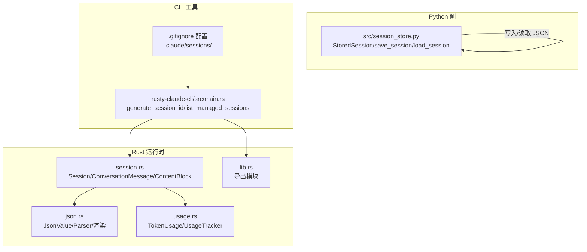
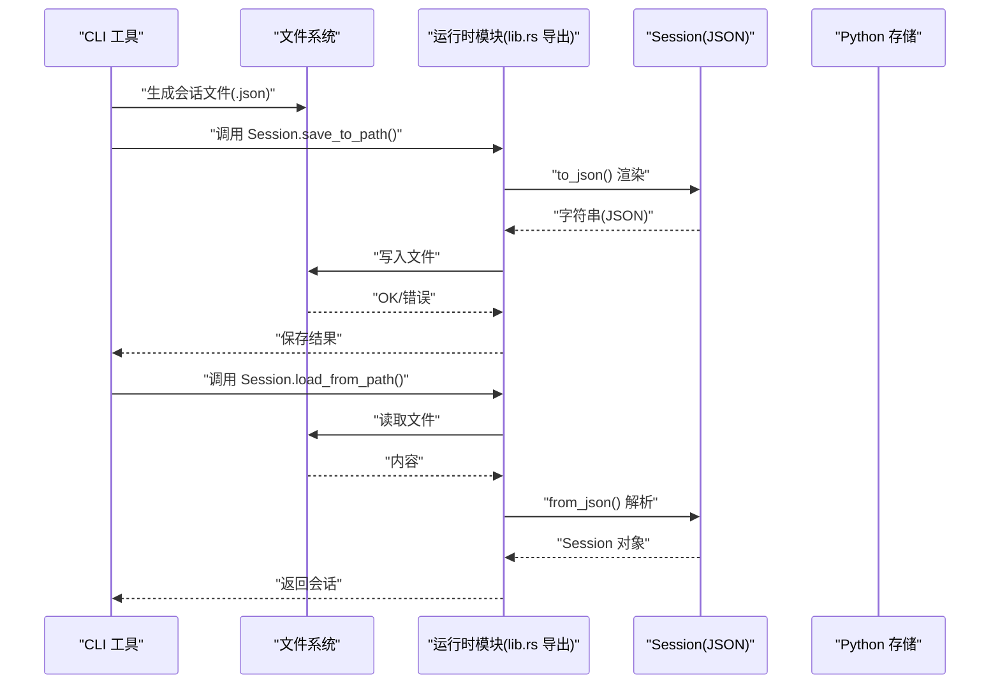
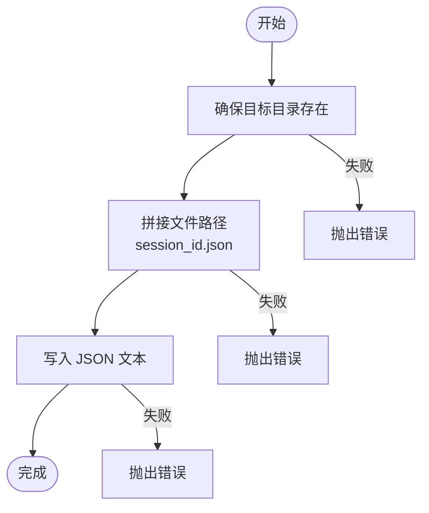
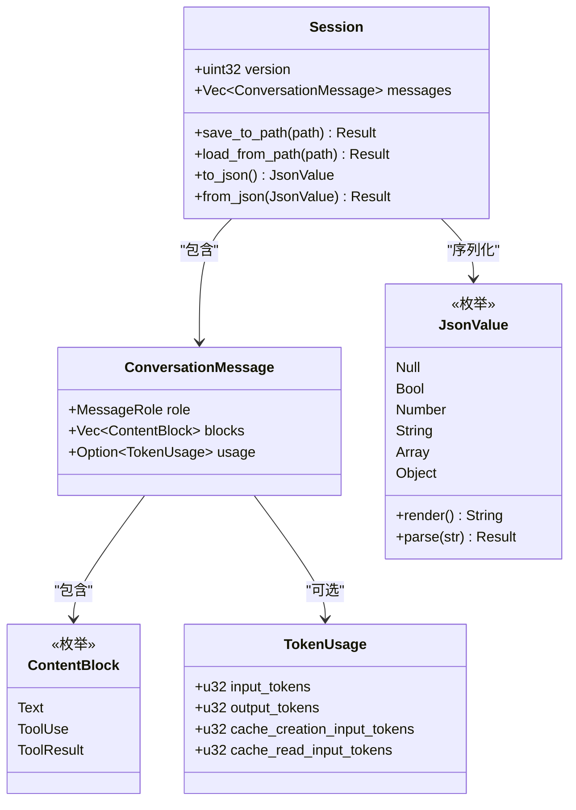
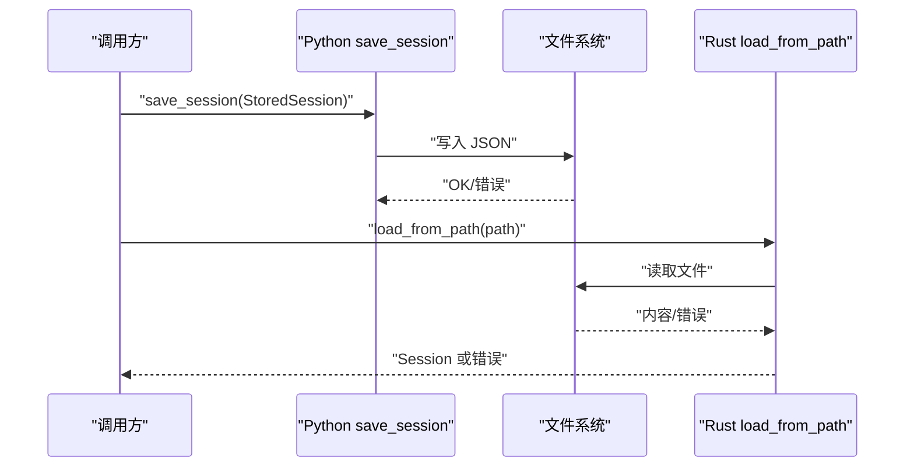
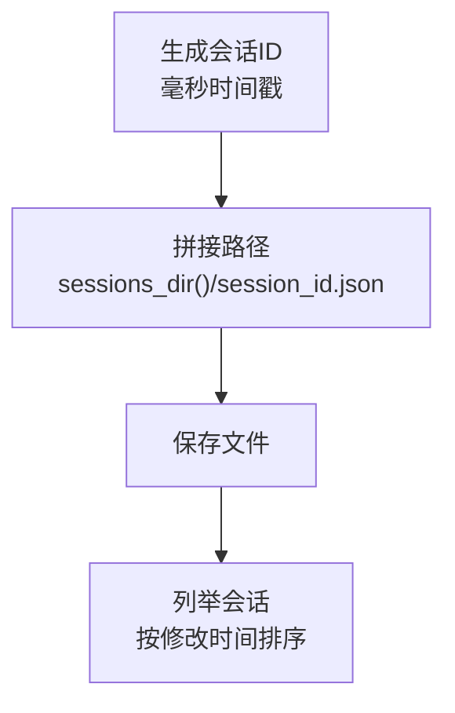
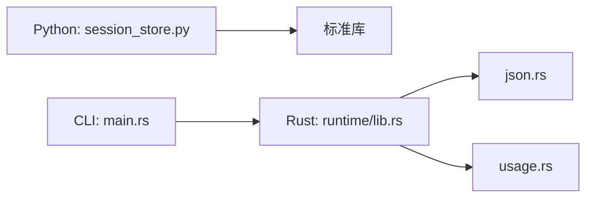

# 会话持久化

<cite>
**本文引用的文件**
- [src/session_store.py](file://src/session_store.py)
- [rust/crates/runtime/src/session.rs](file://rust/crates/runtime/src/session.rs)
- [rust/crates/runtime/src/json.rs](file://rust/crates/runtime/src/json.rs)
- [rust/crates/runtime/src/usage.rs](file://rust/crates/runtime/src/usage.rs)
- [rust/crates/rusty-claude-cli/src/main.rs](file://rust/crates/rusty-claude-cli/src/main.rs)
- [rust/crates/rusty-claude-cli/src/init.rs](file://rust/crates/rusty-claude-cli/src/init.rs)
- [rust/crates/runtime/src/lib.rs](file://rust/crates/runtime/src/lib.rs)
</cite>

## 目录
1. [简介](#简介)
2. [项目结构](#项目结构)
3. [核心组件](#核心组件)
4. [架构总览](#架构总览)
5. [组件详解](#组件详解)
6. [依赖关系分析](#依赖关系分析)
7. [性能与空间管理](#性能与空间管理)
8. [故障排查指南](#故障排查指南)
9. [结论](#结论)
10. [附录：文件命名与目录规范](#附录文件命名与目录规范)

## 简介
本文件面向 CLAW 项目的会话持久化能力，系统性阐述 Python 侧的轻量会话存储（StoredSession）与 Rust 侧的完整会话模型（Session 及其 JSON 序列化），并结合 CLI 工具对会话文件的管理实践，给出保存/加载流程、错误处理、并发与一致性、备份与迁移策略、性能优化与空间管理等完整技术文档。

## 项目结构
围绕会话持久化的相关代码主要分布在以下位置：
- Python 侧：会话数据结构与文件写入/读取逻辑
- Rust 侧：完整的会话模型、消息体、内容块、令牌用量、JSON 编解码与文件读写
- CLI 工具：会话文件的生成、列举、解析与清理

图表来源
- [src/session_store.py:1-36](file://src/session_store.py#L1-L36)
- [rust/crates/runtime/src/session.rs:1-433](file://rust/crates/runtime/src/session.rs#L1-L433)
- [rust/crates/runtime/src/json.rs:1-359](file://rust/crates/runtime/src/json.rs#L1-L359)
- [rust/crates/runtime/src/usage.rs:1-310](file://rust/crates/runtime/src/usage.rs#L1-L310)
- [rust/crates/rusty-claude-cli/src/main.rs:1781-1853](file://rust/crates/rusty-claude-cli/src/main.rs#L1781-L1853)
- [rust/crates/rusty-claude-cli/src/init.rs:11-12](file://rust/crates/rusty-claude-cli/src/init.rs#L11-L12)

章节来源
- [src/session_store.py:1-36](file://src/session_store.py#L1-L36)
- [rust/crates/runtime/src/session.rs:1-433](file://rust/crates/runtime/src/session.rs#L1-L433)
- [rust/crates/runtime/src/json.rs:1-359](file://rust/crates/runtime/src/json.rs#L1-L359)
- [rust/crates/runtime/src/usage.rs:1-310](file://rust/crates/runtime/src/usage.rs#L1-L310)
- [rust/crates/rusty-claude-cli/src/main.rs:1781-1853](file://rust/crates/rusty-claude-cli/src/main.rs#L1781-L1853)
- [rust/crates/rusty-claude-cli/src/init.rs:11-12](file://rust/crates/rusty-claude-cli/src/init.rs#L11-L12)

## 核心组件
- Python 侧 StoredSession：最小可用的数据载体，包含会话标识、消息序列与令牌用量统计。
- Rust 侧 Session：完整会话模型，支持多角色消息、工具调用/结果、令牌用量与版本字段，并提供 JSON 序列化/反序列化。
- JSON 编解码：自研 JsonValue/Parser 实现，确保可预测的键顺序与严格的字段校验。
- 令牌用量：TokenUsage 与 UsageTracker，用于统计与成本估算。
- CLI 工具：会话文件命名规范、目录组织、列举与清理。

章节来源
- [src/session_store.py:8-35](file://src/session_store.py#L8-L35)
- [rust/crates/runtime/src/session.rs:43-136](file://rust/crates/runtime/src/session.rs#L43-L136)
- [rust/crates/runtime/src/json.rs:4-113](file://rust/crates/runtime/src/json.rs#L4-L113)
- [rust/crates/runtime/src/usage.rs:28-209](file://rust/crates/runtime/src/usage.rs#L28-L209)
- [rust/crates/rusty-claude-cli/src/main.rs:1795-1853](file://rust/crates/rusty-claude-cli/src/main.rs#L1795-L1853)

## 架构总览
下图展示从 CLI 触发到会话文件落盘与恢复的关键流程，以及错误类型与处理边界。

图表来源
- [rust/crates/runtime/src/session.rs:88-96](file://rust/crates/runtime/src/session.rs#L88-L96)
- [rust/crates/runtime/src/session.rs:117-135](file://rust/crates/runtime/src/session.rs#L117-L135)
- [rust/crates/runtime/src/lib.rs:82](file://rust/crates/runtime/src/lib.rs#L82)

## 组件详解

### Python 侧：StoredSession 与文件存储
- 数据结构
  - 字段：会话 ID、消息元组、输入/输出令牌计数。
  - 冻结特性：避免意外修改，保障序列化一致性。
- 文件存储策略
  - 默认目录：当前工作目录下的固定目录名。
  - 文件名：以会话 ID 命名，扩展名为 .json。
  - 写入：先确保目录存在，再写入 JSON 文本。
- 加载策略
  - 从默认目录按 ID 查找对应 JSON 文件并解析为对象。
- 错误处理
  - 目录创建失败、文件读写失败、JSON 解析失败均会导致异常传播。
- 并发与一致性
  - 当前实现未内置锁或原子写入；在高并发场景需外部协调（见“并发与一致性”章节）。

图表来源
- [src/session_store.py:19-24](file://src/session_store.py#L19-L24)

章节来源
- [src/session_store.py:8-35](file://src/session_store.py#L8-L35)

### Rust 侧：Session 与 JSON 序列化
- 数据模型
  - Session：版本号 + 消息列表。
  - ConversationMessage：角色、内容块、可选令牌用量。
  - ContentBlock：文本、工具调用、工具结果三类。
  - TokenUsage：输入/输出/缓存写/缓存读令牌计数。
- JSON 序列化
  - to_json()/from_json()：严格字段检查与类型转换。
  - JsonValue/Parser：自研 JSON 表达与解析器，支持转义与错误定位。
- 文件操作
  - save_to_path()/load_from_path()：基于标准库文件读写。
- 错误类型
  - SessionError：IO/JSON/格式错误统一包装，便于上层处理。

图表来源
- [rust/crates/runtime/src/session.rs:43-136](file://rust/crates/runtime/src/session.rs#L43-L136)
- [rust/crates/runtime/src/session.rs:144-249](file://rust/crates/runtime/src/session.rs#L144-L249)
- [rust/crates/runtime/src/session.rs:251-325](file://rust/crates/runtime/src/session.rs#L251-L325)
- [rust/crates/runtime/src/usage.rs:28-34](file://rust/crates/runtime/src/usage.rs#L28-L34)
- [rust/crates/runtime/src/json.rs:4-113](file://rust/crates/runtime/src/json.rs#L4-L113)

章节来源
- [rust/crates/runtime/src/session.rs:43-136](file://rust/crates/runtime/src/session.rs#L43-L136)
- [rust/crates/runtime/src/json.rs:63-72](file://rust/crates/runtime/src/json.rs#L63-L72)
- [rust/crates/runtime/src/usage.rs:28-34](file://rust/crates/runtime/src/usage.rs#L28-L34)

### 保存与加载函数实现细节
- Python 侧
  - save_session：确保目录存在后写入 JSON；返回写入路径。
  - load_session：按 ID 定位文件并解析为 StoredSession。
- Rust 侧
  - save_to_path：将 Session 渲染为 JSON 字符串并写入文件。
  - load_from_path：读取文件内容并解析为 Session。
- 错误处理
  - IO 错误、JSON 解析错误、格式缺失/类型不匹配均通过统一错误类型返回。
- 异常情况
  - 文件不存在、权限不足、磁盘空间不足、JSON 结构非法等。

图表来源
- [src/session_store.py:19-35](file://src/session_store.py#L19-L35)
- [rust/crates/runtime/src/session.rs:88-96](file://rust/crates/runtime/src/session.rs#L88-L96)

章节来源
- [src/session_store.py:19-35](file://src/session_store.py#L19-L35)
- [rust/crates/runtime/src/session.rs:88-96](file://rust/crates/runtime/src/session.rs#L88-L96)

### 并发访问控制、文件锁定与一致性
- 现状
  - Python 侧未显式加锁；Rust 侧未内置文件锁。
- 风险
  - 多进程/多线程同时读写同一文件可能导致竞态、截断或损坏。
- 建议
  - 使用原子写入：先写临时文件，再 rename 覆盖。
  - 文件级互斥：在关键路径引入 flock/文件锁（跨平台需兼容）。
  - 读写分离：读多写少场景可采用“写时复制”或只追加策略。
  - 版本字段：Rust 侧 Session 已含 version 字段，可用于简单的一致性校验。

章节来源
- [rust/crates/runtime/src/session.rs:44](file://rust/crates/runtime/src/session.rs#L44)

### 备份、版本管理与迁移策略
- 备份
  - CLI 列举会话时可按修改时间排序，便于定期归档。
  - 建议：对重要会话进行时间戳命名的副本保留。
- 版本管理
  - Rust 侧 Session 含 version 字段；Python 侧可扩展加入版本号。
  - 升级时：解析旧版本 JSON，映射到新结构，补齐缺失字段。
- 迁移
  - 字段重命名/删除：提供迁移脚本，读取旧文件，写入新格式。
  - 兼容读：解析阶段对缺失字段提供默认值或报错提示。

章节来源
- [rust/crates/rusty-claude-cli/src/main.rs:1821-1853](file://rust/crates/rusty-claude-cli/src/main.rs#L1821-L1853)
- [rust/crates/runtime/src/session.rs:44](file://rust/crates/runtime/src/session.rs#L44)

### 存储路径与命名规范
- Python 侧
  - 默认目录：当前工作目录下的固定目录名。
  - 文件名：session_id.json。
- Rust 侧 CLI
  - 生成会话 ID：基于毫秒时间戳。
  - 会话目录：初始化阶段在 .gitignore 中声明忽略 .claude/sessions/。
  - 列举会话：遍历目录，过滤 .json 扩展名，按修改时间排序。

图表来源
- [rust/crates/rusty-claude-cli/src/main.rs:1795-1801](file://rust/crates/rusty-claude-cli/src/main.rs#L1795-L1801)
- [rust/crates/rusty-claude-cli/src/main.rs:1821-1853](file://rust/crates/rusty-claude-cli/src/main.rs#L1821-L1853)
- [rust/crates/rusty-claude-cli/src/init.rs:11-12](file://rust/crates/rusty-claude-cli/src/init.rs#L11-L12)

章节来源
- [src/session_store.py:16](file://src/session_store.py#L16)
- [rust/crates/rusty-claude-cli/src/main.rs:1795-1801](file://rust/crates/rusty-claude-cli/src/main.rs#L1795-L1801)
- [rust/crates/rusty-claude-cli/src/main.rs:1821-1853](file://rust/crates/rusty-claude-cli/src/main.rs#L1821-L1853)
- [rust/crates/rusty-claude-cli/src/init.rs:11-12](file://rust/crates/rusty-claude-cli/src/init.rs#L11-L12)

## 依赖关系分析
- Python 侧仅依赖标准库（dataclasses、json、pathlib）。
- Rust 侧依赖运行时模块导出，JSON 解析器与令牌用量模块。
- CLI 工具依赖运行时模块提供的会话读写接口。

图表来源
- [rust/crates/runtime/src/lib.rs:17](file://rust/crates/runtime/src/lib.rs#L17)
- [rust/crates/runtime/src/json.rs:1-359](file://rust/crates/runtime/src/json.rs#L1-L359)
- [rust/crates/runtime/src/usage.rs:1-310](file://rust/crates/runtime/src/usage.rs#L1-L310)
- [rust/crates/rusty-claude-cli/src/main.rs:32-39](file://rust/crates/rusty-claude-cli/src/main.rs#L32-L39)

章节来源
- [rust/crates/runtime/src/lib.rs:17-85](file://rust/crates/runtime/src/lib.rs#L17-L85)
- [rust/crates/rusty-claude-cli/src/main.rs:32-39](file://rust/crates/rusty-claude-cli/src/main.rs#L32-L39)

## 性能与空间管理
- JSON 渲染与解析
  - 自研 JsonValue/Parser，避免第三方依赖；注意大文件解析的内存占用。
- 会话压缩与归档
  - 对历史会话进行压缩归档，减少磁盘占用。
- 增量写入
  - 若消息体量较大，考虑分片或增量追加策略（需配合版本与校验）。
- 目录扫描
  - 列举会话时限制数量与时间窗口，避免大规模目录扫描带来的 I/O 压力。

[本节为通用指导，无需列出章节来源]

## 故障排查指南
- 常见错误类型
  - IO 错误：文件不存在、权限不足、磁盘空间不足。
  - JSON 错误：语法错误、字段缺失、类型不匹配。
  - 格式错误：缺少必要字段、数值越界。
- 排查步骤
  - 确认会话文件是否存在且可读写。
  - 检查 JSON 结构是否符合预期（键顺序、类型）。
  - 校验版本字段与解析器支持范围。
- 修复建议
  - 使用原子写入替换直接覆盖。
  - 对缺失字段提供默认值或引导用户修复。
  - 在 CLI 层增加更友好的错误提示与回退策略。

章节来源
- [rust/crates/runtime/src/session.rs:48-77](file://rust/crates/runtime/src/session.rs#L48-L77)
- [rust/crates/runtime/src/json.rs:63-72](file://rust/crates/runtime/src/json.rs#L63-L72)

## 结论
- Python 侧提供简洁可靠的会话文件存储能力，适合轻量场景与快速集成。
- Rust 侧提供完整、健壮的会话模型与 JSON 编解码，适合复杂对话与工具链集成。
- CLI 工具完善了会话生命周期管理，包括生成、列举与清理。
- 建议在生产环境中引入原子写入、文件锁与版本迁移机制，以提升可靠性与可维护性。

[本节为总结，无需列出章节来源]

## 附录：文件命名与目录规范
- Python 侧
  - 默认目录：当前工作目录下的固定目录名。
  - 文件命名：session_id.json。
- Rust 侧 CLI
  - 会话 ID：基于毫秒时间戳生成。
  - 目录组织：.claude/sessions/（由 .gitignore 约定忽略）。
  - 列举规则：仅处理 .json 文件，按最后修改时间倒序。

章节来源
- [src/session_store.py:16](file://src/session_store.py#L16)
- [rust/crates/rusty-claude-cli/src/main.rs:1795-1801](file://rust/crates/rusty-claude-cli/src/main.rs#L1795-L1801)
- [rust/crates/rusty-claude-cli/src/main.rs:1821-1853](file://rust/crates/rusty-claude-cli/src/main.rs#L1821-L1853)
- [rust/crates/rusty-claude-cli/src/init.rs:11-12](file://rust/crates/rusty-claude-cli/src/init.rs#L11-L12)