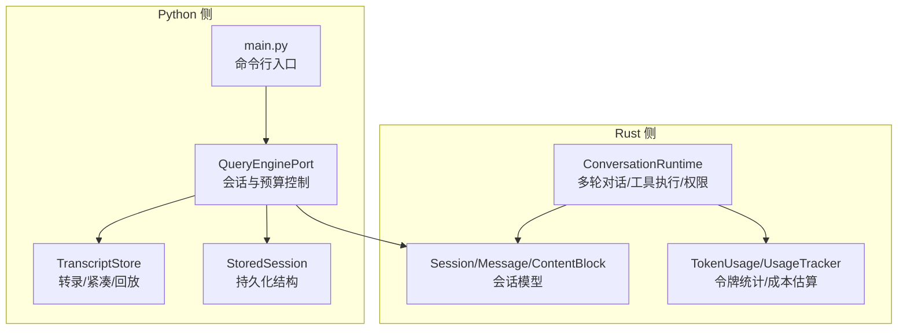
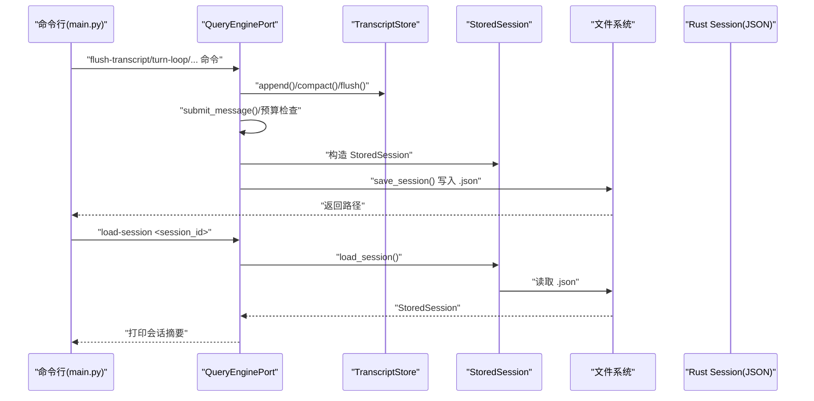
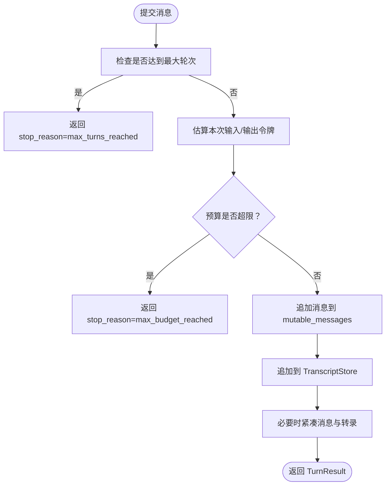
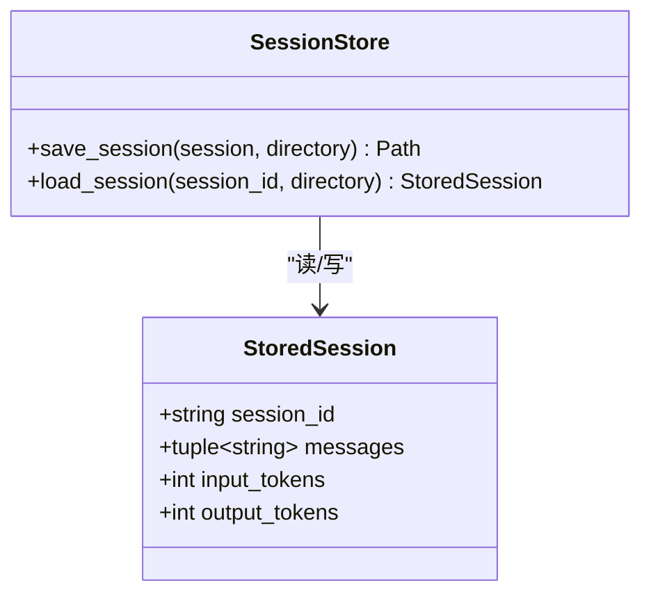
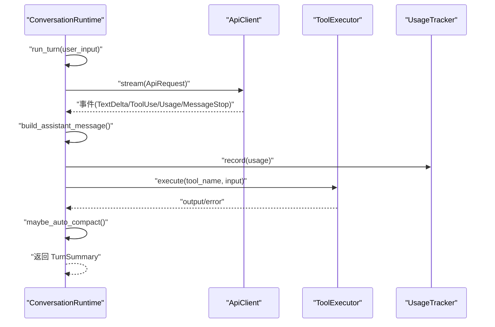
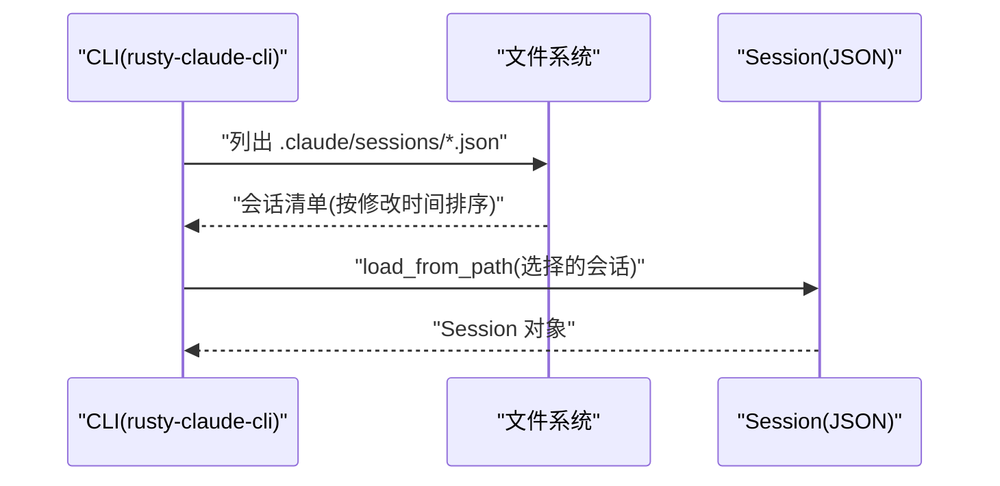
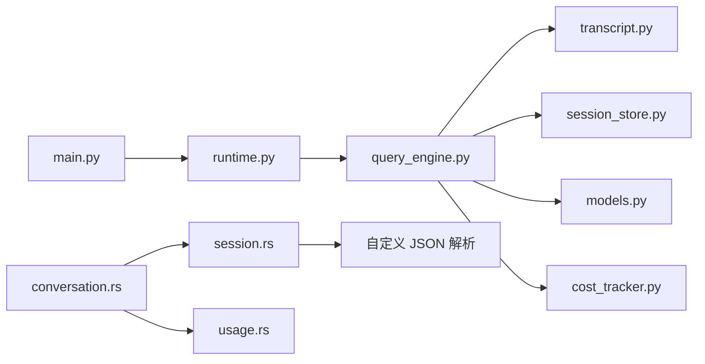

# 会话管理

<cite>
**本文引用的文件**
- [src/session_store.py](file://src/session_store.py)
- [src/transcript.py](file://src/transcript.py)
- [src/history.py](file://src/history.py)
- [src/models.py](file://src/models.py)
- [src/cost_tracker.py](file://src/cost_tracker.py)
- [src/query_engine.py](file://src/query_engine.py)
- [src/runtime.py](file://src/runtime.py)
- [src/main.py](file://src/main.py)
- [rust/crates/runtime/src/session.rs](file://rust/crates/runtime/src/session.rs)
- [rust/crates/runtime/src/conversation.rs](file://rust/crates/runtime/src/conversation.rs)
- [rust/crates/runtime/src/usage.rs](file://rust/crates/runtime/src/usage.rs)
- [rust/crates/rusty-claude-cli/src/main.rs](file://rust/crates/rusty-claude-cli/src/main.rs)
- [rust/.claude/sessions/session-1775007453382.json](file://rust/.claude/sessions/session-1775007453382.json)
</cite>

## 目录
1. [引言](#引言)
2. [项目结构](#项目结构)
3. [核心组件](#核心组件)
4. [架构总览](#架构总览)
5. [详细组件分析](#详细组件分析)
6. [依赖分析](#依赖分析)
7. [性能考虑](#性能考虑)
8. [故障排查指南](#故障排查指南)
9. [结论](#结论)
10. [附录](#附录)

## 引言
本技术文档聚焦于 CLAW 项目的会话管理系统，系统性阐述多轮对话支持、状态持久化、令牌预算控制、会话存储格式与序列化/恢复流程、会话生命周期管理、并发控制与一致性保障、会话导出/导入/迁移、会话历史记录管理与检索、以及性能优化与内存管理策略。文档面向不同技术背景的读者，既提供高层概览，也给出代码级细节与可视化图示。

## 项目结构
会话管理涉及 Python 侧与 Rust 侧两套实现：
- Python 侧：提供会话存取接口、转录（对话历史）管理、预算控制、成本跟踪、运行时会话封装与命令行入口。
- Rust 侧：提供强类型会话模型、消息与内容块结构、JSON 序列化/反序列化、使用量统计与自动压缩、多轮对话运行时。



**图表来源**
- [src/query_engine.py:35-150](file://src/query_engine.py#L35-L150)
- [src/transcript.py:6-23](file://src/transcript.py#L6-L23)
- [src/session_store.py:8-35](file://src/session_store.py#L8-L35)
- [src/main.py:94-170](file://src/main.py#L94-L170)
- [rust/crates/runtime/src/session.rs:43-136](file://rust/crates/runtime/src/session.rs#L43-L136)
- [rust/crates/runtime/src/conversation.rs:104-186](file://rust/crates/runtime/src/conversation.rs#L104-L186)
- [rust/crates/runtime/src/usage.rs:28-209](file://rust/crates/runtime/src/usage.rs#L28-L209)

**章节来源**
- [src/query_engine.py:1-194](file://src/query_engine.py#L1-L194)
- [src/transcript.py:1-24](file://src/transcript.py#L1-L24)
- [src/session_store.py:1-36](file://src/session_store.py#L1-L36)
- [src/main.py:1-214](file://src/main.py#L1-L214)
- [rust/crates/runtime/src/session.rs:1-433](file://rust/crates/runtime/src/session.rs#L1-L433)
- [rust/crates/runtime/src/conversation.rs:1-800](file://rust/crates/runtime/src/conversation.rs#L1-L800)
- [rust/crates/runtime/src/usage.rs:1-310](file://rust/crates/runtime/src/usage.rs#L1-L310)

## 核心组件
- Python 会话与预算控制：通过 QueryEnginePort 管理会话 ID、消息列表、权限拒绝、使用量汇总与预算检查；支持紧凑策略与结构化输出。
- 转录管理：TranscriptStore 提供追加、紧凑保留最后 N 条、回放与刷新标记。
- 存储结构：StoredSession 定义持久化字段（会话 ID、消息元组、输入/输出令牌数），并提供保存/加载。
- Rust 会话模型：Session/ConversationMessage/ContentBlock 支持角色、文本/工具调用/工具结果等多类型内容块，并可序列化为 JSON。
- 使用量与成本：TokenUsage/UsageTracker 记录累计与当前回合用量，支持按模型定价估算成本。
- 运行时多轮：ConversationRuntime 驱动用户输入、流式助手事件、工具调用、权限决策与自动压缩。

**章节来源**
- [src/query_engine.py:15-150](file://src/query_engine.py#L15-L150)
- [src/transcript.py:6-23](file://src/transcript.py#L6-L23)
- [src/session_store.py:8-35](file://src/session_store.py#L8-L35)
- [rust/crates/runtime/src/session.rs:43-136](file://rust/crates/runtime/src/session.rs#L43-L136)
- [rust/crates/runtime/src/usage.rs:28-209](file://rust/crates/runtime/src/usage.rs#L28-L209)
- [rust/crates/runtime/src/conversation.rs:104-186](file://rust/crates/runtime/src/conversation.rs#L104-L186)

## 架构总览
下图展示从命令行到会话持久化的端到端流程，以及 Rust 侧会话模型在序列化/反序列化中的位置。



**图表来源**
- [src/main.py:94-170](file://src/main.py#L94-L170)
- [src/query_engine.py:140-150](file://src/query_engine.py#L140-L150)
- [src/session_store.py:19-35](file://src/session_store.py#L19-L35)
- [src/transcript.py:11-23](file://src/transcript.py#L11-L23)

## 详细组件分析

### Python 会话与预算控制（QueryEnginePort）
- 会话标识与消息：维护 session_id、mutable_messages、permission_denials、total_usage、transcript_store。
- 预算控制：基于 max_turns 与 max_budget_tokens 的组合约束，超过预算时停止原因标记为“max_budget_reached”。
- 紧凑策略：当消息数量超过 compact_after_turns 时，仅保留最近 N 条并同步压缩转录。
- 结构化输出：支持结构化渲染失败重试，确保稳定输出。
- 持久化：flush_transcript 后将当前状态写入 StoredSession 并返回文件路径。



**图表来源**
- [src/query_engine.py:61-104](file://src/query_engine.py#L61-L104)
- [src/query_engine.py:129-132](file://src/query_engine.py#L129-L132)

**章节来源**
- [src/query_engine.py:15-194](file://src/query_engine.py#L15-L194)

### 转录管理（TranscriptStore）
- 数据结构：entries 列表与 flushed 标记。
- 操作语义：append 追加后将 flushed 置为 False；compact 仅保留最近 N 条；replay 返回只读元组；flush 将 flushed 置为 True。
- 与预算控制配合：在持久化前 flush，避免重复写入冗余历史。

**章节来源**
- [src/transcript.py:6-23](file://src/transcript.py#L6-L23)

### 会话存储格式与序列化/恢复（StoredSession）
- 字段：session_id、messages（元组）、input_tokens、output_tokens。
- 保存：目录默认为 .port_sessions，文件名形如 <session_id>.json。
- 加载：读取 JSON 并转换为 StoredSession，其中 messages 转换为元组。



**图表来源**
- [src/session_store.py:8-35](file://src/session_store.py#L8-L35)

**章节来源**
- [src/session_store.py:1-36](file://src/session_store.py#L1-L36)

### Rust 会话模型与序列化（Session/Message/ContentBlock）
- 角色与内容块：支持 System/User/Assistant/Tool 四类角色，内容块包括 Text、ToolUse、ToolResult。
- 会话结构：version 与 messages 数组，支持 to_json/from_json。
- 使用量：每条消息可携带 TokenUsage，用于统计与成本估算。
- 自动压缩阈值：可通过环境变量设置自动压缩阈值，超过阈值触发压缩并更新会话。

```mermaid
classDiagram
class Session {
+uint32 version
+Vec~ConversationMessage~ messages
+to_json() JsonValue
+from_json(JsonValue) Result
+save_to_path(Path) Result
+load_from_path(Path) Result
}
class ConversationMessage {
+MessageRole role
+Vec~ContentBlock~ blocks
+Option~TokenUsage~ usage
}
class ContentBlock {
<<enum>>
Text{text}
ToolUse{id,name,input}
ToolResult{tool_use_id,tool_name,output,is_error}
}
class TokenUsage {
+u32 input_tokens
+u32 output_tokens
+u32 cache_creation_input_tokens
+u32 cache_read_input_tokens
}
Session --> ConversationMessage : "包含"
ConversationMessage --> ContentBlock : "包含"
ConversationMessage --> TokenUsage : "可选"
```

**图表来源**
- [rust/crates/runtime/src/session.rs:43-136](file://rust/crates/runtime/src/session.rs#L43-L136)
- [rust/crates/runtime/src/session.rs:144-249](file://rust/crates/runtime/src/session.rs#L144-L249)
- [rust/crates/runtime/src/session.rs:251-325](file://rust/crates/runtime/src/session.rs#L251-L325)
- [rust/crates/runtime/src/usage.rs:28-34](file://rust/crates/runtime/src/usage.rs#L28-L34)

**章节来源**
- [rust/crates/runtime/src/session.rs:1-433](file://rust/crates/runtime/src/session.rs#L1-L433)
- [rust/crates/runtime/src/usage.rs:1-310](file://rust/crates/runtime/src/usage.rs#L1-L310)

### 多轮对话运行时（ConversationRuntime）
- 输入处理：接收用户输入，构建 ApiRequest 并驱动 API 流式事件。
- 助手消息合成：将流式事件合并为 ConversationMessage，提取 usage 并记录到 UsageTracker。
- 工具调用：解析 ContentBlock::ToolUse，进行权限决策与插件钩子，执行工具并生成 ToolResult。
- 自动压缩：根据单轮输入令牌阈值触发压缩，减少消息数量与内存占用。
- 生命周期：实现 Drop 以确保插件资源释放。



**图表来源**
- [rust/crates/runtime/src/conversation.rs:317-501](file://rust/crates/runtime/src/conversation.rs#L317-L501)
- [rust/crates/runtime/src/conversation.rs:601-638](file://rust/crates/runtime/src/conversation.rs#L601-L638)
- [rust/crates/runtime/src/conversation.rs:553-575](file://rust/crates/runtime/src/conversation.rs#L553-L575)

**章节来源**
- [rust/crates/runtime/src/conversation.rs:1-800](file://rust/crates/runtime/src/conversation.rs#L1-L800)

### 令牌预算控制与成本估算（UsageTracker/TokenUsage）
- TokenUsage：记录输入/输出/缓存写/缓存读令牌，支持总计与成本估算。
- UsageTracker：从会话重建累计用量，记录当前回合用量与轮次数。
- 成本估算：内置默认与模型特定定价，支持 USD 格式化输出与摘要行。

**章节来源**
- [rust/crates/runtime/src/usage.rs:28-209](file://rust/crates/runtime/src/usage.rs#L28-L209)

### 会话生命周期管理
- 创建：QueryEnginePort.from_workspace 或 from_saved_session 初始化会话。
- 运行：run_turn_loop/submit_message 推进多轮对话，记录权限拒绝与使用量。
- 持久化：flush_transcript 后保存 StoredSession，返回文件路径。
- 加载：main.py 的 load-session 子命令读取 StoredSession 并打印摘要。
- 清理：ConversationRuntime Drop 时关闭插件。

**章节来源**
- [src/query_engine.py:45-59](file://src/query_engine.py#L45-L59)
- [src/query_engine.py:140-150](file://src/query_engine.py#L140-L150)
- [src/main.py:167-170](file://src/main.py#L167-L170)
- [rust/crates/runtime/src/conversation.rs:578-582](file://rust/crates/runtime/src/conversation.rs#L578-L582)

### 并发控制与数据一致性
- Python 侧：会话状态由 QueryEnginePort 单线程推进，TranscriptStore 为本地内存结构，无显式锁；建议在应用层串行化对同一会话的操作。
- Rust 侧：ConversationRuntime 为单实例运行时，内部状态在 run_turn 中顺序更新；序列化/反序列化为纯函数，不共享可变状态。
- 一致性：会话文件采用原子写入（保存时一次性写入 JSON 文本），加载时解析完整 JSON，避免部分写入导致的不一致。

**章节来源**
- [src/query_engine.py:140-150](file://src/query_engine.py#L140-L150)
- [src/session_store.py:19-24](file://src/session_store.py#L19-L24)
- [rust/crates/runtime/src/session.rs:88-96](file://rust/crates/runtime/src/session.rs#L88-L96)

### 会话历史记录管理与检索
- 历史日志：HistoryLog 维护事件列表，支持添加与 Markdown 导出。
- 运行时会话：RuntimeSession 包含历史对象，最终渲染到 Markdown 报告中。
- 转录回放：QueryEnginePort.replay_user_messages 返回只读历史元组，便于检索。

**章节来源**
- [src/history.py:6-23](file://src/history.py#L6-L23)
- [src/runtime.py:24-86](file://src/runtime.py#L24-L86)
- [src/query_engine.py:134-135](file://src/query_engine.py#L134-L135)

### 会话导出、导入与迁移
- 导出：QueryEnginePort.persist_session 将当前会话写入 .port_sessions/<session_id>.json。
- 导入：QueryEnginePort.from_saved_session 从已保存会话重建运行时状态。
- 迁移：Rust 侧 Session 支持版本字段与 JSON 结构，便于未来演进；CLI 提供列出受管会话与解析会话引用的能力。



**图表来源**
- [rust/crates/rusty-claude-cli/src/main.rs:1821-1853](file://rust/crates/rusty-claude-cli/src/main.rs#L1821-L1853)
- [rust/crates/runtime/src/session.rs:93-96](file://rust/crates/runtime/src/session.rs#L93-L96)

**章节来源**
- [src/query_engine.py:49-59](file://src/query_engine.py#L49-L59)
- [src/query_engine.py:140-150](file://src/query_engine.py#L140-L150)
- [rust/crates/rusty-claude-cli/src/main.rs:1821-1853](file://rust/crates/rusty-claude-cli/src/main.rs#L1821-L1853)
- [rust/crates/runtime/src/session.rs:93-96](file://rust/crates/runtime/src/session.rs#L93-L96)

## 依赖分析
- Python 侧依赖关系：main.py 调用 runtime 与 session_store；runtime 调用 query_engine；query_engine 依赖 transcript、session_store、models、cost_tracker。
- Rust 侧依赖关系：conversation 依赖 session 与 usage；session 依赖自定义 JSON 解析器；usage 提供 TokenUsage/UsageTracker。



**图表来源**
- [src/main.py:1-214](file://src/main.py#L1-L214)
- [src/runtime.py:1-193](file://src/runtime.py#L1-L193)
- [src/query_engine.py:1-194](file://src/query_engine.py#L1-L194)
- [src/transcript.py:1-24](file://src/transcript.py#L1-L24)
- [src/session_store.py:1-36](file://src/session_store.py#L1-L36)
- [src/models.py:1-50](file://src/models.py#L1-L50)
- [src/cost_tracker.py:1-14](file://src/cost_tracker.py#L1-L14)
- [rust/crates/runtime/src/conversation.rs:1-800](file://rust/crates/runtime/src/conversation.rs#L1-L800)
- [rust/crates/runtime/src/session.rs:1-433](file://rust/crates/runtime/src/session.rs#L1-L433)
- [rust/crates/runtime/src/usage.rs:1-310](file://rust/crates/runtime/src/usage.rs#L1-L310)

**章节来源**
- [src/main.py:1-214](file://src/main.py#L1-L214)
- [src/runtime.py:1-193](file://src/runtime.py#L1-L193)
- [src/query_engine.py:1-194](file://src/query_engine.py#L1-L194)
- [rust/crates/runtime/src/conversation.rs:1-800](file://rust/crates/runtime/src/conversation.rs#L1-L800)

## 性能考虑
- 内存管理
  - Python：TranscriptStore 在达到阈值时进行原地切片保留最近 N 条，降低内存峰值；QueryEnginePort 的 compact_messages_if_needed 与 TranscriptStore.compact 协同工作。
  - Rust：ConversationRuntime.run_turn 中按需克隆消息，避免不必要的拷贝；maybe_auto_compact 在高输入令牌轮次时触发压缩，减少消息数量。
- 序列化开销
  - Python：StoredSession 以紧凑 JSON 写入，避免频繁小写入；Rust：Session.to_json 使用有序映射与批量序列化，减少分配。
- 预算与吞吐
  - QueryEnginePort 的 max_budget_tokens 与 max_turns 控制整体吞吐与成本；Rust 侧自动压缩阈值可动态调整以平衡性能与成本。
- I/O 优化
  - 会话文件采用一次性写入，减少碎片与竞争；CLI 列出会话时按修改时间排序，便于快速定位最新会话。

**章节来源**
- [src/query_engine.py:129-132](file://src/query_engine.py#L129-L132)
- [src/transcript.py:15-17](file://src/transcript.py#L15-L17)
- [rust/crates/runtime/src/conversation.rs:553-575](file://rust/crates/runtime/src/conversation.rs#L553-L575)
- [rust/crates/runtime/src/session.rs:98-115](file://rust/crates/runtime/src/session.rs#L98-L115)

## 故障排查指南
- 会话加载失败
  - 症状：load-session 报错或返回空消息。
  - 排查：确认 .port_sessions/<session_id>.json 是否存在且为有效 JSON；检查字段完整性（version/messages）。
- 预算限制导致提前终止
  - 症状：stop_reason 为 “max_budget_reached”。
  - 排查：检查 max_budget_tokens 与当前累计 input_tokens+output_tokens；适当提高预算或减少轮次。
- 自动压缩未生效
  - 症状：会话增长过快。
  - 排查：检查 CLAUDE_CODE_AUTO_COMPACT_INPUT_TOKENS 环境变量；确认单轮输入令牌是否超过阈值。
- 成本估算异常
  - 症状：未知模型导致估算默认值提示。
  - 排查：传入具体模型名称以启用模型特定定价；或接受默认估算。

**章节来源**
- [src/main.py:167-170](file://src/main.py#L167-L170)
- [src/query_engine.py:89-90](file://src/query_engine.py#L89-L90)
- [rust/crates/runtime/src/conversation.rs:585-599](file://rust/crates/runtime/src/conversation.rs#L585-L599)
- [rust/crates/runtime/src/usage.rs:55-77](file://rust/crates/runtime/src/usage.rs#L55-L77)

## 结论
CLAW 的会话管理系统在 Python 与 Rust 两侧协同工作：Python 侧负责会话生命周期、预算控制与持久化，Rust 侧提供强类型的会话模型与高效的多轮对话运行时。通过紧凑策略、自动压缩与严格的序列化/反序列化，系统在功能完整性与性能之间取得良好平衡。建议在生产环境中结合预算参数与自动压缩阈值进行调优，并通过 CLI 与 API 稳健地完成会话的导出、导入与迁移。

## 附录
- 示例会话文件
  - [rust/.claude/sessions/session-1775007453382.json:1-1](file://rust/.claude/sessions/session-1775007453382.json#L1-L1)
- 命令行入口
  - [src/main.py:94-170](file://src/main.py#L94-L170)