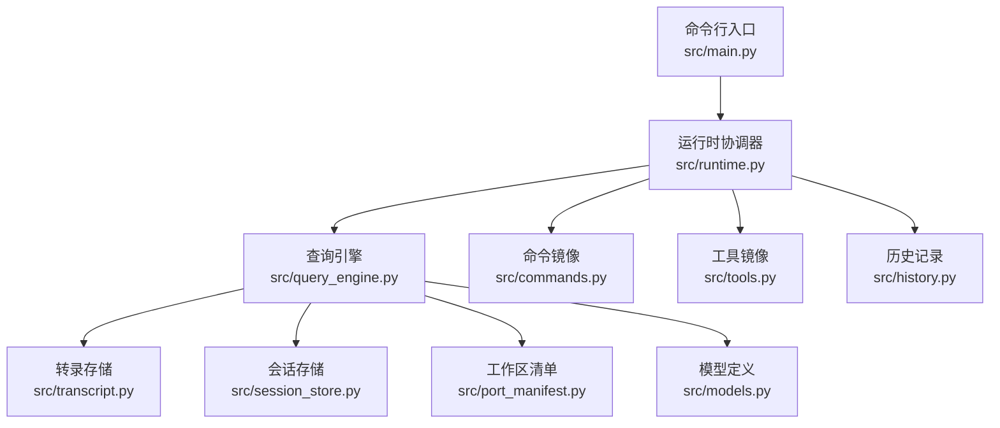
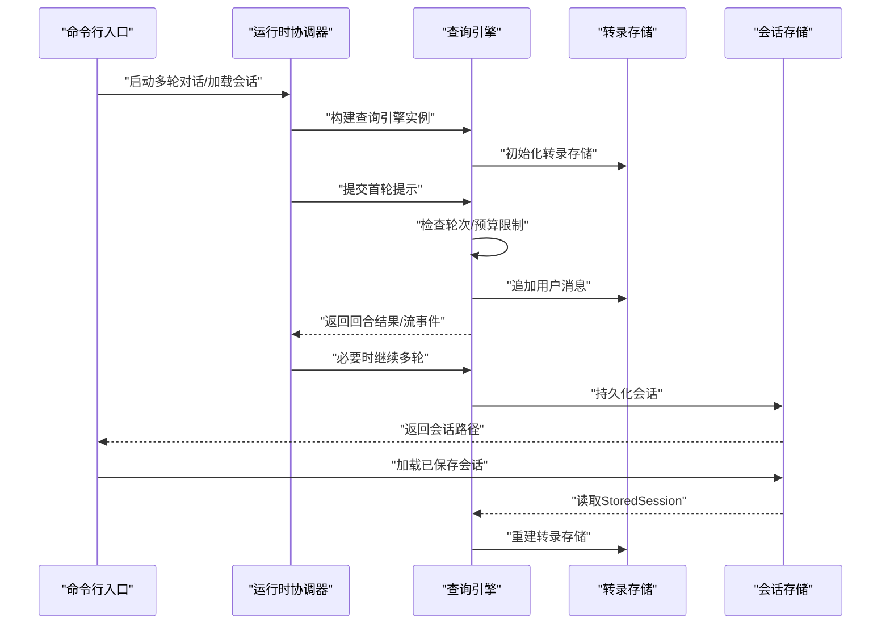
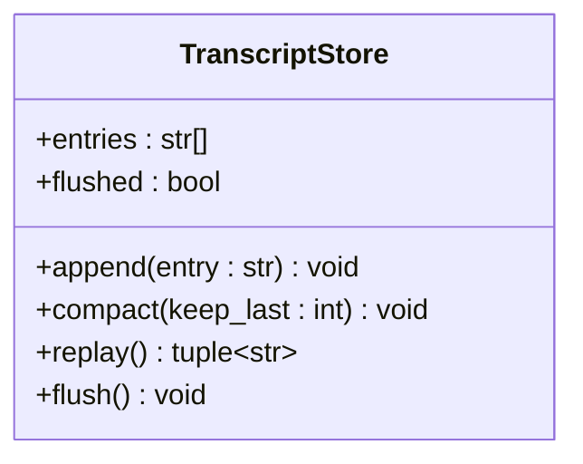
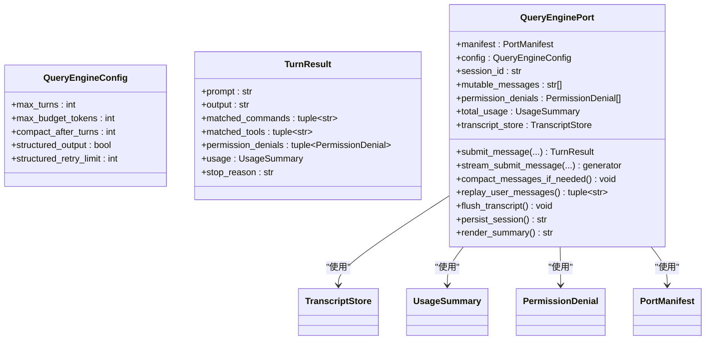
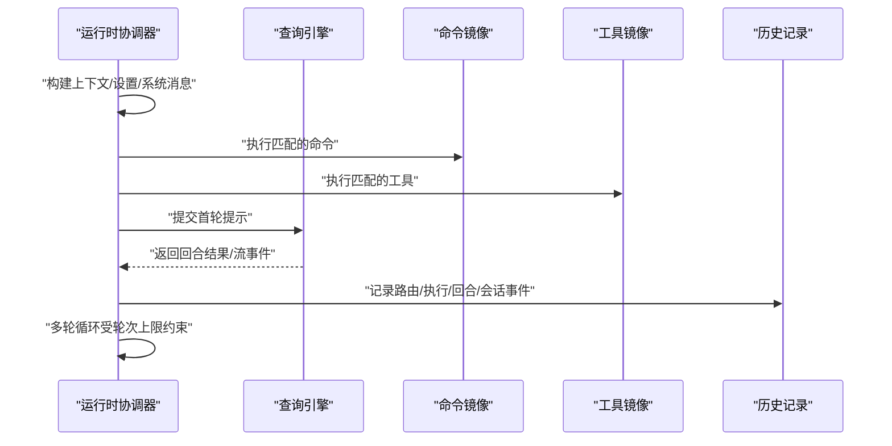
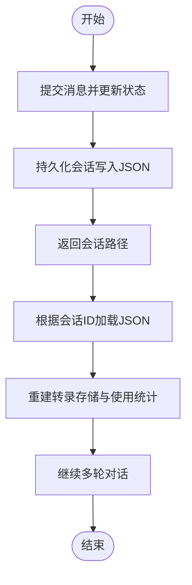
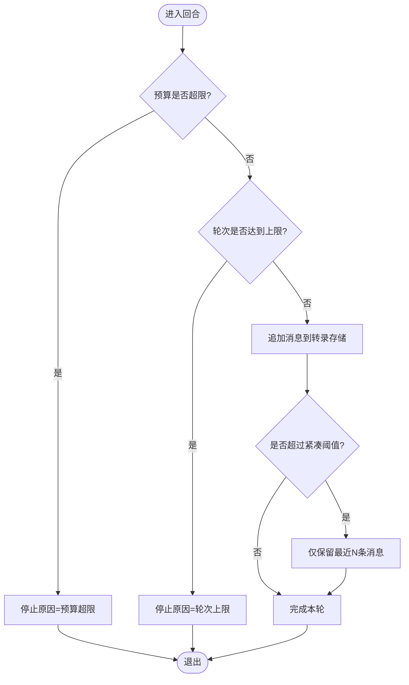
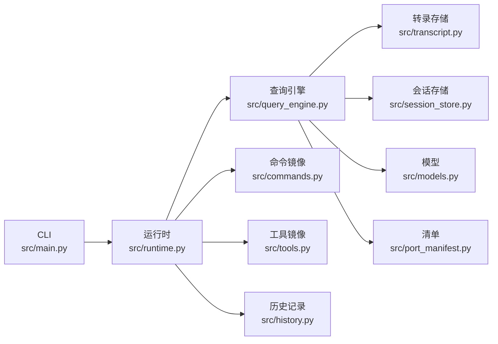

# 多轮对话支持

<cite>
**本文引用的文件**
- [src/transcript.py](file://src/transcript.py)
- [src/history.py](file://src/history.py)
- [src/session_store.py](file://src/session_store.py)
- [src/query_engine.py](file://src/query_engine.py)
- [src/runtime.py](file://src/runtime.py)
- [src/main.py](file://src/main.py)
- [src/models.py](file://src/models.py)
- [src/port_manifest.py](file://src/port_manifest.py)
- [src/commands.py](file://src/commands.py)
- [src/tools.py](file://src/tools.py)
- [rust/crates/runtime/src/compact.rs](file://rust/crates/runtime/src/compact.rs)
- [rust/crates/runtime/src/session.rs](file://rust/crates/runtime/src/session.rs)
- [rust/crates/rusty-claude-cli/src/main.rs](file://rust/crates/rusty-claude-cli/src/main.rs)
</cite>

## 目录
1. [引言](#引言)
2. [项目结构](#项目结构)
3. [核心组件](#核心组件)
4. [架构总览](#架构总览)
5. [详细组件分析](#详细组件分析)
6. [依赖关系分析](#依赖关系分析)
7. [性能考量](#性能考量)
8. [故障排查指南](#故障排查指南)
9. [结论](#结论)
10. [附录](#附录)

## 引言
本技术文档聚焦 CLAW 项目的“多轮对话支持”能力，系统阐述对话状态管理、消息上下文维护与对话历史跟踪的实现机制；详解 Transcript 类的设计模式、消息序列化与反序列化流程；说明对话轮次的自动管理、上下文窗口大小控制与消息去重策略；给出对话状态保存与恢复的完整流程；解释与查询引擎的集成方式与实时对话处理机制，并总结对话质量优化与用户体验改进的最佳实践。

## 项目结构
CLAW 的多轮对话能力由 Python 层的查询引擎与运行时协调器驱动，配合会话持久化与历史记录模块共同完成。关键文件与职责如下：
- 查询引擎：负责对话回合提交、预算与轮次控制、流式输出、会话持久化与摘要渲染
- 运行时协调器：负责路由提示、执行命令/工具、组装运行时会话并触发查询引擎
- 会话存储：负责会话数据的序列化与反序列化（JSON）
- Transcript：负责消息条目的追加、紧凑化与回放
- 历史记录：负责会话事件的记录与 Markdown 导出
- 模型与清单：共享数据结构与工作区清单生成
- CLI：提供命令入口以启动多轮对话、加载会话、刷新转录等

图表来源
- [src/main.py:94-214](file://src/main.py#L94-L214)
- [src/runtime.py:89-193](file://src/runtime.py#L89-L193)
- [src/query_engine.py:35-194](file://src/query_engine.py#L35-L194)
- [src/transcript.py:6-24](file://src/transcript.py#L6-L24)
- [src/session_store.py:8-36](file://src/session_store.py#L8-L36)
- [src/port_manifest.py:12-53](file://src/port_manifest.py#L12-L53)
- [src/models.py:6-50](file://src/models.py#L6-L50)
- [src/commands.py:22-91](file://src/commands.py#L22-L91)
- [src/tools.py:23-97](file://src/tools.py#L23-L97)
- [src/history.py:6-23](file://src/history.py#L6-L23)

章节来源
- [src/main.py:94-214](file://src/main.py#L94-L214)
- [src/runtime.py:89-193](file://src/runtime.py#L89-L193)
- [src/query_engine.py:35-194](file://src/query_engine.py#L35-L194)
- [src/transcript.py:6-24](file://src/transcript.py#L6-L24)
- [src/session_store.py:8-36](file://src/session_store.py#L8-L36)
- [src/port_manifest.py:12-53](file://src/port_manifest.py#L12-L53)
- [src/models.py:6-50](file://src/models.py#L6-L50)
- [src/commands.py:22-91](file://src/commands.py#L22-L91)
- [src/tools.py:23-97](file://src/tools.py#L23-L97)
- [src/history.py:6-23](file://src/history.py#L6-L23)

## 核心组件
- TranscriptStore：轻量的消息条目容器，支持追加、紧凑化与回放，用于维护对话上下文窗口
- QueryEnginePort：多轮对话的核心控制器，负责回合提交、预算与轮次限制、流式输出、紧凑化与会话持久化
- RuntimeSession：运行时会话对象，封装上下文、设置、历史、路由结果、流事件与持久化路径
- StoredSession：会话持久化载体，包含会话 ID、消息元组、输入/输出令牌统计
- HistoryLog：会话事件日志，支持添加事件与导出为 Markdown
- PortManifest：工作区清单，提供模块分布与文件统计信息
- PortContext：工作区上下文，提供根目录与文件计数等信息

章节来源
- [src/transcript.py:6-24](file://src/transcript.py#L6-L24)
- [src/query_engine.py:35-194](file://src/query_engine.py#L35-L194)
- [src/runtime.py:24-87](file://src/runtime.py#L24-L87)
- [src/session_store.py:8-36](file://src/session_store.py#L8-L36)
- [src/history.py:6-23](file://src/history.py#L6-L23)
- [src/port_manifest.py:12-53](file://src/port_manifest.py#L12-L53)
- [src/context.py:7-48](file://src/context.py#L7-L48)

## 架构总览
下图展示从 CLI 到运行时、再到查询引擎与存储的端到端交互流程，以及会话的保存与恢复路径。

图表来源
- [src/main.py:153-170](file://src/main.py#L153-L170)
- [src/runtime.py:109-152](file://src/runtime.py#L109-L152)
- [src/query_engine.py:45-151](file://src/query_engine.py#L45-L151)
- [src/session_store.py:19-35](file://src/session_store.py#L19-L35)

## 详细组件分析

### TranscriptStore 设计与使用
TranscriptStore 是一个轻量的数据容器，用于维护对话消息序列。其设计要点包括：
- 使用可变列表存储消息条目，支持追加与紧凑化
- 提供紧凑化接口，按阈值保留最近 N 条消息，避免无限增长
- 提供回放接口，返回只读元组以便安全消费
- 维护 flush 状态，用于标记是否已持久化

图表来源
- [src/transcript.py:6-24](file://src/transcript.py#L6-L24)

章节来源
- [src/transcript.py:6-24](file://src/transcript.py#L6-L24)

### QueryEnginePort：多轮对话核心控制器
QueryEnginePort 负责多轮对话的完整生命周期，包括：
- 配置项：最大轮次、最大预算令牌、紧凑阈值、结构化输出与重试次数
- 回合提交：校验轮次上限与预算，格式化输出，更新使用统计，追加消息与转录，必要时紧凑化
- 流式输出：分阶段产生事件，包括开始、匹配命令/工具、权限拒绝、增量文本与结束事件
- 会话持久化：将当前状态写入 JSON 文件，包含会话 ID、消息与令牌统计
- 会话恢复：从已保存会话重建转录存储与使用统计

图表来源
- [src/query_engine.py:15-194](file://src/query_engine.py#L15-L194)
- [src/transcript.py:6-24](file://src/transcript.py#L6-L24)
- [src/models.py:22-38](file://src/models.py#L22-L38)

章节来源
- [src/query_engine.py:15-194](file://src/query_engine.py#L15-L194)
- [src/models.py:22-38](file://src/models.py#L22-L38)

### 运行时协调器与实时对话处理
运行时协调器负责：
- 路由提示：基于关键词评分选择命令与工具
- 启动会话：收集上下文、设置报告、系统初始化消息、历史记录
- 执行命令/工具：根据匹配结果执行镜像命令与工具
- 触发查询引擎：提交提示并接收流式事件与回合结果
- 组装运行时会话：汇总上下文、执行结果、流事件与持久化路径
- 多轮循环：在给定轮次上限内重复提交提示，直至停止原因非“completed”

图表来源
- [src/runtime.py:89-193](file://src/runtime.py#L89-L193)
- [src/commands.py:22-91](file://src/commands.py#L22-L91)
- [src/tools.py:23-97](file://src/tools.py#L23-L97)
- [src/history.py:12-23](file://src/history.py#L12-L23)

章节来源
- [src/runtime.py:89-193](file://src/runtime.py#L89-L193)
- [src/commands.py:22-91](file://src/commands.py#L22-L91)
- [src/tools.py:23-97](file://src/tools.py#L23-L97)
- [src/history.py:12-23](file://src/history.py#L12-L23)

### 会话保存与恢复流程
- 保存：在提交消息后调用持久化方法，将当前会话 ID、消息与令牌统计写入 JSON 文件
- 加载：通过会话 ID 定位文件并读取，重建 StoredSession 对象，再用其初始化转录存储与使用统计
- 恢复：从保存的会话创建查询引擎实例，继续进行多轮对话

图表来源
- [src/query_engine.py:140-151](file://src/query_engine.py#L140-L151)
- [src/session_store.py:19-35](file://src/session_store.py#L19-L35)
- [src/query_engine.py:49-59](file://src/query_engine.py#L49-L59)

章节来源
- [src/query_engine.py:140-151](file://src/query_engine.py#L140-L151)
- [src/session_store.py:19-35](file://src/session_store.py#L19-L35)
- [src/query_engine.py:49-59](file://src/query_engine.py#L49-L59)

### 上下文窗口大小控制与消息去重策略
- 上下文窗口控制：查询引擎在达到紧凑阈值后，仅保留最近 N 条消息，并对转录存储执行紧凑化
- 消息去重：当前实现未显式去重逻辑；建议在应用层对重复提示或相同内容进行去重后再提交，或在转录层增加哈希去重

图表来源
- [src/query_engine.py:61-104](file://src/query_engine.py#L61-L104)
- [src/query_engine.py:129-132](file://src/query_engine.py#L129-L132)

章节来源
- [src/query_engine.py:61-104](file://src/query_engine.py#L61-L104)
- [src/query_engine.py:129-132](file://src/query_engine.py#L129-L132)

### 与查询引擎的集成与实时对话处理
- CLI 子命令：提供“turn-loop”“flush-transcript”“load-session”等子命令，直接驱动查询引擎与运行时协调器
- 实时流式输出：查询引擎在提交消息前后发出事件，运行时协调器将其纳入运行时会话的流事件集合
- 结构化输出：在开启结构化输出时，尝试将摘要与会话 ID 渲染为 JSON，失败时按重试上限回退

章节来源
- [src/main.py:56-83](file://src/main.py#L56-L83)
- [src/main.py:153-170](file://src/main.py#L153-L170)
- [src/query_engine.py:106-128](file://src/query_engine.py#L106-L128)
- [src/query_engine.py:152-169](file://src/query_engine.py#L152-L169)

### Rust 侧会话与紧凑化参考
- 会话紧凑化配置：定义了保留最近消息数量与最大估算令牌数等参数
- 会话序列化/反序列化：提供版本号、消息数组与 JSON 渲染/解析流程
- CLI 会话管理：生成会话 ID、解析会话引用路径与加载会话

章节来源
- [rust/crates/runtime/src/compact.rs:8-34](file://rust/crates/runtime/src/compact.rs#L8-L34)
- [rust/crates/runtime/src/session.rs:65-115](file://rust/crates/runtime/src/session.rs#L65-L115)
- [rust/crates/rusty-claude-cli/src/main.rs:1443-1450](file://rust/crates/rusty-claude-cli/src/main.rs#L1443-L1450)
- [rust/crates/rusty-claude-cli/src/main.rs:1795-1819](file://rust/crates/rusty-claude-cli/src/main.rs#L1795-L1819)

## 依赖关系分析
- QueryEnginePort 依赖 TranscriptStore、StoredSession、UsageSummary、PermissionDenial、PortManifest
- RuntimeSession 依赖 QueryEnginePort、PortContext、HistoryLog、RoutedMatch
- CLI 子命令驱动 Runtime 与 QueryEngine，间接依赖命令/工具镜像与会话存储
- 工作区清单与上下文由 PortManifest 与 PortContext 提供

图表来源
- [src/main.py:94-214](file://src/main.py#L94-L214)
- [src/runtime.py:89-193](file://src/runtime.py#L89-L193)
- [src/query_engine.py:35-194](file://src/query_engine.py#L35-L194)
- [src/transcript.py:6-24](file://src/transcript.py#L6-L24)
- [src/session_store.py:8-36](file://src/session_store.py#L8-L36)
- [src/models.py:6-50](file://src/models.py#L6-L50)
- [src/port_manifest.py:12-53](file://src/port_manifest.py#L12-L53)
- [src/commands.py:22-91](file://src/commands.py#L22-L91)
- [src/tools.py:23-97](file://src/tools.py#L23-L97)
- [src/history.py:6-23](file://src/history.py#L6-L23)

章节来源
- [src/main.py:94-214](file://src/main.py#L94-L214)
- [src/runtime.py:89-193](file://src/runtime.py#L89-L193)
- [src/query_engine.py:35-194](file://src/query_engine.py#L35-L194)
- [src/transcript.py:6-24](file://src/transcript.py#L6-L24)
- [src/session_store.py:8-36](file://src/session_store.py#L8-L36)
- [src/models.py:6-50](file://src/models.py#L6-L50)
- [src/port_manifest.py:12-53](file://src/port_manifest.py#L12-L53)
- [src/commands.py:22-91](file://src/commands.py#L22-L91)
- [src/tools.py:23-97](file://src/tools.py#L23-L97)
- [src/history.py:6-23](file://src/history.py#L6-L23)

## 性能考量
- 预算与轮次限制：通过 max_budget_tokens 与 max_turns 控制成本与上下文长度，避免无界增长
- 紧凑化策略：在超过 compact_after_turns 后仅保留最近 N 条消息，降低内存与 IO 压力
- 流式输出：分阶段产出事件，减少一次性缓冲压力，提升交互响应性
- 建议优化：
  - 在应用层对重复提示进行去重，减少无效回合
  - 将昂贵的工具执行前置到命令路由阶段，减少每轮计算
  - 对结构化输出启用重试上限与降级策略，确保稳定性

## 故障排查指南
- 会话无法加载：确认会话 ID 正确且 JSON 文件存在；检查 messages 字段类型与 input_tokens/output_tokens 是否为整数
- 轮次提前终止：检查 max_turns 配置与 stop_reason；若为“max_budget_reached”，需调整预算或缩短提示
- 转录未刷新：调用 flush_transcript 或使用“flush-transcript”子命令；确认 persisted_session 中 messages 已持久化
- 权限拒绝：检查 denied_tools 列表与工具名称；必要时在工具过滤中放宽或调整权限上下文

章节来源
- [src/session_store.py:27-35](file://src/session_store.py#L27-L35)
- [src/query_engine.py:61-104](file://src/query_engine.py#L61-L104)
- [src/query_engine.py:137-138](file://src/query_engine.py#L137-L138)
- [src/main.py:160-170](file://src/main.py#L160-L170)

## 结论
CLAW 的多轮对话支持通过 TranscriptStore、QueryEnginePort、RuntimeSession、StoredSession 与 HistoryLog 协同实现，具备轮次与预算控制、上下文窗口紧凑化、流式输出与会话持久化/恢复能力。结合命令/工具镜像与工作区清单，系统能够稳定地支撑多轮对话场景。建议在实际部署中引入消息去重、预算动态调整与结构化输出降级策略，以进一步提升对话质量与用户体验。

## 附录
- 命令行入口与子命令：summary、manifest、parity-audit、setup-report、command-graph、tool-pool、bootstrap-graph、subsystems、commands、tools、route、bootstrap、turn-loop、flush-transcript、load-session、remote-mode、ssh-mode、teleport-mode、direct-connect-mode、deep-link-mode、show-command、show-tool、exec-command、exec-tool
- 关键数据结构：PortManifest、PortContext、StoredSession、TranscriptStore、HistoryLog、UsageSummary、PermissionDenial、QueryEngineConfig、TurnResult、RuntimeSession

章节来源
- [src/main.py:21-91](file://src/main.py#L21-L91)
- [src/port_manifest.py:12-53](file://src/port_manifest.py#L12-L53)
- [src/context.py:7-48](file://src/context.py#L7-L48)
- [src/session_store.py:8-36](file://src/session_store.py#L8-L36)
- [src/transcript.py:6-24](file://src/transcript.py#L6-L24)
- [src/history.py:6-23](file://src/history.py#L6-L23)
- [src/models.py:28-38](file://src/models.py#L28-L38)
- [src/query_engine.py:15-44](file://src/query_engine.py#L15-L44)
- [src/runtime.py:24-38](file://src/runtime.py#L24-L38)