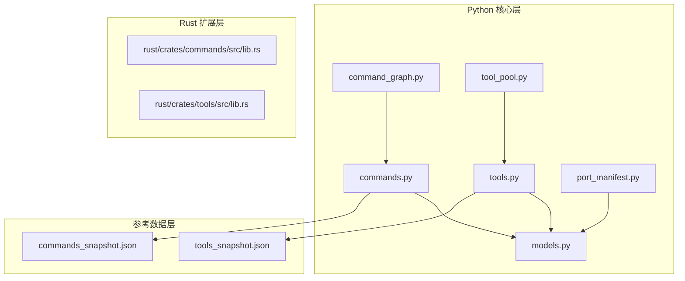
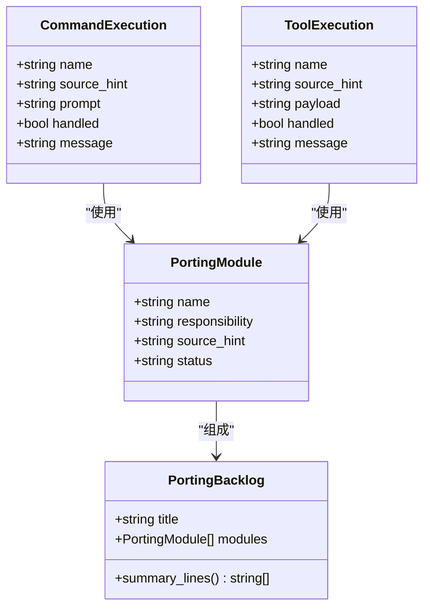
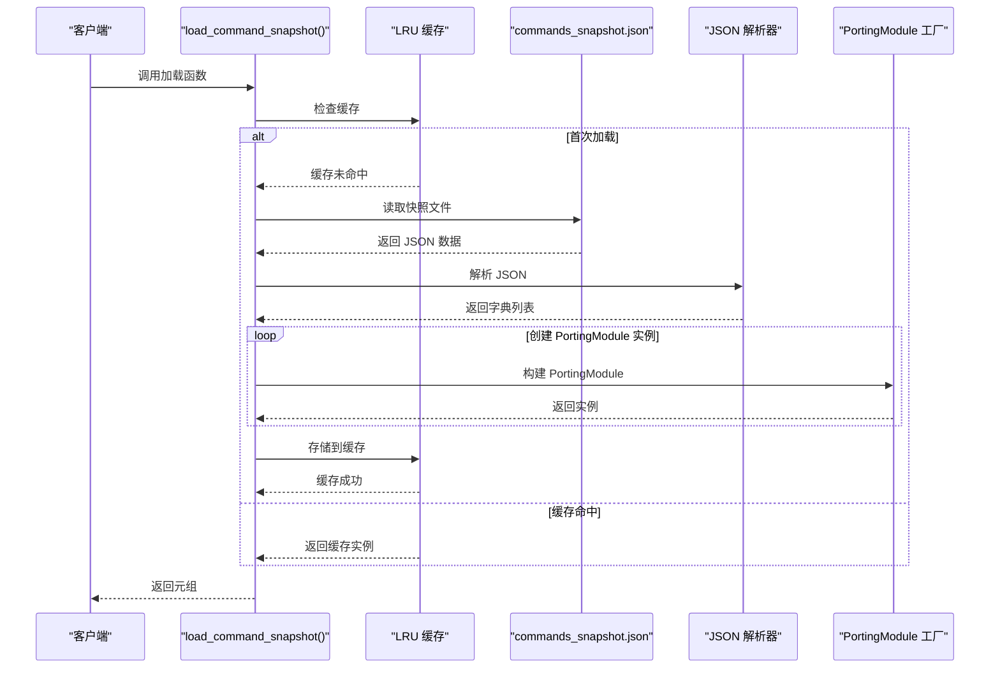
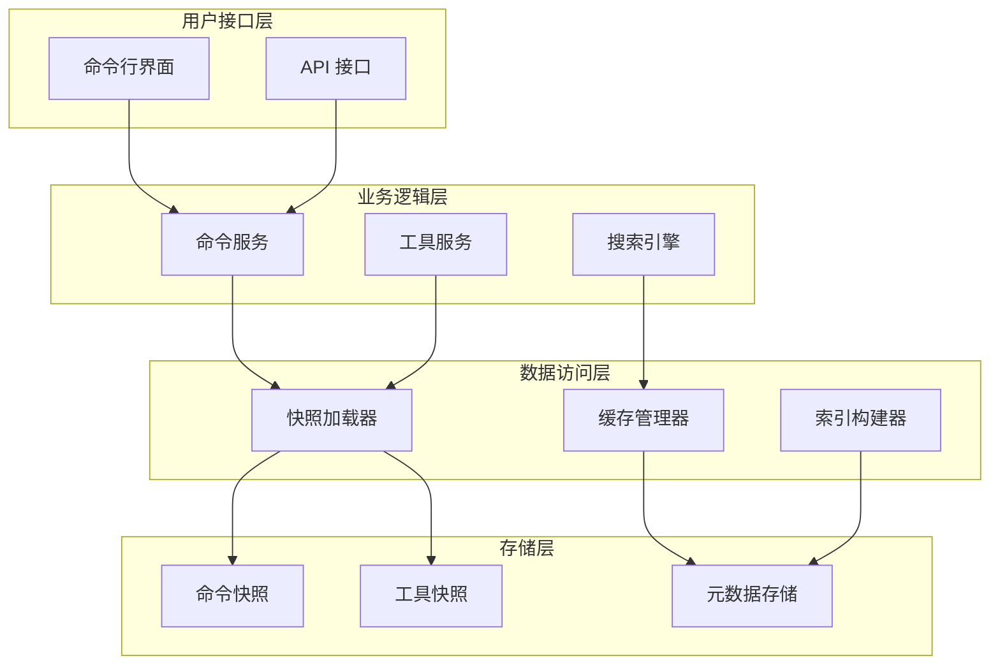
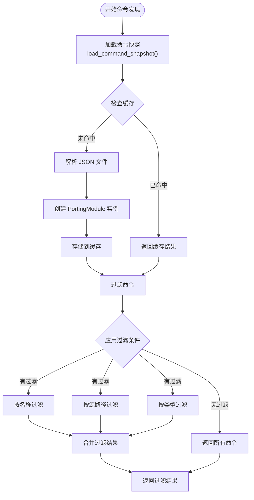
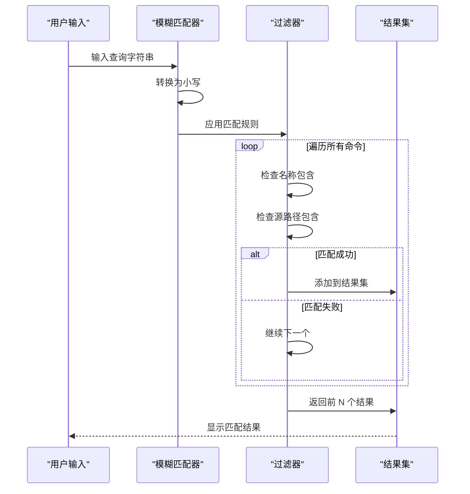
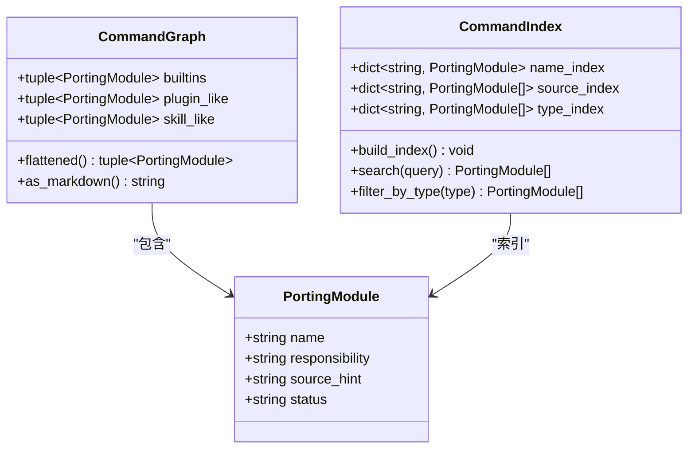
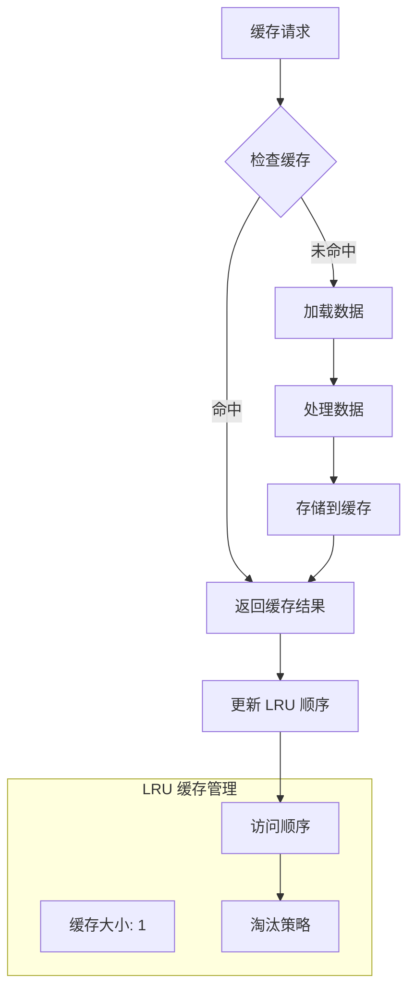
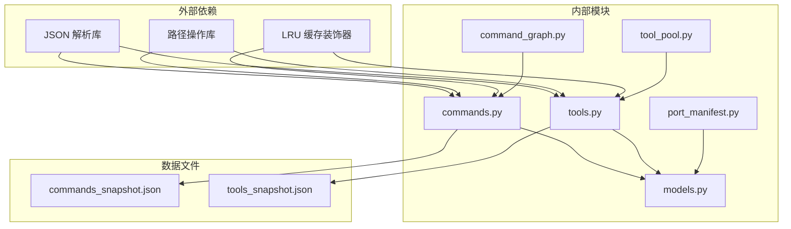

# 命令发现与加载

<cite>
**本文档引用的文件**
- [commands.py](file://src/commands.py)
- [models.py](file://src/models.py)
- [command_graph.py](file://src/command_graph.py)
- [port_manifest.py](file://src/port_manifest.py)
- [tools.py](file://src/tools.py)
- [tool_pool.py](file://src/tool_pool.py)
- [commands_snapshot.json](file://src/reference_data/commands_snapshot.json)
- [tools_snapshot.json](file://src/reference_data/tools_snapshot.json)
- [lib.rs](file://rust/crates/commands/src/lib.rs)
- [lib.rs](file://rust/crates/tools/src/lib.rs)
</cite>

## 目录
1. [简介](#简介)
2. [项目结构](#项目结构)
3. [核心组件](#核心组件)
4. [架构概览](#架构概览)
5. [详细组件分析](#详细组件分析)
6. [依赖关系分析](#依赖关系分析)
7. [性能考虑](#性能考虑)
8. [故障排除指南](#故障排除指南)
9. [结论](#结论)

## 简介

CLAW 项目的命令发现与加载机制是一个基于快照的系统，负责管理和访问从 TypeScript 源代码镜像而来的命令和工具集合。该系统通过 JSON 快照文件提供预构建的命令索引，使用 LRU 缓存机制进行性能优化，并支持模糊匹配和搜索功能。

该机制的核心目标是：
- 提供高效的命令发现和加载能力
- 维护命令元数据的完整性和一致性
- 支持命令和工具的分类组织
- 实现可扩展的搜索和过滤功能

## 项目结构

CLAW 项目采用分层架构设计，命令发现与加载机制主要分布在以下模块中：

**图表来源**
- [commands.py:1-91](file://src/commands.py#L1-L91)
- [tools.py:1-97](file://src/tools.py#L1-L97)
- [models.py:1-50](file://src/models.py#L1-L50)

**章节来源**
- [commands.py:1-91](file://src/commands.py#L1-L91)
- [tools.py:1-97](file://src/tools.py#L1-L97)
- [models.py:1-50](file://src/models.py#L1-L50)

## 核心组件

### PortingModule 数据结构

`PortingModule` 是命令发现机制的核心数据结构，用于表示从 TypeScript 源代码镜像而来的模块信息：

**图表来源**
- [models.py:14-50](file://src/models.py#L14-L50)

### 命令快照加载器

系统使用 `@lru_cache(maxsize=1)` 装饰器实现命令快照的缓存加载：

**图表来源**
- [commands.py:22-36](file://src/commands.py#L22-L36)

**章节来源**
- [models.py:14-50](file://src/models.py#L14-L50)
- [commands.py:22-36](file://src/commands.py#L22-L36)

## 架构概览

CLAW 的命令发现与加载架构采用分层设计，确保了系统的可维护性和扩展性：

**图表来源**
- [commands.py:10-57](file://src/commands.py#L10-L57)
- [tools.py:11-73](file://src/tools.py#L11-L73)

## 详细组件分析

### 命令发现算法

命令发现算法实现了高效的字符串匹配和过滤功能：

**图表来源**
- [commands.py:60-67](file://src/commands.py#L60-L67)
- [tools.py:62-73](file://src/tools.py#L62-L73)

### 模糊匹配实现

系统实现了基于字符串包含的模糊匹配算法：

**图表来源**
- [commands.py:69-72](file://src/commands.py#L69-L72)
- [tools.py:75-78](file://src/tools.py#L75-L78)

### 命令索引构建过程

命令索引构建过程包括多个层次的分类和组织：

**图表来源**
- [command_graph.py:9-35](file://src/command_graph.py#L9-L35)
- [models.py:14-20](file://src/models.py#L14-L20)

**章节来源**
- [command_graph.py:29-35](file://src/command_graph.py#L29-L35)
- [models.py:14-20](file://src/models.py#L14-L20)

### LRU 缓存策略

系统使用 LRU（最近最少使用）缓存策略来优化性能：

**图表来源**
- [commands.py:22-41](file://src/commands.py#L22-L41)
- [tools.py:23-41](file://src/tools.py#L23-L41)

**章节来源**
- [commands.py:22-41](file://src/commands.py#L22-L41)
- [tools.py:23-41](file://src/tools.py#L23-L41)

## 依赖关系分析

命令发现与加载机制的依赖关系体现了清晰的分层架构：

**图表来源**
- [commands.py:1-91](file://src/commands.py#L1-L91)
- [tools.py:1-97](file://src/tools.py#L1-L97)

**章节来源**
- [commands.py:1-91](file://src/commands.py#L1-L91)
- [tools.py:1-97](file://src/tools.py#L1-L97)

## 性能考虑

### 内存管理策略

系统采用了多种内存管理策略来优化性能：

1. **不可变数据结构**: 使用 `@dataclass(frozen=True)` 确保数据结构的不可变性，减少内存占用
2. **LRU 缓存**: 使用 `@lru_cache(maxsize=1)` 缓存整个快照数据，避免重复解析
3. **延迟加载**: 只在需要时才加载和解析 JSON 文件
4. **元组存储**: 使用元组而不是列表存储命令数据，提供更好的内存效率

### 性能优化技术

1. **字符串操作优化**: 将所有字符串转换为小写进行比较，减少大小写不敏感的比较开销
2. **早期退出**: 在找到匹配项后立即返回，避免不必要的遍历
3. **批量操作**: 使用列表推导式和内置函数进行批量数据处理
4. **限制结果数量**: 默认限制搜索结果数量，防止内存溢出

### 搜索优化

1. **双字段匹配**: 同时检查命令名称和源路径，提高搜索准确性
2. **前缀匹配**: 支持精确匹配和前缀匹配
3. **结果排序**: 基于匹配质量对结果进行排序
4. **查询预处理**: 对查询字符串进行标准化处理

## 故障排除指南

### 常见问题及解决方案

1. **命令快照文件缺失**
   - 检查 `commands_snapshot.json` 是否存在
   - 验证文件路径是否正确
   - 确认文件权限设置

2. **JSON 解析错误**
   - 验证 JSON 格式的正确性
   - 检查特殊字符转义
   - 确认编码格式

3. **缓存失效问题**
   - 清理 Python 缓存文件
   - 重启应用程序
   - 检查缓存键的一致性

4. **搜索结果不准确**
   - 检查查询字符串的大小写
   - 验证匹配算法的实现
   - 确认过滤条件的正确性

### 调试技巧

1. **启用详细日志**: 在开发环境中启用详细的调试信息
2. **单元测试**: 编写针对关键功能的单元测试
3. **性能监控**: 监控缓存命中率和内存使用情况
4. **错误处理**: 实现完善的错误处理和恢复机制

**章节来源**
- [commands.py:75-81](file://src/commands.py#L75-L81)
- [tools.py:81-87](file://src/tools.py#L81-L87)

## 结论

CLAW 项目的命令发现与加载机制通过精心设计的架构和优化策略，实现了高效、可靠的命令管理功能。该系统的主要优势包括：

1. **高性能**: 通过 LRU 缓存和优化的数据结构实现快速访问
2. **可扩展性**: 支持命令和工具的动态扩展
3. **易维护性**: 清晰的分层架构便于维护和修改
4. **可靠性**: 完善的错误处理和恢复机制

未来可以考虑的改进方向包括：
- 实现更复杂的搜索算法
- 添加命令依赖关系管理
- 增强缓存策略的灵活性
- 支持动态命令注册

该机制为 CLAW 项目提供了坚实的基础，支持了整个系统的命令管理和执行功能。