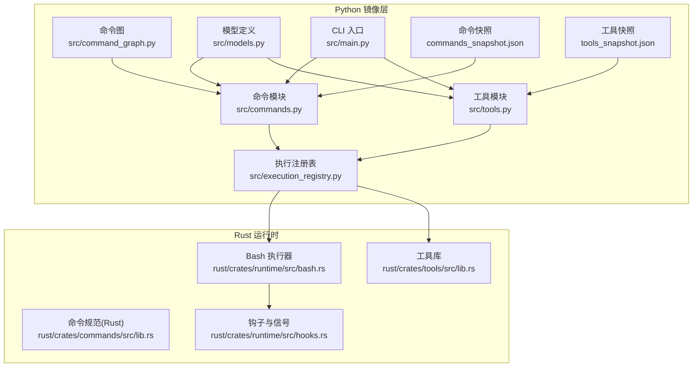
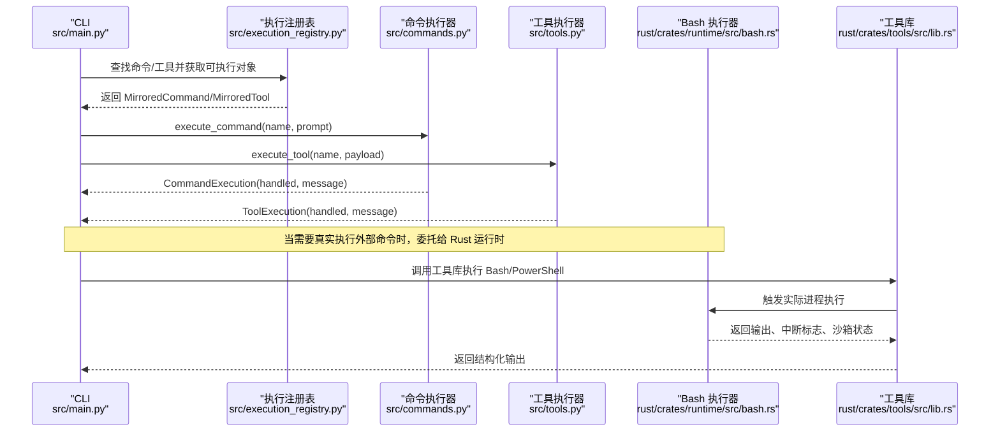
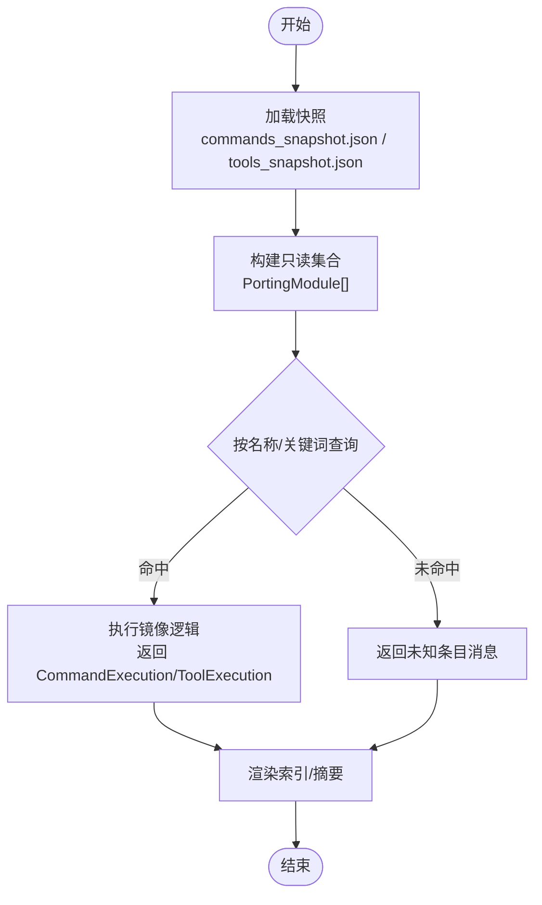
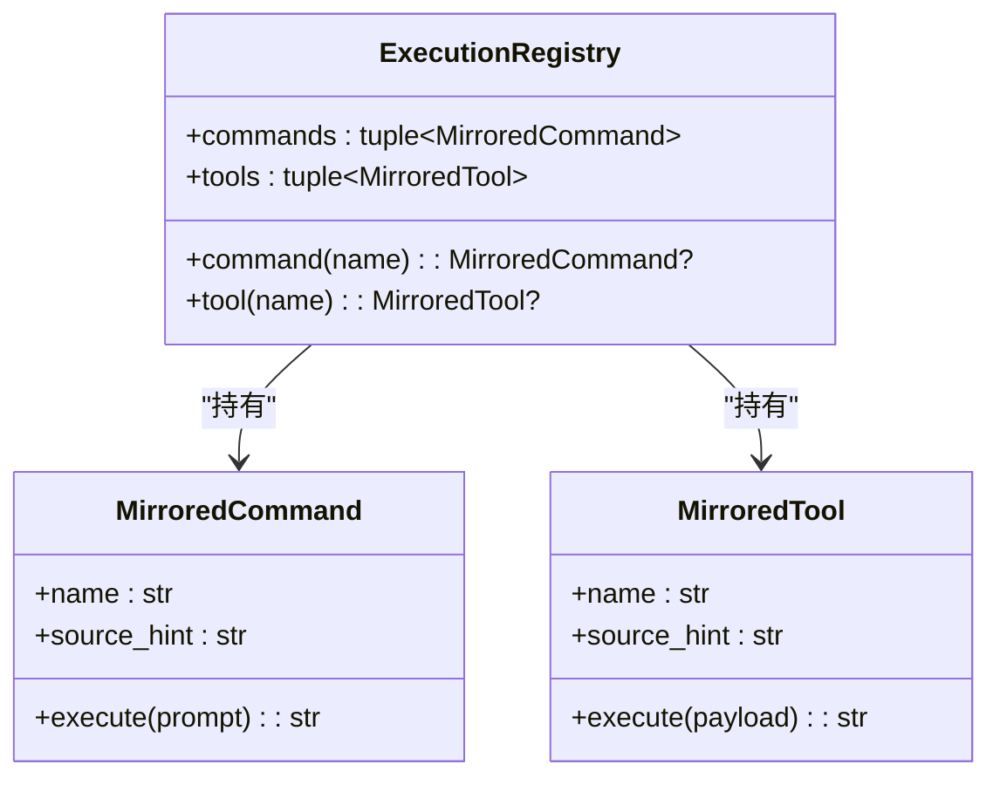
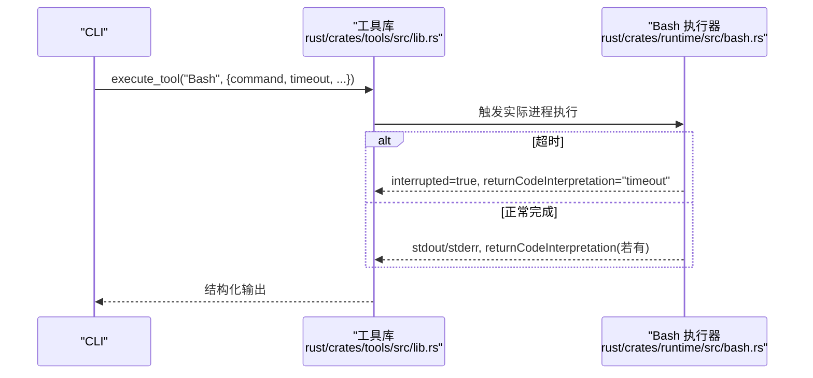
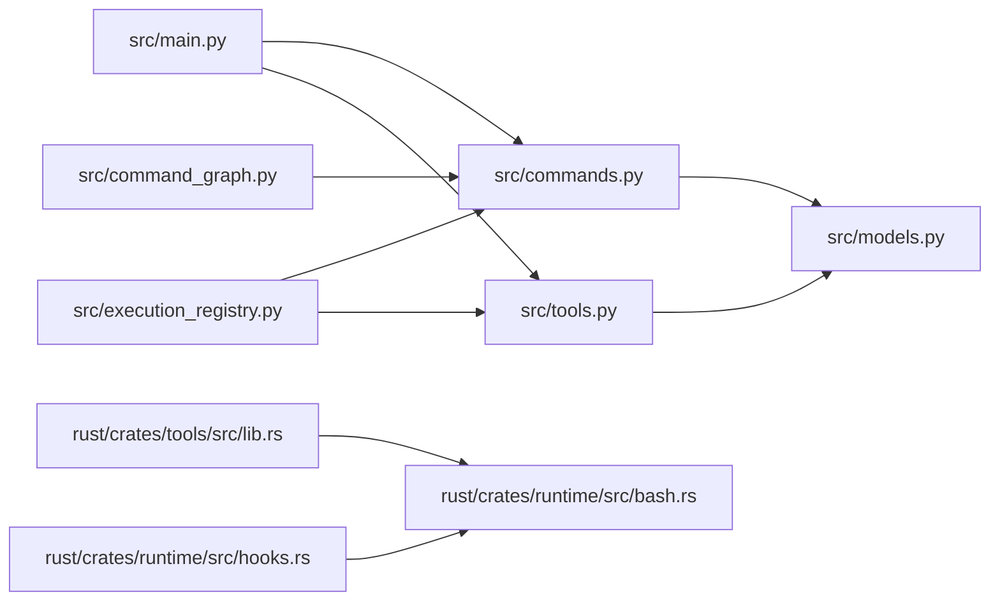

# 命令执行流程

<cite>
**本文引用的文件**
- [src/commands.py](file://src/commands.py)
- [src/tools.py](file://src/tools.py)
- [src/execution_registry.py](file://src/execution_registry.py)
- [src/command_graph.py](file://src/command_graph.py)
- [src/models.py](file://src/models.py)
- [src/main.py](file://src/main.py)
- [src/reference_data/commands_snapshot.json](file://src/reference_data/commands_snapshot.json)
- [src/reference_data/tools_snapshot.json](file://src/reference_data/tools_snapshot.json)
- [rust/crates/runtime/src/bash.rs](file://rust/crates/runtime/src/bash.rs)
- [rust/crates/tools/src/lib.rs](file://rust/crates/tools/src/lib.rs)
- [rust/crates/commands/src/lib.rs](file://rust/crates/commands/src/lib.rs)
- [rust/crates/runtime/src/hooks.rs](file://rust/crates/runtime/src/hooks.rs)
</cite>

## 目录
1. [简介](#简介)
2. [项目结构](#项目结构)
3. [核心组件](#核心组件)
4. [架构总览](#架构总览)
5. [详细组件分析](#详细组件分析)
6. [依赖关系分析](#依赖关系分析)
7. [性能考虑](#性能考虑)
8. [故障排查指南](#故障排查指南)
9. [结论](#结论)
10. [附录](#附录)

## 简介
本文件面向 CLAW 项目的“命令执行流程”，系统化阐述从命令/工具发现、参数解析到执行策略与结果处理的完整生命周期；同时覆盖错误处理与回退机制、性能监控与调试方法，并解释执行注册表的作用与扩展方式。文档以 Python 层的“镜像命令/工具”与 Rust 运行时实现为双轴展开，帮助读者在不同技术栈间建立一致的认知。

## 项目结构
围绕命令执行的关键模块分布如下：
- Python 镜像层：命令与工具的“镜像清单”加载、查询与执行入口，以及命令图构建与权限过滤等。
- 执行注册表：将镜像命令/工具包装为可调用对象，统一对外暴露 execute 接口。
- Rust 运行时：实际执行外部命令（如 Bash、PowerShell）并提供超时、沙箱、后台运行等能力。
- 参考数据：commands_snapshot.json 与 tools_snapshot.json 提供命令/工具的元信息快照。

图表来源
- [src/commands.py:1-91](file://src/commands.py#L1-L91)
- [src/tools.py:1-97](file://src/tools.py#L1-L97)
- [src/execution_registry.py:1-52](file://src/execution_registry.py#L1-L52)
- [src/command_graph.py:1-35](file://src/command_graph.py#L1-L35)
- [src/models.py:1-50](file://src/models.py#L1-L50)
- [src/main.py:1-214](file://src/main.py#L1-L214)
- [src/reference_data/commands_snapshot.json:1-1037](file://src/reference_data/commands_snapshot.json#L1-L1037)
- [src/reference_data/tools_snapshot.json:1-922](file://src/reference_data/tools_snapshot.json#L1-L922)
- [rust/crates/runtime/src/bash.rs:71-283](file://rust/crates/runtime/src/bash.rs#L71-L283)
- [rust/crates/tools/src/lib.rs:218-258](file://rust/crates/tools/src/lib.rs#L218-L258)
- [rust/crates/commands/src/lib.rs:1-46](file://rust/crates/commands/src/lib.rs#L1-L46)
- [rust/crates/runtime/src/hooks.rs:453-698](file://rust/crates/runtime/src/hooks.rs#L453-L698)

章节来源
- [src/commands.py:1-91](file://src/commands.py#L1-L91)
- [src/tools.py:1-97](file://src/tools.py#L1-L97)
- [src/execution_registry.py:1-52](file://src/execution_registry.py#L1-L52)
- [src/command_graph.py:1-35](file://src/command_graph.py#L1-L35)
- [src/models.py:1-50](file://src/models.py#L1-L50)
- [src/main.py:1-214](file://src/main.py#L1-L214)
- [src/reference_data/commands_snapshot.json:1-1037](file://src/reference_data/commands_snapshot.json#L1-L1037)
- [src/reference_data/tools_snapshot.json:1-922](file://src/reference_data/tools_snapshot.json#L1-L922)
- [rust/crates/runtime/src/bash.rs:71-283](file://rust/crates/runtime/src/bash.rs#L71-L283)
- [rust/crates/tools/src/lib.rs:218-258](file://rust/crates/tools/src/lib.rs#L218-L258)
- [rust/crates/commands/src/lib.rs:1-46](file://rust/crates/commands/src/lib.rs#L1-L46)
- [rust/crates/runtime/src/hooks.rs:453-698](file://rust/crates/runtime/src/hooks.rs#L453-L698)

## 核心组件
- 命令与工具的数据结构
  - CommandExecution：封装一次“镜像命令”的执行结果，包含名称、来源提示、输入提示、是否已处理、消息文本等字段。
  - ToolExecution：封装一次“镜像工具”的执行结果，包含名称、来源提示、输入载荷、是否已处理、消息文本等字段。
  - PortingModule：命令/工具的元信息载体，包含名称、职责描述、来源提示、状态等。
  - UsageSummary：用于统计会话级使用量（词元计数），便于成本跟踪与审计。

- 命令与工具的加载与查询
  - 通过 JSON 快照加载命令/工具清单，构建只读集合；提供按名称精确匹配、模糊查询、权限过滤、类型分类（插件/技能）等功能。
  - 提供命令/工具的“回退清单”（Backlog）与“索引渲染”能力，便于 CLI 与 UI 展示。

- 执行注册表
  - 将镜像命令/工具包装为可执行对象，统一暴露 execute 接口，屏蔽底层差异，便于上层路由与调度。

章节来源
- [src/commands.py:13-81](file://src/commands.py#L13-L81)
- [src/tools.py:14-87](file://src/tools.py#L14-L87)
- [src/models.py:14-50](file://src/models.py#L14-L50)
- [src/execution_registry.py:9-52](file://src/execution_registry.py#L9-L52)

## 架构总览
下图展示了从 CLI 到镜像执行再到 Rust 实际执行的整体链路，以及错误处理与回退路径：

图表来源
- [src/main.py:200-207](file://src/main.py#L200-L207)
- [src/execution_registry.py:14-25](file://src/execution_registry.py#L14-L25)
- [src/commands.py:75-81](file://src/commands.py#L75-L81)
- [src/tools.py:81-87](file://src/tools.py#L81-L87)
- [rust/crates/runtime/src/bash.rs:71-134](file://rust/crates/runtime/src/bash.rs#L71-L134)
- [rust/crates/tools/src/lib.rs:218-258](file://rust/crates/tools/src/lib.rs#L218-L258)

## 详细组件分析

### 命令执行数据结构与生命周期
- 数据结构
  - CommandExecution：承载一次“镜像命令”的执行结果，用于 CLI 输出与上层判断。
  - PortingModule：命令/工具的元信息，来源于快照文件，支持按来源提示进行分类（插件/技能）。
- 生命周期
  - 加载阶段：启动时从 JSON 快照加载命令/工具清单，缓存为只读集合。
  - 查询阶段：按名称或关键词检索，支持过滤插件/技能来源。
  - 执行阶段：若存在镜像映射，则返回“已处理”的结果消息；否则返回“未知命令/工具”的失败消息。
  - 渲染阶段：支持将命令/工具列表渲染为人类可读的索引文本。

图表来源
- [src/commands.py:22-81](file://src/commands.py#L22-L81)
- [src/tools.py:23-87](file://src/tools.py#L23-L87)
- [src/models.py:14-50](file://src/models.py#L14-L50)
- [src/reference_data/commands_snapshot.json:1-1037](file://src/reference_data/commands_snapshot.json#L1-L1037)
- [src/reference_data/tools_snapshot.json:1-922](file://src/reference_data/tools_snapshot.json#L1-L922)

章节来源
- [src/commands.py:13-81](file://src/commands.py#L13-L81)
- [src/tools.py:14-87](file://src/tools.py#L14-L87)
- [src/models.py:14-50](file://src/models.py#L14-L50)

### 命令查找、参数解析与执行策略
- 命令查找
  - 精确匹配：按名称大小写不敏感查找。
  - 模糊匹配：基于名称或来源提示的子串匹配，支持限制返回数量。
  - 分类过滤：可排除“插件类”或“技能类”来源，便于聚焦内置命令。
- 参数解析
  - 命令：接收 prompt 字符串作为上下文提示。
  - 工具：接收 payload（JSON 字符串）作为输入载荷，内部可解析为结构化对象。
- 执行策略
  - 镜像执行：当前实现为“镜像模式”，即根据快照生成“若真实执行，将如何处理”的描述性消息，不真正触发外部进程。
  - 注册表策略：通过执行注册表将镜像命令/工具包装为统一的可执行对象，便于后续接入真实执行器（如 Bash/PowerShell）。

章节来源
- [src/commands.py:48-81](file://src/commands.py#L48-L81)
- [src/tools.py:44-87](file://src/tools.py#L44-L87)
- [src/execution_registry.py:14-25](file://src/execution_registry.py#L14-L25)

### 执行注册表的作用与扩展机制
- 作用
  - 将镜像命令/工具标准化为可调用对象，统一接口（execute），屏蔽底层差异。
  - 支持按名称快速定位并执行，便于路由与调度。
- 扩展机制
  - 新增镜像命令/工具：只需更新快照文件并在注册表中纳入即可。
  - 插件集成：工具库支持插件式工具处理器，可通过注册表委派至插件执行器。
  - 自定义执行器：注册表可扩展为支持更多执行后端（如远程执行、容器沙箱等）。

图表来源
- [src/execution_registry.py:9-52](file://src/execution_registry.py#L9-L52)

章节来源
- [src/execution_registry.py:1-52](file://src/execution_registry.py#L1-L52)
- [rust/crates/tools/src/lib.rs:218-258](file://rust/crates/tools/src/lib.rs#L218-L258)

### 命令图与权限控制
- 命令图
  - 将命令按来源提示分为“内置”、“插件类”、“技能类”，便于可视化与管理。
- 权限控制
  - 工具侧提供权限上下文，可在查询阶段过滤掉被拒绝的工具，确保安全边界。

章节来源
- [src/command_graph.py:29-35](file://src/command_graph.py#L29-L35)
- [src/tools.py:56-72](file://src/tools.py#L56-L72)

### 真实执行（Bash/PowerShell）与超时/沙箱
- 执行器
  - Bash 执行器：支持同步/异步执行、超时控制、后台运行、沙箱开关、网络隔离、文件系统隔离等。
  - 工具库：统一调用入口，支持 Bash/PowerShell 等工具的实际执行，并对超时、退出码进行解释。
- 错误处理与回退
  - 超时：返回中断标志与超时解释，避免阻塞。
  - 退出码非零：附加解释信息，便于诊断。
  - 后台运行：无输出预期，返回任务 ID 以便后续查询。
  - 钩子与信号：支持钩子执行过程中的取消与警告，保证稳定性。

图表来源
- [rust/crates/tools/src/lib.rs:2996-3101](file://rust/crates/tools/src/lib.rs#L2996-L3101)
- [rust/crates/runtime/src/bash.rs:109-134](file://rust/crates/runtime/src/bash.rs#L109-L134)

章节来源
- [rust/crates/runtime/src/bash.rs:71-134](file://rust/crates/runtime/src/bash.rs#L71-L134)
- [rust/crates/tools/src/lib.rs:2996-3101](file://rust/crates/tools/src/lib.rs#L2996-L3101)
- [rust/crates/runtime/src/hooks.rs:453-698](file://rust/crates/runtime/src/hooks.rs#L453-L698)

### CLI 交互与调试
- CLI 子命令
  - exec-command/exec-tool：直接执行镜像命令/工具，打印结果消息并根据 handled 字段决定退出码。
  - commands/tools：列出镜像命令/工具索引，支持查询与过滤。
  - show-command/show-tool：展示指定镜像条目的详细信息。
- 调试方法
  - 使用“调试工具调用”命令（Rust 侧）复现最近一次工具调用的详细报告。
  - 结合命令图与权限上下文，定位问题来源（插件/技能/内置）。

章节来源
- [src/main.py:84-91](file://src/main.py#L84-L91)
- [src/main.py:186-207](file://src/main.py#L186-L207)
- [rust/crates/commands/src/lib.rs:183-188](file://rust/crates/commands/src/lib.rs#L183-L188)

## 依赖关系分析
- Python 层依赖
  - commands.py 与 tools.py 依赖 models.py 的数据结构；依赖快照文件提供元信息。
  - execution_registry.py 依赖 commands.py 与 tools.py 的执行函数，形成“镜像执行”到“真实执行”的桥接。
  - command_graph.py 依赖 commands.py 的查询能力，进行分类汇总。
  - main.py 作为 CLI 入口，聚合上述模块并提供用户交互。
- Rust 层依赖
  - runtime/bash.rs 与 tools/src/lib.rs 提供实际执行能力；hooks.rs 提供钩子与信号处理。
  - commands/src/lib.rs 定义了“斜杠命令”的规范与解析，与 CLI 的调试功能相呼应。

图表来源
- [src/main.py:1-214](file://src/main.py#L1-L214)
- [src/commands.py:1-91](file://src/commands.py#L1-L91)
- [src/tools.py:1-97](file://src/tools.py#L1-L97)
- [src/models.py:1-50](file://src/models.py#L1-L50)
- [src/execution_registry.py:1-52](file://src/execution_registry.py#L1-L52)
- [src/command_graph.py:1-35](file://src/command_graph.py#L1-L35)
- [rust/crates/tools/src/lib.rs:218-258](file://rust/crates/tools/src/lib.rs#L218-L258)
- [rust/crates/runtime/src/bash.rs:71-134](file://rust/crates/runtime/src/bash.rs#L71-L134)
- [rust/crates/runtime/src/hooks.rs:453-698](file://rust/crates/runtime/src/hooks.rs#L453-L698)

章节来源
- [src/main.py:1-214](file://src/main.py#L1-L214)
- [src/execution_registry.py:1-52](file://src/execution_registry.py#L1-L52)
- [rust/crates/tools/src/lib.rs:218-258](file://rust/crates/tools/src/lib.rs#L218-L258)

## 性能考虑
- 缓存与只读
  - 快照加载采用 LRU 缓存，避免重复 IO；命令/工具集合为只读元组，降低并发访问开销。
- 查询优化
  - 名称与来源提示的模糊匹配在内存中进行，建议配合 limit 控制返回规模。
- 执行优化
  - Bash 执行器支持超时与后台运行，避免阻塞；工具库对超时与退出码进行解释，减少无效重试。
- 成本跟踪
  - UsageSummary 提供词元级统计，可用于估算成本与资源消耗。

章节来源
- [src/commands.py:22-42](file://src/commands.py#L22-L42)
- [src/tools.py:23-42](file://src/tools.py#L23-L42)
- [src/models.py:28-38](file://src/models.py#L28-L38)
- [rust/crates/runtime/src/bash.rs:109-134](file://rust/crates/runtime/src/bash.rs#L109-L134)
- [rust/crates/tools/src/lib.rs:3041-3101](file://rust/crates/tools/src/lib.rs#L3041-L3101)

## 故障排查指南
- 常见问题
  - 未知命令/工具：检查名称大小写与拼写，确认是否在快照中存在。
  - 权限拒绝：使用工具权限上下文过滤，或调整 deny-tool/deny-prefix。
  - 超时：增大超时阈值或改为后台运行；检查目标命令的耗时特性。
  - 退出码异常：查看 returnCodeInterpretation 与 stderr，定位具体错误。
- 回退机制
  - 镜像执行失败时返回失败消息与 handled=false，便于上层进行降级处理。
  - 钩子执行可被取消，返回取消状态，避免长时间阻塞。
- 调试手段
  - 使用“调试工具调用”命令（Rust 侧）查看最近一次工具调用的详细报告。
  - 通过命令图与权限上下文快速定位来源类别（内置/插件/技能）。

章节来源
- [src/commands.py:75-81](file://src/commands.py#L75-L81)
- [src/tools.py:81-87](file://src/tools.py#L81-L87)
- [rust/crates/runtime/src/hooks.rs:453-698](file://rust/crates/runtime/src/hooks.rs#L453-L698)
- [rust/crates/commands/src/lib.rs:183-188](file://rust/crates/commands/src/lib.rs#L183-L188)

## 结论
CLAW 的命令执行流程以“镜像层 + 注册表 + 运行时”的分层设计实现高内聚、低耦合。Python 镜像层负责命令/工具的元信息与执行结果抽象，执行注册表提供统一调用接口，Rust 运行时负责真实外部命令的执行与安全控制。该架构既满足了快速迭代与扩展的需求，也为性能优化与故障排查提供了清晰的路径。

## 附录
- 快照文件位置
  - 命令快照：src/reference_data/commands_snapshot.json
  - 工具快照：src/reference_data/tools_snapshot.json
- 关键实现参考
  - 命令执行：src/commands.py 的 execute_command
  - 工具执行：src/tools.py 的 execute_tool
  - 执行注册表：src/execution_registry.py 的 ExecutionRegistry
  - Bash 执行器：rust/crates/runtime/src/bash.rs
  - 工具库：rust/crates/tools/src/lib.rs
  - 斜杠命令规范：rust/crates/commands/src/lib.rs