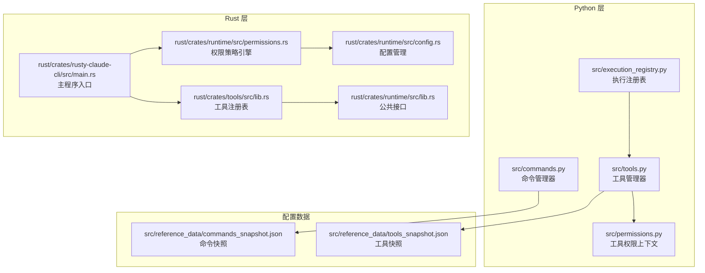
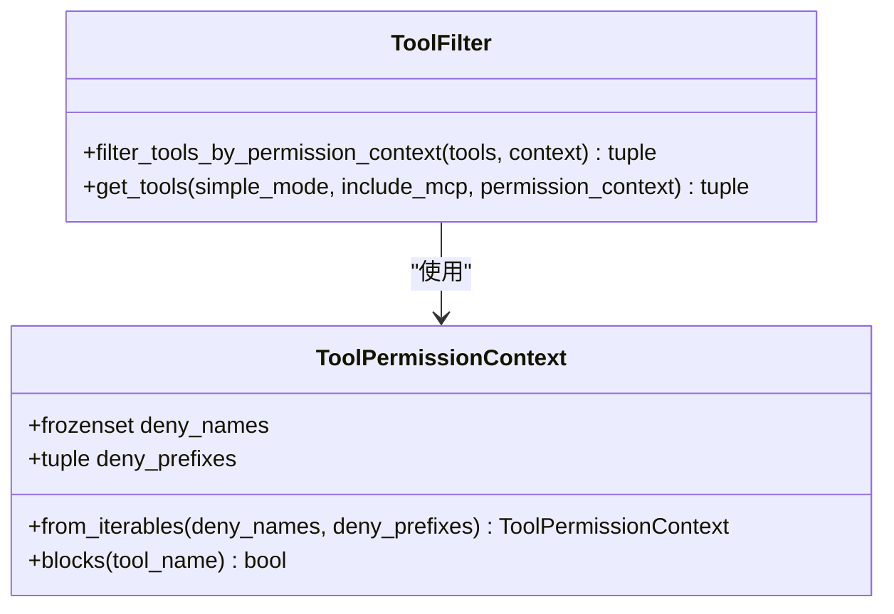
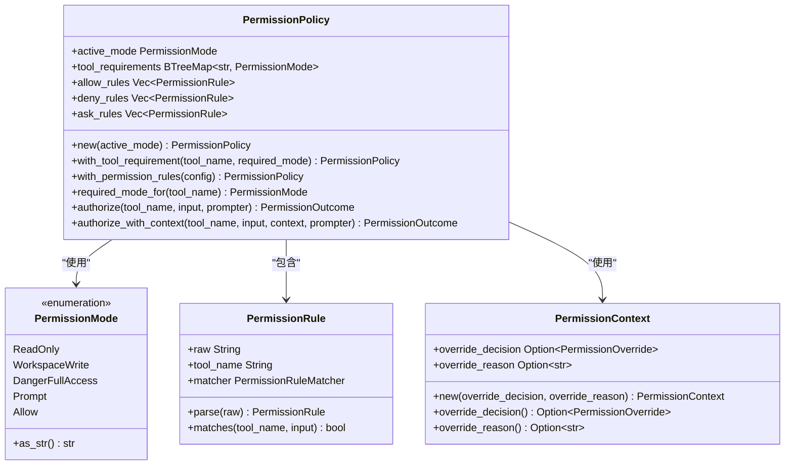
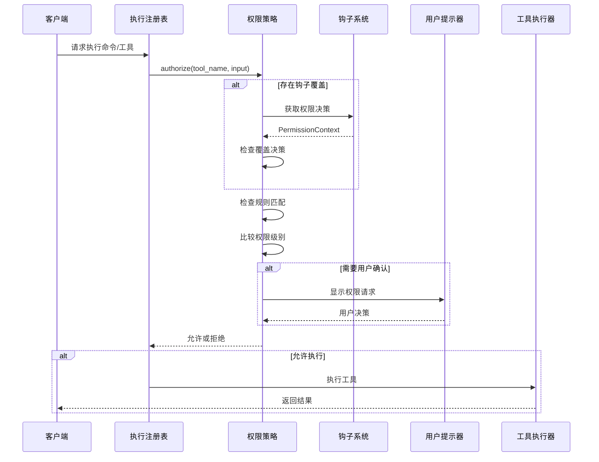
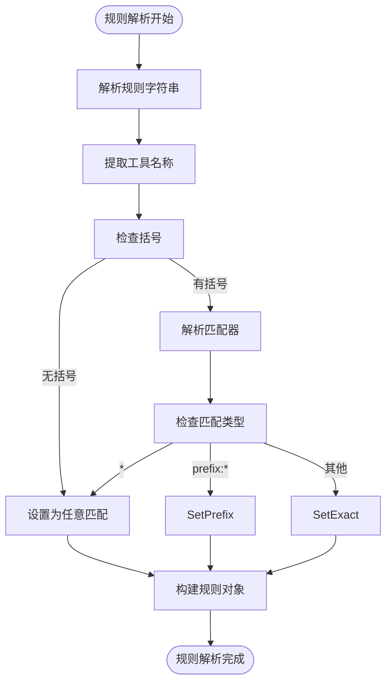
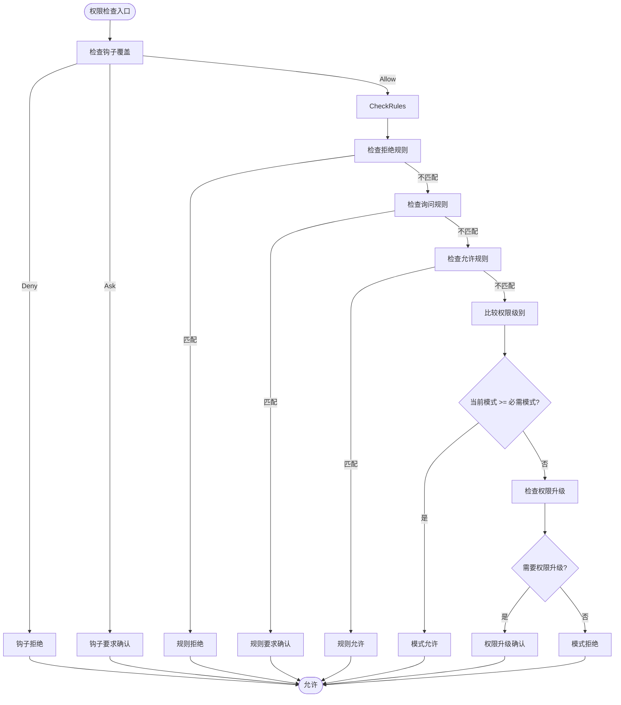
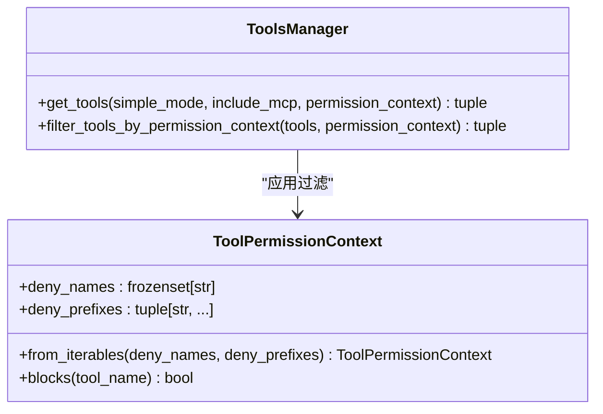
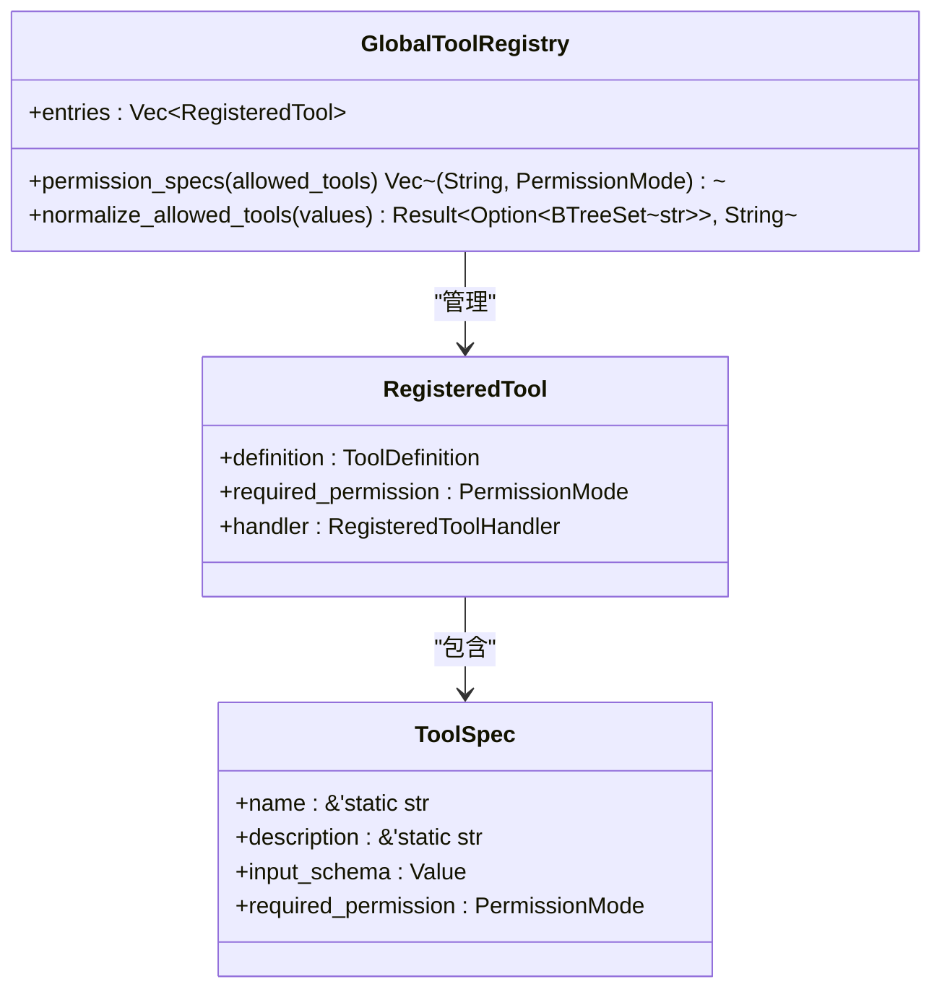
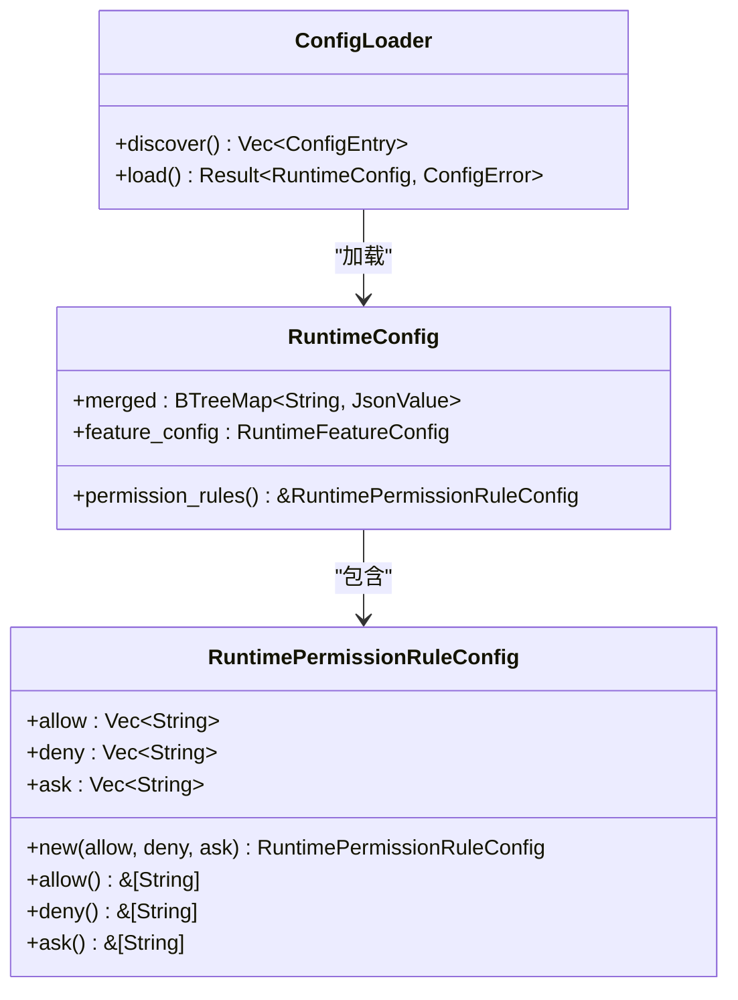
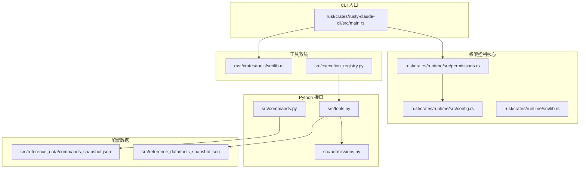

# 命令权限控制

<cite>
**本文档引用的文件**
- [src/permissions.py](file://src/permissions.py)
- [src/tools.py](file://src/tools.py)
- [src/commands.py](file://src/commands.py)
- [src/execution_registry.py](file://src/execution_registry.py)
- [rust/crates/runtime/src/permissions.rs](file://rust/crates/runtime/src/permissions.rs)
- [rust/crates/runtime/src/config.rs](file://rust/crates/runtime/src/config.rs)
- [rust/crates/runtime/src/lib.rs](file://rust/crates/runtime/src/lib.rs)
- [rust/crates/tools/src/lib.rs](file://rust/crates/tools/src/lib.rs)
- [rust/crates/rusty-claude-cli/src/main.rs](file://rust/crates/rusty-claude-cli/src/main.rs)
- [src/reference_data/commands_snapshot.json](file://src/reference_data/commands_snapshot.json)
- [src/reference_data/tools_snapshot.json](file://src/reference_data/tools_snapshot.json)
</cite>

## 目录
1. [简介](#简介)
2. [项目结构](#项目结构)
3. [核心组件](#核心组件)
4. [架构概览](#架构概览)
5. [详细组件分析](#详细组件分析)
6. [依赖关系分析](#依赖关系分析)
7. [性能考虑](#性能考虑)
8. [故障排除指南](#故障排除指南)
9. [结论](#结论)

## 简介

CLAW 项目的命令权限控制机制是一个多层次的安全框架，旨在确保命令和工具在执行前经过适当的权限验证。该系统通过结合静态权限配置、动态权限检查和用户交互来实现细粒度的访问控制。

权限控制系统主要分为两个层面：

- **Python 层面**：提供基础的工具权限上下文过滤功能
- **Rust 层面**：实现完整的权限策略引擎，包括模式匹配、规则解析和用户交互

## 项目结构

**图表来源**
- [src/permissions.py:1-21](file://src/permissions.py#L1-L21)
- [rust/crates/runtime/src/permissions.rs:1-676](file://rust/crates/runtime/src/permissions.rs#L1-L676)
- [src/reference_data/commands_snapshot.json:1-1037](file://src/reference_data/commands_snapshot.json#L1-L1037)

**章节来源**
- [src/permissions.py:1-21](file://src/permissions.py#L1-L21)
- [rust/crates/runtime/src/permissions.rs:1-676](file://rust/crates/runtime/src/permissions.rs#L1-L676)

## 核心组件

### Python 权限上下文

Python 层面提供了基础的权限过滤功能：

**图表来源**
- [src/permissions.py:6-21](file://src/permissions.py#L6-L21)
- [src/tools.py:56-72](file://src/tools.py#L56-L72)

### Rust 权限策略引擎

Rust 层面实现了完整的权限控制逻辑：

**图表来源**
- [rust/crates/runtime/src/permissions.rs:7-97](file://rust/crates/runtime/src/permissions.rs#L7-L97)
- [rust/crates/runtime/src/permissions.rs:327-383](file://rust/crates/runtime/src/permissions.rs#L327-L383)

**章节来源**
- [src/permissions.py:6-21](file://src/permissions.py#L6-L21)
- [rust/crates/runtime/src/permissions.rs:7-97](file://rust/crates/runtime/src/permissions.rs#L7-L97)

## 架构概览

CLAW 的权限控制架构采用分层设计，确保安全性和灵活性：

**图表来源**
- [rust/crates/runtime/src/permissions.rs:167-284](file://rust/crates/runtime/src/permissions.rs#L167-L284)
- [rust/crates/rusty-claude-cli/src/main.rs:3738-3749](file://rust/crates/rusty-claude-cli/src/main.rs#L3738-L3749)

## 详细组件分析

### 权限模式和规则系统

#### 权限模式层次结构

系统定义了五种权限模式，按安全性递增排列：

1. **ReadOnly（只读）**：仅允许安全的读取操作
2. **WorkspaceWrite（工作区写入）**：允许文件系统写入操作
3. **DangerFullAccess（危险全权限）**：允许所有操作，包括高风险操作
4. **Prompt（提示模式）**：需要用户确认的中间状态
5. **Allow（允许模式）**：绕过权限检查的特殊模式

#### 规则匹配机制

权限规则支持三种匹配模式：

**图表来源**
- [rust/crates/runtime/src/permissions.rs:341-394](file://rust/crates/runtime/src/permissions.rs#L341-L394)

#### 权限检查流程

**图表来源**
- [rust/crates/runtime/src/permissions.rs:167-284](file://rust/crates/runtime/src/permissions.rs#L167-L284)

**章节来源**
- [rust/crates/runtime/src/permissions.rs:167-284](file://rust/crates/runtime/src/permissions.rs#L167-L284)

### Python 工具权限过滤

Python 层面提供了基础的权限过滤功能：

**图表来源**
- [src/permissions.py:6-21](file://src/permissions.py#L6-L21)
- [src/tools.py:56-72](file://src/tools.py#L56-L72)

**章节来源**
- [src/permissions.py:6-21](file://src/permissions.py#L6-L21)
- [src/tools.py:56-72](file://src/tools.py#L56-L72)

### Rust 工具注册表集成

Rust 层面的工具注册表提供了权限规格的动态获取：

**图表来源**
- [rust/crates/tools/src/lib.rs:49-187](file://rust/crates/tools/src/lib.rs#L49-L187)

**章节来源**
- [rust/crates/tools/src/lib.rs:49-187](file://rust/crates/tools/src/lib.rs#L49-L187)

### 配置管理系统

权限配置通过运行时配置系统管理：

**图表来源**
- [rust/crates/runtime/src/config.rs:67-515](file://rust/crates/runtime/src/config.rs#L67-L515)

**章节来源**
- [rust/crates/runtime/src/config.rs:67-515](file://rust/crates/runtime/src/config.rs#L67-L515)

## 依赖关系分析

**图表来源**
- [rust/crates/runtime/src/permissions.rs:1-676](file://rust/crates/runtime/src/permissions.rs#L1-L676)
- [rust/crates/tools/src/lib.rs:1-187](file://rust/crates/tools/src/lib.rs#L1-L187)
- [src/execution_registry.py:1-52](file://src/execution_registry.py#L1-L52)

**章节来源**
- [rust/crates/runtime/src/permissions.rs:1-676](file://rust/crates/runtime/src/permissions.rs#L1-L676)
- [rust/crates/tools/src/lib.rs:1-187](file://rust/crates/tools/src/lib.rs#L1-L187)
- [src/execution_registry.py:1-52](file://src/execution_registry.py#L1-L52)

## 性能考虑

### 缓存策略

系统采用了多级缓存机制来优化性能：

1. **Python 层缓存**：使用 `@lru_cache` 装饰器缓存命令和工具快照
2. **Rust 层缓存**：权限规则解析结果缓存，避免重复解析
3. **会话级缓存**：权限决策结果在会话期间缓存

### 复杂度分析

- **权限检查复杂度**：O(n) 其中 n 是规则数量
- **工具过滤复杂度**：O(m) 其中 m 是工具数量
- **内存使用**：权限规则和工具注册表占用相对较小的内存空间

### 性能优化建议

1. **规则优化**：合理组织权限规则，减少规则匹配时间
2. **批量处理**：对多个工具调用进行批处理优化
3. **异步处理**：对于耗时的权限检查操作使用异步处理

## 故障排除指南

### 常见问题诊断

#### 权限检查失败

当权限检查失败时，系统会返回详细的错误信息：

1. **规则匹配失败**：检查权限规则格式是否正确
2. **权限级别不足**：确认当前权限模式是否满足工具需求
3. **钩子覆盖冲突**：检查钩子系统的权限决策

#### 配置问题

1. **配置文件格式错误**：检查 JSON 配置文件的语法
2. **权限模式无效**：确认权限模式标签是否正确
3. **规则解析错误**：验证权限规则的格式和语法

#### 性能问题

1. **权限检查缓慢**：检查规则数量和复杂度
2. **内存使用过高**：监控缓存大小和生命周期
3. **并发访问冲突**：检查线程安全性和锁竞争

**章节来源**
- [rust/crates/runtime/src/permissions.rs:463-675](file://rust/crates/runtime/src/permissions.rs#L463-L675)

## 结论

CLAW 项目的命令权限控制机制通过分层设计实现了全面的安全控制。Python 和 Rust 两层架构确保了既有易用性又有高性能的特点。

### 主要优势

1. **多层次安全**：从工具级别到命令级别的细粒度控制
2. **灵活的规则系统**：支持精确匹配、前缀匹配和任意匹配
3. **动态权限调整**：支持钩子系统和运行时配置更新
4. **用户友好**：提供清晰的权限请求和确认流程

### 最佳实践建议

1. **最小权限原则**：始终使用最低必要的权限级别
2. **规则优先**：优先使用精确规则而非通配符规则
3. **定期审计**：定期审查权限配置和使用记录
4. **监控告警**：建立权限使用异常的监控和告警机制

该权限控制系统为 CLAW 项目提供了坚实的安全基础，既保证了功能的完整性，又确保了系统的安全性。