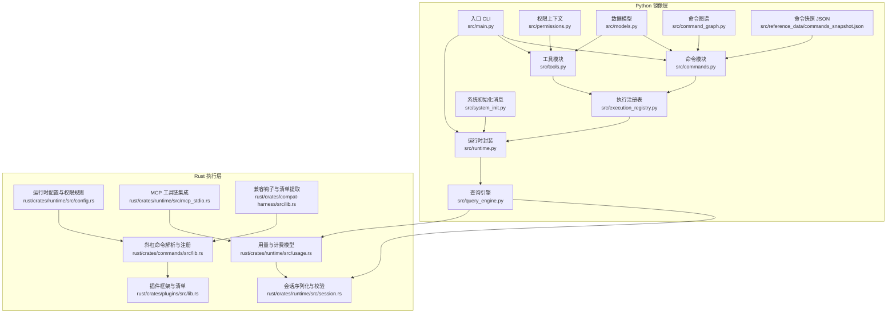
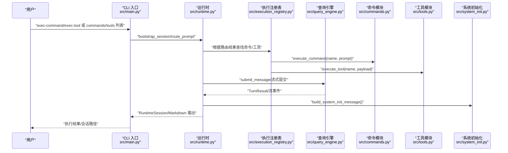
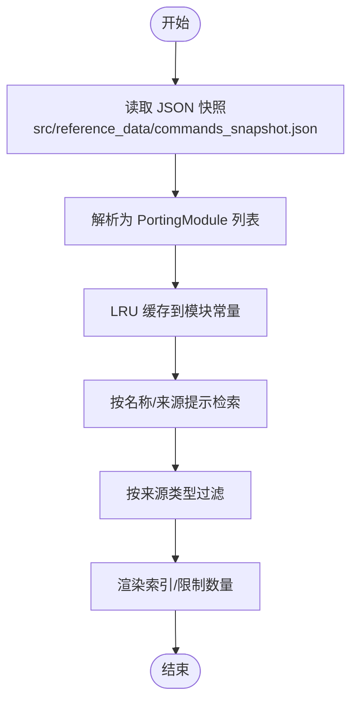
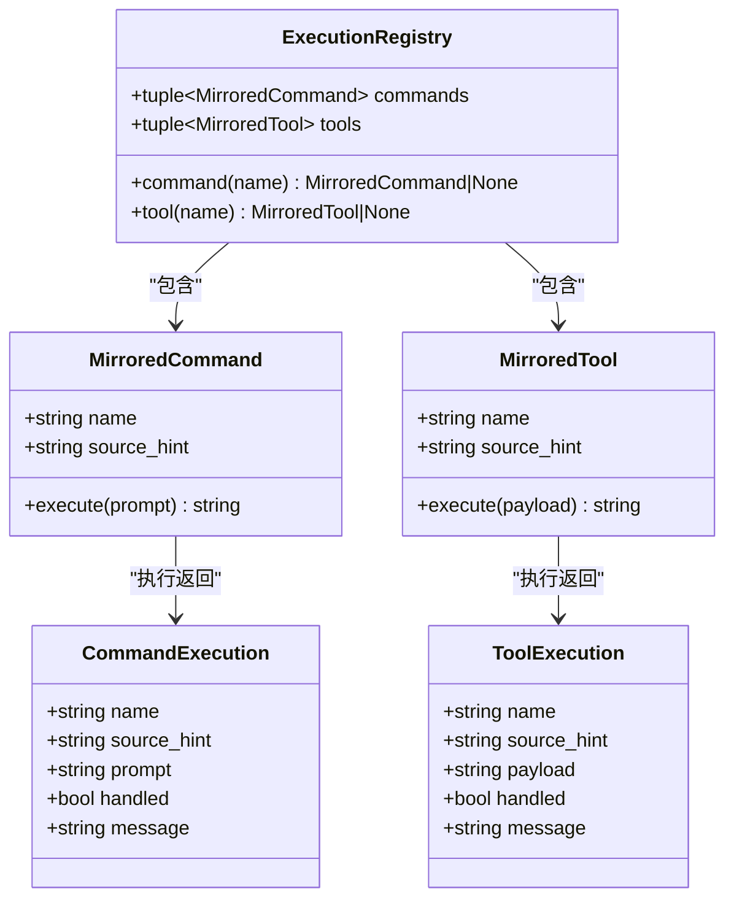
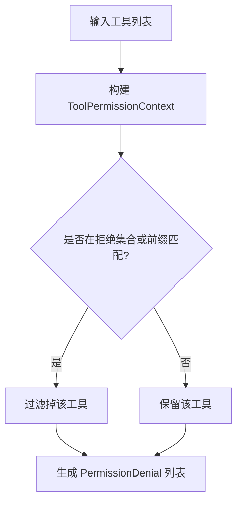
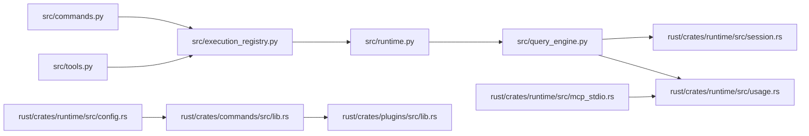
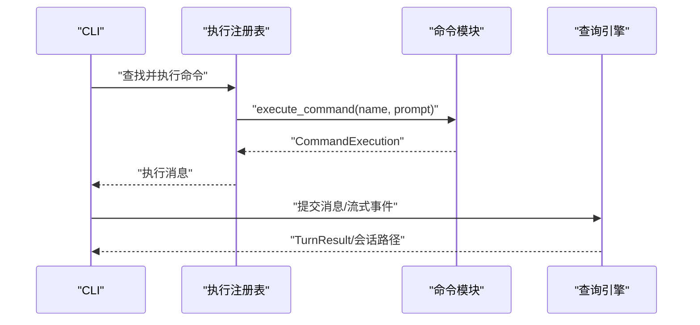

# 命令系统

<cite>
**本文引用的文件**
- [src/commands.py](file://src/commands.py)
- [src/tools.py](file://src/tools.py)
- [src/command_graph.py](file://src/command_graph.py)
- [src/execution_registry.py](file://src/execution_registry.py)
- [src/models.py](file://src/models.py)
- [src/permissions.py](file://src/permissions.py)
- [src/runtime.py](file://src/runtime.py)
- [src/query_engine.py](file://src/query_engine.py)
- [src/main.py](file://src/main.py)
- [src/system_init.py](file://src/system_init.py)
- [rust/crates/commands/src/lib.rs](file://rust/crates/commands/src/lib.rs)
- [rust/crates/plugins/src/lib.rs](file://rust/crates/plugins/src/lib.rs)
- [rust/crates/runtime/src/config.rs](file://rust/crates/runtime/src/config.rs)
- [rust/crates/runtime/src/usage.rs](file://rust/crates/runtime/src/usage.rs)
- [rust/crates/runtime/src/session.rs](file://rust/crates/runtime/src/session.rs)
- [rust/crates/runtime/src/mcp_stdio.rs](file://rust/crates/runtime/src/mcp_stdio.rs)
- [rust/crates/compat-harness/src/lib.rs](file://rust/crates/compat-harness/src/lib.rs)
- [src/reference_data/commands_snapshot.json](file://src/reference_data/commands_snapshot.json)
</cite>

## 目录
1. [简介](#简介)
2. [项目结构](#项目结构)
3. [核心组件](#核心组件)
4. [架构总览](#架构总览)
5. [详细组件分析](#详细组件分析)
6. [依赖分析](#依赖分析)
7. [性能考虑](#性能考虑)
8. [故障排查指南](#故障排查指南)
9. [结论](#结论)
10. [附录](#附录)

## 简介
本文件面向 CLAW 项目的命令系统，系统性阐述命令发现、加载与执行的完整流程，涵盖命令注册机制、权限验证与执行策略、命令元数据结构、参数解析与返回值处理，并提供自定义命令开发指南（接口规范与最佳实践）、扩展性与插件集成能力说明，以及性能优化与错误处理策略。文档同时结合 Python 端的镜像命令与工具清单、Rust 端的插件管理与权限模型，给出跨语言视角的统一视图。

## 项目结构
命令系统由“Python 镜像层”和“Rust 执行层”协同构成：
- Python 层负责命令与工具的快照加载、索引查询、路由与执行代理、会话与统计等。
- Rust 层负责插件生命周期与命令注册、权限规则、会话与使用量统计、MCP 工具链集成等。

图表来源
- [src/commands.py:1-91](file://src/commands.py#L1-L91)
- [src/tools.py:1-97](file://src/tools.py#L1-L97)
- [src/execution_registry.py:1-52](file://src/execution_registry.py#L1-L52)
- [src/runtime.py:1-193](file://src/runtime.py#L1-L193)
- [src/query_engine.py:1-194](file://src/query_engine.py#L1-L194)
- [src/main.py:1-214](file://src/main.py#L1-L214)
- [src/permissions.py:1-21](file://src/permissions.py#L1-L21)
- [src/models.py:1-50](file://src/models.py#L1-L50)
- [src/command_graph.py:1-35](file://src/command_graph.py#L1-L35)
- [src/system_init.py:1-23](file://src/system_init.py#L1-L23)
- [src/reference_data/commands_snapshot.json:1-800](file://src/reference_data/commands_snapshot.json#L1-L800)
- [rust/crates/commands/src/lib.rs:1-800](file://rust/crates/commands/src/lib.rs#L1-L800)
- [rust/crates/plugins/src/lib.rs:1-200](file://rust/crates/plugins/src/lib.rs#L1-L200)
- [rust/crates/runtime/src/config.rs:463-527](file://rust/crates/runtime/src/config.rs#L463-L527)
- [rust/crates/runtime/src/usage.rs:1-209](file://rust/crates/runtime/src/usage.rs#L1-L209)
- [rust/crates/runtime/src/session.rs:327-369](file://rust/crates/runtime/src/session.rs#L327-L369)
- [rust/crates/runtime/src/mcp_stdio.rs:1005-1453](file://rust/crates/runtime/src/mcp_stdio.rs#L1005-L1453)
- [rust/crates/compat-harness/src/lib.rs:128-184](file://rust/crates/compat-harness/src/lib.rs#L128-L184)

章节来源
- [src/commands.py:1-91](file://src/commands.py#L1-L91)
- [src/tools.py:1-97](file://src/tools.py#L1-L97)
- [src/execution_registry.py:1-52](file://src/execution_registry.py#L1-L52)
- [src/runtime.py:1-193](file://src/runtime.py#L1-L193)
- [src/query_engine.py:1-194](file://src/query_engine.py#L1-L194)
- [src/main.py:1-214](file://src/main.py#L1-L214)
- [src/permissions.py:1-21](file://src/permissions.py#L1-L21)
- [src/models.py:1-50](file://src/models.py#L1-L50)
- [src/command_graph.py:1-35](file://src/command_graph.py#L1-L35)
- [src/system_init.py:1-23](file://src/system_init.py#L1-L23)
- [src/reference_data/commands_snapshot.json:1-800](file://src/reference_data/commands_snapshot.json#L1-L800)
- [rust/crates/commands/src/lib.rs:1-800](file://rust/crates/commands/src/lib.rs#L1-L800)
- [rust/crates/plugins/src/lib.rs:1-200](file://rust/crates/plugins/src/lib.rs#L1-L200)
- [rust/crates/runtime/src/config.rs:463-527](file://rust/crates/runtime/src/config.rs#L463-L527)
- [rust/crates/runtime/src/usage.rs:1-209](file://rust/crates/runtime/src/usage.rs#L1-L209)
- [rust/crates/runtime/src/session.rs:327-369](file://rust/crates/runtime/src/session.rs#L327-L369)
- [rust/crates/runtime/src/mcp_stdio.rs:1005-1453](file://rust/crates/runtime/src/mcp_stdio.rs#L1005-L1453)
- [rust/crates/compat-harness/src/lib.rs:128-184](file://rust/crates/compat-harness/src/lib.rs#L128-L184)

## 核心组件
- 命令与工具快照与查询
  - Python 侧通过 JSON 快照加载命令与工具条目，提供名称、职责与来源提示等元数据；支持按名称、来源提示与职责关键词检索，以及 LRU 缓存加速。
- 执行注册表
  - 将镜像命令/工具包装为可执行对象，提供按名称查找与执行方法，作为运行时路由与执行的统一入口。
- 运行时与查询引擎
  - 路由器基于关键词匹配命令/工具，构建会话并驱动查询引擎生成输出；查询引擎负责会话持久化、令牌预算控制与结构化输出。
- 权限上下文
  - 提供基于名称集合与前缀集合的拒绝策略，用于过滤工具列表与生成权限拒绝项。
- Rust 插件与斜杠命令
  - 定义斜杠命令规范与解析，提供插件安装/启用/禁用/卸载/更新等管理能力，支持插件清单与生命周期钩子。

章节来源
- [src/commands.py:13-91](file://src/commands.py#L13-L91)
- [src/tools.py:14-97](file://src/tools.py#L14-L97)
- [src/execution_registry.py:9-52](file://src/execution_registry.py#L9-L52)
- [src/runtime.py:89-193](file://src/runtime.py#L89-L193)
- [src/query_engine.py:15-194](file://src/query_engine.py#L15-L194)
- [src/permissions.py:6-21](file://src/permissions.py#L6-L21)
- [rust/crates/commands/src/lib.rs:228-387](file://rust/crates/commands/src/lib.rs#L228-L387)
- [rust/crates/plugins/src/lib.rs:106-122](file://rust/crates/plugins/src/lib.rs#L106-L122)

## 架构总览
下图展示从用户输入到命令执行与结果返回的关键路径，包括 Python 镜像层与 Rust 执行层的交互点。

图表来源
- [src/main.py:94-214](file://src/main.py#L94-L214)
- [src/runtime.py:89-152](file://src/runtime.py#L89-L152)
- [src/execution_registry.py:27-52](file://src/execution_registry.py#L27-L52)
- [src/query_engine.py:61-128](file://src/query_engine.py#L61-L128)
- [src/commands.py:75-81](file://src/commands.py#L75-L81)
- [src/tools.py:81-87](file://src/tools.py#L81-L87)
- [src/system_init.py:8-23](file://src/system_init.py#L8-L23)

## 详细组件分析

### 命令发现与加载
- 快照加载
  - 命令快照来自 JSON 文件，解析为不可变的数据类实例，缓存于模块级常量中，避免重复 IO。
  - 工具快照同理，提供一致的元数据结构与查询接口。
- 查询与过滤
  - 支持大小写不敏感的名称与来源提示匹配；可按来源类型过滤（如排除插件或技能）。
  - 提供分页渲染与限制数量的索引输出。
- 命令图谱
  - 将命令按来源提示分类为内置、插件类与技能类，便于可视化与审计。

图表来源
- [src/commands.py:22-46](file://src/commands.py#L22-L46)
- [src/tools.py:23-42](file://src/tools.py#L23-L42)
- [src/command_graph.py:29-35](file://src/command_graph.py#L29-L35)
- [src/reference_data/commands_snapshot.json:1-800](file://src/reference_data/commands_snapshot.json#L1-L800)

章节来源
- [src/commands.py:13-91](file://src/commands.py#L13-L91)
- [src/tools.py:14-97](file://src/tools.py#L14-L97)
- [src/command_graph.py:9-35](file://src/command_graph.py#L9-L35)
- [src/reference_data/commands_snapshot.json:1-800](file://src/reference_data/commands_snapshot.json#L1-L800)

### 命令注册机制与执行策略
- 注册表
  - 将镜像命令包装为可执行对象，提供按名称查找与执行方法；工具同样以镜像方式注册。
- 执行策略
  - 执行函数返回统一的执行结果对象，包含是否已处理、来源提示与消息文本；未找到命令时返回失败状态与提示信息。
- 路由与会话
  - 运行时根据关键词对命令/工具进行评分与排序，构建会话并调用查询引擎生成输出；支持流式事件与结构化输出。

图表来源
- [src/execution_registry.py:9-52](file://src/execution_registry.py#L9-L52)
- [src/commands.py:13-21](file://src/commands.py#L13-L21)
- [src/tools.py:14-21](file://src/tools.py#L14-L21)

章节来源
- [src/execution_registry.py:9-52](file://src/execution_registry.py#L9-L52)
- [src/commands.py:75-81](file://src/commands.py#L75-L81)
- [src/tools.py:81-87](file://src/tools.py#L81-L87)
- [src/runtime.py:89-152](file://src/runtime.py#L89-L152)

### 权限验证与执行策略
- Python 侧权限
  - 基于名称集合与前缀集合的拒绝策略，用于过滤工具列表；运行时可推断部分工具的权限拒绝原因。
- Rust 侧权限
  - 运行时权限规则配置支持允许/拒绝/询问三类规则；插件清单定义所需权限级别；工具权限枚举提供只读、工作区写入、危险全权等粒度。
- 权限上下文
  - 可从可迭代的名称与前缀构建拒绝上下文，用于工具筛选与拒绝项生成。

图表来源
- [src/permissions.py:6-21](file://src/permissions.py#L6-L21)
- [src/tools.py:56-73](file://src/tools.py#L56-L73)
- [src/runtime.py:169-174](file://src/runtime.py#L169-L174)
- [rust/crates/runtime/src/config.rs:495-515](file://rust/crates/runtime/src/config.rs#L495-L515)
- [rust/crates/plugins/src/lib.rs:124-130](file://rust/crates/plugins/src/lib.rs#L124-L130)
- [rust/crates/plugins/src/lib.rs:170-196](file://rust/crates/plugins/src/lib.rs#L170-L196)

章节来源
- [src/permissions.py:6-21](file://src/permissions.py#L6-L21)
- [src/tools.py:56-73](file://src/tools.py#L56-L73)
- [src/runtime.py:169-174](file://src/runtime.py#L169-L174)
- [rust/crates/runtime/src/config.rs:495-515](file://rust/crates/runtime/src/config.rs#L495-L515)
- [rust/crates/plugins/src/lib.rs:124-130](file://rust/crates/plugins/src/lib.rs#L124-L130)
- [rust/crates/plugins/src/lib.rs:170-196](file://rust/crates/plugins/src/lib.rs#L170-L196)

### 命令元数据结构、参数解析与返回值处理
- 元数据结构
  - 命令与工具均使用不可变数据类承载名称、职责、来源提示与状态字段；命令执行与工具执行返回统一的结果对象。
- 参数解析
  - Python CLI 子命令解析器支持命令/工具列表、查询、过滤选项与执行参数；运行时路由基于关键词评分选择候选。
- 返回值处理
  - 查询引擎负责格式化输出、结构化输出重试、会话持久化与预算控制；运行时封装输出为 Markdown 结构。

章节来源
- [src/models.py:14-44](file://src/models.py#L14-L44)
- [src/commands.py:13-21](file://src/commands.py#L13-L21)
- [src/tools.py:14-21](file://src/tools.py#L14-L21)
- [src/main.py:21-91](file://src/main.py#L21-L91)
- [src/runtime.py:89-193](file://src/runtime.py#L89-L193)
- [src/query_engine.py:61-170](file://src/query_engine.py#L61-L170)

### 自定义命令开发指南
- 接口规范
  - 命令与工具应具备稳定的名称、清晰的职责描述与来源提示；建议遵循“命令/工具 + index.ts”或“命令/工具 + .tsx”的组织方式。
- 清单与注册
  - 在 Python 侧通过快照 JSON 维护命令/工具清单；在 Rust 侧通过插件清单定义命令与工具的输入模式、权限要求与生命周期钩子。
- 最佳实践
  - 明确命令边界与副作用；对可能破坏性的操作（如 Bash）采用只读或受限权限；提供清晰的错误与回退路径；保持来源提示可追溯。

章节来源
- [src/reference_data/commands_snapshot.json:1-800](file://src/reference_data/commands_snapshot.json#L1-L800)
- [rust/crates/plugins/src/lib.rs:106-122](file://rust/crates/plugins/src/lib.rs#L106-L122)
- [rust/crates/compat-harness/src/lib.rs:128-184](file://rust/crates/compat-harness/src/lib.rs#L128-L184)

### 扩展性与插件集成
- 插件管理
  - 支持插件安装、启用、禁用、卸载与更新；插件清单包含命令与工具定义、生命周期钩子与权限声明。
- 斜杠命令
  - Rust 侧定义斜杠命令规范与解析，覆盖帮助、状态、压缩、模型切换、权限模式、清理、成本统计、会话管理、插件管理、代理与技能等。
- 兼容钩子
  - 通过兼容钩子扫描源码中的导入与特性标记，自动提取命令/工具清单，辅助迁移与发现。

章节来源
- [rust/crates/plugins/src/lib.rs:489-643](file://rust/crates/plugins/src/lib.rs#L489-L643)
- [rust/crates/commands/src/lib.rs:228-387](file://rust/crates/commands/src/lib.rs#L228-L387)
- [rust/crates/compat-harness/src/lib.rs:128-184](file://rust/crates/compat-harness/src/lib.rs#L128-L184)

## 依赖分析
- 模块耦合
  - Python 侧命令/工具模块与执行注册表耦合度低，通过统一的执行接口解耦；运行时与查询引擎通过数据类传递路由结果与会话状态。
- 外部依赖
  - Rust 侧依赖插件框架与运行时配置，提供权限规则与用量统计；MCP 工具链用于外部工具调用与脚本生成。
- 循环依赖
  - 当前设计避免循环依赖：Python 侧仅依赖快照与模型；Rust 侧独立维护插件与权限逻辑。

图表来源
- [src/commands.py:1-91](file://src/commands.py#L1-L91)
- [src/tools.py:1-97](file://src/tools.py#L1-L97)
- [src/execution_registry.py:1-52](file://src/execution_registry.py#L1-L52)
- [src/runtime.py:1-193](file://src/runtime.py#L1-L193)
- [src/query_engine.py:1-194](file://src/query_engine.py#L1-L194)
- [rust/crates/runtime/src/session.rs:327-369](file://rust/crates/runtime/src/session.rs#L327-L369)
- [rust/crates/runtime/src/usage.rs:1-209](file://rust/crates/runtime/src/usage.rs#L1-L209)
- [rust/crates/commands/src/lib.rs:1-800](file://rust/crates/commands/src/lib.rs#L1-L800)
- [rust/crates/plugins/src/lib.rs:1-200](file://rust/crates/plugins/src/lib.rs#L1-L200)
- [rust/crates/runtime/src/config.rs:463-527](file://rust/crates/runtime/src/config.rs#L463-L527)
- [rust/crates/runtime/src/mcp_stdio.rs:1005-1453](file://rust/crates/runtime/src/mcp_stdio.rs#L1005-L1453)

章节来源
- [src/commands.py:1-91](file://src/commands.py#L1-L91)
- [src/tools.py:1-97](file://src/tools.py#L1-L97)
- [src/execution_registry.py:1-52](file://src/execution_registry.py#L1-L52)
- [src/runtime.py:1-193](file://src/runtime.py#L1-L193)
- [src/query_engine.py:1-194](file://src/query_engine.py#L1-L194)
- [rust/crates/runtime/src/session.rs:327-369](file://rust/crates/runtime/src/session.rs#L327-L369)
- [rust/crates/runtime/src/usage.rs:1-209](file://rust/crates/runtime/src/usage.rs#L1-L209)
- [rust/crates/commands/src/lib.rs:1-800](file://rust/crates/commands/src/lib.rs#L1-L800)
- [rust/crates/plugins/src/lib.rs:1-200](file://rust/crates/plugins/src/lib.rs#L1-L200)
- [rust/crates/runtime/src/config.rs:463-527](file://rust/crates/runtime/src/config.rs#L463-L527)
- [rust/crates/runtime/src/mcp_stdio.rs:1005-1453](file://rust/crates/runtime/src/mcp_stdio.rs#L1005-L1453)

## 性能考虑
- 缓存策略
  - 命令与工具快照采用 LRU 缓存，减少重复解析与 IO 开销。
- 令牌预算与紧凑化
  - 查询引擎配置最大回合数与令牌预算，超过阈值提前停止；达到一定回合数后对消息进行紧凑化，降低内存占用。
- 计费估算
  - 基于模型定价估算输入/输出/缓存读写的成本，辅助成本控制与上限设置。

章节来源
- [src/commands.py:22-23](file://src/commands.py#L22-L23)
- [src/tools.py:23-24](file://src/tools.py#L23-L24)
- [src/query_engine.py:15-22](file://src/query_engine.py#L15-L22)
- [src/query_engine.py:129-132](file://src/query_engine.py#L129-L132)
- [rust/crates/runtime/src/usage.rs:55-77](file://rust/crates/runtime/src/usage.rs#L55-L77)

## 故障排查指南
- 常见问题
  - 未知命令/工具：执行返回未处理状态与提示信息，检查名称大小写与快照是否存在。
  - 权限被拒绝：工具被拒绝上下文过滤或运行时推断拒绝，检查工具名称与前缀配置。
  - 会话超预算：达到最大回合数或令牌预算，调整配置或精简提示。
- 错误处理
  - 查询引擎在结构化输出失败时进行重试并抛出明确异常；会话序列化与反序列化包含格式校验。
- 插件管理
  - 插件安装/启用/禁用/卸载/更新失败时返回错误信息，需检查插件清单与目标标识唯一性。

章节来源
- [src/commands.py:77-79](file://src/commands.py#L77-L79)
- [src/tools.py:83-85](file://src/tools.py#L83-L85)
- [src/query_engine.py:67-78](file://src/query_engine.py#L67-L78)
- [src/query_engine.py:162-169](file://src/query_engine.py#L162-L169)
- [rust/crates/runtime/src/session.rs:348-358](file://rust/crates/runtime/src/session.rs#L348-L358)
- [rust/crates/plugins/src/lib.rs:1600-1637](file://rust/crates/plugins/src/lib.rs#L1600-L1637)

## 结论
CLAW 的命令系统通过 Python 镜像层与 Rust 执行层的协作，实现了命令与工具的快速发现、统一注册与安全执行。系统在权限控制、会话管理、令牌预算与成本估算方面提供了稳健的工程实践；同时，插件与斜杠命令机制为扩展与集成提供了清晰的接口。建议在自定义命令开发中严格遵循命名与职责边界，合理配置权限与预算，确保安全性与可维护性。

## 附录
- 关键流程图（命令执行）

图表来源
- [src/main.py:200-207](file://src/main.py#L200-L207)
- [src/execution_registry.py:14-16](file://src/execution_registry.py#L14-L16)
- [src/commands.py:75-81](file://src/commands.py#L75-L81)
- [src/query_engine.py:106-128](file://src/query_engine.py#L106-L128)