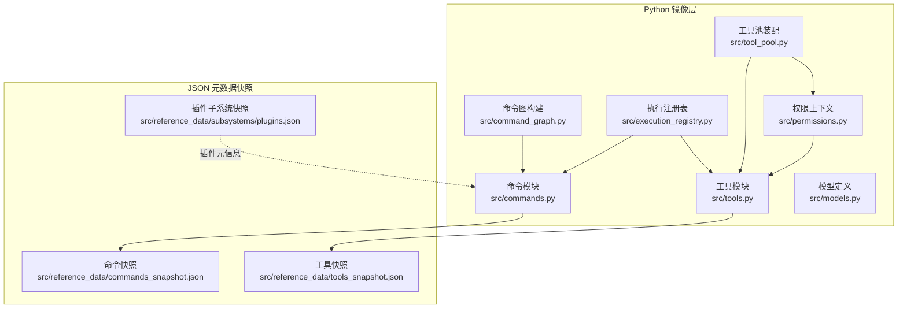
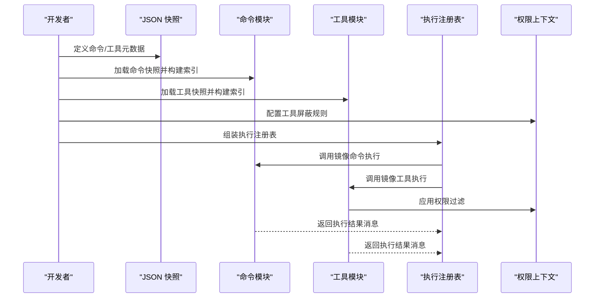
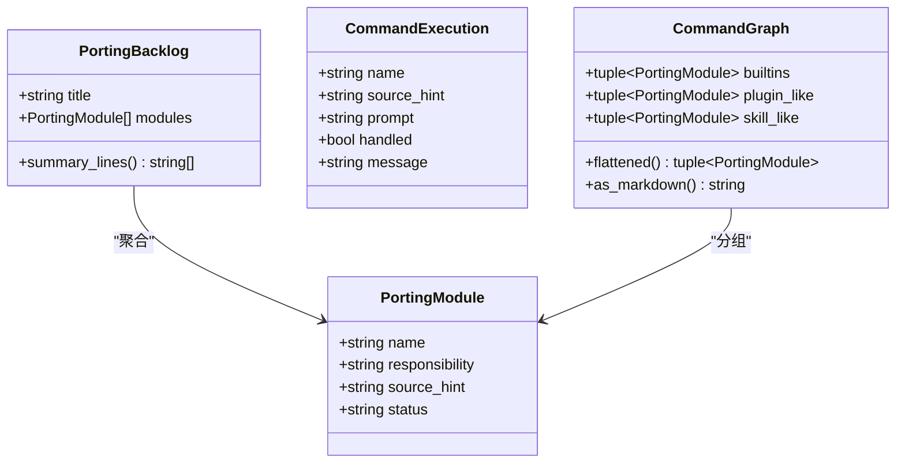
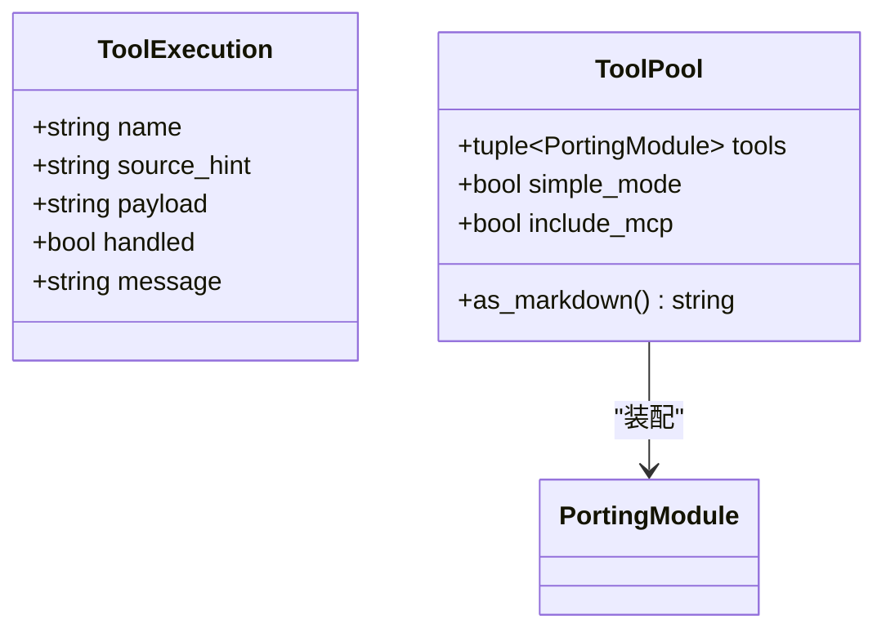
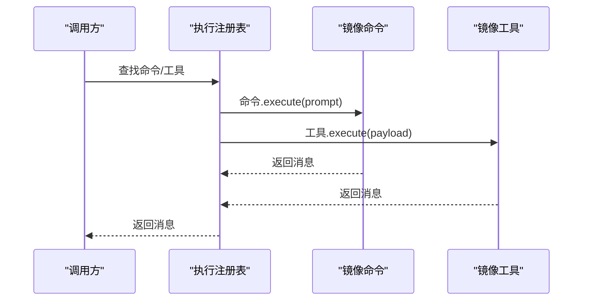
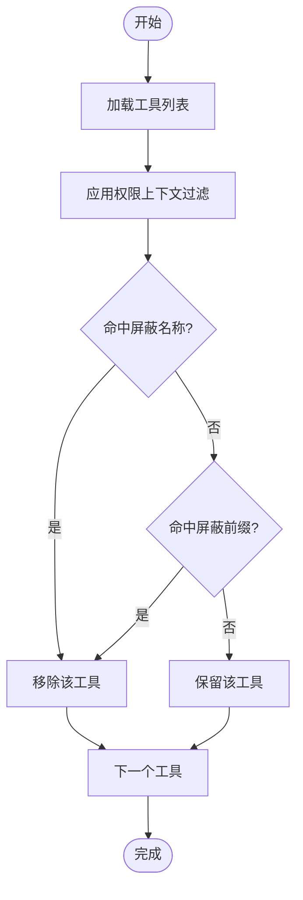
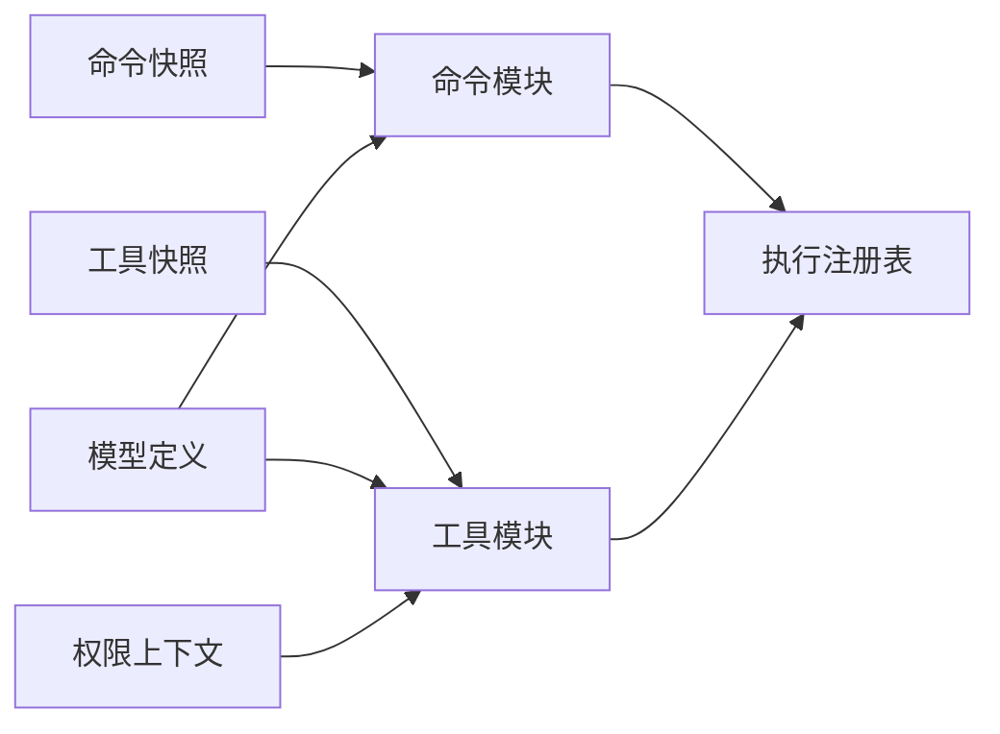

# 自定义命令开发

<cite>
**本文引用的文件**
- [src/commands.py](file://src/commands.py)
- [src/command_graph.py](file://src/command_graph.py)
- [src/tools.py](file://src/tools.py)
- [src/tool_pool.py](file://src/tool_pool.py)
- [src/execution_registry.py](file://src/execution_registry.py)
- [src/models.py](file://src/models.py)
- [src/permissions.py](file://src/permissions.py)
- [src/plugins/__init__.py](file://src/plugins/__init__.py)
- [src/reference_data/commands_snapshot.json](file://src/reference_data/commands_snapshot.json)
- [src/reference_data/tools_snapshot.json](file://src/reference_data/tools_snapshot.json)
- [src/reference_data/subsystems/plugins.json](file://src/reference_data/subsystems/plugins.json)
</cite>

## 目录
1. [简介](#简介)
2. [项目结构](#项目结构)
3. [核心组件](#核心组件)
4. [架构总览](#架构总览)
5. [详细组件分析](#详细组件分析)
6. [依赖分析](#依赖分析)
7. [性能考量](#性能考量)
8. [故障排查指南](#故障排查指南)
9. [结论](#结论)
10. [附录](#附录)

## 简介
本指南面向在 CLAW 项目中开发“自定义命令”的工程师与技术作者，目标是帮助你基于现有镜像命令与工具体系，快速、安全地设计与实现新的命令与工具，并将其纳入统一的执行注册表与权限控制框架。文档覆盖命令接口规范、数据结构定义、实现要求、元数据格式、责任描述编写、源码提示配置、开发流程、测试策略、集成方法、模板与最佳实践、常见陷阱以及注册机制、版本管理与向后兼容性建议。

## 项目结构
CLAW 的命令与工具系统由 Python 层的镜像模块与 JSON 快照共同构成：
- 命令与工具的“镜像”逻辑集中在 Python 模块中，负责加载快照、构建索引、过滤与执行。
- JSON 快照文件记录了原始 TypeScript 源码路径与职责描述，作为“元数据”驱动命令/工具的呈现与权限控制。
- 权限上下文用于在运行时按名称或前缀屏蔽特定工具，确保安全可控。

图表来源
- [src/commands.py:1-91](file://src/commands.py#L1-L91)
- [src/command_graph.py:1-35](file://src/command_graph.py#L1-L35)
- [src/tools.py:1-97](file://src/tools.py#L1-L97)
- [src/tool_pool.py:1-38](file://src/tool_pool.py#L1-L38)
- [src/execution_registry.py:1-52](file://src/execution_registry.py#L1-L52)
- [src/models.py:1-50](file://src/models.py#L1-L50)
- [src/permissions.py:1-21](file://src/permissions.py#L1-L21)
- [src/reference_data/commands_snapshot.json:1-1037](file://src/reference_data/commands_snapshot.json#L1-L1037)
- [src/reference_data/tools_snapshot.json:1-922](file://src/reference_data/tools_snapshot.json#L1-L922)
- [src/reference_data/subsystems/plugins.json:1-9](file://src/reference_data/subsystems/plugins.json#L1-L9)

章节来源
- [src/commands.py:1-91](file://src/commands.py#L1-L91)
- [src/command_graph.py:1-35](file://src/command_graph.py#L1-L35)
- [src/tools.py:1-97](file://src/tools.py#L1-L97)
- [src/tool_pool.py:1-38](file://src/tool_pool.py#L1-L38)
- [src/execution_registry.py:1-52](file://src/execution_registry.py#L1-L52)
- [src/models.py:1-50](file://src/models.py#L1-L50)
- [src/permissions.py:1-21](file://src/permissions.py#L1-L21)
- [src/reference_data/commands_snapshot.json:1-1037](file://src/reference_data/commands_snapshot.json#L1-L1037)
- [src/reference_data/tools_snapshot.json:1-922](file://src/reference_data/tools_snapshot.json#L1-L922)
- [src/reference_data/subsystems/plugins.json:1-9](file://src/reference_data/subsystems/plugins.json#L1-L9)

## 核心组件
- 命令与工具的“镜像”模块：负责从 JSON 快照加载、构建索引、查询、过滤与执行。
- 执行注册表：将镜像命令/工具包装为可调用对象，统一对外暴露执行入口。
- 权限上下文：提供基于名称与前缀的工具屏蔽能力，保障运行期安全。
- 数据模型：定义命令/工具模块、回溯清单、使用统计等核心数据结构。

章节来源
- [src/commands.py:13-91](file://src/commands.py#L13-L91)
- [src/tools.py:14-97](file://src/tools.py#L14-L97)
- [src/execution_registry.py:9-52](file://src/execution_registry.py#L9-L52)
- [src/models.py:6-50](file://src/models.py#L6-L50)
- [src/permissions.py:6-21](file://src/permissions.py#L6-L21)

## 架构总览
下图展示了命令与工具从“元数据快照”到“执行注册表”的全链路：

图表来源
- [src/reference_data/commands_snapshot.json:1-1037](file://src/reference_data/commands_snapshot.json#L1-L1037)
- [src/reference_data/tools_snapshot.json:1-922](file://src/reference_data/tools_snapshot.json#L1-L922)
- [src/commands.py:22-91](file://src/commands.py#L22-L91)
- [src/tools.py:23-97](file://src/tools.py#L23-L97)
- [src/permissions.py:6-21](file://src/permissions.py#L6-L21)
- [src/execution_registry.py:27-52](file://src/execution_registry.py#L27-L52)

## 详细组件分析

### 命令接口规范与数据结构
- 命令数据结构
  - 名称、职责描述、源码提示、状态（默认 planned，镜像后为 mirrored）。
  - 回溯清单用于汇总与展示迁移进度。
- 命令执行返回结构
  - 包含名称、源码提示、输入提示、是否已处理、最终消息。
- 关键函数
  - 加载快照、构建命令回溯清单、查询与过滤、执行镜像命令、渲染索引。

图表来源
- [src/models.py:6-50](file://src/models.py#L6-L50)
- [src/commands.py:13-91](file://src/commands.py#L13-L91)
- [src/command_graph.py:9-35](file://src/command_graph.py#L9-L35)

章节来源
- [src/models.py:6-50](file://src/models.py#L6-L50)
- [src/commands.py:13-91](file://src/commands.py#L13-L91)
- [src/command_graph.py:9-35](file://src/command_graph.py#L9-L35)

### 工具接口规范与数据结构
- 工具数据结构与命令类似，但执行返回结构包含 payload 字段。
- 工具池支持简单模式、包含 MCP 选项与权限上下文过滤。
- 关键函数
  - 加载快照、构建工具回溯清单、查询与过滤、执行镜像工具、渲染索引。

图表来源
- [src/tools.py:14-97](file://src/tools.py#L14-L97)
- [src/tool_pool.py:10-38](file://src/tool_pool.py#L10-L38)

章节来源
- [src/tools.py:14-97](file://src/tools.py#L14-L97)
- [src/tool_pool.py:10-38](file://src/tool_pool.py#L10-L38)

### 执行注册表与调用流程
- 注册表将镜像命令/工具包装为可直接调用的对象，提供统一的查找与执行入口。
- 调用流程包括：查找、执行、返回消息。

图表来源
- [src/execution_registry.py:9-52](file://src/execution_registry.py#L9-L52)
- [src/commands.py:75-81](file://src/commands.py#L75-L81)
- [src/tools.py:81-87](file://src/tools.py#L81-L87)

章节来源
- [src/execution_registry.py:9-52](file://src/execution_registry.py#L9-L52)
- [src/commands.py:75-81](file://src/commands.py#L75-L81)
- [src/tools.py:81-87](file://src/tools.py#L81-L87)

### 权限控制与安全
- 权限上下文支持按名称与前缀屏蔽工具，避免高风险操作。
- 工具池在装配阶段应用权限过滤，确保只暴露允许的工具集。

图表来源
- [src/permissions.py:6-21](file://src/permissions.py#L6-L21)
- [src/tools.py:56-72](file://src/tools.py#L56-L72)
- [src/tool_pool.py:28-37](file://src/tool_pool.py#L28-L37)

章节来源
- [src/permissions.py:6-21](file://src/permissions.py#L6-L21)
- [src/tools.py:56-72](file://src/tools.py#L56-L72)
- [src/tool_pool.py:28-37](file://src/tool_pool.py#L28-L37)

### 命令元数据格式与责任描述
- 命令快照字段
  - name：命令名称（唯一标识）
  - source_hint：原始源码位置提示（用于溯源与审计）
  - responsibility：职责描述（面向使用者的说明）
- 工具快照字段
  - name：工具名称
  - source_hint：原始源码位置提示
  - responsibility：职责描述
- 插件子系统快照
  - archive_name、package_name、module_count、sample_files：用于插件元信息占位与展示

章节来源
- [src/reference_data/commands_snapshot.json:1-1037](file://src/reference_data/commands_snapshot.json#L1-L1037)
- [src/reference_data/tools_snapshot.json:1-922](file://src/reference_data/tools_snapshot.json#L1-L922)
- [src/reference_data/subsystems/plugins.json:1-9](file://src/reference_data/subsystems/plugins.json#L1-L9)

### 源码提示配置与镜像策略
- 源码提示（source_hint）用于定位原始实现，便于迁移与审计。
- 镜像策略
  - 命令与工具均以“镜像”方式存在，状态在加载后标记为 mirrored。
  - 查询与过滤基于名称与 source_hint，支持大小写不敏感匹配。

章节来源
- [src/commands.py:22-91](file://src/commands.py#L22-L91)
- [src/tools.py:23-97](file://src/tools.py#L23-L97)

### 开发流程与最佳实践
- 元数据定义
  - 在命令/工具快照中添加新条目，填写 name、source_hint、responsibility。
- Python 镜像实现
  - 使用现有命令/工具模块的模式，扩展加载、查询、执行与渲染逻辑。
  - 保持返回结构一致（CommandExecution/ToolExecution），便于注册表统一处理。
- 权限与安全
  - 对高风险工具设置屏蔽规则；在工具池装配时应用权限上下文。
- 版本与兼容
  - 通过 source_hint 保留原始路径，便于追踪变更；在迁移过程中维持名称稳定。
- 测试策略
  - 单元测试：验证加载、查询、过滤、执行与渲染。
  - 集成测试：模拟执行注册表调用，覆盖权限过滤与错误场景。
- 常见陷阱
  - 忘记更新快照导致未知命令/工具。
  - 权限屏蔽规则过于宽泛或过窄。
  - 返回消息未遵循统一格式，影响上层展示与日志。

章节来源
- [src/commands.py:22-91](file://src/commands.py#L22-L91)
- [src/tools.py:23-97](file://src/tools.py#L23-L97)
- [src/execution_registry.py:27-52](file://src/execution_registry.py#L27-L52)
- [src/permissions.py:6-21](file://src/permissions.py#L6-L21)

### 命令注册机制与版本管理
- 注册机制
  - 执行注册表根据快照动态生成镜像命令/工具实例，提供统一查找与执行接口。
- 版本与兼容
  - 通过 source_hint 与 status 字段记录迁移状态；名称应保持稳定以保证向后兼容。
  - 插件子系统快照用于占位与展示，便于后续迁移。

章节来源
- [src/execution_registry.py:27-52](file://src/execution_registry.py#L27-L52)
- [src/models.py:14-20](file://src/models.py#L14-L20)
- [src/reference_data/subsystems/plugins.json:1-9](file://src/reference_data/subsystems/plugins.json#L1-L9)

## 依赖分析
- 命令模块依赖 JSON 快照与模型定义，输出命令集合与执行结果。
- 工具模块依赖 JSON 快照、模型定义与权限上下文，输出工具集合与执行结果。
- 执行注册表依赖命令与工具模块，提供统一的查找与执行入口。
- 权限上下文被工具池与工具模块复用，形成一致的安全策略。

图表来源
- [src/reference_data/commands_snapshot.json:1-1037](file://src/reference_data/commands_snapshot.json#L1-L1037)
- [src/reference_data/tools_snapshot.json:1-922](file://src/reference_data/tools_snapshot.json#L1-L922)
- [src/models.py:14-50](file://src/models.py#L14-L50)
- [src/permissions.py:6-21](file://src/permissions.py#L6-L21)
- [src/commands.py:22-91](file://src/commands.py#L22-L91)
- [src/tools.py:23-97](file://src/tools.py#L23-L97)
- [src/execution_registry.py:27-52](file://src/execution_registry.py#L27-L52)

章节来源
- [src/commands.py:22-91](file://src/commands.py#L22-L91)
- [src/tools.py:23-97](file://src/tools.py#L23-L97)
- [src/execution_registry.py:27-52](file://src/execution_registry.py#L27-L52)
- [src/models.py:14-50](file://src/models.py#L14-L50)
- [src/permissions.py:6-21](file://src/permissions.py#L6-L21)

## 性能考量
- 缓存策略
  - 命令与工具模块均采用 LRU 缓存加载快照，减少重复 IO。
- 查询复杂度
  - 基于列表的线性匹配，适合当前规模；若条目增多，可引入字典索引优化。
- 渲染与过滤
  - 渲染与过滤在内存中进行，注意限制返回数量与查询范围。

章节来源
- [src/commands.py:22-91](file://src/commands.py#L22-L91)
- [src/tools.py:23-97](file://src/tools.py#L23-L97)

## 故障排查指南
- 未知命令/工具
  - 现象：执行返回未识别。
  - 排查：确认快照中是否存在对应 name；检查大小写与拼写。
- 权限拦截
  - 现象：工具不可见或被屏蔽。
  - 排查：检查权限上下文的 deny_names 与 deny_prefixes；确认工具名是否命中规则。
- 执行失败
  - 现象：handled 为 false 或返回错误消息。
  - 排查：查看返回消息中的具体原因；核对 prompt/payload 结构。

章节来源
- [src/commands.py:75-81](file://src/commands.py#L75-L81)
- [src/tools.py:81-87](file://src/tools.py#L81-L87)
- [src/permissions.py:18-21](file://src/permissions.py#L18-L21)

## 结论
通过统一的元数据快照、镜像模块与执行注册表，CLAW 提供了清晰的自定义命令与工具开发路径。遵循本文档的接口规范、数据结构与最佳实践，可以高效、安全地扩展命令与工具生态，并在权限控制与版本兼容方面获得良好保障。

## 附录
- 命令开发模板（步骤）
  - 在命令快照中新增条目（name、source_hint、responsibility）。
  - 在命令模块中实现加载、查询、过滤、执行与渲染。
  - 在执行注册表中注册镜像命令。
  - 编写单元与集成测试。
- 工具开发模板（步骤）
  - 在工具快照中新增条目。
  - 在工具模块中实现加载、查询、过滤、执行与渲染。
  - 在工具池中装配并应用权限上下文。
  - 编写单元与集成测试。
- 常用工具与命令
  - BashTool、FileReadTool、FileEditTool、GrepTool、LSPTool、MCPTool 等。
  - add-dir、advisor、agents、branch、bridge、clear、config、context、help、plugin、mcp 等。

章节来源
- [src/reference_data/commands_snapshot.json:1-1037](file://src/reference_data/commands_snapshot.json#L1-L1037)
- [src/reference_data/tools_snapshot.json:1-922](file://src/reference_data/tools_snapshot.json#L1-L922)
- [src/commands.py:22-91](file://src/commands.py#L22-L91)
- [src/tools.py:23-97](file://src/tools.py#L23-L97)
- [src/execution_registry.py:27-52](file://src/execution_registry.py#L27-L52)