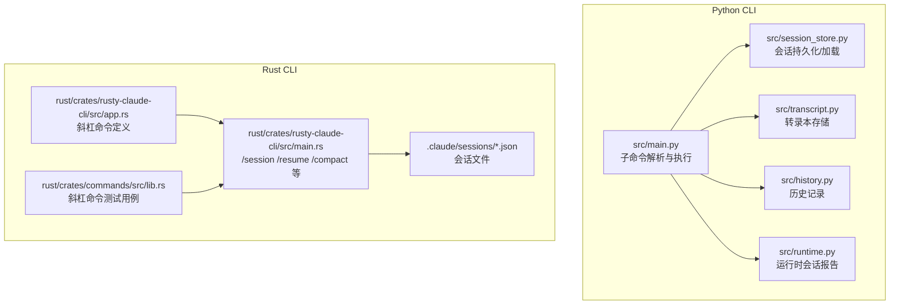
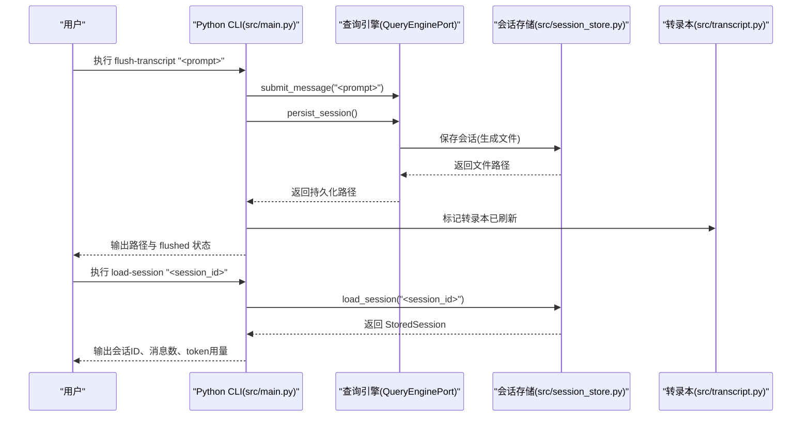
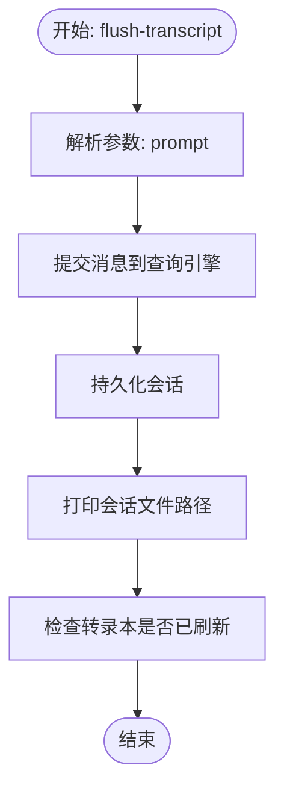
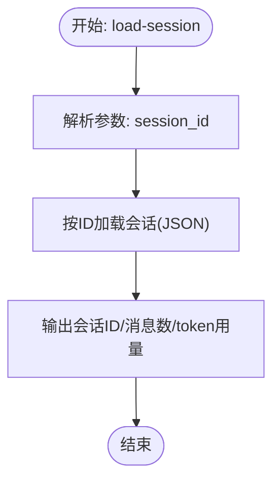
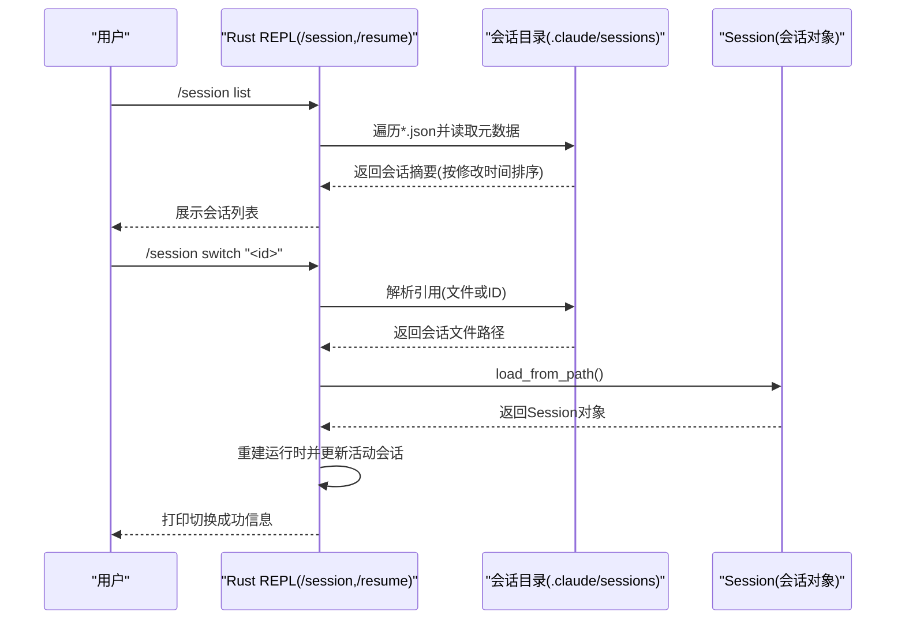
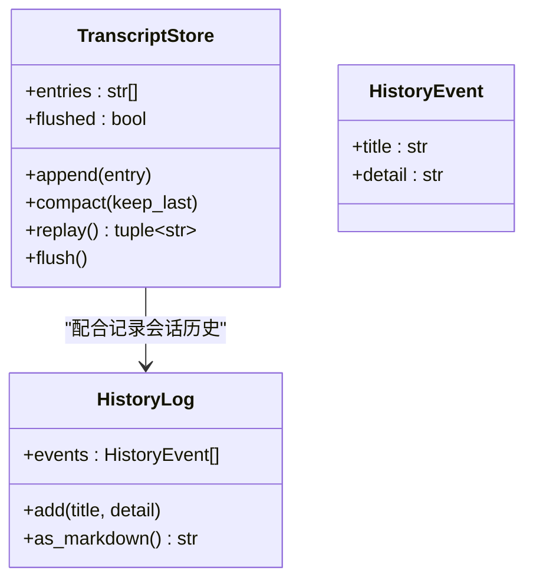
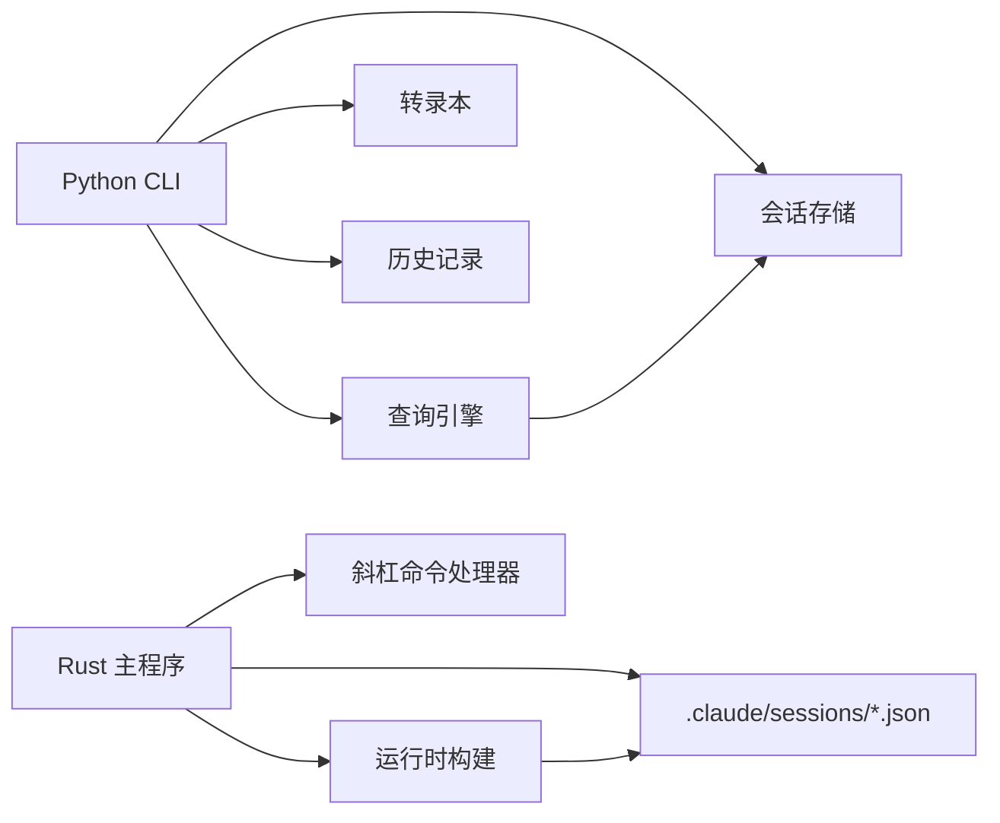

# 会话命令

<cite>
**本文引用的文件**
- [src/main.py](file://src/main.py)
- [src/session_store.py](file://src/session_store.py)
- [src/transcript.py](file://src/transcript.py)
- [src/history.py](file://src/history.py)
- [src/runtime.py](file://src/runtime.py)
- [rust/crates/rusty-claude-cli/src/main.rs](file://rust/crates/rusty-claude-cli/src/main.rs)
- [rust/crates/rusty-claude-cli/src/app.rs](file://rust/crates/rusty-claude-cli/src/app.rs)
- [rust/crates/commands/src/lib.rs](file://rust/crates/commands/src/lib.rs)
- [rust/.claude/sessions/session-1775007453382.json](file://rust/.claude/sessions/session-1775007453382.json)
</cite>

## 目录
1. [简介](#简介)
2. [项目结构](#项目结构)
3. [核心组件](#核心组件)
4. [架构总览](#架构总览)
5. [详细组件分析](#详细组件分析)
6. [依赖分析](#依赖分析)
7. [性能考虑](#性能考虑)
8. [故障排除指南](#故障排除指南)
9. [结论](#结论)
10. [附录](#附录)

## 简介
本文件聚焦 CLAW 项目的“会话命令”，系统性阐述以下能力与流程：
- flush-transcript：将当前临时会话转录本持久化并标记为已刷新
- load-session：加载已持久化的会话（按会话 ID）
- 会话持久化机制与转录本管理
- 历史记录与状态恢复
- 会话 ID 管理与会话切换
- 最佳实践与故障排除建议
- 在开发调试与状态管理中的价值

## 项目结构
围绕会话命令的相关代码分布在 Python 侧与 Rust 侧：
- Python 侧提供 CLI 子命令解析与执行入口，并通过会话存储模块进行读写
- Rust 侧提供 REPL 会话命令（如 /session、/resume、/compact 等）以及会话文件解析与列表展示
- 转录本与历史记录分别由独立模块维护，用于记录交互过程与状态

**图表来源**
- [src/main.py:62-214](file://src/main.py#L62-L214)
- [src/session_store.py:19-36](file://src/session_store.py#L19-L36)
- [src/transcript.py:6-24](file://src/transcript.py#L6-L24)
- [src/history.py:6-23](file://src/history.py#L6-L23)
- [src/runtime.py:24-86](file://src/runtime.py#L24-L86)
- [rust/crates/rusty-claude-cli/src/main.rs:1510-1880](file://rust/crates/rusty-claude-cli/src/main.rs#L1510-L1880)
- [rust/crates/rusty-claude-cli/src/app.rs:58-98](file://rust/crates/rusty-claude-cli/src/app.rs#L58-L98)
- [rust/crates/commands/src/lib.rs:1300-1333](file://rust/crates/commands/src/lib.rs#L1300-L1333)
- [rust/.claude/sessions/session-1775007453382.json:1-1](file://rust/.claude/sessions/session-1775007453382.json#L1-L1)

**章节来源**
- [src/main.py:62-214](file://src/main.py#L62-L214)
- [src/session_store.py:19-36](file://src/session_store.py#L19-L36)
- [src/transcript.py:6-24](file://src/transcript.py#L6-L24)
- [src/history.py:6-23](file://src/history.py#L6-L23)
- [src/runtime.py:24-86](file://src/runtime.py#L24-L86)
- [rust/crates/rusty-claude-cli/src/main.rs:1510-1880](file://rust/crates/rusty-claude-cli/src/main.rs#L1510-L1880)
- [rust/crates/rusty-claude-cli/src/app.rs:58-98](file://rust/crates/rusty-claude-cli/src/app.rs#L58-L98)
- [rust/crates/commands/src/lib.rs:1300-1333](file://rust/crates/commands/src/lib.rs#L1300-L1333)
- [rust/.claude/sessions/session-1775007453382.json:1-1](file://rust/.claude/sessions/session-1775007453382.json#L1-L1)

## 核心组件
- 会话持久化与加载
  - Python 侧：提供 load-session 子命令，调用会话存储模块按 ID 加载；提供 flush-transcript 子命令，提交消息后持久化并返回路径，同时输出转录本是否已刷新的状态
  - Rust 侧：提供 /session 列表与切换、/resume 恢复、/compact 压缩等命令，支持从文件或 ID 解析会话并重建运行时

- 转录本管理
  - 提供 TranscriptStore，支持追加条目、紧凑化保留最近 N 条、回放全部条目、标记已刷新

- 历史记录
  - 提供 HistoryLog，记录事件标题与详情，并可导出为 Markdown

- 运行时会话报告
  - RuntimeSession 将上下文、路由结果、工具/命令执行、流事件与会话持久化路径整合为报告，便于调试与审计

**章节来源**
- [src/main.py:160-170](file://src/main.py#L160-L170)
- [src/session_store.py:19-36](file://src/session_store.py#L19-L36)
- [src/transcript.py:6-24](file://src/transcript.py#L6-L24)
- [src/history.py:6-23](file://src/history.py#L6-L23)
- [src/runtime.py:24-86](file://src/runtime.py#L24-L86)
- [rust/crates/rusty-claude-cli/src/main.rs:1510-1551](file://rust/crates/rusty-claude-cli/src/main.rs#L1510-L1551)

## 架构总览
下图展示了 flush-transcript 与 load-session 的关键调用链路与数据流。

**图表来源**
- [src/main.py:160-170](file://src/main.py#L160-L170)
- [src/session_store.py:19-36](file://src/session_store.py#L19-L36)
- [src/transcript.py:11-24](file://src/transcript.py#L11-L24)

**章节来源**
- [src/main.py:160-170](file://src/main.py#L160-L170)
- [src/session_store.py:19-36](file://src/session_store.py#L19-L36)
- [src/transcript.py:11-24](file://src/transcript.py#L11-L24)

## 详细组件分析

### 组件一：flush-transcript 命令
- 功能概述
  - 将当前会话的输入提示提交到查询引擎，随后持久化当前会话至本地文件，最后打印持久化路径，并输出转录本是否已刷新的状态
- 关键流程
  - 解析参数：接收一个提示字符串
  - 提交消息：调用查询引擎提交提示
  - 持久化：调用查询引擎的持久化接口，返回会话文件路径
  - 状态输出：打印路径与转录本刷新标志
- 数据结构与复杂度
  - 会话持久化为 JSON 文件，时间复杂度主要受消息数量与内容大小影响
  - 转录本追加与刷新为 O(1) 操作
- 错误处理
  - 若持久化失败或查询引擎异常，应捕获错误并提示用户
- 使用场景
  - 开发调试中快速固化当前对话，便于后续分析与重放

**图表来源**
- [src/main.py:160-166](file://src/main.py#L160-L166)
- [src/transcript.py:22-24](file://src/transcript.py#L22-L24)

**章节来源**
- [src/main.py:160-166](file://src/main.py#L160-L166)
- [src/transcript.py:11-24](file://src/transcript.py#L11-L24)

### 组件二：load-session 命令
- 功能概述
  - 根据提供的会话 ID 加载已持久化的会话，输出会话 ID、消息数量以及输入/输出 token 用量
- 关键流程
  - 解析参数：接收会话 ID
  - 加载会话：调用会话存储模块按 ID 读取 JSON 并反序列化
  - 输出信息：打印会话元数据
- 数据结构
  - StoredSession 包含 session_id、messages、input_tokens、output_tokens
- 错误处理
  - 若会话文件不存在或格式不正确，需给出明确错误提示

**图表来源**
- [src/main.py:167-170](file://src/main.py#L167-L170)
- [src/session_store.py:27-36](file://src/session_store.py#L27-L36)

**章节来源**
- [src/main.py:167-170](file://src/main.py#L167-L170)
- [src/session_store.py:27-36](file://src/session_store.py#L27-L36)

### 组件三：会话 ID 管理与状态恢复（Rust 侧）
- 会话 ID 生成
  - 基于当前时间的毫秒级数值生成唯一 ID，格式为 session-{timestamp}
- 会话解析与切换
  - 支持直接传入文件路径或仅传入 ID（自动拼接 .json），若文件不存在则报错
  - /session list：列出所有已管理的会话，按修改时间倒序，标注当前活跃会话
  - /session switch：根据目标 ID 或路径加载会话并重建运行时
  - /resume：从指定会话文件恢复运行时，支持后续执行 /compact、/clear、/status 等命令
- 状态恢复流程
  - 读取会话 JSON → 构建运行时 → 更新活动会话句柄 → 打印恢复报告

**图表来源**
- [rust/crates/rusty-claude-cli/src/main.rs:1821-1880](file://rust/crates/rusty-claude-cli/src/main.rs#L1821-L1880)
- [rust/crates/rusty-claude-cli/src/main.rs:1510-1551](file://rust/crates/rusty-claude-cli/src/main.rs#L1510-L1551)
- [rust/crates/rusty-claude-cli/src/main.rs:1795-1819](file://rust/crates/rusty-claude-cli/src/main.rs#L1795-L1819)

**章节来源**
- [rust/crates/rusty-claude-cli/src/main.rs:1795-1819](file://rust/crates/rusty-claude-cli/src/main.rs#L1795-L1819)
- [rust/crates/rusty-claude-cli/src/main.rs:1821-1880](file://rust/crates/rusty-claude-cli/src/main.rs#L1821-L1880)
- [rust/crates/rusty-claude-cli/src/main.rs:1510-1551](file://rust/crates/rusty-claude-cli/src/main.rs#L1510-L1551)

### 组件四：转录本管理与历史记录
- TranscriptStore
  - 提供 append、compact、replay、flush 等方法，支持对转录本进行增量追加、尾部紧凑化、回放与刷新标记
- HistoryLog
  - 记录会话过程中的事件，支持以 Markdown 格式导出，便于审计与报告

**图表来源**
- [src/transcript.py:6-24](file://src/transcript.py#L6-L24)
- [src/history.py:6-23](file://src/history.py#L6-L23)

**章节来源**
- [src/transcript.py:6-24](file://src/transcript.py#L6-L24)
- [src/history.py:6-23](file://src/history.py#L6-L23)

### 组件五：运行时会话报告与审计
- RuntimeSession
  - 整合上下文、路由匹配、命令/工具执行、流事件与最终转录结果，并包含持久化会话路径与历史记录
  - 可输出完整 Markdown 报告，便于开发调试与归档

**章节来源**
- [src/runtime.py:24-86](file://src/runtime.py#L24-L86)

## 依赖分析
- Python 侧
  - flush-transcript 依赖查询引擎与会话存储模块；load-session 依赖会话存储模块
- Rust 侧
  - /session、/resume、/compact 等命令依赖会话文件系统与运行时构建逻辑
- 共享依赖
  - 转录本与历史记录作为通用组件被运行时与 CLI 复用

**图表来源**
- [src/main.py:160-170](file://src/main.py#L160-L170)
- [src/session_store.py:19-36](file://src/session_store.py#L19-L36)
- [src/transcript.py:6-24](file://src/transcript.py#L6-L24)
- [src/history.py:6-23](file://src/history.py#L6-L23)
- [rust/crates/rusty-claude-cli/src/main.rs:1510-1551](file://rust/crates/rusty-claude-cli/src/main.rs#L1510-L1551)

**章节来源**
- [src/main.py:160-170](file://src/main.py#L160-L170)
- [src/session_store.py:19-36](file://src/session_store.py#L19-L36)
- [src/transcript.py:6-24](file://src/transcript.py#L6-L24)
- [src/history.py:6-23](file://src/history.py#L6-L23)
- [rust/crates/rusty-claude-cli/src/main.rs:1510-1551](file://rust/crates/rusty-claude-cli/src/main.rs#L1510-L1551)

## 性能考虑
- 会话文件体积
  - 随消息数量与内容增长，JSON 文件体积增大；建议定期使用 /compact 或 compact 机制压缩历史
- 转录本紧凑化
  - 通过紧凑化策略仅保留最近若干条记录，降低内存与 IO 压力
- I/O 模式
  - 持久化采用一次性写入，建议避免频繁小粒度写入；批量提交后再持久化
- 列表与切换
  - /session list 需遍历目录并读取元数据，建议限制扫描范围或缓存结果

[本节为通用指导，无需具体文件分析]

## 故障排除指南
- 无法找到会话文件
  - 现象：/session switch 或 load-session 报错“会话未找到”
  - 排查：确认会话 ID 是否正确、文件是否存在、扩展名是否为 .json
  - 参考
    - [rust/crates/rusty-claude-cli/src/main.rs:1803-1818](file://rust/crates/rusty-claude-cli/src/main.rs#L1803-L1818)
    - [src/main.py:167-170](file://src/main.py#L167-L170)
- 持久化失败
  - 现象：flush-transcript 返回路径为空或报错
  - 排查：检查工作目录权限、磁盘空间、查询引擎状态
  - 参考
    - [src/main.py:160-166](file://src/main.py#L160-L166)
- 转录本未刷新
  - 现象：flush-transcript 后 flushed 标志仍为 False
  - 排查：确认调用顺序与实现逻辑，确保在持久化后执行刷新
  - 参考
    - [src/transcript.py:22-24](file://src/transcript.py#L22-L24)
- 会话损坏
  - 现象：会话 JSON 格式异常
  - 排查：备份原文件，修复或删除后重新生成
  - 参考
    - [rust/.claude/sessions/session-1775007453382.json:1-1](file://rust/.claude/sessions/session-1775007453382.json#L1-L1)

**章节来源**
- [rust/crates/rusty-claude-cli/src/main.rs:1803-1818](file://rust/crates/rusty-claude-cli/src/main.rs#L1803-L1818)
- [src/main.py:160-170](file://src/main.py#L160-L170)
- [src/transcript.py:22-24](file://src/transcript.py#L22-L24)
- [rust/.claude/sessions/session-1775007453382.json:1-1](file://rust/.claude/sessions/session-1775007453382.json#L1-L1)

## 结论
- flush-transcript 与 load-session 是会话状态管理的关键入口，前者负责将临时状态固化为持久化文件，后者负责加载与查看历史状态
- Rust 侧的 /session、/resume、/compact 等命令提供了更丰富的会话生命周期管理能力，适合在 REPL 场景中进行状态恢复与优化
- 转录本与历史记录模块为调试与审计提供了基础支撑
- 建议在开发调试中结合这些命令形成“提交-持久化-加载-恢复”的闭环，提升迭代效率与可追溯性

[本节为总结，无需具体文件分析]

## 附录
- 示例会话文件
  - [rust/.claude/sessions/session-1775007453382.json:1-1](file://rust/.claude/sessions/session-1775007453382.json#L1-L1)
- 斜杠命令参考
  - [rust/crates/rusty-claude-cli/src/app.rs:58-98](file://rust/crates/rusty-claude-cli/src/app.rs#L58-L98)
  - [rust/crates/commands/src/lib.rs:1300-1333](file://rust/crates/commands/src/lib.rs#L1300-L1333)