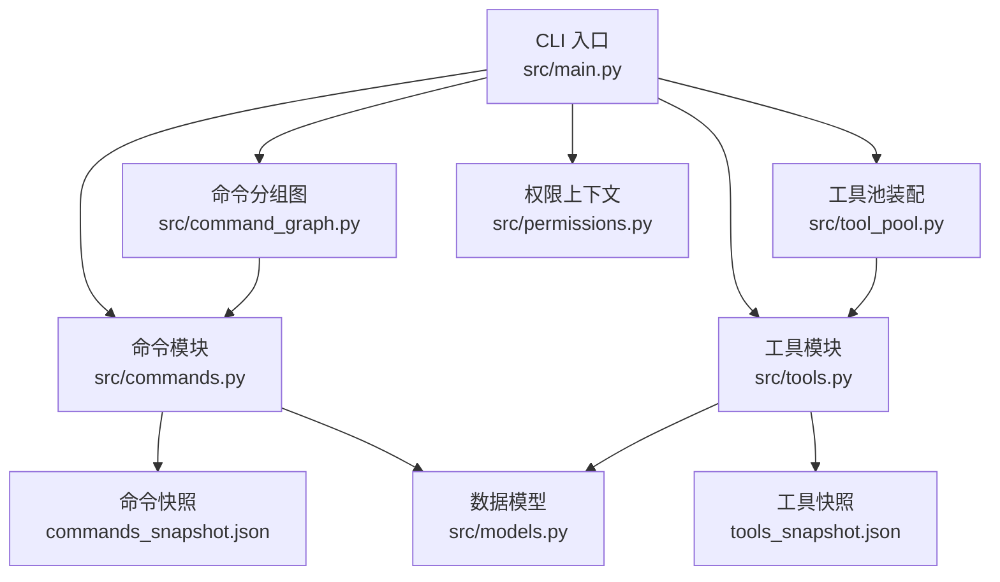
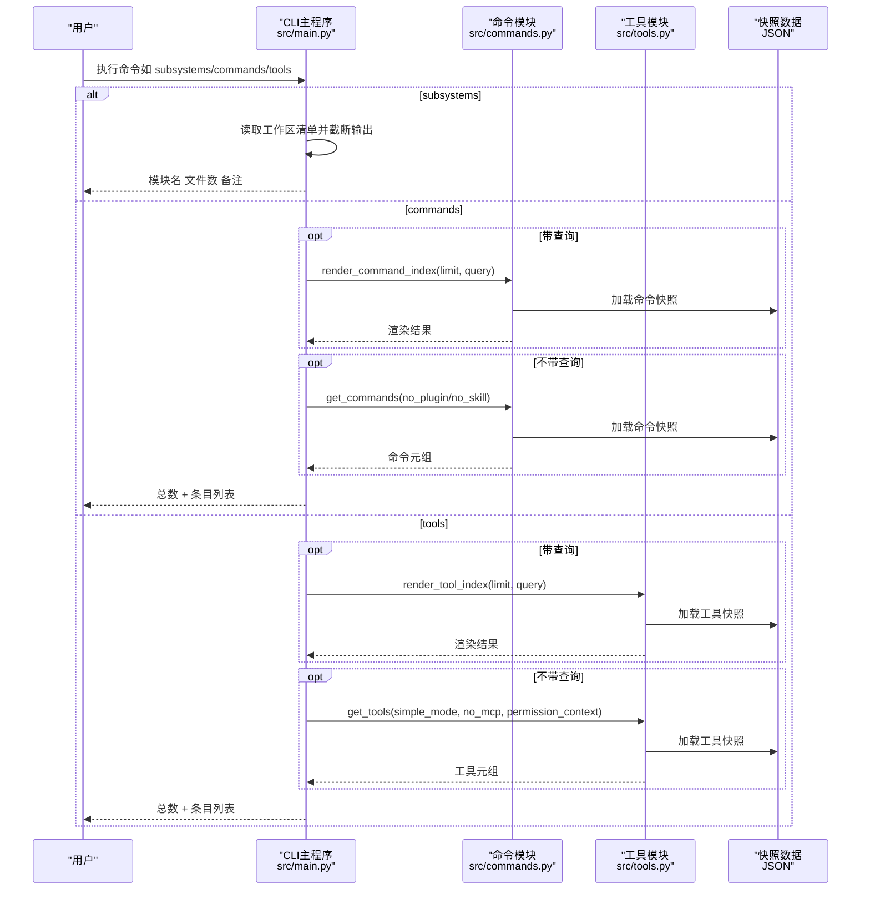
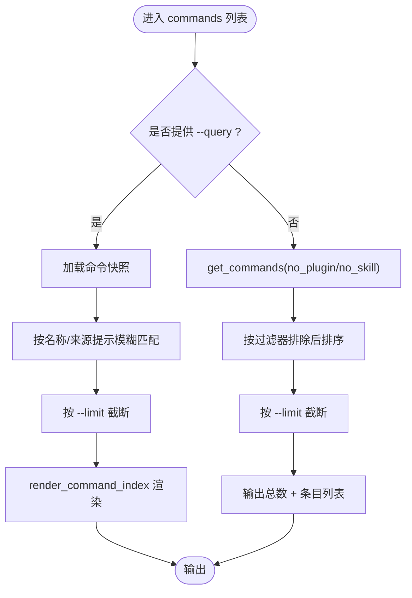
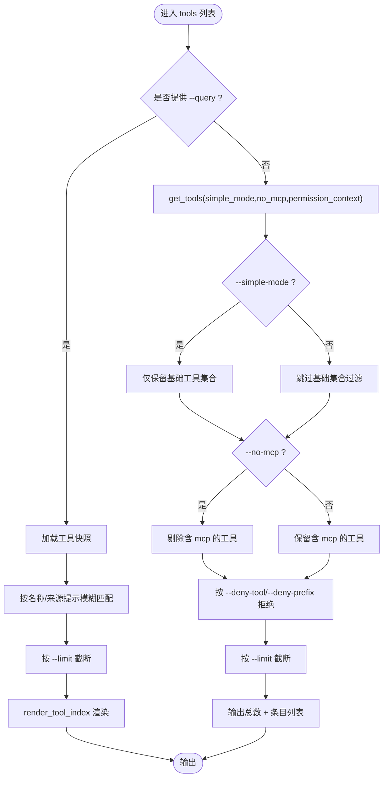
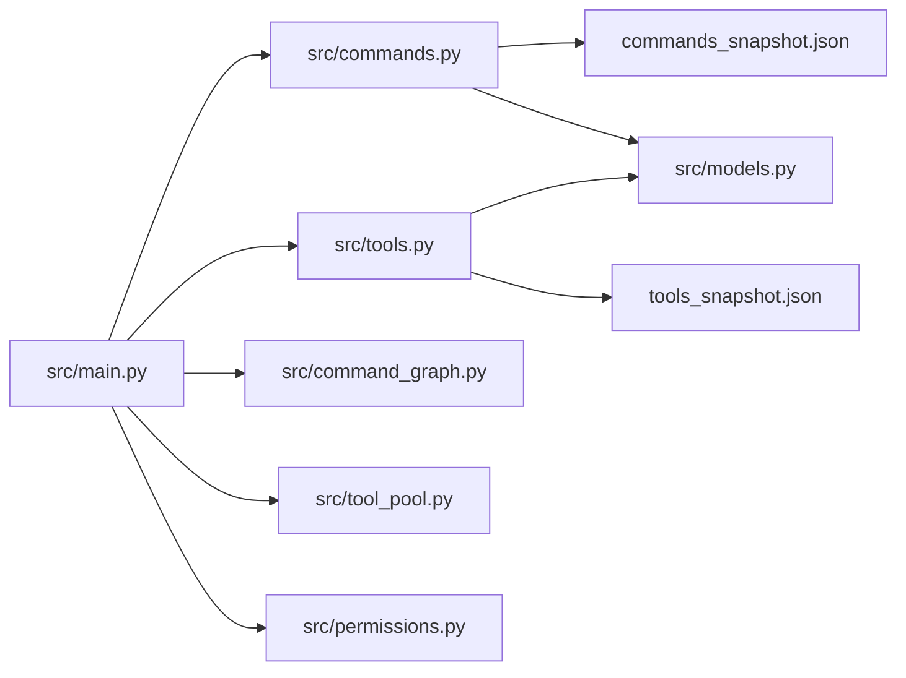

# 列表命令

<cite>
**本文引用的文件**
- [src/main.py](file://src/main.py)
- [src/commands.py](file://src/commands.py)
- [src/command_graph.py](file://src/command_graph.py)
- [src/tools.py](file://src/tools.py)
- [src/tool_pool.py](file://src/tool_pool.py)
- [src/permissions.py](file://src/permissions.py)
- [src/models.py](file://src/models.py)
- [src/port_manifest.py](file://src/port_manifest.py)
- [src/reference_data/commands_snapshot.json](file://src/reference_data/commands_snapshot.json)
- [src/reference_data/tools_snapshot.json](file://src/reference_data/tools_snapshot.json)
- [README.md](file://README.md)
</cite>

## 目录
1. [简介](#简介)
2. [项目结构](#项目结构)
3. [核心组件](#核心组件)
4. [架构总览](#架构总览)
5. [详细组件分析](#详细组件分析)
6. [依赖分析](#依赖分析)
7. [性能考虑](#性能考虑)
8. [故障排查指南](#故障排查指南)
9. [结论](#结论)
10. [附录](#附录)

## 简介
本文件聚焦 CLAW 项目的“列表命令”，系统性说明以下能力：
- subsystems：列出当前 Python 工作区的顶层模块（子系统）清单与统计信息
- commands：列出镜像自已归档快照的命令条目，并支持过滤、查询与输出控制
- tools：列出镜像自已归档快照的工具条目，并支持过滤、查询、简单模式与权限控制

重点覆盖：
- 各命令的过滤选项、查询参数与输出格式
- 参数详解：--limit、--query、--simple-mode、--no-plugin-commands、--no-skill-commands、--no-mcp、--deny-tool、--deny-prefix
- 使用示例：覆盖常见查询场景
- 在项目导航与内容探索中的应用

## 项目结构
与列表命令直接相关的模块与数据源如下：
- CLI 入口与参数解析：src/main.py
- 命令与工具元数据加载与筛选：src/commands.py、src/tools.py
- 命令分组视图：src/command_graph.py
- 工具池装配与视图：src/tool_pool.py
- 权限上下文：src/permissions.py
- 数据模型：src/models.py
- 工作区清单：src/port_manifest.py
- 镜像快照数据：src/reference_data/commands_snapshot.json、src/reference_data/tools_snapshot.json

**图表来源**
- [src/main.py:21-91](file://src/main.py#L21-L91)
- [src/commands.py:13-50](file://src/commands.py#L13-L50)
- [src/tools.py:14-50](file://src/tools.py#L14-L50)
- [src/command_graph.py:9-35](file://src/command_graph.py#L9-L35)
- [src/tool_pool.py:10-38](file://src/tool_pool.py#L10-L38)
- [src/permissions.py:6-21](file://src/permissions.py#L6-L21)
- [src/models.py:6-50](file://src/models.py#L6-L50)
- [src/reference_data/commands_snapshot.json:1-20](file://src/reference_data/commands_snapshot.json#L1-L20)
- [src/reference_data/tools_snapshot.json:1-20](file://src/reference_data/tools_snapshot.json#L1-L20)

**章节来源**
- [src/main.py:21-91](file://src/main.py#L21-L91)
- [src/port_manifest.py:12-53](file://src/port_manifest.py#L12-L53)
- [README.md:112-149](file://README.md#L112-L149)

## 核心组件
- subsystems 列表
  - 功能：打印当前 Python 工作区顶层模块清单与统计
  - 关键实现：读取工作区清单并按 --limit 截断输出
  - 输出格式：每行包含模块名、文件数、备注
- commands 列表
  - 功能：列出命令镜像条目；支持查询、限制数量、排除插件/技能类命令
  - 关键实现：从快照加载、按名称/来源提示匹配、缓存与筛选
  - 输出格式：条目总数、过滤条件（可选）、条目列表（名称—来源提示）
- tools 列表
  - 功能：列出工具镜像条目；支持查询、限制数量、简单模式、MCP 过滤、权限拒绝
  - 关键实现：从快照加载、按名称/来源提示匹配、简单模式与 MCP 过滤、权限上下文拒绝
  - 输出格式：条目总数、过滤条件（可选）、条目列表（名称—来源提示）

**章节来源**
- [src/main.py:119-141](file://src/main.py#L119-L141)
- [src/commands.py:22-50](file://src/commands.py#L22-L50)
- [src/tools.py:23-50](file://src/tools.py#L23-L50)
- [src/port_manifest.py:18-27](file://src/port_manifest.py#L18-L27)

## 架构总览
下图展示列表命令在 CLI 中的调用链路与数据流：

**图表来源**
- [src/main.py:119-141](file://src/main.py#L119-L141)
- [src/commands.py:83-91](file://src/commands.py#L83-L91)
- [src/tools.py:89-97](file://src/tools.py#L89-L97)

## 详细组件分析

### subsystems 列表
- 参数
  - --limit：整数，默认 32；控制输出前 N 个模块
- 输出
  - 工作区根路径、Python 文件总数
  - 顶层模块清单：模块名、文件数、备注
- 应用场景
  - 快速概览项目规模与模块分布
  - 结合 limit 快速定位大模块或异常模块

**章节来源**
- [src/main.py:119-122](file://src/main.py#L119-L122)
- [src/port_manifest.py:18-27](file://src/port_manifest.py#L18-L27)

### commands 列表
- 参数
  - --limit：整数，默认 20；控制输出前 N 个命令
  - --query：字符串；按命令名或来源提示进行模糊匹配
  - --no-plugin-commands：布尔；排除“plugin”类命令
  - --no-skill-commands：布尔；排除“skills”类命令
- 行为
  - 若提供 --query：仅返回匹配项，按 limit 截断
  - 若未提供 --query：返回全部命令，按过滤器排除后按 limit 截断
  - 输出包含总数与可选的过滤条件说明
- 输出格式
  - “命令条目总数”
  - 可选行：“由查询过滤”及查询词
  - 条目行：- 名称 — 来源提示
- 与命令分组图的关系
  - 可通过命令分组图快速查看内置、插件类、技能类命令的分布

**图表来源**
- [src/main.py:123-131](file://src/main.py#L123-L131)
- [src/commands.py:60-72](file://src/commands.py#L60-L72)
- [src/commands.py:83-91](file://src/commands.py#L83-L91)

**章节来源**
- [src/main.py:123-131](file://src/main.py#L123-L131)
- [src/commands.py:60-72](file://src/commands.py#L60-L72)
- [src/command_graph.py:29-35](file://src/command_graph.py#L29-L35)

### tools 列表
- 参数
  - --limit：整数，默认 20；控制输出前 N 个工具
  - --query：字符串；按工具名或来源提示进行模糊匹配
  - --simple-mode：布尔；仅保留少数基础工具（如 Bash、FileRead、FileEdit）
  - --no-mcp：布尔；排除包含“mcp”的工具
  - --deny-tool：可重复；显式拒绝的工具名（大小写不敏感）
  - --deny-prefix：可重复；拒绝以指定前缀开头的工具（大小写不敏感）
- 行为
  - 若提供 --query：仅返回匹配项，按 limit 截断
  - 若未提供 --query：先按 simple-mode、no-mcp 过滤，再按权限上下文拒绝，最后按 limit 截断
- 输出格式
  - “工具条目总数”
  - 可选行：“由查询过滤”及查询词
  - 条目行：- 名称 — 来源提示

**图表来源**
- [src/main.py:132-141](file://src/main.py#L132-L141)
- [src/tools.py:62-72](file://src/tools.py#L62-L72)
- [src/tools.py:89-97](file://src/tools.py#L89-L97)
- [src/permissions.py:11-21](file://src/permissions.py#L11-L21)

**章节来源**
- [src/main.py:132-141](file://src/main.py#L132-L141)
- [src/tools.py:62-72](file://src/tools.py#L62-L72)
- [src/permissions.py:11-21](file://src/permissions.py#L11-L21)

### 命令与工具索引渲染
- commands 渲染
  - render_command_index(limit, query=None)
  - 当提供 query 时，先按模糊匹配再截断
- tools 渲染
  - render_tool_index(limit, query=None)
  - 当提供 query 时，先按模糊匹配再截断

**章节来源**
- [src/commands.py:83-91](file://src/commands.py#L83-L91)
- [src/tools.py:89-97](file://src/tools.py#L89-L97)

## 依赖分析
- CLI 与各模块的耦合
  - CLI 主程序对命令/工具模块的调用集中在参数解析后的分支处理
  - 命令/工具模块内部通过快照 JSON 提供只读数据，降低耦合
- 过滤与权限
  - tools 列表通过 ToolPermissionContext 统一拒绝策略，避免在 CLI 层分散逻辑
- 分组与聚合
  - 命令分组图用于宏观视图，工具池装配用于运行期组合

**图表来源**
- [src/main.py:21-91](file://src/main.py#L21-L91)
- [src/commands.py:13-50](file://src/commands.py#L13-L50)
- [src/tools.py:14-50](file://src/tools.py#L14-L50)
- [src/command_graph.py:9-35](file://src/command_graph.py#L9-L35)
- [src/tool_pool.py:10-38](file://src/tool_pool.py#L10-L38)
- [src/permissions.py:6-21](file://src/permissions.py#L6-L21)
- [src/models.py:6-50](file://src/models.py#L6-L50)
- [src/reference_data/commands_snapshot.json:1-20](file://src/reference_data/commands_snapshot.json#L1-L20)
- [src/reference_data/tools_snapshot.json:1-20](file://src/reference_data/tools_snapshot.json#L1-L20)

**章节来源**
- [src/main.py:21-91](file://src/main.py#L21-L91)
- [src/permissions.py:11-21](file://src/permissions.py#L11-L21)

## 性能考虑
- 缓存策略
  - 命令与工具模块均使用内存缓存加载快照，避免重复 IO
- 查询与截断
  - 模糊匹配后立即截断，减少后续处理开销
- 过滤顺序
  - tools 列表优先执行 simple-mode 与 no-mcp，再进行权限拒绝，有助于缩小候选集
- I/O 与解析
  - 快照为 JSON，一次性读取并解析，适合小中型清单

[本节为通用建议，无需特定文件引用]

## 故障排查指南
- 未知命令/工具名
  - show-command/show-tool 可用于确认镜像条目是否存在
- 查询无结果
  - 检查大小写与拼写；尝试扩大 --limit 或去掉 --query
- 权限拒绝导致工具缺失
  - 使用 --deny-tool 或 --deny-prefix 排除特定工具或前缀
- 插件/技能类命令被过滤
  - 使用 --no-plugin-commands 或 --no-skill-commands 控制显示范围

**章节来源**
- [src/main.py:186-199](file://src/main.py#L186-L199)
- [src/tools.py:56-60](file://src/tools.py#L56-L60)
- [src/commands.py:60-66](file://src/commands.py#L60-L66)

## 结论
- subsystems 提供工作区宏观视图，便于项目规模与模块分布的快速掌握
- commands 与 tools 提供镜像条目的精确检索与灵活过滤，结合查询参数与输出控制，满足多样化的导航与探索需求
- 通过 simple-mode、权限上下文与分组视图，可在复杂环境中高效聚焦目标能力

[本节为总结，无需特定文件引用]

## 附录

### 使用示例（基于命令行为与参数）
- 列出所有命令（默认前 20 个）
  - python3 -m src.main commands
- 限制数量为 10
  - python3 -m src.main commands --limit 10
- 按关键字查询命令（如“help”）
  - python3 -m src.main commands --query help
- 排除插件类命令
  - python3 -m src.main commands --no-plugin-commands
- 排除技能类命令
  - python3 -m src.main commands --no-skill-commands
- 同时排除插件与技能类命令
  - python3 -m src.main commands --no-plugin-commands --no-skill-commands
- 列出所有工具（默认前 20 个）
  - python3 -m src.main tools
- 限制工具数量为 15
  - python3 -m src.main tools --limit 15
- 按关键字查询工具（如“FileRead”）
  - python3 -m src.main tools --query FileRead
- 简单模式（仅基础工具）
  - python3 -m src.main tools --simple-mode
- 排除 MCP 工具
  - python3 -m src.main tools --no-mcp
- 拒绝特定工具或前缀
  - python3 -m src.main tools --deny-tool BashTool --deny-prefix Web
- 查看命令/工具详情
  - python3 -m src.main show-command help
  - python3 -m src.main show-tool FileReadTool

**章节来源**
- [src/main.py:123-141](file://src/main.py#L123-L141)
- [README.md:144-149](file://README.md#L144-L149)