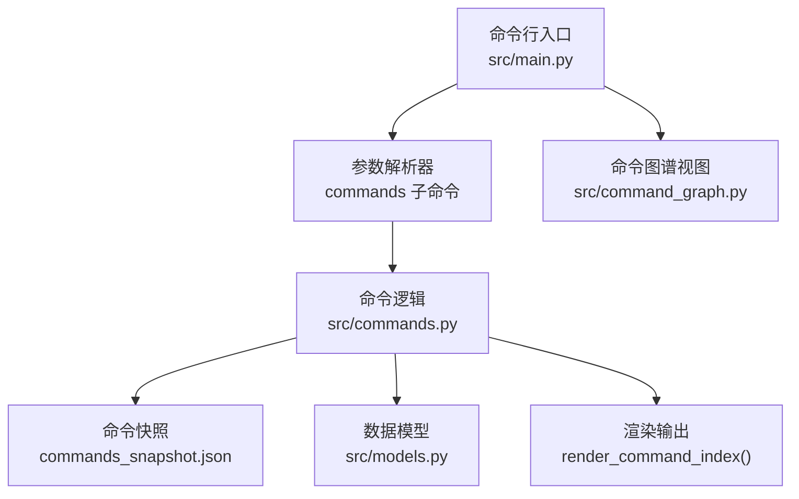
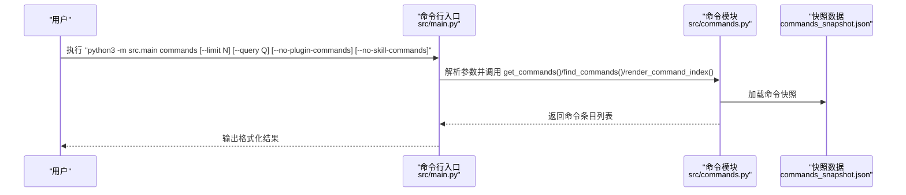
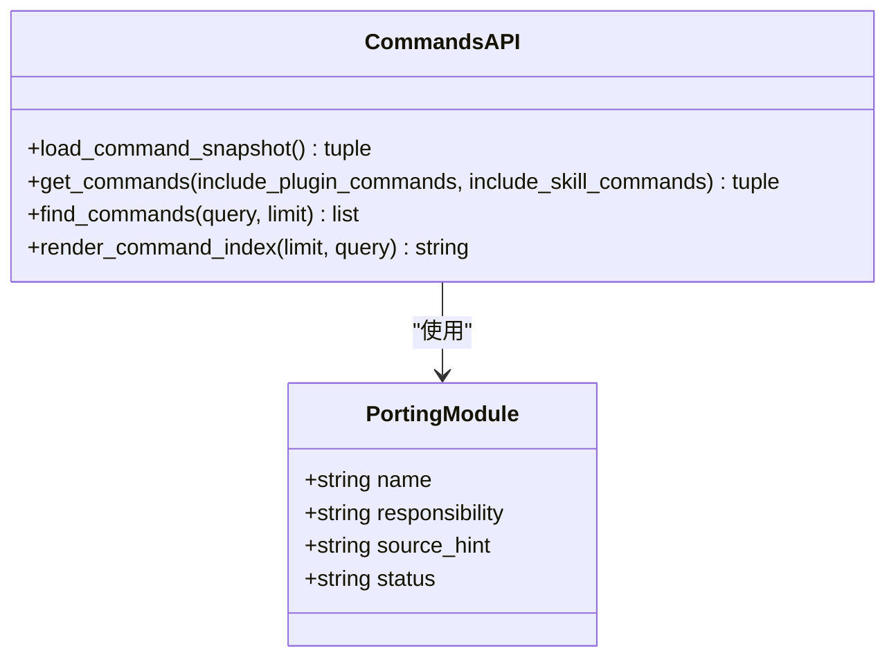
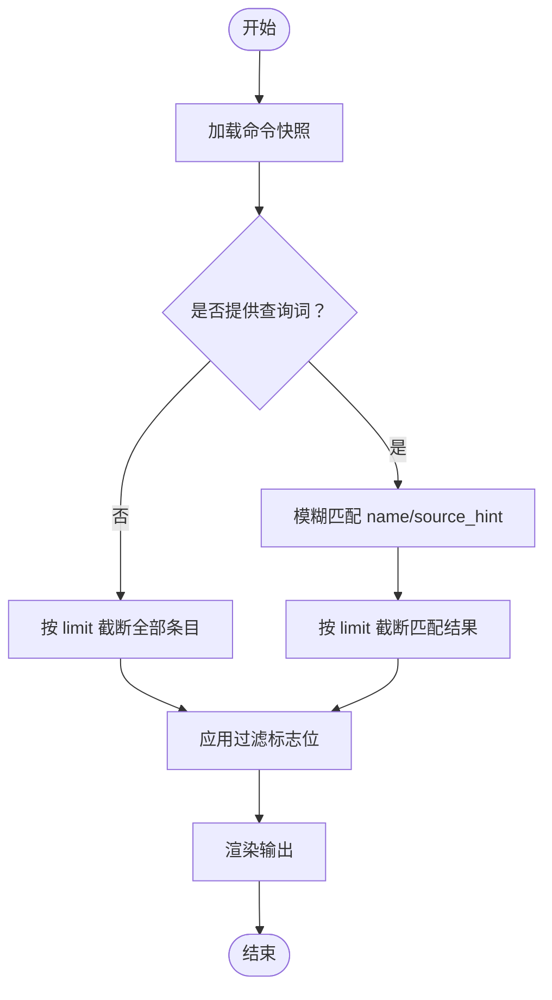
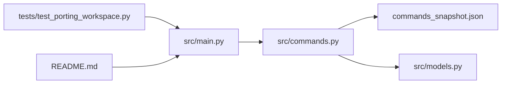

# 命令列表

<cite>
**本文引用的文件**
- [src/main.py](file://src/main.py)
- [src/commands.py](file://src/commands.py)
- [src/models.py](file://src/models.py)
- [src/command_graph.py](file://src/command_graph.py)
- [src/reference_data/commands_snapshot.json](file://src/reference_data/commands_snapshot.json)
- [tests/test_porting_workspace.py](file://tests/test_porting_workspace.py)
- [README.md](file://README.md)
</cite>

## 目录
1. [简介](#简介)
2. [项目结构](#项目结构)
3. [核心组件](#核心组件)
4. [架构总览](#架构总览)
5. [详细组件分析](#详细组件分析)
6. [依赖分析](#依赖分析)
7. [性能考虑](#性能考虑)
8. [故障排查指南](#故障排查指南)
9. [结论](#结论)
10. [附录：使用示例与参数详解](#附录使用示例与参数详解)

## 简介
“命令列表”是用于探索与导航镜像命令库存的子命令。它从归档快照中加载命令条目，支持按名称与来源提示进行模糊查询，并可限制输出数量；同时提供对“插件命令”与“技能命令”的过滤能力，帮助用户聚焦到目标命令集合。该命令在命令系统的探索与导航中扮演“入口级”角色：先看到有哪些可用命令，再决定如何进一步筛选或执行。

## 项目结构
围绕“命令列表”的相关实现主要分布在以下模块：
- CLI 参数解析与分发：src/main.py
- 命令数据访问与渲染：src/commands.py
- 数据模型：src/models.py
- 命令分类视图（内置/插件/技能）：src/command_graph.py
- 命令快照数据：src/reference_data/commands_snapshot.json
- 测试用例与示例：tests/test_porting_workspace.py、README.md

图表来源
- [src/main.py:34-38](file://src/main.py#L34-L38)
- [src/commands.py:60-90](file://src/commands.py#L60-L90)
- [src/reference_data/commands_snapshot.json:1-200](file://src/reference_data/commands_snapshot.json#L1-L200)
- [src/models.py:14-20](file://src/models.py#L14-L20)
- [src/command_graph.py:29-34](file://src/command_graph.py#L29-L34)

章节来源
- [src/main.py:34-38](file://src/main.py#L34-L38)
- [src/commands.py:60-90](file://src/commands.py#L60-L90)
- [src/models.py:14-20](file://src/models.py#L14-L20)
- [src/command_graph.py:29-34](file://src/command_graph.py#L29-L34)
- [src/reference_data/commands_snapshot.json:1-200](file://src/reference_data/commands_snapshot.json#L1-L200)

## 核心组件
- 命令条目模型
  - PortingModule：包含 name、responsibility、source_hint、status 等字段，用于描述单个命令条目。
- 命令数据访问
  - load_command_snapshot：从 JSON 快照加载命令条目，构建只读元组。
  - get_commands：根据是否排除“插件命令”“技能命令”返回过滤后的命令集合。
  - find_commands：基于查询词进行模糊匹配并限制数量。
  - render_command_index：生成人类可读的命令列表输出。
- CLI 集成
  - 在主入口中注册 commands 子命令，解析 --limit、--query、--no-plugin-commands、--no-skill-commands，并调用上述函数完成渲染。

章节来源
- [src/models.py:14-20](file://src/models.py#L14-L20)
- [src/commands.py:22-36](file://src/commands.py#L22-L36)
- [src/commands.py:60-90](file://src/commands.py#L60-L90)
- [src/main.py:34-38](file://src/main.py#L34-L38)

## 架构总览
“命令列表”工作流从 CLI 进入，经过参数解析后调用命令模块，最终以统一格式输出。查询与过滤逻辑集中在命令模块内，渲染逻辑负责输出格式化文本。

图表来源
- [src/main.py:123-131](file://src/main.py#L123-L131)
- [src/commands.py:60-90](file://src/commands.py#L60-L90)
- [src/reference_data/commands_snapshot.json:1-200](file://src/reference_data/commands_snapshot.json#L1-L200)

## 详细组件分析

### 命令条目模型与快照
- 模型定义
  - PortingModule：用于承载命令条目的名称、职责说明与来源提示等信息。
- 快照加载
  - 通过 JSON 文件加载命令条目，构建不可变元组，供后续查询与渲染使用。
- 查询与过滤
  - find_commands：对 name 与 source_hint 进行不区分大小写的包含匹配，并截断至 limit。
  - get_commands：可选择剔除“插件命令”“技能命令”，实现二八开的视角切换。

图表来源
- [src/models.py:14-20](file://src/models.py#L14-L20)
- [src/commands.py:22-36](file://src/commands.py#L22-L36)
- [src/commands.py:60-90](file://src/commands.py#L60-L90)

章节来源
- [src/models.py:14-20](file://src/models.py#L14-L20)
- [src/commands.py:22-36](file://src/commands.py#L22-L36)
- [src/commands.py:60-90](file://src/commands.py#L60-L90)

### 查询过滤机制
- 模糊查询
  - find_commands 将查询词转为小写，分别在 name 与 source_hint 中进行包含匹配，确保覆盖“名称关键词”和“来源关键词”两类场景。
- 数量限制
  - 通过 limit 控制输出上限，默认值由 CLI 注册时指定。
- 插件命令与技能命令过滤
  - get_commands 依据 source_hint 是否包含“plugin”或“skills”进行剔除，从而得到“仅内置命令”“仅插件命令”“仅技能命令”等不同视角。

图表来源
- [src/commands.py:69-72](file://src/commands.py#L69-L72)
- [src/commands.py:60-66](file://src/commands.py#L60-L66)
- [src/commands.py:83-90](file://src/commands.py#L83-L90)

章节来源
- [src/commands.py:60-90](file://src/commands.py#L60-L90)

### 命令条目显示格式
- 输出行格式
  - 每条命令以“- 名称 — 来源提示”的形式呈现，便于快速识别命令名与来源路径。
- 元信息提示
  - 渲染前会输出“命令总数”以及“查询词”（若提供），帮助用户理解当前视图规模与筛选条件。

章节来源
- [src/commands.py:83-90](file://src/commands.py#L83-L90)

### 插件命令、技能命令与内置命令的区别
- 内置命令
  - 来源提示中不包含“plugin”或“skills”的命令，通常代表直接集成在基础系统中的命令。
- 插件命令
  - 来源提示中包含“plugin”的命令，来自外部插件生态。
- 技能命令
  - 来源提示中包含“skills”的命令，来自技能体系。
- 图谱视图
  - build_command_graph 提供“内置/插件/技能”三类命令的统计与 Markdown 展示，便于宏观把握命令构成。

章节来源
- [src/command_graph.py:29-34](file://src/command_graph.py#L29-L34)
- [src/commands.py:60-66](file://src/commands.py#L60-L66)

## 依赖分析
- 组件耦合
  - CLI 对命令模块存在直接调用关系；命令模块依赖快照数据与模型定义。
- 外部依赖
  - JSON 快照文件提供稳定的命令清单来源；测试用例验证 CLI 行为与输出格式。
- 可能的循环依赖
  - 当前模块间为单向依赖，未见循环导入迹象。

图表来源
- [src/main.py:34-38](file://src/main.py#L34-L38)
- [src/commands.py:22-36](file://src/commands.py#L22-L36)
- [src/reference_data/commands_snapshot.json:1-200](file://src/reference_data/commands_snapshot.json#L1-L200)
- [src/models.py:14-20](file://src/models.py#L14-L20)
- [tests/test_porting_workspace.py:58-71](file://tests/test_porting_workspace.py#L58-L71)
- [README.md:146-149](file://README.md#L146-L149)

章节来源
- [src/main.py:34-38](file://src/main.py#L34-L38)
- [src/commands.py:22-36](file://src/commands.py#L22-L36)
- [src/reference_data/commands_snapshot.json:1-200](file://src/reference_data/commands_snapshot.json#L1-L200)
- [src/models.py:14-20](file://src/models.py#L14-L20)
- [tests/test_porting_workspace.py:58-71](file://tests/test_porting_workspace.py#L58-L71)
- [README.md:146-149](file://README.md#L146-L149)

## 性能考虑
- 缓存策略
  - load_command_snapshot 与 built_in_command_names 使用缓存装饰器，避免重复 IO 与计算，提升多次查询的响应速度。
- 查询复杂度
  - find_commands 的匹配为线性扫描，时间复杂度 O(N)，其中 N 为命令总数；配合 limit 可有效控制输出规模。
- 过滤成本
  - get_commands 的过滤为列表推导，整体仍为 O(N)，但可显著减少后续渲染的数据量。
- I/O 成本
  - 快照文件一次性读取并缓存，渲染阶段仅做内存操作，I/O 开销极低。

章节来源
- [src/commands.py:22-36](file://src/commands.py#L22-L36)
- [src/commands.py:69-72](file://src/commands.py#L69-L72)
- [src/commands.py:60-66](file://src/commands.py#L60-L66)

## 故障排查指南
- 未知命令名
  - 若通过其他子命令尝试执行不存在的命令，将返回错误消息；请先使用“命令列表”确认命令是否存在。
- 查询无结果
  - 若查询词过于严格或与命令名称/来源提示不匹配，可能无结果；建议放宽查询词或检查拼写。
- 输出为空
  - 当同时开启“排除插件命令”和“排除技能命令”且内置命令较少时，可能出现空输出；请调整过滤标志位。
- 权限或环境问题
  - 确认运行环境具备读取快照文件的权限；如需在受限环境中运行，请确保工作目录正确。

章节来源
- [src/commands.py:75-80](file://src/commands.py#L75-L80)
- [src/main.py:123-131](file://src/main.py#L123-L131)

## 结论
“命令列表”为命令系统的探索与导航提供了清晰、可控的入口。通过查询词与过滤标志位，用户可以快速聚焦到所需的命令集合；通过统一的输出格式，用户能够直观地识别命令名称与来源。结合命令图谱视图，用户可以更全面地理解命令构成，为进一步的路由、执行与调试奠定基础。

## 附录：使用示例与参数详解

### 参数说明
- --limit
  - 类型：整数；默认值：由 CLI 注册时设定
  - 作用：限制输出的命令条目数量
- --query
  - 类型：字符串
  - 作用：对命令名称与来源提示进行模糊匹配
- --no-plugin-commands
  - 类型：布尔开关；默认关闭
  - 作用：排除来源提示中包含“plugin”的命令
- --no-skill-commands
  - 类型：布尔开关；默认关闭
  - 作用：排除来源提示中包含“skills”的命令

章节来源
- [src/main.py:34-38](file://src/main.py#L34-L38)
- [src/commands.py:60-66](file://src/commands.py#L60-L66)
- [src/commands.py:69-72](file://src/commands.py#L69-L72)

### 常见使用示例
- 列出前 10 个命令
  - 示例命令：python3 -m src.main commands --limit 10
  - 说明：不带查询词时，按默认顺序输出前 N 个命令
- 按名称或来源提示查询
  - 示例命令：python3 -m src.main commands --limit 10 --query review
  - 说明：在名称与来源提示中查找包含“review”的命令
- 排除插件命令
  - 示例命令：python3 -m src.main commands --limit 5 --no-plugin-commands
  - 说明：仅显示非插件类命令
- 排除技能命令
  - 示例命令：python3 -m src.main commands --limit 5 --no-skill-commands
  - 说明：仅显示非技能类命令
- 同时排除插件与技能命令
  - 示例命令：python3 -m src.main commands --limit 5 --no-plugin-commands --no-skill-commands
  - 说明：仅显示内置命令
- 与命令图谱结合
  - 示例命令：python3 -m src.main command-graph
  - 说明：查看内置/插件/技能三类命令的数量分布

章节来源
- [README.md:146-149](file://README.md#L146-L149)
- [tests/test_porting_workspace.py:58-71](file://tests/test_porting_workspace.py#L58-L71)
- [tests/test_porting_workspace.py:146-160](file://tests/test_porting_workspace.py#L146-L160)
- [src/command_graph.py:18-26](file://src/command_graph.py#L18-L26)