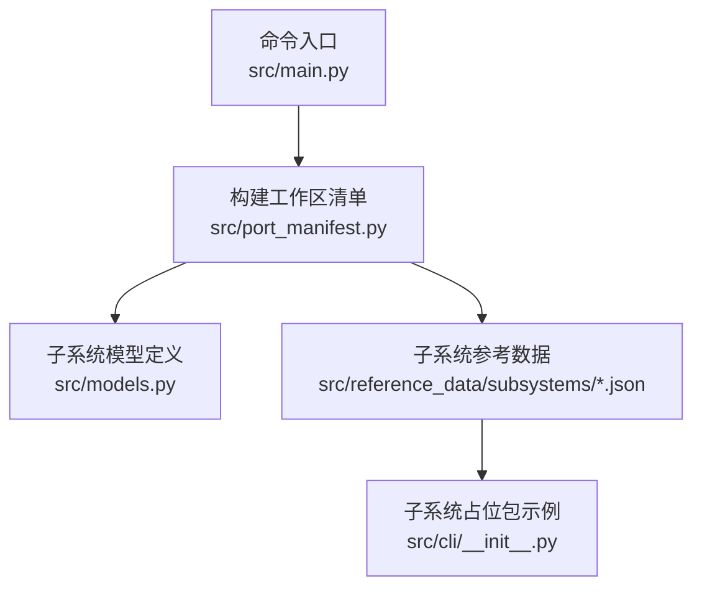
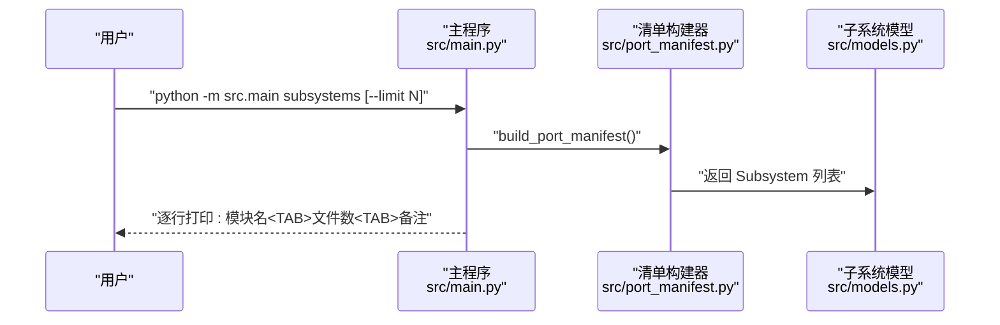
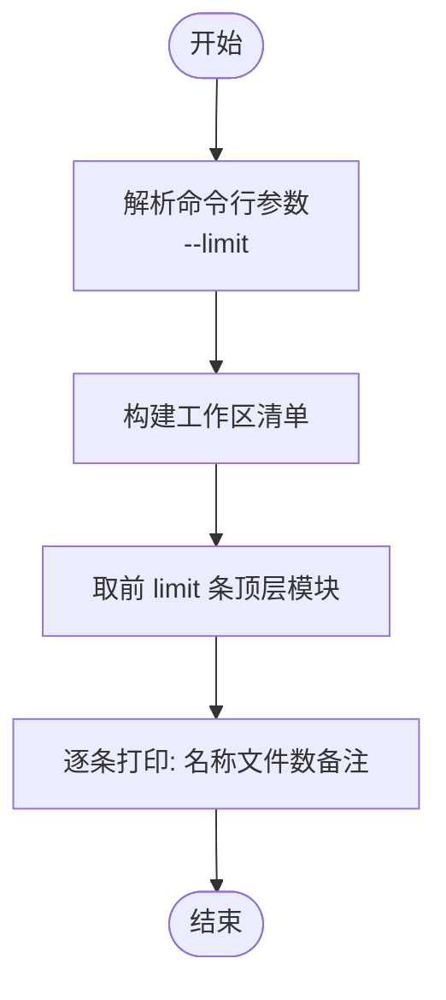
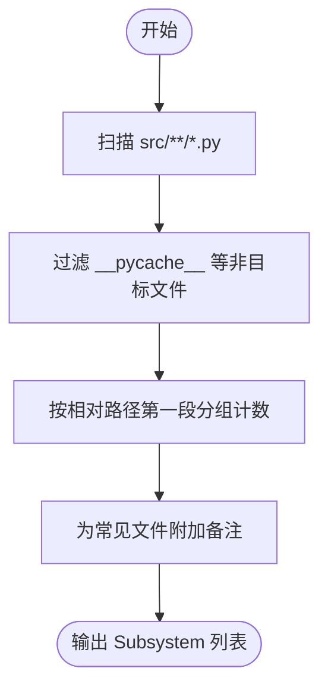

# 子系统列表

<cite>
**本文引用的文件**
- [src/main.py](file://src/main.py)
- [src/port_manifest.py](file://src/port_manifest.py)
- [src/models.py](file://src/models.py)
- [src/cli/__init__.py](file://src/cli/__init__.py)
- [src/reference_data/subsystems/cli.json](file://src/reference_data/subsystems/cli.json)
- [src/reference_data/subsystems/components.json](file://src/reference_data/subsystems/components.json)
- [src/reference_data/subsystems/utils.json](file://src/reference_data/subsystems/utils.json)
- [src/reference_data/subsystems/services.json](file://src/reference_data/subsystems/services.json)
</cite>

## 目录
1. [简介](#简介)
2. [项目结构](#项目结构)
3. [核心组件](#核心组件)
4. [架构总览](#架构总览)
5. [详细组件分析](#详细组件分析)
6. [依赖关系分析](#依赖关系分析)
7. [性能考量](#性能考量)
8. [故障排查指南](#故障排查指南)
9. [结论](#结论)
10. [附录：使用示例与参数说明](#附录使用示例与参数说明)

## 简介
“子系统列表”命令用于快速浏览当前 Python 工作区中的顶层模块（即位于 src 根目录一级的包或模块），并以简洁表格形式展示每个模块的名称、文件数量以及简要备注。该命令常用于项目结构探索、工作区概览与迁移进度可视化，帮助开发者快速定位关键子系统、评估模块规模与职责。

## 项目结构
本仓库采用“Python 迁移工作区”的组织方式，顶层模块由扫描 src 目录下的一级路径与文件统计生成，并结合参考数据中的子系统元信息进行标注与补充。

图表来源
- [src/main.py:119-122](file://src/main.py#L119-L122)
- [src/port_manifest.py:30-52](file://src/port_manifest.py#L30-L52)
- [src/models.py:6-12](file://src/models.py#L6-L12)
- [src/cli/__init__.py:1-16](file://src/cli/__init__.py#L1-L16)

章节来源
- [src/main.py:119-122](file://src/main.py#L119-L122)
- [src/port_manifest.py:30-52](file://src/port_manifest.py#L30-L52)

## 核心组件
- 命令解析与执行
  - 在命令解析器中注册 “subsystems” 子命令，并设置默认限制参数为 32。
  - 执行时通过工作区清单获取顶层模块列表，并按 --limit 输出前 N 条记录。
- 工作区清单与顶层模块
  - 清单构建函数递归统计 src 下的 Python 文件，按一级路径分组得到模块名与文件计数。
  - 对常见文件赋予简要备注，其余模块默认为“Python port support module”。
- 数据模型
  - Subsystem 记录模块名、路径、文件数量与备注，作为输出的基础数据结构。

章节来源
- [src/main.py:31-32](file://src/main.py#L31-L32)
- [src/main.py:119-122](file://src/main.py#L119-L122)
- [src/port_manifest.py:30-52](file://src/port_manifest.py#L30-L52)
- [src/models.py:6-12](file://src/models.py#L6-L12)

## 架构总览
“子系统列表”命令的调用链路如下：

图表来源
- [src/main.py:94-122](file://src/main.py#L94-L122)
- [src/port_manifest.py:30-52](file://src/port_manifest.py#L30-L52)
- [src/models.py:6-12](file://src/models.py#L6-L12)

## 详细组件分析

### 命令解析与执行流程
- 注册子命令与参数
  - 添加 “subsystems” 子命令，支持 --limit 整型参数，默认 32。
- 执行逻辑
  - 调用清单构建函数生成 PortManifest。
  - 遍历 top_level_modules 的前 limit 条目，输出三列：模块名、文件数量、备注。

图表来源
- [src/main.py:31-32](file://src/main.py#L31-L32)
- [src/main.py:119-122](file://src/main.py#L119-L122)

章节来源
- [src/main.py:31-32](file://src/main.py#L31-L32)
- [src/main.py:119-122](file://src/main.py#L119-L122)

### 工作区清单与顶层模块统计
- 统计策略
  - 递归遍历 src 下所有 .py 文件（排除 __pycache__）。
  - 一级路径作为模块名；若文件位于根目录则以其文件名为模块名。
- 备注规则
  - 对特定文件赋予明确备注（如 CLI 入口、清单生成器等）。
  - 其余模块默认备注为“Python port support module”。

图表来源
- [src/port_manifest.py:30-52](file://src/port_manifest.py#L30-L52)

章节来源
- [src/port_manifest.py:30-52](file://src/port_manifest.py#L30-L52)

### 子系统参考数据与占位包
- 参考数据
  - src/reference_data/subsystems/*.json 提供各子系统的归档名称、包名、模块数量与示例文件列表。
- 占位包示例
  - 以 cli 子系统为例，其占位包读取对应 JSON 并导出 ARCHIVE_NAME、MODULE_COUNT、SAMPLE_FILES、PORTING_NOTE 等元信息，便于在 Python 环境中引用与展示。

图表来源
- [src/cli/__init__.py:1-16](file://src/cli/__init__.py#L1-L16)
- [src/reference_data/subsystems/cli.json:1-26](file://src/reference_data/subsystems/cli.json#L1-L26)

章节来源
- [src/cli/__init__.py:1-16](file://src/cli/__init__.py#L1-L16)
- [src/reference_data/subsystems/cli.json:1-26](file://src/reference_data/subsystems/cli.json#L1-L26)

## 依赖关系分析
- 命令层依赖清单层
  - subsystems 命令直接依赖清单构建器生成的顶层模块列表。
- 清单层依赖模型层
  - 清单层返回 Subsystem 数据结构，供命令层直接消费。
- 参考数据层辅助
  - 子系统 JSON 与占位包为迁移与展示提供额外上下文信息。

图表来源
- [src/main.py:119-122](file://src/main.py#L119-L122)
- [src/port_manifest.py:30-52](file://src/port_manifest.py#L30-L52)
- [src/models.py:6-12](file://src/models.py#L6-L12)
- [src/cli/__init__.py:1-16](file://src/cli/__init__.py#L1-L16)

章节来源
- [src/main.py:119-122](file://src/main.py#L119-L122)
- [src/port_manifest.py:30-52](file://src/port_manifest.py#L30-L52)
- [src/models.py:6-12](file://src/models.py#L6-L12)
- [src/cli/__init__.py:1-16](file://src/cli/__init__.py#L1-L16)

## 性能考量
- 文件扫描复杂度
  - 时间复杂度近似 O(F)，F 为 Python 文件总数；空间复杂度与模块数量线性相关。
- 输出切片
  - 使用切片 top_level_modules[:limit] 控制输出规模，避免大清单导致的终端溢出。
- 缓存与复用
  - 若后续扩展，可在清单构建或模型层面引入缓存机制以减少重复扫描成本。

## 故障排查指南
- 输出为空
  - 检查 src 目录是否存在 .py 文件；确认未被忽略或排除。
- 备注不准确
  - 若某模块应有特殊备注，请在清单构建处完善备注映射。
- 限制参数无效
  - 确认传入的是整数；超出模块总数时将输出全部模块。

## 结论
“子系统列表”命令通过工作区清单快速呈现顶层模块的规模与职责，是理解项目结构、评估迁移进度与进行工作区概览的重要工具。配合参考数据与占位包，可进一步丰富子系统的元信息与上下文描述。

## 附录：使用示例与参数说明

- 基本用法
  - 默认输出前 32 个顶层模块，每行包含：模块名、文件数量、备注。
- 参数说明
  - --limit N：限制输出数量为 N（整数）。当 N 大于等于顶层模块总数时，输出全部模块。
- 输出字段含义
  - 模块名：顶层模块的名称（来自 src 一级路径或文件名）。
  - 文件数量：该模块下 Python 文件的数量。
  - 备注：对该模块职责的简要说明（如 CLI 入口、清单生成器等）。
- 实际使用场景
  - 快速概览：在大型工作区中快速识别主要子系统与规模。
  - 迁移跟踪：对比不同分支或提交间的模块数量变化。
  - 结构探索：定位关键模块（如 CLI、服务层、工具集等）以便深入研究。

章节来源
- [src/main.py:31-32](file://src/main.py#L31-L32)
- [src/main.py:119-122](file://src/main.py#L119-L122)
- [src/port_manifest.py:38-47](file://src/port_manifest.py#L38-L47)