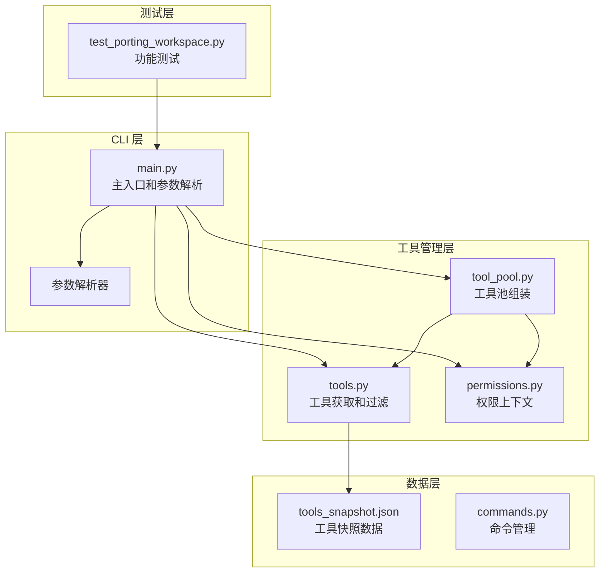
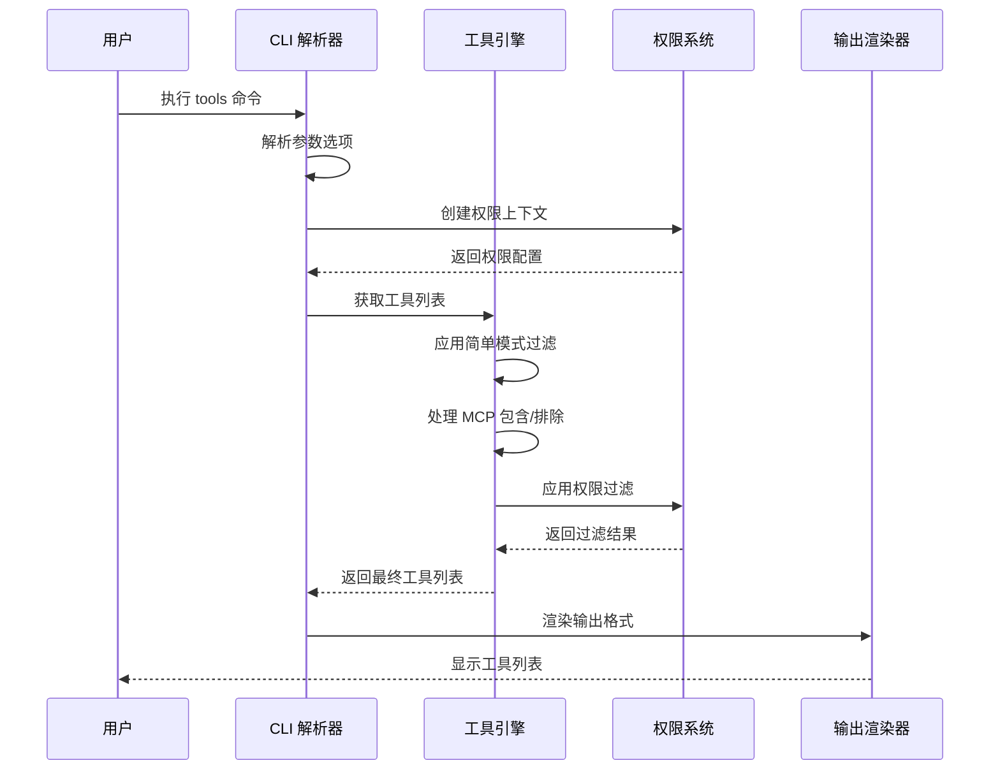
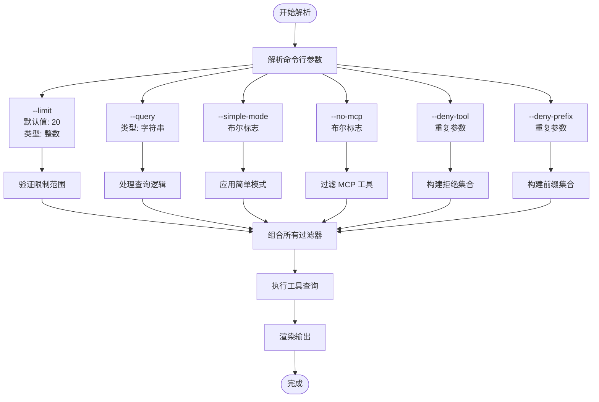
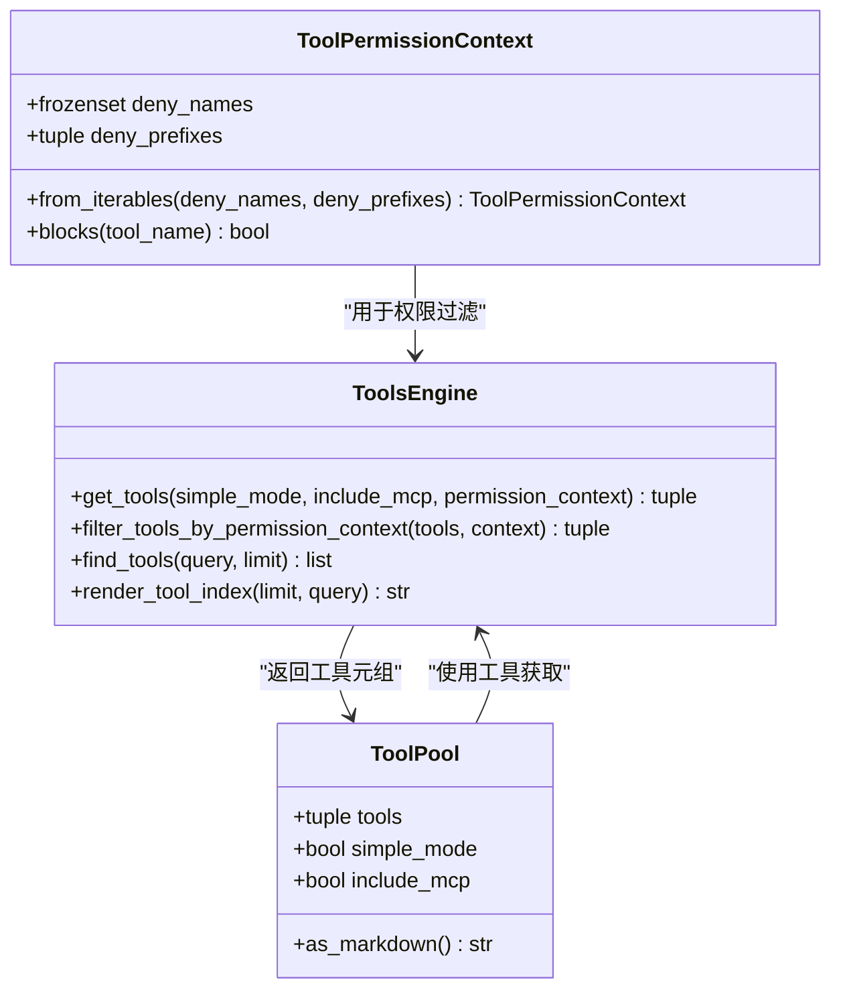
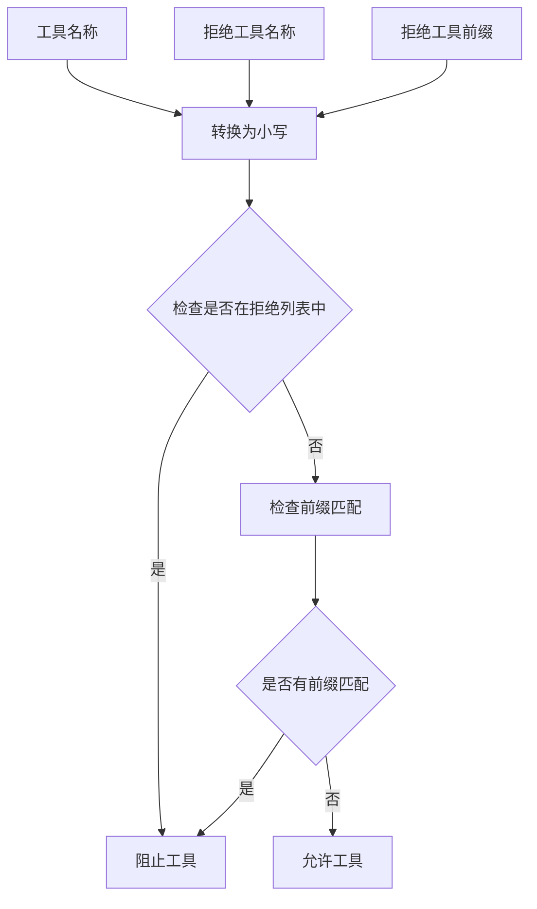
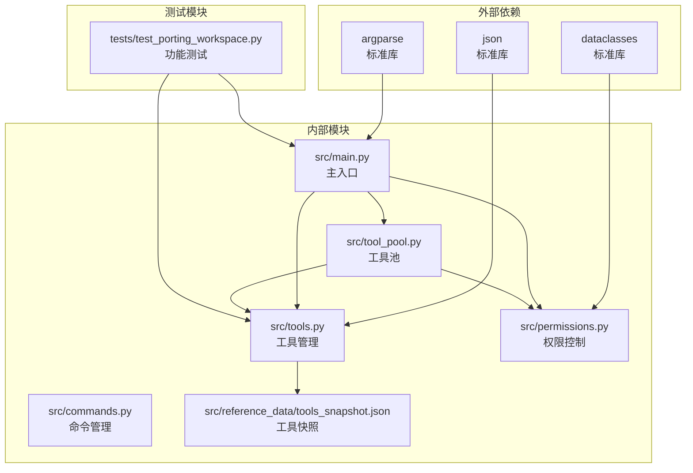
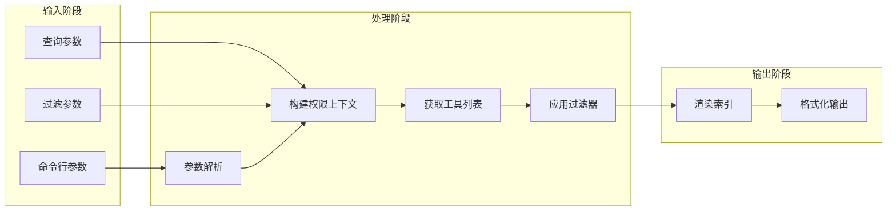

# 工具列表

<cite>
**本文档引用的文件**
- [main.py](file://src/main.py)
- [tools.py](file://src/tools.py)
- [permissions.py](file://src/permissions.py)
- [tool_pool.py](file://src/tool_pool.py)
- [commands.py](file://src/commands.py)
- [test_porting_workspace.py](file://tests/test_porting_workspace.py)
- [tools_snapshot.json](file://src/reference_data/tools_snapshot.json)
</cite>

## 目录
1. [简介](#简介)
2. [项目结构](#项目结构)
3. [核心组件](#核心组件)
4. [架构概览](#架构概览)
5. [详细组件分析](#详细组件分析)
6. [依赖关系分析](#依赖关系分析)
7. [性能考虑](#性能考虑)
8. [故障排除指南](#故障排除指南)
9. [结论](#结论)

## 简介

工具列表命令（`tools`）是 Claude Code 重写工作区中的一个关键管理工具，用于展示和管理系统中可用的工具条目。该命令提供了强大的过滤和权限控制功能，支持多种显示模式和查询选项，帮助用户有效地浏览和管理工具资源。

该命令的核心功能包括：
- 展示所有镜像化的工具条目
- 支持基于查询的精确筛选
- 提供简单模式和 MCP 支持的灵活切换
- 实施细粒度的权限控制和工具拒绝机制
- 支持限制输出数量的分页显示

## 项目结构

工具列表功能涉及以下核心文件和模块：



**图表来源**
- [main.py:21-91](file://src/main.py#L21-L91)
- [tools.py:14-97](file://src/tools.py#L14-L97)
- [permissions.py:6-21](file://src/permissions.py#L6-L21)

**章节来源**
- [main.py:1-214](file://src/main.py#L1-L214)
- [tools.py:1-97](file://src/tools.py#L1-L97)
- [permissions.py:1-21](file://src/permissions.py#L1-L21)

## 核心组件

### 主要功能模块

工具列表命令由以下核心组件构成：

#### 1. 参数解析器
负责定义和解析 `tools` 命令的所有参数选项，包括：
- `--limit`: 限制输出数量
- `--query`: 搜索查询字符串
- `--simple-mode`: 启用简单模式
- `--no-mcp`: 禁用 MCP 支持
- `--deny-tool`: 指定拒绝的工具名称
- `--deny-prefix`: 指定拒绝的工具前缀

#### 2. 工具获取引擎
提供工具的检索、过滤和排序功能，支持：
- 基于简单模式的工具集限制
- MCP 工具的可选包含/排除
- 权限上下文驱动的访问控制
- 查询驱动的精确匹配

#### 3. 权限控制系统
实现细粒度的工具访问控制，通过：
- 工具名称黑名单
- 工具名称前缀过滤
- 大小写不敏感的匹配逻辑

#### 4. 输出渲染器
负责将工具信息格式化为用户友好的显示格式，包括：
- 工具名称和来源提示
- 统计信息和过滤状态
- 分页显示支持

**章节来源**
- [main.py:40-46](file://src/main.py#L40-L46)
- [tools.py:62-72](file://src/tools.py#L62-L72)
- [permissions.py:11-21](file://src/permissions.py#L11-L21)

## 架构概览

工具列表命令采用分层架构设计，确保功能的模块化和可维护性：



**图表来源**
- [main.py:132-141](file://src/main.py#L132-L141)
- [tools.py:62-72](file://src/tools.py#L62-L72)
- [permissions.py:11-21](file://src/permissions.py#L11-L21)

## 详细组件分析

### 参数解析和处理

#### 命令行参数定义

工具列表命令的参数定义位于主入口文件中，提供了完整的参数配置选项：



**图表来源**
- [main.py:40-46](file://src/main.py#L40-L46)

#### 参数处理流程

参数解析后，系统按照以下流程处理各个选项：

1. **查询模式优先级**: 当提供 `--query` 参数时，系统会优先使用查询模式，忽略其他过滤选项
2. **权限上下文构建**: 使用 `--deny-tool` 和 `--deny-prefix` 参数构建权限上下文
3. **工具获取**: 调用工具获取函数，应用所有过滤条件
4. **输出渲染**: 格式化并显示工具列表

**章节来源**
- [main.py:132-141](file://src/main.py#L132-L141)
- [main.py:40-46](file://src/main.py#L40-L46)

### 工具获取和过滤机制

#### 工具获取引擎

工具获取引擎实现了多层过滤机制，确保返回的工具列表符合用户的特定需求：



**图表来源**
- [permissions.py:6-21](file://src/permissions.py#L6-L21)
- [tools.py:62-72](file://src/tools.py#L62-L72)
- [tool_pool.py:10-37](file://src/tool_pool.py#L10-L37)

#### 过滤层次结构

工具过滤按以下顺序应用：

1. **基础工具集**: 从工具快照数据加载所有可用工具
2. **简单模式过滤**: 如果启用简单模式，仅保留预定义的核心工具
3. **MCP 过滤**: 根据 `--no-mcp` 选项决定是否包含 MCP 工具
4. **权限过滤**: 应用工具名称和前缀拒绝列表

**章节来源**
- [tools.py:62-72](file://src/tools.py#L62-L72)
- [permissions.py:18-21](file://src/permissions.py#L18-L21)

### 权限控制系统

#### 工具拒绝机制

权限控制系统提供了灵活的工具访问控制机制：



**图表来源**
- [permissions.py:18-21](file://src/permissions.py#L18-L21)

#### 权限上下文构建

权限上下文通过 `from_iterables` 方法构建，支持：
- 工具名称的大小写不敏感匹配
- 前缀匹配的灵活控制
- 可重复参数的批量处理

**章节来源**
- [permissions.py:11-21](file://src/permissions.py#L11-L21)

### 输出渲染和显示格式

#### 工具条目显示格式

工具列表采用统一的显示格式，提供清晰的信息组织：

```
Tool entries: [总数]

[过滤条件信息]

- [工具名称] — [来源提示]
- [工具名称] — [来源提示]
- [工具名称] — [来源提示]
```

#### 显示特性

1. **统计信息**: 显示工具总数和当前过滤状态
2. **过滤标识**: 当使用查询或权限过滤时显示相应的标识
3. **统一格式**: 所有条目使用一致的 "名称 — 来源" 格式
4. **分页支持**: 通过 `--limit` 参数控制输出数量

**章节来源**
- [tools.py:89-97](file://src/tools.py#L89-L97)

## 依赖关系分析

### 组件间依赖关系

工具列表命令的依赖关系体现了清晰的分层架构：



**图表来源**
- [main.py:1-18](file://src/main.py#L1-L18)
- [tools.py:1-9](file://src/tools.py#L1-L9)
- [permissions.py:1-3](file://src/permissions.py#L1-L3)

### 数据流分析

工具列表命令的数据流展示了从输入到输出的完整处理过程：



**图表来源**
- [main.py:132-141](file://src/main.py#L132-L141)
- [tools.py:62-72](file://src/tools.py#L62-L72)

**章节来源**
- [main.py:1-214](file://src/main.py#L1-L214)
- [tools.py:1-97](file://src/tools.py#L1-L97)

## 性能考虑

### 内存优化策略

工具列表命令采用了多项内存优化措施：

1. **缓存机制**: 工具快照数据使用 LRU 缓存，避免重复读取
2. **不可变数据结构**: 使用 `frozenset` 和 `tuple` 确保数据不可变性
3. **延迟计算**: 权限过滤在最后阶段应用，减少不必要的计算

### 时间复杂度分析

- **工具获取**: O(n)，其中 n 是工具总数
- **查询过滤**: O(n*m)，其中 m 是查询匹配操作
- **权限过滤**: O(k)，其中 k 是工具数量
- **整体复杂度**: O(n*m + k)

### 优化建议

1. **批量处理**: 对于大量工具的场景，考虑分批处理
2. **索引优化**: 为常用查询建立索引
3. **缓存策略**: 根据使用频率调整缓存大小

## 故障排除指南

### 常见问题和解决方案

#### 1. 工具列表为空

**症状**: 执行 `tools` 命令后显示空列表

**可能原因**:
- 简单模式下仅显示核心工具，但核心工具被拒绝
- MCP 工具被禁用且没有其他工具
- 权限过滤过于严格

**解决方法**:
```bash
# 检查当前设置
python -m src.main tools --limit 50

# 禁用简单模式
python -m src.main tools --no-simple-mode

# 启用 MCP 工具
python -m src.main tools --no-mcp

# 移除权限限制
python -m src.main tools
```

#### 2. 查询结果不符合预期

**症状**: 使用 `--query` 参数后结果不正确

**解决方法**:
- 确认查询字符串的大小写
- 检查查询字符串是否包含特殊字符
- 验证查询字符串是否为目标工具名称的一部分

#### 3. 权限过滤问题

**症状**: 工具被意外拒绝

**解决方法**:
```bash
# 检查拒绝列表
python -m src.main tools --deny-tool BashTool --deny-prefix mcp

# 排除特定工具
python -m src.main tools --deny-tool MCPTool

# 排除工具前缀
python -m src.main tools --deny-prefix mcp --deny-prefix file
```

**章节来源**
- [test_porting_workspace.py:176-184](file://tests/test_porting_workspace.py#L176-L184)

### 调试技巧

1. **逐步调试**: 使用 `--limit` 参数逐步增加显示数量
2. **参数组合**: 测试不同参数组合的效果
3. **权限验证**: 使用简单的权限设置进行测试

## 结论

工具列表命令作为 Claude Code 重写工作区的重要管理工具，提供了强大而灵活的工具管理功能。其设计体现了以下关键优势：

### 核心价值

1. **灵活性**: 支持多种过滤和显示模式，满足不同使用场景
2. **安全性**: 通过权限控制系统确保工具访问的安全性
3. **易用性**: 提供直观的命令行接口和清晰的输出格式
4. **可扩展性**: 模块化设计便于功能扩展和维护

### 技术特点

- **分层架构**: 清晰的职责分离和依赖管理
- **性能优化**: 缓存机制和高效的过滤算法
- **错误处理**: 完善的异常处理和用户反馈机制
- **测试覆盖**: 全面的功能测试确保稳定性

### 应用场景

工具列表命令适用于以下场景：
- 工具系统的日常管理
- 权限配置的验证和调试
- 工具选择和决策支持
- 系统审计和合规检查

通过合理使用这些功能，用户可以高效地管理和控制工具资源，确保系统的安全性和可用性。