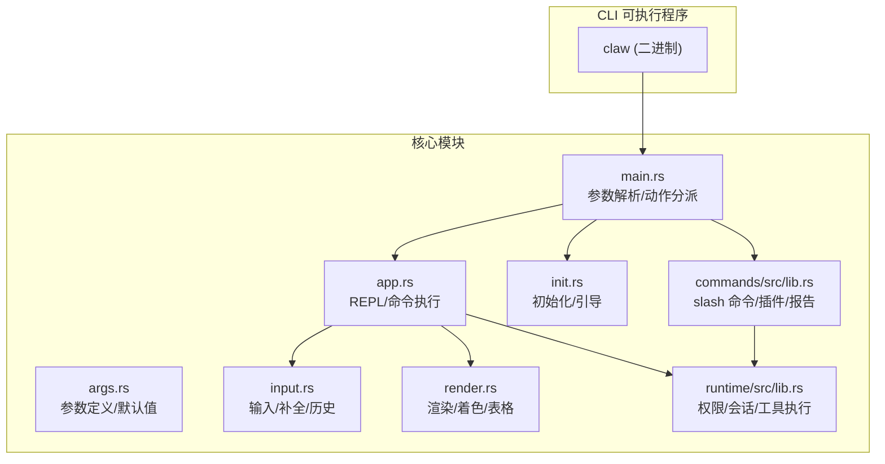
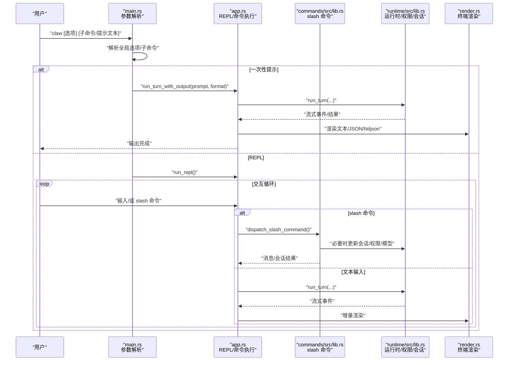
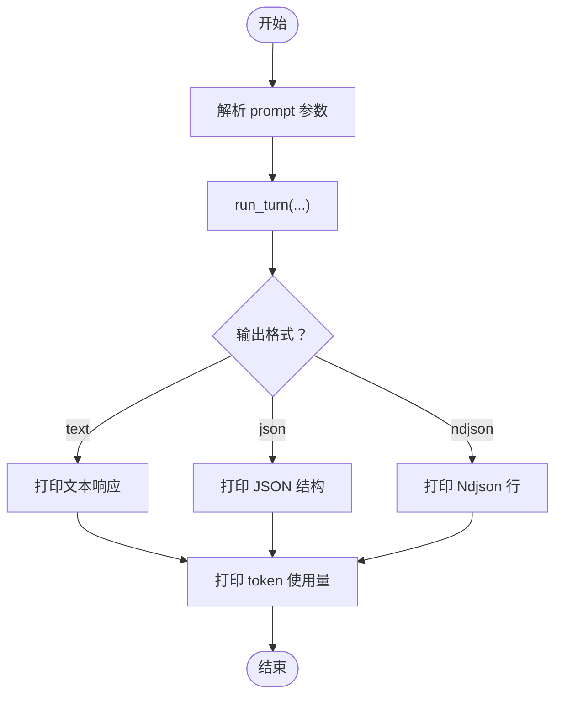
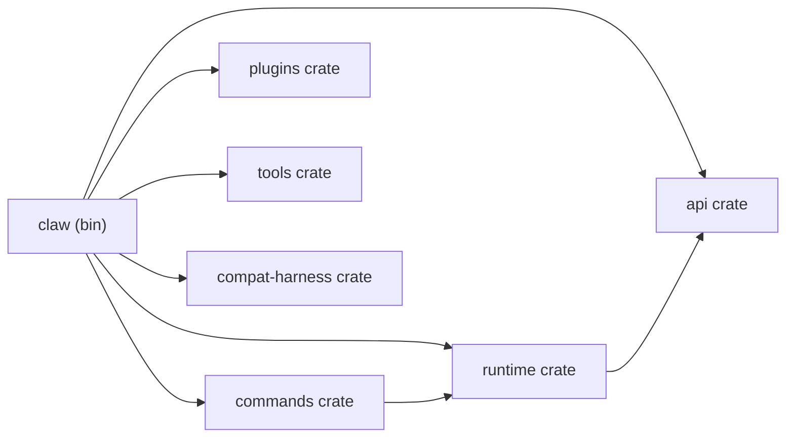

# 命令行接口

<cite>
**本文档引用的文件**
- [main.rs](file://rust/crates/rusty-claude-cli/src/main.rs)
- [app.rs](file://rust/crates/rusty-claude-cli/src/app.rs)
- [args.rs](file://rust/crates/rusty-claude-cli/src/args.rs)
- [init.rs](file://rust/crates/rusty-claude-cli/src/init.rs)
- [input.rs](file://rust/crates/rusty-claude-cli/src/input.rs)
- [render.rs](file://rust/crates/rusty-claude-cli/src/render.rs)
- [lib.rs](file://rust/crates/commands/src/lib.rs)
- [lib.rs](file://rust/crates/runtime/src/lib.rs)
- [Cargo.toml](file://rust/crates/rusty-claude-cli/Cargo.toml)
- [README.md](file://README.md)
</cite>

## 目录
1. [简介](#简介)
2. [项目结构](#项目结构)
3. [核心组件](#核心组件)
4. [架构总览](#架构总览)
5. [详细组件分析](#详细组件分析)
6. [依赖关系分析](#依赖关系分析)
7. [性能考虑](#性能考虑)
8. [故障排除指南](#故障排除指南)
9. [结论](#结论)
10. [附录](#附录)

## 简介
本文件系统化梳理 CLAW（claw）命令行工具的完整接口与工作机制，覆盖所有可用命令、参数、选项及其使用场景。文档面向不同技术背景的读者，既提供高层概览，也深入到代码级实现细节，帮助用户高效掌握 CLI 的全部能力，并能将其用于自动化脚本与日常开发工作流。

## 项目结构
CLAW CLI 位于 Rust 子工程中，二进制可执行文件名为 `claw`，通过 Cargo.toml 指定入口路径。核心模块包括：
- 主程序入口与参数解析：main.rs
- 交互式 REPL 与命令分发：app.rs、lib.rs（slash 命令）
- 参数定义与默认值：args.rs
- 初始化与引导：init.rs
- 输入与编辑器：input.rs
- 渲染与终端输出：render.rs
- 运行时与权限模型：runtime/src/lib.rs
- 插件管理与工具注册：commands/src/lib.rs

图表来源
- [Cargo.toml:8-10](file://rust/crates/rusty-claude-cli/Cargo.toml#L8-L10)
- [main.rs:60-101](file://rust/crates/rusty-claude-cli/src/main.rs#L60-L101)
- [app.rs:92-111](file://rust/crates/rusty-claude-cli/src/app.rs#L92-L111)
- [args.rs:5-26](file://rust/crates/rusty-claude-cli/src/args.rs#L5-L26)
- [input.rs:96-118](file://rust/crates/rusty-claude-cli/src/input.rs#L96-L118)
- [render.rs:218-237](file://rust/crates/rusty-claude-cli/src/render.rs#L218-L237)
- [init.rs:80-112](file://rust/crates/rusty-claude-cli/src/init.rs#L80-L112)
- [lib.rs:48-226](file://rust/crates/commands/src/lib.rs#L48-L226)
- [lib.rs:20-85](file://rust/crates/runtime/src/lib.rs#L20-L85)

章节来源
- [Cargo.toml:1-28](file://rust/crates/rusty-claude-cli/Cargo.toml#L1-L28)
- [README.md:112-149](file://README.md#L112-L149)

## 核心组件
- CLI 动作与参数解析：负责将命令行参数映射为具体动作（如 REPL、登录、导出等），并支持全局选项（模型、输出格式、权限模式、允许工具等）。
- REPL 与交互：提供持续对话环境，支持 slash 命令、工具调用、流式输出与状态展示。
- slash 命令系统：统一的命令规范，支持帮助、状态、压缩、模型切换、权限切换、导出、会话管理、插件管理等。
- 初始化与引导：生成项目所需配置文件与指导文档，便于快速上手。
- 渲染与终端：提供 Markdown 渲染、语法高亮、表格、进度指示器等，提升可读性。
- 权限与安全：基于模式控制工具访问范围，支持只读、工作区写入、危险全权等模式。

章节来源
- [main.rs:103-133](file://rust/crates/rusty-claude-cli/src/main.rs#L103-L133)
- [app.rs:42-48](file://rust/crates/rusty-claude-cli/src/app.rs#L42-L48)
- [lib.rs:48-226](file://rust/crates/commands/src/lib.rs#L48-L226)
- [init.rs:80-112](file://rust/crates/rusty-claude-cli/src/init.rs#L80-L112)
- [render.rs:218-237](file://rust/crates/rusty-claude-cli/src/render.rs#L218-L237)
- [lib.rs:69-72](file://rust/crates/runtime/src/lib.rs#L69-L72)

## 架构总览
下图展示了 CLI 的关键交互流程：从参数解析到动作执行，再到 REPL 或一次性提示模式，以及 slash 命令在会话中的处理。

图表来源
- [main.rs:71-101](file://rust/crates/rusty-claude-cli/src/main.rs#L71-L101)
- [app.rs:113-150](file://rust/crates/rusty-claude-cli/src/app.rs#L113-L150)
- [lib.rs:957-1007](file://rust/crates/commands/src/lib.rs#L957-L1007)
- [lib.rs:34-37](file://rust/crates/runtime/src/lib.rs#L34-L37)
- [render.rs:589-596](file://rust/crates/rusty-claude-cli/src/render.rs#L589-L596)

## 详细组件分析

### 1) 全局选项与参数
- --model / -m：指定推理模型；支持别名（opus/sonnet/haiku）自动解析为正式模型名。
- --output-format：非交互输出格式，支持 text/json/ndjson。
- --permission-mode：权限模式，支持 read-only/workspace-write/danger-full-access；也可通过环境变量设置默认值。
- --allowed-tools/--allowedTools：限制可用工具集合，支持逗号分隔与空白分隔，内置别名映射。
- --dangerously-skip-permissions：跳过权限检查（仅在明确需求时使用）。
- --print：强制非交互输出（兼容旧版行为）。
- -p：短参数的一次性提示模式（等价于 prompt 子命令）。
- --resume SESSION.json / --resume SESSION.json /command：在指定会话上重放 slash 命令。

章节来源
- [main.rs:154-296](file://rust/crates/rusty-claude-cli/src/main.rs#L154-L296)
- [main.rs:298-320](file://rust/crates/rusty-claude-cli/src/main.rs#L298-L320)
- [main.rs:384-400](file://rust/crates/rusty-claude-cli/src/main.rs#L384-L400)
- [args.rs:5-26](file://rust/crates/rusty-claude-cli/src/args.rs#L5-L26)
- [args.rs:42-54](file://rust/crates/rusty-claude-cli/src/args.rs#L42-L54)
- [lib.rs:189-219](file://rust/crates/tools/src/lib.rs#L189-L219)

### 2) 子命令
- dump-manifests：打印上游命令/工具/引导阶段统计。
- bootstrap-plan：打印默认引导阶段列表。
- system-prompt [--cwd PATH] [--date YYYY-MM-DD]：构建并打印系统提示词。
- login/logout：启动/清除 OAuth 登录凭据。
- init：初始化项目配置与引导文件。
- prompt TEXT 或 -p "TEXT"：一次性提示模式，按 --output-format 输出。
- REPL：无子命令时进入交互式 REPL。

章节来源
- [main.rs:267-296](file://rust/crates/rusty-claude-cli/src/main.rs#L267-L296)
- [main.rs:356-382](file://rust/crates/rusty-claude-cli/src/main.rs#L356-L382)
- [main.rs:402-422](file://rust/crates/rusty-claude-cli/src/main.rs#L402-L422)
- [main.rs:439-495](file://rust/crates/rusty-claude-cli/src/main.rs#L439-L495)
- [main.rs:497-516](file://rust/crates/rusty-claude-cli/src/main.rs#L497-L516)
- [main.rs:561-563](file://rust/crates/rusty-claude-cli/src/main.rs#L561-L563)
- [main.rs:565-605](file://rust/crates/rusty-claude-cli/src/main.rs#L565-L605)
- [init.rs:80-112](file://rust/crates/rusty-claude-cli/src/init.rs#L80-L112)

### 3) REPL 与 slash 命令
REPL 支持以下 slash 命令（部分命令在 --resume 下可用）：
- /help：显示 slash 命令帮助。
- /status：显示当前会话状态（轮次、模型、权限、输出格式、用量）。
- /compact：压缩本地会话历史为可恢复的系统摘要。
- /model [model]：查看或切换当前模型。
- /permissions [mode]：查看或切换权限模式。
- /clear [--confirm]：清空本地会话（需显式确认）。
- /cost：显示累计 token 使用量。
- /resume <session-path>：加载保存的会话到 REPL。
- /config [env|hooks|model|plugins]：查看配置文件或合并段落。
- /memory：查看已加载的指令记忆文件。
- /init：为仓库创建初始 CLAUDE.md。
- /diff：显示工作区变更的 git diff。
- /version：显示 CLI 版本与构建信息。
- /bughunter [scope]：扫描代码库中的潜在问题。
- /commit：生成提交信息并创建 git 提交。
- /pr [context]：从对话草拟或创建拉取请求。
- /issue [context]：从对话草拟或创建 GitHub issue。
- /ultraplan [task]：运行深度规划提示。
- /teleport <symbol-or-path>：在工作区中跳转到文件或符号。
- /debug-tool-call：重现上次工具调用的调试详情。
- /export [file]：将当前对话导出到文件。
- /session [list|switch <session-id>]：列出或切换受管本地会话。
- /plugins [list|install <path>|enable <name>|disable <name>|uninstall <id>|update <id>]：管理插件。
- /agents：管理代理配置。
- /skills：列出可用技能。

章节来源
- [app.rs:42-48](file://rust/crates/rusty-claude-cli/src/app.rs#L42-L48)
- [app.rs:152-166](file://rust/crates/rusty-claude-cli/src/app.rs#L152-L166)
- [lib.rs:48-226](file://rust/crates/commands/src/lib.rs#L48-L226)
- [lib.rs:388-422](file://rust/crates/commands/src/lib.rs#L388-L422)
- [lib.rs:957-1007](file://rust/crates/commands/src/lib.rs#L957-L1007)

### 4) 一次性提示模式（非交互）
当使用 prompt 子命令或 -p 选项时，CLI 将：
- 解析 prompt 内容
- 调用 ConversationRuntime.run_turn(...)
- 根据 --output-format 输出文本/JSON/Ndjson
- 打印本次对话的 token 使用情况

图表来源
- [app.rs:134-150](file://rust/crates/rusty-claude-cli/src/app.rs#L134-L150)
- [app.rs:261-303](file://rust/crates/rusty-claude-cli/src/app.rs#L261-L303)
- [lib.rs:34-37](file://rust/crates/runtime/src/lib.rs#L34-L37)

### 5) OAuth 登录与登出
- login：根据配置或默认 OAuth 设置，打开浏览器授权页面，监听本地回调端口，交换令牌并保存凭据。
- logout：清除本地 OAuth 凭据。

章节来源
- [main.rs:439-495](file://rust/crates/rusty-claude-cli/src/main.rs#L439-L495)
- [main.rs:497-516](file://rust/crates/rusty-claude-cli/src/main.rs#L497-L516)
- [main.rs:518-549](file://rust/crates/rusty-claude-cli/src/main.rs#L518-L549)
- [lib.rs:62-68](file://rust/crates/runtime/src/lib.rs#L62-L68)

### 6) 会话恢复（--resume）
- 支持对已保存会话重放 slash 命令序列
- 验证命令合法性并逐条执行，输出每步结果或消息
- 不合法命令将导致退出码 2 并给出错误信息

章节来源
- [main.rs:384-400](file://rust/crates/rusty-claude-cli/src/main.rs#L384-L400)
- [main.rs:565-605](file://rust/crates/rusty-claude-cli/src/main.rs#L565-L605)
- [lib.rs:957-1007](file://rust/crates/commands/src/lib.rs#L957-L1007)

### 7) 初始化（init）
- 创建 .claude/、.claude.json、.gitignore（含忽略项）、CLAUDE.md
- 渲染仓库语言/框架检测、验证命令、仓库形态与协作约定
- 幂等操作，保留现有文件内容

章节来源
- [init.rs:80-112](file://rust/crates/rusty-claude-cli/src/init.rs#L80-L112)
- [init.rs:162-217](file://rust/crates/rusty-claude-cli/src/init.rs#L162-L217)
- [init.rs:219-332](file://rust/crates/rusty-claude-cli/src/init.rs#L219-L332)

### 8) 终端渲染与交互体验
- Markdown 渲染：标题、强调、代码块、表格、链接、引用等
- 语法高亮：基于 syntect 的多语言高亮
- 进度指示器：旋转动画、成功/失败提示
- REPL 编辑器：支持 emacs 风格快捷键、Shift+Enter/Ctrl+J 换行、历史记录与命令补全

章节来源
- [render.rs:218-237](file://rust/crates/rusty-claude-cli/src/render.rs#L218-L237)
- [render.rs:277-427](file://rust/crates/rusty-claude-cli/src/render.rs#L277-L427)
- [render.rs:567-596](file://rust/crates/rusty-claude-cli/src/render.rs#L567-L596)
- [input.rs:96-118](file://rust/crates/rusty-claude-cli/src/input.rs#L96-L118)
- [input.rs:129-155](file://rust/crates/rusty-claude-cli/src/input.rs#L129-L155)

## 依赖关系分析
- CLI 二进制依赖多个内部 crate：api、commands、compat-harness、runtime、plugins、tools 等
- commands crate 定义了 slash 命令规范与帮助生成逻辑
- runtime 提供权限、会话、工具执行、OAuth 等运行时能力
- render 提供终端渲染与高亮
- init 提供项目初始化与引导

图表来源
- [Cargo.toml:12-24](file://rust/crates/rusty-claude-cli/Cargo.toml#L12-L24)

章节来源
- [Cargo.toml:1-28](file://rust/crates/rusty-claude-cli/Cargo.toml#L1-L28)

## 性能考虑
- 流式输出：REPL 中采用增量渲染，避免大块缓冲，提升响应速度
- 会话压缩：在阈值触发时将历史压缩为系统摘要，减少内存占用
- 工具调用：按需加载与缓存插件工具清单，限制允许工具集合以降低开销
- 终端渲染：仅在需要时进行语法高亮与复杂表格渲染

章节来源
- [app.rs:305-353](file://rust/crates/rusty-claude-cli/src/app.rs#L305-L353)
- [lib.rs:957-977](file://rust/crates/commands/src/lib.rs#L957-L977)
- [lib.rs:22-25](file://rust/crates/runtime/src/lib.rs#L22-L25)

## 故障排除指南
- 参数解析错误：检查选项拼写与值类型（如 --output-format 仅接受 text/json/ndjson）
- 权限不足：调整 --permission-mode 或使用 /permissions 切换模式
- 工具不可用：通过 --allowed-tools 指定允许工具集合，注意别名映射
- OAuth 失败：确认回调端口未被占用，手动复制 URL 至浏览器；检查网络与代理设置
- 会话恢复失败：确认会话文件路径正确且命令均以 / 开头且合法

章节来源
- [main.rs:142-151](file://rust/crates/rusty-claude-cli/src/main.rs#L142-L151)
- [main.rs:439-495](file://rust/crates/rusty-claude-cli/src/main.rs#L439-L495)
- [main.rs:565-605](file://rust/crates/rusty-claude-cli/src/main.rs#L565-L605)
- [lib.rs:189-219](file://rust/crates/tools/src/lib.rs#L189-L219)

## 结论
CLAW CLI 提供了从一次性提示到交互式 REPL 的完整体验，配合丰富的 slash 命令与插件生态，能够满足从日常开发到深度分析的多种场景。通过合理的参数与权限配置，用户可以安全、高效地利用工具链完成复杂任务，并将其无缝集成到自动化脚本中。

## 附录

### A. 常用命令速查
- 一次性提示：claw --model MODEL --output-format json prompt "你的问题"
- 非交互输出：claw --output-format ndjson -p "解释代码"
- REPL 会话：claw --permission-mode workspace-write
- 登录/登出：claw login；claw logout
- 导出对话：/export notes.txt
- 列出插件：/plugins list
- 切换模型：/model claude-3-5-haiku
- 切换权限：/permissions read-only
- 压缩历史：/compact
- 查看版本：/version

章节来源
- [main.rs:3802-3864](file://rust/crates/rusty-claude-cli/src/main.rs#L3802-L3864)
- [lib.rs:388-422](file://rust/crates/commands/src/lib.rs#L388-L422)

### B. 最佳实践
- 在 CI/CD 中使用 --output-format json/ndjson 便于解析
- 使用 --allowed-tools 精确限定工具集，降低风险
- 通过 /session 管理多会话，结合 /export 备份重要对话
- 使用 /ultraplan 进行复杂任务的多步骤规划
- 在大型仓库中优先使用 /teleport 快速定位目标文件或符号

章节来源
- [app.rs:182-198](file://rust/crates/rusty-claude-cli/src/app.rs#L182-L198)
- [lib.rs:169-181](file://rust/crates/commands/src/lib.rs#L169-L181)