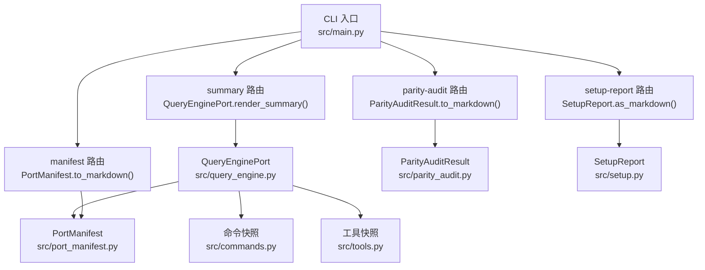
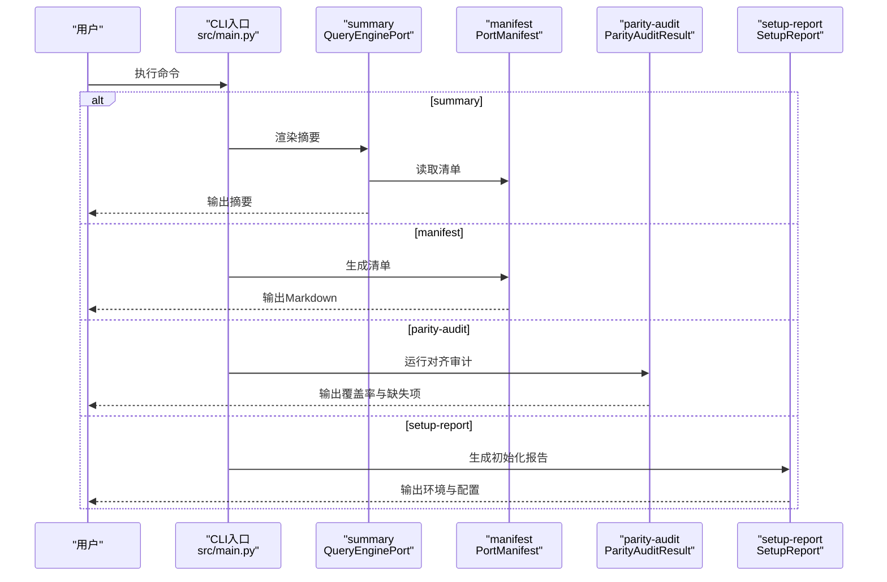
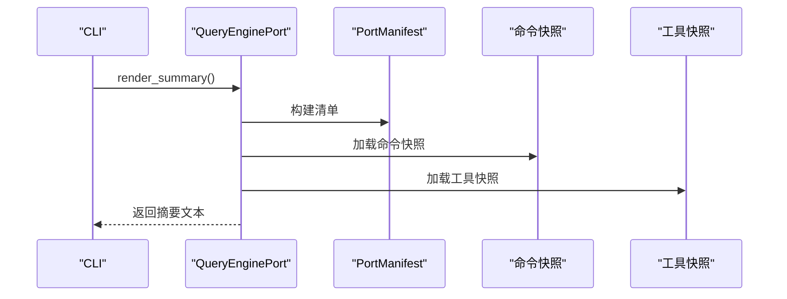
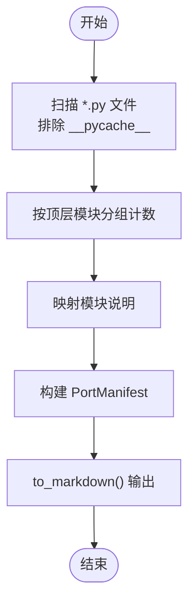
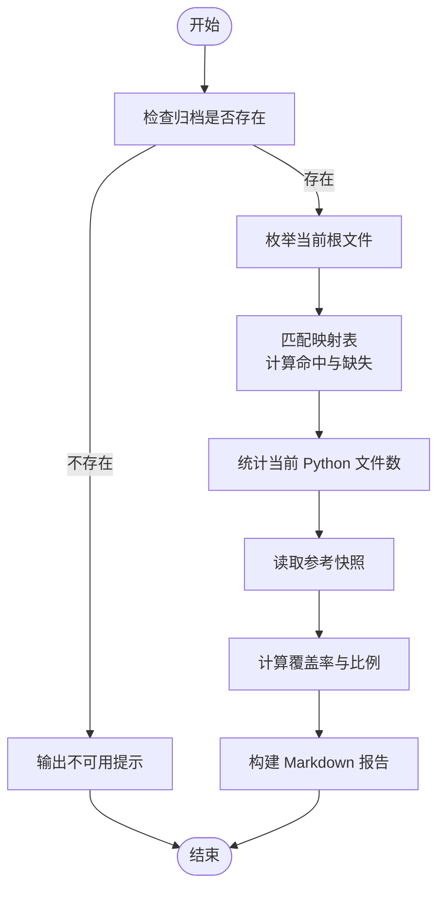
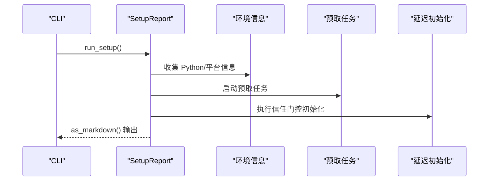
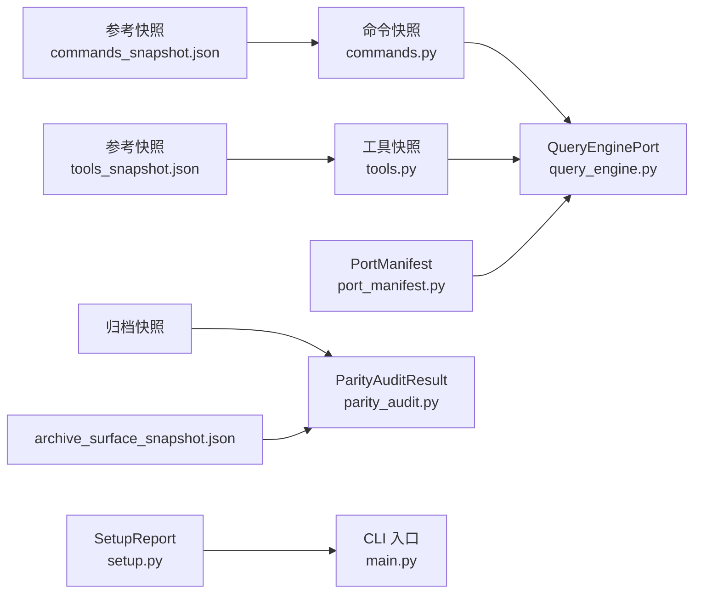

# 基础命令

<cite>
**本文引用的文件**
- [src/main.py](file://src/main.py)
- [src/commands.py](file://src/commands.py)
- [src/tools.py](file://src/tools.py)
- [src/port_manifest.py](file://src/port_manifest.py)
- [src/parity_audit.py](file://src/parity_audit.py)
- [src/setup.py](file://src/setup.py)
- [src/query_engine.py](file://src/query_engine.py)
- [src/command_graph.py](file://src/command_graph.py)
- [src/tool_pool.py](file://src/tool_pool.py)
- [src/models.py](file://src/models.py)
- [src/reference_data/commands_snapshot.json](file://src/reference_data/commands_snapshot.json)
- [src/reference_data/tools_snapshot.json](file://src/reference_data/tools_snapshot.json)
- [tests/test_porting_workspace.py](file://tests/test_porting_workspace.py)
</cite>

## 目录
1. [简介](#简介)
2. [项目结构](#项目结构)
3. [核心组件](#核心组件)
4. [架构总览](#架构总览)
5. [详细组件分析](#详细组件分析)
6. [依赖分析](#依赖分析)
7. [性能考虑](#性能考虑)
8. [故障排查指南](#故障排查指南)
9. [结论](#结论)
10. [附录](#附录)

## 简介
本章节面向 CLAW 项目的“基础命令”，重点覆盖以下命令：
- summary：生成当前 Python 迁移工作区的摘要报告（含模块清单、会话统计、用量等）
- manifest：生成当前工作区的模块清单与统计
- parity-audit：对齐归档快照，评估迁移完成度（根文件覆盖率、目录覆盖率、命令/工具条目覆盖率等）
- setup-report：展示工作区初始化与预取阶段的环境与配置状态

这些命令在代码迁移与项目维护中承担“可观测性”和“一致性校验”的关键作用，帮助团队快速掌握迁移进度、定位缺失模块与权限限制，并为后续的交互式查询与工具调用提供上下文。

## 项目结构
围绕基础命令的相关文件组织如下：
- CLI 入口与路由：src/main.py
- 命令与工具快照加载：src/commands.py、src/tools.py
- 工作区清单与摘要：src/port_manifest.py、src/query_engine.py
- 对齐审计：src/parity_audit.py
- 初始化与环境报告：src/setup.py
- 模型与数据结构：src/models.py
- 参考快照数据：src/reference_data/commands_snapshot.json、src/reference_data/tools_snapshot.json
- 测试用例：tests/test_porting_workspace.py

图表来源
- [src/main.py:94-127](file://src/main.py#L94-L127)
- [src/query_engine.py:171-194](file://src/query_engine.py#L171-L194)
- [src/port_manifest.py:18-28](file://src/port_manifest.py#L18-L28)
- [src/parity_audit.py:84-111](file://src/parity_audit.py#L84-L111)
- [src/setup.py:38-54](file://src/setup.py#L38-L54)

章节来源
- [src/main.py:94-127](file://src/main.py#L94-L127)
- [src/port_manifest.py:30-52](file://src/port_manifest.py#L30-L52)
- [src/parity_audit.py:121-139](file://src/parity_audit.py#L121-L139)
- [src/setup.py:64-78](file://src/setup.py#L64-L78)
- [src/query_engine.py:171-194](file://src/query_engine.py#L171-L194)

## 核心组件
- 命令与工具快照系统
  - 命令快照：通过 JSON 文件加载，提供命令名称、职责与来源提示；支持构建命令回溯、过滤与索引
  - 工具快照：同理，提供工具名称、职责与来源提示；支持按权限与模式过滤
- 工作区清单（PortManifest）
  - 统计顶层模块数量、文件分布与注释说明，输出 Markdown 报告
- 查询引擎摘要（QueryEnginePort）
  - 聚合清单、命令与工具快照，输出结构化摘要，包含会话信息、用量统计与预算控制
- 对齐审计（ParityAuditResult）
  - 对比当前工作区与归档快照，计算覆盖率与缺失项，输出 Markdown 报告
- 初始化报告（SetupReport）
  - 展示 Python 版本、平台、可信模式、CWD 以及预取与延迟初始化结果

章节来源
- [src/commands.py:22-41](file://src/commands.py#L22-L41)
- [src/tools.py:23-41](file://src/tools.py#L23-L41)
- [src/port_manifest.py:12-28](file://src/port_manifest.py#L12-L28)
- [src/query_engine.py:35-44](file://src/query_engine.py#L35-L44)
- [src/parity_audit.py:73-83](file://src/parity_audit.py#L73-L83)
- [src/setup.py:12-37](file://src/setup.py#L12-L37)

## 架构总览
下图展示基础命令在 CLI 中的执行路径与关键对象交互：

图表来源
- [src/main.py:94-127](file://src/main.py#L94-L127)
- [src/query_engine.py:171-194](file://src/query_engine.py#L171-L194)
- [src/port_manifest.py:18-28](file://src/port_manifest.py#L18-L28)
- [src/parity_audit.py:121-139](file://src/parity_audit.py#L121-L139)
- [src/setup.py:64-78](file://src/setup.py#L64-L78)

## 详细组件分析

### summary 命令
- 功能概述
  - 基于工作区清单与命令/工具快照，生成一份可读的摘要报告，包含：
    - 工作区清单（模块、文件数、说明）
    - 命令表面条目数量与前若干条目列表
    - 工具表面条目数量与前若干条目列表
    - 会话 ID、对话轮次、权限拒绝数、用量总计、预算与转录状态
- 执行逻辑
  - CLI 解析参数后，构建 PortManifest 并交由 QueryEnginePort 渲染摘要
  - 摘要内部聚合命令与工具快照，计算会话与用量统计
- 输出格式
  - Markdown 文本，分节展示清单、命令/工具概览与运行时状态
- 使用场景
  - 快速了解当前迁移工作区的整体情况
  - 作为交互式查询或工具调用前的上下文准备
- 最佳实践
  - 在每次重大变更后运行，形成基线对比
  - 结合会话持久化与重放能力，追踪历史变化

图表来源
- [src/main.py:98-100](file://src/main.py#L98-L100)
- [src/query_engine.py:171-194](file://src/query_engine.py#L171-L194)
- [src/port_manifest.py:30-52](file://src/port_manifest.py#L30-L52)
- [src/commands.py:22-41](file://src/commands.py#L22-L41)
- [src/tools.py:23-41](file://src/tools.py#L23-L41)

章节来源
- [src/main.py:98-100](file://src/main.py#L98-L100)
- [src/query_engine.py:171-194](file://src/query_engine.py#L171-L194)

### manifest 命令
- 功能概述
  - 统计工作区内所有 Python 文件，按顶层模块分组并给出文件数量与说明
- 执行逻辑
  - 遍历源码根目录下的 *.py 文件，排除缓存目录
  - 计算各顶层模块的文件数量，结合内置注释映射生成模块说明
- 输出格式
  - Markdown 文本，列出“工作区根目录”、“总 Python 文件数”与“顶级模块列表”
- 使用场景
  - 识别未被迁移的模块或遗漏的入口文件
  - 作为迁移优先级排序的依据
- 最佳实践
  - 定期运行以监控新增/删除的模块
  - 与 parity-audit 结合，确认模块是否已对齐到目标实现

图表来源
- [src/port_manifest.py:30-52](file://src/port_manifest.py#L30-L52)
- [src/port_manifest.py:18-28](file://src/port_manifest.py#L18-L28)

章节来源
- [src/port_manifest.py:30-52](file://src/port_manifest.py#L30-L52)
- [src/port_manifest.py:18-28](file://src/port_manifest.py#L18-L28)

### parity-audit 命令
- 功能概述
  - 将当前工作区与归档快照进行对比，评估迁移完成度
  - 输出根文件覆盖率、目录覆盖率、总文件比例、命令/工具条目覆盖率，以及缺失项清单
- 执行逻辑
  - 读取归档根与当前根，建立文件与目录映射
  - 统计命中与缺失，计算覆盖率与比例
  - 读取参考快照中的总数，计算命令/工具条目覆盖率
- 输出格式
  - Markdown 文本，包含标题、覆盖率指标与缺失项列表
- 使用场景
  - 迁移过程中的质量门禁与回归检测
  - 识别未对齐的根文件与目录
- 最佳实践
  - 在关键里程碑运行，记录覆盖率趋势
  - 结合命令/工具快照，确保条目完整性

图表来源
- [src/parity_audit.py:121-139](file://src/parity_audit.py#L121-L139)
- [src/parity_audit.py:84-111](file://src/parity_audit.py#L84-L111)

章节来源
- [src/parity_audit.py:121-139](file://src/parity_audit.py#L121-L139)
- [src/parity_audit.py:84-111](file://src/parity_audit.py#L84-L111)

### setup-report 命令
- 功能概述
  - 展示工作区初始化阶段的关键信息：Python 版本/实现、平台、可信模式、当前工作目录
  - 列出预取任务与延迟初始化结果
- 执行逻辑
  - 收集运行时环境信息
  - 启动预取任务（如 MDM 读取、密钥链、项目扫描）
  - 执行信任门控的延迟初始化
  - 生成结构化报告
- 输出格式
  - Markdown 文本，包含环境信息、预取项与延迟初始化详情
- 使用场景
  - 新环境初始化后的健康检查
  - 排查权限与环境差异导致的问题
- 最佳实践
  - 在 CI 或本地首次启动时运行，确保一致的初始化流程
  - 结合测试用例验证命令与工具索引的可用性

图表来源
- [src/main.py:107-109](file://src/main.py#L107-L109)
- [src/setup.py:64-78](file://src/setup.py#L64-L78)
- [src/setup.py:38-54](file://src/setup.py#L38-L54)

章节来源
- [src/main.py:107-109](file://src/main.py#L107-L109)
- [src/setup.py:64-78](file://src/setup.py#L64-L78)
- [src/setup.py:38-54](file://src/setup.py#L38-L54)

## 依赖分析
- 命令与工具快照
  - 通过 JSON 快照文件提供稳定的元数据来源，避免硬编码
  - 提供统一的数据结构（PortingModule）与回溯（PortingBacklog）
- 查询引擎摘要
  - 依赖清单、命令/工具快照与会话存储，形成“上下文+历史”的综合视图
- 对齐审计
  - 依赖归档快照与参考数据，用于跨版本一致性校验
- 初始化报告
  - 依赖环境探测与预取/延迟初始化流程，保证可重复且可审计

图表来源
- [src/commands.py:22-41](file://src/commands.py#L22-L41)
- [src/tools.py:23-41](file://src/tools.py#L23-L41)
- [src/query_engine.py:35-44](file://src/query_engine.py#L35-L44)
- [src/port_manifest.py:30-52](file://src/port_manifest.py#L30-L52)
- [src/parity_audit.py:9-11](file://src/parity_audit.py#L9-L11)
- [src/setup.py:30-37](file://src/setup.py#L30-L37)
- [src/main.py:94-127](file://src/main.py#L94-L127)

章节来源
- [src/commands.py:22-41](file://src/commands.py#L22-L41)
- [src/tools.py:23-41](file://src/tools.py#L23-L41)
- [src/query_engine.py:35-44](file://src/query_engine.py#L35-L44)
- [src/port_manifest.py:30-52](file://src/port_manifest.py#L30-L52)
- [src/parity_audit.py:9-11](file://src/parity_audit.py#L9-L11)
- [src/setup.py:30-37](file://src/setup.py#L30-L37)
- [src/main.py:94-127](file://src/main.py#L94-L127)

## 性能考虑
- 快照缓存
  - 命令与工具快照采用 LRU 缓存，避免重复解析 JSON，提升命令/工具索引与过滤性能
- 清单统计
  - 清单构建仅遍历一次源码树，时间复杂度近似 O(N)，其中 N 为 Python 文件数
- 审计计算
  - 审计基于集合操作与计数，整体复杂度 O(M+N)，M 为映射条目数，N 为当前文件数
- 摘要渲染
  - 摘要包含会话与用量统计，建议在需要时开启结构化输出，减少不必要的序列化开销

章节来源
- [src/commands.py:22-41](file://src/commands.py#L22-L41)
- [src/tools.py:23-41](file://src/tools.py#L23-L41)
- [src/port_manifest.py:30-52](file://src/port_manifest.py#L30-L52)
- [src/parity_audit.py:121-139](file://src/parity_audit.py#L121-L139)
- [src/query_engine.py:152-169](file://src/query_engine.py#L152-L169)

## 故障排查指南
- 常见问题
  - parity-audit 报告显示“本地归档不可用”
    - 现象：覆盖率与缺失项无法计算
    - 处理：确认归档目录存在且包含快照文件
  - summary 输出为空或不完整
    - 现象：命令/工具条目数量为 0
    - 处理：检查快照文件是否正确加载；确认 CLI 当前工作目录
  - setup-report 显示权限受限
    - 现象：预取或延迟初始化失败
    - 处理：以更高可信模式运行；检查网络与凭据访问
- 调试技巧
  - 使用 tests/test_porting_workspace.py 中的命令组合验证 CLI 行为
  - 逐步运行命令/工具索引与工具池，确认过滤与权限上下文生效
  - 对照参考快照文件，核对命令/工具名称与来源提示是否一致

章节来源
- [src/parity_audit.py:84-89](file://src/parity_audit.py#L84-L89)
- [src/parity_audit.py:121-139](file://src/parity_audit.py#L121-L139)
- [tests/test_porting_workspace.py:139-174](file://tests/test_porting_workspace.py#L139-L174)

## 结论
基础命令为 CLAW 的迁移与维护提供了“可见性、一致性与可审计性”。通过 summary、manifest、parity-audit 与 setup-report，团队可以：
- 快速掌握工作区现状与迁移进度
- 量化对齐程度并定位缺失模块
- 标准化初始化流程与环境配置
- 为后续的交互式查询与工具调用奠定坚实基础

## 附录
- 实际使用示例（路径指引）
  - 查看工作区摘要：python3 -m src.main summary
  - 生成模块清单：python3 -m src.main manifest
  - 运行对齐审计：python3 -m src.main parity-audit
  - 生成初始化报告：python3 -m src.main setup-report
  - 验证命令与工具索引：python3 -m src.main commands --limit 5 --no-plugin-commands
  - 验证工具池：python3 -m src.main tool-pool --simple-mode --no-mcp
- 参考快照文件
  - 命令快照：src/reference_data/commands_snapshot.json
  - 工具快照：src/reference_data/tools_snapshot.json

章节来源
- [src/main.py:94-127](file://src/main.py#L94-L127)
- [tests/test_porting_workspace.py:139-174](file://tests/test_porting_workspace.py#L139-L174)
- [src/reference_data/commands_snapshot.json:1-20](file://src/reference_data/commands_snapshot.json#L1-L20)
- [src/reference_data/tools_snapshot.json:1-20](file://src/reference_data/tools_snapshot.json#L1-L20)