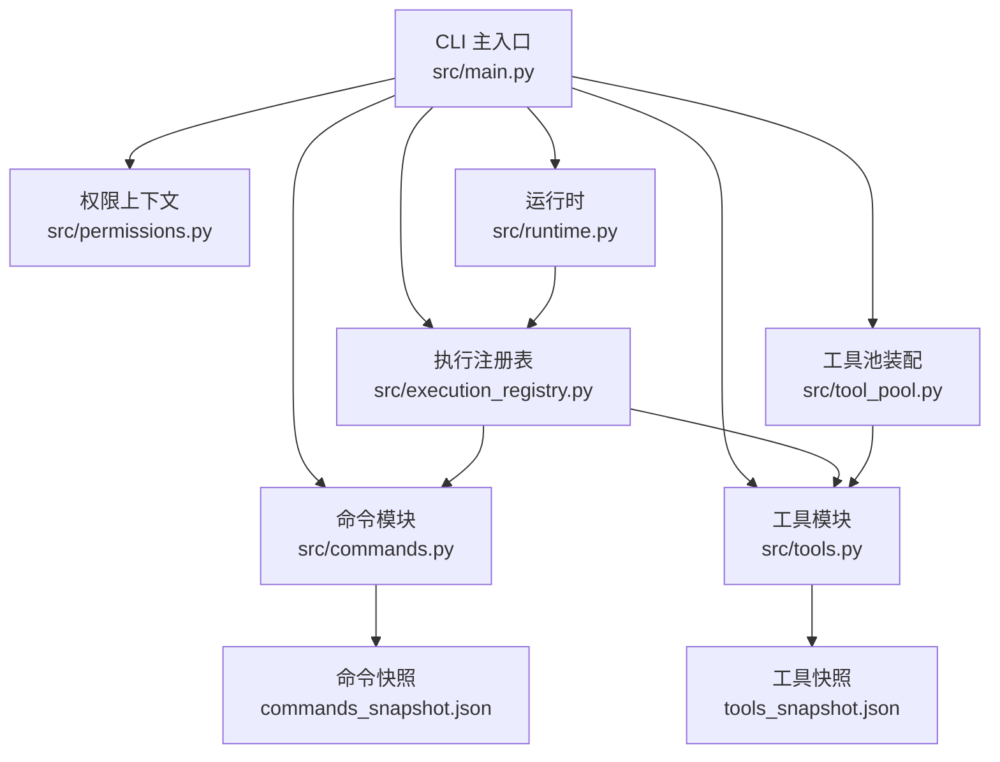
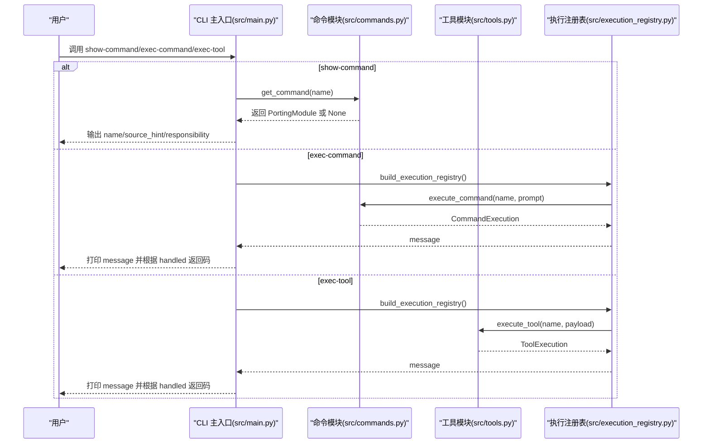
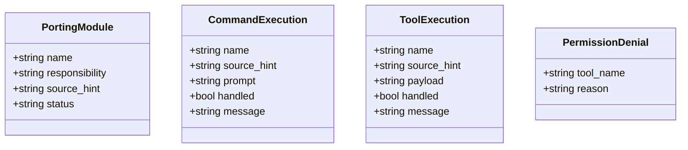
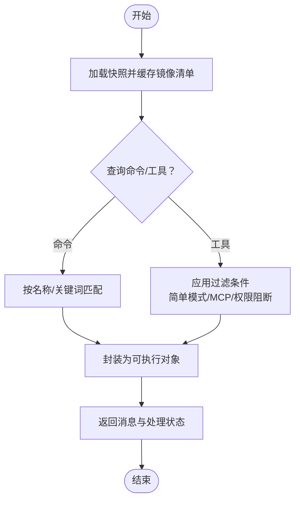
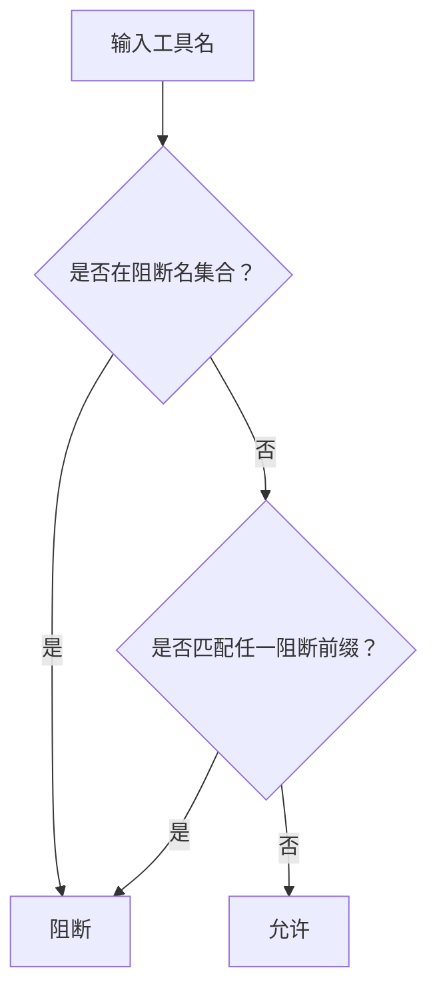
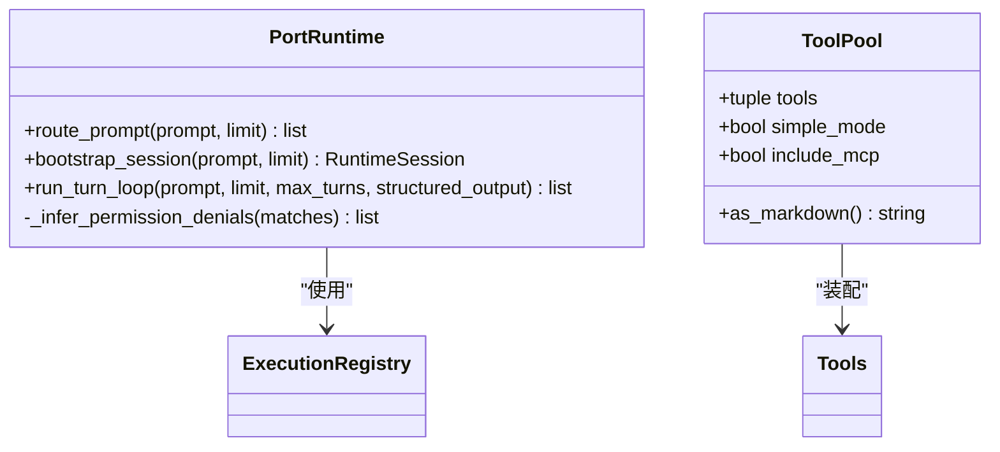
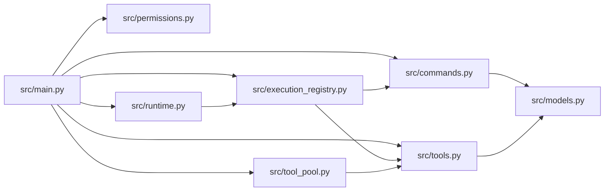

# 检查命令

<cite>
**本文引用的文件**
- [src/main.py](file://src/main.py)
- [src/commands.py](file://src/commands.py)
- [src/tools.py](file://src/tools.py)
- [src/models.py](file://src/models.py)
- [src/permissions.py](file://src/permissions.py)
- [src/execution_registry.py](file://src/execution_registry.py)
- [src/runtime.py](file://src/runtime.py)
- [src/tool_pool.py](file://src/tool_pool.py)
- [src/reference_data/commands_snapshot.json](file://src/reference_data/commands_snapshot.json)
- [src/reference_data/tools_snapshot.json](file://src/reference_data/tools_snapshot.json)
</cite>

## 目录
1. [简介](#简介)
2. [项目结构](#项目结构)
3. [核心组件](#核心组件)
4. [架构总览](#架构总览)
5. [详细组件分析](#详细组件分析)
6. [依赖关系分析](#依赖关系分析)
7. [性能考量](#性能考量)
8. [故障排除指南](#故障排除指南)
9. [结论](#结论)
10. [附录](#附录)

## 简介
本文件聚焦 CLAW 项目的“检查命令”能力，围绕以下子命令展开：show-command、show-tool、exec-command、exec-tool。它们用于：
- 查看命令与工具的元数据（名称、来源提示、职责说明）
- 在镜像环境中对命令与工具进行精确执行（返回模拟执行结果）
- 基于权限上下文过滤工具集合
- 支持路由与运行时会话构建，辅助开发验证与问题诊断

这些命令在代码迁移与验证阶段扮演关键角色：既可作为“只读审计器”快速核对镜像清单，也可作为“执行沙盒”验证命令/工具在给定输入下的行为预期。

## 项目结构
与“检查命令”直接相关的模块组织如下：
- CLI 入口与参数解析：负责解析 show-command/show-tool/exec-command/exec-tool 等子命令及其参数
- 命令与工具索引与查询：从快照加载镜像命令/工具清单，支持模糊匹配与过滤
- 执行注册表：将镜像命令/工具包装为可执行对象，统一对外暴露 execute 接口
- 权限上下文：基于工具名与前缀进行阻断控制
- 运行时与工具池：提供路由、会话构建、工具池装配等能力，支撑更复杂的验证场景

**图表来源**
- [src/main.py:94-214](file://src/main.py#L94-L214)
- [src/commands.py:22-91](file://src/commands.py#L22-L91)
- [src/tools.py:23-97](file://src/tools.py#L23-L97)
- [src/execution_registry.py:47-52](file://src/execution_registry.py#L47-L52)
- [src/permissions.py:6-21](file://src/permissions.py#L6-L21)
- [src/runtime.py:89-193](file://src/runtime.py#L89-L193)
- [src/tool_pool.py:28-38](file://src/tool_pool.py#L28-L38)
- [src/reference_data/commands_snapshot.json:1-1037](file://src/reference_data/commands_snapshot.json#L1-L1037)
- [src/reference_data/tools_snapshot.json:1-922](file://src/reference_data/tools_snapshot.json#L1-L922)

**章节来源**
- [src/main.py:94-214](file://src/main.py#L94-L214)
- [src/commands.py:22-91](file://src/commands.py#L22-L91)
- [src/tools.py:23-97](file://src/tools.py#L23-L97)
- [src/reference_data/commands_snapshot.json:1-1037](file://src/reference_data/commands_snapshot.json#L1-L1037)
- [src/reference_data/tools_snapshot.json:1-922](file://src/reference_data/tools_snapshot.json#L1-L922)

## 核心组件
- 命令与工具快照加载：通过 LRU 缓存加载 JSON 快照，生成镜像模块列表，便于后续查询与执行
- 命令与工具查询与过滤：支持按名称、来源提示、职责关键词匹配；支持插件/技能过滤、简单模式、MCP 过滤、权限阻断
- 执行封装：将镜像命令/工具包装为可执行对象，统一返回消息与处理状态
- 权限上下文：基于工具名与前缀集合进行阻断判断
- 运行时与工具池：提供路由、会话构建、工具池装配，支撑复杂验证流程

**章节来源**
- [src/commands.py:22-91](file://src/commands.py#L22-L91)
- [src/tools.py:23-97](file://src/tools.py#L23-L97)
- [src/permissions.py:6-21](file://src/permissions.py#L6-L21)
- [src/execution_registry.py:9-52](file://src/execution_registry.py#L9-L52)
- [src/tool_pool.py:10-38](file://src/tool_pool.py#L10-L38)

## 架构总览
下图展示“检查命令”的端到端调用链：CLI 解析参数后，分别调用命令/工具模块的查询与执行函数，并输出结果或错误码。

**图表来源**
- [src/main.py:186-207](file://src/main.py#L186-L207)
- [src/commands.py:75-80](file://src/commands.py#L75-L80)
- [src/tools.py:81-86](file://src/tools.py#L81-L86)
- [src/execution_registry.py:47-52](file://src/execution_registry.py#L47-L52)

## 详细组件分析

### 命令与工具的数据模型
- PortingModule：镜像模块的核心数据结构，包含名称、职责、来源提示、状态
- CommandExecution/ToolExecution：执行结果载体，包含名称、来源提示、输入、处理状态与消息
- PermissionDenial：权限拒绝记录，用于运行时会话中展示被阻断的工具

**图表来源**
- [src/models.py:14-50](file://src/models.py#L14-L50)

**章节来源**
- [src/models.py:14-50](file://src/models.py#L14-L50)

### 命令与工具的查询与执行
- 命令查询：从快照加载镜像命令清单，支持大小写不敏感的名称匹配、来源提示与职责关键词匹配、插件/技能过滤
- 工具查询：从快照加载镜像工具清单，支持简单模式、MCP 过滤、权限阻断过滤
- 执行封装：将镜像命令/工具包装为可执行对象，统一返回消息与处理状态

**图表来源**
- [src/commands.py:22-91](file://src/commands.py#L22-L91)
- [src/tools.py:23-97](file://src/tools.py#L23-L97)
- [src/execution_registry.py:9-52](file://src/execution_registry.py#L9-L52)

**章节来源**
- [src/commands.py:22-91](file://src/commands.py#L22-L91)
- [src/tools.py:23-97](file://src/tools.py#L23-L97)
- [src/execution_registry.py:9-52](file://src/execution_registry.py#L9-L52)

### 权限上下文与阻断逻辑
- ToolPermissionContext：支持基于工具名集合与前缀集合进行阻断判断
- 运行时会话中可推断部分工具的权限拒绝原因（如破坏性 Shell 执行）

**图表来源**
- [src/permissions.py:18-21](file://src/permissions.py#L18-L21)
- [src/runtime.py:169-174](file://src/runtime.py#L169-L174)

**章节来源**
- [src/permissions.py:6-21](file://src/permissions.py#L6-L21)
- [src/runtime.py:169-174](file://src/runtime.py#L169-L174)

### 运行时与工具池
- PortRuntime：提供路由、会话引导、多轮对话、权限拒绝推断等能力
- ToolPool：装配工具池，支持简单模式与 MCP 包含策略

**图表来源**
- [src/runtime.py:89-193](file://src/runtime.py#L89-L193)
- [src/tool_pool.py:10-38](file://src/tool_pool.py#L10-L38)

**章节来源**
- [src/runtime.py:89-193](file://src/runtime.py#L89-L193)
- [src/tool_pool.py:10-38](file://src/tool_pool.py#L10-L38)

## 依赖关系分析
- CLI 依赖命令/工具模块与执行注册表，以完成查询与执行
- 命令/工具模块依赖快照 JSON 文件与模型定义
- 执行注册表依赖命令/工具模块的执行函数
- 运行时依赖执行注册表与查询引擎，用于路由与会话构建
- 工具池依赖工具模块与权限上下文

**图表来源**
- [src/main.py:94-214](file://src/main.py#L94-L214)
- [src/commands.py:8-91](file://src/commands.py#L8-L91)
- [src/tools.py:8-97](file://src/tools.py#L8-L97)
- [src/execution_registry.py:5-52](file://src/execution_registry.py#L5-L52)
- [src/runtime.py:5-193](file://src/runtime.py#L5-L193)
- [src/tool_pool.py:5-38](file://src/tool_pool.py#L5-L38)
- [src/models.py:3-50](file://src/models.py#L3-L50)

**章节来源**
- [src/main.py:94-214](file://src/main.py#L94-L214)
- [src/execution_registry.py:47-52](file://src/execution_registry.py#L47-L52)

## 性能考量
- 快照加载采用 LRU 缓存，避免重复 IO
- 查询与匹配为线性扫描，建议配合关键词与限制数量使用
- 执行封装为纯内存操作，开销极低
- 复杂路由与会话构建由运行时承担，适合在需要完整上下文时使用

[本节为通用指导，无需列出具体文件来源]

## 故障排除指南
- 命令/工具不存在
  - 现象：返回“未找到”并以非零退出码
  - 排查：确认名称大小写、来源提示关键词、是否被过滤（插件/技能、MCP、权限阻断）
- 执行失败
  - 现象：handled 为 False，message 中包含“未知镜像命令/工具”
  - 排查：确认名称与快照一致；检查执行参数格式
- 权限阻断
  - 现象：工具被阻断，运行时会话中出现 PermissionDenial
  - 排查：检查 ToolPermissionContext 的 deny 名称与前缀配置
- 输出过多
  - 现象：列表输出过长
  - 排查：使用 --limit 控制输出条数；使用 --query 进行筛选

**章节来源**
- [src/main.py:186-207](file://src/main.py#L186-L207)
- [src/commands.py:75-80](file://src/commands.py#L75-L80)
- [src/tools.py:81-86](file://src/tools.py#L81-L86)
- [src/runtime.py:169-174](file://src/runtime.py#L169-L174)

## 结论
CLAW 的“检查命令”体系以镜像快照为核心，结合查询、过滤、执行封装与权限控制，提供了从“只读审计”到“精确执行”的完整能力。show-command/show-tool 用于快速核对清单与元数据，exec-command/exec-tool 则在镜像环境中给出可预期的执行反馈。配合运行时与工具池，可在开发验证与问题诊断中高效定位问题、评估影响范围。

[本节为总结性内容，无需列出具体文件来源]

## 附录

### 命令与工具快照概览
- 命令快照：包含命令名称、来源提示、职责描述
- 工具快照：包含工具名称、来源提示、职责描述

**章节来源**
- [src/reference_data/commands_snapshot.json:1-1037](file://src/reference_data/commands_snapshot.json#L1-L1037)
- [src/reference_data/tools_snapshot.json:1-922](file://src/reference_data/tools_snapshot.json#L1-L922)