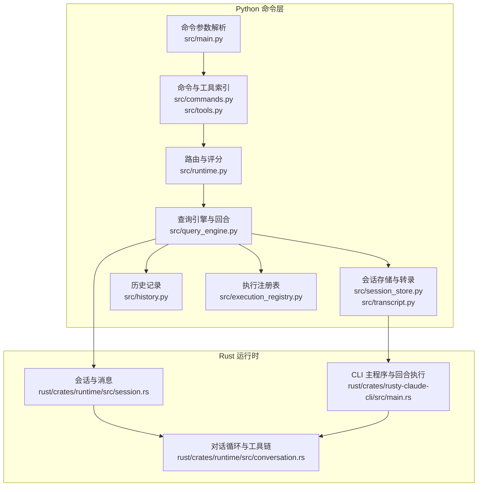
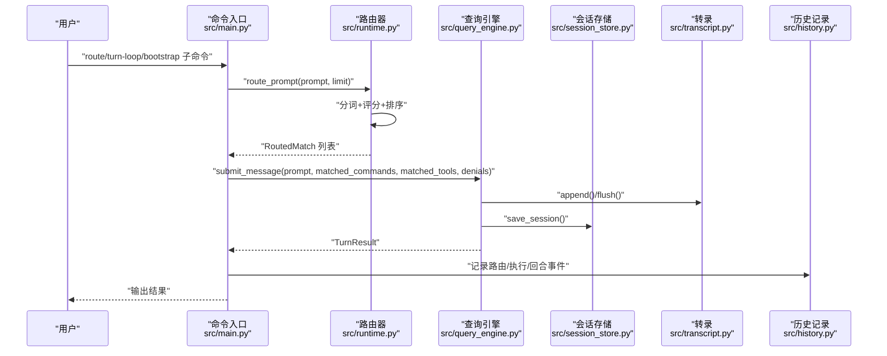
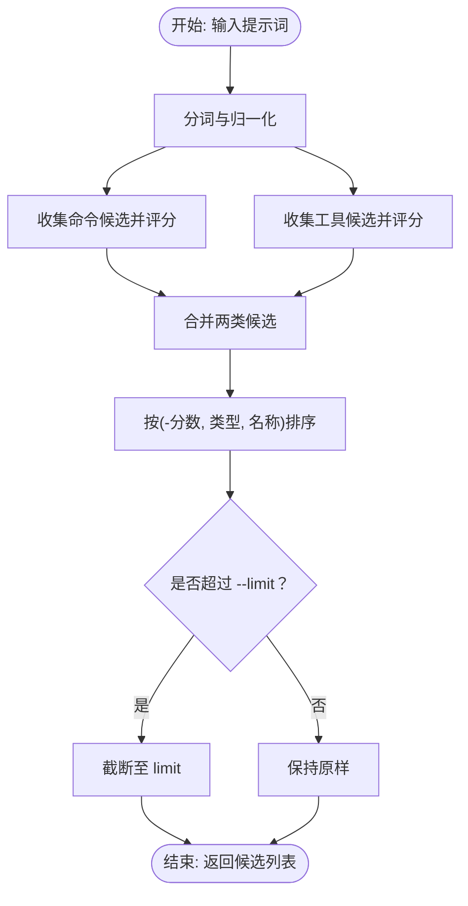
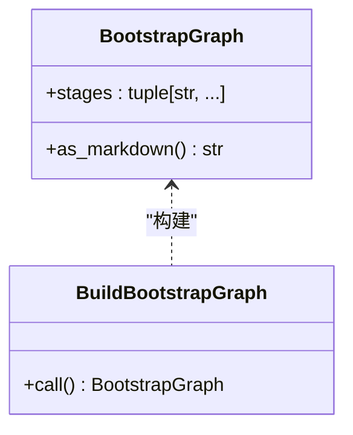
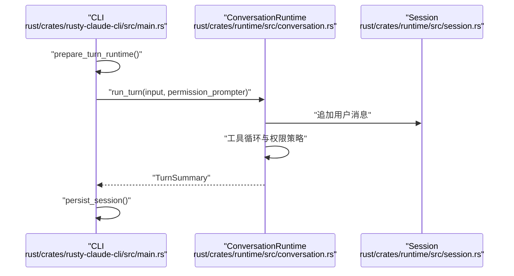
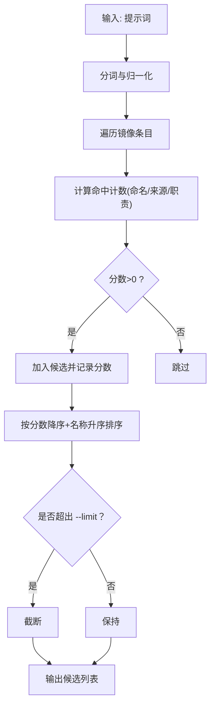
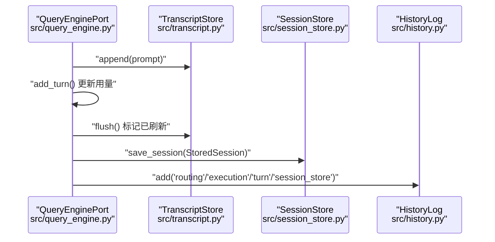
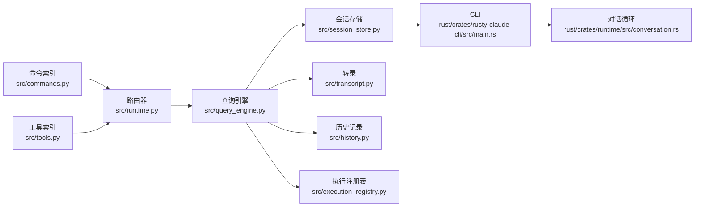

# 路由命令

<cite>
**本文引用的文件**
- [src/main.py](file://src/main.py)
- [src/commands.py](file://src/commands.py)
- [src/command_graph.py](file://src/command_graph.py)
- [src/tools.py](file://src/tools.py)
- [src/models.py](file://src/models.py)
- [src/runtime.py](file://src/runtime.py)
- [src/query_engine.py](file://src/query_engine.py)
- [src/history.py](file://src/history.py)
- [src/session_store.py](file://src/session_store.py)
- [src/transcript.py](file://src/transcript.py)
- [src/execution_registry.py](file://src/execution_registry.py)
- [src/reference_data/commands_snapshot.json](file://src/reference_data/commands_snapshot.json)
- [src/bootstrap_graph.py](file://src/bootstrap_graph.py)
- [rust/crates/runtime/src/conversation.rs](file://rust/crates/runtime/src/conversation.rs)
- [rust/crates/runtime/src/session.rs](file://rust/crates/runtime/src/session.rs)
- [rust/crates/rusty-claude-cli/src/main.rs](file://rust/crates/rusty-claude-cli/src/main.rs)
</cite>

## 目录
1. [简介](#简介)
2. [项目结构](#项目结构)
3. [核心组件](#核心组件)
4. [架构总览](#架构总览)
5. [详细组件分析](#详细组件分析)
6. [依赖分析](#依赖分析)
7. [性能考量](#性能考量)
8. [故障排查指南](#故障排查指南)
9. [结论](#结论)
10. [附录](#附录)

## 简介
本文件聚焦 CLAW 项目的“路由命令”能力，围绕 route、bootstrap、turn-loop 等命令展开，系统阐述以下内容：
- 路由命令的功能与工作机制
- 提示路由算法与匹配评分系统
- 会话管理流程（持久化、转录、预算控制）
- --limit 参数的作用与影响
- 多轮对话与智能路由的实际使用示例
- 在模拟运行时与对话管理中的关键作用

## 项目结构
CLAW 的路由与会话相关逻辑主要分布在 Python 层与 Rust 运行时两部分：
- Python 层：命令解析、路由算法、会话存储、转录与预算控制
- Rust 层：会话生命周期、权限策略、工具执行循环、自动压缩与钩子

图表来源
- [src/main.py:48-61](file://src/main.py#L48-L61)
- [src/commands.py:39-46](file://src/commands.py#L39-L46)
- [src/runtime.py:89-192](file://src/runtime.py#L89-L192)
- [src/query_engine.py:61-104](file://src/query_engine.py#L61-L104)
- [src/session_store.py:19-35](file://src/session_store.py#L19-L35)
- [src/transcript.py:6-24](file://src/transcript.py#L6-L24)
- [rust/crates/runtime/src/session.rs:371-414](file://rust/crates/runtime/src/session.rs#L371-L414)
- [rust/crates/runtime/src/conversation.rs:317-337](file://rust/crates/runtime/src/conversation.rs#L317-L337)
- [rust/crates/rusty-claude-cli/src/main.rs:1086-1152](file://rust/crates/rusty-claude-cli/src/main.rs#L1086-L1152)

章节来源
- [src/main.py:48-61](file://src/main.py#L48-L61)
- [src/commands.py:39-46](file://src/commands.py#L39-L46)
- [src/runtime.py:89-192](file://src/runtime.py#L89-L192)
- [src/query_engine.py:61-104](file://src/query_engine.py#L61-L104)
- [src/session_store.py:19-35](file://src/session_store.py#L19-L35)
- [src/transcript.py:6-24](file://src/transcript.py#L6-L24)
- [rust/crates/runtime/src/session.rs:371-414](file://rust/crates/runtime/src/session.rs#L371-L414)
- [rust/crates/runtime/src/conversation.rs:317-337](file://rust/crates/runtime/src/conversation.rs#L317-L337)
- [rust/crates/rusty-claude-cli/src/main.py:1086-1152](file://rust/crates/rusty-claude-cli/src/main.rs#L1086-L1152)

## 核心组件
- 命令与工具镜像索引：从快照加载命令与工具条目，支持按名称/来源/职责检索与过滤。
- 路由与评分：基于提示词分词与模块元数据进行匹配评分，优先选择命令类候选，再按分数排序补充工具类候选，并受 --limit 限制。
- 查询引擎与回合：封装单轮处理逻辑，包含预算检查、消息追加、权限拒绝记录与会话持久化。
- 会话存储与转录：以 JSON 形式保存会话，支持紧凑化与刷新。
- 执行注册表：将命令/工具名映射到可执行对象，用于后续模拟执行或真实调用。

章节来源
- [src/commands.py:22-50](file://src/commands.py#L22-L50)
- [src/tools.py:23-46](file://src/tools.py#L23-L46)
- [src/runtime.py:89-192](file://src/runtime.py#L89-L192)
- [src/query_engine.py:61-104](file://src/query_engine.py#L61-L104)
- [src/session_store.py:19-35](file://src/session_store.py#L19-L35)
- [src/transcript.py:6-24](file://src/transcript.py#L6-L24)
- [src/execution_registry.py:28-51](file://src/execution_registry.py#L28-L51)

## 架构总览
下图展示从命令入口到路由、回合处理与会话持久化的端到端流程：

图表来源
- [src/main.py:48-61](file://src/main.py#L48-L61)
- [src/runtime.py:89-192](file://src/runtime.py#L89-L192)
- [src/query_engine.py:61-104](file://src/query_engine.py#L61-L104)
- [src/session_store.py:19-35](file://src/session_store.py#L19-L35)
- [src/transcript.py:11-23](file://src/transcript.py#L11-L23)
- [src/history.py:12-22](file://src/history.py#L12-L22)

## 详细组件分析

### 路由命令（route）
- 功能概述
  - 将用户提示词在“命令镜像集合”和“工具镜像集合”中进行匹配，返回候选列表。
  - 使用简单而高效的分词评分策略，优先保留命令类候选，再按分数与名称排序补充工具类候选。
  - 受 --limit 参数限制最终返回数量。
- 关键实现要点
  - 分词与归一化：对提示词进行标点替换与小写化，形成关键词集合。
  - 匹配与评分：对每个镜像条目计算与 name/source_hint/responsibility 的命中次数作为分数。
  - 排序与截断：先取各类型首个高分项，再合并剩余候选项按(-分数, 类型, 名称)排序，最后按 limit 截断。
- 典型使用场景
  - 快速定位与命令或工具相关的镜像条目，辅助人工决策或自动化执行前的意图识别。

图表来源
- [src/runtime.py:89-106](file://src/runtime.py#L89-L106)
- [src/runtime.py:176-183](file://src/runtime.py#L176-L183)
- [src/runtime.py:185-192](file://src/runtime.py#L185-L192)

章节来源
- [src/runtime.py:89-192](file://src/runtime.py#L89-L192)
- [src/commands.py:22-50](file://src/commands.py#L22-L50)
- [src/tools.py:23-46](file://src/tools.py#L23-L46)

### 引导命令（bootstrap）
- 功能概述
  - 从镜像库存构建运行时风格的会话报告，帮助理解当前工作区的命令/工具表面与引导阶段。
- 关键实现要点
  - 构建引导阶段序列（预取副作用、环境守卫、CLI 解析、并行加载、信任后的延迟初始化、模式路由、查询引擎提交循环等）。
  - 输出 Markdown 格式的引导图，便于可视化与审计。

图表来源
- [src/bootstrap_graph.py:6-27](file://src/bootstrap_graph.py#L6-L27)

章节来源
- [src/bootstrap_graph.py:6-27](file://src/bootstrap_graph.py#L6-L27)

### 多轮对话与回合循环（turn-loop）
- 功能概述
  - 在本地状态化回合循环中运行，支持最大回合数、结构化输出、权限提示等。
- 关键实现要点
  - Python 层：查询引擎负责回合提交、预算检查、消息紧凑化与会话持久化。
  - Rust 层：会话生命周期管理、工具执行循环、自动压缩阈值、钩子运行与插件集成。
  - CLI 层：准备运行时、执行回合、进度反馈、持久化会话。

图表来源
- [rust/crates/rusty-claude-cli/src/main.rs:1086-1152](file://rust/crates/rusty-claude-cli/src/main.rs#L1086-L1152)
- [rust/crates/runtime/src/conversation.rs:317-337](file://rust/crates/runtime/src/conversation.rs#L317-L337)
- [rust/crates/runtime/src/session.rs:371-414](file://rust/crates/runtime/src/session.rs#L371-L414)

章节来源
- [src/query_engine.py:61-104](file://src/query_engine.py#L61-L104)
- [rust/crates/rusty-claude-cli/src/main.rs:1086-1152](file://rust/crates/rusty-claude-cli/src/main.rs#L1086-L1152)
- [rust/crates/runtime/src/conversation.rs:317-337](file://rust/crates/runtime/src/conversation.rs#L317-L337)
- [rust/crates/runtime/src/session.rs:371-414](file://rust/crates/runtime/src/session.rs#L371-L414)

### 提示路由算法与匹配评分系统
- 算法流程
  - 对输入提示词进行分词与归一化，得到关键词集合。
  - 遍历镜像条目（命令/工具），计算与 name/source_hint/responsibility 的命中次数作为分数。
  - 按分数降序、名称升序排序；优先保留命令类候选，再补充工具类候选。
  - 最终按 --limit 截断返回。
- 评分维度
  - 命名匹配：模块名与关键词的包含关系。
  - 来源提示匹配：source_hint 与关键词的包含关系。
  - 责任描述匹配：responsibility 与关键词的包含关系。
- 复杂度分析
  - 时间复杂度：O(N*M)，其中 N 为镜像条目数，M 为关键词数。
  - 空间复杂度：O(N) 用于暂存候选与排序。

图表来源
- [src/runtime.py:89-106](file://src/runtime.py#L89-L106)
- [src/runtime.py:176-183](file://src/runtime.py#L176-L183)
- [src/runtime.py:185-192](file://src/runtime.py#L185-L192)

章节来源
- [src/runtime.py:89-192](file://src/runtime.py#L89-L192)

### 会话管理流程
- 会话生命周期
  - 创建：生成唯一 session_id，初始化消息列表与用量统计。
  - 回合提交：校验回合上限与预算，格式化输出，记录权限拒绝，更新用量与紧凑化。
  - 持久化：刷新转录，保存会话至 JSON 文件，返回路径。
- 转录与紧凑化
  - 转录存储用户消息，支持紧凑化保留最近若干条，避免无限增长。
  - 会话持久化后标记为已刷新，便于后续读取。
- 历史记录
  - 记录路由、执行、回合与会话存储的关键事件，便于审计与调试。

图表来源
- [src/query_engine.py:61-104](file://src/query_engine.py#L61-L104)
- [src/transcript.py:11-23](file://src/transcript.py#L11-L23)
- [src/session_store.py:19-35](file://src/session_store.py#L19-L35)
- [src/history.py:12-22](file://src/history.py#L12-L22)

章节来源
- [src/query_engine.py:61-104](file://src/query_engine.py#L61-L104)
- [src/transcript.py:11-23](file://src/transcript.py#L11-L23)
- [src/session_store.py:19-35](file://src/session_store.py#L19-L35)
- [src/history.py:12-22](file://src/history.py#L12-L22)

### --limit 参数的作用与影响
- 作用
  - 控制路由返回的候选总数上限，避免过多候选造成歧义或性能开销。
- 影响
  - 优先保留命令类候选，再按分数与名称排序补充工具类候选，最终截断至 limit。
  - 在高相似度关键词场景下，可能显著减少输出规模，提升交互效率。

章节来源
- [src/runtime.py:89-106](file://src/runtime.py#L89-L106)

### 实际使用示例
- 示例一：基础路由
  - 命令：route “创建一个新分支并推送”
  - 结果：返回与“分支”“推送”相关的命令/工具候选，按分数排序，受 --limit 限制。
- 示例二：引导报告
  - 命令：bootstrap “初始化项目”
  - 结果：输出引导阶段序列的 Markdown 报告，帮助理解启动流程。
- 示例三：多轮对话
  - 命令：turn-loop “编写一个 Python 脚本”，--max-turns 3
  - 结果：在本地回合循环中逐步推进，受限于回合数与预算，最终持久化会话。

章节来源
- [src/main.py:48-61](file://src/main.py#L48-L61)
- [src/bootstrap_graph.py:16-27](file://src/bootstrap_graph.py#L16-L27)
- [src/query_engine.py:61-104](file://src/query_engine.py#L61-L104)

## 依赖分析
- 组件耦合
  - 命令与工具索引通过快照文件提供稳定的数据源，降低运行时解析成本。
  - 路由器依赖索引与评分函数，输出候选列表供上层使用。
  - 查询引擎串联路由结果与会话存储，形成闭环。
- 外部依赖
  - Rust 运行时提供会话、权限、工具执行与钩子等底层能力，Python 层通过会话持久化与转录与之协作。

图表来源
- [src/commands.py:22-50](file://src/commands.py#L22-L50)
- [src/tools.py:23-46](file://src/tools.py#L23-L46)
- [src/runtime.py:89-192](file://src/runtime.py#L89-L192)
- [src/query_engine.py:61-104](file://src/query_engine.py#L61-L104)
- [src/session_store.py:19-35](file://src/session_store.py#L19-L35)
- [src/transcript.py:11-23](file://src/transcript.py#L11-L23)
- [src/history.py:12-22](file://src/history.py#L12-L22)
- [src/execution_registry.py:28-51](file://src/execution_registry.py#L28-L51)
- [rust/crates/rusty-claude-cli/src/main.rs:1086-1152](file://rust/crates/rusty-claude-cli/src/main.rs#L1086-L1152)
- [rust/crates/runtime/src/conversation.rs:317-337](file://rust/crates/runtime/src/conversation.rs#L317-L337)

章节来源
- [src/commands.py:22-50](file://src/commands.py#L22-L50)
- [src/tools.py:23-46](file://src/tools.py#L23-L46)
- [src/runtime.py:89-192](file://src/runtime.py#L89-L192)
- [src/query_engine.py:61-104](file://src/query_engine.py#L61-L104)
- [src/session_store.py:19-35](file://src/session_store.py#L19-L35)
- [src/transcript.py:11-23](file://src/transcript.py#L11-L23)
- [src/history.py:12-22](file://src/history.py#L12-L22)
- [src/execution_registry.py:28-51](file://src/execution_registry.py#L28-L51)
- [rust/crates/rusty-claude-cli/src/main.rs:1086-1152](file://rust/crates/rusty-claude-cli/src/main.rs#L1086-L1152)
- [rust/crates/runtime/src/conversation.rs:317-337](file://rust/crates/runtime/src/conversation.rs#L317-L337)

## 性能考量
- 路由评分
  - 当前实现为 O(N*M) 的线性扫描，适合中小规模镜像集；若镜像条目数较大，可考虑建立倒排索引或前缀树优化。
- 会话与转录
  - 通过紧凑化保留最近若干条消息，避免内存膨胀；建议根据实际负载调整紧凑阈值。
- 预算控制
  - 基于回合与令牌预算的早停策略，有助于防止资源耗尽；建议结合业务场景动态配置预算上限。

## 故障排查指南
- 路由无结果
  - 检查提示词是否包含与镜像条目相关的关键词；适当放宽 --limit 观察更多候选。
- 会话持久化失败
  - 确认会话目录可写；检查 JSON 序列化/反序列化过程中的字段完整性。
- 回合超限或预算超支
  - 调整 --max-turns 或查询引擎配置中的 max_budget_tokens；查看 TurnResult 的 stop_reason。
- Rust 运行时错误
  - 关注 ConversationRuntime 的迭代上限与权限策略；必要时启用钩子与插件日志辅助诊断。

章节来源
- [src/query_engine.py:61-104](file://src/query_engine.py#L61-L104)
- [src/session_store.py:19-35](file://src/session_store.py#L19-L35)
- [rust/crates/runtime/src/conversation.rs:317-337](file://rust/crates/runtime/src/conversation.rs#L317-L337)

## 结论
- route、bootstrap、turn-loop 三者协同，构成从意图识别到会话驱动的完整闭环。
- 路由算法简洁高效，适合作为多轮对话与工具链编排的前置筛选器。
- 会话管理通过预算控制、紧凑化与持久化保障了长期运行的稳定性。
- --limit 在保证质量的同时有效控制输出规模，是交互体验与性能平衡的关键参数。

## 附录
- 命令与工具镜像来源
  - 命令镜像快照：[src/reference_data/commands_snapshot.json](file://src/reference_data/commands_snapshot.json)
- 数据模型
  - 镜像模块与回合计数等模型定义：[src/models.py:14-50](file://src/models.py#L14-L50)
- 命令图与引导图
  - 命令图构建与渲染：[src/command_graph.py:9-35](file://src/command_graph.py#L9-L35)
  - 引导阶段序列：[src/bootstrap_graph.py:16-27](file://src/bootstrap_graph.py#L16-L27)