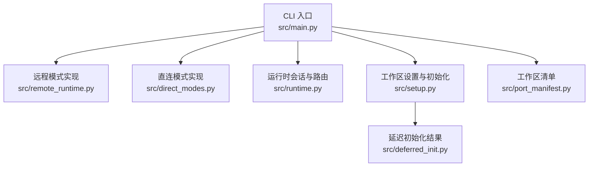
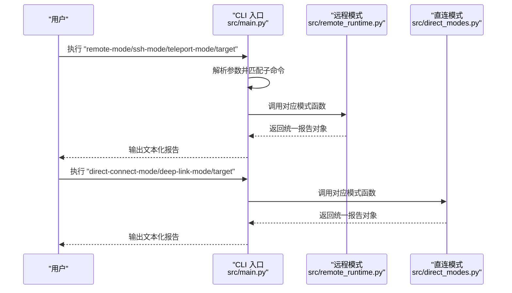
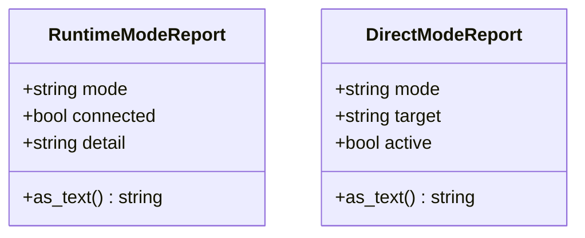
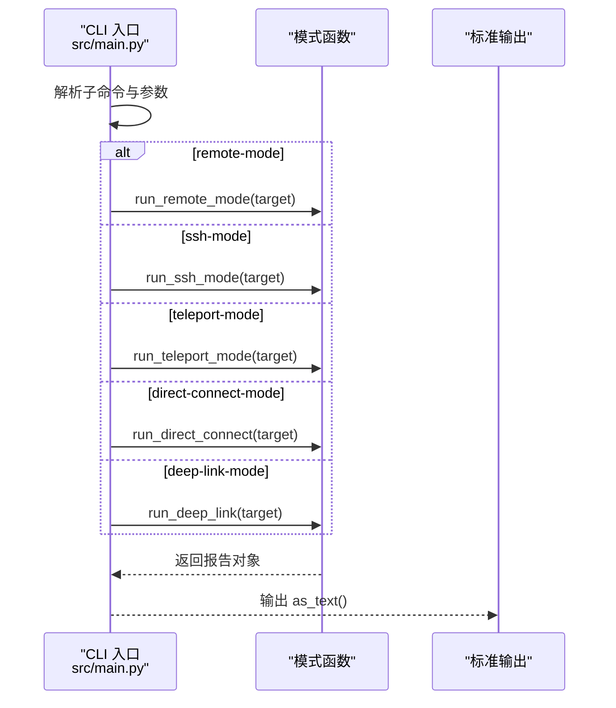
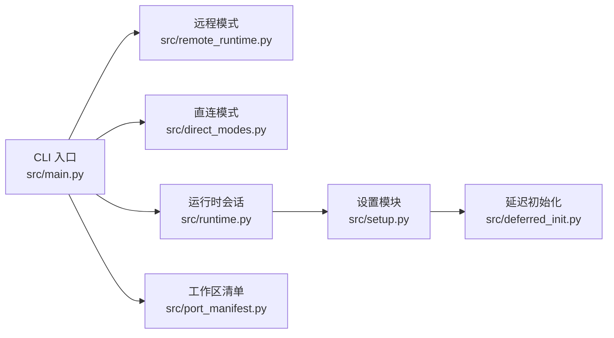

# 运行模式命令

<cite>
**本文引用的文件**
- [README.md](file://README.md)
- [main.py](file://src/main.py)
- [remote_runtime.py](file://src/remote_runtime.py)
- [direct_modes.py](file://src/direct_modes.py)
- [runtime.py](file://src/runtime.py)
- [test_porting_workspace.py](file://tests/test_porting_workspace.py)
- [setup.py](file://src/setup.py)
- [port_manifest.py](file://src/port_manifest.py)
- [deferred_init.py](file://src/deferred_init.py)
</cite>

## 目录
1. [简介](#简介)
2. [项目结构](#项目结构)
3. [核心组件](#核心组件)
4. [架构总览](#架构总览)
5. [详细组件分析](#详细组件分析)
6. [依赖关系分析](#依赖关系分析)
7. [性能考虑](#性能考虑)
8. [故障排查指南](#故障排查指南)
9. [结论](#结论)
10. [附录](#附录)

## 简介
本文件系统性梳理 CLAW 项目的“运行模式命令”，聚焦以下五类模式命令：remote-mode、ssh-mode、teleport-mode、direct-connect-mode、deep-link-mode。文档从功能与定位、参数与输出、典型使用场景、配置要点与最佳实践等维度展开，并结合仓库中现有实现进行说明，帮助读者在远程协作与分布式开发中正确选择与使用这些模式。

## 项目结构
围绕运行模式命令的相关代码主要位于 Python 工作区的 src/ 目录中，入口为 CLI 入口模块；远程与直连两类模式分别由独立模块提供占位式实现；配套的运行时与设置模块用于支撑整体工作流。

图表来源
- [main.py:68-91](file://src/main.py#L68-L91)
- [remote_runtime.py:16-25](file://src/remote_runtime.py#L16-L25)
- [direct_modes.py:16-21](file://src/direct_modes.py#L16-L21)
- [runtime.py:89-152](file://src/runtime.py#L89-L152)
- [setup.py:64-77](file://src/setup.py#L64-L77)
- [deferred_init.py:23-31](file://src/deferred_init.py#L23-L31)
- [port_manifest.py:30-52](file://src/port_manifest.py#L30-L52)

章节来源
- [README.md:82-98](file://README.md#L82-L98)
- [main.py:68-91](file://src/main.py#L68-L91)

## 核心组件
- CLI 子命令定义与分发：在 CLI 入口模块中注册并解析 remote-mode、ssh-mode、teleport-mode、direct-connect-mode、deep-link-mode 五个子命令，均接收一个目标参数 target。
- 远程模式实现：提供 remote、ssh、teleport 三种模式的占位式返回对象，包含模式名、连接状态与详情文本。
- 直连模式实现：提供 direct-connect 与 deep-link 两种模式的占位式返回对象，包含模式名、目标与激活状态。
- 运行时会话与路由：提供提示词路由、引导会话构建、多轮对话循环等能力，作为更完整的运行时基础（当前模式命令本身为占位）。
- 设置与初始化：负责工作区设置、预取与延迟初始化，支撑可信模式下的扩展能力。

章节来源
- [main.py:68-91](file://src/main.py#L68-L91)
- [main.py:171-184](file://src/main.py#L171-L184)
- [remote_runtime.py:6-25](file://src/remote_runtime.py#L6-L25)
- [direct_modes.py:6-21](file://src/direct_modes.py#L6-L21)
- [runtime.py:89-152](file://src/runtime.py#L89-L152)
- [setup.py:64-77](file://src/setup.py#L64-L77)
- [deferred_init.py:23-31](file://src/deferred_init.py#L23-L31)

## 架构总览
下图展示 CLI 如何将用户输入映射到各模式函数，并输出统一格式的报告文本。

图表来源
- [main.py:68-91](file://src/main.py#L68-L91)
- [main.py:171-184](file://src/main.py#L171-L184)
- [remote_runtime.py:16-25](file://src/remote_runtime.py#L16-L25)
- [direct_modes.py:16-21](file://src/direct_modes.py#L16-L21)

## 详细组件分析

### 命令与参数
- remote-mode
  - 功能：模拟远程控制运行分支
  - 参数：target（目标标识）
  - 输出：包含模式名、连接状态、详情文本
- ssh-mode
  - 功能：模拟 SSH 运行分支
  - 参数：target（目标标识）
  - 输出：包含模式名、连接状态、详情文本
- teleport-mode
  - 功能：模拟 Teleport 恢复/创建运行分支
  - 参数：target（目标标识）
  - 输出：包含模式名、连接状态、详情文本
- direct-connect-mode
  - 功能：模拟直连运行分支
  - 参数：target（目标标识）
  - 输出：包含模式名、目标、激活状态
- deep-link-mode
  - 功能：模拟深链运行分支
  - 参数：target（目标标识）
  - 输出：包含模式名、目标、激活状态

章节来源
- [main.py:68-77](file://src/main.py#L68-L77)
- [main.py:171-184](file://src/main.py#L171-L184)
- [remote_runtime.py:16-25](file://src/remote_runtime.py#L16-L25)
- [direct_modes.py:16-21](file://src/direct_modes.py#L16-L21)

### 数据模型与输出
- 远程模式报告数据结构
  - 字段：mode、connected、detail
  - 文本化输出：按键值对形式打印
- 直连模式报告数据结构
  - 字段：mode、target、active
  - 文本化输出：按键值对形式打印

图表来源
- [remote_runtime.py:6-13](file://src/remote_runtime.py#L6-L13)
- [direct_modes.py:6-13](file://src/direct_modes.py#L6-L13)

### 使用流程与调用序列
以下序列图展示 CLI 如何根据子命令分发到具体模式函数，并输出文本化结果。

图表来源
- [main.py:171-184](file://src/main.py#L171-L184)
- [remote_runtime.py:16-25](file://src/remote_runtime.py#L16-L25)
- [direct_modes.py:16-21](file://src/direct_modes.py#L16-L21)

### 实际使用示例与配置指南
- 示例一：remote-mode
  - 用法：执行命令并传入目标标识
  - 预期输出：包含模式名为 remote 的文本行
  - 参考路径：[示例调用与断言:196-202](file://tests/test_porting_workspace.py#L196-L202)
- 示例二：ssh-mode
  - 用法：执行命令并传入目标标识
  - 预期输出：包含模式名为 ssh 的文本行
  - 参考路径：[示例调用与断言:196-202](file://tests/test_porting_workspace.py#L196-L202)
- 示例三：teleport-mode
  - 用法：执行命令并传入目标标识
  - 预期输出：包含模式名为 teleport 的文本行
  - 参考路径：[示例调用与断言:196-202](file://tests/test_porting_workspace.py#L196-L202)
- 示例四：direct-connect-mode
  - 用法：执行命令并传入目标标识
  - 预期输出：包含模式名为 direct-connect 的文本行
  - 参考路径：[示例调用与断言:238-244](file://tests/test_porting_workspace.py#L238-L244)
- 示例五：deep-link-mode
  - 用法：执行命令并传入目标标识
  - 预期输出：包含模式名为 deep-link 的文本行
  - 参考路径：[示例调用与断言:238-244](file://tests/test_porting_workspace.py#L238-L244)

章节来源
- [test_porting_workspace.py:196-202](file://tests/test_porting_workspace.py#L196-L202)
- [test_porting_workspace.py:238-244](file://tests/test_porting_workspace.py#L238-L244)

### 应用场景与最佳实践
- 远程协作与分布式开发
  - remote-mode/ssh-mode/teleport-mode：适用于需要通过代理或远程通道接入目标环境的场景，便于在受限网络或跨域环境中进行安全访问与会话恢复。
  - direct-connect-mode/deep-link-mode：适用于本地直连或通过特定链接直达目标环境的场景，强调快速建立连接与最小化中间层。
- 配置建议
  - 目标参数 target 应明确指向可识别的目标标识（如主机名、会话 ID 或资源标识），以便后续扩展为真实连接逻辑。
  - 在可信环境下，可结合工作区设置与延迟初始化能力启用更多功能（例如插件初始化、MCP 预取等）。
- 最佳实践
  - 将模式命令纳入自动化脚本或 CI 流水线，统一输出格式便于解析与日志采集。
  - 在团队内约定 target 的命名规范，确保跨环境一致性与可追溯性。

## 依赖关系分析
- CLI 对模式函数的依赖
  - CLI 通过子命令分发调用远程与直连模式函数，二者均返回统一的数据结构，便于一致化输出。
- 运行时与设置模块的协同
  - 运行时会话与路由模块提供更完整的运行时能力，当前模式命令为占位实现，未来可在此基础上扩展真实连接逻辑。
  - 设置模块负责工作区环境准备与可信模式下的初始化，为运行时提供基础保障。

图表来源
- [main.py:68-91](file://src/main.py#L68-L91)
- [remote_runtime.py:16-25](file://src/remote_runtime.py#L16-L25)
- [direct_modes.py:16-21](file://src/direct_modes.py#L16-L21)
- [runtime.py:89-152](file://src/runtime.py#L89-L152)
- [setup.py:64-77](file://src/setup.py#L64-L77)
- [deferred_init.py:23-31](file://src/deferred_init.py#L23-L31)
- [port_manifest.py:30-52](file://src/port_manifest.py#L30-L52)

章节来源
- [main.py:68-91](file://src/main.py#L68-L91)
- [runtime.py:89-152](file://src/runtime.py#L89-L152)
- [setup.py:64-77](file://src/setup.py#L64-L77)

## 性能考虑
- 当前模式命令均为占位实现，不涉及重计算或 IO，因此性能开销极低。
- 若未来扩展为真实连接逻辑，建议：
  - 引入超时与重试策略，避免阻塞。
  - 对输出进行结构化（如 JSON）以便机器解析，同时保留人类可读文本。
  - 在分布式场景中，优先采用连接池与并发复用，减少握手成本。

## 故障排查指南
- 常见问题
  - 子命令未识别：确认是否使用了正确的子命令名称（remote-mode、ssh-mode、teleport-mode、direct-connect-mode、deep-link-mode）。
  - 输出不符合预期：检查目标参数 target 是否有效，以及是否正确传递。
- 定位方法
  - 使用测试用例中的调用方式验证命令可用性与输出格式。
  - 结合工作区设置与清单信息，确认运行环境与模块加载情况。
- 参考路径
  - 模式命令调用与断言：[测试用例:196-202](file://tests/test_porting_workspace.py#L196-L202)、[测试用例:238-244](file://tests/test_porting_workspace.py#L238-L244)
  - 设置与清单：[设置模块:64-77](file://src/setup.py#L64-L77)、[清单模块:30-52](file://src/port_manifest.py#L30-L52)

章节来源
- [test_porting_workspace.py:196-202](file://tests/test_porting_workspace.py#L196-L202)
- [test_porting_workspace.py:238-244](file://tests/test_porting_workspace.py#L238-L244)
- [setup.py:64-77](file://src/setup.py#L64-L77)
- [port_manifest.py:30-52](file://src/port_manifest.py#L30-L52)

## 结论
- remote-mode、ssh-mode、teleport-mode、direct-connect-mode、deep-link-mode 是 CLAW 项目中用于描述与模拟不同运行分支的占位式命令。它们通过统一的数据结构输出文本化报告，便于在自动化与日志系统中进行解析与处理。
- 在远程协作与分布式开发中，这些模式命令可作为统一接口，承载未来对接真实远程/直连能力的扩展点。建议在团队内约定参数规范与输出格式，确保跨环境一致性与可观测性。

## 附录
- 快速参考
  - remote-mode target：输出包含模式名为 remote 的文本行
  - ssh-mode target：输出包含模式名为 ssh 的文本行
  - teleport-mode target：输出包含模式名为 teleport 的文本行
  - direct-connect-mode target：输出包含模式名为 direct-connect 的文本行
  - deep-link-mode target：输出包含模式名为 deep-link 的文本行
- 参考路径
  - CLI 定义与分发：[命令注册与分发:68-91](file://src/main.py#L68-L91)、[命令执行:171-184](file://src/main.py#L171-L184)
  - 模式实现：[远程模式:16-25](file://src/remote_runtime.py#L16-L25)、[直连模式:16-21](file://src/direct_modes.py#L16-L21)
  - 测试验证：[模式命令测试:196-202](file://tests/test_porting_workspace.py#L196-L202)、[直连模式测试:238-244](file://tests/test_porting_workspace.py#L238-L244)