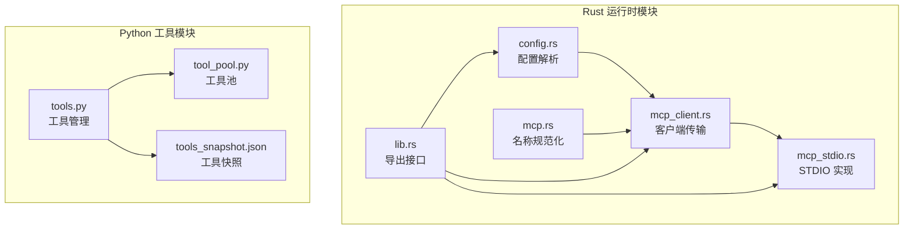
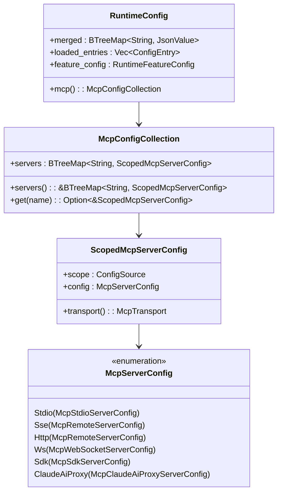
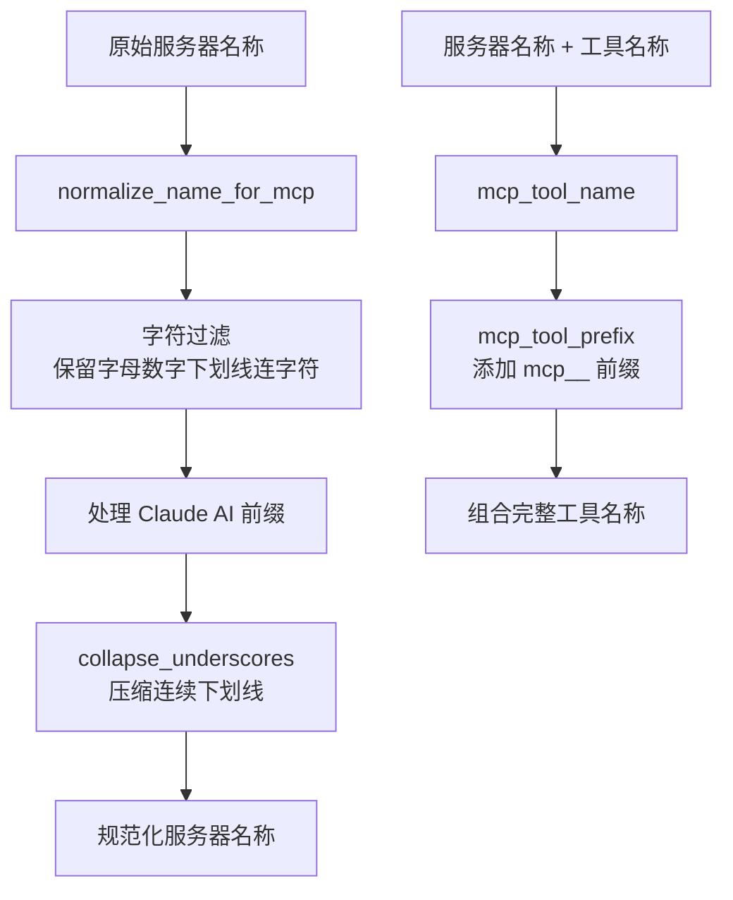
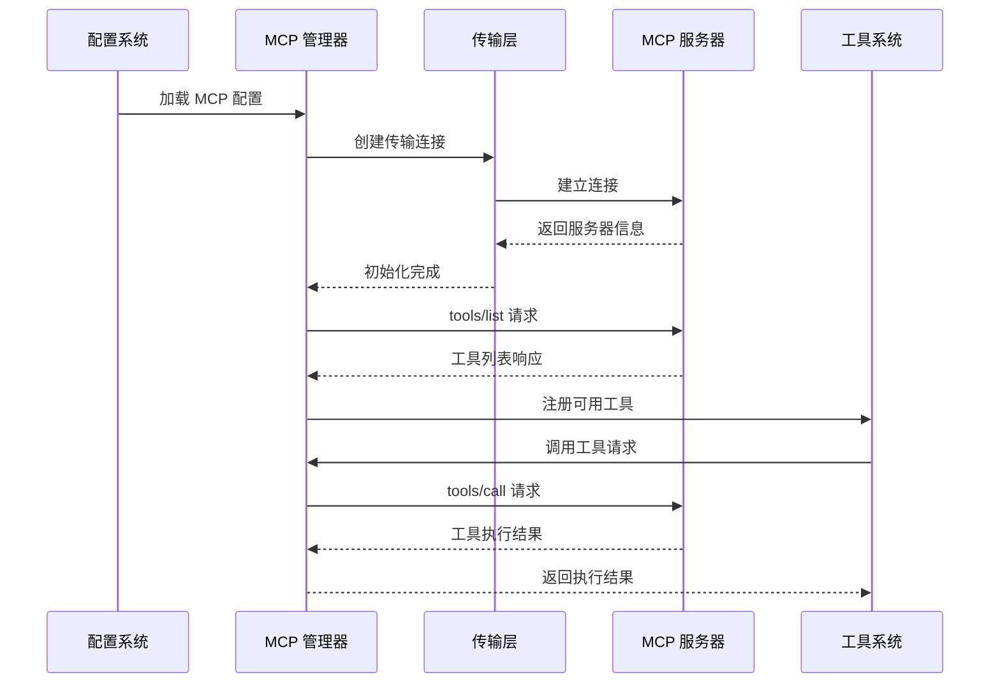
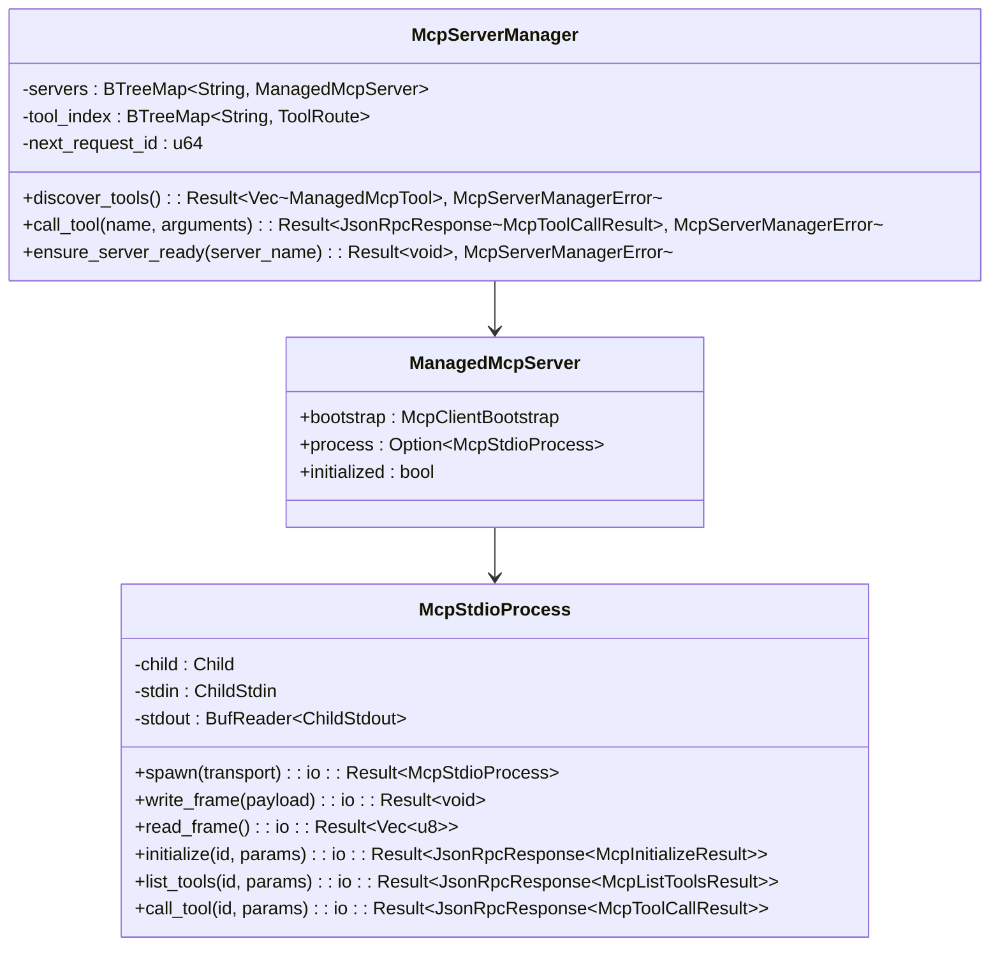
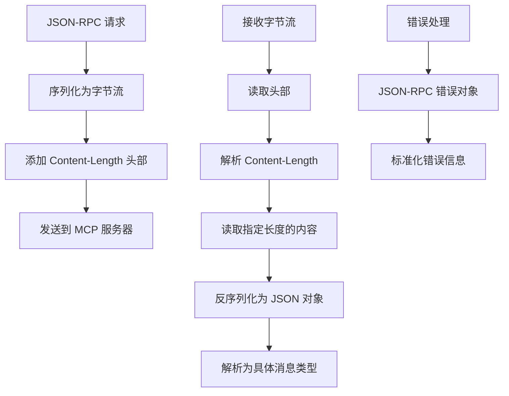
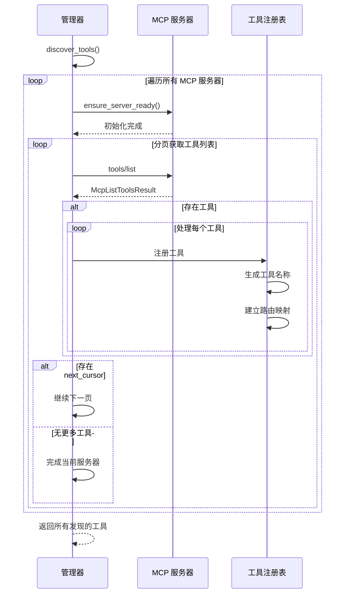
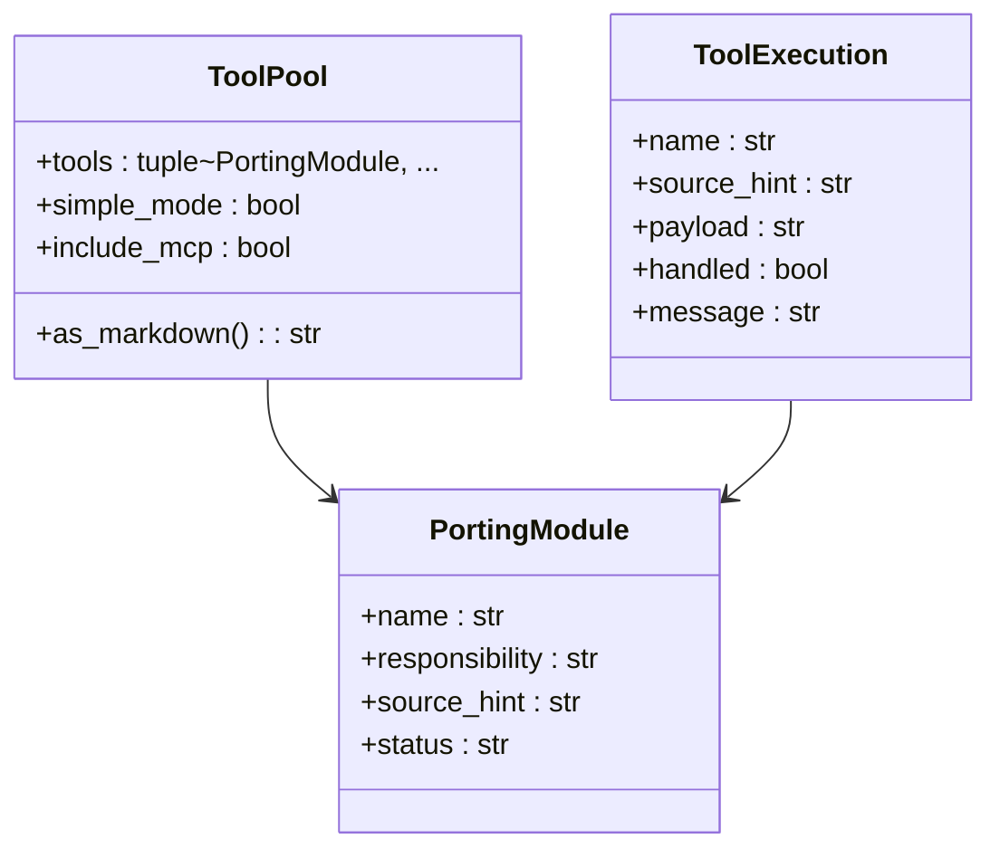
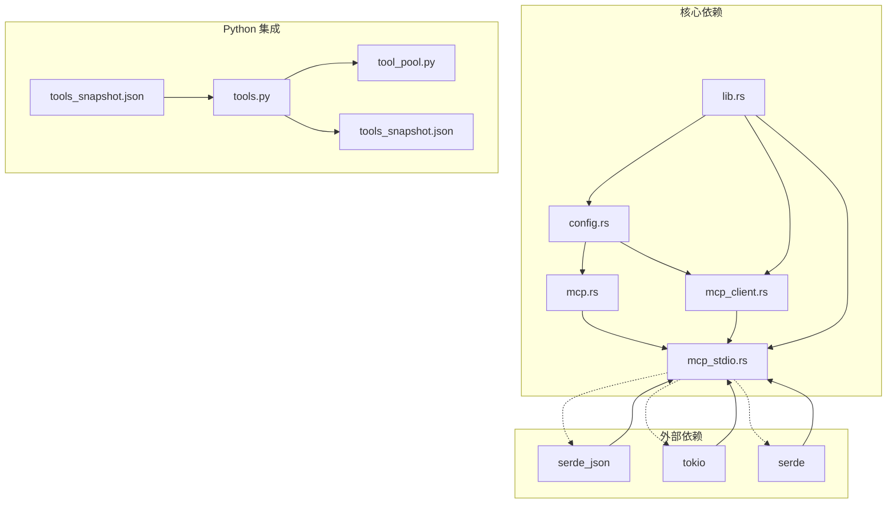

# MCP 协议支持

<cite>
**本文档引用的文件**
- [mcp.rs](file://rust/crates/runtime/src/mcp.rs)
- [mcp_client.rs](file://rust/crates/runtime/src/mcp_client.rs)
- [mcp_stdio.rs](file://rust/crates/runtime/src/mcp_stdio.rs)
- [config.rs](file://rust/crates/runtime/src/config.rs)
- [lib.rs](file://rust/crates/runtime/src/lib.rs)
- [tools.py](file://src/tools.py)
- [tool_pool.py](file://src/tool_pool.py)
- [tools_snapshot.json](file://src/reference_data/tools_snapshot.json)
</cite>

## 目录
1. [简介](#简介)
2. [项目结构](#项目结构)
3. [核心组件](#核心组件)
4. [架构概览](#架构概览)
5. [详细组件分析](#详细组件分析)
6. [依赖分析](#依赖分析)
7. [性能考虑](#性能考虑)
8. [故障排除指南](#故障排除指南)
9. [结论](#结论)
10. [附录](#附录)

## 简介

CLAW 项目实现了对 MCP（Model Context Protocol）协议的完整支持，这是一个用于连接大语言模型与外部工具和服务的标准协议。本项目提供了从配置解析、连接管理到工具发现和调用的完整解决方案。

MCP 协议允许 LLM 通过标准化的方式访问各种工具，包括本地命令行工具、远程 API 服务、文件系统资源等。CLAW 的实现支持多种传输方式，包括标准输入输出（STDIO）、HTTP、WebSocket 和 Claude AI 代理。

## 项目结构

CLAW 项目的 MCP 支持主要分布在以下模块中：

**图表来源**
- [config.rs:1-1389](file://rust/crates/runtime/src/config.rs#L1-L1389)
- [mcp.rs:1-301](file://rust/crates/runtime/src/mcp.rs#L1-L301)
- [mcp_client.rs:1-237](file://rust/crates/runtime/src/mcp_client.rs#L1-L237)
- [mcp_stdio.rs:1-1698](file://rust/crates/runtime/src/mcp_stdio.rs#L1-L1698)
- [lib.rs:1-94](file://rust/crates/runtime/src/lib.rs#L1-L94)

**章节来源**
- [config.rs:1-1389](file://rust/crates/runtime/src/config.rs#L1-L1389)
- [lib.rs:1-94](file://rust/crates/runtime/src/lib.rs#L1-L94)

## 核心组件

### 配置管理系统

CLAW 使用分层配置系统来管理 MCP 服务器配置，支持用户级、项目级和本地级配置的合并。

**图表来源**
- [config.rs:32-82](file://rust/crates/runtime/src/config.rs#L32-L82)
- [config.rs:74-102](file://rust/crates/runtime/src/config.rs#L74-L102)

### MCP 工具命名系统

为了确保工具名称的一致性和可识别性，CLAW 实现了专门的命名规范化系统：

**图表来源**
- [mcp.rs:7-37](file://rust/crates/runtime/src/mcp.rs#L7-L37)

**章节来源**
- [mcp.rs:1-301](file://rust/crates/runtime/src/mcp.rs#L1-L301)
- [config.rs:74-102](file://rust/crates/runtime/src/config.rs#L74-L102)

## 架构概览

CLAW 的 MCP 架构采用分层设计，从配置解析到工具执行形成完整的处理链：

**图表来源**
- [mcp_stdio.rs:319-571](file://rust/crates/runtime/src/mcp_stdio.rs#L319-L571)
- [mcp_client.rs:57-68](file://rust/crates/runtime/src/mcp_client.rs#L57-L68)

## 详细组件分析

### STDIO 传输实现

STDIO 传输是 CLAW 支持的主要传输方式之一，适用于本地进程间通信：

**图表来源**
- [mcp_stdio.rs:573-766](file://rust/crates/runtime/src/mcp_stdio.rs#L573-L766)
- [mcp_stdio.rs:311-352](file://rust/crates/runtime/src/mcp_stdio.rs#L311-L352)

### JSON-RPC 消息序列化

CLAW 实现了完整的 JSON-RPC 2.0 协议支持，包括消息格式化和错误处理：

**图表来源**
- [mcp_stdio.rs:640-687](file://rust/crates/runtime/src/mcp_stdio.rs#L640-L687)

### 工具发现和注册流程

MCP 工具的发现和注册是一个异步的多步骤过程：

**图表来源**
- [mcp_stdio.rs:359-431](file://rust/crates/runtime/src/mcp_stdio.rs#L359-L431)

**章节来源**
- [mcp_stdio.rs:1-1698](file://rust/crates/runtime/src/mcp_stdio.rs#L1-L1698)
- [mcp_client.rs:1-237](file://rust/crates/runtime/src/mcp_client.rs#L1-L237)

### Python 工具集成

CLAW 提供了 Python 层面的工具集成，支持与现有工具系统的无缝对接：

**图表来源**
- [tools.py:14-86](file://src/tools.py#L14-L86)
- [tool_pool.py:10-37](file://src/tool_pool.py#L10-L37)

**章节来源**
- [tools.py:1-97](file://src/tools.py#L1-L97)
- [tool_pool.py:1-38](file://src/tool_pool.py#L1-L38)
- [tools_snapshot.json:1-800](file://src/reference_data/tools_snapshot.json#L1-L800)

## 依赖分析

CLAW 的 MCP 实现具有清晰的模块化依赖关系：

**图表来源**
- [lib.rs:1-94](file://rust/crates/runtime/src/lib.rs#L1-L94)

**章节来源**
- [lib.rs:1-94](file://rust/crates/runtime/src/lib.rs#L1-L94)

## 性能考虑

### 连接管理优化

CLAW 在连接管理方面采用了多项优化策略：

1. **延迟初始化**：仅在需要时启动 MCP 服务器进程
2. **连接复用**：同一服务器的多次调用复用已建立的连接
3. **批量工具发现**：支持分页获取工具列表，避免一次性加载大量数据

### 内存管理

- 使用 BTreeMap 保证配置项的有序存储和快速查找
- 采用惰性加载策略，只在需要时解析和验证配置
- 工具索引使用哈希表实现 O(1) 查找性能

### 异步处理

- 所有网络操作采用异步 I/O 模型
- 使用 Tokio 运行时提供高效的并发处理能力
- JSON-RPC 消息处理采用流式解析，减少内存占用

## 故障排除指南

### 常见配置问题

**问题：MCP 服务器无法启动**
- 检查 `mcpServers` 配置中的 `command` 字段是否正确
- 验证可执行文件路径和权限设置
- 确认环境变量配置正确

**问题：工具发现失败**
- 检查 MCP 服务器是否正确实现了 `tools/list` 方法
- 验证 JSON-RPC 消息格式是否符合规范
- 确认网络连接状态和防火墙设置

### 调试方法

1. **启用详细日志**：通过环境变量设置日志级别
2. **检查配置合并**：验证不同层级配置的合并结果
3. **网络诊断**：使用 `curl` 或类似工具测试 MCP 服务器可达性
4. **工具测试**：单独测试单个 MCP 工具的调用

**章节来源**
- [mcp_stdio.rs:220-280](file://rust/crates/runtime/src/mcp_stdio.rs#L220-L280)

## 结论

CLAW 项目的 MCP 协议支持实现了从配置解析到工具执行的完整生命周期管理。通过模块化的架构设计和完善的错误处理机制，该实现能够可靠地支持多种传输方式和复杂的工具交互场景。

主要优势包括：
- 完整的 MCP 协议实现，支持标准输入输出、HTTP、WebSocket 等传输方式
- 灵活的配置系统，支持多层级配置合并
- 高效的工具发现和注册机制
- 完善的错误处理和调试支持
- 与现有 Python 工具系统的良好集成

该实现为构建智能代理和工具自动化系统提供了坚实的基础。

## 附录

### 配置选项参考

| 配置项 | 类型 | 描述 | 默认值 |
|--------|------|------|--------|
| `mcpServers` | 对象 | MCP 服务器配置集合 | 无 |
| `type` | 字符串 | 服务器类型（stdio/http/ws/sdk/claudeai-proxy） | stdio |
| `command` | 字符串 | 启动命令 | 无 |
| `args` | 数组 | 命令参数列表 | [] |
| `env` | 对象 | 环境变量映射 | {} |
| `url` | 字符串 | 远程服务器 URL | 无 |
| `headers` | 对象 | HTTP 请求头 | {} |
| `oauth` | 对象 | OAuth 认证配置 | 无 |

### 支持的传输方式

1. **STDIO**：本地进程间通信，适合本地工具
2. **HTTP**：基于 HTTP 的远程通信
3. **WebSocket**：双向实时通信
4. **SDK**：直接 SDK 调用
5. **Claude AI 代理**：通过 Claude AI 平台代理