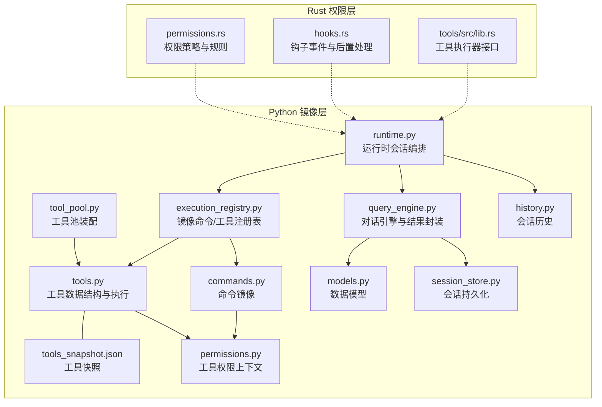
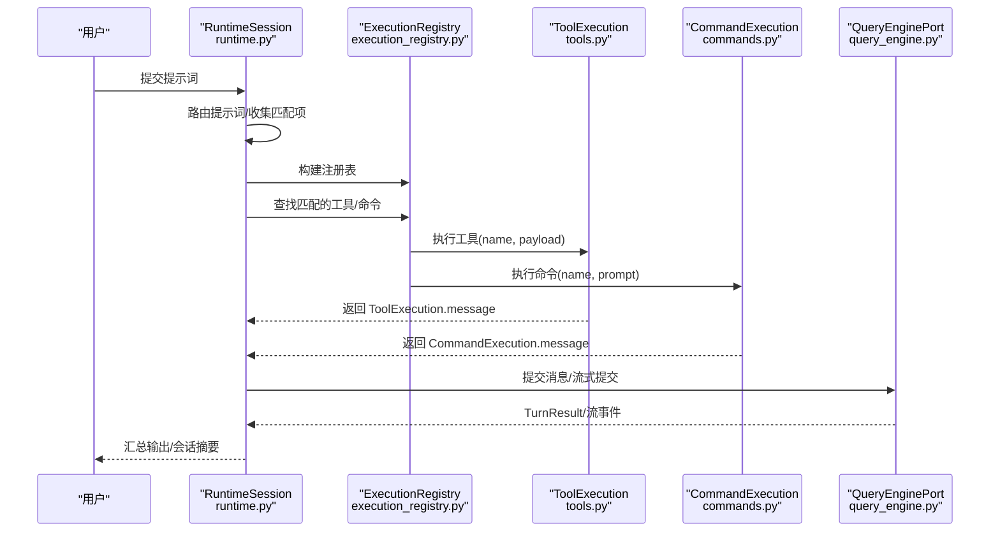
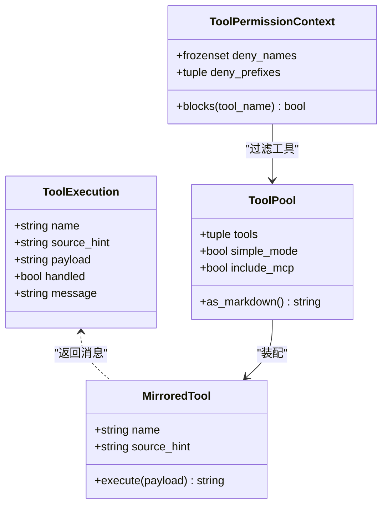
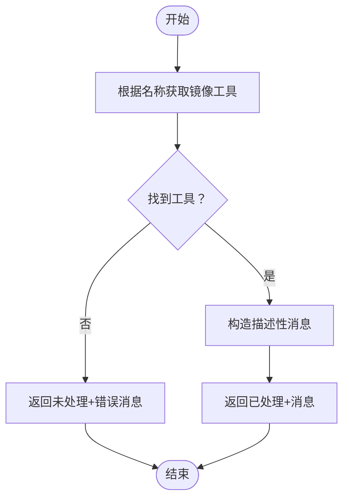
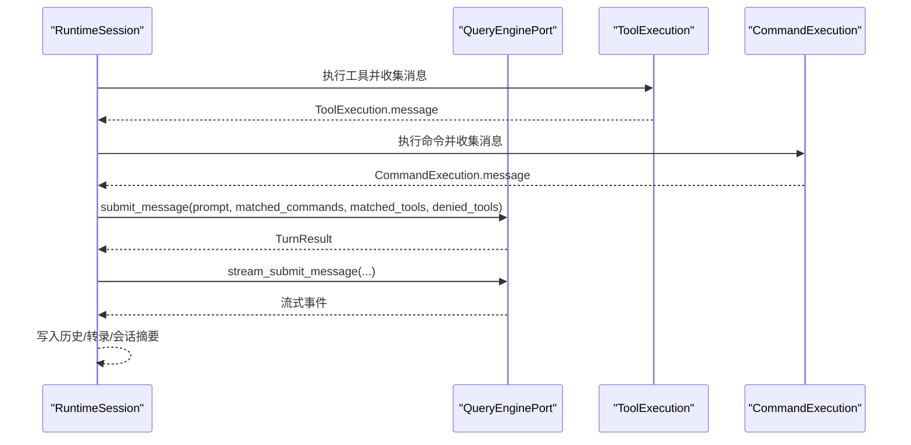
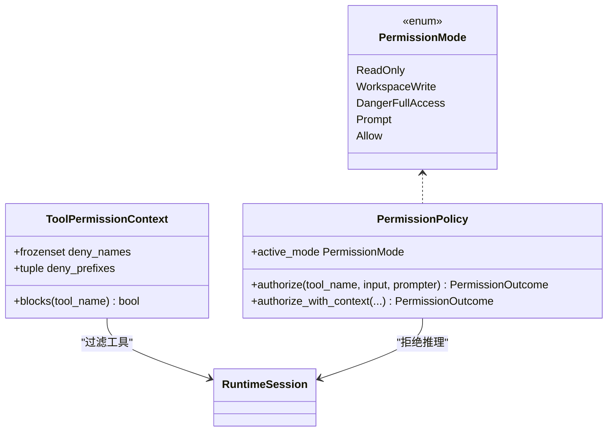
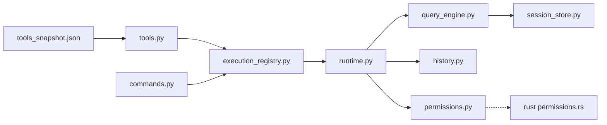

# 工具执行引擎

<cite>
**本文引用的文件**
- [src/tools.py](file://src/tools.py)
- [src/tool_pool.py](file://src/tool_pool.py)
- [src/execution_registry.py](file://src/execution_registry.py)
- [src/permissions.py](file://src/permissions.py)
- [src/runtime.py](file://src/runtime.py)
- [src/query_engine.py](file://src/query_engine.py)
- [src/models.py](file://src/models.py)
- [src/reference_data/tools_snapshot.json](file://src/reference_data/tools_snapshot.json)
- [src/history.py](file://src/history.py)
- [src/session_store.py](file://src/session_store.py)
- [src/commands.py](file://src/commands.py)
- [rust/crates/runtime/src/permissions.rs](file://rust/crates/runtime/src/permissions.rs)
- [rust/crates/runtime/src/hooks.rs](file://rust/crates/runtime/src/hooks.rs)
- [rust/crates/tools/src/lib.rs](file://rust/crates/tools/src/lib.rs)
</cite>

## 目录
1. [简介](#简介)
2. [项目结构](#项目结构)
3. [核心组件](#核心组件)
4. [架构总览](#架构总览)
5. [详细组件分析](#详细组件分析)
6. [依赖分析](#依赖分析)
7. [性能考虑](#性能考虑)
8. [故障排查指南](#故障排查指南)
9. [结论](#结论)
10. [附录](#附录)

## 简介
本文件面向 CLAW 项目的“工具执行引擎”，系统化阐述工具执行流程、ToolExecution 数据结构、执行结果处理、工具调用机制、参数传递与返回值格式、错误处理与状态跟踪、消息生成、调试技巧与性能监控，以及工具执行与权限控制的集成关系。文档以 Python 层的工具镜像与 Rust 层的权限策略为双轴，帮助读者从高层到代码级全面理解工具执行链路。

## 项目结构
围绕工具执行引擎的关键模块分布如下：
- Python 镜像层：工具清单加载、工具查询与执行、命令与工具注册表、运行时会话编排、会话持久化与历史记录
- Rust 权限层：细粒度权限模式与规则匹配、权限提示器、钩子事件与后置处理
- 数据模型：工具模块、权限拒绝、使用统计等

图表来源
- [src/tools.py:1-97](file://src/tools.py#L1-L97)
- [src/tool_pool.py:1-38](file://src/tool_pool.py#L1-L38)
- [src/execution_registry.py:1-52](file://src/execution_registry.py#L1-L52)
- [src/runtime.py:1-193](file://src/runtime.py#L1-L193)
- [src/query_engine.py:1-194](file://src/query_engine.py#L1-L194)
- [src/commands.py:1-91](file://src/commands.py#L1-L91)
- [src/permissions.py:1-21](file://src/permissions.py#L1-L21)
- [src/history.py:1-23](file://src/history.py#L1-L23)
- [src/session_store.py:1-36](file://src/session_store.py#L1-L36)
- [src/models.py:1-50](file://src/models.py#L1-L50)
- [src/reference_data/tools_snapshot.json:1-800](file://src/reference_data/tools_snapshot.json#L1-L800)
- [rust/crates/runtime/src/permissions.rs:1-676](file://rust/crates/runtime/src/permissions.rs#L1-L676)
- [rust/crates/runtime/src/hooks.rs:265-425](file://rust/crates/runtime/src/hooks.rs#L265-L425)
- [rust/crates/tools/src/lib.rs:2022-2050](file://rust/crates/tools/src/lib.rs#L2022-L2050)

章节来源
- [src/tools.py:1-97](file://src/tools.py#L1-L97)
- [src/tool_pool.py:1-38](file://src/tool_pool.py#L1-L38)
- [src/execution_registry.py:1-52](file://src/execution_registry.py#L1-L52)
- [src/runtime.py:1-193](file://src/runtime.py#L1-L193)
- [src/query_engine.py:1-194](file://src/query_engine.py#L1-L194)
- [src/commands.py:1-91](file://src/commands.py#L1-L91)
- [src/permissions.py:1-21](file://src/permissions.py#L1-L21)
- [src/history.py:1-23](file://src/history.py#L1-L23)
- [src/session_store.py:1-36](file://src/session_store.py#L1-L36)
- [src/models.py:1-50](file://src/models.py#L1-L50)
- [src/reference_data/tools_snapshot.json:1-800](file://src/reference_data/tools_snapshot.json#L1-L800)
- [rust/crates/runtime/src/permissions.rs:1-676](file://rust/crates/runtime/src/permissions.rs#L1-L676)
- [rust/crates/runtime/src/hooks.rs:265-425](file://rust/crates/runtime/src/hooks.rs#L265-L425)
- [rust/crates/tools/src/lib.rs:2022-2050](file://rust/crates/tools/src/lib.rs#L2022-L2050)

## 核心组件
- ToolExecution：工具执行结果的数据载体，包含名称、来源提示、负载、是否已处理、消息文本
- ToolPermissionContext：基于名称集合与前缀集合的简单权限过滤器
- ToolPool：工具池装配器，支持简单模式与是否包含 MCP 的筛选，并注入权限上下文
- ExecutionRegistry：镜像命令与工具的注册表，提供按名称查找与执行入口
- RuntimeSession：运行时会话，聚合上下文、设置、路由匹配、命令/工具执行消息、流式事件、转录与持久化路径
- QueryEnginePort：对话引擎，负责提交消息、流式输出、令牌预算与会话压缩、结构化输出渲染
- 历史与会话：HistoryLog 记录关键步骤，session_store 提供会话持久化与加载

章节来源
- [src/tools.py:14-21](file://src/tools.py#L14-L21)
- [src/permissions.py:6-21](file://src/permissions.py#L6-L21)
- [src/tool_pool.py:10-15](file://src/tool_pool.py#L10-L15)
- [src/execution_registry.py:9-25](file://src/execution_registry.py#L9-L25)
- [src/runtime.py:16-38](file://src/runtime.py#L16-L38)
- [src/query_engine.py:15-33](file://src/query_engine.py#L15-L33)
- [src/history.py:6-14](file://src/history.py#L6-L14)
- [src/session_store.py:8-14](file://src/session_store.py#L8-L14)

## 架构总览
工具执行引擎采用“镜像层 + 引擎层 + 权限层”的分层设计：
- 镜像层：通过 tools_snapshot.json 加载工具清单，提供工具查询、筛选与执行；命令镜像同理
- 注册表层：将镜像工具/命令包装为可执行对象，统一对外暴露 execute 接口
- 引擎层：路由提示词，构建执行列表，调用镜像工具/命令，产出消息与流式事件，汇总使用统计与权限拒绝
- 权限层：在 Rust 层实现细粒度权限策略与规则匹配，支持提示与钩子事件

图表来源
- [src/runtime.py:109-152](file://src/runtime.py#L109-L152)
- [src/execution_registry.py:47-52](file://src/execution_registry.py#L47-L52)
- [src/tools.py:81-86](file://src/tools.py#L81-L86)
- [src/commands.py:75-80](file://src/commands.py#L75-L80)
- [src/query_engine.py:61-127](file://src/query_engine.py#L61-L127)

## 详细组件分析

### 组件一：工具执行数据结构与执行流程
- ToolExecution：用于承载一次工具执行的结果，字段包括名称、来源提示、负载、是否已处理、消息文本
- execute_tool：根据名称查找镜像工具，若未找到则返回未处理状态与错误消息；否则返回已处理状态与描述性消息
- 工具快照：tools_snapshot.json 提供工具名称、来源提示与职责描述，作为工具清单的权威来源

图表来源
- [src/tools.py:14-21](file://src/tools.py#L14-L21)
- [src/tools.py:81-86](file://src/tools.py#L81-L86)
- [src/permissions.py:6-21](file://src/permissions.py#L6-L21)
- [src/tool_pool.py:10-15](file://src/tool_pool.py#L10-L15)
- [src/execution_registry.py:18-25](file://src/execution_registry.py#L18-L25)

章节来源
- [src/tools.py:14-21](file://src/tools.py#L14-L21)
- [src/tools.py:81-86](file://src/tools.py#L81-L86)
- [src/reference_data/tools_snapshot.json:1-800](file://src/reference_data/tools_snapshot.json#L1-L800)
- [src/permissions.py:6-21](file://src/permissions.py#L6-L21)
- [src/tool_pool.py:10-15](file://src/tool_pool.py#L10-L15)
- [src/execution_registry.py:18-25](file://src/execution_registry.py#L18-L25)

### 组件二：工具调用机制、参数传递与返回值格式
- 参数传递：工具执行接收工具名与负载字符串；命令执行接收工具名与提示词字符串
- 返回值格式：统一返回消息字符串，便于后续组装到会话输出或流式事件中
- 过滤与筛选：支持简单模式（仅 Bash、FileRead、FileEdit）、排除 MCP 工具、按权限上下文过滤

图表来源
- [src/tools.py:81-86](file://src/tools.py#L81-L86)
- [src/commands.py:75-80](file://src/commands.py#L75-L80)

章节来源
- [src/tools.py:62-73](file://src/tools.py#L62-L73)
- [src/commands.py:60-66](file://src/commands.py#L60-L66)

### 组件三：执行结果处理与消息生成
- RuntimeSession：聚合路由匹配、命令/工具执行消息、流式事件、转录与会话摘要，最终生成 Markdown 报告
- QueryEnginePort：提交消息、流式输出、令牌预算控制、会话压缩与结构化输出渲染
- 历史记录：HistoryLog 记录关键步骤，便于回溯与审计

图表来源
- [src/runtime.py:109-152](file://src/runtime.py#L109-L152)
- [src/query_engine.py:61-127](file://src/query_engine.py#L61-L127)
- [src/history.py:12-22](file://src/history.py#L12-L22)

章节来源
- [src/runtime.py:39-86](file://src/runtime.py#L39-L86)
- [src/query_engine.py:61-104](file://src/query_engine.py#L61-L104)
- [src/history.py:12-22](file://src/history.py#L12-L22)

### 组件四：错误处理、状态跟踪与消息生成
- 未知工具/命令：返回未处理状态与明确错误消息，避免静默失败
- 权限拒绝：运行时推断部分高危工具的拒绝原因（如破坏性 Shell 执行），并记录到 TurnResult
- 使用统计：UsageSummary 基于词数估算输入/输出令牌，配合 QueryEnginePort 的预算控制
- 会话持久化：保存会话与令牌用量，支持后续加载与复盘

章节来源
- [src/tools.py:83-84](file://src/tools.py#L83-L84)
- [src/commands.py:77-78](file://src/commands.py#L77-L78)
- [src/runtime.py:169-174](file://src/runtime.py#L169-L174)
- [src/query_engine.py:34-43](file://src/query_engine.py#L34-L43)
- [src/models.py:28-37](file://src/models.py#L28-L37)
- [src/session_store.py:19-35](file://src/session_store.py#L19-L35)

### 组件五：与权限控制的集成关系
- Python 层：ToolPermissionContext 支持基于名称与前缀的简单拒绝策略
- Rust 层：PermissionPolicy 实现多层级权限模式（只读、工作区写、危险全权、提示、允许）与规则匹配，支持 ask/deny/allow 规则、钩子覆盖、提示器决策
- 集成点：运行时会话在路由阶段推断拒绝项，QueryEnginePort 在提交消息时纳入权限拒绝列表

图表来源
- [src/permissions.py:6-21](file://src/permissions.py#L6-L21)
- [rust/crates/runtime/src/permissions.rs:7-14](file://rust/crates/runtime/src/permissions.rs#L7-L14)
- [rust/crates/runtime/src/permissions.rs:91-163](file://rust/crates/runtime/src/permissions.rs#L91-L163)
- [src/runtime.py:169-174](file://src/runtime.py#L169-L174)

章节来源
- [src/permissions.py:11-21](file://src/permissions.py#L11-L21)
- [rust/crates/runtime/src/permissions.rs:91-325](file://rust/crates/runtime/src/permissions.rs#L91-L325)
- [src/runtime.py:169-174](file://src/runtime.py#L169-L174)

### 组件六：调试技巧与性能监控
- 调试技巧
  - 使用运行时会话的 as_markdown 输出快速定位路由匹配、命令/工具执行消息、流式事件与历史记录
  - 利用 QueryEnginePort.render_summary 查看会话 ID、存储回合数、权限拒绝数、使用总计与预算配置
  - 结合会话持久化路径进行离线复盘
- 性能监控
  - 使用 UsageSummary 估算令牌消耗，结合 QueryEngineConfig.max_budget_tokens 控制成本
  - 合理设置 compact_after_turns 降低内存占用
  - 通过 simple_mode 限制工具集规模，减少路由与执行开销

章节来源
- [src/runtime.py:39-86](file://src/runtime.py#L39-L86)
- [src/query_engine.py:171-194](file://src/query_engine.py#L171-L194)
- [src/models.py:28-37](file://src/models.py#L28-L37)
- [src/query_engine.py:16-22](file://src/query_engine.py#L16-L22)

## 依赖分析
- 组件耦合
  - tools.py 与 tools_snapshot.json 强耦合，确保工具清单一致性
  - execution_registry.py 依赖 tools.py 与 commands.py 的镜像工具/命令
  - runtime.py 依赖 execution_registry.py、query_engine.py、history.py、session_store.py
  - Rust 权限层与运行时会话通过拒绝推理与会话摘要集成
- 外部依赖
  - JSON 序列化用于结构化输出与会话持久化
  - LRU 缓存用于工具/命令快照的高效加载

图表来源
- [src/reference_data/tools_snapshot.json:1-800](file://src/reference_data/tools_snapshot.json#L1-L800)
- [src/tools.py:23-34](file://src/tools.py#L23-L34)
- [src/execution_registry.py:47-52](file://src/execution_registry.py#L47-L52)
- [src/runtime.py:109-152](file://src/runtime.py#L109-L152)
- [src/query_engine.py:140-150](file://src/query_engine.py#L140-L150)
- [src/history.py:12-22](file://src/history.py#L12-L22)
- [src/session_store.py:19-35](file://src/session_store.py#L19-L35)
- [src/permissions.py:6-21](file://src/permissions.py#L6-L21)
- [rust/crates/runtime/src/permissions.rs:91-163](file://rust/crates/runtime/src/permissions.rs#L91-L163)

章节来源
- [src/tools.py:23-34](file://src/tools.py#L23-L34)
- [src/execution_registry.py:47-52](file://src/execution_registry.py#L47-L52)
- [src/runtime.py:109-152](file://src/runtime.py#L109-L152)
- [src/query_engine.py:140-150](file://src/query_engine.py#L140-L150)
- [src/session_store.py:19-35](file://src/session_store.py#L19-L35)
- [rust/crates/runtime/src/permissions.rs:91-163](file://rust/crates/runtime/src/permissions.rs#L91-L163)

## 性能考虑
- 工具快照缓存：LRU 缓存工具/命令快照，避免重复解析 JSON
- 会话压缩：超过阈值自动裁剪消息列表，降低内存与 IO 压力
- 令牌预算：通过 max_budget_tokens 限制输出规模，防止过度消耗
- 简单模式：在开发/测试场景下缩小工具集，提升路由与执行效率

章节来源
- [src/tools.py:23-34](file://src/tools.py#L23-L34)
- [src/commands.py:22-33](file://src/commands.py#L22-L33)
- [src/query_engine.py:129-132](file://src/query_engine.py#L129-L132)
- [src/query_engine.py:16-22](file://src/query_engine.py#L16-L22)

## 故障排查指南
- 问题：工具未执行或返回未知工具
  - 检查工具名称大小写与拼写，确认在 tools_snapshot.json 中存在
  - 使用工具索引渲染函数查看可用工具列表
- 问题：权限被拒绝
  - 查看运行时会话中的权限拒绝列表与拒绝原因
  - 在 Rust 层检查权限策略与规则匹配，必要时调整 ask/deny/allow 规则
- 问题：会话过大导致内存压力
  - 调整 compact_after_turns 或开启 simple_mode
  - 检查 max_budget_tokens 设置
- 问题：调试与复盘
  - 使用会话持久化路径加载历史消息与令牌用量
  - 对比流式事件与 TurnResult，定位异常环节

章节来源
- [src/tools.py:83-84](file://src/tools.py#L83-L84)
- [src/runtime.py:169-174](file://src/runtime.py#L169-L174)
- [src/query_engine.py:129-132](file://src/query_engine.py#L129-L132)
- [src/session_store.py:19-35](file://src/session_store.py#L19-L35)

## 结论
工具执行引擎通过“镜像层 + 注册表 + 引擎层 + 权限层”的协同，实现了从提示词路由、工具/命令执行、消息生成、权限控制到会话持久化的完整闭环。Python 层提供工具清单与执行抽象，Rust 层提供细粒度权限策略与钩子扩展能力。借助会话历史与结构化输出，系统具备良好的可观测性与可调试性，适合在复杂工程场景中稳定演进。

## 附录
- 关键数据模型
  - PortingModule：工具/命令元信息
  - PermissionDenial：权限拒绝条目
  - UsageSummary：使用统计
  - ToolExecution/CommandExecution：执行结果
- 常用操作
  - 渲染工具索引与命令索引
  - 构建工具池与执行注册表
  - 启动运行时会话与流式提交

章节来源
- [src/models.py:14-26](file://src/models.py#L14-L26)
- [src/models.py:28-37](file://src/models.py#L28-L37)
- [src/tools.py:89-96](file://src/tools.py#L89-L96)
- [src/commands.py:83-90](file://src/commands.py#L83-L90)
- [src/tool_pool.py:28-37](file://src/tool_pool.py#L28-L37)
- [src/execution_registry.py:47-52](file://src/execution_registry.py#L47-L52)
- [src/runtime.py:109-152](file://src/runtime.py#L109-L152)
- [src/query_engine.py:106-127](file://src/query_engine.py#L106-L127)