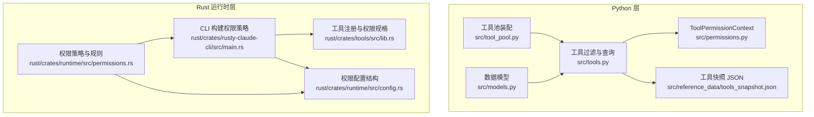
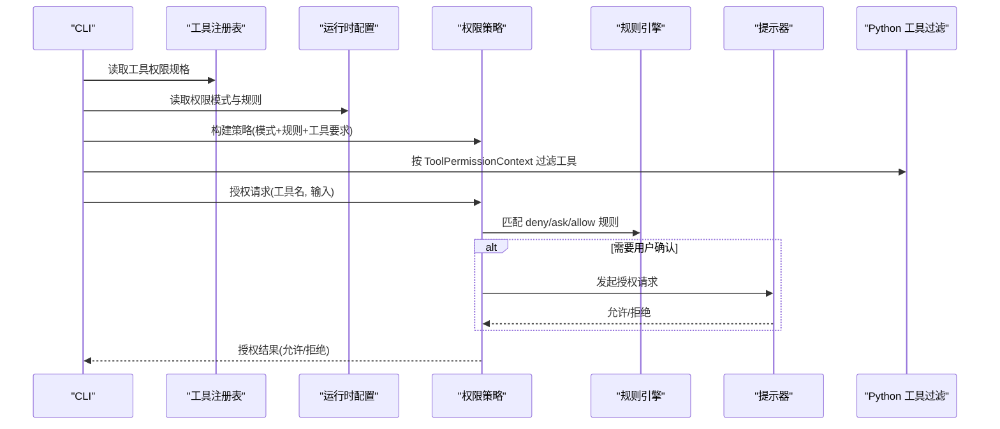
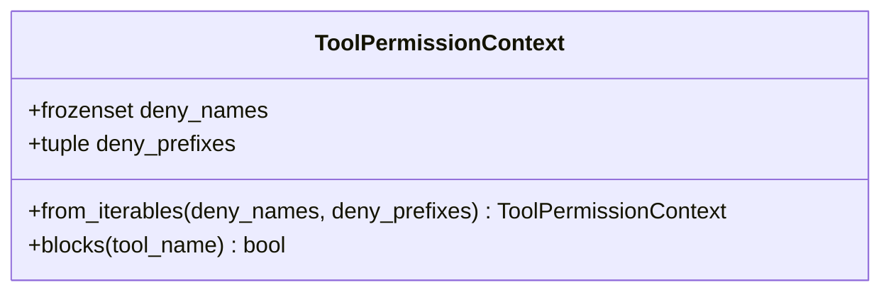
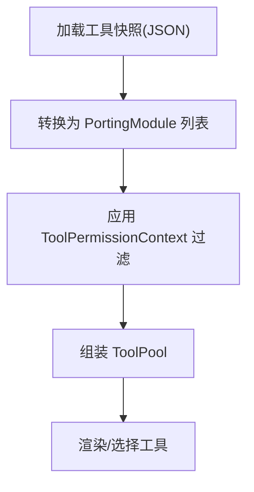
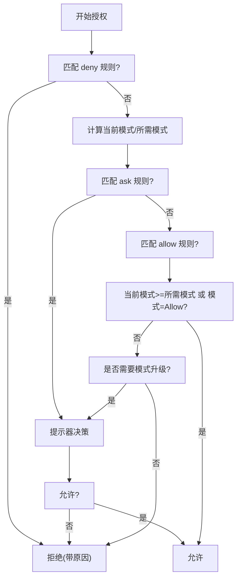
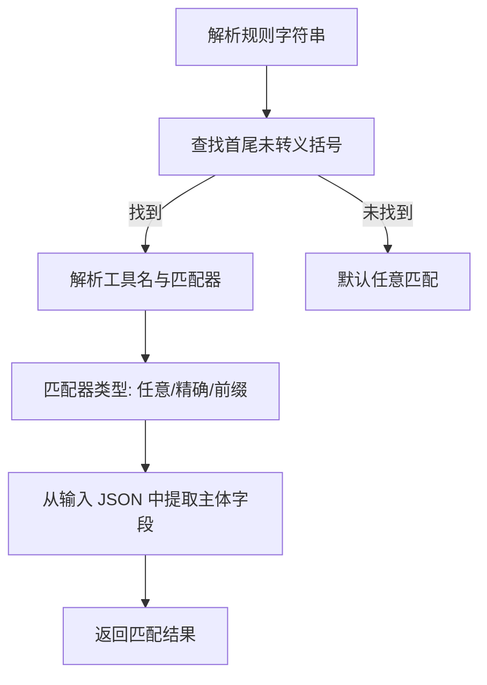
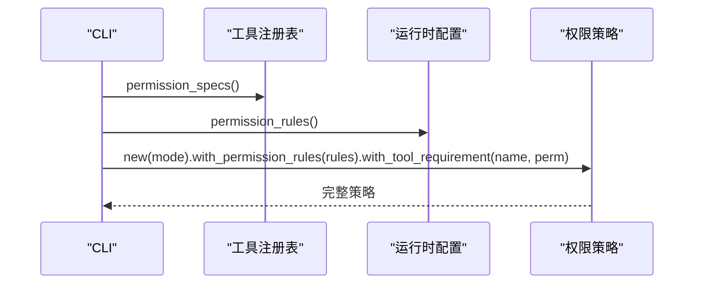
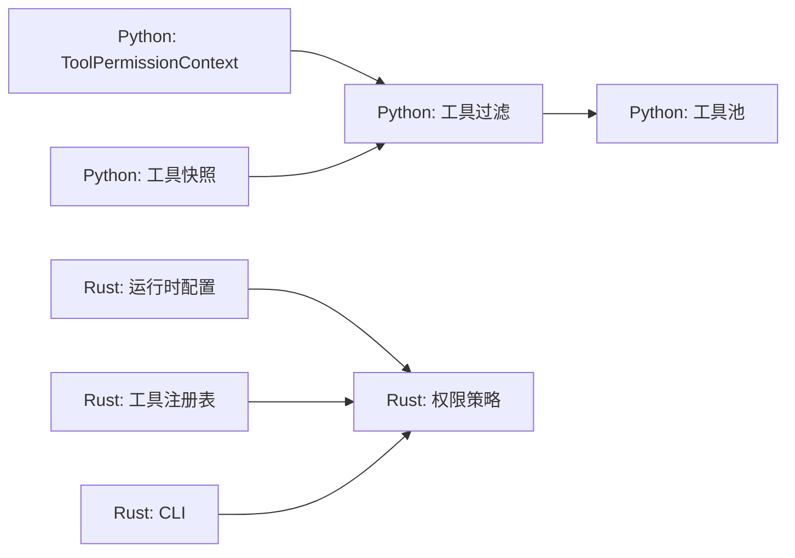

# 工具权限控制

<cite>
**本文引用的文件**
- [src/permissions.py](file://src/permissions.py)
- [src/tools.py](file://src/tools.py)
- [src/tool_pool.py](file://src/tool_pool.py)
- [src/models.py](file://src/models.py)
- [src/reference_data/tools_snapshot.json](file://src/reference_data/tools_snapshot.json)
- [rust/crates/runtime/src/permissions.rs](file://rust/crates/runtime/src/permissions.rs)
- [rust/crates/runtime/src/config.rs](file://rust/crates/runtime/src/config.rs)
- [rust/crates/tools/src/lib.rs](file://rust/crates/tools/src/lib.rs)
- [rust/crates/rusty-claude-cli/src/main.rs](file://rust/crates/rusty-claude-cli/src/main.rs)
</cite>

## 目录
1. [引言](#引言)
2. [项目结构](#项目结构)
3. [核心组件](#核心组件)
4. [架构总览](#架构总览)
5. [详细组件分析](#详细组件分析)
6. [依赖分析](#依赖分析)
7. [性能考虑](#性能考虑)
8. [故障排查指南](#故障排查指南)
9. [结论](#结论)
10. [附录](#附录)

## 引言
本文件围绕 CLAW 项目的“工具权限控制”主题，系统化梳理 ToolPermissionContext 权限上下文的设计与实现，深入解析工具访问控制策略、权限验证流程与权限决策机制；同时覆盖权限配置管理、动态权限检查与权限缓存优化，并给出安全最佳实践与审计方法，阐明工具权限与系统整体权限模型的关系。

## 项目结构
CLAW 的权限体系由 Python 层的工具筛选与 Rust 层的运行时策略共同构成：
- Python 层：提供工具清单加载、按权限上下文过滤工具列表的能力，以及工具执行的镜像行为。
- Rust 层：提供细粒度的权限模式、规则匹配、提示器接口与策略决策，支持基于输入内容的动态授权。

**图示来源**
- [src/permissions.py:6-21](file://src/permissions.py#L6-L21)
- [src/tools.py:56-72](file://src/tools.py#L56-L72)
- [src/tool_pool.py:28-37](file://src/tool_pool.py#L28-L37)
- [src/models.py:14-50](file://src/models.py#L14-L50)
- [src/reference_data/tools_snapshot.json:1-800](file://src/reference_data/tools_snapshot.json#L1-L800)
- [rust/crates/runtime/src/permissions.rs:91-325](file://rust/crates/runtime/src/permissions.rs#L91-L325)
- [rust/crates/runtime/src/config.rs:48-76](file://rust/crates/runtime/src/config.rs#L48-L76)
- [rust/crates/tools/src/lib.rs:51-187](file://rust/crates/tools/src/lib.rs#L51-L187)
- [rust/crates/rusty-claude-cli/src/main.rs:3738-3749](file://rust/crates/rusty-claude-cli/src/main.rs#L3738-L3749)

**章节来源**
- [src/permissions.py:6-21](file://src/permissions.py#L6-L21)
- [src/tools.py:56-72](file://src/tools.py#L56-L72)
- [src/tool_pool.py:28-37](file://src/tool_pool.py#L28-L37)
- [src/models.py:14-50](file://src/models.py#L14-L50)
- [src/reference_data/tools_snapshot.json:1-800](file://src/reference_data/tools_snapshot.json#L1-L800)
- [rust/crates/runtime/src/permissions.rs:91-325](file://rust/crates/runtime/src/permissions.rs#L91-L325)
- [rust/crates/runtime/src/config.rs:48-76](file://rust/crates/runtime/src/config.rs#L48-L76)
- [rust/crates/tools/src/lib.rs:51-187](file://rust/crates/tools/src/lib.rs#L51-L187)
- [rust/crates/rusty-claude-cli/src/main.rs:3738-3749](file://rust/crates/rusty-claude-cli/src/main.rs#L3738-L3749)

## 核心组件
- ToolPermissionContext（Python）：以不可变集合维护“禁止名称”和“禁止前缀”，提供快速判定工具是否被拒绝。
- 工具过滤函数：在 Python 层根据 ToolPermissionContext 对工具集合进行过滤。
- Rust 权限策略（PermissionPolicy）：定义权限模式、规则解析与匹配、提示器交互、决策分支与回退逻辑。
- 规则系统：支持 allow/deny/ask 三类规则，规则语法可限定工具名并按输入内容匹配。
- CLI 策略构建：从工具注册表与功能配置中生成最终的权限策略对象。

**章节来源**
- [src/permissions.py:6-21](file://src/permissions.py#L6-L21)
- [src/tools.py:56-72](file://src/tools.py#L56-L72)
- [rust/crates/runtime/src/permissions.rs:91-325](file://rust/crates/runtime/src/permissions.rs#L91-L325)
- [rust/crates/rusty-claude-cli/src/main.rs:3738-3749](file://rust/crates/rusty-claude-cli/src/main.rs#L3738-L3749)

## 架构总览
下图展示从工具清单到权限策略的端到端流程，包括 Python 层的工具过滤与 Rust 层的动态授权决策。

**图示来源**
- [rust/crates/rusty-claude-cli/src/main.rs:3738-3749](file://rust/crates/rusty-claude-cli/src/main.rs#L3738-L3749)
- [rust/crates/tools/src/lib.rs:157-169](file://rust/crates/tools/src/lib.rs#L157-L169)
- [rust/crates/runtime/src/permissions.rs:155-284](file://rust/crates/runtime/src/permissions.rs#L155-L284)
- [src/tools.py:56-72](file://src/tools.py#L56-L72)

## 详细组件分析

### ToolPermissionContext 设计与实现
- 不可变性：使用冻结数据类，禁止修改，保证并发安全与可复用性。
- 快速拒绝：通过小写化与集合查找，实现 O(1) 级别的名称命中与前缀匹配。
- 可构造性：提供从可迭代集合构建实例的工厂方法，便于从配置或命令行参数初始化。

**图示来源**
- [src/permissions.py:6-21](file://src/permissions.py#L6-L21)

**章节来源**
- [src/permissions.py:6-21](file://src/permissions.py#L6-L21)

### 工具访问控制策略与过滤链路
- 工具快照：Python 层从 JSON 加载工具清单，转换为只读数据模型。
- 工具过滤：在 Python 层对工具集合应用 ToolPermissionContext，剔除被拒绝的工具。
- 工具池装配：将过滤后的工具集合封装为工具池，供上层渲染或选择使用。

**图示来源**
- [src/reference_data/tools_snapshot.json:1-800](file://src/reference_data/tools_snapshot.json#L1-L800)
- [src/models.py:14-50](file://src/models.py#L14-L50)
- [src/tools.py:23-72](file://src/tools.py#L23-L72)
- [src/tool_pool.py:28-37](file://src/tool_pool.py#L28-L37)

**章节来源**
- [src/reference_data/tools_snapshot.json:1-800](file://src/reference_data/tools_snapshot.json#L1-L800)
- [src/models.py:14-50](file://src/models.py#L14-L50)
- [src/tools.py:23-72](file://src/tools.py#L23-L72)
- [src/tool_pool.py:28-37](file://src/tool_pool.py#L28-L37)

### Rust 权限策略与决策机制
- 权限模式：定义只读、工作区写入、危险全权、提示、允许等模式等级。
- 规则系统：支持 allow/deny/ask 三类规则，规则语法可限定工具名并对输入内容进行精确或前缀匹配。
- 决策流程：优先匹配 deny 规则；其次评估 ask/allow 规则与当前模式/所需模式；必要时触发提示器；最后根据模式升级需求决定是否需要用户确认。
- 提示器接口：抽象出授权请求与决策，便于集成交互式确认或自动化策略。

**图示来源**
- [rust/crates/runtime/src/permissions.rs:155-284](file://rust/crates/runtime/src/permissions.rs#L155-L284)
- [rust/crates/runtime/src/permissions.rs:318-461](file://rust/crates/runtime/src/permissions.rs#L318-L461)

**章节来源**
- [rust/crates/runtime/src/permissions.rs:7-27](file://rust/crates/runtime/src/permissions.rs#L7-L27)
- [rust/crates/runtime/src/permissions.rs:91-325](file://rust/crates/runtime/src/permissions.rs#L91-L325)
- [rust/crates/runtime/src/permissions.rs:318-461](file://rust/crates/runtime/src/permissions.rs#L318-L461)

### 规则解析与输入提取
- 规则语法：工具名后跟括号内的匹配表达式，支持通配、精确匹配与前缀匹配，并处理转义。
- 输入提取：从 JSON 输入中抽取常见字段作为权限主体，若无有效字段则以输入文本本身作为主体。

**图示来源**
- [rust/crates/runtime/src/permissions.rs:341-461](file://rust/crates/runtime/src/permissions.rs#L341-L461)

**章节来源**
- [rust/crates/runtime/src/permissions.rs:341-461](file://rust/crates/runtime/src/permissions.rs#L341-L461)

### CLI 构建权限策略
- 从工具注册表读取每个工具所需的权限模式。
- 合并运行时功能配置中的规则集。
- 组装成最终的权限策略对象，用于后续授权判断。

**图示来源**
- [rust/crates/rusty-claude-cli/src/main.rs:3738-3749](file://rust/crates/rusty-claude-cli/src/main.rs#L3738-L3749)
- [rust/crates/tools/src/lib.rs:157-169](file://rust/crates/tools/src/lib.rs#L157-L169)
- [rust/crates/runtime/src/config.rs:67-71](file://rust/crates/runtime/src/config.rs#L67-L71)

**章节来源**
- [rust/crates/rusty-claude-cli/src/main.rs:3738-3749](file://rust/crates/rusty-claude-cli/src/main.rs#L3738-L3749)
- [rust/crates/tools/src/lib.rs:157-169](file://rust/crates/tools/src/lib.rs#L157-L169)
- [rust/crates/runtime/src/config.rs:67-71](file://rust/crates/runtime/src/config.rs#L67-L71)

## 依赖分析
- Python 层依赖关系：工具过滤依赖 ToolPermissionContext；工具池装配依赖工具查询与过滤；工具清单来自 JSON 快照。
- Rust 层依赖关系：权限策略依赖配置结构与工具注册表；CLI 负责组装策略；规则解析依赖输入提取逻辑。
- 跨语言边界：Python 层负责工具清单与权限上下文的静态过滤；Rust 层负责动态授权与提示器交互。

**图示来源**
- [src/permissions.py:6-21](file://src/permissions.py#L6-L21)
- [src/tools.py:56-72](file://src/tools.py#L56-L72)
- [src/tool_pool.py:28-37](file://src/tool_pool.py#L28-L37)
- [src/reference_data/tools_snapshot.json:1-800](file://src/reference_data/tools_snapshot.json#L1-L800)
- [rust/crates/runtime/src/permissions.rs:91-325](file://rust/crates/runtime/src/permissions.rs#L91-L325)
- [rust/crates/tools/src/lib.rs:157-169](file://rust/crates/tools/src/lib.rs#L157-L169)
- [rust/crates/rusty-claude-cli/src/main.rs:3738-3749](file://rust/crates/rusty-claude-cli/src/main.rs#L3738-L3749)

**章节来源**
- [src/permissions.py:6-21](file://src/permissions.py#L6-L21)
- [src/tools.py:56-72](file://src/tools.py#L56-L72)
- [src/tool_pool.py:28-37](file://src/tool_pool.py#L28-L37)
- [src/reference_data/tools_snapshot.json:1-800](file://src/reference_data/tools_snapshot.json#L1-L800)
- [rust/crates/runtime/src/permissions.rs:91-325](file://rust/crates/runtime/src/permissions.rs#L91-L325)
- [rust/crates/tools/src/lib.rs:157-169](file://rust/crates/tools/src/lib.rs#L157-L169)
- [rust/crates/rusty-claude-cli/src/main.rs:3738-3749](file://rust/crates/rusty-claude-cli/src/main.rs#L3738-L3749)

## 性能考虑
- Python 层缓存：工具快照采用 LRU 缓存，避免重复解析 JSON，提升工具查询与渲染性能。
- Rust 层规则匹配：规则数组线性扫描，建议在规则数量可控的前提下保持高效；如需大规模规则，可考虑预索引或分桶策略。
- 字符串比较：ToolPermissionContext 使用小写化与集合查找，时间复杂度低；规则匹配中对输入 JSON 的提取为一次解析，建议在高频路径中复用解析结果或限制输入大小。
- 模式升级判断：仅在必要时触发提示器，减少交互成本。

**章节来源**
- [src/tools.py:23-34](file://src/tools.py#L23-L34)
- [rust/crates/runtime/src/permissions.rs:166-284](file://rust/crates/runtime/src/permissions.rs#L166-L284)

## 故障排查指南
- 常见问题
  - 工具未出现在列表：检查 ToolPermissionContext 是否包含该工具名或其前缀；确认工具快照是否正确加载。
  - 授权被拒绝：查看 deny 规则是否匹配；检查 ask/allow 规则与输入提取是否符合预期。
  - 需要频繁确认：确认 ask 规则是否过于宽泛；评估是否需要调整规则或提升当前模式。
- 调试建议
  - 在 Rust 层启用测试用提示器记录请求，观察授权请求的工具名、输入、当前模式与所需模式。
  - 校验规则语法与转义字符，确保规则正确解析。
  - 在 Python 层打印过滤前后的工具集合，定位过滤逻辑问题。

**章节来源**
- [rust/crates/runtime/src/permissions.rs:471-487](file://rust/crates/runtime/src/permissions.rs#L471-L487)
- [rust/crates/runtime/src/permissions.rs:341-461](file://rust/crates/runtime/src/permissions.rs#L341-L461)

## 结论
ToolPermissionContext 与 Rust 权限策略共同构成了 CLAW 的工具权限控制基础：前者负责静态的工具黑名单与前缀过滤，后者负责动态的规则匹配、模式升级与提示器交互。通过清晰的权限模式、灵活的规则系统与可扩展的提示器接口，系统在安全性与可用性之间取得平衡，并为后续扩展提供了良好的架构基础。

## 附录
- 权限模式与规则配置
  - 权限模式：只读、工作区写入、危险全权、提示、允许。
  - 规则类型：allow/deny/ask；规则语法支持工具名限定与输入内容匹配。
- 工具注册与权限规格
  - 工具注册表提供每个工具所需的权限模式，CLI 将其合并到最终策略中。
- 工具清单来源
  - Python 层从 JSON 快照加载工具清单，转换为只读数据模型，供过滤与渲染使用。

**章节来源**
- [rust/crates/runtime/src/config.rs:48-76](file://rust/crates/runtime/src/config.rs#L48-L76)
- [rust/crates/tools/src/lib.rs:157-169](file://rust/crates/tools/src/lib.rs#L157-L169)
- [src/reference_data/tools_snapshot.json:1-800](file://src/reference_data/tools_snapshot.json#L1-L800)