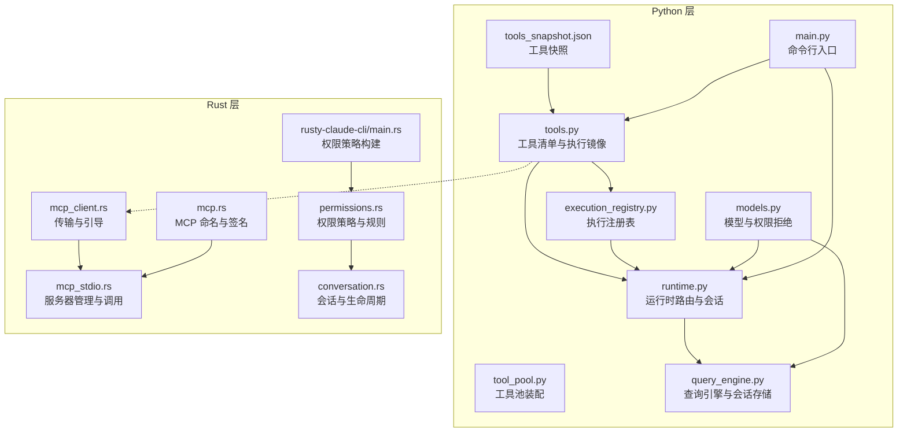
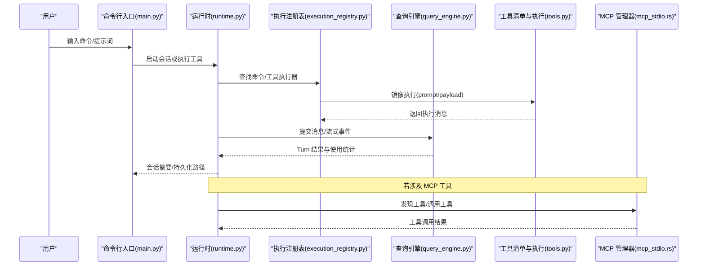
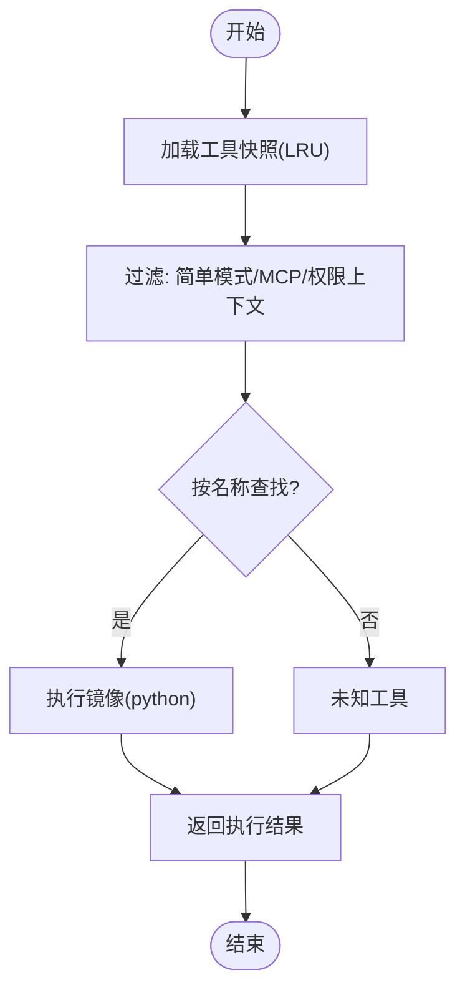
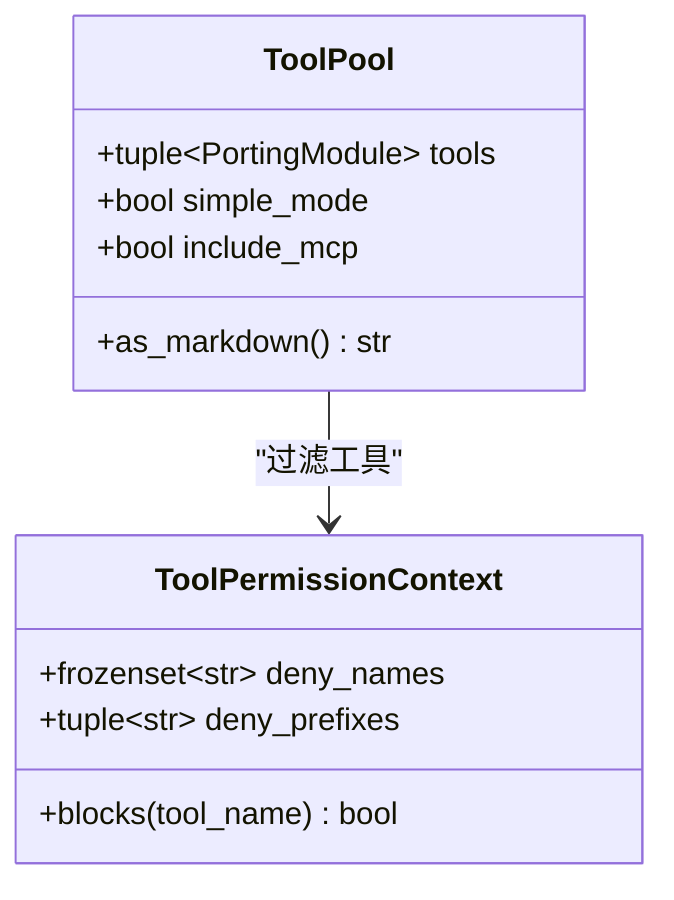
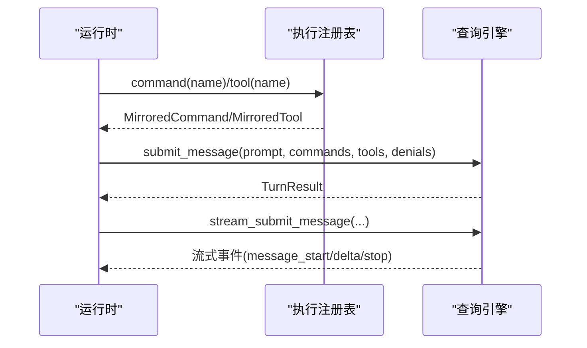
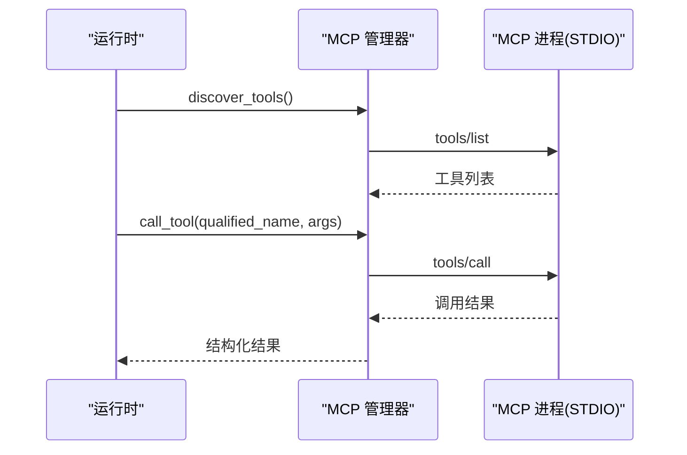
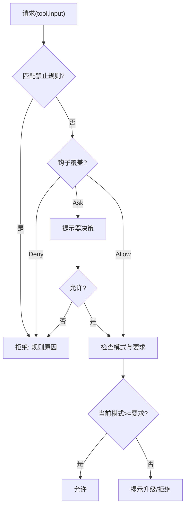
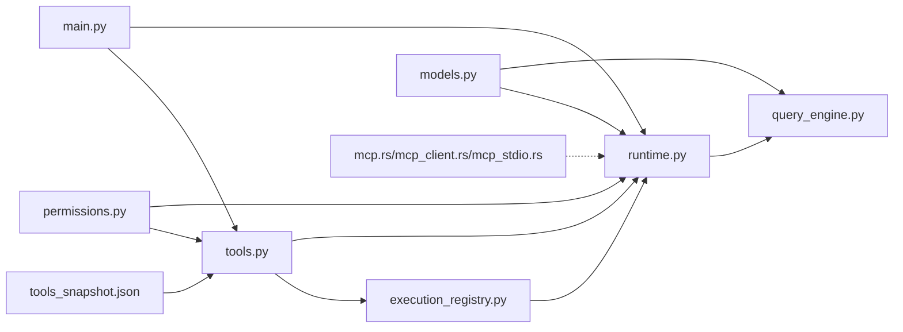

# 工具系统

<cite>
**本文引用的文件**
- [src/tools.py](file://src/tools.py)
- [src/tool_pool.py](file://src/tool_pool.py)
- [src/permissions.py](file://src/permissions.py)
- [src/runtime.py](file://src/runtime.py)
- [src/execution_registry.py](file://src/execution_registry.py)
- [src/models.py](file://src/models.py)
- [src/query_engine.py](file://src/query_engine.py)
- [src/reference_data/tools_snapshot.json](file://src/reference_data/tools_snapshot.json)
- [src/main.py](file://src/main.py)
- [rust/crates/runtime/src/mcp.rs](file://rust/crates/runtime/src/mcp.rs)
- [rust/crates/runtime/src/mcp_client.rs](file://rust/crates/runtime/src/mcp_client.rs)
- [rust/crates/runtime/src/mcp_stdio.rs](file://rust/crates/runtime/src/mcp_stdio.rs)
- [rust/crates/runtime/src/permissions.rs](file://rust/crates/runtime/src/permissions.rs)
- [rust/crates/runtime/src/conversation.rs](file://rust/crates/runtime/src/conversation.rs)
- [rust/crates/rusty-claude-cli/src/main.rs](file://rust/crates/rusty-claude-cli/src/main.rs)
</cite>

## 目录
1. [简介](#简介)
2. [项目结构](#项目结构)
3. [核心组件](#核心组件)
4. [架构总览](#架构总览)
5. [详细组件分析](#详细组件分析)
6. [依赖关系分析](#依赖关系分析)
7. [性能考量](#性能考量)
8. [故障排查指南](#故障排查指南)
9. [结论](#结论)
10. [附录](#附录)

## 简介
本文件面向 CLAW 项目的“工具系统”，系统性阐述工具的聚合、管理与执行机制，覆盖以下主题：
- 工具元数据与镜像化：工具清单来源、缓存与查询、权限过滤与检索。
- 执行路径：命令与工具的镜像执行器、执行注册表、运行时路由与会话构建。
- MCP 协议支持：工具命名规范、传输抽象、服务器发现与调用、资源读取。
- 权限控制：Python 端工具权限上下文与 Rust 端权限策略、规则匹配与提示流程。
- 生命周期管理：运行时会话、插件生命周期、MCP 服务器生命周期。
- 并发与池化：工具池装配、并发调用策略与错误处理。
- 监控、调试与性能优化：会话持久化、令牌预算、结构化输出、调试报告。

## 项目结构
工具系统由 Python 层与 Rust 层协同构成：
- Python 层负责工具清单加载、权限过滤、执行镜像、运行时会话与查询引擎。
- Rust 层负责 MCP 协议栈（命名、传输、认证、服务器管理）、权限策略与运行时会话生命周期。

**图表来源**
- [src/tools.py:1-97](file://src/tools.py#L1-L97)
- [src/tool_pool.py:1-38](file://src/tool_pool.py#L1-L38)
- [src/execution_registry.py:1-52](file://src/execution_registry.py#L1-L52)
- [src/runtime.py:1-193](file://src/runtime.py#L1-L193)
- [src/query_engine.py:1-194](file://src/query_engine.py#L1-L194)
- [src/models.py:1-50](file://src/models.py#L1-L50)
- [src/reference_data/tools_snapshot.json:1-922](file://src/reference_data/tools_snapshot.json#L1-L922)
- [src/main.py:176-213](file://src/main.py#L176-L213)
- [rust/crates/runtime/src/mcp.rs:1-301](file://rust/crates/runtime/src/mcp.rs#L1-L301)
- [rust/crates/runtime/src/mcp_client.rs:1-237](file://rust/crates/runtime/src/mcp_client.rs#L1-L237)
- [rust/crates/runtime/src/mcp_stdio.rs:430-1697](file://rust/crates/runtime/src/mcp_stdio.rs#L430-L1697)
- [rust/crates/runtime/src/permissions.rs:1-676](file://rust/crates/runtime/src/permissions.rs#L1-L676)
- [rust/crates/runtime/src/conversation.rs:136-186](file://rust/crates/runtime/src/conversation.rs#L136-L186)
- [rust/crates/rusty-claude-cli/src/main.rs:3738-3749](file://rust/crates/rusty-claude-cli/src/main.rs#L3738-L3749)

**章节来源**
- [src/tools.py:1-97](file://src/tools.py#L1-L97)
- [src/tool_pool.py:1-38](file://src/tool_pool.py#L1-L38)
- [src/execution_registry.py:1-52](file://src/execution_registry.py#L1-L52)
- [src/runtime.py:1-193](file://src/runtime.py#L1-L193)
- [src/query_engine.py:1-194](file://src/query_engine.py#L1-L194)
- [src/models.py:1-50](file://src/models.py#L1-L50)
- [src/reference_data/tools_snapshot.json:1-922](file://src/reference_data/tools_snapshot.json#L1-L922)
- [src/main.py:176-213](file://src/main.py#L176-L213)
- [rust/crates/runtime/src/mcp.rs:1-301](file://rust/crates/runtime/src/mcp.rs#L1-L301)
- [rust/crates/runtime/src/mcp_client.rs:1-237](file://rust/crates/runtime/src/mcp_client.rs#L1-L237)
- [rust/crates/runtime/src/mcp_stdio.rs:430-1697](file://rust/crates/runtime/src/mcp_stdio.rs#L430-L1697)
- [rust/crates/runtime/src/permissions.rs:1-676](file://rust/crates/runtime/src/permissions.rs#L1-L676)
- [rust/crates/runtime/src/conversation.rs:136-186](file://rust/crates/runtime/src/conversation.rs#L136-L186)
- [rust/crates/rusty-claude-cli/src/main.rs:3738-3749](file://rust/crates/rusty-claude-cli/src/main.rs#L3738-L3749)

## 核心组件
- 工具清单与执行镜像
  - 工具快照来源于 JSON 文件，通过 LRU 缓存加载为只读模块集合；提供按名称、前缀检索、简单模式与 MCP 开关过滤、权限上下文过滤等能力。
  - 执行镜像返回一个“已处理/消息”结构，便于统一渲染与后续持久化。
- 工具池装配
  - 将过滤后的工具集合封装为可 Markdown 渲染的工具池对象，支持简单模式与是否包含 MCP 的开关。
- 执行注册表
  - 将命令与工具分别映射为镜像执行器，提供按名称查找与执行。
- 运行时与查询引擎
  - 路由提示词到命令与工具，构建会话，记录历史、权限拒绝、令牌使用；查询引擎负责提交消息、流式事件、会话持久化与摘要渲染。
- 权限控制
  - Python 端提供工具权限上下文，支持按名称与前缀阻断；Rust 端提供更完整的权限策略、规则匹配、提示与钩子覆盖。
- MCP 协议支持
  - 规范化工具名、计算服务器签名、抽象传输类型（STDIO/HTTP/WS/OAuth/SSE/SDK/代理），管理服务器生命周期与工具调用。
- 生命周期管理
  - 会话初始化、插件生命周期、MCP 服务器生命周期与优雅关闭。

**章节来源**
- [src/tools.py:14-97](file://src/tools.py#L14-L97)
- [src/tool_pool.py:10-38](file://src/tool_pool.py#L10-L38)
- [src/execution_registry.py:9-52](file://src/execution_registry.py#L9-L52)
- [src/runtime.py:89-193](file://src/runtime.py#L89-L193)
- [src/query_engine.py:15-194](file://src/query_engine.py#L15-L194)
- [src/permissions.py:6-21](file://src/permissions.py#L6-L21)
- [rust/crates/runtime/src/mcp.rs:7-37](file://rust/crates/runtime/src/mcp.rs#L7-L37)
- [rust/crates/runtime/src/mcp_client.rs:6-108](file://rust/crates/runtime/src/mcp_client.rs#L6-L108)
- [rust/crates/runtime/src/mcp_stdio.rs:430-1697](file://rust/crates/runtime/src/mcp_stdio.rs#L430-L1697)
- [rust/crates/runtime/src/permissions.rs:99-325](file://rust/crates/runtime/src/permissions.rs#L99-L325)
- [rust/crates/runtime/src/conversation.rs:136-186](file://rust/crates/runtime/src/conversation.rs#L136-L186)

## 架构总览
下图展示从用户输入到工具执行与会话持久化的端到端流程，以及 MCP 服务器的发现与调用路径。

**图表来源**
- [src/main.py:176-213](file://src/main.py#L176-L213)
- [src/runtime.py:109-152](file://src/runtime.py#L109-L152)
- [src/execution_registry.py:27-52](file://src/execution_registry.py#L27-L52)
- [src/query_engine.py:61-128](file://src/query_engine.py#L61-L128)
- [src/tools.py:81-86](file://src/tools.py#L81-L86)
- [rust/crates/runtime/src/mcp_stdio.rs:430-470](file://rust/crates/runtime/src/mcp_stdio.rs#L430-L470)

## 详细组件分析

### 组件一：工具清单与执行镜像
- 数据结构
  - 工具模块：包含名称、职责、来源提示与状态。
  - 工具执行结果：包含工具名、来源提示、载荷、是否已处理、消息文本。
- 关键流程
  - 加载工具快照（LRU 缓存）→ 过滤（简单模式、是否包含 MCP、权限上下文）→ 检索与匹配 → 执行镜像 → 返回执行结果。
- 参数与结果
  - 输入：工具名、载荷字符串。
  - 输出：执行结果对象，包含是否已处理与描述性消息。
- 权限控制
  - Python 端通过工具权限上下文进行阻断（名称/前缀）。

**图表来源**
- [src/tools.py:23-86](file://src/tools.py#L23-L86)
- [src/permissions.py:18-21](file://src/permissions.py#L18-L21)

**章节来源**
- [src/tools.py:14-97](file://src/tools.py#L14-L97)
- [src/models.py:14-26](file://src/models.py#L14-L26)
- [src/permissions.py:6-21](file://src/permissions.py#L6-L21)
- [src/reference_data/tools_snapshot.json:1-922](file://src/reference_data/tools_snapshot.json#L1-L922)

### 组件二：工具池装配
- 功能：根据简单模式、MCP 开关与权限上下文装配工具池，并提供 Markdown 渲染。
- 关键点：工具集合来自工具模块列表，支持限制显示数量。

**图表来源**
- [src/tool_pool.py:10-38](file://src/tool_pool.py#L10-L38)
- [src/permissions.py:6-21](file://src/permissions.py#L6-L21)

**章节来源**
- [src/tool_pool.py:10-38](file://src/tool_pool.py#L10-L38)
- [src/permissions.py:6-21](file://src/permissions.py#L6-L21)

### 组件三：执行注册表与运行时
- 执行注册表
  - 将命令与工具分别映射为镜像执行器，提供按名称查找与执行。
- 运行时
  - 路由提示词到命令/工具，构建会话，记录历史、权限拒绝、令牌使用；支持多轮对话与停止条件。
- 查询引擎
  - 提交消息、流式事件、会话持久化、摘要渲染；内置令牌预算与紧凑策略。

**图表来源**
- [src/execution_registry.py:27-52](file://src/execution_registry.py#L27-L52)
- [src/runtime.py:109-152](file://src/runtime.py#L109-L152)
- [src/query_engine.py:61-128](file://src/query_engine.py#L61-L128)

**章节来源**
- [src/execution_registry.py:1-52](file://src/execution_registry.py#L1-L52)
- [src/runtime.py:89-193](file://src/runtime.py#L89-L193)
- [src/query_engine.py:15-194](file://src/query_engine.py#L15-L194)

### 组件四：MCP 协议支持
- 命名与签名
  - 规范化工具名与服务器名，生成稳定签名用于配置哈希与代理 URL 解包。
- 传输抽象
  - 支持 STDIO、HTTP、WebSocket、SSE、SDK、Claude AI 代理；OAuth 认证可选。
- 服务器管理
  - 发现工具、复用已启动服务器、调用工具、资源读取、错误处理与优雅关闭。
- 资源读取
  - 列出资源、读取资源内容（文本/二进制），返回结构化结果。

**图表来源**
- [rust/crates/runtime/src/mcp.rs:65-118](file://rust/crates/runtime/src/mcp.rs#L65-L118)
- [rust/crates/runtime/src/mcp_client.rs:70-108](file://rust/crates/runtime/src/mcp_client.rs#L70-L108)
- [rust/crates/runtime/src/mcp_stdio.rs:430-470](file://rust/crates/runtime/src/mcp_stdio.rs#L430-L470)
- [rust/crates/runtime/src/mcp_stdio.rs:1318-1351](file://rust/crates/runtime/src/mcp_stdio.rs#L1318-L1351)

**章节来源**
- [rust/crates/runtime/src/mcp.rs:1-301](file://rust/crates/runtime/src/mcp.rs#L1-L301)
- [rust/crates/runtime/src/mcp_client.rs:1-237](file://rust/crates/runtime/src/mcp_client.rs#L1-L237)
- [rust/crates/runtime/src/mcp_stdio.rs:430-1697](file://rust/crates/runtime/src/mcp_stdio.rs#L430-L1697)

### 组件五：权限控制与生命周期
- Python 端权限上下文
  - 支持按名称与前缀阻断工具调用。
- Rust 端权限策略
  - 定义权限模式、规则（允许/禁止/询问）、钩子覆盖、提示器决策；支持基于输入提取敏感字段进行规则匹配。
- 生命周期
  - 会话初始化与插件生命周期；MCP 服务器生命周期与重用策略。

**图表来源**
- [rust/crates/runtime/src/permissions.rs:99-325](file://rust/crates/runtime/src/permissions.rs#L99-L325)
- [rust/crates/runtime/src/conversation.rs:136-186](file://rust/crates/runtime/src/conversation.rs#L136-L186)
- [rust/crates/rusty-claude-cli/src/main.rs:3738-3749](file://rust/crates/rusty-claude-cli/src/main.rs#L3738-L3749)

**章节来源**
- [src/permissions.py:6-21](file://src/permissions.py#L6-L21)
- [rust/crates/runtime/src/permissions.rs:1-676](file://rust/crates/runtime/src/permissions.rs#L1-L676)
- [rust/crates/runtime/src/conversation.rs:136-186](file://rust/crates/runtime/src/conversation.rs#L136-L186)
- [rust/crates/rusty-claude-cli/src/main.rs:3738-3749](file://rust/crates/rusty-claude-cli/src/main.rs#L3738-L3749)

## 依赖关系分析
- Python 层内部依赖
  - tools.py 依赖 models 与 permissions；tool_pool.py 依赖 tools 与 permissions；execution_registry.py 依赖 tools；runtime.py 依赖 commands、tools、query_engine、permissions；query_engine.py 依赖 tools、commands、models。
- Python 与 Rust 的耦合点
  - Python 工具清单与 Rust MCP 管理器通过工具名规范化与服务器签名建立松耦合；CLI 入口与 Rust 权限策略在运行时共同作用。
- 外部依赖
  - MCP 服务器可通过 STDIO/HTTP/WS/OAuth/SSE/SDK/代理接入；权限策略可从配置中构建。

**图表来源**
- [src/tools.py:1-97](file://src/tools.py#L1-L97)
- [src/execution_registry.py:1-52](file://src/execution_registry.py#L1-L52)
- [src/runtime.py:1-193](file://src/runtime.py#L1-L193)
- [src/query_engine.py:1-194](file://src/query_engine.py#L1-L194)
- [src/models.py:1-50](file://src/models.py#L1-L50)
- [src/permissions.py:1-21](file://src/permissions.py#L1-L21)
- [src/reference_data/tools_snapshot.json:1-922](file://src/reference_data/tools_snapshot.json#L1-L922)
- [src/main.py:176-213](file://src/main.py#L176-L213)
- [rust/crates/runtime/src/mcp.rs:1-301](file://rust/crates/runtime/src/mcp.rs#L1-L301)
- [rust/crates/runtime/src/mcp_client.rs:1-237](file://rust/crates/runtime/src/mcp_client.rs#L1-L237)
- [rust/crates/runtime/src/mcp_stdio.rs:430-1697](file://rust/crates/runtime/src/mcp_stdio.rs#L430-L1697)

**章节来源**
- [src/tools.py:1-97](file://src/tools.py#L1-L97)
- [src/execution_registry.py:1-52](file://src/execution_registry.py#L1-L52)
- [src/runtime.py:1-193](file://src/runtime.py#L1-L193)
- [src/query_engine.py:1-194](file://src/query_engine.py#L1-L194)
- [src/models.py:1-50](file://src/models.py#L1-L50)
- [src/permissions.py:1-21](file://src/permissions.py#L1-L21)
- [src/reference_data/tools_snapshot.json:1-922](file://src/reference_data/tools_snapshot.json#L1-L922)
- [src/main.py:176-213](file://src/main.py#L176-L213)
- [rust/crates/runtime/src/mcp.rs:1-301](file://rust/crates/runtime/src/mcp.rs#L1-L301)
- [rust/crates/runtime/src/mcp_client.rs:1-237](file://rust/crates/runtime/src/mcp_client.rs#L1-L237)
- [rust/crates/runtime/src/mcp_stdio.rs:430-1697](file://rust/crates/runtime/src/mcp_stdio.rs#L430-L1697)

## 性能考量
- 工具快照缓存
  - 使用 LRU 缓存避免重复解析工具快照，提升检索与过滤性能。
- 会话与令牌预算
  - 查询引擎维护输入/输出令牌统计，超过预算提前停止，避免过度消耗。
- 会话紧凑
  - 当消息条数超过阈值时，仅保留最近若干条并压缩转录，降低内存占用。
- MCP 服务器复用
  - 发现工具后复用同一进程，减少启动开销；调用失败时提供明确错误信息以便快速定位。
- 并发策略
  - Python 层以镜像执行器串行化执行；Rust 层通过异步任务与连接池管理 MCP 服务器，建议在上层协调并发度并设置超时。

**章节来源**
- [src/tools.py:23-34](file://src/tools.py#L23-L34)
- [src/query_engine.py:61-104](file://src/query_engine.py#L61-L104)
- [src/query_engine.py:129-132](file://src/query_engine.py#L129-L132)
- [rust/crates/runtime/src/mcp_stdio.rs:1618-1657](file://rust/crates/runtime/src/mcp_stdio.rs#L1618-L1657)

## 故障排查指南
- 工具未找到
  - 检查工具名大小写与来源提示；确认是否被权限上下文阻断；核对工具快照是否包含该工具。
- 权限拒绝
  - 查看运行时会话中的权限拒绝列表；核对 Rust 权限策略规则与钩子覆盖；必要时通过提示器同意或调整策略。
- MCP 调用失败
  - 确认服务器签名与配置一致性；检查 STDIO/HTTP/WS/OAuth 设置；查看工具名规范化是否正确；关注“未知工具”错误。
- 会话异常
  - 检查会话持久化路径与消息条数；确认紧凑策略触发时机；核对预算限制导致的提前停止。
- 调试与报告
  - 使用 CLI 调试工具调用，查看最后工具调试报告；在 Rust 中启用权限提示器并记录决策原因。

**章节来源**
- [src/tools.py:81-86](file://src/tools.py#L81-L86)
- [src/runtime.py:169-174](file://src/runtime.py#L169-L174)
- [rust/crates/runtime/src/mcp_stdio.rs:442-444](file://rust/crates/runtime/src/mcp_stdio.rs#L442-L444)
- [rust/crates/rusty-claude-cli/src/main.rs:1675-1678](file://rust/crates/rusty-claude-cli/src/main.rs#L1675-L1678)

## 结论
CLAW 工具系统通过 Python 层的工具镜像与执行注册表、Rust 层的 MCP 协议栈与权限策略，实现了从工具聚合、权限控制到生命周期管理的完整闭环。其设计强调：
- 可观测性：会话持久化、流式事件、调试报告。
- 可扩展性：MCP 服务器抽象与工具名规范化。
- 可靠性：权限规则、钩子覆盖与错误处理。
- 可维护性：模块化与清晰的数据结构。

## 附录
- 自定义工具开发指南（Python 镜像）
  - 在工具快照中添加新工具条目（名称、来源提示、职责）。
  - 实现镜像执行逻辑（接收载荷，返回执行结果对象）。
  - 通过权限上下文控制访问范围。
- 自定义工具开发指南（Rust MCP）
  - 配置传输（STDIO/HTTP/WS/OAuth/SSE/SDK/代理）。
  - 实现工具发现与调用；确保工具名规范化与资源读取。
  - 在权限策略中声明工具所需权限模式与规则。
- 工具池与并发
  - 使用工具池装配器按需筛选工具；在上层协调并发度并设置超时。
- 监控与性能优化
  - 启用结构化输出与会话摘要；合理设置预算与紧凑阈值；利用调试报告定位问题。