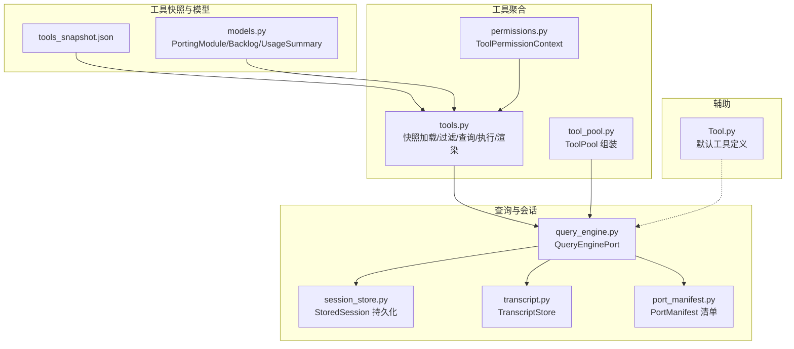
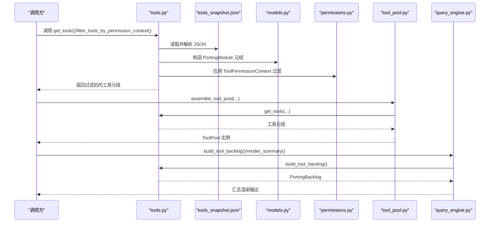
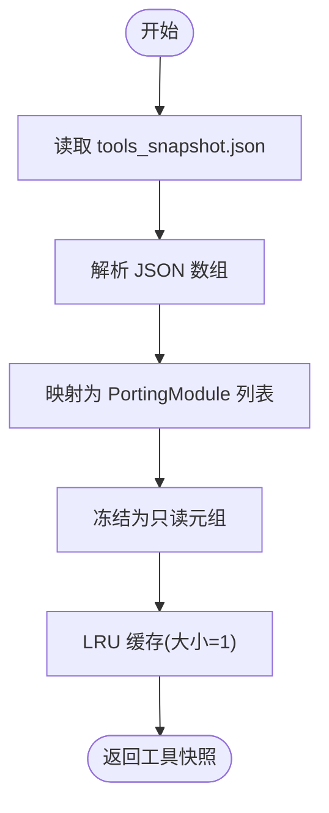
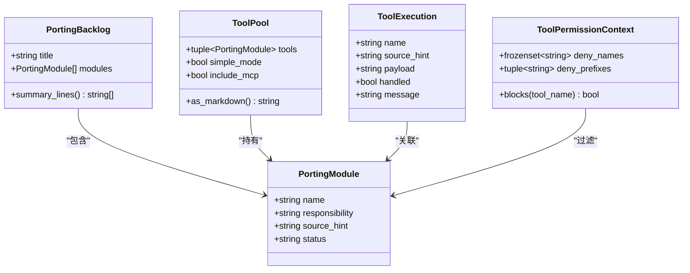
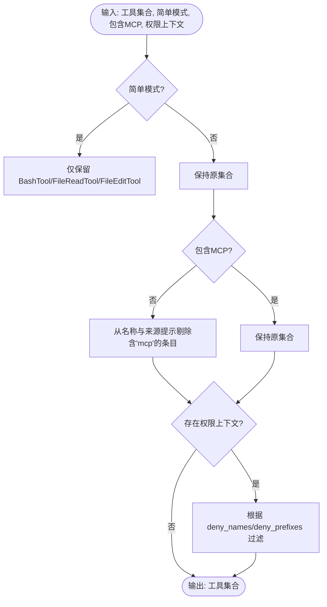
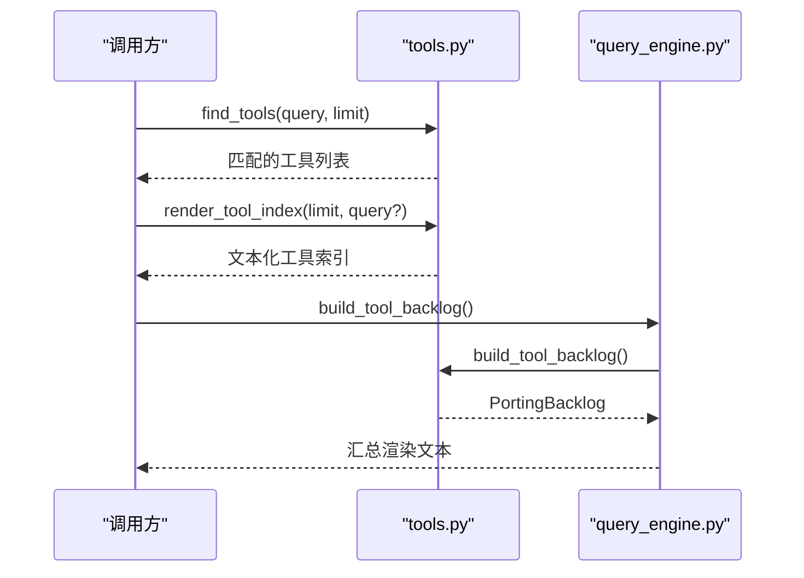
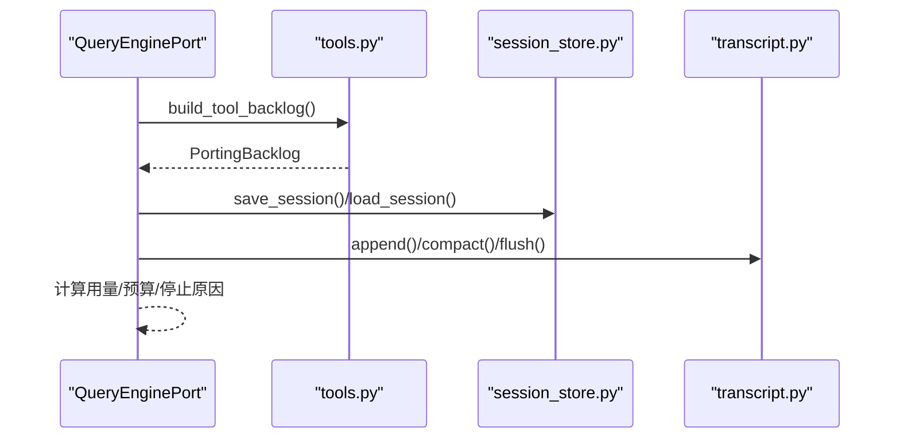
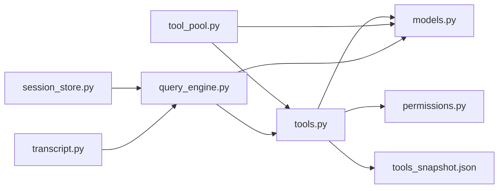

# 工具聚合管理

<cite>
**本文引用的文件**
- [src/tools.py](file://src/tools.py)
- [src/tool_pool.py](file://src/tool_pool.py)
- [src/models.py](file://src/models.py)
- [src/permissions.py](file://src/permissions.py)
- [src/port_manifest.py](file://src/port_manifest.py)
- [src/query_engine.py](file://src/query_engine.py)
- [src/reference_data/tools_snapshot.json](file://src/reference_data/tools_snapshot.json)
- [src/session_store.py](file://src/session_store.py)
- [src/transcript.py](file://src/transcript.py)
- [src/Tool.py](file://src/Tool.py)
</cite>

## 目录
1. [简介](#简介)
2. [项目结构](#项目结构)
3. [核心组件](#核心组件)
4. [架构总览](#架构总览)
5. [详细组件分析](#详细组件分析)
6. [依赖关系分析](#依赖关系分析)
7. [性能考量](#性能考量)
8. [故障排查指南](#故障排查指南)
9. [结论](#结论)
10. [附录](#附录)

## 简介
本文件系统性阐述 CLAW 项目的“工具聚合管理”能力，重点覆盖以下方面：
- 工具快照加载机制与缓存策略（含 LRU 缓存）
- 工具元数据结构与工具集合管理
- PortingModule 数据模型与工具索引构建
- 工具名称匹配算法与工具过滤逻辑
- 工具查询与渲染实现
- 工具聚合最佳实践与性能优化建议
- 工具缓存机制与 LRU 缓存策略应用

该能力以只读快照为核心，通过统一的数据模型与过滤器，为上层查询引擎与会话管理提供稳定的工具表面（tool surface）视图。

## 项目结构
围绕工具聚合管理的相关文件组织如下：
- 快照与数据模型：tools_snapshot.json、models.py
- 工具聚合入口与过滤：tools.py、tool_pool.py
- 权限控制：permissions.py
- 查询与会话：query_engine.py、session_store.py、transcript.py
- 辅助工具定义：Tool.py
- 工作区清单：port_manifest.py

图表来源
- [src/reference_data/tools_snapshot.json:1-922](file://src/reference_data/tools_snapshot.json#L1-L922)
- [src/models.py:14-50](file://src/models.py#L14-L50)
- [src/tools.py:23-37](file://src/tools.py#L23-L37)
- [src/tool_pool.py:28-37](file://src/tool_pool.py#L28-L37)
- [src/permissions.py:6-21](file://src/permissions.py#L6-L21)
- [src/query_engine.py:171-194](file://src/query_engine.py#L171-L194)
- [src/session_store.py:8-36](file://src/session_store.py#L8-L36)
- [src/transcript.py:6-24](file://src/transcript.py#L6-L24)
- [src/port_manifest.py:12-53](file://src/port_manifest.py#L12-L53)
- [src/Tool.py:6-16](file://src/Tool.py#L6-L16)

章节来源
- [src/tools.py:11-97](file://src/tools.py#L11-L97)
- [src/models.py:14-50](file://src/models.py#L14-L50)
- [src/reference_data/tools_snapshot.json:1-922](file://src/reference_data/tools_snapshot.json#L1-L922)

## 核心组件
- 工具快照加载与缓存
  - 使用 LRU 缓存加载并复用工具快照，避免重复 IO 与对象构造开销。
  - 快照路径固定，解析后转换为只读的 PortingModule 元组。
- 工具集合管理
  - 提供工具集合的构建、过滤、查询与渲染接口。
  - 支持简单模式、是否包含 MCP 工具以及权限上下文过滤。
- 数据模型
  - PortingModule：工具元数据（名称、职责、来源提示、状态）。
  - PortingBacklog：工具清单容器，支持摘要行渲染。
  - UsageSummary：会话用量统计，用于预算控制。
- 权限控制
  - ToolPermissionContext：基于名称与前缀的拒绝规则，大小写不敏感。
- 会话与转录
  - QueryEnginePort：承载会话、用量、权限拒绝记录与转录存储。
  - TranscriptStore：消息转录与紧凑化，支持 flush。

章节来源
- [src/tools.py:23-37](file://src/tools.py#L23-L37)
- [src/models.py:14-50](file://src/models.py#L14-L50)
- [src/permissions.py:6-21](file://src/permissions.py#L6-L21)
- [src/query_engine.py:35-44](file://src/query_engine.py#L35-L44)
- [src/transcript.py:6-24](file://src/transcript.py#L6-L24)

## 架构总览
工具聚合管理的运行时交互如下：

图表来源
- [src/tools.py:40-72](file://src/tools.py#L40-L72)
- [src/reference_data/tools_snapshot.json:1-922](file://src/reference_data/tools_snapshot.json#L1-L922)
- [src/models.py:14-50](file://src/models.py#L14-L50)
- [src/permissions.py:11-21](file://src/permissions.py#L11-L21)
- [src/tool_pool.py:28-37](file://src/tool_pool.py#L28-L37)
- [src/query_engine.py:171-194](file://src/query_engine.py#L171-L194)

## 详细组件分析

### 工具快照加载与缓存机制
- 加载流程
  - 从固定路径读取 JSON 快照，逐条映射为 PortingModule。
  - 使用 LRU 缓存装饰器，缓存大小为 1，确保首次加载后常驻内存。
- 复杂度与性能
  - 单次 IO 与 O(N) 的对象构造；后续访问为 O(1) 命中。
  - 适合工具集规模稳定且频繁复用的场景。
- 可靠性
  - JSON 解析失败或字段缺失将导致初始化异常，需在上游做好快照校验。

图表来源
- [src/tools.py:23-37](file://src/tools.py#L23-L37)
- [src/reference_data/tools_snapshot.json:1-922](file://src/reference_data/tools_snapshot.json#L1-L922)

章节来源
- [src/tools.py:23-37](file://src/tools.py#L23-L37)
- [src/reference_data/tools_snapshot.json:1-922](file://src/reference_data/tools_snapshot.json#L1-L922)

### 工具元数据结构与工具集合管理
- PortingModule 字段
  - name：工具名称（唯一标识之一）
  - responsibility：职责描述
  - source_hint：来源提示（如路径）
  - status：状态（默认 planned，加载时设为 mirrored）
- PortingBacklog
  - 容器持有工具列表，并提供摘要行渲染方法，便于快速概览。
- 工具集合管理
  - 构建：build_tool_backlog 将快照封装为 Backlog。
  - 名称列表：tool_names 提供字符串列表，便于 UI 或索引使用。
  - 获取单个：get_tool 基于名称精确匹配（大小写不敏感）。
  - 过滤：filter_tools_by_permission_context 结合 ToolPermissionContext 执行拒绝规则。
  - 查询：find_tools 支持子串匹配（名称与来源提示），并限制返回数量。
  - 执行：execute_tool 模拟执行，返回执行结果对象（含处理状态与消息）。
  - 渲染：render_tool_index 支持按查询渲染工具列表，带统计信息。

图表来源
- [src/models.py:14-50](file://src/models.py#L14-L50)
- [src/tools.py:14-21](file://src/tools.py#L14-L21)
- [src/permissions.py:6-21](file://src/permissions.py#L6-L21)
- [src/tool_pool.py:10-26](file://src/tool_pool.py#L10-L26)

章节来源
- [src/models.py:14-50](file://src/models.py#L14-L50)
- [src/tools.py:40-97](file://src/tools.py#L40-L97)
- [src/tool_pool.py:10-37](file://src/tool_pool.py#L10-L37)

### 工具名称匹配算法与工具过滤逻辑
- 名称匹配
  - get_tool：大小写不敏感的精确匹配，O(N) 遍历。
  - find_tools：大小写不敏感的子串匹配（名称与来源提示），并限制返回数量。
- 过滤逻辑
  - 简单模式：仅保留 BashTool、FileReadTool、FileEditTool。
  - 排除 MCP：从名称与来源提示中排除包含 “mcp” 的条目。
  - 权限过滤：基于 ToolPermissionContext 的拒绝集合与前缀集合进行拒绝判断。
- 复杂度
  - get_tool：O(N)
  - find_tools：O(N)
  - 权限过滤：O(N)
  - 简单模式与 MCP 排除：线性过滤，整体仍为 O(N)

图表来源
- [src/tools.py:62-72](file://src/tools.py#L62-L72)
- [src/permissions.py:11-21](file://src/permissions.py#L11-L21)

章节来源
- [src/tools.py:48-72](file://src/tools.py#L48-L72)
- [src/permissions.py:11-21](file://src/permissions.py#L11-L21)

### 工具索引构建、查询与渲染
- 索引构建
  - 通过 load_tool_snapshot 一次性构建只读索引（PortingModule 元组）。
- 查询
  - find_tools 支持模糊查询与数量限制，适合 UI 自动补全与筛选。
- 渲染
  - render_tool_index 输出人类可读的工具列表，包含总数、查询条件与条目摘要。
- 与查询引擎集成
  - build_tool_backlog 生成工具清单，query_engine 在汇总渲染中使用。

图表来源
- [src/tools.py:75-97](file://src/tools.py#L75-L97)
- [src/query_engine.py:171-194](file://src/query_engine.py#L171-L194)

章节来源
- [src/tools.py:75-97](file://src/tools.py#L75-L97)
- [src/query_engine.py:171-194](file://src/query_engine.py#L171-L194)

### 会话与工具聚合的协同
- 会话持久化
  - QueryEnginePort 支持保存/加载会话，结合 TranscriptStore 管理消息与紧凑化。
- 工具清单渲染
  - QueryEnginePort.render_summary 调用 build_tool_backlog 输出工具表面摘要。
- 用量控制
  - UsageSummary 用于预算控制，配合 QueryEngineConfig 的最大轮次与令牌预算。

图表来源
- [src/query_engine.py:140-151](file://src/query_engine.py#L140-L151)
- [src/session_store.py:19-36](file://src/session_store.py#L19-L36)
- [src/transcript.py:11-24](file://src/transcript.py#L11-L24)
- [src/tools.py:40-42](file://src/tools.py#L40-L42)

章节来源
- [src/query_engine.py:35-44](file://src/query_engine.py#L35-L44)
- [src/session_store.py:19-36](file://src/session_store.py#L19-L36)
- [src/transcript.py:6-24](file://src/transcript.py#L6-L24)

## 依赖关系分析
- 内部依赖
  - tools.py 依赖 models.py（PortingModule/Backlog）、permissions.py（ToolPermissionContext）、参考快照 JSON。
  - tool_pool.py 依赖 tools.py 的 get_tools 与 models.py 的 PortingModule。
  - query_engine.py 依赖 tools.py 的 build_tool_backlog 与 models.py 的 UsageSummary。
  - session_store.py 与 transcript.py 为会话与转录提供持久化与紧凑化能力。
- 外部依赖
  - JSON 解析与文件系统 IO。
  - Python 标准库（dataclasses、functools.lru_cache、pathlib）。

图表来源
- [src/tools.py:8-9](file://src/tools.py#L8-L9)
- [src/tool_pool.py:5-7](file://src/tool_pool.py#L5-L7)
- [src/query_engine.py:7-12](file://src/query_engine.py#L7-L12)
- [src/session_store.py:3-4](file://src/session_store.py#L3-L4)
- [src/transcript.py:3-4](file://src/transcript.py#L3-L4)

章节来源
- [src/tools.py:8-9](file://src/tools.py#L8-L9)
- [src/tool_pool.py:5-7](file://src/tool_pool.py#L5-L7)
- [src/query_engine.py:7-12](file://src/query_engine.py#L7-L12)

## 性能考量
- 快照缓存
  - LRU 缓存大小为 1，适合工具集稳定且多处复用的场景，避免重复 IO 与对象构造。
- 查询与过滤
  - 当前实现为线性扫描，时间复杂度 O(N)。若工具集规模增长，建议：
    - 引入名称到索引的映射字典，将 get_tool 降为 O(1)。
    - 对来源提示建立倒排索引，加速 find_tools 的子串匹配。
- 内存占用
  - PortingModule 为只读数据类，内存开销主要来自字符串与列表。可考虑共享字符串池或使用更紧凑的序列化格式。
- I/O 与解析
  - JSON 解析与磁盘读取为瓶颈，建议：
    - 在进程启动阶段预热缓存。
    - 对快照进行校验与版本化，避免运行期解析错误。
- 会话与转录
  - TranscriptStore 的紧凑化策略可减少内存占用；QueryEngine 的消息截断与预算控制有助于控制整体资源消耗。

[本节为通用性能建议，无需特定文件引用]

## 故障排查指南
- 工具快照加载失败
  - 现象：初始化时报错或返回空集合。
  - 排查：确认 tools_snapshot.json 路径正确、JSON 结构完整、字段齐全。
- 名称匹配不到工具
  - 现象：get_tool 返回 None。
  - 排查：检查名称大小写与拼写；确认工具确实在快照中。
- 查询无结果
  - 现象：find_tools 返回空列表。
  - 排查：确认查询词大小写不敏感；检查是否被简单模式或 MCP 过滤排除。
- 权限拒绝
  - 现象：工具被过滤掉。
  - 排查：核对 ToolPermissionContext 的 deny_names 与 deny_prefixes 是否包含目标工具名或前缀。
- 会话保存/加载异常
  - 现象：保存失败或加载报错。
  - 排查：确认会话目录可写；检查 JSON 文件完整性；核对 StoredSession 字段一致性。

章节来源
- [src/tools.py:23-37](file://src/tools.py#L23-L37)
- [src/tools.py:48-53](file://src/tools.py#L48-L53)
- [src/tools.py:75-78](file://src/tools.py#L75-L78)
- [src/permissions.py:18-21](file://src/permissions.py#L18-L21)
- [src/session_store.py:19-36](file://src/session_store.py#L19-L36)

## 结论
CLAW 的工具聚合管理以“只读快照 + 缓存 + 线性过滤”的方式实现了稳定高效的工具表面管理。通过统一的数据模型与过滤器，为查询引擎与会话管理提供了清晰、可扩展的工具视图。针对大规模工具集，建议引入索引与倒排结构以进一步提升查询与匹配性能。

[本节为总结性内容，无需特定文件引用]

## 附录
- 默认工具定义
  - Tool.py 中定义了默认工具（port_manifest、query_engine），可用于工作区概览与端口迁移摘要。
- 工具清单生成
  - port_manifest.py 提供工作区 Python 文件清单与模块统计，辅助理解工具表面的背景。

章节来源
- [src/Tool.py:6-16](file://src/Tool.py#L6-L16)
- [src/port_manifest.py:30-53](file://src/port_manifest.py#L30-L53)