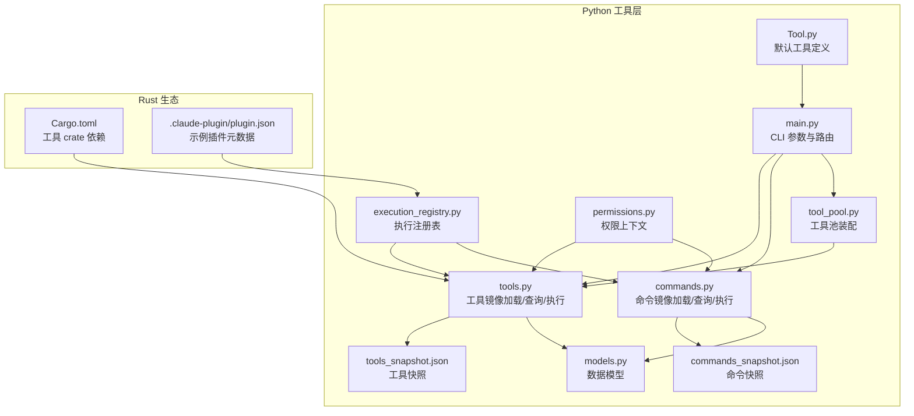
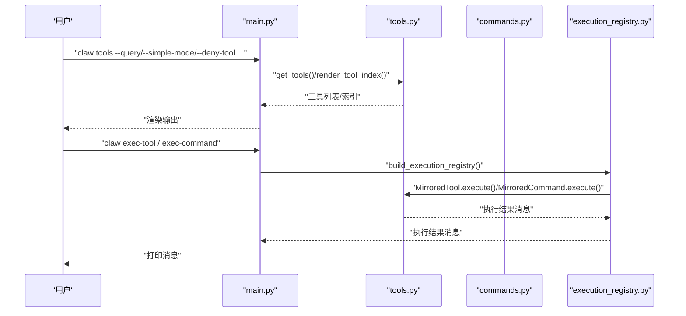
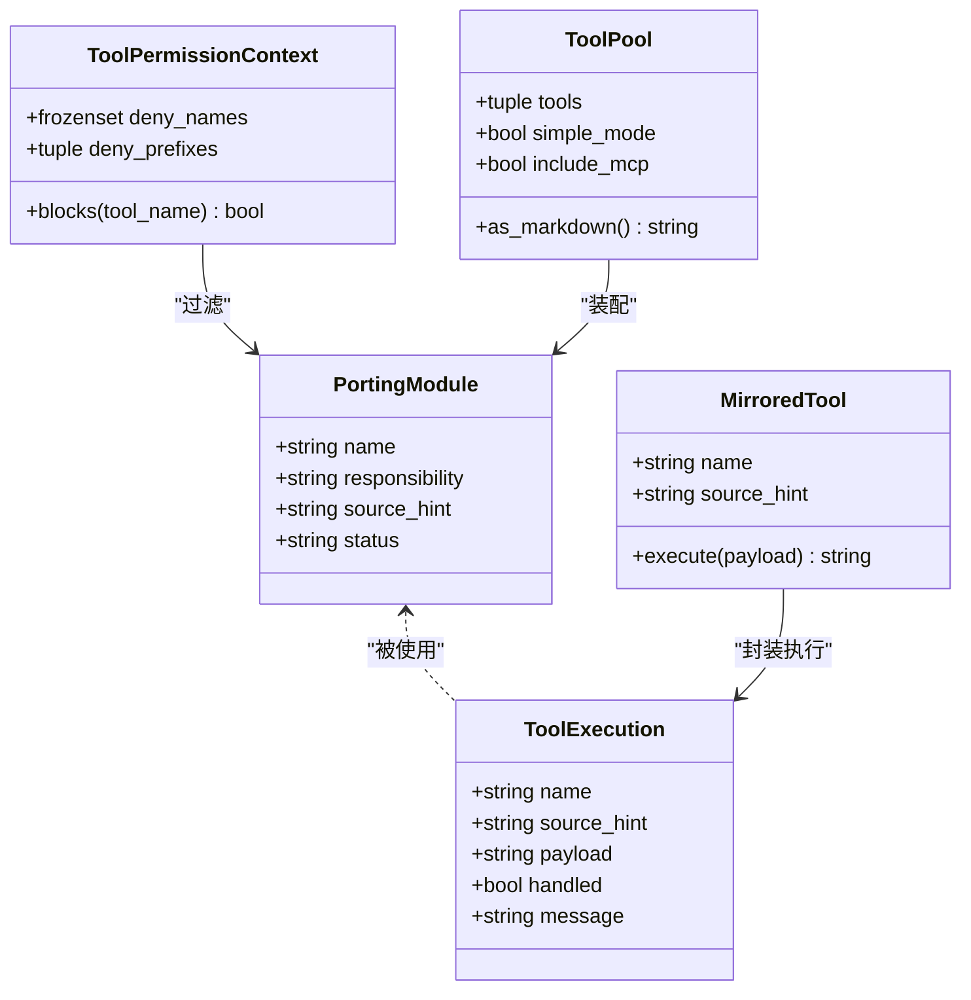
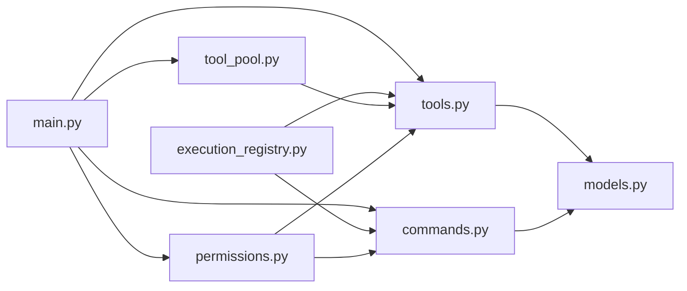

# 自定义工具开发

<cite>
**本文引用的文件**
- [src/tools.py](file://src/tools.py)
- [src/tool_pool.py](file://src/tool_pool.py)
- [src/commands.py](file://src/commands.py)
- [src/execution_registry.py](file://src/execution_registry.py)
- [src/models.py](file://src/models.py)
- [src/permissions.py](file://src/permissions.py)
- [src/main.py](file://src/main.py)
- [src/Tool.py](file://src/Tool.py)
- [src/reference_data/tools_snapshot.json](file://src/reference_data/tools_snapshot.json)
- [src/reference_data/commands_snapshot.json](file://src/reference_data/commands_snapshot.json)
- [rust/crates/tools/Cargo.toml](file://rust/crates/tools/Cargo.toml)
- [rust/crates/plugins/bundled/example-bundled/.claude-plugin/plugin.json](file://rust/crates/plugins/bundled/example-bundled/.claude-plugin/plugin.json)
- [rust/crates/plugins/bundled/sample-hooks/.claude-plugin/plugin.json](file://rust/crates/plugins/bundled/sample-hooks/.claude-plugin/plugin.json)
</cite>

## 目录
1. [简介](#简介)
2. [项目结构](#项目结构)
3. [核心组件](#核心组件)
4. [架构总览](#架构总览)
5. [详细组件分析](#详细组件分析)
6. [依赖分析](#依赖分析)
7. [性能考虑](#性能考虑)
8. [故障排查指南](#故障排查指南)
9. [结论](#结论)
10. [附录](#附录)

## 简介
本指南面向希望在 CLAW 工作区中开发“自定义工具”的工程师，目标是帮助你从接口规范、元数据要求、注册流程到实现模式、测试方法、打包部署与版本管理形成一套完整的实践路径。CLAW 当前采用“镜像式”工具系统：通过工具快照（JSON）描述已归档的 TypeScript 工具清单，并在 Python 运行时中以“镜像工具”进行查询、筛选、执行与展示。本文将基于仓库中的实际实现，给出可操作的开发步骤与最佳实践。

## 项目结构
围绕“工具开发”的关键目录与文件如下：
- Python 工具层
  - 工具与命令的镜像加载与查询：tools.py、commands.py
  - 工具池装配：tool_pool.py
  - 执行注册表：execution_registry.py
  - 数据模型与权限上下文：models.py、permissions.py
  - CLI 入口与参数解析：main.py
  - 默认工具定义：Tool.py
  - 快照数据：tools_snapshot.json、commands_snapshot.json
- Rust 插件与工具生态
  - 工具 crate 依赖：Cargo.toml
  - 示例插件与钩子：.claude-plugin/plugin.json（示例）

图表来源
- [src/tools.py:1-97](file://src/tools.py#L1-L97)
- [src/tool_pool.py:1-38](file://src/tool_pool.py#L1-L38)
- [src/commands.py:1-91](file://src/commands.py#L1-L91)
- [src/execution_registry.py:1-52](file://src/execution_registry.py#L1-L52)
- [src/models.py:1-50](file://src/models.py#L1-L50)
- [src/permissions.py:1-21](file://src/permissions.py#L1-L21)
- [src/main.py:1-214](file://src/main.py#L1-L214)
- [src/Tool.py:1-16](file://src/Tool.py#L1-L16)
- [src/reference_data/tools_snapshot.json:1-922](file://src/reference_data/tools_snapshot.json#L1-L922)
- [src/reference_data/commands_snapshot.json:1-1037](file://src/reference_data/commands_snapshot.json#L1-L1037)
- [rust/crates/tools/Cargo.toml:1-19](file://rust/crates/tools/Cargo.toml#L1-L19)
- [rust/crates/plugins/bundled/example-bundled/.claude-plugin/plugin.json:1-11](file://rust/crates/plugins/bundled/example-bundled/.claude-plugin/plugin.json#L1-L11)
- [rust/crates/plugins/bundled/sample-hooks/.claude-plugin/plugin.json:1-11](file://rust/crates/plugins/bundled/sample-hooks/.claude-plugin/plugin.json#L1-L11)

章节来源
- [src/main.py:21-91](file://src/main.py#L21-L91)
- [src/tools.py:23-34](file://src/tools.py#L23-L34)
- [src/commands.py:22-33](file://src/commands.py#L22-L33)

## 核心组件
- 工具镜像与查询
  - 通过 JSON 快照加载工具清单，提供名称匹配、权限过滤、简单模式与 MCP 排除等查询能力。
- 命令镜像与查询
  - 同工具镜像，支持插件命令与技能命令的开关控制。
- 工具池装配
  - 将查询结果封装为可渲染的工具池视图。
- 执行注册表
  - 将镜像工具/命令包装为可执行对象，统一对外暴露 execute 方法。
- 权限上下文
  - 支持按名称或前缀拒绝特定工具，用于安全与策略控制。
- CLI 路由
  - 提供 tools/commands/show/exec 等子命令，以及路由与回话运行等高级功能。

章节来源
- [src/tools.py:40-97](file://src/tools.py#L40-L97)
- [src/commands.py:39-91](file://src/commands.py#L39-L91)
- [src/tool_pool.py:28-38](file://src/tool_pool.py#L28-L38)
- [src/execution_registry.py:27-52](file://src/execution_registry.py#L27-L52)
- [src/permissions.py:6-21](file://src/permissions.py#L6-L21)
- [src/main.py:123-207](file://src/main.py#L123-L207)

## 架构总览
下图展示了 CLI 如何通过参数解析选择具体子命令，再调用工具/命令模块完成查询、过滤与执行，并最终输出结果。

图表来源
- [src/main.py:123-207](file://src/main.py#L123-L207)
- [src/tools.py:81-87](file://src/tools.py#L81-L87)
- [src/commands.py:75-81](file://src/commands.py#L75-L81)
- [src/execution_registry.py:47-52](file://src/execution_registry.py#L47-L52)

## 详细组件分析

### 工具接口规范与元数据要求
- 接口规范
  - 工具镜像类：PortingModule（name、responsibility、source_hint、status）
  - 工具执行返回：ToolExecution（name、source_hint、payload、handled、message）
  - 查询与过滤：get_tools()/find_tools()/get_tool()/render_tool_index()
  - 权限过滤：filter_tools_by_permission_context()/ToolPermissionContext
- 元数据要求
  - 工具快照字段：name、source_hint、responsibility
  - 命令快照字段：name、source_hint、responsibility
  - 快照文件位置：tools_snapshot.json、commands_snapshot.json
- 注册流程
  - 通过快照加载工具/命令清单
  - 可选：简单模式、排除 MCP、按权限上下文过滤
  - 可选：装配工具池并渲染摘要

图表来源
- [src/models.py:14-20](file://src/models.py#L14-L20)
- [src/models.py:28-37](file://src/models.py#L28-L37)
- [src/permissions.py:6-21](file://src/permissions.py#L6-L21)
- [src/tool_pool.py:10-15](file://src/tool_pool.py#L10-L15)
- [src/execution_registry.py:18-25](file://src/execution_registry.py#L18-L25)

章节来源
- [src/models.py:14-50](file://src/models.py#L14-L50)
- [src/tools.py:14-21](file://src/tools.py#L14-L21)
- [src/tools.py:40-97](file://src/tools.py#L40-L97)
- [src/permissions.py:6-21](file://src/permissions.py#L6-L21)
- [src/tool_pool.py:10-38](file://src/tool_pool.py#L10-L38)
- [src/reference_data/tools_snapshot.json:1-922](file://src/reference_data/tools_snapshot.json#L1-L922)
- [src/reference_data/commands_snapshot.json:1-1037](file://src/reference_data/commands_snapshot.json#L1-L1037)

### 工具实现模式与测试方法
- 实现模式
  - 镜像式：以快照驱动，无需直接实现具体逻辑，仅在 Python 层做查询、过滤与执行消息拼装。
  - 可扩展：通过 ToolPool/ExecutionRegistry 统一接入新工具；通过权限上下文实现安全策略。
- 测试方法
  - 单元测试：对查询函数（如 get_tools/find_tools/get_tool/render_tool_index）进行断言。
  - 集成测试：通过 CLI 子命令（如 tools、exec-tool、show-tool）验证端到端行为。
  - 权限测试：构造 ToolPermissionContext，验证 blocks 行为与过滤结果。
  - 快照一致性：确保 tools_snapshot.json/commands_snapshot.json 字段与模型一致。

章节来源
- [src/tools.py:40-97](file://src/tools.py#L40-L97)
- [src/main.py:123-207](file://src/main.py#L123-L207)
- [src/permissions.py:11-21](file://src/permissions.py#L11-L21)

### 工具开发模板与最佳实践
- 开发模板
  - 在 tools_snapshot.json 中新增条目，字段包括 name、source_hint、responsibility。
  - 若需要，可在 Python 层增加权限白/黑名单策略。
- 最佳实践
  - 元数据清晰：source_hint 指向原始工具来源，便于追溯。
  - 名称唯一且语义明确：避免与内置命令冲突。
  - 安全优先：通过 deny_tool/deny-prefix 控制高风险工具。
  - 渲染友好：responsibility 简洁明了，便于用户理解用途。
  - 版本化：配合仓库版本管理，变更快照后同步更新 CLI 与权限策略。

章节来源
- [src/reference_data/tools_snapshot.json:1-922](file://src/reference_data/tools_snapshot.json#L1-L922)
- [src/permissions.py:11-21](file://src/permissions.py#L11-L21)
- [src/main.py:132-141](file://src/main.py#L132-L141)

### 工具打包、部署与版本管理
- 打包与分发
  - Python CLI：通过命令行子命令使用工具镜像能力；若需 Rust 工具链，参考工具 crate 的依赖配置。
- 部署
  - 将 tools_snapshot.json/commands_snapshot.json 作为受控资源纳入工作区。
  - 使用 CLI 子命令进行工具池装配与执行验证。
- 版本管理
  - 快照文件随仓库版本演进；变更时更新 CLI 与权限策略。
  - Rust 工具 crate 的依赖与特性可通过 Cargo.toml 管理。

章节来源
- [rust/crates/tools/Cargo.toml:1-19](file://rust/crates/tools/Cargo.toml#L1-L19)
- [src/main.py:113-141](file://src/main.py#L113-L141)

### 工具与现有工具系统的集成与兼容性
- 集成点
  - CLI 子命令：tools、commands、exec-tool、exec-command、show-tool、show-command。
  - 执行注册表：MirroredTool/MirroredCommand 统一封装执行。
- 兼容性
  - 保持快照字段与模型一致（name、source_hint、responsibility）。
  - 与权限上下文兼容，避免被 deny_tool/deny-prefix 拦截。
  - 与简单模式、MCP 排除等查询选项兼容。

章节来源
- [src/main.py:123-207](file://src/main.py#L123-L207)
- [src/execution_registry.py:27-52](file://src/execution_registry.py#L27-L52)
- [src/tools.py:62-73](file://src/tools.py#L62-L73)

## 依赖分析
- 组件耦合
  - main.py 依赖 tools.py/commands.py/tool_pool.py/permissions.py 等模块。
  - tools.py/commands.py 依赖 models.py 与快照 JSON。
  - execution_registry.py 依赖 tools.py/commands.py 与 models.py。
- 外部依赖
  - Rust 工具 crate 通过 Cargo.toml 管理依赖（如 reqwest、serde 等）。

图表来源
- [src/main.py:17-18](file://src/main.py#L17-L18)
- [src/tools.py:8-9](file://src/tools.py#L8-L9)
- [src/commands.py:8](file://src/commands.py#L8)
- [src/execution_registry.py:5-6](file://src/execution_registry.py#L5-L6)
- [src/tool_pool.py:7](file://src/tool_pool.py#L7)

章节来源
- [src/main.py:17-18](file://src/main.py#L17-L18)
- [src/tools.py:8-9](file://src/tools.py#L8-L9)
- [src/commands.py:8](file://src/commands.py#L8)
- [src/execution_registry.py:5-6](file://src/execution_registry.py#L5-L6)
- [src/tool_pool.py:7](file://src/tool_pool.py#L7)

## 性能考虑
- 缓存与查询
  - 工具与命令快照加载使用缓存装饰器，减少重复 IO。
- 查询复杂度
  - 简单模式与 MCP 排除会缩小候选集，提升查询效率。
- 渲染与限制
  - CLI 支持 limit 控制输出数量，避免大列表渲染开销。

章节来源
- [src/tools.py:23-34](file://src/tools.py#L23-L34)
- [src/commands.py:22-33](file://src/commands.py#L22-L33)
- [src/main.py:123-141](file://src/main.py#L123-L141)

## 故障排查指南
- 常见问题
  - 工具未显示：检查快照中是否存在对应 name；确认 simple_mode 与 no-mcp 选项是否导致过滤。
  - 权限拦截：deny_tool 或 deny_prefix 导致工具被拒绝，检查 ToolPermissionContext。
  - 执行失败：未知工具名将返回未处理状态，确认名称大小写与拼写。
- 调试技巧
  - 使用 show-tool/show-command 查看具体元信息。
  - 使用 tools/commands 子命令带 query 参数进行精确过滤。
  - 使用 exec-tool/exec-command 输出执行消息，定位问题。

章节来源
- [src/tools.py:81-87](file://src/tools.py#L81-L87)
- [src/commands.py:75-81](file://src/commands.py#L75-L81)
- [src/main.py:186-207](file://src/main.py#L186-L207)

## 结论
CLAW 的工具系统以“镜像式”为核心：通过快照描述工具与命令，结合 Python 层的查询、过滤与执行封装，形成统一的 CLI 与执行注册表入口。开发者只需在快照中补充元数据，即可快速完成工具的注册与上线；同时，权限上下文与 CLI 子命令提供了灵活的安全与调试能力。建议在开发过程中严格遵循元数据规范、做好权限策略与版本管理，并通过 CLI 子命令进行端到端验证。

## 附录
- 快照字段对照
  - 工具：name、source_hint、responsibility
  - 命令：name、source_hint、responsibility
- CLI 子命令速查
  - tools、commands、show-tool、show-command、exec-tool、exec-command、tool-pool、route、bootstrap、turn-loop、flush-transcript、load-session、remote-mode、ssh-mode、teleport-mode、direct-connect-mode、deep-link-mode

章节来源
- [src/reference_data/tools_snapshot.json:1-922](file://src/reference_data/tools_snapshot.json#L1-L922)
- [src/reference_data/commands_snapshot.json:1-1037](file://src/reference_data/commands_snapshot.json#L1-L1037)
- [src/main.py:123-207](file://src/main.py#L123-L207)