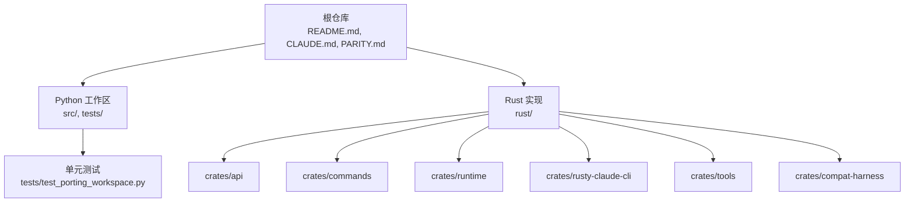
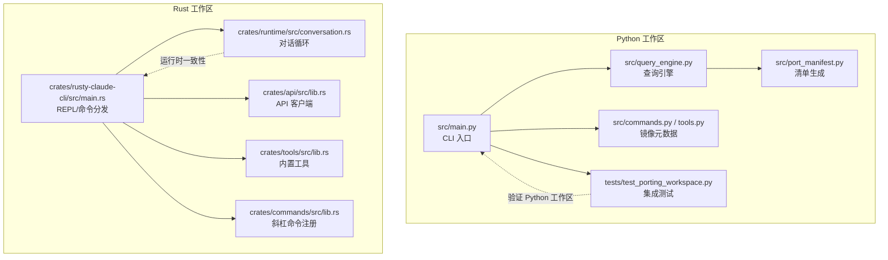
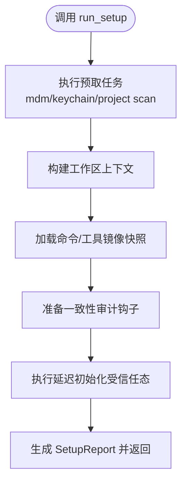
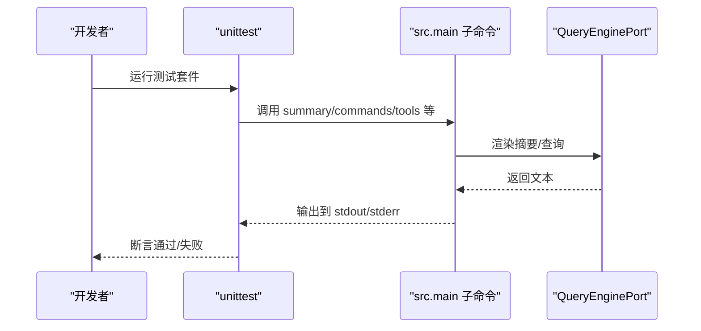
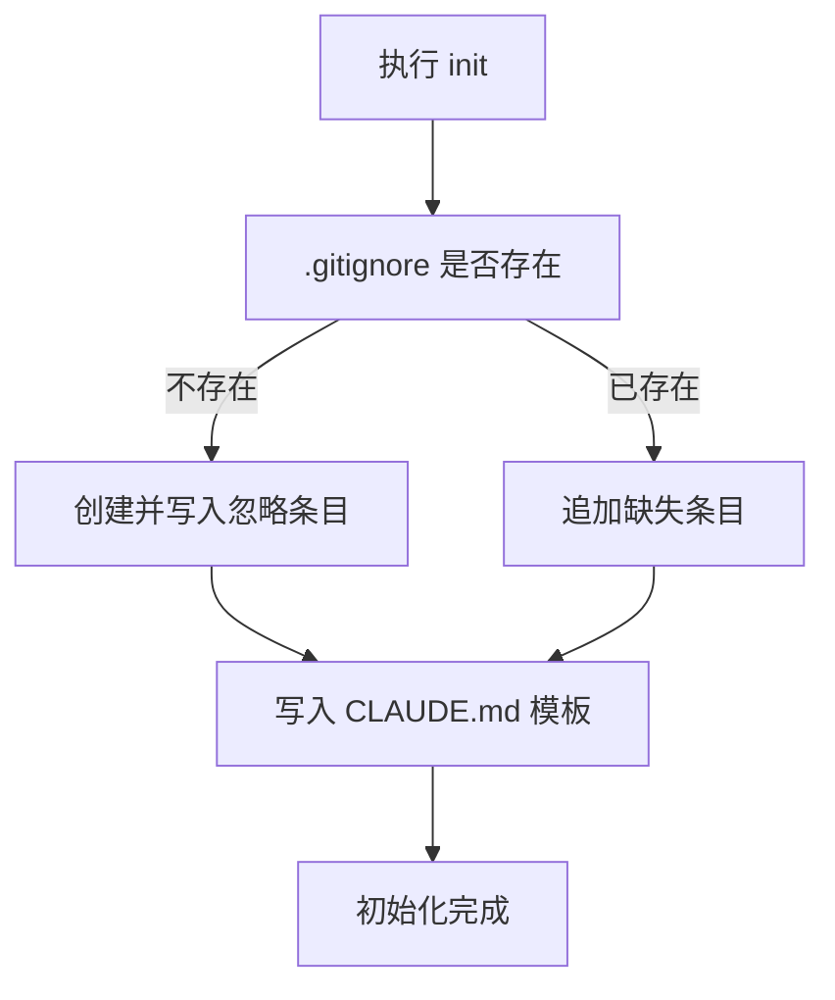
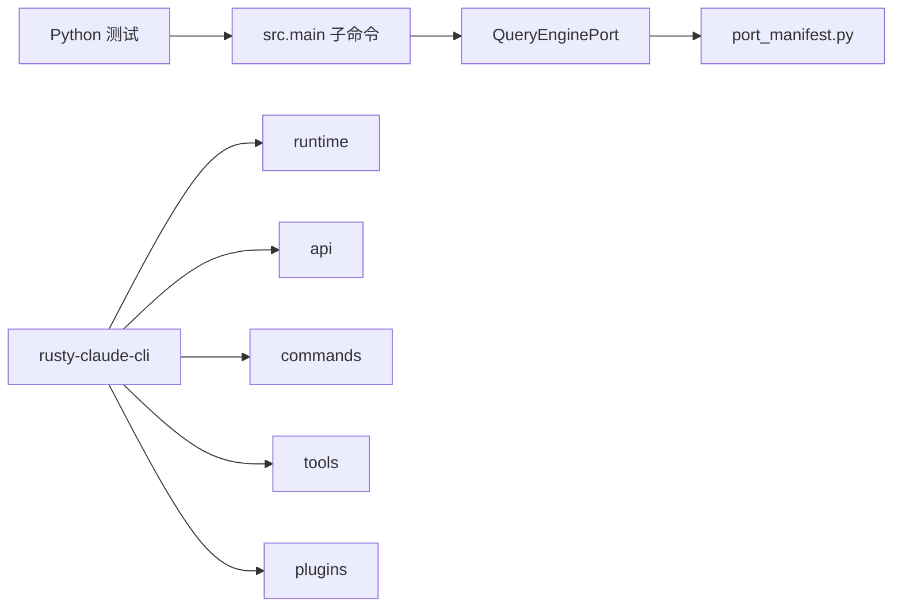

# 代码贡献

<cite>
**本文引用的文件**
- [README.md](file://README.md)
- [CLAUDE.md](file://CLAUDE.md)
- [PARITY.md](file://PARITY.md)
- [rust/README.md](file://rust/README.md)
- [rust/Cargo.toml](file://rust/Cargo.toml)
- [rust/crates/rusty-claude-cli/Cargo.toml](file://rust/crates/rusty-claude-cli/Cargo.toml)
- [rust/crates/rusty-claude-cli/src/init.rs](file://rust/crates/rusty-claude-cli/src/init.rs)
- [rust/crates/runtime/src/prompt.rs](file://rust/crates/runtime/src/prompt.rs)
- [rust/TUI-ENHANCEMENT-PLAN.md](file://rust/TUI-ENHANCEMENT-PLAN.md)
- [src/setup.py](file://src/setup.py)
- [tests/test_porting_workspace.py](file://tests/test_porting_workspace.py)
- [.claude.json](file://.claude.json)
</cite>

## 目录
1. [简介](#简介)
2. [项目结构](#项目结构)
3. [核心组件](#核心组件)
4. [架构总览](#架构总览)
5. [详细组件分析](#详细组件分析)
6. [依赖关系分析](#依赖关系分析)
7. [性能与质量保障](#性能与质量保障)
8. [故障排查指南](#故障排查指南)
9. [结论](#结论)
10. [附录](#附录)

## 简介
本指南面向希望为 CLAW 项目贡献代码的开发者，覆盖开发环境搭建、提交流程、代码审查标准、Git 工作流与分支策略、合并要求、编码规范与格式化、命名约定、Pull Request 模板与检查清单、Bug 报告与功能请求流程，以及社区行为准则与沟通渠道。项目当前以 Python 清理重写工作区为主，并在 Rust 分支进行高性能重实现；贡献者应优先关注 Python 工作区的验证与文档，同时留意 Rust 分支的进展与差异。

## 项目结构
仓库采用多语言混合与分层组织方式：
- Python 清理重写工作区：位于 src/，配套 tests/ 单元测试与验证脚本，提供命令/工具镜像清单、查询引擎与一致性审计能力。
- Rust 高性能重实现：位于 rust/，包含多 crate 的工作区，提供 CLI、运行时、工具集、API 客户端、命令注册等模块。
- 文档与策略：根目录 README.md 提供总体背景与快速开始；CLAUDE.md、PARITY.md、rust/README.md、TUI-ENHANCEMENT-PLAN.md 等文件分别定义协作约定、一致性差距分析、Rust 快速开始与 TUI 改进计划。

图表来源
- [README.md:82-99](file://README.md#L82-L99)
- [rust/README.md:187-200](file://rust/README.md#L187-L200)

章节来源
- [README.md:82-99](file://README.md#L82-L99)
- [rust/README.md:187-200](file://rust/README.md#L187-L200)

## 核心组件
- Python 工作区
  - 命令与工具镜像：PORTED_COMMANDS、PORTED_TOOLS，用于对比与审计。
  - 查询引擎：QueryEnginePort，从工作区渲染摘要。
  - 启动与设置：setup.py 中的 WorkspaceSetup、run_setup，负责预取、延迟初始化与平台信息汇总。
  - 验证：tests/test_porting_workspace.py 覆盖 CLI 子命令、会话引导、权限过滤、远程模式等。
- Rust 工作区
  - 工作区配置：Cargo.toml 统一 lint 规则与许可证。
  - CLI 二进制：crates/rusty-claude-cli/Cargo.toml 指定可执行名 claw。
  - 初始化模板：init.rs 自动生成 CLAUDE.md、.gitignore 等。
  - 行为准则与系统提示：prompt.rs 提供“Doing tasks”“Executing actions with care”等指导性内容。
  - TUI 改进：TUI-ENHANCEMENT-PLAN.md 列出状态栏、流式渲染、主题、全屏布局等阶段目标。

章节来源
- [src/setup.py:12-78](file://src/setup.py#L12-L78)
- [tests/test_porting_workspace.py:15-249](file://tests/test_porting_workspace.py#L15-L249)
- [rust/Cargo.toml:1-20](file://rust/Cargo.toml#L1-L20)
- [rust/crates/rusty-claude-cli/Cargo.toml:1-28](file://rust/crates/rusty-claude-cli/Cargo.toml#L1-L28)
- [rust/crates/rusty-claude-cli/src/init.rs:95-161](file://rust/crates/rusty-claude-cli/src/init.rs#L95-L161)
- [rust/crates/runtime/src/prompt.rs:462-490](file://rust/crates/runtime/src/prompt.rs#L462-L490)
- [rust/TUI-ENHANCEMENT-PLAN.md:1-222](file://rust/TUI-ENHANCEMENT-PLAN.md#L1-L222)

## 架构总览
下图展示 Python 工作区与 Rust 工作区的职责边界与交互要点，帮助贡献者理解代码位置与验证路径。

图表来源
- [README.md:101-111](file://README.md#L101-L111)
- [rust/README.md:187-200](file://rust/README.md#L187-L200)

## 详细组件分析

### Python 工作区：启动与设置
- WorkspaceSetup 聚合 Python 版本、实现与平台信息，并定义启动步骤（预取、构建上下文、加载镜像快照、准备一致性审计钩子、应用信任门控延迟初始化）。
- run_setup 返回 SetupReport，包含预取结果、延迟初始化结果、可信态与工作目录，便于诊断与审计。

图表来源
- [src/setup.py:56-78](file://src/setup.py#L56-L78)

章节来源
- [src/setup.py:12-78](file://src/setup.py#L12-L78)

### Python 工作区：CLI 与验证
- 测试覆盖范围包括：清单统计、摘要渲染、一致性审计、命令/工具 CLI、引导会话、执行命令/工具、设置报告、会话加载、权限过滤、转轮循环、远程模式、转录清空、命令图与工具池、执行注册表、引导图与直连模式等。
- 测试通过 subprocess 调用 src.main 的各子命令，确保 CLI 可用且输出符合预期。

图表来源
- [tests/test_porting_workspace.py:27-43](file://tests/test_porting_workspace.py#L27-L43)
- [tests/test_porting_workspace.py:104-114](file://tests/test_porting_workspace.py#L104-L114)

章节来源
- [tests/test_porting_workspace.py:15-249](file://tests/test_porting_workspace.py#L15-L249)

### Rust 工作区：初始化与协作约定
- init.rs 在项目初始化时生成 CLAUDE.md、更新 .gitignore，并按需创建缺失文件，确保协作约定与工作流一致。
- CLAUDE.md 明确 Rust 验证流程（格式化、静态检查、测试）、仓库形态与协作原则（小而可审变更、共享默认、保留本地覆盖、手动更新 CLAUDE.md）。
- prompt.rs 的系统提示包含“执行任务时要小心”“谨慎考虑可逆性与影响范围”等安全与质量约束，有助于贡献者在设计与实现中遵循。

图表来源
- [rust/crates/rusty-claude-cli/src/init.rs:95-161](file://rust/crates/rusty-claude-cli/src/init.rs#L95-L161)

章节来源
- [rust/crates/rusty-claude-cli/src/init.rs:95-161](file://rust/crates/rusty-claude-cli/src/init.rs#L95-L161)
- [CLAUDE.md:9-22](file://CLAUDE.md#L9-L22)
- [rust/crates/runtime/src/prompt.rs:462-490](file://rust/crates/runtime/src/prompt.rs#L462-L490)

### Rust 工作区：工作流与 CLI
- 工作区统一 lint 与许可证，CLI 二进制名为 claw，支持模型切换、权限模式、工具限制、输出格式、登录/登出、初始化、健康检查、自更新等。
- TUI 改进计划明确了从单体重构到状态栏、流式渲染、主题、全屏布局的阶段性目标，建议贡献者在参与 CLI/TUI 改进时参考该计划。

章节来源
- [rust/Cargo.toml:1-20](file://rust/Cargo.toml#L1-L20)
- [rust/crates/rusty-claude-cli/Cargo.toml:1-28](file://rust/crates/rusty-claude-cli/Cargo.toml#L1-L28)
- [rust/README.md:147-167](file://rust/README.md#L147-L167)
- [rust/TUI-ENHANCEMENT-PLAN.md:67-222](file://rust/TUI-ENHANCEMENT-PLAN.md#L67-L222)

## 依赖关系分析
- Python 工作区
  - 通过 tests/test_porting_workspace.py 间接依赖 src.main 的子命令与查询引擎，形成“CLI → 引擎 → 输出”的验证链路。
- Rust 工作区
  - rusty-claude-cli 作为 CLI 二进制，依赖 api、commands、runtime、tools、plugins 等 crate；Cargo.toml 统一 lint 约束，保证代码风格一致。

图表来源
- [tests/test_porting_workspace.py:15-249](file://tests/test_porting_workspace.py#L15-L249)
- [rust/crates/rusty-claude-cli/Cargo.toml:12-24](file://rust/crates/rusty-claude-cli/Cargo.toml#L12-L24)
- [rust/Cargo.toml:11-20](file://rust/Cargo.toml#L11-L20)

章节来源
- [tests/test_porting_workspace.py:15-249](file://tests/test_porting_workspace.py#L15-L249)
- [rust/crates/rusty-claude-cli/Cargo.toml:12-24](file://rust/crates/rusty-claude-cli/Cargo.toml#L12-L24)
- [rust/Cargo.toml:11-20](file://rust/Cargo.toml#L11-L20)

## 性能与质量保障
- Python 工作区
  - 使用 unittest 发现式测试，覆盖 CLI 子命令、会话引导、权限过滤、远程模式、转录清空、命令图与工具池等，确保功能稳定性。
- Rust 工作区
  - 工作区统一 lint（禁止不安全代码），CLI 二进制提供健康检查、登录/登出、初始化、会话管理等能力，便于在不同环境验证行为一致性。

章节来源
- [tests/test_porting_workspace.py:15-249](file://tests/test_porting_workspace.py#L15-L249)
- [rust/Cargo.toml:11-20](file://rust/Cargo.toml#L11-L20)
- [rust/README.md:160-167](file://rust/README.md#L160-L167)

## 故障排查指南
- Python 工作区
  - 若清单统计或摘要渲染失败，检查 src/main 的 summary/manifest/subsystems 等子命令是否可用；确认 tests/test_porting_workspace.py 中相关断言是否通过。
  - 若一致性审计失败，参考 PARITY.md 的差距分析，定位缺失或未实现的功能点。
- Rust 工作区
  - 若初始化失败，检查 init.rs 的 .gitignore 写入与 CLAUDE.md 模板生成逻辑。
  - 若 CLI 行为异常，使用 doctor 健康检查、login 登录、init 初始化、session 列表/恢复等命令进行排障。
  - 若权限问题导致工具调用被拒绝，检查 .claude.json 的默认权限模式与命令行权限参数。

章节来源
- [tests/test_porting_workspace.py:15-249](file://tests/test_porting_workspace.py#L15-L249)
- [PARITY.md:1-215](file://PARITY.md#L1-L215)
- [rust/crates/rusty-claude-cli/src/init.rs:95-161](file://rust/crates/rusty-claude-cli/src/init.rs#L95-L161)
- [rust/README.md:160-167](file://rust/README.md#L160-L167)
- [.claude.json:1-6](file://.claude.json#L1-L6)

## 结论
本指南为 CLAW 项目的贡献者提供了从环境搭建到代码审查、从 Git 工作流到质量保障的完整路径。建议贡献者优先在 Python 工作区进行验证与文档完善，同时关注 Rust 分支的进展与差异；在提交 PR 前确保通过单元测试与 CLI 验证，并遵循 CLAUDE.md 的协作约定与 prompt.rs 的行为准则。

## 附录

### 开发环境设置
- Python 工作区
  - 运行测试：python3 -m unittest discover -s tests -v
  - 渲染摘要：python3 -m src.main summary
  - 打印清单：python3 -m src.main manifest
  - 列出模块：python3 -m src.main subsystems --limit 16
  - 一致性审计：python3 -m src.main parity-audit
- Rust 工作区
  - 构建：cd rust/；cargo build --release
  - 运行 REPL：./target/release/claw
  - 一次性提示：./target/release/claw prompt "explain this codebase"
  - 登录认证：claw login
  - 健康检查：claw doctor
  - 初始化：claw init

章节来源
- [README.md:112-149](file://README.md#L112-L149)
- [rust/README.md:5-36](file://rust/README.md#L5-L36)

### Git 工作流与分支策略
- Rust 分支现状：Rust 实现正在 dev/rust 分支推进，预计近期合并至 main。
- 建议
  - 功能开发在特性分支进行，保持小步提交与清晰的提交信息。
  - Python 工作区与 Rust 工作区需同步更新，避免行为不一致。
  - 提交前确保通过单元测试与 CLI 验证。

章节来源
- [README.md:29-31](file://README.md#L29-L31)
- [rust/README.md:40-81](file://rust/README.md#L40-L81)

### 代码审查标准
- 小而可审：每次 PR 变更尽量聚焦单一问题或功能点。
- 行为准则：遵循 prompt.rs 中的“执行任务时要小心”“谨慎考虑可逆性与影响范围”等原则。
- 质量门槛：通过单元测试与 CLI 验证；必要时补充测试用例。
- 文档同步：如涉及工作流变更，手动更新 CLAUDE.md。

章节来源
- [CLAUDE.md:18-22](file://CLAUDE.md#L18-L22)
- [rust/crates/runtime/src/prompt.rs:462-490](file://rust/crates/runtime/src/prompt.rs#L462-L490)

### 编码规范与格式化
- Rust
  - 工作区统一 lint：禁止不安全代码；Clippy 警告级别为 warn。
  - 代码格式化：cargo fmt；静态检查：cargo clippy --workspace --all-targets -- -D warnings；测试：cargo test --workspace。
- Python
  - 使用 unittest 发现式测试；CLI 验证由 tests/test_porting_workspace.py 覆盖。

章节来源
- [rust/Cargo.toml:11-20](file://rust/Cargo.toml#L11-L20)
- [CLAUDE.md:10](file://CLAUDE.md#L10)
- [tests/test_porting_workspace.py:15-249](file://tests/test_porting_workspace.py#L15-L249)

### 命名约定
- Rust
  - 二进制名称：claw；crate 名称遵循功能域划分（api、commands、runtime、rusty-claude-cli、tools、compat-harness）。
- Python
  - 模块与类名遵循现有结构（如 src.main、src.query_engine、src.port_manifest、src.commands、src.tools）。

章节来源
- [rust/crates/rusty-claude-cli/Cargo.toml:8-10](file://rust/crates/rusty-claude-cli/Cargo.toml#L8-L10)
- [rust/README.md:187-200](file://rust/README.md#L187-L200)
- [README.md:101-111](file://README.md#L101-L111)

### Pull Request 模板与检查清单
- 模板建议
  - 标题：简述变更类型与范围（如 feat(rust/cli)：新增斜杠命令）
  - 描述：变更动机、具体改动、对 Python/Rust 工作区的影响、兼容性说明
  - 截图/日志：必要时附带 CLI 输出或测试结果
- 检查清单
  - 通过单元测试与 CLI 验证
  - 更新/同步 CLAUDE.md（如工作流变更）
  - Python 与 Rust 工作区同步更新
  - 提交信息清晰、可追溯
  - 遵循 prompt.rs 的行为准则与安全约束

章节来源
- [CLAUDE.md:18-22](file://CLAUDE.md#L18-L22)
- [rust/crates/runtime/src/prompt.rs:462-490](file://rust/crates/runtime/src/prompt.rs#L462-L490)

### Bug 报告与功能请求
- Bug 报告
  - 提供最小复现步骤、期望行为、实际行为、环境信息（Python/Rust 版本、平台）
  - 附上 CLI 输出与测试断言失败信息
- 功能请求
  - 说明使用场景、期望行为、对 Python/Rust 工作区的影响
  - 如涉及 CLI 或行为准则，参考 prompt.rs 的系统提示

章节来源
- [tests/test_porting_workspace.py:15-249](file://tests/test_porting_workspace.py#L15-L249)
- [rust/crates/runtime/src/prompt.rs:462-490](file://rust/crates/runtime/src/prompt.rs#L462-L490)

### 社区行为准则与沟通渠道
- 行为准则
  - 遵循 prompt.rs 的系统提示，谨慎评估变更的可逆性与影响范围。
- 沟通渠道
  - instructkr Discord 社区

章节来源
- [rust/crates/runtime/src/prompt.rs:462-490](file://rust/crates/runtime/src/prompt.rs#L462-L490)
- [README.md:174-182](file://README.md#L174-L182)