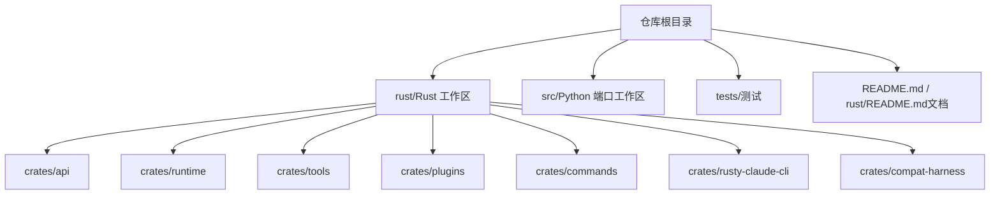
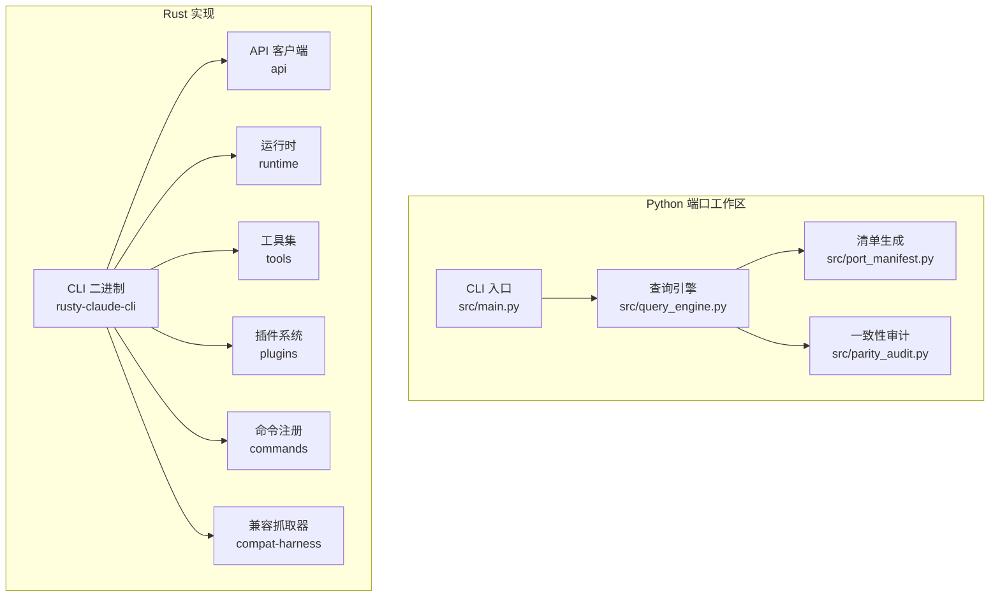
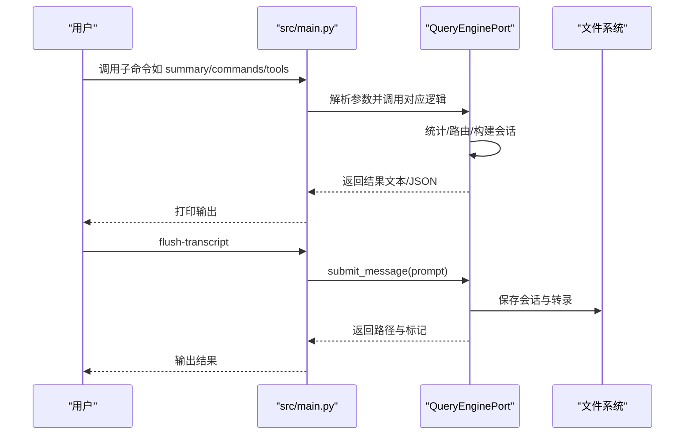
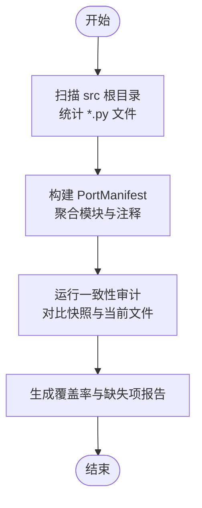
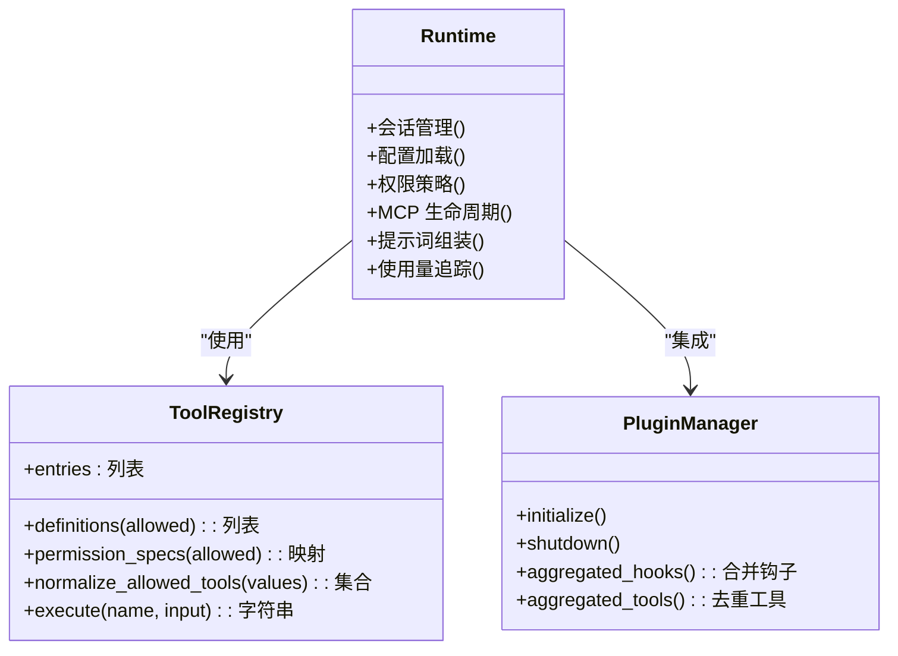
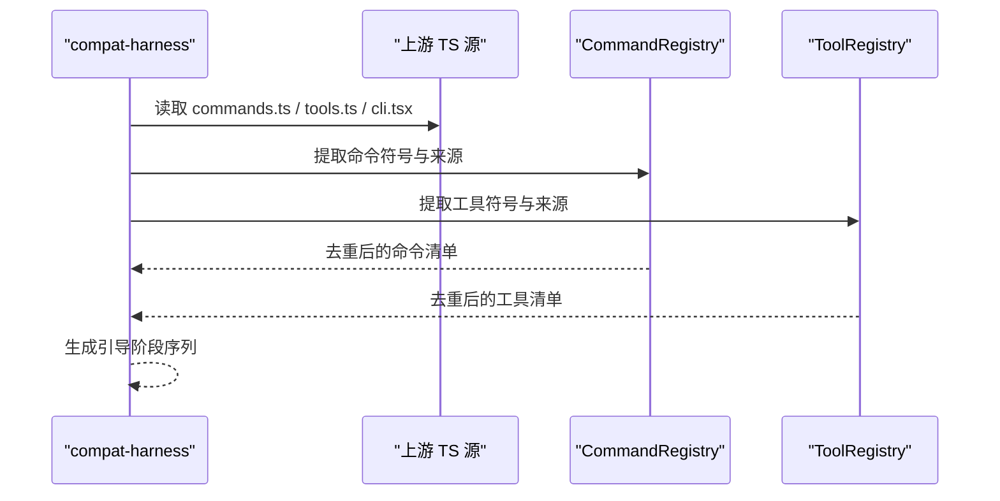
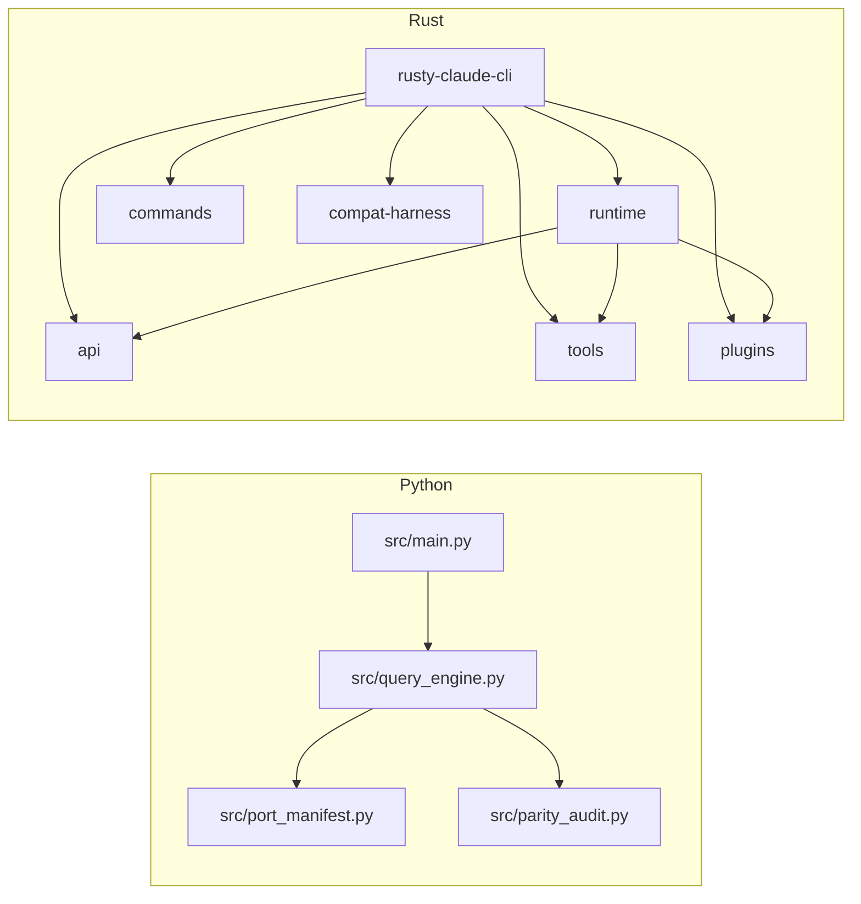

# 开发指南

<cite>
**本文引用的文件**
- [README.md](file://README.md)
- [src/__init__.py](file://src/__init__.py)
- [src/main.py](file://src/main.py)
- [src/port_manifest.py](file://src/port_manifest.py)
- [src/query_engine.py](file://src/query_engine.py)
- [src/parity_audit.py](file://src/parity_audit.py)
- [tests/test_porting_workspace.py](file://tests/test_porting_workspace.py)
- [rust/README.md](file://rust/README.md)
- [rust/Cargo.toml](file://rust/Cargo.toml)
- [rust/crates/api/Cargo.toml](file://rust/crates/api/Cargo.toml)
- [rust/crates/runtime/Cargo.toml](file://rust/crates/runtime/Cargo.toml)
- [rust/crates/rusty-claude-cli/Cargo.toml](file://rust/crates/rusty-claude-cli/Cargo.toml)
- [rust/crates/api/src/lib.rs](file://rust/crates/api/src/lib.rs)
- [rust/crates/runtime/src/lib.rs](file://rust/crates/runtime/src/lib.rs)
- [rust/crates/tools/src/lib.rs](file://rust/crates/tools/src/lib.rs)
- [rust/crates/plugins/src/lib.rs](file://rust/crates/plugins/src/lib.rs)
- [rust/crates/commands/src/lib.rs](file://rust/crates/commands/src/lib.rs)
- [rust/crates/compat-harness/src/lib.rs](file://rust/crates/compat-harness/src/lib.rs)
</cite>

## 目录
1. [简介](#简介)
2. [项目结构](#项目结构)
3. [核心组件](#核心组件)
4. [架构总览](#架构总览)
5. [详细组件分析](#详细组件分析)
6. [依赖关系分析](#依赖关系分析)
7. [性能考量](#性能考量)
8. [故障排查指南](#故障排查指南)
9. [结论](#结论)
10. [附录](#附录)

## 简介
本开发指南面向 CLAW 项目的贡献者与维护者，系统阐述 Python 端口工作区与 Rust 实现的开发流程、环境搭建、编码规范、测试策略、调试与性能分析、代码审查标准、开发工具配置与自动化流程，并解释项目的核心架构原则与设计模式。读者可据此快速上手贡献，确保高质量交付。

## 项目结构
仓库采用双实现并行推进：Python 端口工作区用于验证与演示，Rust 实现作为高性能、内存安全的未来主干。顶层目录组织如下：
- rust/：Rust 工作区与多 crate 模块（api、runtime、tools、plugins、commands、rusty-claude-cli、compat-harness）
- src/：Python 端口工作区，包含命令与工具镜像、查询引擎、会话存储、清单生成等模块
- tests/：基于 unittest 的端到端与集成测试
- README.md、rust/README.md：项目说明与 Rust 快速开始

图表来源
- [README.md](file://README.md)
- [rust/README.md](file://rust/README.md)

章节来源
- [README.md](file://README.md)
- [rust/README.md](file://rust/README.md)

## 核心组件
- Python 端口工作区
  - 命令与工具镜像：提供与上游快照一致的命令/工具清单与执行入口
  - 查询引擎：封装会话、令牌预算、权限拒绝追踪与输出格式化
  - 清单生成：统计顶层模块、文件数量与注释
  - 一致性审计：对比本地 Python 工作区与被忽略的 TypeScript 快照
  - CLI 入口：统一子命令解析与执行
- Rust 实现
  - api：HTTP 客户端、SSE 流解析、请求/响应类型与认证
  - runtime：会话、配置加载、权限策略、MCP 生命周期、提示词组装、使用量追踪
  - tools：内置工具集（bash、文件读写、搜索、网络检索、代理、笔记本编辑等）
  - plugins：插件系统（内建/捆绑/外部）、钩子与生命周期管理
  - commands：斜杠命令注册与帮助文本生成
  - compat-harness：从上游 TS 源提取命令/工具清单与引导阶段
  - rusty-claude-cli：REPL、一次性提示、流式渲染、参数解析

章节来源
- [src/__init__.py](file://src/__init__.py)
- [src/main.py](file://src/main.py)
- [src/port_manifest.py](file://src/port_manifest.py)
- [src/query_engine.py](file://src/query_engine.py)
- [src/parity_audit.py](file://src/parity_audit.py)
- [rust/crates/api/src/lib.rs](file://rust/crates/api/src/lib.rs)
- [rust/crates/runtime/src/lib.rs](file://rust/crates/runtime/src/lib.rs)
- [rust/crates/tools/src/lib.rs](file://rust/crates/tools/src/lib.rs)
- [rust/crates/plugins/src/lib.rs](file://rust/crates/plugins/src/lib.rs)
- [rust/crates/commands/src/lib.rs](file://rust/crates/commands/src/lib.rs)
- [rust/crates/compat-harness/src/lib.rs](file://rust/crates/compat-harness/src/lib.rs)

## 架构总览
Python 与 Rust 双实现共享“命令/工具镜像 + 运行时会话”的核心思想：通过查询引擎或运行时在受限权限下路由用户意图到工具执行，同时记录使用量与会话状态。Rust 在性能与安全性方面更进一步，提供完整的插件生态与 MCP 支持。

图表来源
- [src/main.py](file://src/main.py)
- [src/query_engine.py](file://src/query_engine.py)
- [src/port_manifest.py](file://src/port_manifest.py)
- [src/parity_audit.py](file://src/parity_audit.py)
- [rust/crates/rusty-claude-cli/Cargo.toml](file://rust/crates/rusty-claude-cli/Cargo.toml)
- [rust/crates/api/src/lib.rs](file://rust/crates/api/src/lib.rs)
- [rust/crates/runtime/src/lib.rs](file://rust/crates/runtime/src/lib.rs)
- [rust/crates/tools/src/lib.rs](file://rust/crates/tools/src/lib.rs)
- [rust/crates/plugins/src/lib.rs](file://rust/crates/plugins/src/lib.rs)
- [rust/crates/commands/src/lib.rs](file://rust/crates/commands/src/lib.rs)
- [rust/crates/compat-harness/src/lib.rs](file://rust/crates/compat-harness/src/lib.rs)

## 详细组件分析

### Python CLI 与查询引擎
- CLI 子命令覆盖：摘要、清单、一致性审计、命令图、工具池、引导图、子系统列表、命令/工具检索、路由、引导会话、轮转对话、远程/SSH/传送分支模式、直接连接/深链模式、显示命令/工具、执行命令/工具、加载会话、刷新转录、设置报告等
- 查询引擎支持：会话状态、令牌预算控制、权限拒绝追踪、结构化输出重试、消息压缩、转录持久化

图表来源
- [src/main.py](file://src/main.py)
- [src/query_engine.py](file://src/query_engine.py)

章节来源
- [src/main.py](file://src/main.py)
- [src/query_engine.py](file://src/query_engine.py)

### 清单生成与一致性审计
- 清单生成：遍历 src 根目录，统计顶层模块与文件数，标注常见文件用途
- 一致性审计：对比本地 Python 文件与被忽略的 TypeScript 快照，计算覆盖率与条目比例，列出缺失目标

图表来源
- [src/port_manifest.py](file://src/port_manifest.py)
- [src/parity_audit.py](file://src/parity_audit.py)

章节来源
- [src/port_manifest.py](file://src/port_manifest.py)
- [src/parity_audit.py](file://src/parity_audit.py)

### Rust 运行时与工具系统
- 运行时：会话生命周期、配置层次、权限策略、MCP 客户端与服务器管理、提示词构建、使用量追踪
- 工具系统：内置工具清单与执行器，支持别名规范化、权限要求、输入模式校验
- 插件系统：内建/捆绑/外部插件分类，钩子与生命周期管理，工具冲突检测与去重

图表来源
- [rust/crates/runtime/src/lib.rs](file://rust/crates/runtime/src/lib.rs)
- [rust/crates/tools/src/lib.rs](file://rust/crates/tools/src/lib.rs)
- [rust/crates/plugins/src/lib.rs](file://rust/crates/plugins/src/lib.rs)

章节来源
- [rust/crates/runtime/src/lib.rs](file://rust/crates/runtime/src/lib.rs)
- [rust/crates/tools/src/lib.rs](file://rust/crates/tools/src/lib.rs)
- [rust/crates/plugins/src/lib.rs](file://rust/crates/plugins/src/lib.rs)

### 兼容抓取器与命令/工具镜像
- 从上游 TS 源提取命令/工具清单与引导阶段，支持去重与来源标注
- 命令注册：内置/内部专用/特性门控三类来源
- 工具注册：基础/条件两类来源

图表来源
- [rust/crates/compat-harness/src/lib.rs](file://rust/crates/compat-harness/src/lib.rs)
- [rust/crates/commands/src/lib.rs](file://rust/crates/commands/src/lib.rs)
- [rust/crates/tools/src/lib.rs](file://rust/crates/tools/src/lib.rs)

章节来源
- [rust/crates/compat-harness/src/lib.rs](file://rust/crates/compat-harness/src/lib.rs)
- [rust/crates/commands/src/lib.rs](file://rust/crates/commands/src/lib.rs)
- [rust/crates/tools/src/lib.rs](file://rust/crates/tools/src/lib.rs)

## 依赖关系分析
- Python 工作区
  - CLI 依赖各功能模块（命令/工具索引、会话、权限上下文、查询引擎、转录存储）
  - 查询引擎依赖清单、权限拒绝、使用量汇总、转录存储
- Rust 工作区
  - rusty-claude-cli 依赖 api、runtime、tools、plugins、commands、compat-harness
  - runtime 依赖 tools、plugins、api 等模块
  - tools 与 plugins 互相协作，提供工具定义与插件工具注入

图表来源
- [src/main.py](file://src/main.py)
- [src/query_engine.py](file://src/query_engine.py)
- [src/port_manifest.py](file://src/port_manifest.py)
- [src/parity_audit.py](file://src/parity_audit.py)
- [rust/crates/rusty-claude-cli/Cargo.toml](file://rust/crates/rusty-claude-cli/Cargo.toml)
- [rust/crates/api/Cargo.toml](file://rust/crates/api/Cargo.toml)
- [rust/crates/runtime/Cargo.toml](file://rust/crates/runtime/Cargo.toml)

章节来源
- [src/main.py](file://src/main.py)
- [src/query_engine.py](file://src/query_engine.py)
- [rust/crates/rusty-claude-cli/Cargo.toml](file://rust/crates/rusty-claude-cli/Cargo.toml)
- [rust/crates/api/Cargo.toml](file://rust/crates/api/Cargo.toml)
- [rust/crates/runtime/Cargo.toml](file://rust/crates/runtime/Cargo.toml)

## 性能考量
- Python 查询引擎
  - 令牌预算与消息压缩：通过配置限制回合数与预算，超过阈值提前停止；达到一定回合数后仅保留最近消息以降低开销
  - 结构化输出重试：在 JSON 序列化失败时自动回退并重试，避免崩溃
- Rust 运行时
  - 并发与异步：Tokio 运行时多线程、IO 与时间组件，提升并发与 I/O 效率
  - 使用量追踪与成本估算：按模型定价进行用量统计与成本展示
  - MCP 与插件：进程级工具执行与插件生命周期管理，减少重复初始化成本

章节来源
- [src/query_engine.py](file://src/query_engine.py)
- [rust/crates/runtime/src/lib.rs](file://rust/crates/runtime/src/lib.rs)
- [rust/crates/tools/src/lib.rs](file://rust/crates/tools/src/lib.rs)
- [rust/crates/plugins/src/lib.rs](file://rust/crates/plugins/src/lib.rs)

## 故障排查指南
- 单元测试与集成测试
  - 使用 unittest 发现并运行 tests/ 下的测试套件，覆盖清单统计、查询引擎摘要、CLI 行为、一致性审计、会话加载、工具权限过滤、轮转对话、远程/SSH/传送分支模式、命令图与工具池、设置报告、执行注册表等
- 常见问题定位
  - CLI 子命令返回码：根据未知命令错误返回非零退出码，便于脚本化捕获
  - 权限拒绝：查询引擎记录权限拒绝列表，结合工具权限上下文排查
  - 会话状态：通过加载已保存会话检查消息数量与令牌用量

章节来源
- [tests/test_porting_workspace.py](file://tests/test_porting_workspace.py)
- [src/main.py](file://src/main.py)
- [src/query_engine.py](file://src/query_engine.py)

## 结论
本指南提供了从环境搭建、开发流程、编码规范、测试策略到调试与性能优化的完整路径。建议贡献者优先熟悉 Python 端口工作区的 CLI 与查询引擎，再逐步深入 Rust 的运行时与工具系统，以实现跨语言协同与一致性保障。

## 附录

### 开发环境设置
- Python
  - 使用 Python 3.10+，推荐虚拟环境
  - 运行测试：python3 -m unittest discover -s tests -v
  - 生成摘要/清单/一致性审计：参考 README 中的命令示例
- Rust
  - 安装 Rust 工具链与 Cargo
  - 构建与运行：cd rust/；cargo build --release；./target/release/claw

章节来源
- [README.md](file://README.md)
- [rust/README.md](file://rust/README.md)

### 编码规范
- Python
  - 使用 dataclass 管理不可变配置与数据对象
  - 使用 frozen=True 保证不可变性
  - 参数解析与子命令分发集中在 CLI 入口
- Rust
  - workspace.lints 禁止不安全代码，启用 Clippy pedantic 规则
  - 模块导出清晰，公共 API 通过 lib.rs 聚合
  - 错误处理使用 Result，避免 panic

章节来源
- [src/query_engine.py](file://src/query_engine.py)
- [src/main.py](file://src/main.py)
- [rust/Cargo.toml](file://rust/Cargo.toml)

### 测试策略与最佳实践
- 单元测试
  - 验证清单统计、查询引擎摘要、CLI 行为、一致性审计、会话加载、工具权限过滤、轮转对话、远程/SSH/传送分支模式、命令图与工具池、设置报告、执行注册表
- 集成测试
  - 通过 subprocess 调用 CLI 子命令，断言输出包含预期关键字
  - 使用 run_parity_audit 与审计结果进行覆盖率断言

章节来源
- [tests/test_porting_workspace.py](file://tests/test_porting_workspace.py)

### 调试技巧
- Python
  - 使用 unittest 的 -v 选项查看详细输出
  - 通过 flush-transcript 将临时会话持久化，检查转录与令牌使用
- Rust
  - 使用 tokio 调度器与日志，结合结构化输出与错误链追踪
  - 通过插件钩子与生命周期事件观察工具执行前后状态

章节来源
- [src/main.py](file://src/main.py)
- [src/query_engine.py](file://src/query_engine.py)
- [rust/crates/plugins/src/lib.rs](file://rust/crates/plugins/src/lib.rs)

### 代码审查标准
- 设计一致性：Python 与 Rust 实现保持命令/工具镜像与运行时行为一致
- 可测试性：新增功能提供最小可验证的测试用例
- 文档与注释：公共 API 有清晰注释，CLI 子命令帮助信息完整
- 性能与安全：Rust 禁用不安全代码，Python 控制令牌预算与消息长度

章节来源
- [rust/Cargo.toml](file://rust/Cargo.toml)
- [src/main.py](file://src/main.py)

### 开发工具配置与自动化流程
- Rust
  - workspace.lints 与 clippy pedantic 规则
  - 多 crate 依赖管理与二进制入口
- Python
  - CLI 子命令解析与帮助信息
  - 测试发现与执行

章节来源
- [rust/Cargo.toml](file://rust/Cargo.toml)
- [rust/crates/rusty-claude-cli/Cargo.toml](file://rust/crates/rusty-claude-cli/Cargo.toml)
- [src/main.py](file://src/main.py)

### 架构原则与设计模式
- 分层与职责分离：CLI、查询引擎、运行时、工具、插件各司其职
- 不可变数据结构：Python 使用 dataclass(frozen=True)，Rust 使用不可变字段
- 策略模式：权限策略、MCP 传输、插件生命周期
- 注册表模式：命令/工具注册与去重，插件聚合

章节来源
- [src/query_engine.py](file://src/query_engine.py)
- [rust/crates/runtime/src/lib.rs](file://rust/crates/runtime/src/lib.rs)
- [rust/crates/tools/src/lib.rs](file://rust/crates/tools/src/lib.rs)
- [rust/crates/plugins/src/lib.rs](file://rust/crates/plugins/src/lib.rs)

### 持续集成、部署与发布流程
- Python
  - 使用 unittest 进行本地与 CI 验证
- Rust
  - 使用 Cargo 构建与测试，二进制产物用于发布
  - 提供 CLI 快速开始与认证方式（API Key/OAuth）

章节来源
- [tests/test_porting_workspace.py](file://tests/test_porting_workspace.py)
- [rust/README.md](file://rust/README.md)