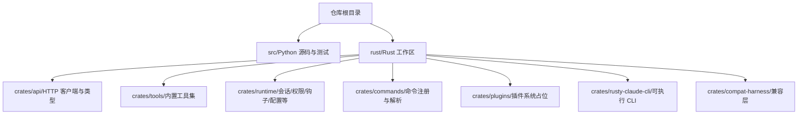
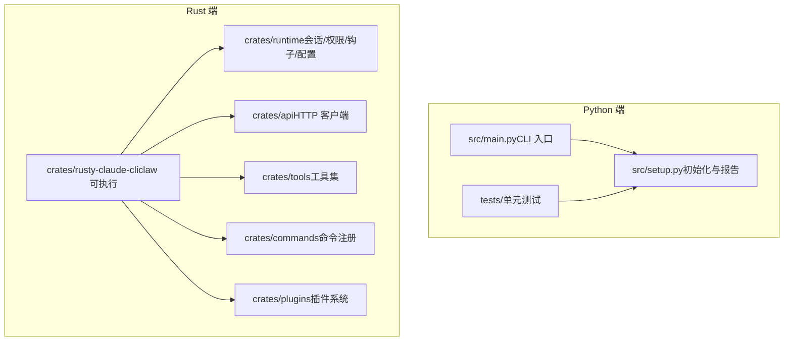
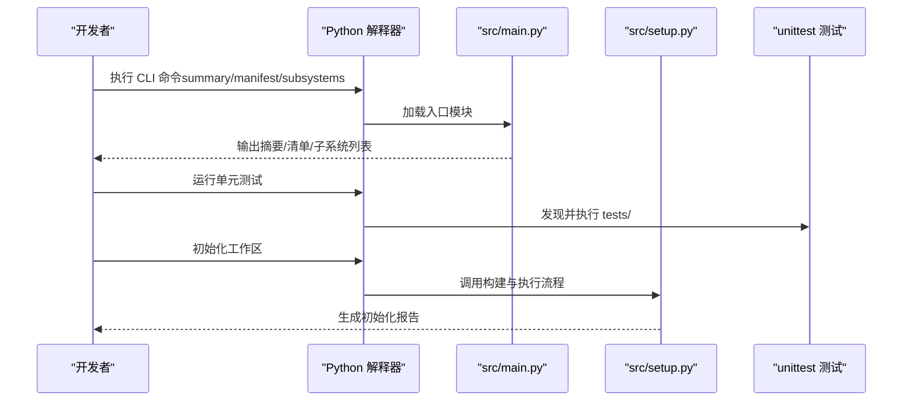
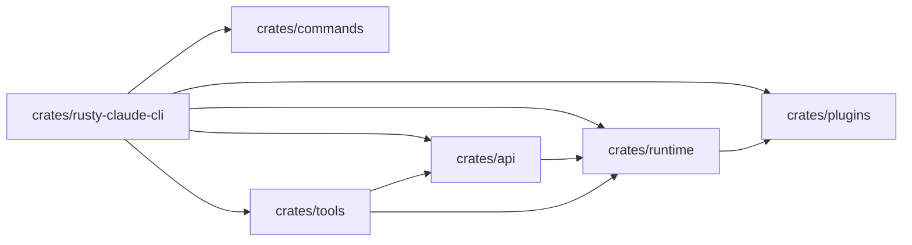
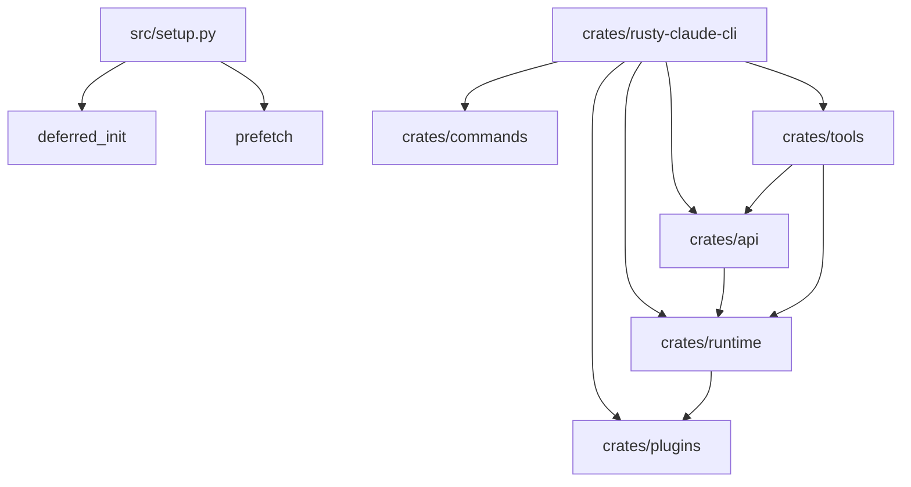

# 开发环境配置

<cite>
**本文引用的文件**
- [README.md](file://README.md)
- [CLAUDE.md](file://CLAUDE.md)
- [PARITY.md](file://PARITY.md)
- [Cargo.toml（工作区）](file://rust/Cargo.toml)
- [Cargo.toml（CLI 包）](file://rust/crates/rusty-claude-cli/Cargo.toml)
- [Cargo.toml（API 包）](file://rust/crates/api/Cargo.toml)
- [Cargo.toml（工具包）](file://rust/crates/tools/Cargo.toml)
- [Cargo.toml（运行时包）](file://rust/crates/runtime/Cargo.toml)
- [setup.py](file://src/setup.py)
</cite>

## 目录
1. [简介](#简介)
2. [项目结构](#项目结构)
3. [核心组件](#核心组件)
4. [架构总览](#架构总览)
5. [详细组件分析](#详细组件分析)
6. [依赖关系分析](#依赖关系分析)
7. [性能考虑](#性能考虑)
8. [故障排除指南](#故障排除指南)
9. [结论](#结论)
10. [附录](#附录)

## 简介
本文件面向 CLAW 项目的开发者，提供从零开始搭建开发环境的完整指南。内容覆盖：
- Python 环境与虚拟环境设置、依赖安装
- Rust 环境与 Cargo 工作区配置
- IDE 推荐配置（VS Code、PyCharm）
- 代码格式化与静态检查（Rust 使用 cargo fmt/clippy；Python 参考仓库脚本）
- 数据库与 API 密钥管理、环境变量建议
- Docker 容器化开发环境建议

本指南严格基于仓库中现有文件与脚本进行说明，避免臆造未在仓库中出现的信息。

## 项目结构
仓库采用“双语言并行”的组织方式：
- Python 前端：位于 src/，提供命令行入口与测试验证流程
- Rust 后端：位于 rust/，以 Cargo 工作区形式组织多个 crate，提供 CLI、API、运行时、工具集等模块

图表来源
- [Cargo.toml（工作区）:1-20](file://rust/Cargo.toml#L1-L20)
- [Cargo.toml（CLI 包）:1-28](file://rust/crates/rusty-claude-cli/Cargo.toml#L1-L28)
- [Cargo.toml（API 包）:1-17](file://rust/crates/api/Cargo.toml#L1-L17)
- [Cargo.toml（工具包）:1-19](file://rust/crates/tools/Cargo.toml#L1-L19)
- [Cargo.toml（运行时包）:1-20](file://rust/crates/runtime/Cargo.toml#L1-L20)

章节来源
- [README.md: 82-99:82-99](file://README.md#L82-L99)
- [Cargo.toml（工作区）: 1-20:1-20](file://rust/Cargo.toml#L1-L20)

## 核心组件
- Python 工作区
  - 提供 CLI 入口与测试运行命令，便于快速验证当前 Python 端状态
  - 通过 setup.py 提供工作区初始化与报告生成能力
- Rust 工作区
  - 以工作区形式统一管理 lint 规则与版本
  - CLI 可执行程序名为 claw，由 rusty-claude-cli crate 构建
  - API、工具、运行时、命令、插件等模块按职责拆分

章节来源
- [README.md: 101-150:101-150](file://README.md#L101-L150)
- [setup.py: 56-78:56-78](file://src/setup.py#L56-L78)
- [Cargo.toml（CLI 包）: 8-10:8-10](file://rust/crates/rusty-claude-cli/Cargo.toml#L8-L10)

## 架构总览
下图展示 Python 与 Rust 两套开发路径的协同关系：Python 负责快速验证与测试，Rust 负责高性能运行时与 CLI。

图表来源
- [README.md: 112-150:112-150](file://README.md#L112-L150)
- [Cargo.toml（CLI 包）: 12-24:12-24](file://rust/crates/rusty-claude-cli/Cargo.toml#L12-L24)
- [Cargo.toml（运行时包）: 8-16:8-16](file://rust/crates/runtime/Cargo.toml#L8-L16)
- [Cargo.toml（API 包）: 8-13:8-13](file://rust/crates/api/Cargo.toml#L8-L13)
- [Cargo.toml（工具包）: 8-15:8-15](file://rust/crates/tools/Cargo.toml#L8-L15)

## 详细组件分析

### Python 环境与依赖
- 运行与验证
  - 渲染 Python 端摘要与清单：使用 Python 模块方式运行 CLI 入口
  - 运行单元测试：使用 unittest 发现并执行 tests/ 下的测试
- 初始化与报告
  - 通过 setup.py 的构建函数生成工作区初始化步骤与报告
  - 支持预取、延迟初始化与信任模式开关

图表来源
- [README.md: 112-150:112-150](file://README.md#L112-L150)
- [setup.py: 64-78:64-78](file://src/setup.py#L64-L78)

章节来源
- [README.md: 112-150:112-150](file://README.md#L112-L150)
- [setup.py: 19-27:19-27](file://src/setup.py#L19-L27)
- [setup.py: 64-78:64-78](file://src/setup.py#L64-L78)

### Rust 环境与 Cargo 工作区
- 工作区配置
  - 统一版本、编辑器、许可证与解析器策略
  - 工作区统一的 Rust 与 Clippy 警告级别
- CLI 可执行
  - 名称为 claw，由 rusty-claude-cli crate 的二进制条目定义
- 依赖关系
  - CLI 依赖 API、命令、运行时、工具、插件等模块
  - API 依赖 reqwest（rustls TLS）、serde、tokio
  - 工具依赖 reqwest（blocking）、serde、tokio
  - 运行时依赖 sha2、glob、regex、serde、tokio、walkdir

图表来源
- [Cargo.toml（CLI 包）: 12-24:12-24](file://rust/crates/rusty-claude-cli/Cargo.toml#L12-L24)
- [Cargo.toml（API 包）: 8-13:8-13](file://rust/crates/api/Cargo.toml#L8-L13)
- [Cargo.toml（工具包）: 8-15:8-15](file://rust/crates/tools/Cargo.toml#L8-L15)
- [Cargo.toml（运行时包）: 8-16:8-16](file://rust/crates/runtime/Cargo.toml#L8-L16)

章节来源
- [Cargo.toml（工作区）: 1-20:1-20](file://rust/Cargo.toml#L1-L20)
- [Cargo.toml（CLI 包）: 8-10:8-10](file://rust/crates/rusty-claude-cli/Cargo.toml#L8-L10)
- [Cargo.toml（CLI 包）: 12-24:12-24](file://rust/crates/rusty-claude-cli/Cargo.toml#L12-L24)

### 代码格式化与静态检查
- Rust
  - 格式化：cargo fmt
  - 静态检查：cargo clippy（工作区全目标，禁止警告）
  - 测试：cargo test（工作区）
- Python
  - 仓库未提供专用 Python 格式化/静态检查脚本，但提供了测试与初始化流程，可作为开发流程的一部分

章节来源
- [CLAUDE.md: 9-11:9-11](file://CLAUDE.md#L9-L11)
- [README.md: 132-136:132-136](file://README.md#L132-L136)

### 数据库与 API 密钥管理
- 仓库未包含数据库连接配置或 API 密钥管理的具体实现
- 如需本地开发，请遵循以下通用实践：
  - 将敏感信息置于环境变量中，不在代码库中提交
  - 使用 .env 文件（确保已加入 .gitignore）并在启动前加载
  - 对于 Rust 端，可在运行时读取环境变量并注入到相关模块
  - 对于 Python 端，可通过 os.environ 或第三方库（如 python-dotenv）读取

[本节为通用指导，不直接分析具体文件，故无章节来源]

### Docker 容器化开发环境
- 仓库未提供 Dockerfile 或 docker-compose 配置
- 建议的容器化思路：
  - 基础镜像：选择包含 Python 与 Rust 工具链的基础镜像
  - 环境变量：通过 docker run -e 或 docker compose 的 environment 注入密钥
  - 卷挂载：将项目目录挂载到容器内，以便实时修改与调试
  - 端口映射：如需网络访问，按需映射端口
- 实施步骤（概念性流程）：
  - 准备基础镜像与工具链
  - 复制项目代码至镜像
  - 设置工作目录与环境变量
  - 启动开发服务（Python/CLI/Rust）

[本节为通用指导，不直接分析具体文件，故无章节来源]

## 依赖关系分析
- Python 端
  - setup.py 依赖 deferred_init、prefetch 等模块，用于构建初始化流程
- Rust 端
  - CLI 依赖 API、命令、运行时、工具、插件等模块
  - API 与工具均依赖 reqwest（rustls TLS）、serde、tokio
  - 运行时依赖 sha2、glob、regex、walkdir、tokio

图表来源
- [setup.py: 8-9:8-9](file://src/setup.py#L8-L9)
- [Cargo.toml（CLI 包）: 12-24:12-24](file://rust/crates/rusty-claude-cli/Cargo.toml#L12-L24)
- [Cargo.toml（API 包）: 8-13:8-13](file://rust/crates/api/Cargo.toml#L8-L13)
- [Cargo.toml（工具包）: 8-15:8-15](file://rust/crates/tools/Cargo.toml#L8-L15)
- [Cargo.toml（运行时包）: 8-16:8-16](file://rust/crates/runtime/Cargo.toml#L8-L16)

章节来源
- [setup.py: 8-9:8-9](file://src/setup.py#L8-L9)
- [Cargo.toml（CLI 包）: 12-24:12-24](file://rust/crates/rusty-claude-cli/Cargo.toml#L12-L24)

## 性能考虑
- Rust 端
  - 使用 tokio 多线程运行时提升并发性能
  - 通过 rustls TLS 优化网络请求性能
  - 以工作区统一 lint 规则，减少潜在性能隐患
- Python 端
  - 通过预取与延迟初始化减少启动开销
  - 测试驱动验证，有助于早期发现性能问题

[本节为通用指导，不直接分析具体文件，故无章节来源]

## 故障排除指南
- Rust 验证失败
  - 使用工作区统一命令进行格式化、静态检查与测试
  - 关注 clippy 的工作区全目标检查与警告处理
- Python 测试失败
  - 使用 unittest 发现并执行 tests/ 下的测试
  - 结合 setup.py 的初始化报告定位问题
- CLI 启动异常
  - 确认 claw 可执行是否正确构建
  - 检查运行时依赖（API、工具、命令、插件）是否齐全

章节来源
- [CLAUDE.md: 9-11:9-11](file://CLAUDE.md#L9-L11)
- [README.md: 132-136:132-136](file://README.md#L132-L136)
- [Cargo.toml（CLI 包）: 8-10:8-10](file://rust/crates/rusty-claude-cli/Cargo.toml#L8-L10)

## 结论
本指南基于仓库现有文件，给出了 Python 与 Rust 双栈的开发环境搭建要点，并结合仓库中的测试与初始化脚本，明确了验证与报告流程。对于数据库与 API 密钥管理、Docker 容器化等实践，提供了通用建议以帮助团队落地。随着 Rust 端功能逐步完善，建议持续关注 CLAUDE.md 中的工作流与验证要求。

[本节为总结性内容，不直接分析具体文件，故无章节来源]

## 附录

### Python 环境设置与依赖安装
- 创建虚拟环境（建议使用 venv 或 conda）
- 安装依赖（根据实际 requirements/依赖声明进行）
- 运行测试与初始化报告

章节来源
- [README.md: 132-136:132-136](file://README.md#L132-L136)
- [setup.py: 64-78:64-78](file://src/setup.py#L64-L78)

### Rust 环境与 Cargo 工具链
- 安装 Rust 工具链（建议使用 rustup）
- 在 rust/ 目录下执行工作区级验证命令
- 构建 CLI 可执行程序（名称见工作区说明）

章节来源
- [CLAUDE.md: 9-11:9-11](file://CLAUDE.md#L9-L11)
- [Cargo.toml（CLI 包）: 8-10:8-10](file://rust/crates/rusty-claude-cli/Cargo.toml#L8-L10)

### IDE 配置建议
- VS Code
  - 安装 Python 与 Rust 扩展
  - 配置任务与启动配置以运行 Python CLI 与 Rust 测试
- PyCharm
  - 使用项目解释器指向虚拟环境
  - 配置 Python 与 Rust 相关的代码风格与检查工具

[本节为通用指导，不直接分析具体文件，故无章节来源]

### 代码格式化与静态检查
- Rust
  - cargo fmt：统一代码风格
  - cargo clippy：静态检查与警告
  - cargo test：运行测试
- Python
  - 仓库未提供专用格式化/静态检查脚本，可结合测试与初始化流程进行质量控制

章节来源
- [CLAUDE.md: 9-11:9-11](file://CLAUDE.md#L9-L11)
- [README.md: 132-136:132-136](file://README.md#L132-L136)

### 环境变量与密钥管理
- 将敏感信息置于环境变量中
- 使用 .env 文件（确保已加入 .gitignore）
- 在启动前加载环境变量

[本节为通用指导，不直接分析具体文件，故无章节来源]

### Docker 容器化开发环境
- 基础镜像包含 Python 与 Rust 工具链
- 卷挂载项目目录，环境变量通过 -e 或 environment 注入
- 端口映射按需开放

[本节为通用指导，不直接分析具体文件，故无章节来源]