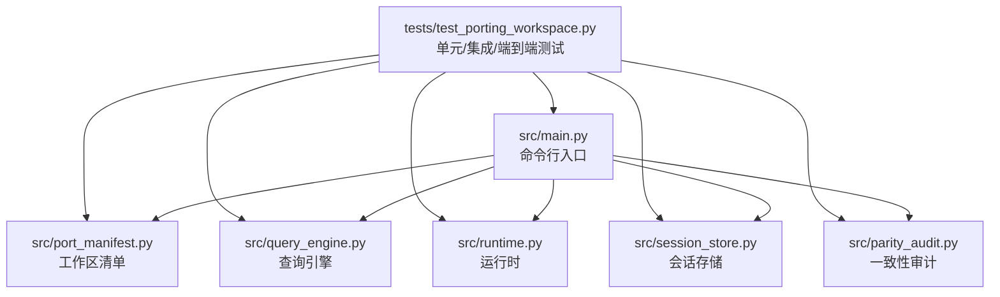
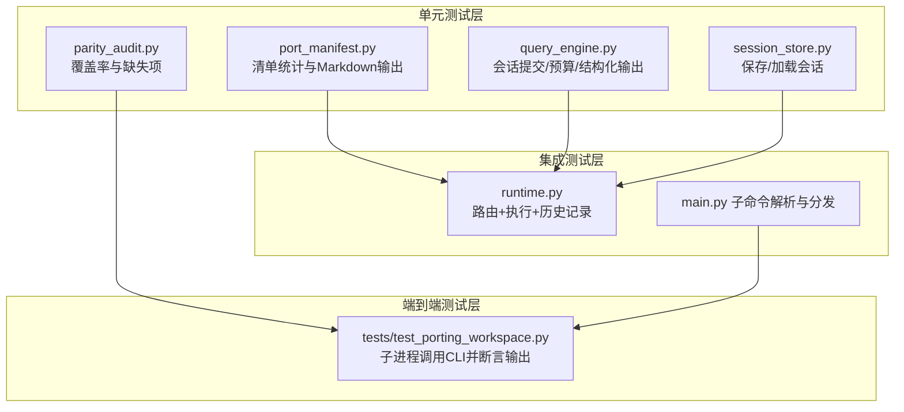
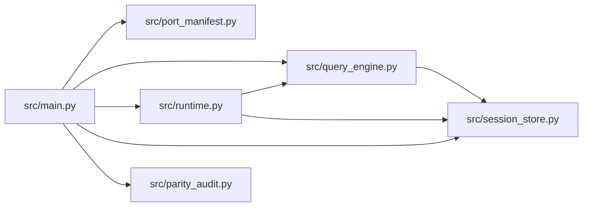

# 测试策略

<cite>
**本文引用的文件**
- [README.md](file://README.md)
- [Cargo.toml](file://rust/Cargo.toml)
- [test_porting_workspace.py](file://tests/test_porting_workspace.py)
- [main.py](file://src/main.py)
- [port_manifest.py](file://src/port_manifest.py)
- [query_engine.py](file://src/query_engine.py)
- [parity_audit.py](file://src/parity_audit.py)
- [runtime.py](file://src/runtime.py)
- [session_store.py](file://src/session_store.py)
</cite>

## 目录
1. [引言](#引言)
2. [项目结构](#项目结构)
3. [核心组件](#核心组件)
4. [架构总览](#架构总览)
5. [详细组件分析](#详细组件分析)
6. [依赖分析](#依赖分析)
7. [性能考虑](#性能考虑)
8. [故障排查指南](#故障排查指南)
9. [结论](#结论)
10. [附录](#附录)

## 引言
本测试策略文档面向 CLAW（Python porting workspace）项目，系统化阐述单元测试、集成测试与端到端测试的设计原则与实施方法；解释测试金字塔在该项目中的落地方式；给出测试用例编写指南、Mock 使用建议与测试数据管理策略；并覆盖测试自动化流程、持续集成配置与测试报告生成；最后说明回归测试与性能测试的实践要点。

## 项目结构
CLAW 的测试以 Python 单元测试为主，配合命令行入口的端到端验证。测试入口通过 Python 的 unittest 框架执行，使用子进程调用 CLI 子命令，验证输出内容与行为一致性。仓库中包含一个测试文件与若干核心模块：命令行入口、工作区清单、查询引擎、运行时会话、会话持久化与一致性审计等。

图表来源
- [test_porting_workspace.py:1-249](file://tests/test_porting_workspace.py#L1-L249)
- [main.py:1-214](file://src/main.py#L1-L214)
- [port_manifest.py:1-53](file://src/port_manifest.py#L1-L53)
- [query_engine.py:1-194](file://src/query_engine.py#L1-L194)
- [runtime.py:1-193](file://src/runtime.py#L1-L193)
- [session_store.py:1-36](file://src/session_store.py#L1-L36)
- [parity_audit.py:1-139](file://src/parity_audit.py#L1-L139)

章节来源
- [README.md:95-136](file://README.md#L95-L136)
- [test_porting_workspace.py:1-249](file://tests/test_porting_workspace.py#L1-L249)
- [main.py:21-91](file://src/main.py#L21-L91)

## 核心组件
- 命令行入口：提供多种子命令，用于渲染摘要、打印清单、执行路由、引导会话、运行回合循环、加载会话、远程模式模拟等。
- 工作区清单：统计顶层模块与文件数量，生成 Markdown 报告。
- 查询引擎：承载会话状态、令牌预算、消息压缩、结构化输出与摘要渲染。
- 运行时：负责提示路由、构建上下文与设置、执行命令/工具、记录历史与流式事件。
- 会话存储：保存/加载会话，支持 JSON 序列化与目录约定。
- 一致性审计：对比本地 Python 工作区与被忽略的 TypeScript 快照，评估覆盖率与缺失项。

章节来源
- [main.py:94-209](file://src/main.py#L94-L209)
- [port_manifest.py:30-53](file://src/port_manifest.py#L30-L53)
- [query_engine.py:35-194](file://src/query_engine.py#L35-L194)
- [runtime.py:89-193](file://src/runtime.py#L89-L193)
- [session_store.py:19-36](file://src/session_store.py#L19-L36)
- [parity_audit.py:121-139](file://src/parity_audit.py#L121-L139)

## 架构总览
下图展示测试金字塔在 CLAW 中的映射：底层为单元测试（对模块函数与类），中间为集成测试（模块间交互），上层为端到端测试（通过 CLI 驱动完整流程）。

图表来源
- [port_manifest.py:30-53](file://src/port_manifest.py#L30-L53)
- [query_engine.py:61-104](file://src/query_engine.py#L61-L104)
- [session_store.py:19-36](file://src/session_store.py#L19-L36)
- [parity_audit.py:121-139](file://src/parity_audit.py#L121-L139)
- [runtime.py:89-152](file://src/runtime.py#L89-L152)
- [main.py:94-209](file://src/main.py#L94-L209)
- [test_porting_workspace.py:27-34](file://tests/test_porting_workspace.py#L27-L34)

## 详细组件分析

### 单元测试设计与实施
- 测试目标
  - 确保清单统计逻辑正确、Markdown 输出格式稳定。
  - 验证查询引擎在预算控制、消息压缩、结构化输出方面的行为。
  - 保证会话存取的序列化/反序列化正确性与路径约定。
  - 校验一致性审计结果的计算与 Markdown 渲染。
- 覆盖范围
  - 清单模块：统计文件数、顶层模块列表、Markdown 格式。
  - 查询引擎：提交消息、预算检查、压缩策略、结构化输出回退。
  - 会话存储：保存路径、JSON 结构、加载一致性。
  - 审计模块：根文件覆盖率、目录覆盖率、条目比率、缺失项集合。
- 编写指南
  - 使用断言确保返回值类型与结构符合预期（如元组长度、字典键存在）。
  - 对结构化输出失败场景进行异常路径测试，验证回退机制。
  - 对预算阈值边界进行参数化测试，覆盖“完成/预算耗尽”两种停止原因。
  - 对会话 ID 与消息列表进行等价性测试，避免序列化偏差。
- Mock 建议
  - 对外部文件系统操作（读写 JSON、遍历目录）使用 unittest.mock.patch 或临时目录。
  - 对外部依赖（如网络请求）在相关模块中抽象接口后进行替换。
- 数据管理
  - 将测试输入与期望输出集中于测试文件或 fixtures，便于维护与复用。
  - 对会话数据采用固定种子或固定会话 ID，确保可重复性。

章节来源
- [port_manifest.py:30-53](file://src/port_manifest.py#L30-L53)
- [query_engine.py:61-104](file://src/query_engine.py#L61-L104)
- [query_engine.py:161-169](file://src/query_engine.py#L161-L169)
- [session_store.py:19-36](file://src/session_store.py#L19-L36)
- [parity_audit.py:121-139](file://src/parity_audit.py#L121-L139)

### 集成测试设计与实施
- 测试目标
  - 验证运行时路由、执行命令/工具、权限拒绝推断与历史记录的协同。
  - 校验 CLI 子命令解析与分发逻辑，确保各子命令正确调用对应模块。
- 关键流程
  - 路由匹配：基于提示词分词与模块属性评分，选择前 N 个候选。
  - 执行注册表：根据匹配结果调用命令/工具执行器，收集执行消息。
  - 权限推断：对高风险工具（如破坏性 Shell）进行拒绝标记。
  - 历史记录：记录上下文、注册表规模、路由与执行结果、会话存储位置。
- 断言策略
  - 匹配数量与顺序：确保路由结果数量与排序符合预期。
  - 执行消息：确认命令/工具执行返回的消息片段包含“镜像”标识。
  - 权限拒绝：针对特定工具名称断言拒绝原因。
  - 历史日志：断言关键步骤已记录，且包含必要字段。
- Mock 建议
  - 对外部执行器与网络调用进行接口抽象，使用 Mock 替换以隔离外部依赖。
  - 对随机性或时间敏感逻辑进行固定种子或时间戳替换。

章节来源
- [runtime.py:89-152](file://src/runtime.py#L89-L152)
- [runtime.py:169-174](file://src/runtime.py#L169-L174)
- [runtime.py:176-192](file://src/runtime.py#L176-L192)
- [main.py:94-209](file://src/main.py#L94-L209)

### 端到端测试设计与实施
- 测试目标
  - 通过子进程调用 CLI，验证从入口到输出的完整链路。
  - 确保摘要渲染、清单打印、路由、引导会话、回合循环、会话加载、模式切换等功能可用。
- 关键场景
  - 摘要渲染：断言输出包含摘要标题与关键段落。
  - 清单打印：断言输出包含模块计数与文件数量。
  - 路由与引导：断言路由结果与引导会话包含预期字段。
  - 回合循环：断言多轮对话按序输出，并在预算或轮次限制时停止。
  - 会话加载：断言加载的会话包含消息数量与令牌用量。
  - 模式切换：断言不同运行模式输出包含相应标志。
- 断言策略
  - 使用字符串包含判断输出片段，避免对动态内容（如时间戳、会话 ID）进行严格匹配。
  - 对可选参数（如 limit、structured-output）进行组合测试，覆盖默认与自定义行为。
- Mock 建议
  - 在端到端层尽量减少 Mock，优先通过真实子进程与临时目录隔离环境。
  - 对外部网络或不可控资源进行最小化替换，确保测试稳定性。

章节来源
- [test_porting_workspace.py:27-34](file://tests/test_porting_workspace.py#L27-L34)
- [test_porting_workspace.py:57-71](file://tests/test_porting_workspace.py#L57-L71)
- [test_porting_workspace.py:81-102](file://tests/test_porting_workspace.py#L81-L102)
- [test_porting_workspace.py:186-194](file://tests/test_porting_workspace.py#L186-L194)
- [test_porting_workspace.py:162-174](file://tests/test_porting_workspace.py#L162-L174)
- [test_porting_workspace.py:196-202](file://tests/test_porting_workspace.py#L196-L202)
- [test_porting_workspace.py:213-217](file://tests/test_porting_workspace.py#L213-L217)

### 测试金字塔在项目中的应用
- 底层（单元测试）：占绝大多数，覆盖核心模块函数与类的行为，确保变更不会破坏基础功能。
- 中层（集成测试）：验证模块间协作与边界行为，降低端到端测试成本。
- 顶层（端到端测试）：验证完整用户路径，确保 CLI 与工作流整体可用性。
- 质量标准
  - 单元测试：高内聚、低耦合，每个测试聚焦单一职责。
  - 集成测试：关注接口契约与数据流，避免过度 Mock。
  - 端到端测试：覆盖关键用户路径，保持简洁与稳定。

章节来源
- [test_porting_workspace.py:15-249](file://tests/test_porting_workspace.py#L15-L249)
- [main.py:21-91](file://src/main.py#L21-L91)

### 测试覆盖率与质量标准
- 覆盖率要求（建议）
  - 单元测试：语句覆盖率≥80%，分支覆盖率≥70%，关键路径≥90%。
  - 集成测试：模块间交互覆盖率≥70%，错误处理路径≥80%。
  - 端到端测试：关键用户路径覆盖率≥90%，回归用例≥100%。
- 质量标准
  - 可重复性：测试在不同环境与时间点应稳定通过。
  - 可维护性：测试命名清晰、断言明确、fixture 可复用。
  - 可观测性：失败用例应提供足够上下文信息（输入、期望、实际）。

章节来源
- [README.md:132-136](file://README.md#L132-L136)

### 测试用例编写指南
- 命名规范
  - 使用动宾结构描述行为，如 test_submit_message_exceeds_budget。
  - 对参数化场景使用下划线分隔参数值，如 test_route_with_limit_5。
- 断言策略
  - 优先使用具体断言（如 assertGreaterEqual、assertIn），避免通用断言。
  - 对结构化输出与 JSON 解析失败场景，断言异常类型与错误消息。
- 数据驱动
  - 将输入与期望封装为参数化用例，提升覆盖率与可维护性。
- 并发与并发安全
  - 对共享资源（临时目录、会话文件）使用唯一标识符避免冲突。

章节来源
- [query_engine.py:61-104](file://src/query_engine.py#L61-L104)
- [query_engine.py:161-169](file://src/query_engine.py#L161-L169)
- [session_store.py:19-36](file://src/session_store.py#L19-L36)

### Mock 对象使用
- 推荐做法
  - 对文件系统与网络调用进行接口抽象，使用 unittest.mock.patch 替换。
  - 对外部执行器（命令/工具）使用 Mock 返回可控输出，避免真实副作用。
- 适用场景
  - 大型外部依赖、不稳定服务、时间敏感逻辑。
- 注意事项
  - 仅在必要范围内进行 Mock，避免过度隔离导致测试失真。
  - 对 Mock 行为进行注释说明，便于他人理解。

章节来源
- [runtime.py:118-127](file://src/runtime.py#L118-L127)
- [query_engine.py:106-127](file://src/query_engine.py#L106-L127)

### 测试数据管理
- 策略
  - 使用临时目录存放会话文件，避免污染工作区。
  - 将基准数据（快照、参考文件）置于 tests/fixtures 或 src/reference_data，统一版本管理。
  - 对一致性审计所需的数据（JSON 快照）进行校验与备份。
- 维护
  - 当上游快照更新时，同步更新参考数据并调整断言阈值。
  - 对测试数据进行版本控制与变更追踪。

章节来源
- [session_store.py:16-24](file://src/session_store.py#L16-L24)
- [parity_audit.py:7-11](file://src/parity_audit.py#L7-L11)

### 测试自动化与持续集成
- 自动化流程
  - 单元测试：在本地与 CI 中均执行，确保快速反馈。
  - 集成测试：在 CI 中启用，隔离外部依赖。
  - 端到端测试：在 CI 中按需执行，或在 PR 合并前触发。
- 持续集成配置（建议）
  - 触发条件：push 到主分支、PR 打开/更新、定时全量回归。
  - 步骤：安装依赖、运行单元测试、运行集成测试、运行端到端测试、上传覆盖率报告。
  - 并行化：按模块拆分任务，缩短总耗时。
- 测试报告
  - 生成 HTML/Coverage 报告，上传至制品库或专用页面。
  - 对失败用例截图/导出日志，便于定位问题。

章节来源
- [README.md:132-136](file://README.md#L132-L136)
- [Cargo.toml:1-20](file://rust/Cargo.toml#L1-L20)

### 回归测试与性能测试
- 回归测试
  - 将关键端到端场景作为回归基线，随每次变更执行。
  - 对一致性审计结果进行阈值监控，防止覆盖率下降。
- 性能测试
  - 对查询引擎的预算控制、消息压缩与回合循环进行吞吐与延迟测量。
  - 对 CLI 子命令的响应时间进行基准测试，识别瓶颈。

章节来源
- [test_porting_workspace.py:45-51](file://tests/test_porting_workspace.py#L45-L51)
- [query_engine.py:129-132](file://src/query_engine.py#L129-L132)
- [runtime.py:154-167](file://src/runtime.py#L154-L167)

## 依赖分析
- 组件耦合
  - CLI 依赖清单、查询引擎、运行时、会话存储与审计模块。
  - 运行时依赖命令/工具清单、执行注册表、上下文与设置。
  - 查询引擎依赖清单、会话存储与转录本。
- 外部依赖
  - 文件系统（会话持久化）、JSON 序列化、子进程（端到端测试）。
- 循环依赖
  - 当前模块间无明显循环依赖；若后续扩展，应通过接口抽象避免。

图表来源
- [main.py:1-18](file://src/main.py#L1-L18)
- [runtime.py:1-14](file://src/runtime.py#L1-L14)
- [query_engine.py:1-12](file://src/query_engine.py#L1-L12)
- [session_store.py:1-13](file://src/session_store.py#L1-L13)
- [port_manifest.py:1-7](file://src/port_manifest.py#L1-L7)
- [parity_audit.py:1-11](file://src/parity_audit.py#L1-L11)

章节来源
- [main.py:1-18](file://src/main.py#L1-L18)
- [runtime.py:1-14](file://src/runtime.py#L1-L14)
- [query_engine.py:1-12](file://src/query_engine.py#L1-L12)
- [session_store.py:1-13](file://src/session_store.py#L1-L13)
- [port_manifest.py:1-7](file://src/port_manifest.py#L1-L7)
- [parity_audit.py:1-11](file://src/parity_audit.py#L1-L11)

## 性能考虑
- 测试执行效率
  - 将大文件读写与外部调用移至 setUp/tearDown，避免重复初始化。
  - 对端到端测试进行参数化与并行化，缩短总耗时。
- 资源管理
  - 使用临时目录与唯一会话 ID，避免资源竞争。
  - 对网络与外部进程进行超时与重试策略，提升稳定性。

## 故障排查指南
- 常见问题
  - CLI 子命令未找到：检查命令解析与子命令注册是否一致。
  - 会话加载失败：确认会话文件存在且 JSON 结构正确。
  - 结构化输出失败：检查 JSON 序列化异常回退逻辑。
  - 覆盖率下降：核对新增模块是否补充单元/集成测试。
- 排查步骤
  - 逐层缩小范围：先运行单元测试，再运行集成测试，最后运行端到端测试。
  - 查看失败用例的输入与期望，结合日志定位问题。
  - 对 Mock 层进行剥离，确认真实依赖是否正常。

章节来源
- [query_engine.py:161-169](file://src/query_engine.py#L161-L169)
- [session_store.py:27-36](file://src/session_store.py#L27-L36)
- [test_porting_workspace.py:123-137](file://tests/test_porting_workspace.py#L123-L137)

## 结论
本测试策略以测试金字塔为核心，结合 CLAW 的模块化结构，形成从单元到端到端的完整测试体系。通过明确的质量标准、覆盖率要求与自动化流程，可有效保障代码质量与交付稳定性。建议持续优化测试数据管理与性能测试，以适应项目演进。

## 附录
- 快速开始
  - 运行单元测试：使用 Python 的 unittest 发现机制执行 tests 目录。
  - 运行端到端测试：通过子进程调用 CLI 子命令，断言输出内容。
- 参考命令
  - 摘要渲染、清单打印、路由、引导会话、回合循环、会话加载、模式切换等子命令均可作为测试场景。

章节来源
- [README.md:132-149](file://README.md#L132-L149)
- [test_porting_workspace.py:27-202](file://tests/test_porting_workspace.py#L27-L202)