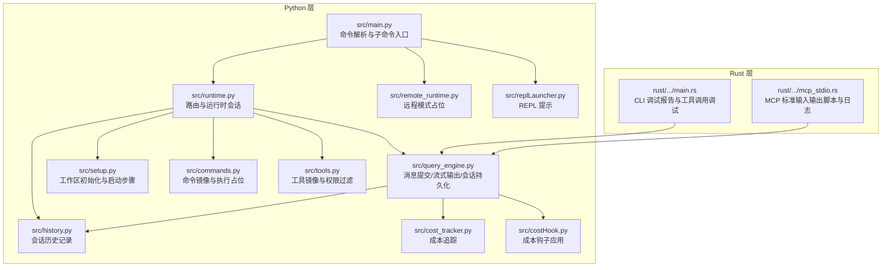
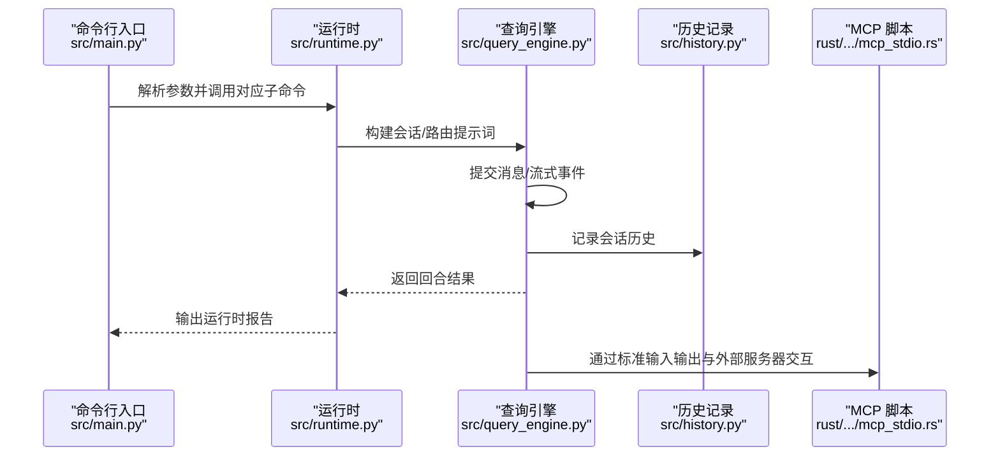
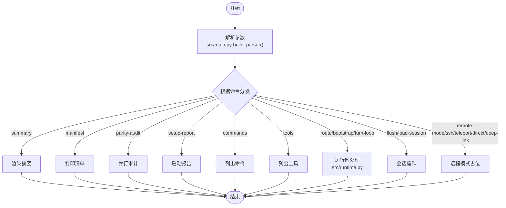
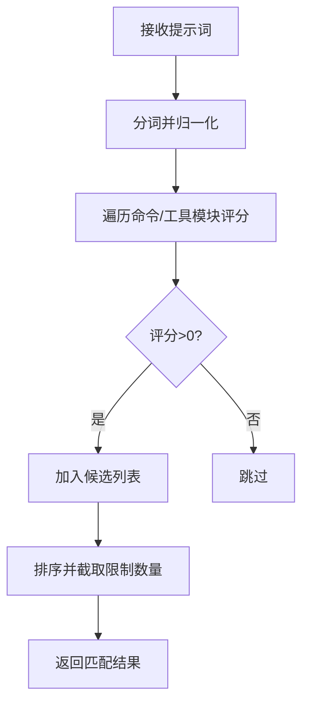
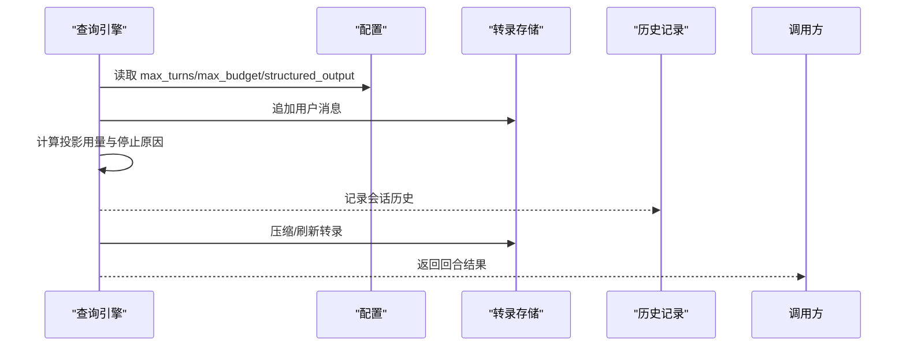
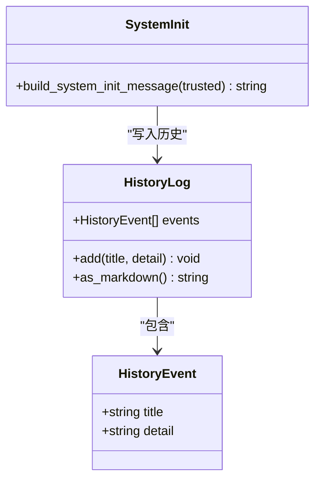
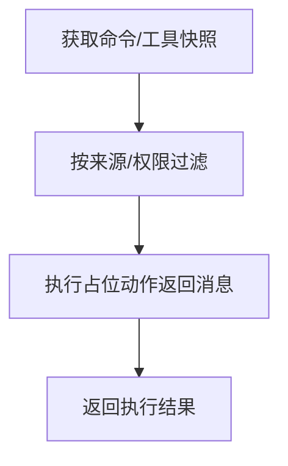
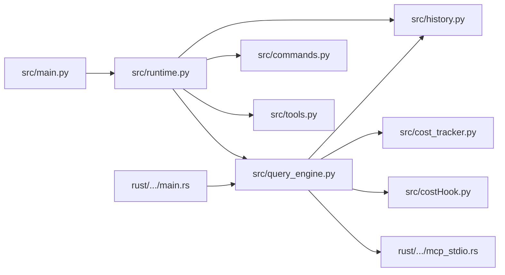

# 调试工具

<cite>
**本文引用的文件**
- [src/main.py](file://src/main.py)
- [src/runtime.py](file://src/runtime.py)
- [src/system_init.py](file://src/system_init.py)
- [src/setup.py](file://src/setup.py)
- [src/history.py](file://src/history.py)
- [src/query_engine.py](file://src/query_engine.py)
- [src/commands.py](file://src/commands.py)
- [src/tools.py](file://src/tools.py)
- [src/remote_runtime.py](file://src/remote_runtime.py)
- [src/cost_tracker.py](file://src/cost_tracker.py)
- [src/costHook.py](file://src/costHook.py)
- [src/replLauncher.py](file://src/replLauncher.py)
- [rust/crates/runtime/src/mcp_stdio.rs](file://rust/crates/runtime/src/mcp_stdio.rs)
- [rust/crates/rusty-claude-cli/src/main.rs](file://rust/crates/rusty-claude-cli/src/main.rs)
</cite>

## 目录
1. [简介](#简介)
2. [项目结构](#项目结构)
3. [核心组件](#核心组件)
4. [架构总览](#架构总览)
5. [详细组件分析](#详细组件分析)
6. [依赖分析](#依赖分析)
7. [性能考虑](#性能考虑)
8. [故障排查指南](#故障排查指南)
9. [结论](#结论)
10. [附录](#附录)

## 简介
本文件面向 CLAW 项目的开发者与维护者，系统化梳理调试工具与技巧，覆盖以下主题：
- Python 调试器使用：断点设置、变量检查、调用栈追踪
- 日志系统：历史记录与会话记录的组织方式、可扩展的日志输出
- 性能分析：令牌预算、会话压缩、成本追踪与重试机制
- IDE 调试与远程调试：本地断点、远程 MCP 服务脚本与日志路径
- 常见问题诊断：路由失败、权限拒绝、最大轮次与预算限制

## 项目结构
CLAW 的调试相关能力主要集中在 Python 层（src 目录）与 Rust 运行时（rust/crates）之间协作的部分。Python 层负责命令/工具路由、运行时会话、查询引擎与会话持久化；Rust 层提供 MCP 通信与 CLI 调试报告。

**图表来源**
- [src/main.py:1-214](file://src/main.py#L1-L214)
- [src/runtime.py:1-193](file://src/runtime.py#L1-L193)
- [src/query_engine.py:1-194](file://src/query_engine.py#L1-L194)
- [src/setup.py:1-78](file://src/setup.py#L1-L78)
- [src/history.py:1-23](file://src/history.py#L1-L23)
- [src/commands.py:1-91](file://src/commands.py#L1-L91)
- [src/tools.py:1-97](file://src/tools.py#L1-L97)
- [src/remote_runtime.py:1-25](file://src/remote_runtime.py#L1-L25)
- [src/cost_tracker.py:1-13](file://src/cost_tracker.py#L1-L13)
- [src/costHook.py:1-8](file://src/costHook.py#L1-L8)
- [src/replLauncher.py:1-5](file://src/replLauncher.py#L1-L5)
- [rust/crates/runtime/src/mcp_stdio.rs:854-1081](file://rust/crates/runtime/src/mcp_stdio.rs#L854-L1081)
- [rust/crates/rusty-claude-cli/src/main.rs:1664-4846](file://rust/crates/rusty-claude-cli/src/main.rs#L1664-L4846)

**章节来源**
- [src/main.py:1-214](file://src/main.py#L1-L214)
- [src/runtime.py:1-193](file://src/runtime.py#L1-L193)
- [src/query_engine.py:1-194](file://src/query_engine.py#L1-L194)
- [src/setup.py:1-78](file://src/setup.py#L1-L78)
- [src/history.py:1-23](file://src/history.py#L1-L23)
- [src/commands.py:1-91](file://src/commands.py#L1-L91)
- [src/tools.py:1-97](file://src/tools.py#L1-L97)
- [src/remote_runtime.py:1-25](file://src/remote_runtime.py#L1-L25)
- [src/cost_tracker.py:1-13](file://src/cost_tracker.py#L1-L13)
- [src/costHook.py:1-8](file://src/costHook.py#L1-L8)
- [src/replLauncher.py:1-5](file://src/replLauncher.py#L1-L5)
- [rust/crates/runtime/src/mcp_stdio.rs:854-1081](file://rust/crates/runtime/src/mcp_stdio.rs#L854-L1081)
- [rust/crates/rusty-claude-cli/src/main.rs:1664-4846](file://rust/crates/rusty-claude-cli/src/main.rs#L1664-L4846)

## 核心组件
- 命令行入口与子命令：通过参数解析分发到具体功能，便于在 IDE 中设置断点进行单步调试。
- 运行时与路由：对提示词进行分词匹配，收集命令/工具候选，支持多轮对话与权限拒绝推理。
- 查询引擎：提交消息、流式事件、会话持久化、令牌预算控制与消息压缩。
- 历史记录：以结构化事件记录关键阶段，便于回溯与定位问题。
- 成本追踪：记录事件与累计单位，配合钩子函数进行埋点。
- 远程模式与 REPL：提供远程分支占位与非交互式 REPL 提示，辅助远程调试与快速验证。

**章节来源**
- [src/main.py:21-91](file://src/main.py#L21-L91)
- [src/runtime.py:89-193](file://src/runtime.py#L89-L193)
- [src/query_engine.py:35-194](file://src/query_engine.py#L35-L194)
- [src/history.py:12-23](file://src/history.py#L12-L23)
- [src/cost_tracker.py:6-13](file://src/cost_tracker.py#L6-L13)
- [src/costHook.py:6-8](file://src/costHook.py#L6-L8)
- [src/remote_runtime.py:16-25](file://src/remote_runtime.py#L16-L25)
- [src/replLauncher.py:4-5](file://src/replLauncher.py#L4-L5)

## 架构总览
下图展示从命令行入口到运行时、查询引擎与历史记录的整体流程，以及与 Rust 层 MCP 脚本的协作关系。

**图表来源**
- [src/main.py:94-214](file://src/main.py#L94-L214)
- [src/runtime.py:109-167](file://src/runtime.py#L109-L167)
- [src/query_engine.py:61-127](file://src/query_engine.py#L61-L127)
- [src/history.py:16-22](file://src/history.py#L16-L22)
- [rust/crates/runtime/src/mcp_stdio.rs:1022-1081](file://rust/crates/runtime/src/mcp_stdio.rs#L1022-L1081)

## 详细组件分析

### 组件一：命令行入口与断点调试
- 入口函数负责参数解析与子命令分发，适合在 IDE 中设置断点进行交互式调试。
- 建议在以下位置设置断点：
  - 参数解析后、进入各子命令逻辑前
  - 执行具体功能（如路由、会话加载、远程模式）前后
- 变量检查要点：
  - 检查命令行参数对象与工作区清单
  - 验证会话 ID、提示词与权限上下文

**图表来源**
- [src/main.py:21-91](file://src/main.py#L21-L91)
- [src/main.py:94-214](file://src/main.py#L94-L214)

**章节来源**
- [src/main.py:21-91](file://src/main.py#L21-L91)
- [src/main.py:94-214](file://src/main.py#L94-L214)

### 组件二：运行时与路由（断点与变量检查）
- 路由逻辑基于提示词分词与模块元数据评分，支持命令与工具候选收集。
- 断点建议：
  - 在路由开始处设置断点，检查分词集合与候选列表
  - 在执行命令/工具前检查权限拒绝推理
- 变量检查要点：
  - tokens、by_kind、selected、leftovers
  - 权限拒绝列表与最终匹配数量

**图表来源**
- [src/runtime.py:89-107](file://src/runtime.py#L89-L107)
- [src/runtime.py:176-192](file://src/runtime.py#L176-L192)

**章节来源**
- [src/runtime.py:89-107](file://src/runtime.py#L89-L107)
- [src/runtime.py:176-192](file://src/runtime.py#L176-L192)

### 组件三：查询引擎与会话持久化（流式事件与历史记录）
- 支持提交消息、流式事件生成、会话持久化与令牌预算控制。
- 断点建议：
  - 在提交消息前后设置断点，检查匹配的命令/工具与权限拒绝
  - 在流式事件生成处设置断点，观察事件类型与内容
- 变量检查要点：
  - 配置项（最大轮次、预算、结构化输出）
  - 使用统计与停止原因
  - 会话 ID、转录存储状态

**图表来源**
- [src/query_engine.py:61-127](file://src/query_engine.py#L61-L127)
- [src/query_engine.py:140-150](file://src/query_engine.py#L140-L150)
- [src/history.py:16-22](file://src/history.py#L16-L22)

**章节来源**
- [src/query_engine.py:61-127](file://src/query_engine.py#L61-L127)
- [src/query_engine.py:140-150](file://src/query_engine.py#L140-L150)
- [src/history.py:16-22](file://src/history.py#L16-L22)

### 组件四：历史记录与系统初始化（日志与报告）
- 历史记录以结构化事件保存，便于生成 Markdown 报告。
- 系统初始化报告汇总信任模式、命令/工具加载数量与启动步骤。
- 建议在以下位置设置断点：
  - 初始化消息构建完成后
  - 历史记录添加事件后

**图表来源**
- [src/history.py:6-22](file://src/history.py#L6-L22)
- [src/system_init.py:8-23](file://src/system_init.py#L8-L23)

**章节来源**
- [src/history.py:6-22](file://src/history.py#L6-L22)
- [src/system_init.py:8-23](file://src/system_init.py#L8-L23)

### 组件五：命令与工具镜像（权限与执行占位）
- 命令与工具来自快照，支持按来源/技能/插件过滤与权限上下文过滤。
- 断点建议：
  - 在执行前检查模块是否存在与权限是否允许
- 变量检查要点：
  - 过滤后的工具列表长度与权限拒绝数量

**图表来源**
- [src/commands.py:22-80](file://src/commands.py#L22-L80)
- [src/tools.py:23-86](file://src/tools.py#L23-L86)

**章节来源**
- [src/commands.py:22-80](file://src/commands.py#L22-L80)
- [src/tools.py:23-86](file://src/tools.py#L23-L86)

### 组件六：远程模式与 REPL（远程调试与占位）
- 远程模式提供占位报告，便于在不同运行模式间切换与验证。
- REPL 提示当前为非交互式，建议使用命令行摘要或会话报告进行验证。

**章节来源**
- [src/remote_runtime.py:16-25](file://src/remote_runtime.py#L16-L25)
- [src/replLauncher.py:4-5](file://src/replLauncher.py#L4-L5)

### 组件七：成本追踪与钩子（性能埋点）
- 成本追踪器记录累计单位与事件明细，钩子函数用于在关键路径上打点。
- 断点建议：
  - 在钩子调用前后检查累计值变化
- 变量检查要点：
  - 事件标签与单位数

**章节来源**
- [src/cost_tracker.py:6-13](file://src/cost_tracker.py#L6-L13)
- [src/costHook.py:6-8](file://src/costHook.py#L6-L8)

### 组件八：MCP 标准输入输出与日志（远程调试）
- Rust 层提供 MCP 服务器脚本，支持通过环境变量启用日志文件，便于远程调试与问题复现。
- 建议：
  - 设置日志路径环境变量以捕获请求/响应序列
  - 结合查询引擎的流式事件定位问题

**章节来源**
- [rust/crates/runtime/src/mcp_stdio.rs:1022-1081](file://rust/crates/runtime/src/mcp_stdio.rs#L1022-L1081)

### 组件九：CLI 调试报告（工具调用调试）
- CLI 提供“调试工具调用”报告，可查看最近一次工具调用的输入与结果，辅助远程调试。
- 建议：
  - 在工具调用后立即触发调试报告
  - 对比工具名称、输入与错误标记

**章节来源**
- [rust/crates/rusty-claude-cli/src/main.rs:2180-2215](file://rust/crates/rusty-claude-cli/src/main.rs#L2180-L2215)

## 依赖分析
- 入口模块依赖运行时与查询引擎，运行时依赖命令/工具镜像与历史记录，查询引擎依赖会话存储与成本追踪。
- Rust 层 MCP 脚本与 CLI 与 Python 查询引擎通过流式事件与会话持久化交互。

**图表来源**
- [src/main.py:1-214](file://src/main.py#L1-L214)
- [src/runtime.py:1-193](file://src/runtime.py#L1-L193)
- [src/query_engine.py:1-194](file://src/query_engine.py#L1-L194)
- [src/commands.py:1-91](file://src/commands.py#L1-L91)
- [src/tools.py:1-97](file://src/tools.py#L1-L97)
- [src/history.py:1-23](file://src/history.py#L1-L23)
- [src/cost_tracker.py:1-13](file://src/cost_tracker.py#L1-L13)
- [src/costHook.py:1-8](file://src/costHook.py#L1-L8)
- [rust/crates/runtime/src/mcp_stdio.rs:854-1081](file://rust/crates/runtime/src/mcp_stdio.rs#L854-L1081)
- [rust/crates/rusty-claude-cli/src/main.rs:1664-4846](file://rust/crates/rusty-claude-cli/src/main.rs#L1664-L4846)

**章节来源**
- [src/main.py:1-214](file://src/main.py#L1-L214)
- [src/runtime.py:1-193](file://src/runtime.py#L1-L193)
- [src/query_engine.py:1-194](file://src/query_engine.py#L1-L194)
- [src/commands.py:1-91](file://src/commands.py#L1-L91)
- [src/tools.py:1-97](file://src/tools.py#L1-L97)
- [src/history.py:1-23](file://src/history.py#L1-L23)
- [src/cost_tracker.py:1-13](file://src/cost_tracker.py#L1-L13)
- [src/costHook.py:1-8](file://src/costHook.py#L1-L8)
- [rust/crates/runtime/src/mcp_stdio.rs:854-1081](file://rust/crates/runtime/src/mcp_stdio.rs#L854-L1081)
- [rust/crates/rusty-claude-cli/src/main.rs:1664-4846](file://rust/crates/rusty-claude-cli/src/main.rs#L1664-L4846)

## 性能考虑
- 令牌预算与轮次限制：通过配置控制最大轮次与预算，避免长对话导致资源耗尽。
- 消息压缩：超过阈值后仅保留最近若干轮对话，降低内存占用。
- 成本追踪：在关键路径埋点，结合钩子函数统计事件单位，辅助优化与计费。
- 结构化输出重试：在序列化失败时自动重试，提升稳定性。

**章节来源**
- [src/query_engine.py:16-22](file://src/query_engine.py#L16-L22)
- [src/query_engine.py:129-132](file://src/query_engine.py#L129-L132)
- [src/cost_tracker.py:6-13](file://src/cost_tracker.py#L6-L13)
- [src/costHook.py:6-8](file://src/costHook.py#L6-L8)

## 故障排查指南
- 路由无匹配：检查提示词分词与模块元数据，确认命令/工具名称与职责描述是否被正确索引。
- 权限拒绝：检查工具权限上下文与拒绝推理逻辑，确认是否因破坏性操作被屏蔽。
- 最大轮次/预算限制：调整配置或清理历史，确保会话不会过早终止。
- 流式事件异常：结合 Rust 层 MCP 日志路径与 CLI 工具调用调试报告定位问题。
- 远程模式无效：确认目标参数与模式占位信息，必要时切换到本地模式验证。

**章节来源**
- [src/runtime.py:169-174](file://src/runtime.py#L169-L174)
- [src/query_engine.py:68-78](file://src/query_engine.py#L68-L78)
- [src/query_engine.py:89-91](file://src/query_engine.py#L89-L91)
- [rust/crates/runtime/src/mcp_stdio.rs:1035-1039](file://rust/crates/runtime/src/mcp_stdio.rs#L1035-L1039)
- [rust/crates/rusty-claude-cli/src/main.rs:2180-2215](file://rust/crates/rusty-claude-cli/src/main.rs#L2180-L2215)

## 结论
通过在命令行入口、运行时路由、查询引擎与历史记录等关键节点设置断点，并结合 Rust 层 MCP 日志与 CLI 调试报告，可以高效定位与解决 CLAW 项目中的问题。同时，利用令牌预算、消息压缩与成本追踪机制，可在保证稳定性的同时优化性能。

## 附录
- 常用调试命令与入口
  - 渲染摘要：python3 -m src.main summary
  - 列出命令/工具：python3 -m src.main commands/tools
  - 运行时会话：python3 -m src.main bootstrap/route/turn-loop
  - 远程模式：python3 -m src.main remote-mode/ssh-mode/teleport-mode
- IDE 断点建议
  - 在入口函数与子命令分发处设置断点
  - 在路由评分、命令/工具执行前设置断点
  - 在提交消息与流式事件生成处设置断点
- 远程调试
  - 设置 MCP 日志路径环境变量以捕获请求/响应
  - 使用 CLI 调试报告查看最近一次工具调用详情