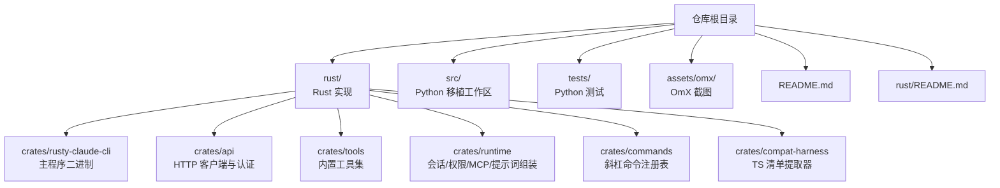
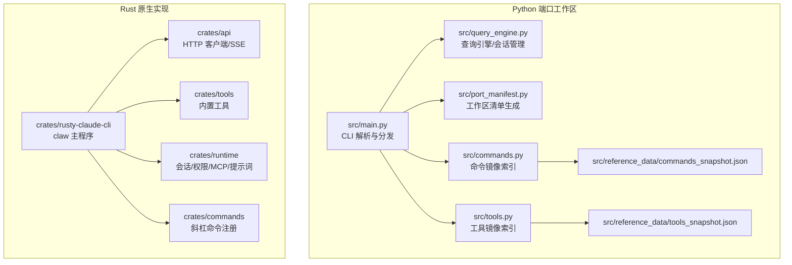
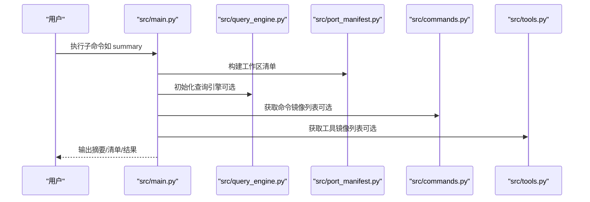
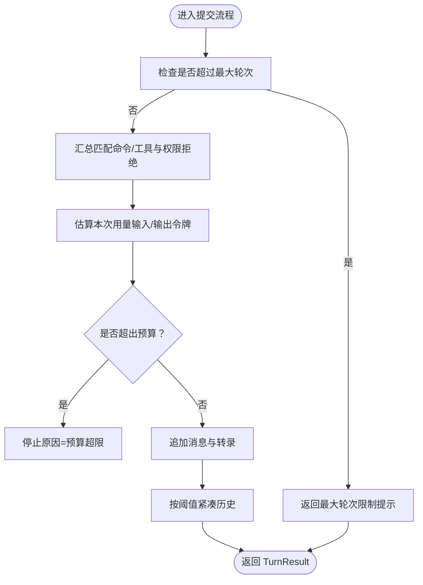
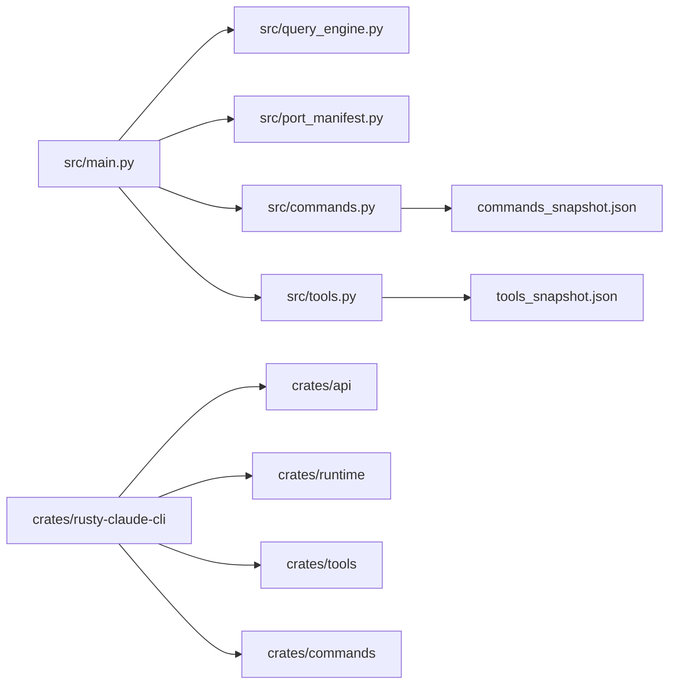

# 快速开始

<cite>
**本文引用的文件**
- [README.md](file://README.md)
- [rust/README.md](file://rust/README.md)
- [src/main.py](file://src/main.py)
- [src/port_manifest.py](file://src/port_manifest.py)
- [src/setup.py](file://src/setup.py)
- [src/query_engine.py](file://src/query_engine.py)
- [src/models.py](file://src/models.py)
- [src/commands.py](file://src/commands.py)
- [src/tools.py](file://src/tools.py)
- [src/reference_data/commands_snapshot.json](file://src/reference_data/commands_snapshot.json)
- [src/reference_data/tools_snapshot.json](file://src/reference_data/tools_snapshot.json)
- [rust/Cargo.toml](file://rust/Cargo.toml)
- [rust/crates/rusty-claude-cli/Cargo.toml](file://rust/crates/rusty-claude-cli/Cargo.toml)
- [rust/crates/api/Cargo.toml](file://rust/crates/api/Cargo.toml)
</cite>

## 目录
1. [简介](#简介)
2. [项目结构](#项目结构)
3. [核心组件](#核心组件)
4. [架构总览](#架构总览)
5. [详细组件分析](#详细组件分析)
6. [依赖关系分析](#依赖关系分析)
7. [性能与资源建议](#性能与资源建议)
8. [常见问题排查](#常见问题排查)
9. [结论](#结论)
10. [附录：常用命令速查](#附录常用命令速查)

## 简介
本指南面向首次接触 CLAW 项目的用户，目标是在最短时间内完成环境准备、安装与初始配置，并成功运行 Python 端口工作区与 Rust 原生实现。文档覆盖以下内容：
- 环境要求与安装步骤
- 初始配置与验证
- 常用命令与基本操作示例
- 目录结构与核心文件说明
- 故障排除与常见问题解答

## 项目结构
仓库采用“双实现”布局：Python 端口工作区用于展示与验证移植成果；Rust 实现提供高性能原生二进制。根目录下主要子树如下：
- rust/：Rust 原生实现（二进制、多 crate）
- src/：Python 移植工作区（CLI、查询引擎、清单与快照等）
- tests/：Python 验证测试
- assets/omx/：OmX 工作流截图
- README.md、rust/README.md：项目说明与快速开始

图表来源
- [README.md:82-99](file://README.md#L82-L99)
- [rust/README.md:187-200](file://rust/README.md#L187-L200)

章节来源
- [README.md:82-99](file://README.md#L82-L99)
- [rust/README.md:187-200](file://rust/README.md#L187-L200)

## 核心组件
- Python 端口工作区（src/）：提供 CLI 入口与多种子命令，用于渲染摘要、打印清单、执行镜像命令/工具、运行引导与对话循环等。
- Rust 原生实现（rust/）：提供高性能二进制，支持交互式 REPL、一次性提示、OAuth 登录、工具系统、会话持久化、成本追踪等。
- 参考快照（src/reference_data/）：包含命令与工具的镜像清单，驱动 Python 端口的索引与路由。

章节来源
- [src/main.py:21-91](file://src/main.py#L21-L91)
- [src/port_manifest.py:12-53](file://src/port_manifest.py#L12-L53)
- [src/commands.py:13-91](file://src/commands.py#L13-L91)
- [src/tools.py:14-97](file://src/tools.py#L14-L97)
- [src/reference_data/commands_snapshot.json:1-50](file://src/reference_data/commands_snapshot.json#L1-L50)
- [src/reference_data/tools_snapshot.json:1-50](file://src/reference_data/tools_snapshot.json#L1-L50)

## 架构总览
Python 端口通过 CLI 解析参数，调用查询引擎与清单模块，输出摘要、清单或执行镜像命令/工具。Rust 端通过主程序二进制提供完整的代理运行时能力。

图表来源
- [src/main.py:94-214](file://src/main.py#L94-L214)
- [src/query_engine.py:35-194](file://src/query_engine.py#L35-L194)
- [src/port_manifest.py:30-53](file://src/port_manifest.py#L30-L53)
- [src/commands.py:22-91](file://src/commands.py#L22-L91)
- [src/tools.py:23-97](file://src/tools.py#L23-L97)
- [rust/crates/rusty-claude-cli/Cargo.toml:8-25](file://rust/crates/rusty-claude-cli/Cargo.toml#L8-L25)

## 详细组件分析

### Python CLI（src/main.py）
- 职责：解析子命令，构建工作区清单，渲染摘要，列出命令/工具，执行镜像命令/工具，模拟远程模式分支，加载会话等。
- 关键流程：参数解析 → 选择处理分支 → 调用对应模块（查询引擎、清单、命令/工具索引、会话存储）→ 输出结果。
- 常用子命令：summary、manifest、commands、tools、route、bootstrap、turn-loop、flush-transcript、load-session、remote-mode 等。

图表来源
- [src/main.py:94-214](file://src/main.py#L94-L214)
- [src/query_engine.py:45-194](file://src/query_engine.py#L45-L194)
- [src/port_manifest.py:30-53](file://src/port_manifest.py#L30-L53)
- [src/commands.py:44-91](file://src/commands.py#L44-L91)
- [src/tools.py:40-97](file://src/tools.py#L40-L97)

章节来源
- [src/main.py:21-91](file://src/main.py#L21-L91)
- [src/main.py:94-214](file://src/main.py#L94-L214)

### 查询引擎（src/query_engine.py）
- 职责：维护会话状态、令牌预算、权限拒绝记录、转录存储；提供提交消息、流式提交、紧凑消息、持久化会话等能力。
- 关键数据结构：QueryEngineConfig、TurnResult、QueryEnginePort、UsageSummary。
- 处理逻辑：限制最大轮次与预算，格式化输出，必要时紧凑历史，持久化会话。

图表来源
- [src/query_engine.py:61-133](file://src/query_engine.py#L61-L133)

章节来源
- [src/query_engine.py:15-194](file://src/query_engine.py#L15-L194)

### 工作区清单（src/port_manifest.py）
- 职责：扫描 src/ 下的 Python 文件，统计顶层模块数量与文件数，生成 Markdown 格式的清单。
- 作用：为 CLI 的 manifest 子命令提供基础数据。

章节来源
- [src/port_manifest.py:12-53](file://src/port_manifest.py#L12-L53)

### 模型与数据结构（src/models.py）
- 职责：定义 Subsystem、PortingModule、PermissionDenial、UsageSummary、PortingBacklog 等数据类。
- 用途：支撑清单、命令/工具索引、权限与用量统计。

章节来源
- [src/models.py:6-50](file://src/models.py#L6-L50)

### 命令与工具镜像（src/commands.py、src/tools.py）
- 职责：加载 commands_snapshot.json 与 tools_snapshot.json，提供查询、过滤、执行与索引渲染能力。
- 特性：支持按插件/技能过滤、简单模式筛选、权限上下文过滤、模糊查询等。

章节来源
- [src/commands.py:13-91](file://src/commands.py#L13-L91)
- [src/tools.py:14-97](file://src/tools.py#L14-L97)
- [src/reference_data/commands_snapshot.json:1-50](file://src/reference_data/commands_snapshot.json#L1-L50)
- [src/reference_data/tools_snapshot.json:1-50](file://src/reference_data/tools_snapshot.json#L1-L50)

### Rust 主程序与依赖（rust/crates/rusty-claude-cli/Cargo.toml）
- 职责：定义二进制名称、依赖关系（api、runtime、tools、commands 等），作为原生实现入口。
- 依赖：api（HTTP/SSE）、runtime（会话/权限/MCP/提示词）、tools（内置工具）、commands（斜杠命令）等。

章节来源
- [rust/crates/rusty-claude-cli/Cargo.toml:8-25](file://rust/crates/rusty-claude-cli/Cargo.toml#L8-L25)

## 依赖关系分析
- Python 端口工作区内部依赖：CLI 解析器 → 查询引擎 → 清单/命令/工具模块 → 参考快照。
- Rust 原生实现依赖：主程序二进制 → API 客户端 → 运行时 → 工具集 → 命令注册表。

图表来源
- [src/main.py:94-214](file://src/main.py#L94-L214)
- [src/query_engine.py:45-194](file://src/query_engine.py#L45-L194)
- [src/port_manifest.py:30-53](file://src/port_manifest.py#L30-L53)
- [src/commands.py:22-91](file://src/commands.py#L22-L91)
- [src/tools.py:23-97](file://src/tools.py#L23-L97)
- [rust/crates/rusty-claude-cli/Cargo.toml:12-24](file://rust/crates/rusty-claude-cli/Cargo.toml#L12-L24)

章节来源
- [rust/Cargo.toml:1-20](file://rust/Cargo.toml#L1-L20)
- [rust/crates/api/Cargo.toml:8-17](file://rust/crates/api/Cargo.toml#L8-L17)

## 性能与资源建议
- Python 端口：适合开发与验证，启动与命令执行开销较低，适合本地调试与演示。
- Rust 原生：具备更快的启动速度、内存安全与原生工具执行能力，适合生产级使用与大规模任务。

章节来源
- [rust/README.md:110-136](file://rust/README.md#L110-L136)

## 常见问题排查
- Python 端口命令未找到
  - 现象：执行命令/工具时报“未知镜像条目”。
  - 排查：确认命令/工具名称大小写与镜像清单一致；使用 commands 或 tools 子命令查看可用条目。
  - 参考：[src/commands.py:75-81](file://src/commands.py#L75-L81)、[src/tools.py:81-87](file://src/tools.py#L81-L87)
- 会话未持久化
  - 现象：flush-transcript 后未生成持久化路径。
  - 排查：确认已正确提交消息并调用持久化接口；检查会话存储权限与路径。
  - 参考：[src/query_engine.py:140-151](file://src/query_engine.py#L140-L151)
- 权限被拒绝
  - 现象：工具执行被拒绝。
  - 排查：检查工具权限上下文与 deny 列表；必要时调整权限模式。
  - 参考：[src/tools.py:56-60](file://src/tools.py#L56-L60)
- Rust 环境未就绪
  - 现象：编译失败或运行报错。
  - 排查：确认已安装 Rust 工具链与 Cargo；在 rust/ 目录执行构建与运行。
  - 参考：[rust/README.md:5-20](file://rust/README.md#L5-L20)

章节来源
- [src/commands.py:75-81](file://src/commands.py#L75-L81)
- [src/tools.py:56-60](file://src/tools.py#L56-L60)
- [src/query_engine.py:140-151](file://src/query_engine.py#L140-L151)
- [rust/README.md:5-20](file://rust/README.md#L5-L20)

## 结论
通过本指南，您可以在本地快速搭建并运行 CLAW 项目：使用 Python 端口进行验证与演示，或使用 Rust 原生实现获得更佳性能与功能完整性。建议先从 Python 端口熟悉命令与工作流，再切换至 Rust 以体验完整代理运行时能力。

## 附录：常用命令速查
- Python 端口
  - 渲染摘要：python3 -m src.main summary
  - 打印清单：python3 -m src.main manifest
  - 列出模块：python3 -m src.main subsystems --limit 16
  - 验证测试：python3 -m unittest discover -s tests -v
  - 平衡审计：python3 -m src.main parity-audit
  - 查看命令/工具镜像：python3 -m src.main commands --limit 10；python3 -m src.main tools --limit 10
- Rust 原生
  - 构建：cd rust/；cargo build --release
  - 交互式 REPL：./target/release/claw
  - 一次性提示：./target/release/claw prompt "explain this codebase"
  - 设置凭据：导出 ANTHROPIC_API_KEY 或 ANTHROPIC_BASE_URL；或使用 OAuth 登录
  - 帮助与选项：./target/release/claw --help

章节来源
- [README.md:112-149](file://README.md#L112-L149)
- [rust/README.md:5-37](file://rust/README.md#L5-L37)