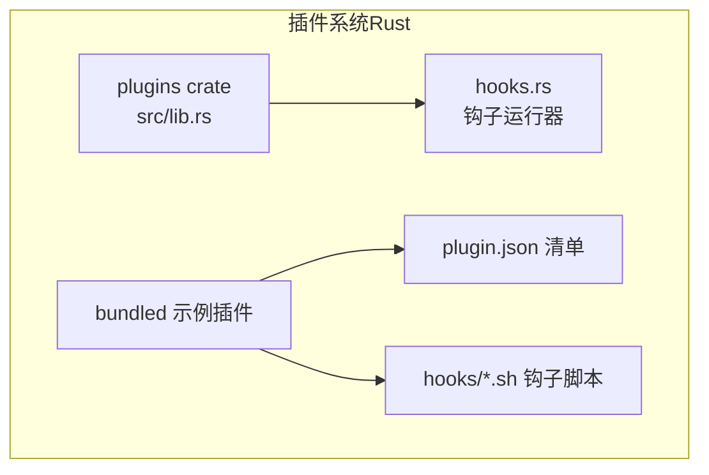
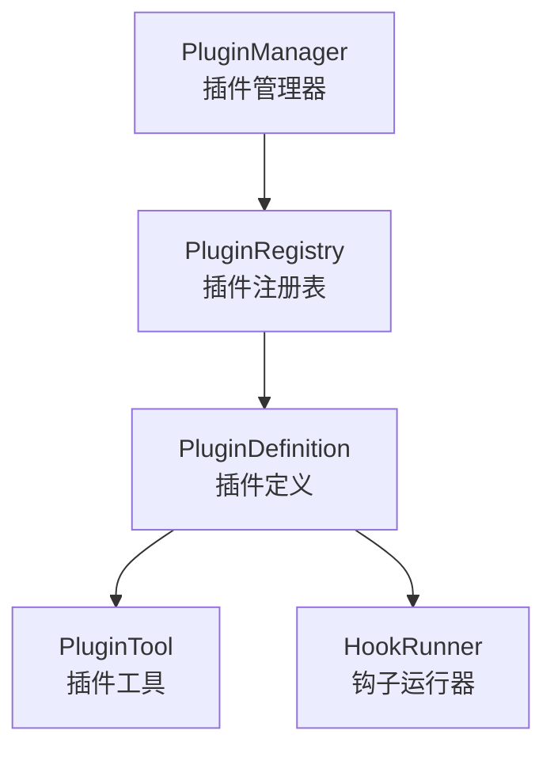
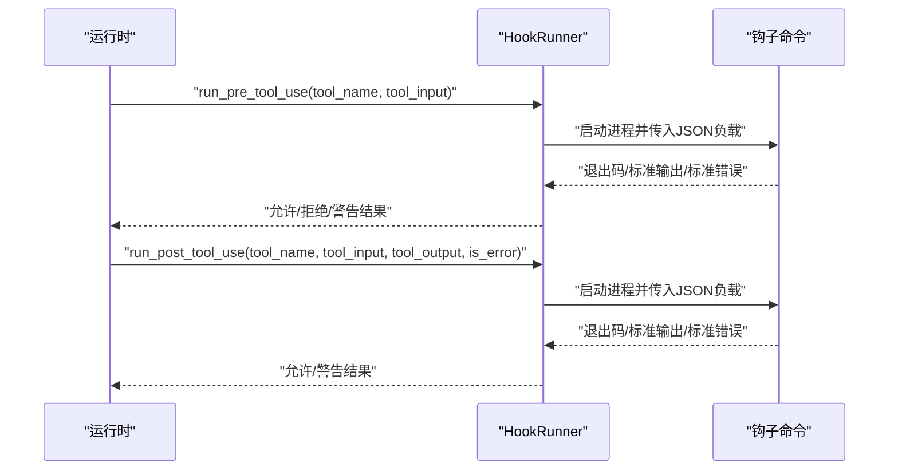
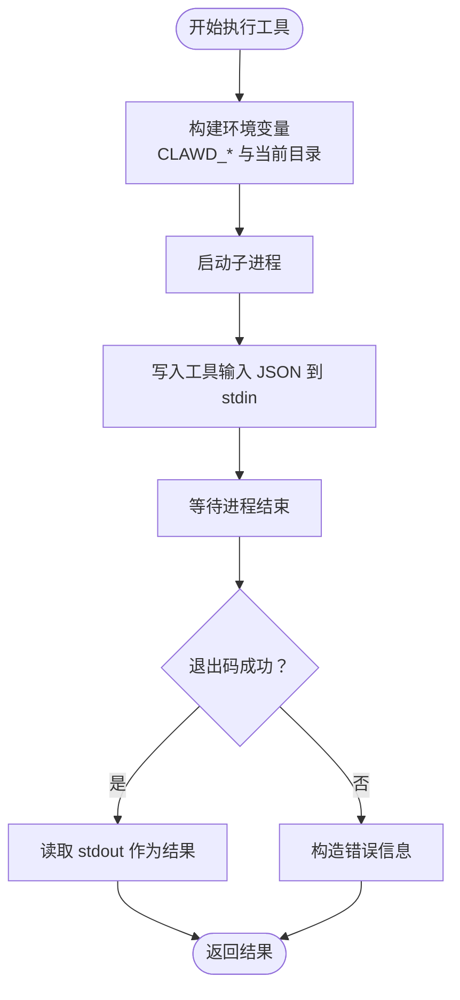
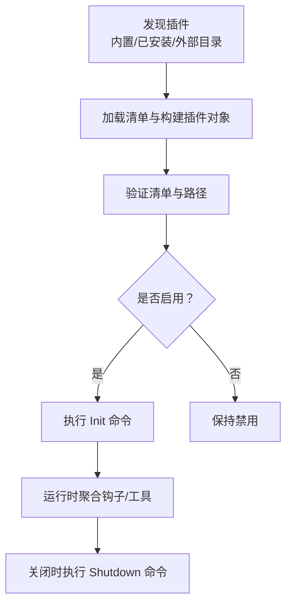
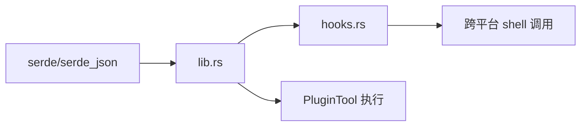

# 插件开发指南

<cite>
**本文引用的文件**
- [rust/crates/plugins/Cargo.toml](file://rust/crates/plugins/Cargo.toml)
- [rust/crates/plugins/src/lib.rs](file://rust/crates/plugins/src/lib.rs)
- [rust/crates/plugins/src/hooks.rs](file://rust/crates/plugins/src/hooks.rs)
- [rust/crates/plugins/bundled/example-bundled/.claude-plugin/plugin.json](file://rust/crates/plugins/bundled/example-bundled/.claude-plugin/plugin.json)
- [rust/crates/plugins/bundled/sample-hooks/.claude-plugin/plugin.json](file://rust/crates/plugins/bundled/sample-hooks/.claude-plugin/plugin.json)
- [rust/crates/plugins/bundled/example-bundled/hooks/pre.sh](file://rust/crates/plugins/bundled/example-bundled/hooks/pre.sh)
- [rust/crates/plugins/bundled/example-bundled/hooks/post.sh](file://rust/crates/plugins/bundled/example-bundled/hooks/post.sh)
- [rust/crates/plugins/bundled/sample-hooks/hooks/pre.sh](file://rust/crates/plugins/bundled/sample-hooks/hooks/pre.sh)
- [rust/crates/plugins/bundled/sample-hooks/hooks/post.sh](file://rust/crates/plugins/bundled/sample-hooks/hooks/post.sh)
- [rust/README.md](file://rust/README.md)
- [README.md](file://README.md)
</cite>

## 目录
1. [简介](#简介)
2. [项目结构](#项目结构)
3. [核心组件](#核心组件)
4. [架构总览](#架构总览)
5. [详细组件分析](#详细组件分析)
6. [依赖关系分析](#依赖关系分析)
7. [性能考虑](#性能考虑)
8. [调试与测试指南](#调试与测试指南)
9. [打包、发布与分发](#打包发布与分发)
10. [常见问题与故障排除](#常见问题与故障排除)
11. [结论](#结论)

## 简介
本指南面向希望在 CLAW 项目中开发插件的开发者，覆盖从环境搭建、项目结构、元数据规范到接口实现、API 使用、回调编写、调试测试、性能优化，以及打包发布与分发的完整流程。CLAW 的插件系统以 Rust 实现，支持内置、捆绑与外部三类插件，提供生命周期钩子（初始化/关闭）、工具调用钩子（使用前/使用后）以及可执行工具与命令扩展能力。

## 项目结构
CLAW 插件系统位于 Rust 工作区的 plugins crate 中，核心源码集中在 src/lib.rs，钩子运行逻辑在 src/hooks.rs，示例插件位于 bundled 目录下。插件清单文件遵循约定路径 .claude-plugin/plugin.json，并通过 manifest 规范声明权限、钩子、生命周期命令、工具与命令等元数据。

图表来源
- [rust/crates/plugins/src/lib.rs](file://rust/crates/plugins/src/lib.rs)
- [rust/crates/plugins/src/hooks.rs](file://rust/crates/plugins/src/hooks.rs)
- [rust/crates/plugins/bundled/example-bundled/.claude-plugin/plugin.json](file://rust/crates/plugins/bundled/example-bundled/.claude-plugin/plugin.json)

章节来源
- [rust/crates/plugins/src/lib.rs](file://rust/crates/plugins/src/lib.rs)
- [rust/crates/plugins/src/hooks.rs](file://rust/crates/plugins/src/hooks.rs)
- [rust/crates/plugins/bundled/example-bundled/.claude-plugin/plugin.json](file://rust/crates/plugins/bundled/example-bundled/.claude-plugin/plugin.json)

## 核心组件
- 插件清单与元数据：定义插件名称、版本、描述、默认启用状态、权限、钩子、生命周期命令、工具与命令等。
- 插件类型：内置（builtin）、捆绑（bundled）、外部（external），分别由不同来源加载与管理。
- 钩子系统：PreToolUse 与 PostToolUse 两类钩子，支持脚本或命令形式，运行时注入上下文环境变量。
- 工具系统：插件可声明可执行工具，支持输入 Schema 校验与权限级别控制。
- 生命周期：Init 与 Shutdown 命令在插件启用/禁用时执行。
- 注册表与管理器：负责发现、安装、启用/禁用、更新、卸载插件，维护已安装插件记录与设置。

章节来源
- [rust/crates/plugins/src/lib.rs](file://rust/crates/plugins/src/lib.rs)
- [rust/crates/plugins/src/hooks.rs](file://rust/crates/plugins/src/hooks.rs)

## 架构总览
插件系统采用“清单驱动 + 运行时执行”的模式：插件目录内包含 .claude-plugin/plugin.json，系统解析清单并构建插件对象；运行时根据事件触发钩子或执行工具；生命周期命令在初始化与关闭阶段执行。

图表来源
- [rust/crates/plugins/src/lib.rs](file://rust/crates/plugins/src/lib.rs)
- [rust/crates/plugins/src/hooks.rs](file://rust/crates/plugins/src/hooks.rs)

## 详细组件分析

### 插件清单与元数据规范
- 必填字段：name、version、description。
- 可选字段：defaultEnabled、permissions、hooks、lifecycle、tools、commands。
- 权限枚举：read、write、execute。
- 工具权限枚举：read-only、workspace-write、danger-full-access。
- 工具输入 Schema：必须为 JSON 对象。
- 命令条目：支持直接字符串（字面量命令）或相对/绝对路径；路径存在性校验。

章节来源
- [rust/crates/plugins/src/lib.rs](file://rust/crates/plugins/src/lib.rs)
- [rust/crates/plugins/bundled/example-bundled/.claude-plugin/plugin.json](file://rust/crates/plugins/bundled/example-bundled/.claude-plugin/plugin.json)
- [rust/crates/plugins/bundled/sample-hooks/.claude-plugin/plugin.json](file://rust/crates/plugins/bundled/sample-hooks/.claude-plugin/plugin.json)

### 钩子系统（HookRunner）
- 事件类型：PreToolUse、PostToolUse。
- 运行时机：使用工具前后。
- 输入输出：向钩子脚本传递 JSON 负载（含事件名、工具名、输入、输出、错误标记等）。
- 返回语义：退出码 0 表示允许，2 表示拒绝，其他非 0 表示警告但继续执行。
- 平台差异：Windows 使用 cmd /C，类 Unix 使用 sh 或 sh -lc 执行。

图表来源
- [rust/crates/plugins/src/hooks.rs](file://rust/crates/plugins/src/hooks.rs)

章节来源
- [rust/crates/plugins/src/hooks.rs](file://rust/crates/plugins/src/hooks.rs)

### 工具系统（PluginTool）
- 定义：插件工具由清单中的 tools 字段声明，包含名称、描述、输入 Schema、命令与参数、所需权限。
- 执行：通过子进程执行命令，注入环境变量（插件 ID/名称、工具名、工具输入、根目录等），读取标准输出作为结果。
- 权限：根据 requiredPermission 控制工具可用范围。

图表来源
- [rust/crates/plugins/src/lib.rs](file://rust/crates/plugins/src/lib.rs)

章节来源
- [rust/crates/plugins/src/lib.rs](file://rust/crates/plugins/src/lib.rs)

### 生命周期与插件管理
- 生命周期：Init/Shutdown 在插件启用/禁用时按顺序执行命令。
- 插件发现：内置、已安装、外部目录三类来源合并。
- 安装/更新/卸载：支持本地路径与 Git URL 源，自动同步捆绑插件，维护已安装插件记录与启用状态。
- 启用/禁用：通过设置文件持久化 enabledPlugins。

图表来源
- [rust/crates/plugins/src/lib.rs](file://rust/crates/plugins/src/lib.rs)

章节来源
- [rust/crates/plugins/src/lib.rs](file://rust/crates/plugins/src/lib.rs)

### 示例插件（工具/命令/界面）
- 示例捆绑插件：展示如何在 .claude-plugin/plugin.json 中声明 hooks，并在 hooks 子目录提供 pre.sh 与 post.sh。
- 示例钩子：pre.sh 与 post.sh 输出简单消息，用于演示钩子运行。
- 建议实践：
  - 工具插件：在清单 tools 中声明工具，提供输入 Schema，确保命令可执行且健壮。
  - 命令插件：在清单 commands 中声明命令，便于在 REPL 或脚本中调用。
  - 界面插件：通过生命周期命令或钩子脚本与外部 UI 工具集成（如桌面通知、IDE 插件等）。

章节来源
- [rust/crates/plugins/bundled/example-bundled/.claude-plugin/plugin.json](file://rust/crates/plugins/bundled/example-bundled/.claude-plugin/plugin.json)
- [rust/crates/plugins/bundled/sample-hooks/.claude-plugin/plugin.json](file://rust/crates/plugins/bundled/sample-hooks/.claude-plugin/plugin.json)
- [rust/crates/plugins/bundled/example-bundled/hooks/pre.sh](file://rust/crates/plugins/bundled/example-bundled/hooks/pre.sh)
- [rust/crates/plugins/bundled/example-bundled/hooks/post.sh](file://rust/crates/plugins/bundled/example-bundled/hooks/post.sh)
- [rust/crates/plugins/bundled/sample-hooks/hooks/pre.sh](file://rust/crates/plugins/bundled/sample-hooks/hooks/pre.sh)
- [rust/crates/plugins/bundled/sample-hooks/hooks/post.sh](file://rust/crates/plugins/bundled/sample-hooks/hooks/post.sh)

## 依赖关系分析
- 依赖库：serde 与 serde_json 用于序列化/反序列化清单与数据。
- 组件耦合：PluginManager 依赖清单解析、路径校验、文件系统操作与设置文件；HookRunner 聚合来自多个插件的钩子命令；PluginTool 依赖子进程执行与环境变量注入。

图表来源
- [rust/crates/plugins/Cargo.toml](file://rust/crates/plugins/Cargo.toml)
- [rust/crates/plugins/src/lib.rs](file://rust/crates/plugins/src/lib.rs)
- [rust/crates/plugins/src/hooks.rs](file://rust/crates/plugins/src/hooks.rs)

章节来源
- [rust/crates/plugins/Cargo.toml](file://rust/crates/plugins/Cargo.toml)
- [rust/crates/plugins/src/lib.rs](file://rust/crates/plugins/src/lib.rs)
- [rust/crates/plugins/src/hooks.rs](file://rust/crates/plugins/src/hooks.rs)

## 性能考虑
- 钩子命令应尽量轻量，避免长时间阻塞；必要时使用异步或后台执行。
- 工具执行建议缓存昂贵操作，减少重复 IO。
- 插件清单解析与路径校验仅在安装/更新/发现阶段进行，运行时尽量复用已构建的对象。
- 生命周期命令应快速完成，避免影响主流程启动/关闭时间。

## 调试与测试指南
- 钩子调试：
  - 在钩子脚本中输出日志，检查 HookRunner 的返回消息与退出码语义。
  - 使用示例插件结构快速验证钩子是否被正确收集与执行。
- 工具调试：
  - 确认工具命令可执行、输入 Schema 正确、权限满足要求。
  - 通过环境变量 CLAWD_TOOL_INPUT 与 CLAWD_PLUGIN_ID 检查运行上下文。
- 管理器调试：
  - 使用插件管理器的 list/list_installed/list_plugins 接口查看状态。
  - 检查设置文件 settings.json 与已安装插件记录 installed.json。
- 测试参考：
  - 参考 hooks.rs 中的单元测试，验证钩子收集、允许/拒绝/警告行为。
  - 参考插件管理器测试，验证安装、启用、禁用、更新、卸载流程。

章节来源
- [rust/crates/plugins/src/hooks.rs](file://rust/crates/plugins/src/hooks.rs)
- [rust/crates/plugins/src/lib.rs](file://rust/crates/plugins/src/lib.rs)

## 打包、发布与分发
- 本地安装：支持本地路径与 Git URL，管理器会克隆/复制到安装目录并写入已安装记录。
- 外部目录：可配置 external_dirs，扫描其中的插件目录并加载。
- 捆绑插件：bundled 目录内的插件会在启动时同步到安装目录，保持版本一致。
- 发布建议：
  - 将清单与资源文件放入 .claude-plugin/plugin.json 与 hooks 子目录。
  - 提供清晰的 README 与最小可运行示例。
  - 在 Git 仓库中维护版本标签，便于通过 Git URL 安装。

章节来源
- [rust/crates/plugins/src/lib.rs](file://rust/crates/plugins/src/lib.rs)

## 常见问题与故障排除
- 清单字段为空：检查 name/version/description 是否填写，permissions 与 entries 的值是否为空。
- 权限无效或重复：确认 permissions 与 requiredPermission 的枚举值正确且无重复。
- 命令路径不存在：确认 hooks/lifecycle/tools 中的命令路径存在，或使用字面量命令。
- 工具输入 Schema 非对象：确保 tools[].inputSchema 为 JSON 对象。
- 钩子拒绝执行：检查钩子脚本退出码是否为 2，或输出明确拒绝消息。
- 生命周期命令失败：检查 Init/Shutdown 命令的可执行性与返回码。

章节来源
- [rust/crates/plugins/src/lib.rs](file://rust/crates/plugins/src/lib.rs)
- [rust/crates/plugins/src/hooks.rs](file://rust/crates/plugins/src/hooks.rs)

## 结论
CLAW 插件系统提供了清晰的清单规范、灵活的钩子机制与工具执行能力，结合生命周期管理与多来源插件发现，能够满足工具插件、命令插件与界面插件等多种场景。按照本文档的结构与最佳实践进行开发、调试与发布，可快速构建稳定高效的插件生态。