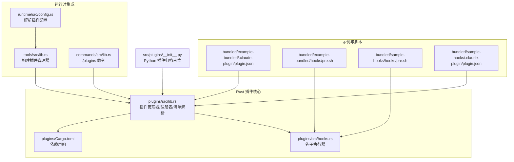
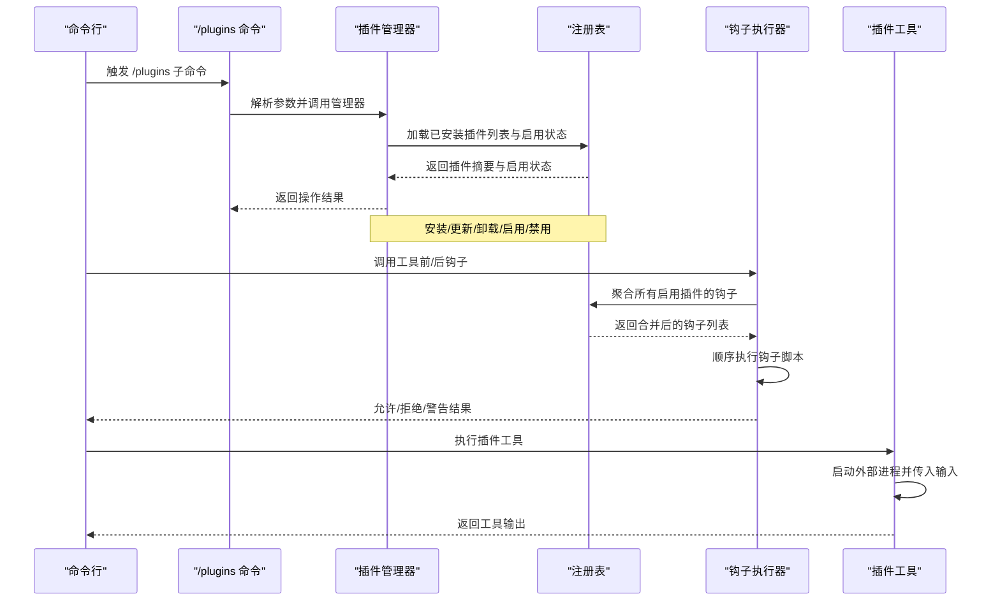
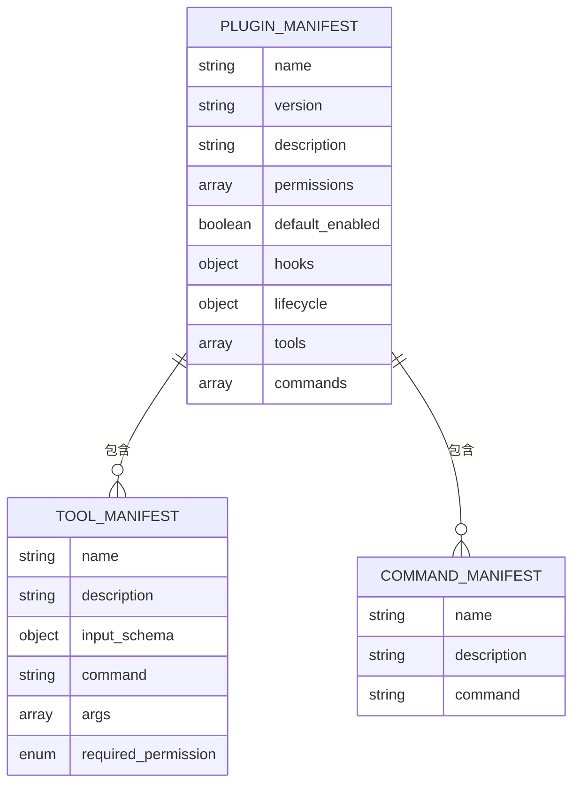
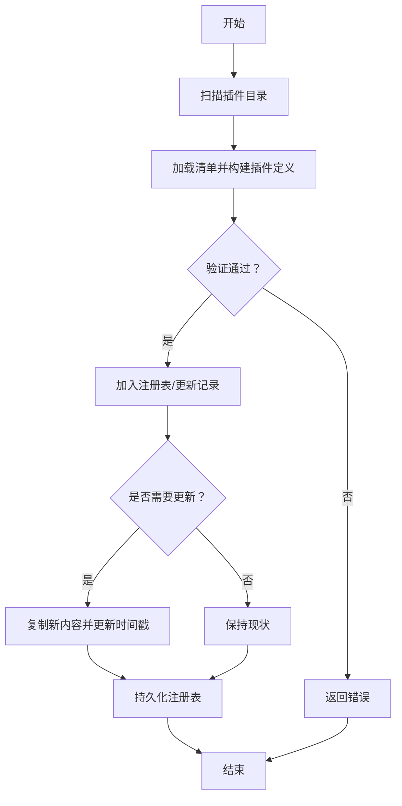
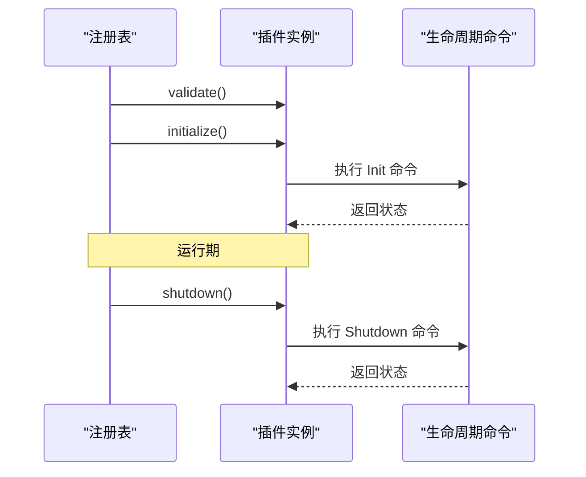
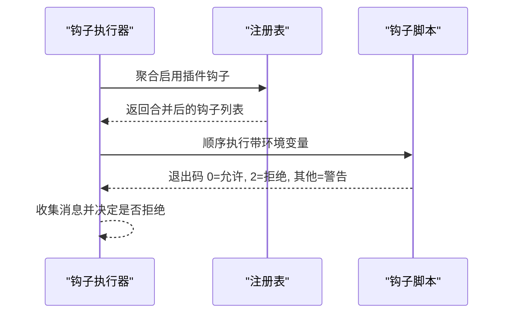
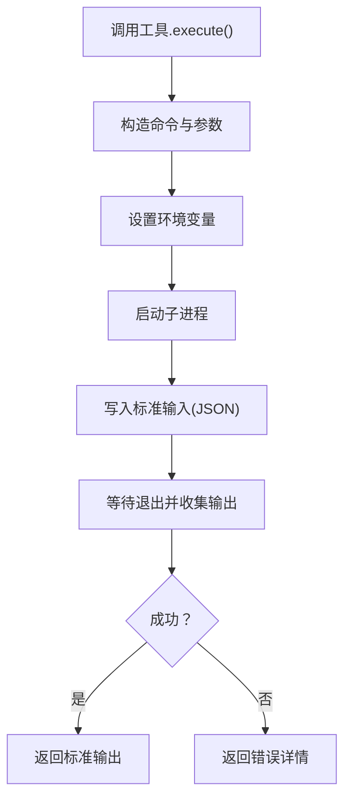
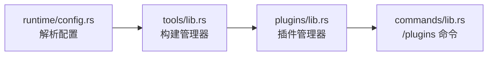
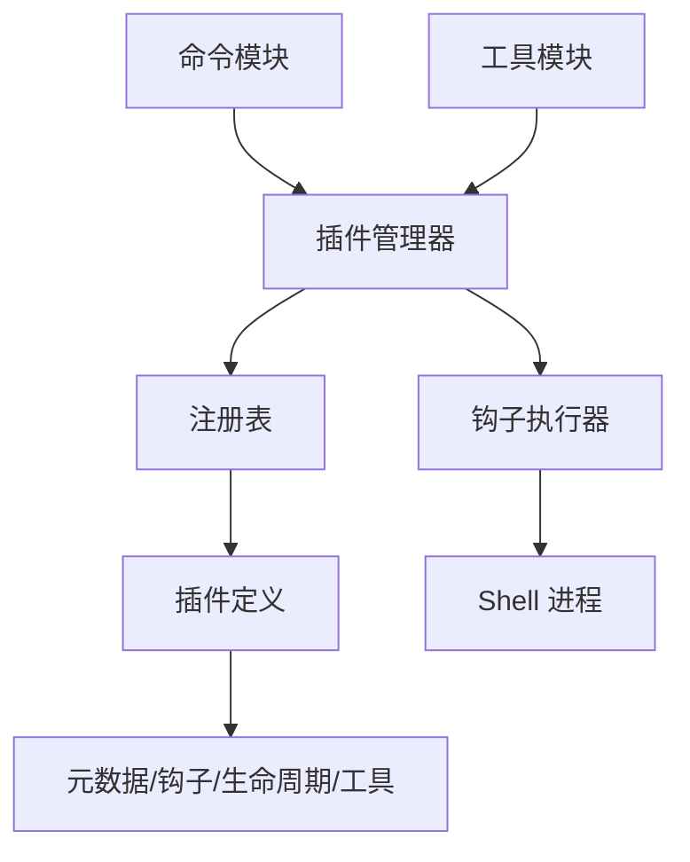

# 插件架构

<cite>
**本文引用的文件**
- [lib.rs](file://rust/crates/plugins/src/lib.rs)
- [hooks.rs](file://rust/crates/plugins/src/hooks.rs)
- [Cargo.toml](file://rust/crates/plugins/Cargo.toml)
- [plugin.json（示例）](file://rust/crates/plugins/bundled/example-bundled/.claude-plugin/plugin.json)
- [plugin.json（样例钩子）](file://rust/crates/plugins/bundled/sample-hooks/.claude-plugin/plugin.json)
- [pre.sh（示例钩子）](file://rust/crates/plugins/bundled/example-bundled/hooks/pre.sh)
- [pre.sh（样例钩子）](file://rust/crates/plugins/bundled/sample-hooks/hooks/pre.sh)
- [lib.rs（工具模块）](file://rust/crates/tools/src/lib.rs)
- [lib.rs（命令模块）](file://rust/crates/commands/src/lib.rs)
- [lib.rs（运行时配置）](file://rust/crates/runtime/src/config.rs)
- [__init__.py（Python 插件归档占位）](file://src/plugins/__init__.py)
</cite>

## 目录
1. [简介](#简介)
2. [项目结构](#项目结构)
3. [核心组件](#核心组件)
4. [架构总览](#架构总览)
5. [详细组件分析](#详细组件分析)
6. [依赖分析](#依赖分析)
7. [性能考量](#性能考量)
8. [故障排查指南](#故障排查指南)
9. [结论](#结论)
10. [附录](#附录)

## 简介
本文件系统化阐述 CLAW 项目的插件架构，覆盖插件系统设计、生命周期管理与钩子机制；详述插件发现、加载与卸载的完整流程；明确插件接口规范、依赖管理与版本兼容策略；提供插件开发指南、最佳实践与调试技巧；区分内置、捆绑与外部插件的差异与适用场景；并讨论扩展性与性能优化建议。

## 项目结构
CLAW 的插件系统主要由 Rust 实现，位于 rust/crates/plugins 子目录中，同时在 Python 层保留了插件子系统归档的占位模块。插件清单与示例钩子脚本位于 bundled 示例目录中，运行时通过 tools 与 commands 模块集成插件管理能力，并在 runtime 配置中解析插件设置。

**图表来源**
- [lib.rs](file://rust/crates/plugins/src/lib.rs)
- [hooks.rs](file://rust/crates/plugins/src/hooks.rs)
- [Cargo.toml](file://rust/crates/plugins/Cargo.toml)
- [plugin.json（示例）](file://rust/crates/plugins/bundled/example-bundled/.claude-plugin/plugin.json)
- [plugin.json（样例钩子）](file://rust/crates/plugins/bundled/sample-hooks/.claude-plugin/plugin.json)
- [pre.sh（示例钩子）](file://rust/crates/plugins/bundled/example-bundled/hooks/pre.sh)
- [pre.sh（样例钩子）](file://rust/crates/plugins/bundled/sample-hooks/hooks/pre.sh)
- [lib.rs（工具模块）](file://rust/crates/tools/src/lib.rs)
- [lib.rs（命令模块）](file://rust/crates/commands/src/lib.rs)
- [lib.rs（运行时配置）](file://rust/crates/runtime/src/config.rs)
- [__init__.py（Python 插件归档占位）](file://src/plugins/__init__.py)

**章节来源**
- [lib.rs](file://rust/crates/plugins/src/lib.rs)
- [hooks.rs](file://rust/crates/plugins/src/hooks.rs)
- [Cargo.toml](file://rust/crates/plugins/Cargo.toml)
- [plugin.json（示例）](file://rust/crates/plugins/bundled/example-bundled/.claude-plugin/plugin.json)
- [plugin.json（样例钩子）](file://rust/crates/plugins/bundled/sample-hooks/.claude-plugin/plugin.json)
- [pre.sh（示例钩子）](file://rust/crates/plugins/bundled/example-bundled/hooks/pre.sh)
- [pre.sh（样例钩子）](file://rust/crates/plugins/bundled/sample-hooks/hooks/pre.sh)
- [lib.rs（工具模块）](file://rust/crates/tools/src/lib.rs)
- [lib.rs（命令模块）](file://rust/crates/commands/src/lib.rs)
- [lib.rs（运行时配置）](file://rust/crates/runtime/src/config.rs)
- [__init__.py（Python 插件归档占位）](file://src/plugins/__init__.py)

## 核心组件
- 插件定义与元数据：插件类型（内置/捆绑/外部）、元信息（名称、版本、描述、默认启用状态）、根路径等。
- 清单模型：插件清单包含权限、钩子、生命周期、工具与命令等字段，支持直接或打包路径的清单位置。
- 注册表与管理器：负责插件发现、安装、启用/禁用、聚合钩子与工具、执行生命周期命令、持久化状态。
- 钩子系统：统一的钩子事件（前置/后置工具使用），支持多插件聚合执行、允许/拒绝/警告语义。
- 工具执行：以进程方式调用外部脚本，传递环境变量与标准输入输出，支持权限控制。
- 运行时集成：命令行与配置层对接插件管理器，暴露 /plugins 命令与配置项。

**章节来源**
- [lib.rs](file://rust/crates/plugins/src/lib.rs)
- [hooks.rs](file://rust/crates/plugins/src/hooks.rs)

## 架构总览
下图展示插件系统从配置到执行的端到端流程，包括插件发现、清单解析、注册表维护、钩子与工具执行、生命周期管理以及命令行集成。

**图表来源**
- [lib.rs（命令模块）](file://rust/crates/commands/src/lib.rs)
- [lib.rs（工具模块）](file://rust/crates/tools/src/lib.rs)
- [lib.rs](file://rust/crates/plugins/src/lib.rs)
- [hooks.rs](file://rust/crates/plugins/src/hooks.rs)

## 详细组件分析

### 插件类型与市场
- 内置插件（builtin）：随系统内建，通常不可卸载，适合基础能力。
- 捆绑插件（bundled）：随仓库打包分发，自动同步至安装目录，可启用/禁用。
- 外部插件（external）：用户安装的第三方插件，支持安装源（本地路径或 Git URL）。

这些类型通过统一的标识符与市场名组合形成唯一 ID，便于注册表管理与启用状态持久化。

**章节来源**
- [lib.rs](file://rust/crates/plugins/src/lib.rs)

### 插件清单与接口规范
- 必填字段：名称、版本、描述。
- 可选字段：默认启用、权限列表、钩子（前置/后置工具使用）、生命周期（初始化/关闭）、工具清单、命令清单。
- 权限枚举：只读、工作区写、危险全权限。
- 工具要求：名称唯一、描述非空、命令非空且存在、输入模式为对象、所需权限合法。
- 命令校验：路径存在性检查，支持相对路径与绝对路径。

**图表来源**
- [lib.rs](file://rust/crates/plugins/src/lib.rs)

**章节来源**
- [lib.rs](file://rust/crates/plugins/src/lib.rs)

### 插件发现、加载与卸载流程
- 发现：扫描捆绑根目录与安装根目录，识别包含清单的目录。
- 加载：解析清单，构建插件定义（含钩子、生命周期、工具），验证命令路径存在性。
- 卸载：移除安装目录并清理注册表条目。
- 更新：比较版本与元信息，必要时复制新内容并更新记录。
- 安装：支持本地路径与 Git URL，克隆后进行清单验证与安装。

**图表来源**
- [lib.rs](file://rust/crates/plugins/src/lib.rs)

**章节来源**
- [lib.rs](file://rust/crates/plugins/src/lib.rs)

### 生命周期管理
- 初始化（Init）：在启用插件时按顺序执行生命周期命令。
- 关闭（Shutdown）：在禁用/退出时逆序执行生命周期命令。
- 错误处理：命令失败会携带标准错误输出，影响后续流程。

**图表来源**
- [lib.rs](file://rust/crates/plugins/src/lib.rs)

**章节来源**
- [lib.rs](file://rust/crates/plugins/src/lib.rs)

### 钩子机制
- 事件类型：前置工具使用（PreToolUse）、后置工具使用（PostToolUse）。
- 执行模型：聚合所有启用插件的钩子，按顺序执行；每个钩子接收工具名、输入、输出与错误标记。
- 结果语义：允许（允许继续）、拒绝（阻止工具执行）、警告（记录消息但继续）。
- 环境变量：传递事件名、工具名、输入、输出、错误标志等上下文。

**图表来源**
- [hooks.rs](file://rust/crates/plugins/src/hooks.rs)

**章节来源**
- [hooks.rs](file://rust/crates/plugins/src/hooks.rs)

### 工具执行
- 进程启动：根据命令是否存在脚本路径或作为字符串指令，选择 sh 或 cmd 并传入当前目录。
- 输入输出：通过标准输入传递 JSON，捕获标准输出与错误；失败时返回详细错误信息。
- 环境变量：注入插件 ID、名称、工具名、工具输入等，便于脚本内部处理。
- 权限控制：依据工具所需权限（只读/工作区写/危险全权限）进行授权判断。

**图表来源**
- [lib.rs](file://rust/crates/plugins/src/lib.rs)

**章节来源**
- [lib.rs](file://rust/crates/plugins/src/lib.rs)

### 插件开发指南
- 清单编写：确保必填字段完整，工具输入模式为对象，命令路径存在且可执行。
- 钩子脚本：遵循平台差异（Windows 使用 cmd /C，类 Unix 使用 sh 或 sh -lc），正确读取环境变量。
- 生命周期脚本：在 Init/Shutdown 中完成资源准备与清理，避免阻塞。
- 权限声明：合理声明所需权限，避免过度授权。
- 测试清单：参考测试用例中的清单结构与脚本组织方式，保证可重复验证。

**章节来源**
- [plugin.json（示例）](file://rust/crates/plugins/bundled/example-bundled/.claude-plugin/plugin.json)
- [plugin.json（样例钩子）](file://rust/crates/plugins/bundled/sample-hooks/.claude-plugin/plugin.json)
- [pre.sh（示例钩子）](file://rust/crates/plugins/bundled/example-bundled/hooks/pre.sh)
- [pre.sh（样例钩子）](file://rust/crates/plugins/bundled/sample-hooks/hooks/pre.sh)

### 运行时集成与配置
- 配置解析：运行时配置模块解析 enabledPlugins 与 plugins 设置，驱动插件管理器。
- 管理器构建：工具模块根据工作目录与配置解析插件路径，构建插件管理器。
- 命令行：命令模块提供 /plugins 子命令，支持列出、安装、启用、禁用、卸载与更新插件。

**图表来源**
- [lib.rs（运行时配置）](file://rust/crates/runtime/src/config.rs)
- [lib.rs（工具模块）](file://rust/crates/tools/src/lib.rs)
- [lib.rs（命令模块）](file://rust/crates/commands/src/lib.rs)
- [lib.rs](file://rust/crates/plugins/src/lib.rs)

**章节来源**
- [lib.rs（运行时配置）](file://rust/crates/runtime/src/config.rs)
- [lib.rs（工具模块）](file://rust/crates/tools/src/lib.rs)
- [lib.rs（命令模块）](file://rust/crates/commands/src/lib.rs)

### 内置、捆绑与外部插件
- 内置插件：系统内建，不可卸载，适合核心功能。
- 捆绑插件：随仓库打包，自动同步到安装目录，可启用/禁用，适合默认提供但可替换的功能。
- 外部插件：用户安装，支持本地路径与 Git URL，适合第三方扩展。

**章节来源**
- [lib.rs](file://rust/crates/plugins/src/lib.rs)

## 依赖分析
- 语言与库：Rust 生态，使用 serde/serde_json 进行序列化与反序列化。
- 运行时依赖：Shell 环境（sh/cmd），用于执行钩子与生命周期脚本。
- 组件耦合：插件管理器与注册表紧密耦合，钩子执行器依赖注册表聚合钩子；命令模块与管理器交互；工具模块负责路径解析与配置装载。

**图表来源**
- [lib.rs](file://rust/crates/plugins/src/lib.rs)
- [hooks.rs](file://rust/crates/plugins/src/hooks.rs)
- [lib.rs（工具模块）](file://rust/crates/tools/src/lib.rs)
- [lib.rs（命令模块）](file://rust/crates/commands/src/lib.rs)

**章节来源**
- [Cargo.toml](file://rust/crates/plugins/Cargo.toml)
- [lib.rs](file://rust/crates/plugins/src/lib.rs)
- [hooks.rs](file://rust/crates/plugins/src/hooks.rs)

## 性能考量
- 插件发现与加载：对磁盘扫描与清单解析进行缓存与排序，避免重复 IO。
- 钩子执行：串行执行，建议钩子脚本快速返回；若需并发，应在脚本内部自行处理。
- 工具执行：进程启动与 I/O 为瓶颈，尽量减少不必要的子进程开销；批量工具调用时复用上下文。
- 注册表持久化：变更时一次性写入，避免频繁小写入造成磁盘抖动。
- 生命周期：Init/Shutdown 应尽量轻量，避免阻塞主流程。

[本节为通用指导，无需特定文件引用]

## 故障排查指南
- 清单校验失败：检查必填字段、权限枚举、工具输入模式与命令路径是否存在。
- 钩子/生命周期命令失败：查看标准错误输出，确认脚本可执行与环境变量正确。
- 工具执行失败：检查工具命令、输入 JSON、权限声明与脚本内部逻辑。
- 插件未出现在列表：确认清单路径（直接或打包路径）存在，且安装目录可访问。
- 启用状态不持久：检查设置文件 enabledPlugins 字段是否正确写入。

**章节来源**
- [lib.rs](file://rust/crates/plugins/src/lib.rs)
- [hooks.rs](file://rust/crates/plugins/src/hooks.rs)

## 结论
CLAW 插件架构以清单驱动、注册表管理为核心，结合钩子与生命周期机制，提供了灵活、可扩展且安全的插件体系。通过内置、捆绑与外部插件的差异化设计，满足不同场景需求。配合命令行与运行时配置的集成，实现了从开发到部署的一体化体验。建议在开发过程中严格遵循清单规范与权限最小化原则，并充分利用钩子与生命周期进行可观测与可控的扩展。

[本节为总结性内容，无需特定文件引用]

## 附录

### 插件清单字段速查
- 必填：name、version、description
- 可选：defaultEnabled、permissions、hooks、lifecycle、tools、commands
- 工具字段：name、description、inputSchema、command、args、requiredPermission
- 命令字段：name、description、command

**章节来源**
- [lib.rs](file://rust/crates/plugins/src/lib.rs)

### 示例清单与脚本
- 示例清单：参见 bundled 示例目录中的 plugin.json。
- 示例钩子脚本：参见 bundled 示例目录中的 hooks/pre.sh。

**章节来源**
- [plugin.json（示例）](file://rust/crates/plugins/bundled/example-bundled/.claude-plugin/plugin.json)
- [plugin.json（样例钩子）](file://rust/crates/plugins/bundled/sample-hooks/.claude-plugin/plugin.json)
- [pre.sh（示例钩子）](file://rust/crates/plugins/bundled/example-bundled/hooks/pre.sh)
- [pre.sh（样例钩子）](file://rust/crates/plugins/bundled/sample-hooks/hooks/pre.sh)