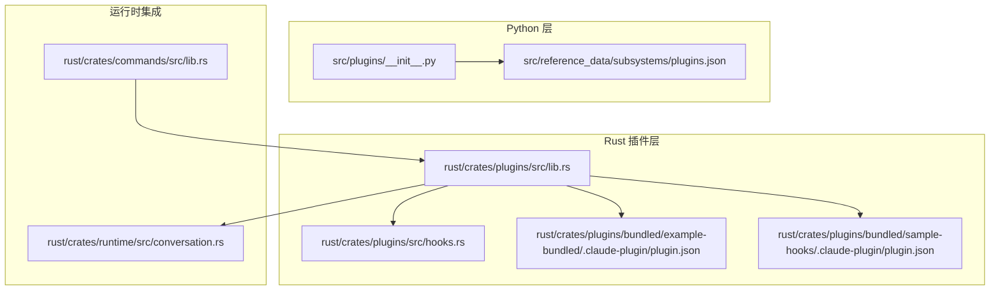
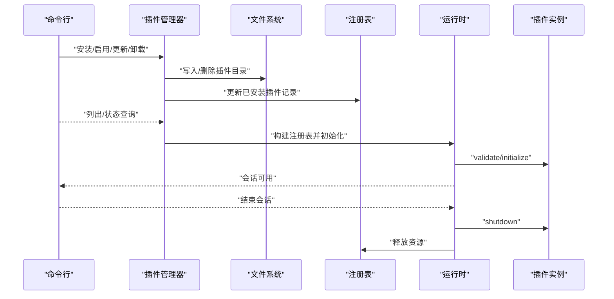
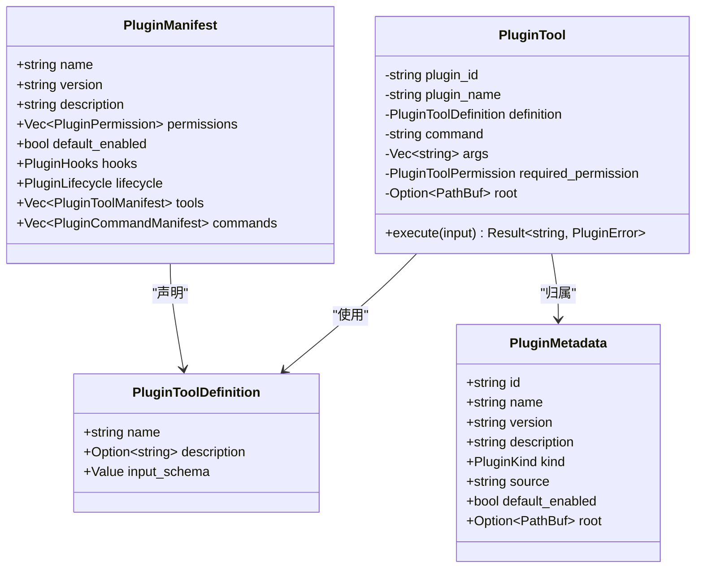
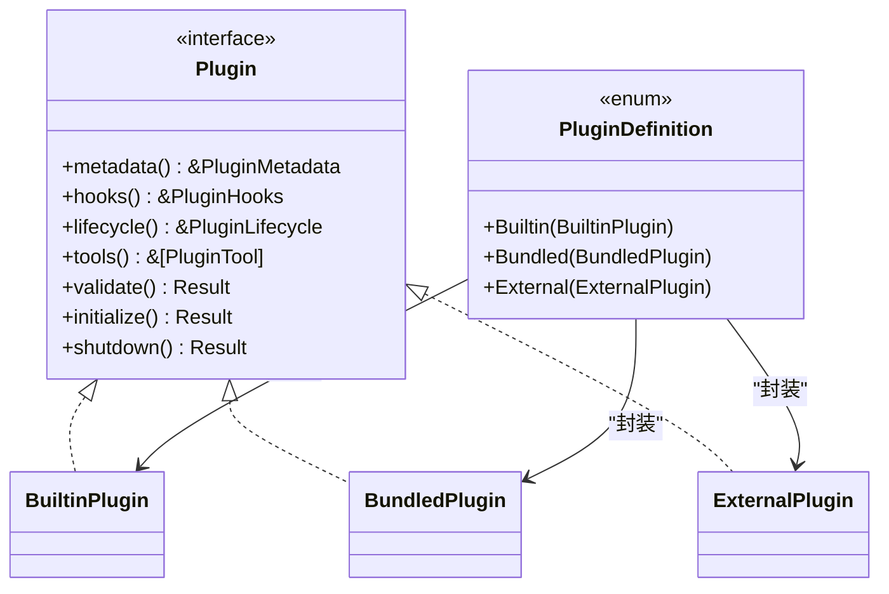
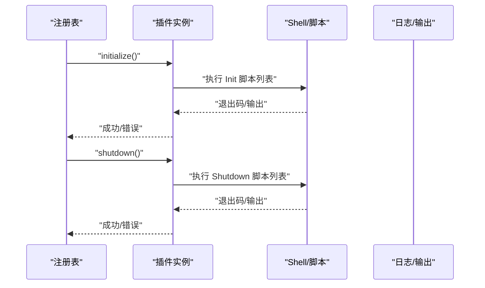
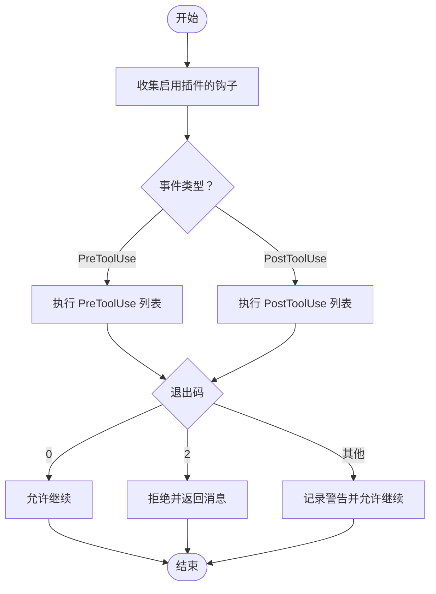
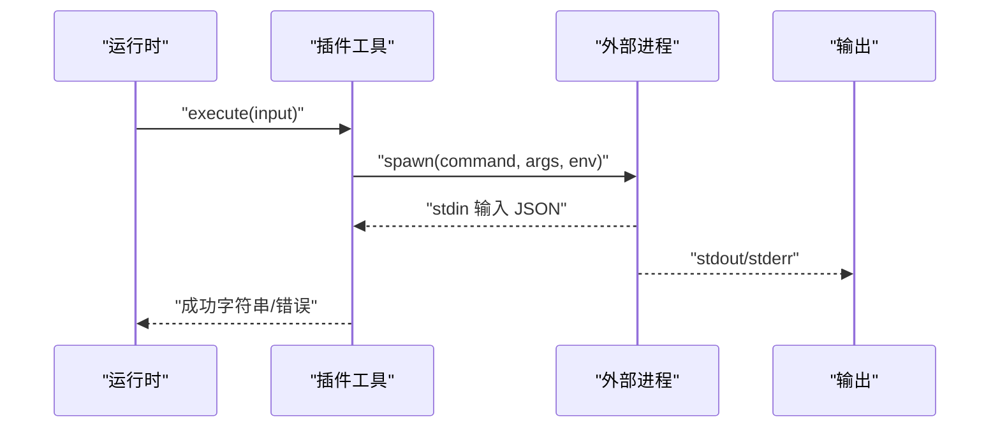
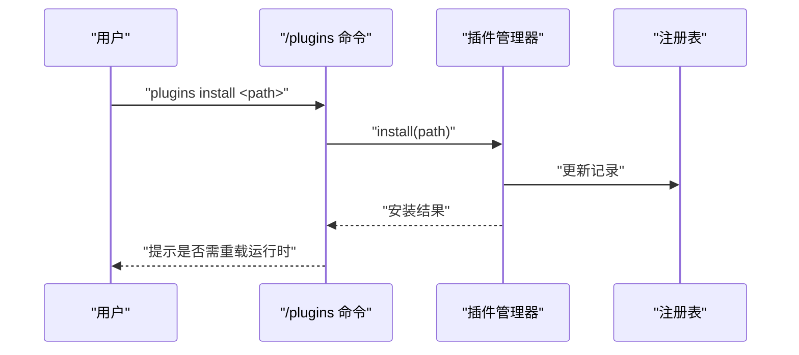
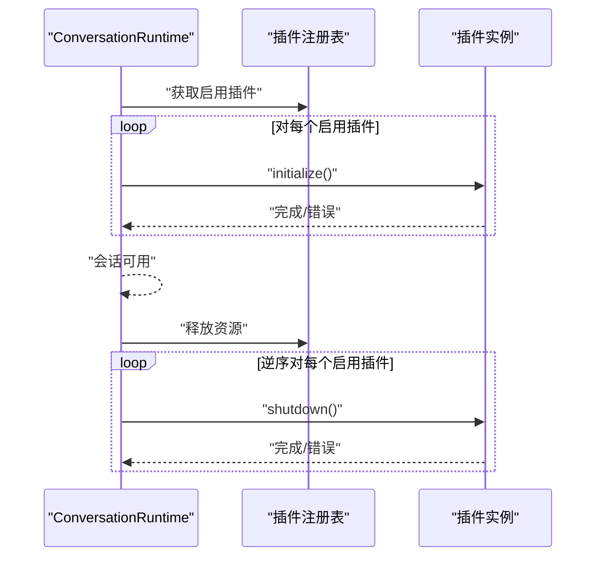
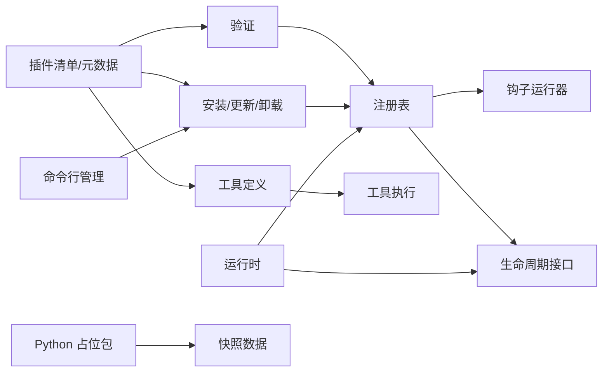

# 插件生命周期管理

<cite>
**本文引用的文件**
- [README.md](file://README.md)
- [插件库主文件（Rust）](file://rust/crates/plugins/src/lib.rs)
- [插件钩子与运行器（Rust）](file://rust/crates/plugins/src/hooks.rs)
- [示例捆绑插件清单（Rust）](file://rust/crates/plugins/bundled/example-bundled/.claude-plugin/plugin.json)
- [示例钩子插件清单（Rust）](file://rust/crates/plugins/bundled/sample-hooks/.claude-plugin/plugin.json)
- [运行时会话与生命周期（Rust）](file://rust/crates/runtime/src/conversation.rs)
- [命令行插件管理（Rust）](file://rust/crates/commands/src/lib.rs)
- [Python 插件占位包](file://src/plugins/__init__.py)
- [插件子系统快照（Python）](file://src/reference_data/subsystems/plugins.json)
</cite>

## 目录
1. [简介](#简介)
2. [项目结构](#项目结构)
3. [核心组件](#核心组件)
4. [架构总览](#架构总览)
5. [详细组件分析](#详细组件分析)
6. [依赖关系分析](#依赖关系分析)
7. [性能考量](#性能考量)
8. [故障排查指南](#故障排查指南)
9. [结论](#结论)
10. [附录](#附录)

## 简介
本文件面向 CLAW 项目的插件生命周期管理，系统化阐述从“安装—验证—注册—初始化—运行—暂停—停止—卸载”的全链路流程；深入解析插件状态管理、错误处理与异常恢复、钩子函数的注册/调用/注销、插件间依赖与版本兼容性检查、以及生命周期事件的监听与处理机制。文档同时提供基于仓库现有实现的图示与最佳实践建议，帮助开发者在 Python 与 Rust 双栈环境中正确使用与扩展插件系统。

## 项目结构
- Python 快照层保留了原体系的“plugins”子系统占位与参考数据，用于映射与一致性校验。
- Rust 实现提供了完整的插件模型、清单解析、安装/更新/卸载、注册表、生命周期钩子与工具执行能力，并在运行时集成到会话生命周期中。

图表来源
- [插件库主文件（Rust）](file://rust/crates/plugins/src/lib.rs)
- [插件钩子与运行器（Rust）](file://rust/crates/plugins/src/hooks.rs)
- [示例捆绑插件清单（Rust）](file://rust/crates/plugins/bundled/example-bundled/.claude-plugin/plugin.json)
- [示例钩子插件清单（Rust）](file://rust/crates/plugins/bundled/sample-hooks/.claude-plugin/plugin.json)
- [运行时会话与生命周期（Rust）](file://rust/crates/runtime/src/conversation.rs)
- [命令行插件管理（Rust）](file://rust/crates/commands/src/lib.rs)
- [Python 插件占位包](file://src/plugins/__init__.py)
- [插件子系统快照（Python）](file://src/reference_data/subsystems/plugins.json)

章节来源
- [README.md:1-192](file://README.md#L1-L192)
- [Python 插件占位包:1-17](file://src/plugins/__init__.py#L1-L17)
- [插件子系统快照（Python）:1-9](file://src/reference_data/subsystems/plugins.json#L1-L9)

## 核心组件
- 插件元数据与清单：定义插件名称、版本、权限、默认启用、钩子与生命周期脚本、工具与命令等。
- 插件类型：内置（builtin）、捆绑（bundled）、外部（external），分别由不同来源与管理模式驱动。
- 注册表与聚合：按启用状态聚合钩子与工具，去重与冲突检测。
- 生命周期接口：统一的 validate/initialize/shutdown 接口，支持按插件类型执行生命周期脚本。
- 钩子运行器：收集所有启用插件的钩子，按事件顺序执行，支持允许/拒绝/警告三种结果。
- 工具执行：通过外部进程执行插件工具，注入上下文环境变量并读取标准输出。
- 命令行管理：提供 /plugins 子命令进行安装、启用/禁用、更新、卸载与列表展示。
- 运行时集成：在会话初始化时加载注册表并执行插件初始化，在会话销毁时执行关闭流程。

章节来源
- [插件库主文件（Rust）:107-122](file://rust/crates/plugins/src/lib.rs#L107-L122)
- [插件库主文件（Rust）:376-398](file://rust/crates/plugins/src/lib.rs#L376-L398)
- [插件库主文件（Rust）:651-735](file://rust/crates/plugins/src/lib.rs#L651-L735)
- [插件钩子与运行器（Rust）:9-22](file://rust/crates/plugins/src/hooks.rs#L9-L22)
- [插件钩子与运行器（Rust）:50-93](file://rust/crates/plugins/src/hooks.rs#L50-L93)
- [命令行插件管理（Rust）:476-567](file://rust/crates/commands/src/lib.rs#L476-L567)
- [运行时会话与生命周期（Rust）:798-1126](file://rust/crates/runtime/src/conversation.rs#L798-L1126)

## 架构总览
下图展示了插件从安装到卸载的端到端流程，以及与运行时的集成点。

图表来源
- [命令行插件管理（Rust）:476-567](file://rust/crates/commands/src/lib.rs#L476-L567)
- [插件库主文件（Rust）:1039-1057](file://rust/crates/plugins/src/lib.rs#L1039-L1057)
- [插件库主文件（Rust）:651-735](file://rust/crates/plugins/src/lib.rs#L651-L735)
- [运行时会话与生命周期（Rust）:1095-1126](file://rust/crates/runtime/src/conversation.rs#L1095-L1126)

## 详细组件分析

### 组件一：插件清单与元数据模型
- 清单字段涵盖 name/version/description/defaultEnabled/permissions/hooks/lifecycle/tools/commands。
- 权限枚举包括只读、工作区写、危险全权限；工具权限与输入模式独立建模。
- 元数据包含插件 ID、名称、版本、描述、类型、来源、默认启用状态及根路径。

图表来源
- [插件库主文件（Rust）:107-122](file://rust/crates/plugins/src/lib.rs#L107-L122)
- [插件库主文件（Rust）:52-62](file://rust/crates/plugins/src/lib.rs#L52-L62)
- [插件库主文件（Rust）:198-205](file://rust/crates/plugins/src/lib.rs#L198-L205)
- [插件库主文件（Rust）:250-258](file://rust/crates/plugins/src/lib.rs#L250-L258)

章节来源
- [插件库主文件（Rust）:107-122](file://rust/crates/plugins/src/lib.rs#L107-L122)
- [插件库主文件（Rust）:52-62](file://rust/crates/plugins/src/lib.rs#L52-L62)
- [插件库主文件（Rust）:198-205](file://rust/crates/plugins/src/lib.rs#L198-L205)
- [插件库主文件（Rust）:250-258](file://rust/crates/plugins/src/lib.rs#L250-L258)

### 组件二：插件类型与生命周期接口
- 内置/捆绑/外部三类插件，分别由内建、捆绑目录或外部来源加载。
- 统一的 Plugin trait 提供 validate/initialize/shutdown 接口。
- 捆绑与外部插件在 validate 阶段校验钩子/生命周期/工具路径；在 initialize/shutdown 阶段执行对应脚本。

图表来源
- [插件库主文件（Rust）:400-408](file://rust/crates/plugins/src/lib.rs#L400-L408)
- [插件库主文件（Rust）:411-415](file://rust/crates/plugins/src/lib.rs#L411-L415)
- [插件库主文件（Rust）:417-445](file://rust/crates/plugins/src/lib.rs#L417-L445)
- [插件库主文件（Rust）:447-487](file://rust/crates/plugins/src/lib.rs#L447-L487)
- [插件库主文件（Rust）:489-529](file://rust/crates/plugins/src/lib.rs#L489-L529)
- [插件库主文件（Rust）:531-587](file://rust/crates/plugins/src/lib.rs#L531-L587)

章节来源
- [插件库主文件（Rust）:400-408](file://rust/crates/plugins/src/lib.rs#L400-L408)
- [插件库主文件（Rust）:417-445](file://rust/crates/plugins/src/lib.rs#L417-L445)
- [插件库主文件（Rust）:447-487](file://rust/crates/plugins/src/lib.rs#L447-L487)
- [插件库主文件（Rust）:489-529](file://rust/crates/plugins/src/lib.rs#L489-L529)
- [插件库主文件（Rust）:531-587](file://rust/crates/plugins/src/lib.rs#L531-L587)

### 组件三：生命周期脚本执行（初始化/关闭）
- 初始化与关闭脚本通过 run_lifecycle_commands 执行，按配置中的 Init/Shutdown 列表顺序调用。
- 脚本以外部进程方式运行，注入插件上下文环境变量，失败时返回错误。

图表来源
- [插件库主文件（Rust）:470-486](file://rust/crates/plugins/src/lib.rs#L470-L486)
- [插件库主文件（Rust）:512-528](file://rust/crates/plugins/src/lib.rs#L512-L528)
- [运行时会话与生命周期（Rust）:798-819](file://rust/crates/runtime/src/conversation.rs#L798-L819)

章节来源
- [插件库主文件（Rust）:470-486](file://rust/crates/plugins/src/lib.rs#L470-L486)
- [插件库主文件（Rust）:512-528](file://rust/crates/plugins/src/lib.rs#L512-L528)
- [运行时会话与生命周期（Rust）:798-819](file://rust/crates/runtime/src/conversation.rs#L798-L819)

### 组件四：钩子系统（注册/调用/注销）
- 钩子事件：PreToolUse、PostToolUse。
- 钩子运行器从注册表聚合启用插件的钩子，按事件顺序执行。
- 执行策略：允许（0）、拒绝（2）、警告（其他非零退出码或被信号中断）。
- 注销/禁用：通过修改启用状态影响聚合结果，从而达到注销效果。

图表来源
- [插件钩子与运行器（Rust）:65-93](file://rust/crates/plugins/src/hooks.rs#L65-L93)
- [插件钩子与运行器（Rust）:95-149](file://rust/crates/plugins/src/hooks.rs#L95-L149)
- [插件钩子与运行器（Rust）:151-205](file://rust/crates/plugins/src/hooks.rs#L151-L205)

章节来源
- [插件钩子与运行器（Rust）:9-22](file://rust/crates/plugins/src/hooks.rs#L9-L22)
- [插件钩子与运行器（Rust）:50-93](file://rust/crates/plugins/src/hooks.rs#L50-L93)
- [插件钩子与运行器（Rust）:95-149](file://rust/crates/plugins/src/hooks.rs#L95-L149)
- [插件钩子与运行器（Rust）:151-205](file://rust/crates/plugins/src/hooks.rs#L151-L205)

### 组件五：工具执行与权限控制
- 工具通过外部进程执行，注入插件 ID/名称、工具名、输入 JSON、根目录等环境变量。
- 输出读取 UTF-8 并清理，失败时根据退出码与错误输出构造错误信息。
- 工具权限分为只读、工作区写、危险全权限，用于策略控制。

图表来源
- [插件库主文件（Rust）:297-338](file://rust/crates/plugins/src/lib.rs#L297-L338)
- [插件库主文件（Rust）:170-196](file://rust/crates/plugins/src/lib.rs#L170-L196)

章节来源
- [插件库主文件（Rust）:297-338](file://rust/crates/plugins/src/lib.rs#L297-L338)
- [插件库主文件（Rust）:170-196](file://rust/crates/plugins/src/lib.rs#L170-L196)

### 组件六：命令行插件管理
- 支持 list/install/enable/disable/update/uninstall 等操作。
- 安装/更新后触发运行时重载，确保新插件生效。

图表来源
- [命令行插件管理（Rust）:476-567](file://rust/crates/commands/src/lib.rs#L476-L567)

章节来源
- [命令行插件管理（Rust）:476-567](file://rust/crates/commands/src/lib.rs#L476-L567)

### 组件七：运行时集成与生命周期事件
- 在会话初始化时加载注册表并执行所有启用插件的初始化脚本。
- 会话结束时逆序执行关闭脚本，保证资源有序释放。

图表来源
- [运行时会话与生命周期（Rust）:1095-1126](file://rust/crates/runtime/src/conversation.rs#L1095-L1126)
- [插件库主文件（Rust）:716-734](file://rust/crates/plugins/src/lib.rs#L716-L734)

章节来源
- [运行时会话与生命周期（Rust）:1095-1126](file://rust/crates/runtime/src/conversation.rs#L1095-L1126)
- [插件库主文件（Rust）:716-734](file://rust/crates/plugins/src/lib.rs#L716-L734)

## 依赖关系分析
- 插件清单与元数据是系统的核心契约，驱动验证、安装、注册与运行。
- 钩子运行器依赖注册表聚合钩子；工具执行依赖清单中的命令与参数。
- 命令行模块依赖插件管理器；运行时模块依赖插件注册表与生命周期接口。
- Python 占位包与快照用于映射与一致性校验，不参与运行时逻辑。

图表来源
- [插件库主文件（Rust）:107-122](file://rust/crates/plugins/src/lib.rs#L107-L122)
- [插件库主文件（Rust）:651-735](file://rust/crates/plugins/src/lib.rs#L651-L735)
- [插件钩子与运行器（Rust）:61-63](file://rust/crates/plugins/src/hooks.rs#L61-L63)
- [命令行插件管理（Rust）:476-567](file://rust/crates/commands/src/lib.rs#L476-L567)
- [运行时会话与生命周期（Rust）:1095-1126](file://rust/crates/runtime/src/conversation.rs#L1095-L1126)
- [Python 插件占位包:1-17](file://src/plugins/__init__.py#L1-L17)
- [插件子系统快照（Python）:1-9](file://src/reference_data/subsystems/plugins.json#L1-L9)

章节来源
- [插件库主文件（Rust）:107-122](file://rust/crates/plugins/src/lib.rs#L107-L122)
- [插件库主文件（Rust）:651-735](file://rust/crates/plugins/src/lib.rs#L651-L735)
- [插件钩子与运行器（Rust）:61-63](file://rust/crates/plugins/src/hooks.rs#L61-L63)
- [命令行插件管理（Rust）:476-567](file://rust/crates/commands/src/lib.rs#L476-L567)
- [运行时会话与生命周期（Rust）:1095-1126](file://rust/crates/runtime/src/conversation.rs#L1095-L1126)
- [Python 插件占位包:1-17](file://src/plugins/__init__.py#L1-L17)
- [插件子系统快照（Python）:1-9](file://src/reference_data/subsystems/plugins.json#L1-L9)

## 性能考量
- 钩子与生命周期脚本以外部进程执行，注意避免阻塞与频繁启动；可考虑长驻进程或批量化合并。
- 工具执行的 I/O 与 JSON 序列化/反序列化开销可控，但应避免在热路径中过度调用。
- 注册表聚合在启用插件数量较多时可能产生线性成本，建议缓存聚合结果并在启用状态变更时刷新。
- 日志与错误输出应异步处理，避免阻塞主流程。

## 故障排查指南
- 安装/更新失败：检查插件清单字段完整性、权限声明合法性、钩子/生命周期/工具路径是否存在。
- 初始化/关闭脚本失败：查看脚本退出码与标准错误输出，确认环境变量注入与工作目录设置。
- 钩子拒绝：根据钩子返回消息定位具体原因，必要时临时禁用相关插件以隔离问题。
- 工具执行失败：核对命令与参数、输入 JSON 结构、权限级别与工作区访问范围。
- 卸载失败：确认插件是否为捆绑类型（自动管理），否则尝试先禁用再卸载。

章节来源
- [插件库主文件（Rust）:1039-1057](file://rust/crates/plugins/src/lib.rs#L1039-L1057)
- [插件钩子与运行器（Rust）:174-205](file://rust/crates/plugins/src/hooks.rs#L174-L205)
- [插件库主文件（Rust）:322-338](file://rust/crates/plugins/src/lib.rs#L322-L338)

## 结论
CLAW 的插件系统以 Rust 为核心实现，提供了清晰的生命周期接口、灵活的钩子机制与严格的权限控制。通过命令行与运行时的紧密集成，实现了从安装到卸载的闭环管理。建议在生产环境中遵循最小权限原则、谨慎使用危险全权限工具、对钩子与生命周期脚本进行充分测试与监控，并结合缓存与批处理优化性能。

## 附录
- 示例清单文件位置
  - [示例捆绑插件清单（Rust）](file://rust/crates/plugins/bundled/example-bundled/.claude-plugin/plugin.json)
  - [示例钩子插件清单（Rust）](file://rust/crates/plugins/bundled/sample-hooks/.claude-plugin/plugin.json)
- Python 快照与占位
  - [Python 插件占位包:1-17](file://src/plugins/__init__.py#L1-L17)
  - [插件子系统快照（Python）:1-9](file://src/reference_data/subsystems/plugins.json#L1-L9)