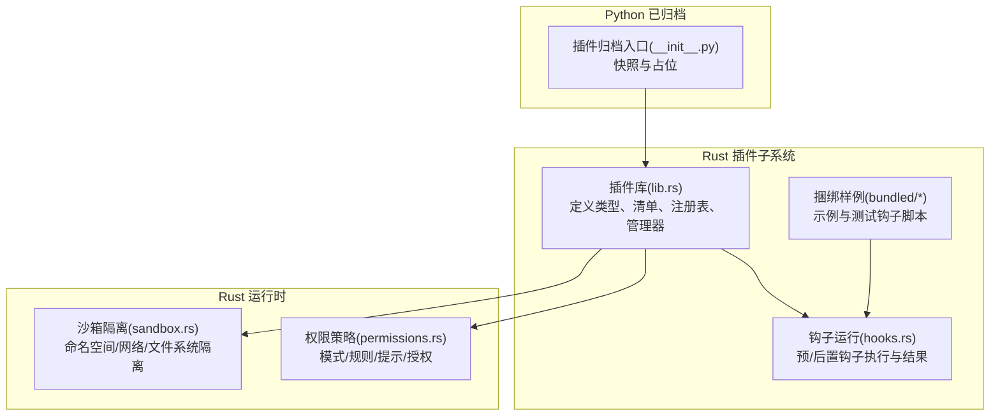
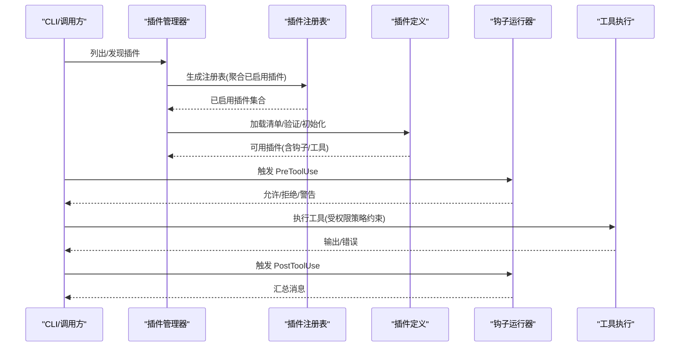
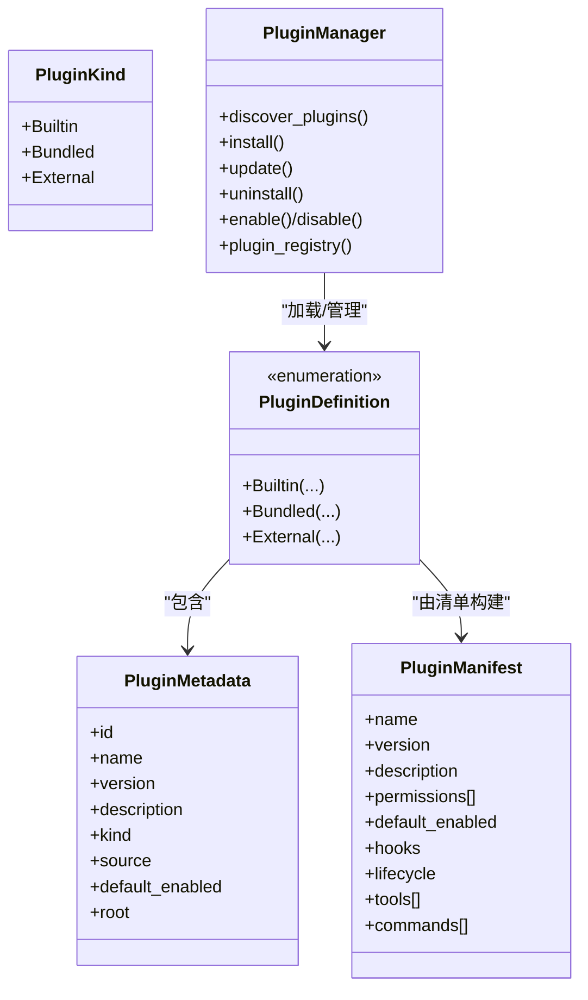
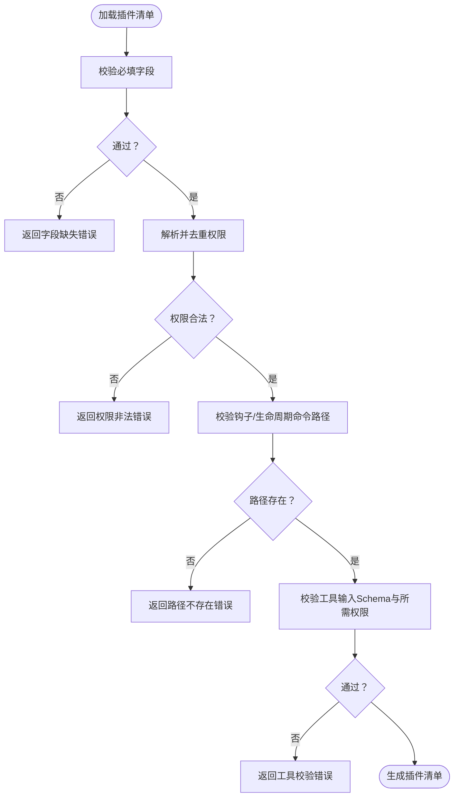
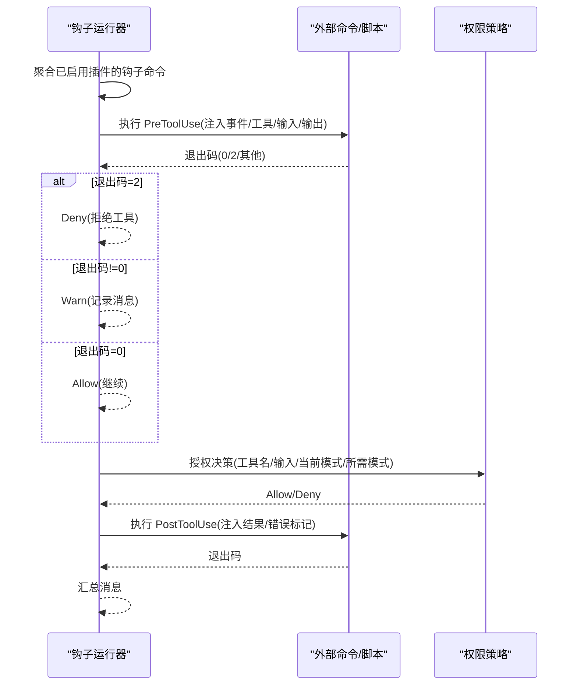
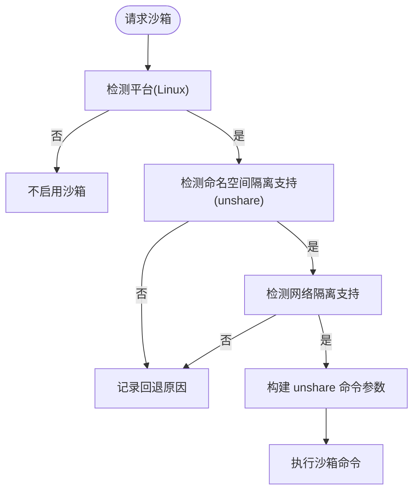
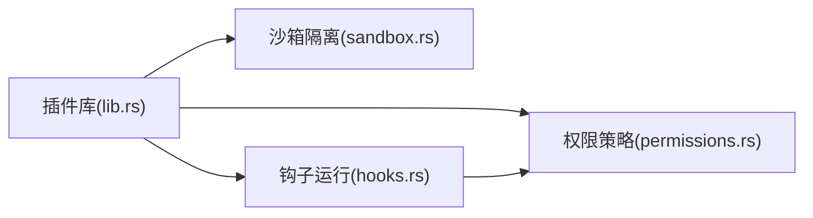

# 插件类型与分类

<cite>
**本文引用的文件**
- [rust/crates/plugins/src/lib.rs](file://rust/crates/plugins/src/lib.rs)
- [rust/crates/plugins/src/hooks.rs](file://rust/crates/plugins/src/hooks.rs)
- [rust/crates/plugins/bundled/example-bundled/.claude-plugin/plugin.json](file://rust/crates/plugins/bundled/example-bundled/.claude-plugin/plugin.json)
- [rust/crates/plugins/bundled/sample-hooks/.claude-plugin/plugin.json](file://rust/crates/plugins/bundled/sample-hooks/.claude-plugin/plugin.json)
- [rust/crates/plugins/bundled/example-bundled/hooks/pre.sh](file://rust/crates/plugins/bundled/example-bundled/hooks/pre.sh)
- [rust/crates/plugins/bundled/example-bundled/hooks/post.sh](file://rust/crates/plugins/bundled/example-bundled/hooks/post.sh)
- [rust/crates/plugins/bundled/sample-hooks/hooks/pre.sh](file://rust/crates/plugins/bundled/sample-hooks/hooks/pre.sh)
- [rust/crates/plugins/bundled/sample-hooks/hooks/post.sh](file://rust/crates/plugins/bundled/sample-hooks/hooks/post.sh)
- [rust/crates/runtime/src/permissions.rs](file://rust/crates/runtime/src/permissions.rs)
- [rust/crates/runtime/src/sandbox.rs](file://rust/crates/runtime/src/sandbox.rs)
- [src/plugins/__init__.py](file://src/plugins/__init__.py)
- [src/reference_data/subsystems/plugins.json](file://src/reference_data/subsystems/plugins.json)
</cite>

## 目录
1. [引言](#引言)
2. [项目结构](#项目结构)
3. [核心组件](#核心组件)
4. [架构总览](#架构总览)
5. [详细组件分析](#详细组件分析)
6. [依赖关系分析](#依赖关系分析)
7. [性能考量](#性能考量)
8. [故障排查指南](#故障排查指南)
9. [结论](#结论)
10. [附录](#附录)

## 引言
本文件面向 CLAW 项目的插件体系，系统化阐述插件的类型与分类：内置插件（Builtin）、捆绑插件（Bundled）与外部插件（External）。围绕三类插件的差异、适用场景、功能范围、使用限制、权限模型、安全边界与隔离机制，提供可操作的配置示例、命名规范、版本管理策略与生态建设建议。目标是帮助开发者与运维人员在不同场景下做出正确的插件选择与配置决策。

## 项目结构
- 插件系统由 Rust 子模块实现，核心位于 crates/plugins，负责插件发现、安装、启用/禁用、生命周期与钩子执行、工具清单聚合等。
- 运行时安全与权限控制位于 crates/runtime，涵盖权限模式、规则匹配、提示交互与沙箱隔离。
- Python 子系统已归档，保留快照以指导迁移与兼容性处理。

图表来源
- [rust/crates/plugins/src/lib.rs:1-200](file://rust/crates/plugins/src/lib.rs#L1-L200)
- [rust/crates/plugins/src/hooks.rs:1-120](file://rust/crates/plugins/src/hooks.rs#L1-L120)
- [rust/crates/runtime/src/permissions.rs:1-120](file://rust/crates/runtime/src/permissions.rs#L1-L120)
- [rust/crates/runtime/src/sandbox.rs:1-120](file://rust/crates/runtime/src/sandbox.rs#L1-L120)
- [src/plugins/__init__.py:1-17](file://src/plugins/__init__.py#L1-L17)

章节来源
- [rust/crates/plugins/src/lib.rs:1-200](file://rust/crates/plugins/src/lib.rs#L1-L200)
- [src/plugins/__init__.py:1-17](file://src/plugins/__init__.py#L1-L17)
- [src/reference_data/subsystems/plugins.json:1-9](file://src/reference_data/subsystems/plugins.json#L1-L9)

## 核心组件
- 插件类型与元数据
  - 类型枚举：Builtin、Bundled、External；用于区分来源与管理模式。
  - 元数据：包含 id、名称、版本、描述、来源、默认启用状态、根路径等。
- 清单与权限
  - 清单字段：name、version、description、permissions、defaultEnabled、hooks、lifecycle、tools、commands。
  - 权限：read、write、execute；工具权限：read-only、workspace-write、danger-full-access。
- 钩子与生命周期
  - 钩子：PreToolUse、PostToolUse；生命周期：Init、Shutdown。
  - 钩子运行器：收集来自已启用插件的命令列表，按事件触发并处理允许/拒绝/警告。
- 注册表与管理器
  - 已安装插件注册表：记录插件的安装路径、来源、版本、时间戳等。
  - 插件管理器：负责发现、安装、更新、卸载、启用/禁用插件，并生成插件注册表。

章节来源
- [rust/crates/plugins/src/lib.rs:23-131](file://rust/crates/plugins/src/lib.rs#L23-L131)
- [rust/crates/plugins/src/lib.rs:106-122](file://rust/crates/plugins/src/lib.rs#L106-L122)
- [rust/crates/plugins/src/lib.rs:124-196](file://rust/crates/plugins/src/lib.rs#L124-L196)
- [rust/crates/plugins/src/lib.rs:64-104](file://rust/crates/plugins/src/lib.rs#L64-L104)
- [rust/crates/plugins/src/lib.rs:366-374](file://rust/crates/plugins/src/lib.rs#L366-L374)
- [rust/crates/plugins/src/lib.rs:761-780](file://rust/crates/plugins/src/lib.rs#L761-L780)

## 架构总览
插件系统通过“发现—加载—验证—初始化—运行—关闭”的流程完成全生命周期管理。运行时结合权限策略与沙箱隔离，确保工具调用的安全可控。

图表来源
- [rust/crates/plugins/src/lib.rs:937-971](file://rust/crates/plugins/src/lib.rs#L937-L971)
- [rust/crates/plugins/src/hooks.rs:61-93](file://rust/crates/plugins/src/hooks.rs#L61-L93)

章节来源
- [rust/crates/plugins/src/lib.rs:937-1019](file://rust/crates/plugins/src/lib.rs#L937-L1019)
- [rust/crates/plugins/src/hooks.rs:61-93](file://rust/crates/plugins/src/hooks.rs#L61-L93)

## 详细组件分析

### 插件类型与分类
- 内置插件（Builtin）
  - 定义：随系统内建，通常不可卸载，由管理器直接构造。
  - 特点：默认不启用；无磁盘源码；生命周期与钩子为空或最小化。
  - 适用场景：系统级能力、基础钩子或演示用途。
  - 使用限制：不能通过常规安装/卸载流程变更；如需启用，需在配置中显式开启。
- 捆绑插件（Bundled）
  - 定义：随发行版打包，安装到本地目录，受同步机制管理。
  - 特点：自动同步至安装目录；版本变化会触发重装；默认启用状态由清单决定。
  - 适用场景：官方示例、测试样例、稳定扩展。
  - 使用限制：卸载需改为禁用；否则报错提示受保护。
- 外部插件（External）
  - 定义：用户从本地路径或 Git URL 安装，独立于系统与捆绑目录。
  - 特点：可自由安装/更新/卸载；默认不启用；支持启用/禁用切换。
  - 适用场景：第三方扩展、私有工具链、实验性功能。
  - 使用限制：卸载会删除安装目录；更新会重新拉取源码并覆盖安装。

图表来源
- [rust/crates/plugins/src/lib.rs:23-62](file://rust/crates/plugins/src/lib.rs#L23-L62)
- [rust/crates/plugins/src/lib.rs:106-122](file://rust/crates/plugins/src/lib.rs#L106-L122)
- [rust/crates/plugins/src/lib.rs:411-415](file://rust/crates/plugins/src/lib.rs#L411-L415)
- [rust/crates/plugins/src/lib.rs:903-936](file://rust/crates/plugins/src/lib.rs#L903-L936)

章节来源
- [rust/crates/plugins/src/lib.rs:1334-1350](file://rust/crates/plugins/src/lib.rs#L1334-L1350)
- [rust/crates/plugins/src/lib.rs:1192-1271](file://rust/crates/plugins/src/lib.rs#L1192-L1271)
- [rust/crates/plugins/src/lib.rs:978-1057](file://rust/crates/plugins/src/lib.rs#L978-L1057)

### 插件清单与工具权限
- 清单字段与校验
  - 必填字段：name、version、description。
  - 权限去重与合法性校验；钩子与生命周期命令路径存在性检查；工具输入 Schema 必须为对象；工具所需权限必须为合法枚举值。
- 工具权限模型
  - 工具权限：read-only、workspace-write、danger-full-access。
  - 运行时权限策略：基于 Active Mode 与 Required Mode 的比较，结合规则（allow/deny/ask）与提示器进行授权决策。

图表来源
- [rust/crates/plugins/src/lib.rs:1435-1478](file://rust/crates/plugins/src/lib.rs#L1435-L1478)
- [rust/crates/plugins/src/lib.rs:1480-1590](file://rust/crates/plugins/src/lib.rs#L1480-L1590)

章节来源
- [rust/crates/plugins/src/lib.rs:1435-1590](file://rust/crates/plugins/src/lib.rs#L1435-L1590)
- [rust/crates/runtime/src/permissions.rs:99-325](file://rust/crates/runtime/src/permissions.rs#L99-L325)

### 钩子与生命周期
- 钩子事件：PreToolUse、PostToolUse。
- 命令执行：根据事件名与工具上下文构造负载，注入环境变量，执行脚本或命令；退出码 0 表示允许，2 表示拒绝，其他表示警告。
- 生命周期：Init、Shutdown 在插件启用/禁用时分别执行。

图表来源
- [rust/crates/plugins/src/hooks.rs:95-205](file://rust/crates/plugins/src/hooks.rs#L95-L205)
- [rust/crates/runtime/src/permissions.rs:156-284](file://rust/crates/runtime/src/permissions.rs#L156-L284)

章节来源
- [rust/crates/plugins/src/hooks.rs:61-205](file://rust/crates/plugins/src/hooks.rs#L61-L205)
- [rust/crates/plugins/src/lib.rs:464-528](file://rust/crates/plugins/src/lib.rs#L464-L528)

### 安全边界与隔离机制
- 文件系统隔离模式
  - off：关闭隔离。
  - workspace-only：仅工作区可见。
  - allow-list：白名单挂载，需配置允许挂载路径。
- 命名空间与网络隔离
  - 仅在 Linux 且具备 unshare 命令时可用；请求启用但不满足条件时会回退并给出原因。
- 沙箱启动
  - 在 Linux 上可通过 unshare 启动带命名空间/IPC/PID/UTS 与可选网络隔离的容器化命令包装器。
- 权限策略
  - Active Mode 与 Required Mode 比较；规则 allow/deny/ask；Prompt 模式触发交互提示；Hook 可覆盖决策（Allow/Deny/Ask）。

图表来源
- [rust/crates/runtime/src/sandbox.rs:156-208](file://rust/crates/runtime/src/sandbox.rs#L156-L208)
- [rust/crates/runtime/src/sandbox.rs:211-262](file://rust/crates/runtime/src/sandbox.rs#L211-L262)

章节来源
- [rust/crates/runtime/src/sandbox.rs:1-208](file://rust/crates/runtime/src/sandbox.rs#L1-L208)
- [rust/crates/runtime/src/permissions.rs:1-120](file://rust/crates/runtime/src/permissions.rs#L1-L120)

### 插件选择与配置决策指南
- 选择内置插件（Builtin）
  - 场景：系统级能力或演示用途；无需安装，直接启用。
  - 注意：默认不启用，需在设置中开启。
- 选择捆绑插件（Bundled）
  - 场景：官方示例/测试样例；希望跟随发行版同步。
  - 注意：卸载需改为禁用；版本更新会自动同步。
- 选择外部插件（External）
  - 场景：第三方扩展、私有工具链；需要灵活安装/更新/卸载。
  - 注意：默认不启用；卸载会删除安装目录；更新会重新拉取并覆盖。

章节来源
- [rust/crates/plugins/src/lib.rs:1192-1271](file://rust/crates/plugins/src/lib.rs#L1192-L1271)
- [rust/crates/plugins/src/lib.rs:978-1057](file://rust/crates/plugins/src/lib.rs#L978-L1057)

### 配置示例与最佳实践
- 插件清单示例（参考捆绑样例）
  - 示例清单字段包含 name、version、description、defaultEnabled、hooks 等。
  - 钩子脚本示例：pre.sh、post.sh，分别在工具使用前/后执行。
- 最佳实践
  - 清单必填字段完整且非空；权限声明清晰；工具输入 Schema 为对象；工具所需权限明确。
  - 钩子脚本应健壮，合理处理退出码与标准输出/错误；避免阻塞与长时间运行。
  - 外部插件建议使用 Git URL 安装以便于更新；定期执行更新以保持最新版本。
  - 捆绑插件遵循同步机制，避免手动修改安装目录内容。

章节来源
- [rust/crates/plugins/bundled/example-bundled/.claude-plugin/plugin.json:1-11](file://rust/crates/plugins/bundled/example-bundled/.claude-plugin/plugin.json#L1-L11)
- [rust/crates/plugins/bundled/sample-hooks/.claude-plugin/plugin.json:1-11](file://rust/crates/plugins/bundled/sample-hooks/.claude-plugin/plugin.json#L1-L11)
- [rust/crates/plugins/bundled/example-bundled/hooks/pre.sh:1-3](file://rust/crates/plugins/bundled/example-bundled/hooks/pre.sh#L1-L3)
- [rust/crates/plugins/bundled/example-bundled/hooks/post.sh:1-3](file://rust/crates/plugins/bundled/example-bundled/hooks/post.sh#L1-L3)
- [rust/crates/plugins/bundled/sample-hooks/hooks/pre.sh:1-3](file://rust/crates/plugins/bundled/sample-hooks/hooks/pre.sh#L1-L3)
- [rust/crates/plugins/bundled/sample-hooks/hooks/post.sh:1-3](file://rust/crates/plugins/bundled/sample-hooks/hooks/post.sh#L1-L3)

### 插件生态建设与维护策略
- 分层治理
  - 内置：系统核心能力，严格控制与最小化。
  - 捆绑：官方示例与稳定扩展，自动同步与版本管理。
  - 外部：社区与第三方扩展，开放安装与更新。
- 清单与权限
  - 统一清单格式与校验规则；权限最小化原则；工具权限分级明确。
- 安全与隔离
  - 默认启用文件系统隔离（workspace-only 或 allow-list）；在 Linux 平台尽可能启用命名空间与网络隔离。
  - 权限策略与规则驱动授权，必要时触发用户提示。
- 可观测与可观测
  - 钩子消息汇总与日志；工具执行失败的错误信息；插件注册表记录安装/更新时间戳。

章节来源
- [rust/crates/plugins/src/lib.rs:1435-1590](file://rust/crates/plugins/src/lib.rs#L1435-L1590)
- [rust/crates/runtime/src/permissions.rs:156-325](file://rust/crates/runtime/src/permissions.rs#L156-L325)
- [rust/crates/runtime/src/sandbox.rs:156-208](file://rust/crates/runtime/src/sandbox.rs#L156-L208)

## 依赖关系分析
- 插件库与运行时
  - 插件库依赖运行时的权限策略与沙箱能力，用于工具执行与安全控制。
- 插件清单与工具
  - 清单中的工具权限与输入 Schema 影响运行时授权与执行路径。
- 钩子与策略
  - 钩子可影响最终授权决策（Allow/Deny/Ask），并与权限策略共同决定工具是否允许执行。

图表来源
- [rust/crates/plugins/src/lib.rs:1-120](file://rust/crates/plugins/src/lib.rs#L1-L120)
- [rust/crates/plugins/src/hooks.rs:1-60](file://rust/crates/plugins/src/hooks.rs#L1-L60)
- [rust/crates/runtime/src/permissions.rs:1-60](file://rust/crates/runtime/src/permissions.rs#L1-L60)
- [rust/crates/runtime/src/sandbox.rs:1-60](file://rust/crates/runtime/src/sandbox.rs#L1-L60)

章节来源
- [rust/crates/plugins/src/lib.rs:1-120](file://rust/crates/plugins/src/lib.rs#L1-L120)
- [rust/crates/plugins/src/hooks.rs:1-60](file://rust/crates/plugins/src/hooks.rs#L1-L60)
- [rust/crates/runtime/src/permissions.rs:1-60](file://rust/crates/runtime/src/permissions.rs#L1-L60)
- [rust/crates/runtime/src/sandbox.rs:1-60](file://rust/crates/runtime/src/sandbox.rs#L1-L60)

## 性能考量
- 钩子执行
  - 钩子脚本应尽量轻量，避免阻塞主线程；合并多个插件的钩子时注意顺序与依赖。
- 工具执行
  - 工具命令通过进程执行，输入/输出通过 stdin/stdout/stderr 传递；建议在工具内部做超时与资源限制。
- 插件发现与同步
  - 外部目录扫描与捆绑同步可能带来 IO 开销；建议合理配置 external_dirs 与安装根目录，减少不必要的遍历。
- 权限策略
  - 规则匹配与提示交互会增加少量开销；在高并发场景下可考虑缓存常用授权结果。

## 故障排查指南
- 清单校验错误
  - 字段为空、权限重复或非法、工具输入 Schema 非对象、工具所需权限非法、钩子/生命周期命令路径不存在等。
- 工具执行失败
  - 命令返回非零退出码或异常终止；检查工具命令、参数与环境变量；查看 stderr 输出。
- 插件未生效
  - 外部插件默认不启用；确认已执行启用操作；检查 settings.json 中的 enabledPlugins。
  - 捆绑插件卸载会报错，需改为禁用。
- 钩子拒绝
  - 钩子脚本返回退出码 2 导致拒绝；检查脚本逻辑与返回码；查看钩子运行器的消息。
- 权限不足
  - 当前模式低于所需模式；检查权限策略配置与 ask/deny 规则；必要时提升模式或调整规则。

章节来源
- [rust/crates/plugins/src/lib.rs:800-856](file://rust/crates/plugins/src/lib.rs#L800-L856)
- [rust/crates/plugins/src/lib.rs:858-890](file://rust/crates/plugins/src/lib.rs#L858-L890)
- [rust/crates/plugins/src/hooks.rs:151-205](file://rust/crates/plugins/src/hooks.rs#L151-L205)
- [rust/crates/runtime/src/permissions.rs:156-284](file://rust/crates/runtime/src/permissions.rs#L156-L284)

## 结论
CLAW 的插件体系通过“内置/捆绑/外部”三类插件实现分层治理，配合严格的清单校验、权限策略与沙箱隔离，确保扩展能力与安全性并重。遵循本文的分类标准、命名规范、版本管理策略与安全实践，可在不同场景下高效地选择与配置插件，构建稳健的插件生态系统。

## 附录
- Python 插件归档入口与快照
  - 归档名称与模块数量、示例文件路径等信息来源于快照文件，便于迁移与兼容性处理。

章节来源
- [src/plugins/__init__.py:1-17](file://src/plugins/__init__.py#L1-L17)
- [src/reference_data/subsystems/plugins.json:1-9](file://src/reference_data/subsystems/plugins.json#L1-L9)