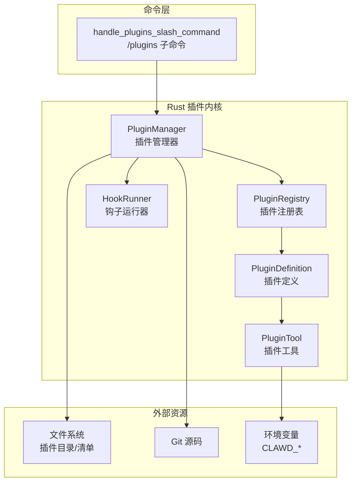
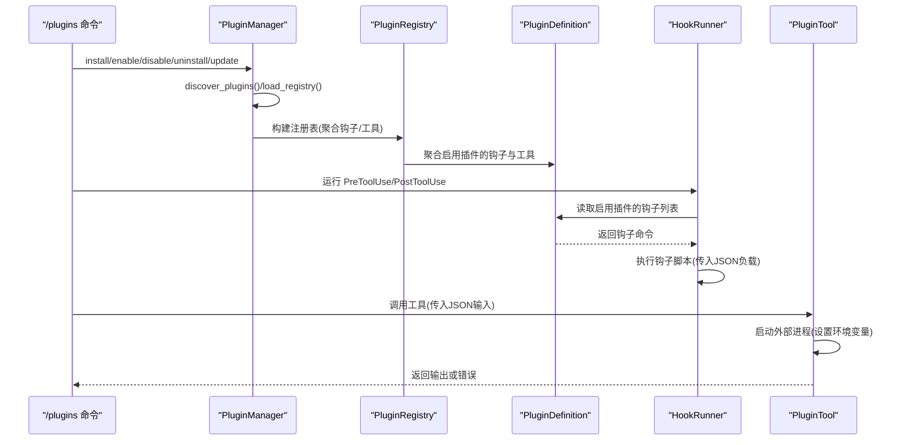
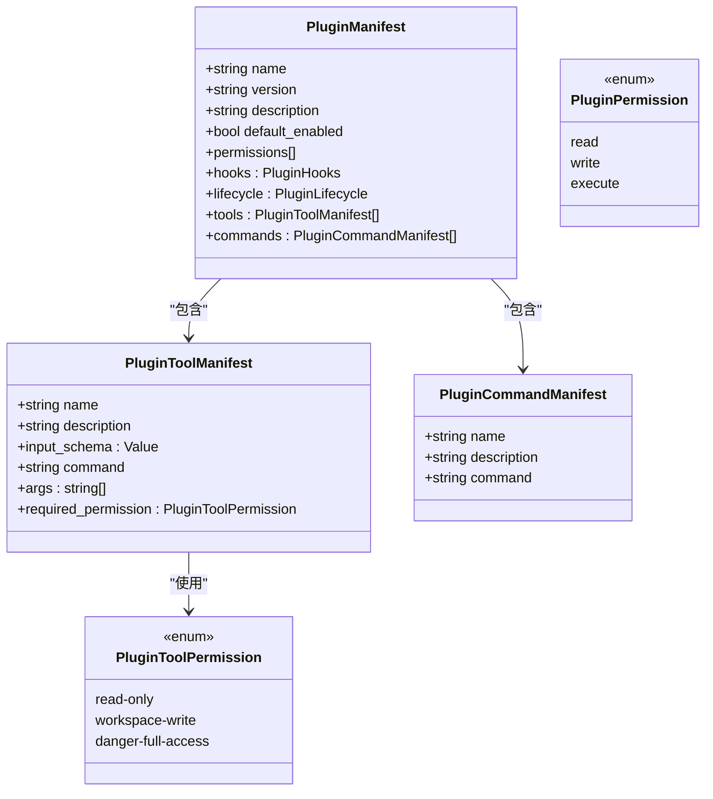
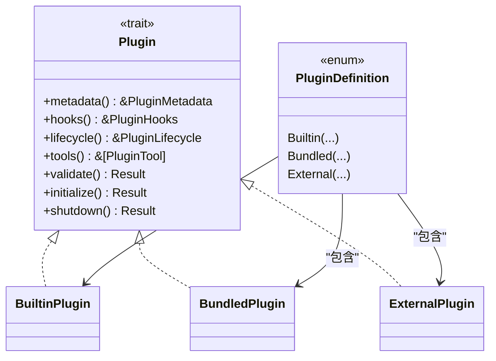
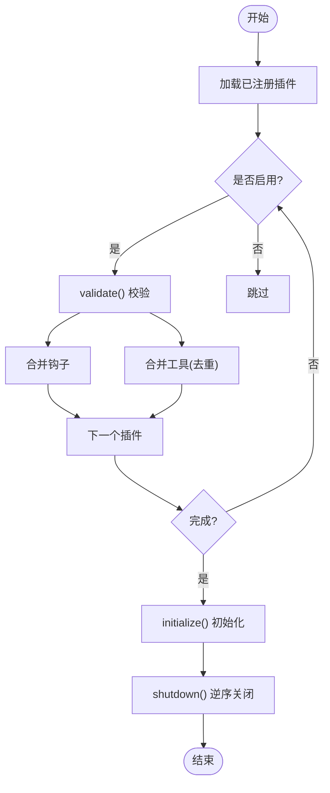
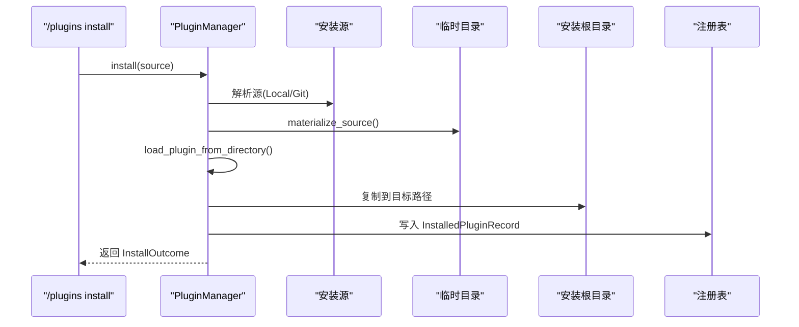
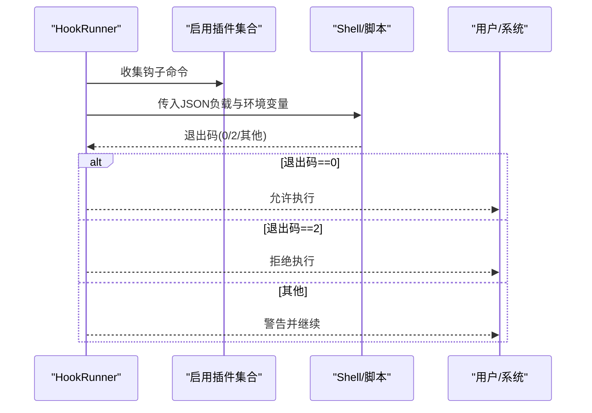
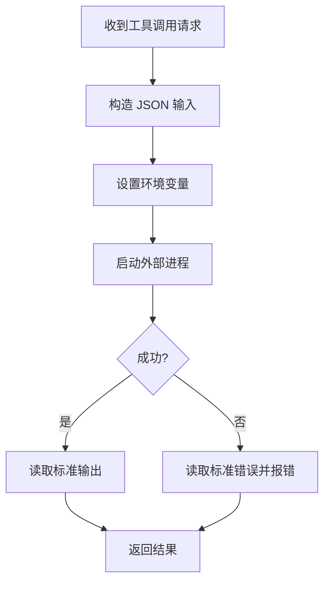
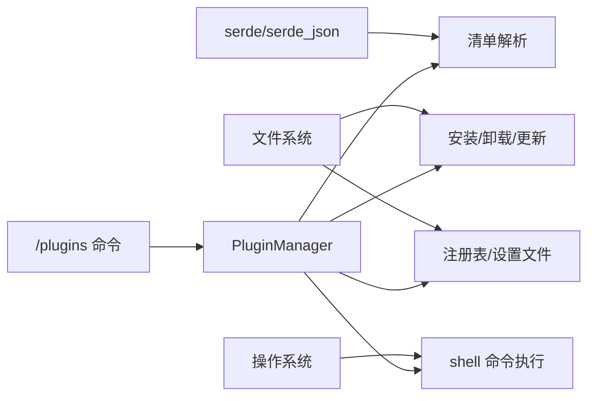

# 插件系统设计

<cite>
**本文引用的文件**
- [README.md](file://README.md)
- [lib.rs](file://rust/crates/plugins/src/lib.rs)
- [hooks.rs](file://rust/crates/plugins/src/hooks.rs)
- [Cargo.toml](file://rust/crates/plugins/Cargo.toml)
- [plugin.json（示例）](file://rust/crates/plugins/bundled/example-bundled/.claude-plugin/plugin.json)
- [plugin.json（样例钩子）](file://rust/crates/plugins/bundled/sample-hooks/.claude-plugin/plugin.json)
- [lib.rs（命令处理）](file://rust/crates/commands/src/lib.rs)
- [__init__.py（Python 插件占位）](file://src/plugins/__init__.py)
- [plugins.json（参考数据）](file://src/reference_data/subsystems/plugins.json)
</cite>

## 目录
1. [简介](#简介)
2. [项目结构](#项目结构)
3. [核心组件](#核心组件)
4. [架构总览](#架构总览)
5. [详细组件分析](#详细组件分析)
6. [依赖关系分析](#依赖关系分析)
7. [性能考虑](#性能考虑)
8. [故障排查指南](#故障排查指南)
9. [结论](#结论)
10. [附录](#附录)

## 简介
本文件面向 CLAW 项目的插件系统，系统性阐述其架构理念、模块化组织、扩展机制与运行时行为。该系统以 Rust 实现为核心，提供插件发现、安装、启用/禁用、聚合钩子与工具、生命周期管理、权限控制与安全隔离等能力；同时保留 Python 占位包以承接历史归档信息。

## 项目结构
- Rust 插件内核位于 crates/plugins，包含插件清单解析、插件定义、注册表、管理器、钩子执行器与工具调用器等。
- 命令层在 crates/commands，提供 /plugins 子命令对插件进行安装、启用、禁用、卸载与更新。
- Python 占位包 src/plugins 仅用于承载归档快照元数据，不包含运行时逻辑。
- 参考数据 src/reference_data/subsystems/plugins.json 提供插件子系统的历史镜像信息。

图示来源
- [lib.rs:761-764](file://rust/crates/plugins/src/lib.rs#L761-L764)
- [hooks.rs:50-53](file://rust/crates/plugins/src/hooks.rs#L50-L53)
- [lib.rs（命令处理）:475-585](file://rust/crates/commands/src/lib.rs#L475-L585)

章节来源
- [README.md:82-99](file://README.md#L82-L99)
- [plugins.json（参考数据）:1-9](file://src/reference_data/subsystems/plugins.json#L1-L9)
- [__init__.py（Python 插件占位）:1-17](file://src/plugins/__init__.py#L1-L17)

## 核心组件
- 插件清单与模型：定义插件元数据、权限、钩子、生命周期、工具与命令等字段，支持直接清单与打包清单两种路径。
- 插件定义与分类：内置、捆绑与外部三类插件，统一通过 trait 接口暴露生命周期与能力。
- 注册表与聚合：按 ID 排序维护已注册插件，聚合钩子与工具并去重校验。
- 管理器：负责插件发现、安装、启用/禁用、卸载、更新、清单校验与持久化。
- 钩子运行器：收集启用插件的钩子，按事件触发，支持允许、拒绝与警告三种结果。
- 工具执行器：通过进程调用外部脚本，传递标准化环境变量与输入 JSON，捕获输出与错误。

章节来源
- [lib.rs:52-122](file://rust/crates/plugins/src/lib.rs#L52-L122)
- [lib.rs:400-587](file://rust/crates/plugins/src/lib.rs#L400-L587)
- [lib.rs:651-735](file://rust/crates/plugins/src/lib.rs#L651-L735)
- [lib.rs:903-1331](file://rust/crates/plugins/src/lib.rs#L903-L1331)
- [hooks.rs:9-22](file://rust/crates/plugins/src/hooks.rs#L9-L22)
- [hooks.rs:50-93](file://rust/crates/plugins/src/hooks.rs#L50-L93)
- [lib.rs:297-339](file://rust/crates/plugins/src/lib.rs#L297-L339)

## 架构总览
下图展示从命令入口到插件执行的关键交互路径，包括插件发现、清单加载、钩子聚合与工具调用。

图示来源
- [lib.rs（命令处理）:475-585](file://rust/crates/commands/src/lib.rs#L475-L585)
- [lib.rs:937-971](file://rust/crates/plugins/src/lib.rs#L937-L971)
- [hooks.rs:65-93](file://rust/crates/plugins/src/hooks.rs#L65-L93)
- [lib.rs:297-339](file://rust/crates/plugins/src/lib.rs#L297-L339)

## 详细组件分析

### 组件一：插件清单与模型
- 清单字段：名称、版本、描述、默认启用、权限、钩子、生命周期、工具、命令。
- 权限与工具权限：细粒度控制读写执行与工作区写入、危险全权限。
- 清单路径：支持直接清单与打包清单(.claude-plugin/plugin.json)，自动探测。
- 校验规则：必填字段非空、权限合法且无重复、工具/命令条目唯一、命令路径存在。

图示来源
- [lib.rs:106-122](file://rust/crates/plugins/src/lib.rs#L106-L122)
- [lib.rs:158-168](file://rust/crates/plugins/src/lib.rs#L158-L168)
- [lib.rs:208-212](file://rust/crates/plugins/src/lib.rs#L208-L212)
- [lib.rs:124-130](file://rust/crates/plugins/src/lib.rs#L124-L130)
- [lib.rs:170-176](file://rust/crates/plugins/src/lib.rs#L170-L176)

章节来源
- [lib.rs:1394-1478](file://rust/crates/plugins/src/lib.rs#L1394-L1478)
- [lib.rs:1480-1637](file://rust/crates/plugins/src/lib.rs#L1480-L1637)
- [plugin.json（示例）:1-11](file://rust/crates/plugins/bundled/example-bundled/.claude-plugin/plugin.json#L1-L11)
- [plugin.json（样例钩子）:1-11](file://rust/crates/plugins/bundled/sample-hooks/.claude-plugin/plugin.json#L1-L11)

### 组件二：插件定义与生命周期
- 分类：内置、捆绑、外部三类，统一实现 Plugin trait。
- 生命周期：Init/Shutdown 阶段可执行命令，跨平台兼容。
- 验证：校验钩子、生命周期与工具命令路径是否存在。

图示来源
- [lib.rs:400-408](file://rust/crates/plugins/src/lib.rs#L400-L408)
- [lib.rs:410-587](file://rust/crates/plugins/src/lib.rs#L410-L587)

章节来源
- [lib.rs:464-528](file://rust/crates/plugins/src/lib.rs#L464-L528)
- [lib.rs:1797-1849](file://rust/crates/plugins/src/lib.rs#L1797-L1849)

### 组件三：注册表与聚合
- 注册表：按插件 ID 排序存储，提供查询、汇总与聚合钩子/工具的能力。
- 聚合策略：合并所有启用插件的钩子；工具名去重，冲突时报错。
- 初始化/关闭：按顺序验证并初始化，逆序关闭，确保资源正确释放。

图示来源
- [lib.rs:655-735](file://rust/crates/plugins/src/lib.rs#L655-L735)

章节来源
- [lib.rs:685-714](file://rust/crates/plugins/src/lib.rs#L685-L714)
- [lib.rs:716-734](file://rust/crates/plugins/src/lib.rs#L716-L734)

### 组件四：插件管理器与安装流程
- 发现：同步捆绑插件、扫描已安装目录、扫描外部目录。
- 安装：支持本地路径与 Git URL，克隆到临时目录后复制到安装根目录，写入注册表与启用状态。
- 卸载：禁止卸载捆绑插件，删除安装目录并清理注册表与启用状态。
- 更新：拉取新源，替换安装目录并更新注册表版本信息。
- 设置：settings.json 记录启用状态，支持增量更新。

图示来源
- [lib.rs（命令处理）:486-501](file://rust/crates/commands/src/lib.rs#L486-L501)
- [lib.rs:978-1019](file://rust/crates/plugins/src/lib.rs#L978-L1019)
- [lib.rs:1880-1905](file://rust/crates/plugins/src/lib.rs#L1880-L1905)
- [lib.rs:1953-1965](file://rust/crates/plugins/src/lib.rs#L1953-L1965)
- [lib.rs:1305-1331](file://rust/crates/plugins/src/lib.rs#L1305-L1331)

章节来源
- [lib.rs:957-971](file://rust/crates/plugins/src/lib.rs#L957-L971)
- [lib.rs:1039-1057](file://rust/crates/plugins/src/lib.rs#L1039-L1057)
- [lib.rs:1059-1095](file://rust/crates/plugins/src/lib.rs#L1059-L1095)
- [lib.rs:1192-1271](file://rust/crates/plugins/src/lib.rs#L1192-L1271)

### 组件五：钩子系统与通信协议
- 事件：PreToolUse、PostToolUse。
- 输入：JSON 负载包含事件名、工具名、工具输入(JSON 字符串与解析后的对象)、输出与错误标记。
- 执行：逐个命令执行，支持脚本与命令字符串；根据退出码区分允许/拒绝/警告。
- 输出：允许返回空消息或标准输出；拒绝返回明确消息；警告附加诊断信息。

图示来源
- [hooks.rs:65-93](file://rust/crates/plugins/src/hooks.rs#L65-L93)
- [hooks.rs:151-205](file://rust/crates/plugins/src/hooks.rs#L151-L205)

章节来源
- [hooks.rs:9-22](file://rust/crates/plugins/src/hooks.rs#L9-L22)
- [hooks.rs:108-149](file://rust/crates/plugins/src/hooks.rs#L108-L149)
- [hooks.rs:214-229](file://rust/crates/plugins/src/hooks.rs#L214-L229)

### 组件六：工具执行与数据交换
- 调用：通过进程启动外部脚本，标准输入传入 JSON，标准输出读取结果。
- 环境变量：CLAWD_PLUGIN_ID、CLAWD_PLUGIN_NAME、CLAWD_TOOL_NAME、CLAWD_TOOL_INPUT、CLAWD_PLUGIN_ROOT。
- 错误处理：失败时返回错误信息，包含退出码或标准错误内容。

图示来源
- [lib.rs:297-339](file://rust/crates/plugins/src/lib.rs#L297-L339)

章节来源
- [lib.rs:297-339](file://rust/crates/plugins/src/lib.rs#L297-L339)

## 依赖关系分析
- 外部依赖：serde/serde_json 用于清单序列化与反序列化。
- 平台差异：Windows 使用 cmd /C，非 Windows 使用 sh 或 sh -lc，兼容脚本与命令字符串。
- 文件系统：插件清单路径、安装目录、注册表文件与设置文件的读写。
- 命令层集成：/plugins 子命令驱动管理器执行操作并决定是否需要重载运行时。

图示来源
- [Cargo.toml:8-11](file://rust/crates/plugins/Cargo.toml#L8-L11)
- [lib.rs:1808-1846](file://rust/crates/plugins/src/lib.rs#L1808-L1846)
- [lib.rs（命令处理）:475-585](file://rust/crates/commands/src/lib.rs#L475-L585)

章节来源
- [Cargo.toml:1-14](file://rust/crates/plugins/Cargo.toml#L1-L14)
- [lib.rs:1851-1905](file://rust/crates/plugins/src/lib.rs#L1851-L1905)

## 性能考虑
- 插件发现与加载
  - 采用排序与去重策略，避免重复扫描与重复注册。
  - 捆绑插件同步时仅在版本或元数据变化时复制，减少 IO。
- 钩子执行
  - 串行执行钩子命令，保证一致性；若需更高吞吐，可考虑并发但需注意钩子间依赖与顺序约束。
- 工具执行
  - 外部进程启动成本较高，建议复用进程或批处理调用；当前实现按需启动，简单可靠。
- 序列化与校验
  - 清单解析与多处校验在安装阶段集中执行，避免运行时重复开销。

[本节为通用指导，无需特定文件来源]

## 故障排查指南
- 清单校验失败
  - 症状：安装时报“清单验证错误”。
  - 排查：检查必填字段、权限值、工具/命令条目唯一性与路径存在性。
- 命令路径不存在
  - 症状：生命周期或钩子命令执行失败。
  - 排查：确认命令为绝对路径或相对于插件根目录的相对路径，且文件存在。
- 工具调用失败
  - 症状：工具返回错误或无输出。
  - 排查：检查脚本可执行权限、输入 JSON 结构、环境变量是否正确设置。
- 插件卸载被拒
  - 症状：尝试卸载捆绑插件失败。
  - 排查：捆绑插件仅支持禁用，不可卸载。

章节来源
- [lib.rs:858-887](file://rust/crates/plugins/src/lib.rs#L858-L887)
- [lib.rs:1438-1478](file://rust/crates/plugins/src/lib.rs#L1438-L1478)
- [lib.rs:1650-1676](file://rust/crates/plugins/src/lib.rs#L1650-L1676)
- [lib.rs:1044-1049](file://rust/crates/plugins/src/lib.rs#L1044-L1049)

## 结论
该插件系统以清晰的数据模型与严格的清单校验为基础，结合注册表聚合与生命周期管理，提供了稳定可扩展的插件生态。钩子与工具通过标准化的 JSON 协议与环境变量实现与主系统的解耦，既保证了灵活性，也兼顾了安全性与可观测性。命令层提供完善的 CLI 操作，便于运维与自动化集成。

[本节为总结性内容，无需特定文件来源]

## 附录
- Python 插件占位包：仅承载归档快照元数据，不参与运行时逻辑。
- 参考数据：plugins.json 提供插件子系统的历史镜像信息。

章节来源
- [__init__.py（Python 插件占位）:1-17](file://src/plugins/__init__.py#L1-L17)
- [plugins.json（参考数据）:1-9](file://src/reference_data/subsystems/plugins.json#L1-L9)