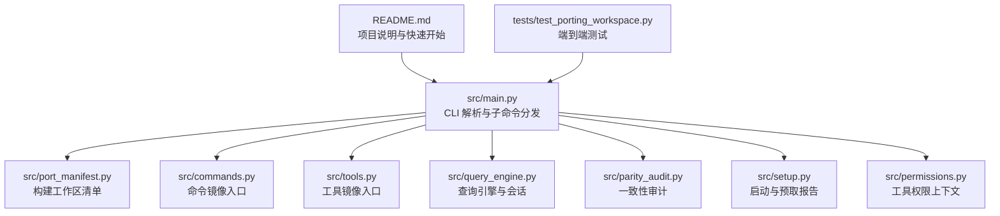
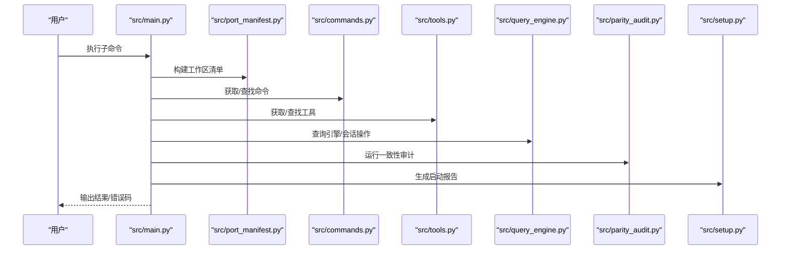
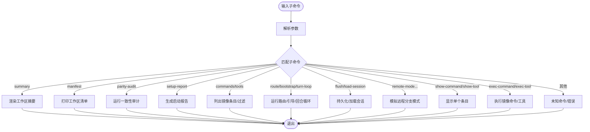
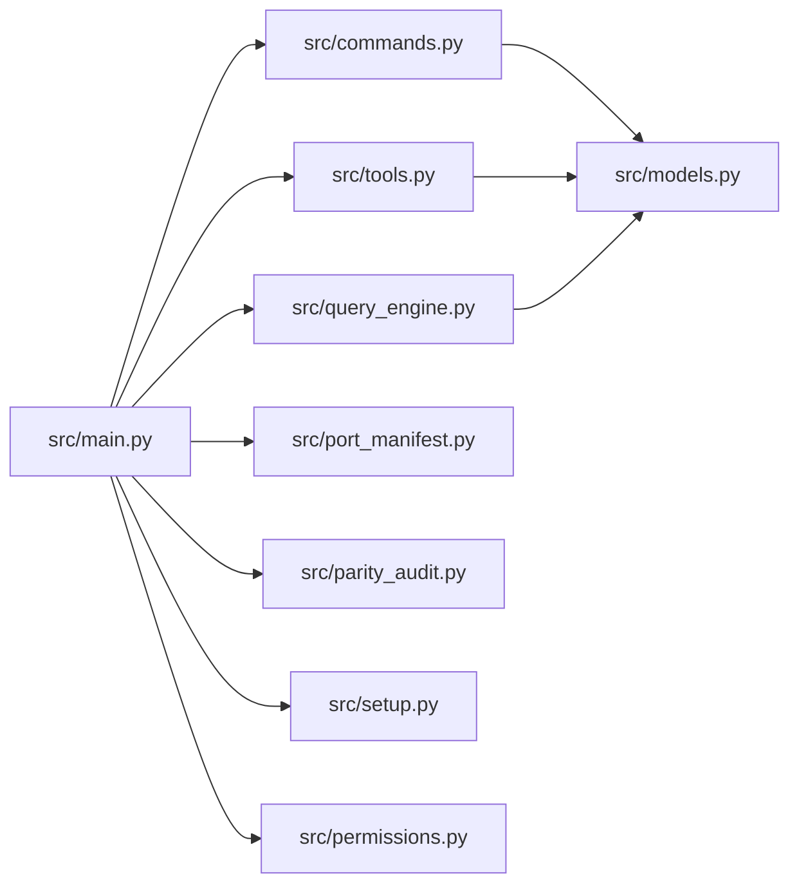

# 常见问题

<cite>
**本文引用的文件**
- [README.md](file://README.md)
- [Cargo.toml](file://rust/Cargo.toml)
- [src/main.py](file://src/main.py)
- [src/port_manifest.py](file://src/port_manifest.py)
- [src/setup.py](file://src/setup.py)
- [src/permissions.py](file://src/permissions.py)
- [src/parity_audit.py](file://src/parity_audit.py)
- [src/models.py](file://src/models.py)
- [src/commands.py](file://src/commands.py)
- [src/tools.py](file://src/tools.py)
- [src/query_engine.py](file://src/query_engine.py)
- [tests/test_porting_workspace.py](file://tests/test_porting_workspace.py)
</cite>

## 目录
1. [简介](#简介)
2. [项目结构](#项目结构)
3. [核心组件](#核心组件)
4. [架构总览](#架构总览)
5. [详细组件分析](#详细组件分析)
6. [依赖分析](#依赖分析)
7. [性能考虑](#性能考虑)
8. [故障排查指南](#故障排查指南)
9. [结论](#结论)
10. [附录](#附录)

## 简介
本常见问题解答面向首次使用或在使用 CLAW（Python 端口）过程中的用户，聚焦于安装、配置、权限与命令执行失败等高频问题。文档提供可复现的诊断步骤、具体错误示例与修复建议，并解释问题成因与预防措施，帮助您快速恢复正常使用。

## 项目结构
CLAW 的 Python 端口以 src/ 为核心工作区，提供 CLI 入口、清单生成、镜像命令/工具索引、运行时会话与遥测统计等功能；tests/ 提供端到端验证；rust/ 为并行推进的 Rust 实现工作区。

图表来源
- [README.md:112-149](file://README.md#L112-L149)
- [src/main.py:21-91](file://src/main.py#L21-L91)
- [src/port_manifest.py:30-52](file://src/port_manifest.py#L30-L52)
- [src/commands.py:22-36](file://src/commands.py#L22-L36)
- [src/tools.py:23-37](file://src/tools.py#L23-L37)
- [src/query_engine.py:35-44](file://src/query_engine.py#L35-L44)
- [src/parity_audit.py:121-138](file://src/parity_audit.py#L121-L138)
- [src/setup.py:64-77](file://src/setup.py#L64-L77)
- [src/permissions.py:6-21](file://src/permissions.py#L6-L21)
- [tests/test_porting_workspace.py:15-245](file://tests/test_porting_workspace.py#L15-L245)

章节来源
- [README.md:82-149](file://README.md#L82-L149)
- [src/main.py:94-210](file://src/main.py#L94-L210)

## 核心组件
- CLI 入口与子命令：解析参数、路由到具体功能（清单、摘要、命令/工具列表、路由、引导、回话加载、远程模式、执行命令/工具等）
- 工作区清单：统计顶层模块与文件数，输出 Markdown 摘要
- 镜像命令/工具：从快照加载条目，支持过滤与权限控制
- 查询引擎：会话管理、令牌预算、结构化输出、转录压缩
- 启动与预取：平台信息、预取任务、延迟初始化
- 权限上下文：基于名称与前缀的工具屏蔽
- 一致性审计：对比本地 Python 工作区与原始 TypeScript 快照

章节来源
- [src/main.py:21-91](file://src/main.py#L21-L91)
- [src/port_manifest.py:12-52](file://src/port_manifest.py#L12-L52)
- [src/commands.py:13-80](file://src/commands.py#L13-L80)
- [src/tools.py:14-86](file://src/tools.py#L14-L86)
- [src/query_engine.py:15-194](file://src/query_engine.py#L15-L194)
- [src/setup.py:12-77](file://src/setup.py#L12-L77)
- [src/permissions.py:6-21](file://src/permissions.py#L6-L21)
- [src/parity_audit.py:73-138](file://src/parity_audit.py#L73-L138)

## 架构总览
下图展示 CLI 到各子系统的调用关系与数据流。

图表来源
- [src/main.py:94-210](file://src/main.py#L94-L210)
- [src/port_manifest.py:30-52](file://src/port_manifest.py#L30-L52)
- [src/commands.py:60-80](file://src/commands.py#L60-L80)
- [src/tools.py:62-86](file://src/tools.py#L62-L86)
- [src/query_engine.py:45-59](file://src/query_engine.py#L45-L59)
- [src/parity_audit.py:121-138](file://src/parity_audit.py#L121-L138)
- [src/setup.py:64-77](file://src/setup.py#L64-L77)

## 详细组件分析

### CLI 子命令与执行流程
- 命令解析：根据子命令分发到对应处理逻辑
- 常用命令：summary、manifest、parity-audit、setup-report、commands、tools、route、bootstrap、turn-loop、flush-transcript、load-session、remote-mode/ssh-mode/teleport-mode/direct-connect-mode/deep-link-mode、show-command/show-tool、exec-command/exec-tool
- 返回值：成功返回 0，未知命令返回 2；部分命令在找不到条目时返回 1

图表来源
- [src/main.py:21-91](file://src/main.py#L21-L91)
- [src/main.py:94-210](file://src/main.py#L94-L210)

章节来源
- [src/main.py:21-91](file://src/main.py#L21-L91)
- [src/main.py:94-210](file://src/main.py#L94-L210)

### 工作区清单与文件统计
- 功能：扫描 src/ 下的 Python 文件，按顶层模块统计数量，生成 Markdown 清单
- 关键点：忽略 __pycache__；默认 src_root 为当前目录

章节来源
- [src/port_manifest.py:12-52](file://src/port_manifest.py#L12-L52)

### 镜像命令与工具
- 命令/工具来自快照 JSON，通过 LRU 缓存加载
- 支持过滤：排除插件命令、技能命令、MCP 工具、按前缀屏蔽
- 执行：返回虚拟执行结果，便于调试与演示

章节来源
- [src/commands.py:13-90](file://src/commands.py#L13-L90)
- [src/tools.py:14-96](file://src/tools.py#L14-L96)
- [src/permissions.py:6-21](file://src/permissions.py#L6-L21)

### 查询引擎与会话
- 会话状态：消息列表、权限拒绝记录、累计用量、转录存储
- 预算控制：最大回合数、最大预算令牌、结构化输出重试
- 持久化：保存会话、转录刷写、加载会话

章节来源
- [src/query_engine.py:15-194](file://src/query_engine.py#L15-L194)

### 启动与预取报告
- 平台信息：Python 版本、实现、操作系统
- 预取任务：MDM 读取、钥匙串预取、项目扫描
- 延迟初始化：信任模式下的安全初始化

章节来源
- [src/setup.py:12-77](file://src/setup.py#L12-L77)

### 一致性审计
- 对比目标：根文件映射、目录映射、命令/工具条目数量
- 依赖：本地 TypeScript 快照目录存在性
- 输出：覆盖率、缺失项清单

章节来源
- [src/parity_audit.py:73-138](file://src/parity_audit.py#L73-L138)

## 依赖分析
- CLI 依赖：命令/工具模块、查询引擎、清单、审计、启动报告、权限上下文
- 命令/工具依赖：快照 JSON、模型定义
- 查询引擎依赖：清单、会话存储、转录存储
- 审计依赖：参考快照 JSON、本地快照目录

图表来源
- [src/main.py:5-18](file://src/main.py#L5-L18)
- [src/commands.py:8](file://src/commands.py#L8)
- [src/tools.py:9](file://src/tools.py#L9)
- [src/query_engine.py:7-12](file://src/query_engine.py#L7-L12)
- [src/port_manifest.py:7](file://src/port_manifest.py#L7)
- [src/parity_audit.py:3-11](file://src/parity_audit.py#L3-L11)
- [src/setup.py:8-9](file://src/setup.py#L8-L9)
- [src/permissions.py:3](file://src/permissions.py#L3)

章节来源
- [src/main.py:5-18](file://src/main.py#L5-L18)

## 性能考虑
- 缓存策略：命令/工具快照使用 LRU 缓存，避免重复 IO
- 会话压缩：超过阈值后仅保留最近回合，降低内存占用
- 结构化输出重试：在序列化失败时自动降级重试，提升鲁棒性

章节来源
- [src/commands.py:22-36](file://src/commands.py#L22-L36)
- [src/tools.py:23-37](file://src/tools.py#L23-L37)
- [src/query_engine.py:129-132](file://src/query_engine.py#L129-L132)
- [src/query_engine.py:161-169](file://src/query_engine.py#L161-L169)

## 故障排查指南

### 1. 安装与环境问题
- 症状
  - 执行命令报错：找不到模块或命令不存在
  - 报错提示类似“ModuleNotFoundError”或“unknown command”
- 诊断步骤
  - 确认已安装 Python 3.6+，并在仓库根目录执行
  - 使用 README 中的快速开始命令验证 CLI 是否可用
- 修复方法
  - 使用 Python 3.6+ 运行 CLI
  - 在仓库根目录执行命令，确保相对路径正确
- 预防措施
  - 使用虚拟环境隔离依赖
  - 避免在非仓库根目录执行 CLI

章节来源
- [README.md:112-149](file://README.md#L112-L149)
- [src/main.py:21-91](file://src/main.py#L21-L91)

### 2. 命令执行失败（exec-command/exec-tool）
- 症状
  - 执行命令返回“未知镜像命令/工具”或返回码为 1
- 诊断步骤
  - 使用 commands/tools 子命令确认条目是否存在
  - 使用 show-command/show-tool 查看条目详情
- 修复方法
  - 使用精确的命令/工具名称
  - 如需过滤插件或 MCP，请调整相应选项
- 预防措施
  - 先用 list 子命令核对条目，再执行 exec

章节来源
- [src/main.py:186-207](file://src/main.py#L186-L207)
- [src/commands.py:52-80](file://src/commands.py#L52-L80)
- [src/tools.py:48-86](file://src/tools.py#L48-L86)

### 3. 权限不足或工具被屏蔽
- 症状
  - tools 列表中缺少某些工具，或执行时报“未知工具”
- 诊断步骤
  - 使用 deny-prefix 或 deny-tool 参数检查是否被屏蔽
  - 检查权限上下文的 deny_names 与 deny_prefixes
- 修复方法
  - 移除不必要屏蔽项，或调整 deny 列表
- 预防措施
  - 明确工具白名单，谨慎使用屏蔽选项

章节来源
- [src/tools.py:56-72](file://src/tools.py#L56-L72)
- [src/permissions.py:6-21](file://src/permissions.py#L6-L21)

### 4. 会话持久化与加载异常
- 症状
  - flush-transcript 未生成文件或返回“flushed=False”
  - load-session 无法找到会话
- 诊断步骤
  - 确认 flush-transcript 已执行且返回路径
  - 使用 load-session 加载会话 ID
- 修复方法
  - 先执行 flush-transcript 再加载
  - 确保会话 ID 正确无误
- 预防措施
  - 在需要持久化时先 flush，再进行加载

章节来源
- [src/query_engine.py:140-150](file://src/query_engine.py#L140-L150)
- [src/main.py:160-170](file://src/main.py#L160-L170)

### 5. 一致性审计不可用（本地快照缺失）
- 症状
  - parity-audit 输出“本地快照不可用”
- 诊断步骤
  - 检查 archive 目录是否存在
  - 确认 reference_data 下的快照 JSON 是否存在
- 修复方法
  - 准备本地 TypeScript 快照目录与 JSON
- 预防措施
  - 在具备快照的前提下运行审计

章节来源
- [src/parity_audit.py:121-138](file://src/parity_audit.py#L121-L138)

### 6. 路由与引导无匹配
- 症状
  - route 输出“未找到镜像命令/工具匹配”
- 诊断步骤
  - 使用 --query 参数缩小范围
  - 检查命令/工具快照内容
- 修复方法
  - 调整关键词或启用/禁用特定类型条目
- 预防措施
  - 在执行路由前先用 list 子命令核对条目

章节来源
- [src/main.py:142-149](file://src/main.py#L142-L149)
- [src/commands.py:69-72](file://src/commands.py#L69-L72)
- [src/tools.py:75-78](file://src/tools.py#L75-L78)

### 7. 远程/SSH/传送/直连/深链模式异常
- 症状
  - 模式输出不符合预期或报错
- 诊断步骤
  - 确认目标参数有效
  - 检查对应模式的实现是否被调用
- 修复方法
  - 使用正确的目标字符串
- 预防措施
  - 在文档中确认目标格式

章节来源
- [src/main.py:171-184](file://src/main.py#L171-L184)

### 8. 测试与验证失败
- 症状
  - 单元测试执行失败或输出不符合预期
- 诊断步骤
  - 使用 tests/test_porting_workspace.py 中的命令逐项验证
  - 检查 Python 版本与依赖
- 修复方法
  - 在仓库根目录执行测试命令
- 预防措施
  - 使用统一的测试命令与环境

章节来源
- [tests/test_porting_workspace.py:27-43](file://tests/test_porting_workspace.py#L27-L43)
- [tests/test_porting_workspace.py:57-71](file://tests/test_porting_workspace.py#L57-L71)
- [README.md:132-136](file://README.md#L132-L136)

### 9. Rust 工作区相关问题
- 症状
  - Rust 工作区编译或运行异常
- 诊断步骤
  - 检查 Cargo.toml 中的工作区配置
  - 确认 Rust 工具链版本满足要求
- 修复方法
  - 使用推荐的 Rust 版本与工具链
- 预防措施
  - 参考工作区配置与 lint 规则

章节来源
- [Cargo.toml:1-20](file://rust/Cargo.toml#L1-L20)

## 结论
本 FAQ 覆盖了 CLAW Python 端口在安装、配置、权限与命令执行方面的常见问题与解决方案。遵循诊断步骤与预防措施，可显著提升使用效率与稳定性。如需进一步探索，可结合 CLI 子命令与测试用例进行系统性验证。

## 附录
- 快速开始命令参考
  - 渲染摘要：python3 -m src.main summary
  - 打印清单：python3 -m src.main manifest
  - 运行一致性审计：python3 -m src.main parity-audit
  - 启动报告：python3 -m src.main setup-report
  - 列出命令/工具：python3 -m src.main commands/tools
  - 路由/引导/回合循环：python3 -m src.main route/bootstrap/turn-loop
  - 持久化/加载会话：python3 -m src.main flush-transcript/load-session
  - 远程/SSH/传送/直连/深链模式：python3 -m src.main remote-mode/ssh-mode/teleport-mode/direct-connect-mode/deep-link-mode
  - 执行命令/工具：python3 -m src.main exec-command/exec-tool

章节来源
- [README.md:112-149](file://README.md#L112-L149)