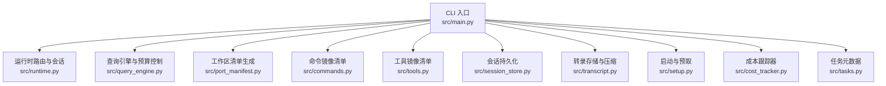
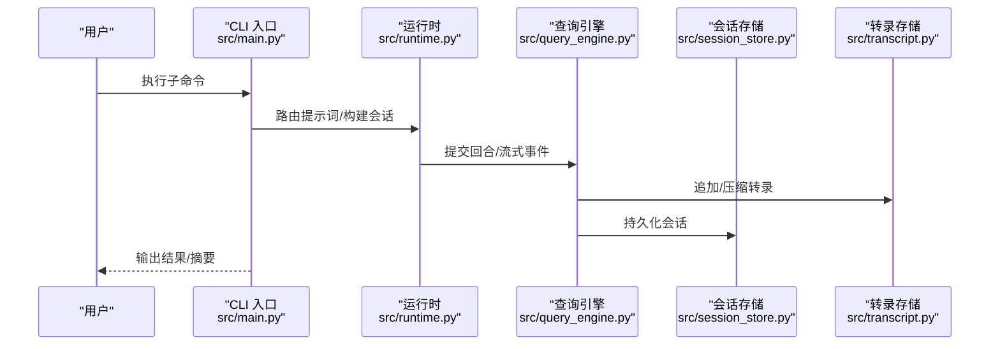
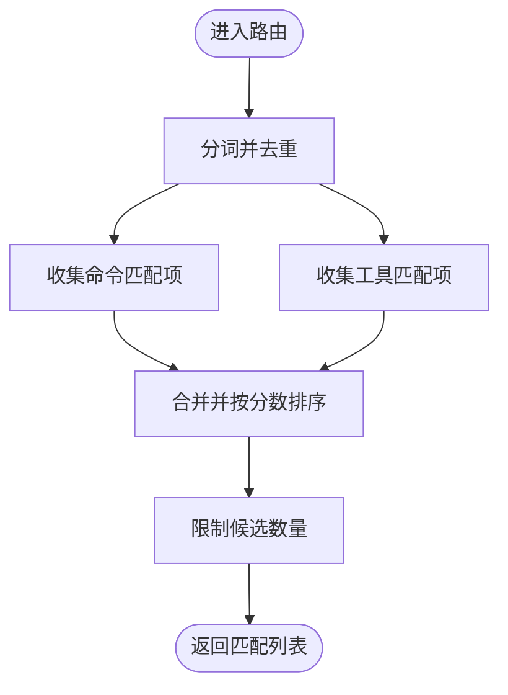
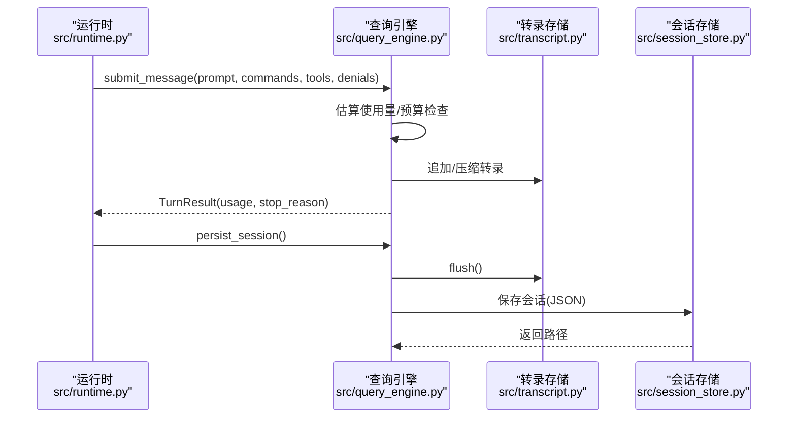
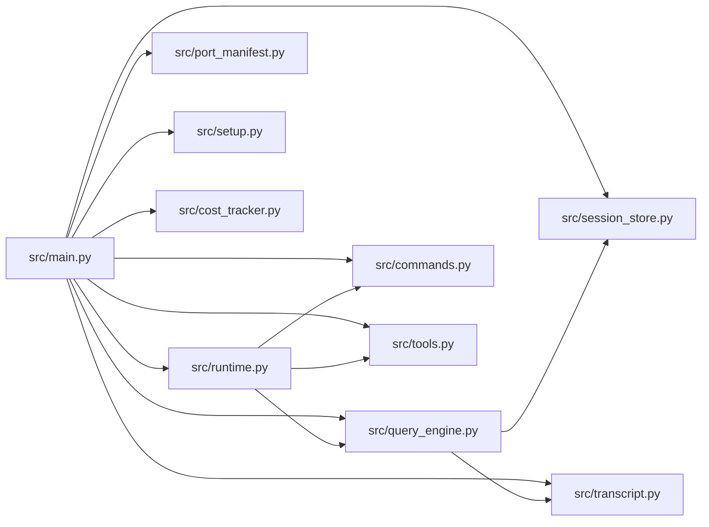

# 性能问题

<cite>
**本文引用的文件**
- [README.md](file://README.md)
- [src/main.py](file://src/main.py)
- [src/runtime.py](file://src/runtime.py)
- [src/query_engine.py](file://src/query_engine.py)
- [src/port_manifest.py](file://src/port_manifest.py)
- [src/commands.py](file://src/commands.py)
- [src/tools.py](file://src/tools.py)
- [src/models.py](file://src/models.py)
- [src/session_store.py](file://src/session_store.py)
- [src/transcript.py](file://src/transcript.py)
- [src/setup.py](file://src/setup.py)
- [src/cost_tracker.py](file://src/cost_tracker.py)
- [src/tasks.py](file://src/tasks.py)
</cite>

## 目录
1. [简介](#简介)
2. [项目结构](#项目结构)
3. [核心组件](#核心组件)
4. [架构总览](#架构总览)
5. [详细组件分析](#详细组件分析)
6. [依赖分析](#依赖分析)
7. [性能考量](#性能考量)
8. [故障排查指南](#故障排查指南)
9. [结论](#结论)
10. [附录](#附录)

## 简介
本指南聚焦于 CLAW（Python porting workspace）项目的性能问题诊断与优化，覆盖命令执行缓慢、内存占用过高、并发处理效率低等常见瓶颈，并结合仓库中现有的运行时会话、查询引擎、令牌预算、会话持久化与转录压缩等机制，给出可操作的监控指标、基准测试方法、成本跟踪使用与优化策略，以及任务调度与资源管理的最佳实践。同时提供针对 CPU 密集型与 I/O 密集型任务的定位与调优步骤。

## 项目结构
该仓库以 Python 为主导的重构工作区，围绕“镜像命令/工具清单”“运行时路由与会话”“查询引擎与令牌预算”“会话持久化与转录压缩”等模块组织。CLI 入口负责解析子命令并驱动各模块完成摘要渲染、清单输出、引导会话、回合循环、远程模式模拟等功能。

图表来源
- [src/main.py:94-214](file://src/main.py#L94-L214)
- [src/runtime.py:89-193](file://src/runtime.py#L89-L193)
- [src/query_engine.py:35-194](file://src/query_engine.py#L35-L194)
- [src/port_manifest.py:30-53](file://src/port_manifest.py#L30-L53)
- [src/commands.py:22-91](file://src/commands.py#L22-L91)
- [src/tools.py:23-97](file://src/tools.py#L23-L97)
- [src/session_store.py:19-36](file://src/session_store.py#L19-L36)
- [src/transcript.py:6-24](file://src/transcript.py#L6-L24)
- [src/setup.py:64-78](file://src/setup.py#L64-L78)
- [src/cost_tracker.py:6-14](file://src/cost_tracker.py#L6-L14)
- [src/tasks.py:6-12](file://src/tasks.py#L6-L12)

章节来源
- [README.md:82-131](file://README.md#L82-L131)
- [src/main.py:21-91](file://src/main.py#L21-L91)

## 核心组件
- 运行时路由与会话：负责提示词路由、命令/工具匹配、执行与流式事件、回合循环、权限拒绝推断与历史记录。
- 查询引擎与预算控制：负责回合提交、结构化输出、令牌预算检查、消息压缩、会话持久化与摘要渲染。
- 工作区清单：统计顶层模块与文件数量，辅助性能基线与变更追踪。
- 命令/工具镜像清单：LRU 缓存加载，避免重复 IO；支持过滤与权限上下文。
- 会话持久化与转录压缩：JSON 文件落盘与内存转录列表的压缩策略。
- 成本跟踪器：累计单位与事件日志，便于成本归因与审计。
- 启动与预取：在可信模式下触发一次性预取与延迟初始化，减少首次请求开销。

章节来源
- [src/runtime.py:89-193](file://src/runtime.py#L89-L193)
- [src/query_engine.py:35-194](file://src/query_engine.py#L35-L194)
- [src/port_manifest.py:30-53](file://src/port_manifest.py#L30-L53)
- [src/commands.py:22-91](file://src/commands.py#L22-L91)
- [src/tools.py:23-97](file://src/tools.py#L23-L97)
- [src/session_store.py:19-36](file://src/session_store.py#L19-L36)
- [src/transcript.py:6-24](file://src/transcript.py#L6-L24)
- [src/cost_tracker.py:6-14](file://src/cost_tracker.py#L6-L14)
- [src/setup.py:64-78](file://src/setup.py#L64-L78)

## 架构总览
CLAW 的 CLI 子命令驱动核心流程：从构建工作区清单开始，到运行时路由与会话构建，再到查询引擎回合提交与预算控制，最终通过会话持久化与转录压缩收尾。权限上下文与工具过滤贯穿命令/工具选择阶段。

图表来源
- [src/main.py:94-214](file://src/main.py#L94-L214)
- [src/runtime.py:109-152](file://src/runtime.py#L109-L152)
- [src/query_engine.py:61-151](file://src/query_engine.py#L61-L151)
- [src/session_store.py:19-36](file://src/session_store.py#L19-L36)
- [src/transcript.py:11-24](file://src/transcript.py#L11-L24)

## 详细组件分析

### 运行时路由与会话（PortRuntime）
- 路由逻辑：对提示词进行分词与评分，优先选择命令与工具匹配项，再按分数排序补充剩余候选。
- 会话构建：收集上下文、设置、历史、路由匹配、执行命令/工具、权限拒绝推断、流式事件与回合结果，并持久化会话路径。
- 回合循环：根据最大回合数与停止原因迭代提交，支持结构化输出配置。

图表来源
- [src/runtime.py:89-107](file://src/runtime.py#L89-L107)
- [src/runtime.py:176-192](file://src/runtime.py#L176-L192)

章节来源
- [src/runtime.py:89-193](file://src/runtime.py#L89-L193)

### 查询引擎与预算控制（QueryEnginePort）
- 配置项：最大回合数、单次预算令牌数、紧凑阈值、结构化输出与重试次数。
- 回合提交：格式化输出、估算使用量、预算检查、追加消息与转录、权限拒绝聚合、必要时压缩消息、返回回合结果。
- 流式接口：事件类型包括消息开始、命令/工具匹配、权限拒绝、消息增量、消息结束（含用量与停止原因）。
- 会话持久化：刷新转录后保存 JSON 文件，返回路径。

图表来源
- [src/runtime.py:122-134](file://src/runtime.py#L122-L134)
- [src/query_engine.py:61-104](file://src/query_engine.py#L61-L104)
- [src/query_engine.py:140-150](file://src/query_engine.py#L140-L150)
- [src/transcript.py:22-24](file://src/transcript.py#L22-L24)
- [src/session_store.py:19-36](file://src/session_store.py#L19-L36)

章节来源
- [src/query_engine.py:15-22](file://src/query_engine.py#L15-L22)
- [src/query_engine.py:61-128](file://src/query_engine.py#L61-L128)
- [src/query_engine.py:129-151](file://src/query_engine.py#L129-L151)

### 工作区清单（PortManifest）
- 统计顶层模块与文件数量，生成 Markdown 摘要，用于性能基线与变更追踪。

章节来源
- [src/port_manifest.py:30-53](file://src/port_manifest.py#L30-L53)

### 命令与工具镜像清单（commands/tools）
- 使用 LRU 缓存加载快照，避免重复 IO；提供过滤与权限上下文筛选。
- 支持按名称检索、索引渲染、执行“镜像”动作（仅打印信息，不实际执行）。

章节来源
- [src/commands.py:22-91](file://src/commands.py#L22-L91)
- [src/tools.py:23-97](file://src/tools.py#L23-L97)

### 会话持久化与转录压缩（session_store/transcript）
- 会话存储：以 JSON 形式保存会话 ID、消息序列与用量。
- 转录存储：维护消息列表，支持压缩保留最近 N 条与刷新标记。

章节来源
- [src/session_store.py:8-36](file://src/session_store.py#L8-L36)
- [src/transcript.py:6-24](file://src/transcript.py#L6-L24)

### 成本跟踪器（CostTracker）
- 记录标签与单位，累积总量与事件列表，便于成本归因与审计。

章节来源
- [src/cost_tracker.py:6-14](file://src/cost_tracker.py#L6-L14)

### 启动与预取（setup）
- 在可信模式下执行预取与延迟初始化，减少首次请求开销。

章节来源
- [src/setup.py:64-78](file://src/setup.py#L64-L78)

## 依赖分析
- CLI 作为入口，依赖运行时、查询引擎、清单、命令/工具、会话存储、转录存储、启动模块与成本跟踪器。
- 运行时依赖命令/工具清单、上下文、历史、执行注册表与查询引擎。
- 查询引擎依赖清单、会话存储、转录存储与权限拒绝模型。
- 命令/工具模块依赖数据类与权限上下文，提供缓存与过滤能力。

图表来源
- [src/main.py:5-18](file://src/main.py#L5-L18)
- [src/runtime.py:5-13](file://src/runtime.py#L5-L13)
- [src/query_engine.py:7-12](file://src/query_engine.py#L7-L12)

章节来源
- [src/main.py:5-18](file://src/main.py#L5-L18)
- [src/runtime.py:5-13](file://src/runtime.py#L5-L13)
- [src/query_engine.py:7-12](file://src/query_engine.py#L7-L12)

## 性能考量

### 监控指标与观测点
- 会话层面
  - 输入/输出令牌总量与回合数：用于预算与成本控制。
  - 会话持久化耗时与磁盘写入大小。
  - 转录压缩比例与刷新状态。
- 路由与执行层面
  - 路由匹配数量与平均分数。
  - 命令/工具执行数量与权限拒绝数量。
  - 流式事件吞吐（消息开始/增量/结束）。
- 资源层面
  - 内存占用（消息列表长度、转录列表长度、缓存命中率）。
  - IO 开销（会话读写、清单扫描）。
- 预算与节流
  - 预算阈值触发频率与停止原因分布。

章节来源
- [src/query_engine.py:25-33](file://src/query_engine.py#L25-L33)
- [src/query_engine.py:61-104](file://src/query_engine.py#L61-L104)
- [src/query_engine.py:140-150](file://src/query_engine.py#L140-L150)
- [src/transcript.py:15-24](file://src/transcript.py#L15-L24)
- [src/commands.py:22-41](file://src/commands.py#L22-L41)
- [src/tools.py:23-37](file://src/tools.py#L23-L37)

### 基准测试方法
- 单轮基准
  - 场景：固定提示词与命令/工具集合，测量回合提交耗时、令牌用量、停止原因。
  - 指标：平均耗时、P95/P99 延迟、令牌吞吐、预算触发率。
- 多轮基准
  - 场景：连续多轮提交，观察转录压缩与消息截断效果。
  - 指标：每轮耗时、转录长度、压缩比例、持久化耗时。
- 并发基准
  - 场景：多个独立会话并发提交，观察磁盘与 CPU 利用。
  - 指标：并发吞吐、队列等待时间、磁盘 IOPS、CPU 利用率。
- 清单扫描基准
  - 场景：多次构建工作区清单，评估文件系统扫描与计数开销。
  - 指标：清单构建耗时、文件数量与模块统计准确性。

章节来源
- [src/port_manifest.py:30-53](file://src/port_manifest.py#L30-L53)
- [src/query_engine.py:152-194](file://src/query_engine.py#L152-L194)

### 成本跟踪系统的使用与优化
- 使用场景
  - 将 CostTracker 与查询引擎的用量汇总结合，按事件记录标签与单位，实现成本归因。
- 优化策略
  - 合理设置 max_budget_tokens 与 max_turns，避免超预算导致的中断。
  - 对高成本工具或命令进行权限限制与过滤，降低执行频次。
  - 结合 LRU 缓存与权限上下文，减少无效匹配与执行。

章节来源
- [src/cost_tracker.py:6-14](file://src/cost_tracker.py#L6-L14)
- [src/query_engine.py:16-22](file://src/query_engine.py#L16-L22)
- [src/tools.py:56-72](file://src/tools.py#L56-L72)

### 任务调度与资源管理最佳实践
- 任务拆分
  - 将长对话拆分为多个短回合，利用紧凑阈值与转录压缩控制内存。
- 优先级与配额
  - 为高优先级任务设置更高的预算与回合上限，低优先级任务降级。
- 资源隔离
  - 会话持久化目录独立，避免磁盘争用；必要时对会话写入做限速。
- 缓存与预热
  - 利用命令/工具快照的 LRU 缓存，减少重复 IO；在可信模式下提前执行预取。

章节来源
- [src/query_engine.py:129-132](file://src/query_engine.py#L129-L132)
- [src/transcript.py:15-18](file://src/transcript.py#L15-L18)
- [src/commands.py:22-41](file://src/commands.py#L22-L41)
- [src/tools.py:23-37](file://src/tools.py#L23-L37)
- [src/setup.py:64-78](file://src/setup.py#L64-L78)

### CPU 密集型与 I/O 密集型问题定位与调优
- CPU 密集型
  - 观察点：路由评分、清单扫描、JSON 序列化/反序列化。
  - 调优：减少路由候选数量（limit）、缩小清单扫描范围、降低结构化输出重试次数。
- I/O 密集型
  - 观察点：会话读写、转录压缩、文件系统扫描。
  - 调优：合并写入批次、启用异步写入、减少不必要的 flush、使用更快的存储介质。

章节来源
- [src/runtime.py:89-107](file://src/runtime.py#L89-L107)
- [src/port_manifest.py:30-53](file://src/port_manifest.py#L30-L53)
- [src/query_engine.py:161-169](file://src/query_engine.py#L161-L169)
- [src/session_store.py:19-36](file://src/session_store.py#L19-L36)
- [src/transcript.py:15-24](file://src/transcript.py#L15-L24)

## 故障排查指南
- 命令/工具未找到
  - 现象：执行镜像命令/工具返回未找到。
  - 排查：确认名称大小写与来源提示；检查是否被权限上下文屏蔽。
- 预算过早耗尽
  - 现象：回合被 max_budget_reached 提前终止。
  - 排查：查看输入/输出令牌估算与累计；调整 max_budget_tokens 或减少回合数。
- 会话持久化失败
  - 现象：保存会话报错或路径为空。
  - 排查：确认会话目录存在且可写；检查 JSON 序列化异常。
- 转录未刷新
  - 现象：转录刷新标志未更新。
  - 排查：确认在持久化前调用了 flush；检查紧凑阈值设置。

章节来源
- [src/commands.py:75-80](file://src/commands.py#L75-L80)
- [src/tools.py:81-86](file://src/tools.py#L81-L86)
- [src/query_engine.py:89-90](file://src/query_engine.py#L89-L90)
- [src/query_engine.py:140-150](file://src/query_engine.py#L140-L150)
- [src/session_store.py:19-36](file://src/session_store.py#L19-L36)
- [src/transcript.py:22-24](file://src/transcript.py#L22-L24)

## 结论
通过对路由、查询引擎、会话持久化与转录压缩等核心模块的深入分析，可以系统性地定位与缓解 CLAW 项目中的性能瓶颈。建议以预算控制与转录压缩为抓手，配合 LRU 缓存与权限过滤，优化 CPU 与 I/O 密集型场景下的资源消耗，并通过基准测试持续验证优化效果。

## 附录

### 关键配置与参数说明
- 查询引擎配置
  - max_turns：最大回合数
  - max_budget_tokens：单次预算令牌数
  - compact_after_turns：紧凑阈值
  - structured_output：结构化输出开关
  - structured_retry_limit：结构化输出重试次数
- 运行时路由
  - limit：路由候选数量限制
- 会话持久化
  - 保存目录：默认 .port_sessions
  - 文件命名：session_id.json

章节来源
- [src/query_engine.py:16-22](file://src/query_engine.py#L16-L22)
- [src/runtime.py:89-107](file://src/runtime.py#L89-L107)
- [src/session_store.py:16-24](file://src/session_store.py#L16-L24)