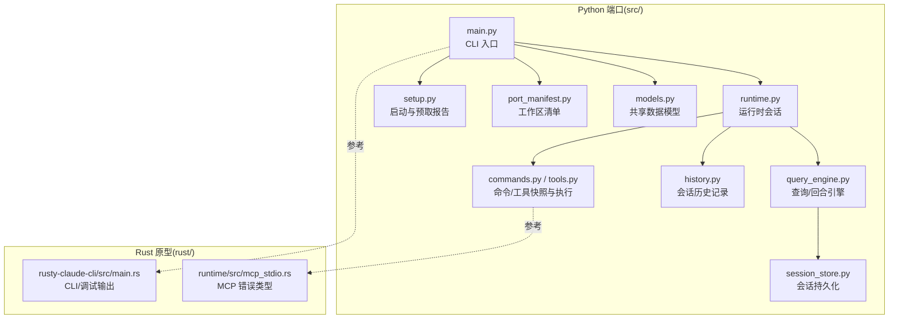
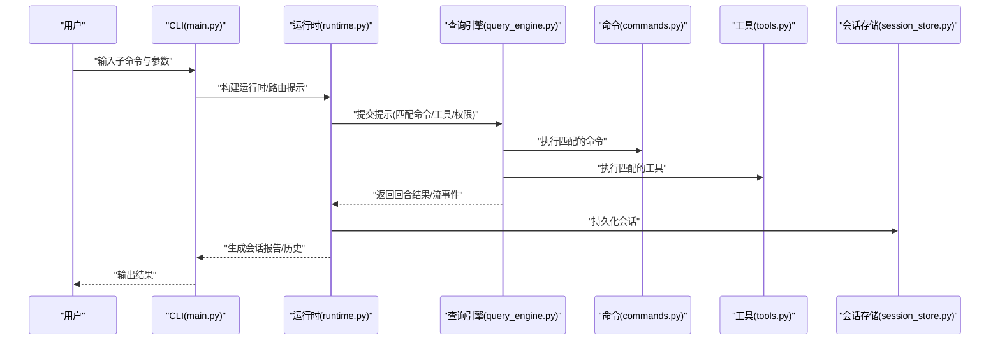
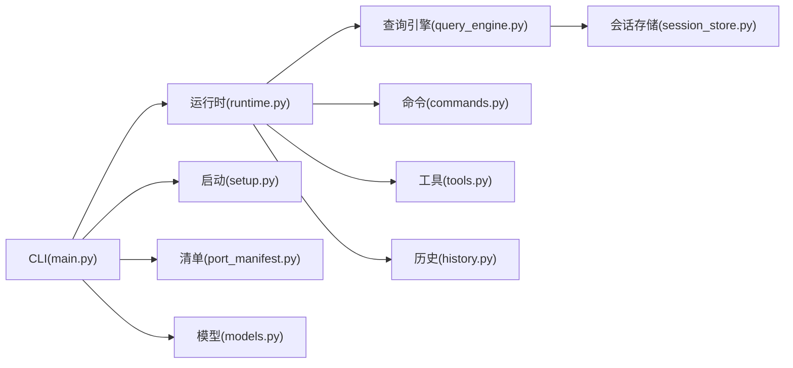
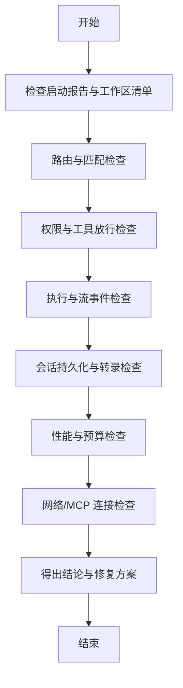

# 故障排除

<cite>
**本文引用的文件**
- [README.md](file://README.md)
- [CLAUDE.md](file://CLAUDE.md)
- [PARITY.md](file://PARITY.md)
- [src/main.py](file://src/main.py)
- [src/runtime.py](file://src/runtime.py)
- [src/query_engine.py](file://src/query_engine.py)
- [src/commands.py](file://src/commands.py)
- [src/tools.py](file://src/tools.py)
- [src/permissions.py](file://src/permissions.py)
- [src/session_store.py](file://src/session_store.py)
- [src/history.py](file://src/history.py)
- [src/setup.py](file://src/setup.py)
- [src/port_manifest.py](file://src/port_manifest.py)
- [src/models.py](file://src/models.py)
- [rust/crates/rusty-claude-cli/src/main.rs](file://rust/crates/rusty-claude-cli/src/main.rs)
- [rust/crates/runtime/src/mcp_stdio.rs](file://rust/crates/runtime/src/mcp_stdio.rs)
</cite>

## 目录
1. [简介](#简介)
2. [项目结构](#项目结构)
3. [核心组件](#核心组件)
4. [架构总览](#架构总览)
5. [详细组件分析与排错](#详细组件分析与排错)
6. [依赖关系分析](#依赖关系分析)
7. [性能考虑与优化建议](#性能考虑与优化建议)
8. [故障排除指南](#故障排除指南)
9. [结论](#结论)
10. [附录：社区支持与问题报告](#附录社区支持与问题报告)

## 简介
本指南面向 CLAW（Python 端口）与 Rust 原型两条路径，提供系统化的故障排除方法，覆盖命令/工具路由、权限控制、会话持久化、日志与审计、性能瓶颈、网络与 MCP 连接、以及数据一致性等问题。文档同时给出可操作的诊断步骤、错误代码参考、调试工具用法与日志分析技巧，并提供社区支持与问题报告指引。

## 项目结构
CLAW 的 Python 端口以“镜像式重构”为目标，通过命令与工具快照、查询引擎与运行时会话，形成可诊断、可回放、可审计的工作流。Rust 路线提供更贴近原版 TypeScript 的运行时能力，但当前仍存在功能差距。

图表来源
- [src/main.py:1-214](file://src/main.py#L1-L214)
- [src/runtime.py:1-193](file://src/runtime.py#L1-L193)
- [src/query_engine.py:1-194](file://src/query_engine.py#L1-L194)
- [src/commands.py:1-91](file://src/commands.py#L1-L91)
- [src/tools.py:1-97](file://src/tools.py#L1-L97)
- [src/session_store.py:1-36](file://src/session_store.py#L1-L36)
- [src/history.py:1-23](file://src/history.py#L1-L23)
- [src/setup.py:1-78](file://src/setup.py#L1-L78)
- [src/port_manifest.py:1-53](file://src/port_manifest.py#L1-L53)
- [src/models.py:1-50](file://src/models.py#L1-L50)
- [rust/crates/rusty-claude-cli/src/main.rs:2173-2215](file://rust/crates/rusty-claude-cli/src/main.rs#L2173-L2215)
- [rust/crates/runtime/src/mcp_stdio.rs:220-267](file://rust/crates/runtime/src/mcp_stdio.rs#L220-L267)

章节来源
- [README.md:82-136](file://README.md#L82-L136)
- [src/main.py:21-91](file://src/main.py#L21-L91)
- [src/port_manifest.py:30-53](file://src/port_manifest.py#L30-L53)

## 核心组件
- CLI 入口与子命令解析：负责路由到摘要、清单、命令/工具索引、会话加载与远程模式模拟等。
- 运行时会话：封装上下文、设置、历史、路由匹配、命令/工具执行、流事件与回合结果。
- 查询引擎：回合提交、结构化输出、预算与回合上限控制、会话转录与持久化。
- 权限控制：基于名称与前缀的工具屏蔽策略。
- 会话存储：本地 JSON 持久化，支持加载与保存。
- 历史记录：按事件追加，生成 Markdown 报告。
- 启动与预取：收集环境信息、执行预取与延迟初始化，生成启动报告。
- 工作区清单：统计顶层模块与文件数量，辅助定位缺失或异常模块。

章节来源
- [src/main.py:94-210](file://src/main.py#L94-L210)
- [src/runtime.py:89-193](file://src/runtime.py#L89-L193)
- [src/query_engine.py:35-194](file://src/query_engine.py#L35-L194)
- [src/permissions.py:6-21](file://src/permissions.py#L6-L21)
- [src/session_store.py:19-36](file://src/session_store.py#L19-L36)
- [src/history.py:12-23](file://src/history.py#L12-L23)
- [src/setup.py:64-78](file://src/setup.py#L64-L78)
- [src/port_manifest.py:30-53](file://src/port_manifest.py#L30-L53)

## 架构总览
下图展示一次典型提示处理的端到端流程，包括路由、执行、流事件与回合结果。

图表来源
- [src/main.py:94-210](file://src/main.py#L94-L210)
- [src/runtime.py:109-152](file://src/runtime.py#L109-L152)
- [src/query_engine.py:61-128](file://src/query_engine.py#L61-L128)
- [src/commands.py:75-81](file://src/commands.py#L75-L81)
- [src/tools.py:81-87](file://src/tools.py#L81-L87)
- [src/session_store.py:19-36](file://src/session_store.py#L19-L36)

## 详细组件分析与排错

### CLI 与子命令（src/main.py）
- 常见问题
  - 子命令不存在：返回未知命令错误码。
  - 参数不合法：argparse 将报错并终止。
  - 执行失败：命令/工具执行返回未处理状态时返回非零退出码。
- 排查步骤
  - 使用帮助子命令查看可用选项。
  - 逐步缩小参数范围，确认必填项与互斥项。
  - 对于执行类命令，检查返回的已处理标志与消息。
- 关键路径
  - [src/main.py:21-91](file://src/main.py#L21-L91)
  - [src/main.py:94-210](file://src/main.py#L94-L210)

章节来源
- [src/main.py:94-210](file://src/main.py#L94-L210)

### 运行时会话与路由（src/runtime.py）
- 常见问题
  - 提示无匹配：路由为空，需调整关键词或检查命令/工具快照。
  - 权限拒绝：对高危工具（如 Bash）默认拒绝，需在许可上下文中放行。
  - 回合循环：超过最大回合数或预算限制会提前停止。
- 排查步骤
  - 使用路由子命令查看匹配列表与评分。
  - 使用引导会话生成器查看上下文、注册表、执行与流事件。
  - 检查权限拒绝列表与 Bash 工具的默认拒绝策略。
- 关键路径
  - [src/runtime.py:89-193](file://src/runtime.py#L89-L193)

章节来源
- [src/runtime.py:89-193](file://src/runtime.py#L89-L193)

### 查询引擎与回合控制（src/query_engine.py）
- 常见问题
  - 结构化输出失败：JSON 序列化异常触发重试与最终错误。
  - 预算超限：输入/输出累计超过预算，提前结束。
  - 回合上限：达到最大回合数后不再继续。
- 排查步骤
  - 开启结构化输出模式并观察重试次数与最终输出。
  - 查看回合结果中的停止原因与使用统计。
  - 检查转录是否被压缩与刷新。
- 关键路径
  - [src/query_engine.py:15-33](file://src/query_engine.py#L15-L33)
  - [src/query_engine.py:61-104](file://src/query_engine.py#L61-L104)
  - [src/query_engine.py:106-128](file://src/query_engine.py#L106-L128)
  - [src/query_engine.py:140-150](file://src/query_engine.py#L140-L150)

章节来源
- [src/query_engine.py:61-128](file://src/query_engine.py#L61-L128)

### 命令与工具快照及执行（src/commands.py, src/tools.py）
- 常见问题
  - 未知命令/工具：名称大小写不一致或不在快照中。
  - 权限过滤：被许可上下文屏蔽导致不可用。
  - 快照差异：与 TypeScript 原版存在功能差距。
- 排查步骤
  - 使用命令/工具子命令列出镜像条目，确认名称与来源提示。
  - 使用查询参数筛选，缩小范围。
  - 通过执行器返回的消息确认是否被镜像处理。
- 关键路径
  - [src/commands.py:22-36](file://src/commands.py#L22-L36)
  - [src/tools.py:23-37](file://src/tools.py#L23-L37)
  - [src/commands.py:75-81](file://src/commands.py#L75-L81)
  - [src/tools.py:81-87](file://src/tools.py#L81-L87)

章节来源
- [src/commands.py:22-81](file://src/commands.py#L22-L81)
- [src/tools.py:23-87](file://src/tools.py#L23-L87)

### 权限控制（src/permissions.py）
- 常见问题
  - 工具被意外屏蔽：名称或前缀匹配导致拒绝。
  - 默认拒绝策略：对高危工具（如 Bash）默认拒绝。
- 排查步骤
  - 使用工具子命令的拒绝参数临时放行特定工具或前缀。
  - 检查拒绝列表与拒绝原因。
- 关键路径
  - [src/permissions.py:6-21](file://src/permissions.py#L6-L21)

章节来源
- [src/permissions.py:6-21](file://src/permissions.py#L6-L21)

### 会话存储与历史（src/session_store.py, src/history.py）
- 常见问题
  - 会话无法加载：目标文件不存在或格式不正确。
  - 会话未刷新：转录未持久化导致数据丢失。
- 排查步骤
  - 检查会话目录是否存在与权限。
  - 使用加载子命令确认消息数量与令牌用量。
  - 确认转录是否已刷新与压缩。
- 关键路径
  - [src/session_store.py:19-36](file://src/session_store.py#L19-L36)
  - [src/history.py:12-23](file://src/history.py#L12-L23)

章节来源
- [src/session_store.py:19-36](file://src/session_store.py#L19-L36)
- [src/history.py:12-23](file://src/history.py#L12-L23)

### 启动与工作区清单（src/setup.py, src/port_manifest.py）
- 常见问题
  - 预取失败：系统扫描或钥匙串读取异常。
  - 清单异常：顶层模块计数异常，可能缺少关键模块。
- 排查步骤
  - 查看启动报告中的预取与延迟初始化结果。
  - 使用清单子命令核对模块数量与注释。
- 关键路径
  - [src/setup.py:64-78](file://src/setup.py#L64-L78)
  - [src/port_manifest.py:30-53](file://src/port_manifest.py#L30-L53)

章节来源
- [src/setup.py:64-78](file://src/setup.py#L64-L78)
- [src/port_manifest.py:30-53](file://src/port_manifest.py#L30-L53)

### Rust 原型调试与 MCP 错误（rust/crates/rusty-claude-cli/src/main.rs, rust/crates/runtime/src/mcp_stdio.rs）
- 常见问题
  - MCP 服务器返回 JSON-RPC 错误或无效响应。
  - 未知工具或服务器导致调用失败。
  - 最近一次工具调用调试报告缺失。
- 排查步骤
  - 使用 Rust CLI 的工具调用调试报告功能，查看最近一次工具调用的输入与结果。
  - 检查 MCP 错误类型与错误详情，定位具体方法与服务器名。
  - 确认工具名称与服务器名称拼写与配置一致。
- 关键路径
  - [rust/crates/rusty-claude-cli/src/main.rs:2180-2215](file://rust/crates/rusty-claude-cli/src/main.rs#L2180-L2215)
  - [rust/crates/runtime/src/mcp_stdio.rs:220-267](file://rust/crates/runtime/src/mcp_stdio.rs#L220-L267)

章节来源
- [rust/crates/rusty-claude-cli/src/main.rs:2180-2215](file://rust/crates/rusty-claude-cli/src/main.rs#L2180-L2215)
- [rust/crates/runtime/src/mcp_stdio.rs:220-267](file://rust/crates/runtime/src/mcp_stdio.rs#L220-L267)

## 依赖关系分析
- 组件耦合
  - CLI 依赖运行时与查询引擎；运行时依赖命令/工具快照与权限上下文；查询引擎依赖会话存储与转录。
- 外部集成点
  - Rust 原型通过 MCP stdio 与外部服务交互，错误类型集中定义以便统一处理。
- 循环依赖
  - 当前结构为单向依赖，无明显循环。

图表来源
- [src/main.py:94-210](file://src/main.py#L94-L210)
- [src/runtime.py:89-193](file://src/runtime.py#L89-L193)
- [src/query_engine.py:35-194](file://src/query_engine.py#L35-L194)
- [src/commands.py:1-91](file://src/commands.py#L1-L91)
- [src/tools.py:1-97](file://src/tools.py#L1-L97)
- [src/session_store.py:1-36](file://src/session_store.py#L1-L36)
- [src/history.py:1-23](file://src/history.py#L1-L23)
- [src/setup.py:1-78](file://src/setup.py#L1-L78)
- [src/port_manifest.py:1-53](file://src/port_manifest.py#L1-L53)
- [src/models.py:1-50](file://src/models.py#L1-L50)

## 性能考虑与优化建议
- 回合与预算控制
  - 合理设置最大回合数与预算令牌，避免长对话导致内存与计算压力。
  - 在查询引擎中启用紧凑消息机制，减少存储与传输开销。
- 结构化输出
  - 结构化输出失败会触发重试，建议在失败时降级为普通文本输出。
- 日志与审计
  - 使用历史记录与启动报告定位性能瓶颈与异常路径。
- Rust 路线
  - 参考功能差距文档，优先补齐关键服务与插件生态，减少跨语言桥接成本。

章节来源
- [src/query_engine.py:15-22](file://src/query_engine.py#L15-L22)
- [src/query_engine.py:129-132](file://src/query_engine.py#L129-L132)
- [src/history.py:12-23](file://src/history.py#L12-L23)
- [PARITY.md:198-215](file://PARITY.md#L198-L215)

## 故障排除指南

### 通用诊断步骤
- 步骤一：确认环境与启动
  - 运行启动报告子命令，检查 Python 版本、平台、可信模式与预取结果。
  - 若预取失败，优先修复系统扫描与钥匙串访问。
- 步骤二：核对工作区清单
  - 使用清单子命令确认顶层模块数量与注释，定位缺失模块。
- 步骤三：路由与执行
  - 使用路由子命令查看匹配列表与评分，必要时调整提示词。
  - 使用引导会话生成器查看上下文、注册表、执行与流事件。
- 步骤四：权限与工具
  - 检查权限拒绝列表，必要时使用拒绝参数临时放行。
  - 使用命令/工具子命令核对镜像条目与来源提示。
- 步骤五：会话与持久化
  - 使用加载子命令确认消息数量与令牌用量。
  - 确认转录已刷新与压缩，避免数据丢失。

章节来源
- [src/setup.py:64-78](file://src/setup.py#L64-L78)
- [src/port_manifest.py:30-53](file://src/port_manifest.py#L30-L53)
- [src/main.py:142-159](file://src/main.py#L142-L159)
- [src/runtime.py:109-152](file://src/runtime.py#L109-L152)
- [src/permissions.py:18-21](file://src/permissions.py#L18-L21)
- [src/session_store.py:27-36](file://src/session_store.py#L27-L36)

### 错误代码与状态参考
- CLI 返回码
  - 0：成功
  - 1：命令/工具未找到或执行未处理
  - 2：未知命令
- 回合停止原因
  - completed：正常完成
  - max_turns_reached：达到最大回合数
  - max_budget_reached：预算超限
- 权限拒绝
  - 示例：对高危 Bash 工具的默认拒绝
- MCP 错误类型
  - JSON-RPC 错误、无效响应、未知工具、未知服务器

章节来源
- [src/main.py:208-209](file://src/main.py#L208-L209)
- [src/query_engine.py:67-78](file://src/query_engine.py#L67-L78)
- [src/runtime.py:169-174](file://src/runtime.py#L169-L174)
- [rust/crates/runtime/src/mcp_stdio.rs:220-267](file://rust/crates/runtime/src/mcp_stdio.rs#L220-L267)

### 调试工具与日志分析
- Python 路径
  - 使用 Rust CLI 的“最近一次工具调试报告”功能，查看工具调用 ID、名称与输入。
  - 分析会话历史与启动报告，定位异常阶段。
- Rust 路径
  - 使用 MCP 错误类型输出，结合服务器名与方法定位问题。
  - 检查脚本生成与权限设置，确保 MCP 服务可执行。

章节来源
- [rust/crates/rusty-claude-cli/src/main.rs:2180-2215](file://rust/crates/rusty-claude-cli/src/main.rs#L2180-L2215)
- [rust/crates/runtime/src/mcp_stdio.rs:220-267](file://rust/crates/runtime/src/mcp_stdio.rs#L220-L267)
- [src/history.py:12-23](file://src/history.py#L12-L23)

### 网络连接与 MCP 排查
- 症状
  - MCP 服务器无响应或返回错误。
  - 工具调用失败且提示未知工具或服务器。
- 排查
  - 检查 MCP 服务器配置与进程状态。
  - 使用错误类型输出定位具体方法与服务器名。
  - 确认工具名称拼写与注册表一致。

章节来源
- [rust/crates/runtime/src/mcp_stdio.rs:220-267](file://rust/crates/runtime/src/mcp_stdio.rs#L220-L267)

### 权限验证与安全
- 症状
  - 高危工具（如 Bash）被拒绝。
  - 权限上下文屏蔽了预期工具。
- 排查
  - 检查拒绝列表与拒绝原因。
  - 使用拒绝参数临时放行，确认问题是否解决。
  - 审视许可策略，避免过度放权。

章节来源
- [src/runtime.py:169-174](file://src/runtime.py#L169-L174)
- [src/permissions.py:18-21](file://src/permissions.py#L18-L21)

### 数据一致性与会话恢复
- 症状
  - 会话加载失败或消息数量异常。
  - 转录未刷新导致数据丢失。
- 排查
  - 检查会话目录权限与文件存在性。
  - 使用加载子命令核对消息与令牌用量。
  - 确认转录已刷新与压缩。

章节来源
- [src/session_store.py:27-36](file://src/session_store.py#L27-L36)
- [src/query_engine.py:137-150](file://src/query_engine.py#L137-L150)

### 系统性问题定位与根因分析
- 流程图

图表来源
- [src/setup.py:64-78](file://src/setup.py#L64-L78)
- [src/port_manifest.py:30-53](file://src/port_manifest.py#L30-L53)
- [src/main.py:142-159](file://src/main.py#L142-L159)
- [src/runtime.py:109-152](file://src/runtime.py#L109-L152)
- [src/session_store.py:19-36](file://src/session_store.py#L19-L36)
- [src/query_engine.py:61-104](file://src/query_engine.py#L61-L104)

## 结论
通过 CLI 子命令、运行时会话、查询引擎与权限控制的协同，CLAW 提供了可诊断、可回放、可审计的排错能力。配合 Rust 原型的 MCP 错误类型与调试报告，可快速定位网络与集成问题。建议在日常使用中定期生成启动报告、会话历史与清单，建立基线以便对比与回归分析。

## 附录：社区支持与问题报告
- 社区与资源
  - 加入 instructkr Discord 社区，参与韩语 LLM 与代理工作流讨论。
  - 参考仓库 README 中的社区链接与徽章。
- 问题报告指南
  - 提供 CLI 子命令输出（摘要、清单、路由、引导会话、启动报告）。
  - 附上会话 ID 与相关历史事件。
  - 描述症状、复现步骤与期望行为。
  - 如涉及 Rust 路线，附上 MCP 错误类型与服务器名。

章节来源
- [README.md:174-182](file://README.md#L174-L182)
- [CLAUDE.md:18-22](file://CLAUDE.md#L18-L22)