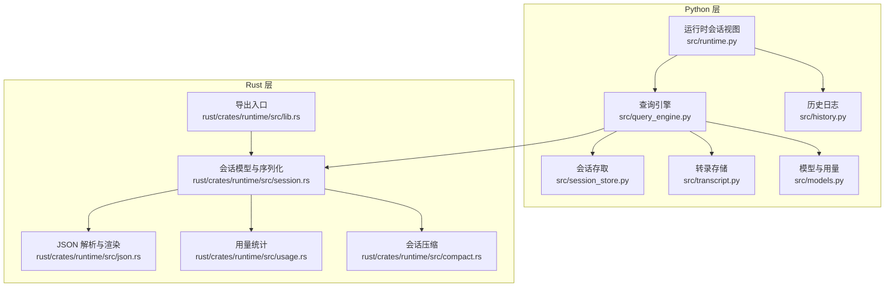
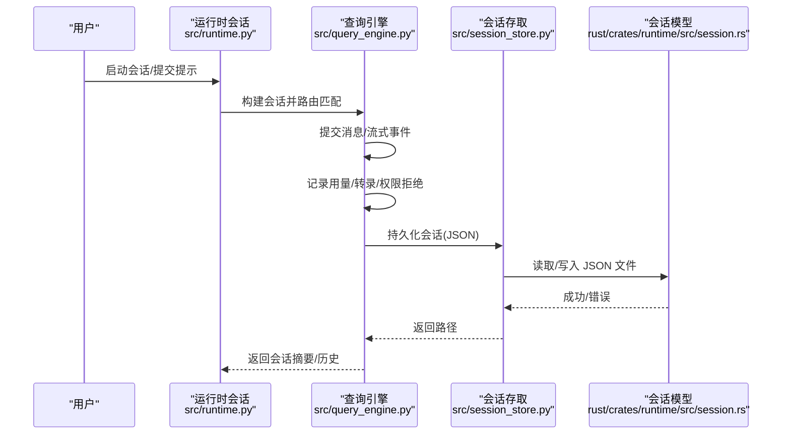
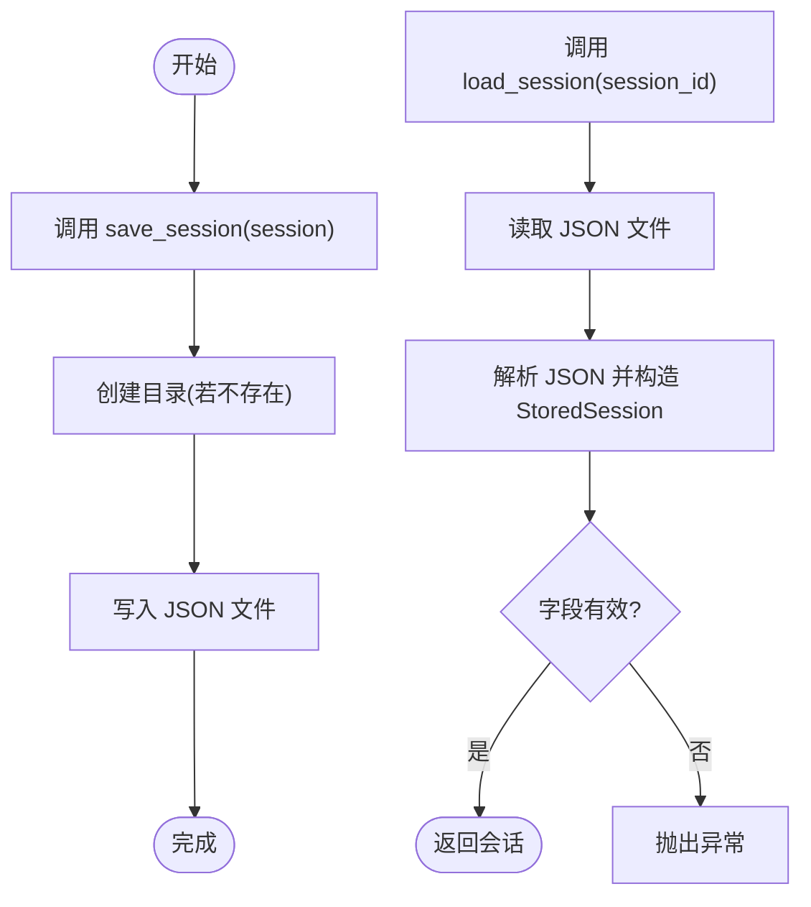
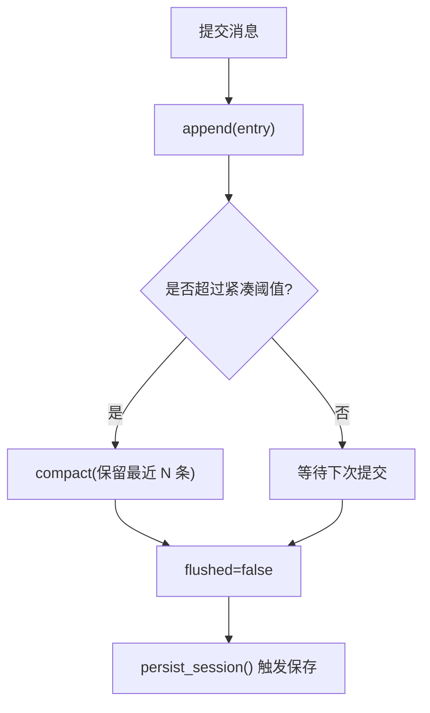
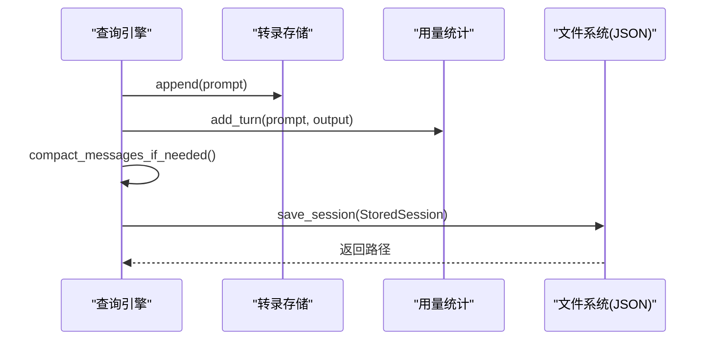
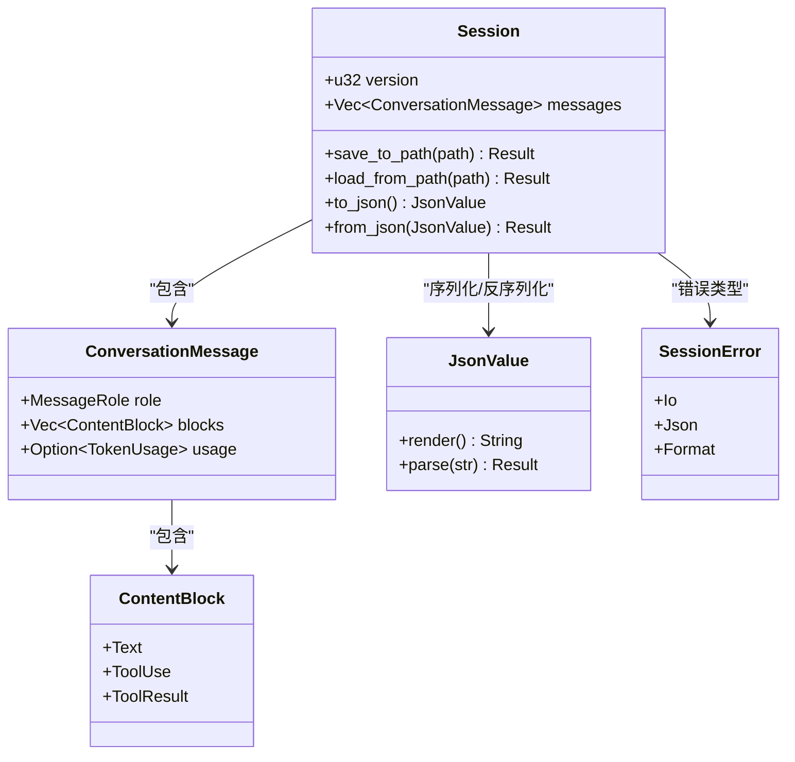
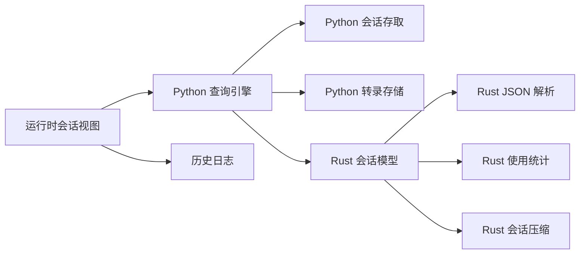

# 数据一致性

<cite>
**本文引用的文件**
- [src/session_store.py](file://src/session_store.py)
- [src/transcript.py](file://src/transcript.py)
- [src/history.py](file://src/history.py)
- [src/query_engine.py](file://src/query_engine.py)
- [src/runtime.py](file://src/runtime.py)
- [src/models.py](file://src/models.py)
- [rust/crates/runtime/src/session.rs](file://rust/crates/runtime/src/session.rs)
- [rust/crates/runtime/src/json.rs](file://rust/crates/runtime/src/json.rs)
- [rust/crates/runtime/src/usage.rs](file://rust/crates/runtime/src/usage.rs)
- [rust/crates/runtime/src/compact.rs](file://rust/crates/runtime/src/compact.rs)
- [rust/crates/runtime/src/lib.rs](file://rust/crates/runtime/src/lib.rs)
- [src/migrations/__init__.py](file://src/migrations/__init__.py)
</cite>

## 目录
1. [引言](#引言)
2. [项目结构](#项目结构)
3. [核心组件](#核心组件)
4. [架构总览](#架构总览)
5. [详细组件分析](#详细组件分析)
6. [依赖分析](#依赖分析)
7. [性能考量](#性能考量)
8. [故障排查指南](#故障排查指南)
9. [结论](#结论)
10. [附录](#附录)

## 引言
本指南聚焦于 CLAW 项目在数据一致性方面的常见问题与排障方法，覆盖会话数据不一致、历史记录丢失、转录文件损坏、并发访问竞争、以及数据迁移与版本升级中的兼容性问题。文档基于仓库中 Python 与 Rust 的会话存储、JSON 解析、使用统计与压缩模块，给出可操作的检查与修复流程，并提供备份与恢复最佳实践。

## 项目结构
CLAW 的数据相关能力由 Python 层的会话存取与转录管理，以及 Rust 层的会话 JSON 序列化、解析与使用统计组成。二者通过统一的会话 ID 和持久化路径协同工作，确保跨语言的一致性。

图表来源
- [src/query_engine.py:1-194](file://src/query_engine.py#L1-L194)
- [src/session_store.py:1-36](file://src/session_store.py#L1-L36)
- [src/transcript.py:1-24](file://src/transcript.py#L1-L24)
- [src/history.py:1-23](file://src/history.py#L1-L23)
- [src/runtime.py:1-193](file://src/runtime.py#L1-L193)
- [src/models.py:1-50](file://src/models.py#L1-L50)
- [rust/crates/runtime/src/session.rs:1-433](file://rust/crates/runtime/src/session.rs#L1-L433)
- [rust/crates/runtime/src/json.rs:1-359](file://rust/crates/runtime/src/json.rs#L1-L359)
- [rust/crates/runtime/src/usage.rs:1-310](file://rust/crates/runtime/src/usage.rs#L1-L310)
- [rust/crates/runtime/src/compact.rs:1-703](file://rust/crates/runtime/src/compact.rs#L1-L703)
- [rust/crates/runtime/src/lib.rs:1-94](file://rust/crates/runtime/src/lib.rs#L1-L94)

章节来源
- [src/query_engine.py:1-194](file://src/query_engine.py#L1-L194)
- [src/session_store.py:1-36](file://src/session_store.py#L1-L36)
- [src/transcript.py:1-24](file://src/transcript.py#L1-L24)
- [src/history.py:1-23](file://src/history.py#L1-L23)
- [src/runtime.py:1-193](file://src/runtime.py#L1-L193)
- [src/models.py:1-50](file://src/models.py#L1-L50)
- [rust/crates/runtime/src/session.rs:1-433](file://rust/crates/runtime/src/session.rs#L1-L433)
- [rust/crates/runtime/src/json.rs:1-359](file://rust/crates/runtime/src/json.rs#L1-L359)
- [rust/crates/runtime/src/usage.rs:1-310](file://rust/crates/runtime/src/usage.rs#L1-L310)
- [rust/crates/runtime/src/compact.rs:1-703](file://rust/crates/runtime/src/compact.rs#L1-L703)
- [rust/crates/runtime/src/lib.rs:1-94](file://rust/crates/runtime/src/lib.rs#L1-L94)

## 核心组件
- 会话存取（Python）：提供会话的保存与加载，以 JSON 文件形式持久化，字段包含会话 ID、消息列表、输入/输出 token 数。
- 转录存储（Python）：维护对话转录条目，支持紧凑化与回放，保证内存占用可控。
- 历史日志（Python）：记录运行期事件，便于审计与排障。
- 查询引擎（Python）：封装会话生命周期，负责提交消息、流式事件、用量统计、持久化。
- 会话模型（Rust）：定义会话结构、消息角色与内容块、版本号；提供 JSON 序列化/反序列化与错误类型。
- JSON 解析器（Rust）：自实现 JSON 渲染与解析，严格校验对象/数组/字符串/数字/布尔/空值。
- 使用统计（Rust）：Token 用量结构与成本估算，支持从会话消息重建累计用量。
- 会话压缩（Rust）：根据阈值自动压缩早期消息为系统摘要，保留近期消息，避免上下文溢出。

章节来源
- [src/session_store.py:19-36](file://src/session_store.py#L19-L36)
- [src/transcript.py:6-24](file://src/transcript.py#L6-L24)
- [src/history.py:6-23](file://src/history.py#L6-L23)
- [src/query_engine.py:35-151](file://src/query_engine.py#L35-L151)
- [rust/crates/runtime/src/session.rs:43-136](file://rust/crates/runtime/src/session.rs#L43-L136)
- [rust/crates/runtime/src/json.rs:36-113](file://rust/crates/runtime/src/json.rs#L36-L113)
- [rust/crates/runtime/src/usage.rs:28-209](file://rust/crates/runtime/src/usage.rs#L28-L209)
- [rust/crates/runtime/src/compact.rs:89-131](file://rust/crates/runtime/src/compact.rs#L89-L131)

## 架构总览
下图展示从用户交互到会话持久化的端到端流程，包括 Python 查询引擎与 Rust 会话模型之间的协作点。

图表来源
- [src/runtime.py:109-152](file://src/runtime.py#L109-L152)
- [src/query_engine.py:61-151](file://src/query_engine.py#L61-L151)
- [src/session_store.py:19-36](file://src/session_store.py#L19-L36)
- [rust/crates/runtime/src/session.rs:88-96](file://rust/crates/runtime/src/session.rs#L88-L96)

## 详细组件分析

### 组件一：会话存取（Python）
- 功能要点
  - 保存：将 Frozen 数据类会话写入目标目录，文件名以会话 ID 命名。
  - 加载：从 JSON 读取并构造会话对象，确保字段完整。
- 关键路径
  - 保存：[save_session:19-24](file://src/session_store.py#L19-L24)
  - 加载：[load_session:27-36](file://src/session_store.py#L27-L36)
- 数据结构复杂度
  - 保存/加载均为 O(n)（n 为消息数量），受 JSON 序列化/反序列化影响。
- 错误处理
  - 文件不存在、JSON 解析失败、字段缺失或类型不符均会导致异常。
- 性能建议
  - 大会话建议配合 Rust 侧的压缩策略，减少 JSON 体积。

图表来源
- [src/session_store.py:19-36](file://src/session_store.py#L19-L36)

章节来源
- [src/session_store.py:19-36](file://src/session_store.py#L19-L36)

### 组件二：转录存储（Python）
- 功能要点
  - 追加条目、标记已刷新、按阈值紧凑化、回放全部条目。
- 关键路径
  - 追加：[append:11-13](file://src/transcript.py#L11-L13)
  - 紧凑化：[compact:15-17](file://src/transcript.py#L15-L17)
  - 回放：[replay:19-20](file://src/transcript.py#L19-L20)
  - 刷新：[flush:22-23](file://src/transcript.py#L22-L23)
- 数据流
  - 查询引擎在每次提交后追加提示与结果，达到阈值触发紧凑化，避免内存膨胀。
- 故障风险
  - 紧凑化阈值过低可能导致历史信息丢失；flush 标记用于控制持久化时机。

图表来源
- [src/transcript.py:11-24](file://src/transcript.py#L11-L24)
- [src/query_engine.py:129-150](file://src/query_engine.py#L129-L150)

章节来源
- [src/transcript.py:6-24](file://src/transcript.py#L6-L24)
- [src/query_engine.py:129-150](file://src/query_engine.py#L129-L150)

### 组件三：历史日志（Python）
- 功能要点
  - 记录标题与详情，生成 Markdown 输出，便于审计。
- 关键路径
  - 添加事件：[add:16-17](file://src/history.py#L16-L17)
  - 生成 Markdown：[as_markdown:19-22](file://src/history.py#L19-L22)
- 使用场景
  - 在运行时会话摘要中汇总路由、执行、用量与持久化路径等关键事件。

章节来源
- [src/history.py:6-23](file://src/history.py#L6-L23)
- [src/runtime.py:39-86](file://src/runtime.py#L39-L86)

### 组件四：查询引擎（Python）
- 功能要点
  - 路由提示词匹配命令/工具，执行并收集结果，流式产出事件，最终持久化会话。
  - 控制最大轮次、预算 token、结构化输出与重试。
- 关键路径
  - 提交消息：[submit_message:61-104](file://src/query_engine.py#L61-L104)
  - 流式提交：[stream_submit_message:106-127](file://src/query_engine.py#L106-L127)
  - 持久化：[persist_session:140-150](file://src/query_engine.py#L140-L150)
  - 从会话恢复：[from_saved_session:49-59](file://src/query_engine.py#L49-L59)
- 一致性保障
  - 通过冻结数据类与不可变消息列表，避免外部修改。
  - 用量统计与转录同步更新，确保持久化前状态一致。

图表来源
- [src/query_engine.py:61-150](file://src/query_engine.py#L61-L150)
- [src/transcript.py:11-24](file://src/transcript.py#L11-L24)
- [src/models.py:29-37](file://src/models.py#L29-L37)
- [src/session_store.py:19-36](file://src/session_store.py#L19-L36)

章节来源
- [src/query_engine.py:35-151](file://src/query_engine.py#L35-L151)
- [src/models.py:29-37](file://src/models.py#L29-L37)

### 组件五：会话模型与 JSON 解析（Rust）
- 功能要点
  - 定义会话结构、消息角色与内容块，支持版本号与用量字段。
  - 自实现 JSON 渲染与解析，严格校验对象/数组/字符串/数字/布尔/空值。
  - 错误类型涵盖 IO、JSON 解析与格式错误。
- 关键路径
  - 保存/加载：[save_to_path/load_from_path:88-96](file://rust/crates/runtime/src/session.rs#L88-L96)
  - JSON 序列化/反序列化：[to_json/from_json:99-135](file://rust/crates/runtime/src/session.rs#L99-L135)
  - JSON 解析器：[parse/render:63-113](file://rust/crates/runtime/src/json.rs#L63-L113)
- 兼容性
  - 版本号字段用于未来演进；缺失或类型不符将触发格式错误。

图表来源
- [rust/crates/runtime/src/session.rs:43-136](file://rust/crates/runtime/src/session.rs#L43-L136)
- [rust/crates/runtime/src/json.rs:36-113](file://rust/crates/runtime/src/json.rs#L36-L113)

章节来源
- [rust/crates/runtime/src/session.rs:43-136](file://rust/crates/runtime/src/session.rs#L43-L136)
- [rust/crates/runtime/src/json.rs:36-113](file://rust/crates/runtime/src/json.rs#L36-L113)

### 组件六：使用统计（Rust）
- 功能要点
  - TokenUsage 结构与 UsageTracker，支持从会话消息重建累计用量。
  - 成本估算与 USD 格式化。
- 关键路径
  - 用量重建：[from_session:176-184](file://rust/crates/runtime/src/usage.rs#L176-L184)
  - 累计记录：[record:186-193](file://rust/crates/runtime/src/usage.rs#L186-L193)
  - 成本估算：[estimate_cost_usd:89-107](file://rust/crates/runtime/src/usage.rs#L89-L107)

章节来源
- [rust/crates/runtime/src/usage.rs:28-209](file://rust/crates/runtime/src/usage.rs#L28-L209)

### 组件七：会话压缩（Rust）
- 功能要点
  - 根据阈值判断是否压缩，将早期消息合并为系统摘要，保留最近消息。
  - 支持多次压缩时合并先前摘要。
- 关键路径
  - 压缩决策：[should_compact:37-47](file://rust/crates/runtime/src/compact.rs#L37-L47)
  - 执行压缩：[compact_session:89-131](file://rust/crates/runtime/src/compact.rs#L89-L131)
  - 估计令牌数：[estimate_session_tokens:32-34](file://rust/crates/runtime/src/compact.rs#L32-L34)

章节来源
- [rust/crates/runtime/src/compact.rs:32-131](file://rust/crates/runtime/src/compact.rs#L32-L131)

## 依赖分析
- Python 查询引擎依赖会话存取与转录存储，同时通过 Rust 会话模型进行文件级持久化。
- Rust 会话模型依赖 JSON 解析器与使用统计模块，提供稳定的序列化/反序列化与用量计算。
- 运行时会话视图聚合历史日志与查询引擎结果，形成可审计的 Markdown 摘要。

图表来源
- [src/query_engine.py:10-12](file://src/query_engine.py#L10-L12)
- [rust/crates/runtime/src/lib.rs:17-85](file://rust/crates/runtime/src/lib.rs#L17-L85)

章节来源
- [src/query_engine.py:10-12](file://src/query_engine.py#L10-L12)
- [rust/crates/runtime/src/lib.rs:17-85](file://rust/crates/runtime/src/lib.rs#L17-L85)

## 性能考量
- 会话体积控制
  - Python 侧通过紧凑化阈值限制消息数量；Rust 侧通过压缩算法减少早期消息，保留近期消息。
- JSON 序列化开销
  - 大会话建议启用压缩，降低磁盘与网络传输压力。
- 用量统计
  - 使用统计在会话层面重建，避免重复计算；注意大消息对估算的影响。

## 故障排查指南

### 会话数据不一致
- 症状
  - 加载的会话字段缺失或类型不符；转录与用量不匹配。
- 排查步骤
  - 检查会话 JSON 是否包含必需字段（版本号、消息数组）。
  - 验证消息角色与内容块类型是否符合预期。
  - 对比转录条目与用量统计，确认提交顺序与阈值设置。
- 修复建议
  - 重新提交消息并持久化；必要时手动补充缺失字段（需遵循版本语义）。
  - 调整紧凑阈值，避免历史信息丢失。

章节来源
- [rust/crates/runtime/src/session.rs:117-135](file://rust/crates/runtime/src/session.rs#L117-L135)
- [src/transcript.py:15-20](file://src/transcript.py#L15-L20)
- [src/models.py:29-37](file://src/models.py#L29-L37)

### 历史记录丢失
- 症状
  - 运行时摘要中缺少关键事件（路由、执行、用量）。
- 排查步骤
  - 检查历史日志是否正常添加事件。
  - 确认运行时会话摘要生成逻辑是否被调用。
- 修复建议
  - 在关键节点显式调用历史记录添加；确保持久化前未被清理。

章节来源
- [src/history.py:16-22](file://src/history.py#L16-L22)
- [src/runtime.py:39-86](file://src/runtime.py#L39-L86)

### 转录文件损坏
- 症状
  - 无法回放或紧凑化失败；转录大小异常。
- 排查步骤
  - 检查转录存储的 flush 标记与紧凑阈值。
  - 确认持久化时机是否正确触发。
- 修复建议
  - 重新提交消息重建转录；调整阈值或禁用紧凑化进行对比测试。

章节来源
- [src/transcript.py:11-24](file://src/transcript.py#L11-L24)
- [src/query_engine.py:129-150](file://src/query_engine.py#L129-L150)

### 并发访问导致的数据竞争
- 症状
  - 会话文件写入冲突、JSON 内容被截断或部分写入。
- 排查步骤
  - 检查多进程/线程是否同时写入同一会话文件。
  - 确认文件锁或原子写入策略是否生效。
- 修复建议
  - 使用原子写入（先写临时文件再重命名）避免部分写入。
  - 为每个会话分配独立文件名，避免共享写入。

章节来源
- [src/session_store.py:19-24](file://src/session_store.py#L19-L24)

### 数据完整性检查与修复
- 检查清单
  - JSON 字段校验：版本号、消息数组、角色与内容块类型。
  - 用量一致性：从会话重建用量并与提交记录对比。
  - 转录完整性：回放所有条目，确认无重复或遗漏。
- 修复流程
  - 重新提交消息并持久化；必要时手动修正 JSON。
  - 使用 Rust 侧 JSON 解析器验证格式，定位错误位置。

章节来源
- [rust/crates/runtime/src/session.rs:117-135](file://rust/crates/runtime/src/session.rs#L117-L135)
- [rust/crates/runtime/src/json.rs:63-113](file://rust/crates/runtime/src/json.rs#L63-L113)
- [rust/crates/runtime/src/usage.rs:176-184](file://rust/crates/runtime/src/usage.rs#L176-L184)

### 会话存储与持久化故障排除
- 步骤
  - 确认会话 ID 与文件名一致。
  - 检查目录权限与磁盘空间。
  - 验证持久化路径是否正确返回。
- 建议
  - 将会话目录置于稳定挂载点；定期巡检文件系统。

章节来源
- [src/session_store.py:16-24](file://src/session_store.py#L16-L24)
- [src/query_engine.py:140-150](file://src/query_engine.py#L140-L150)

### 备份与恢复最佳实践
- 备份
  - 定期复制会话 JSON 文件与转录目录。
  - 备份前确保会话已 flush，避免中间态。
- 恢复
  - 使用 from_saved_session 从已知会话 ID 恢复。
  - 恢复后验证历史日志与用量统计一致性。

章节来源
- [src/query_engine.py:49-59](file://src/query_engine.py#L49-L59)
- [src/transcript.py:22-24](file://src/transcript.py#L22-L24)

### 数据迁移与版本升级兼容性
- 现象
  - 新旧版本 JSON 字段不兼容；版本号缺失或超出范围。
- 处理
  - 读取 JSON 时检查 version 字段；对不兼容字段进行映射或降级。
  - 通过迁移快照包了解归档模块与样例文件，指导字段迁移。

章节来源
- [rust/crates/runtime/src/session.rs:121-127](file://rust/crates/runtime/src/session.rs#L121-L127)
- [src/migrations/__init__.py:8-16](file://src/migrations/__init__.py#L8-L16)

## 结论
通过严格的会话 JSON 结构校验、转录与用量的同步更新、以及 Rust 侧的压缩与解析能力，CLAW 在多语言环境下实现了较为稳健的数据一致性。建议在生产环境中采用原子写入、定期备份与版本化字段策略，并结合本指南的排障流程快速定位与修复问题。

## 附录
- 关键路径速查
  - 保存会话：[save_session:19-24](file://src/session_store.py#L19-L24)
  - 加载会话：[load_session:27-36](file://src/session_store.py#L27-L36)
  - 提交消息：[submit_message:61-104](file://src/query_engine.py#L61-L104)
  - 流式事件：[stream_submit_message:106-127](file://src/query_engine.py#L106-L127)
  - 持久化会话：[persist_session:140-150](file://src/query_engine.py#L140-L150)
  - 会话保存/加载（Rust）：[save_to_path/load_from_path:88-96](file://rust/crates/runtime/src/session.rs#L88-L96)
  - JSON 解析/渲染：[parse/render:63-113](file://rust/crates/runtime/src/json.rs#L63-L113)
  - 用量重建：[from_session:176-184](file://rust/crates/runtime/src/usage.rs#L176-L184)
  - 会话压缩：[compact_session:89-131](file://rust/crates/runtime/src/compact.rs#L89-L131)