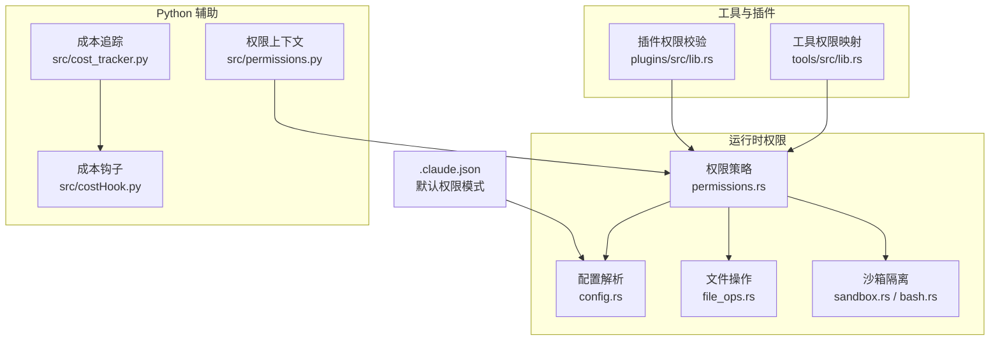
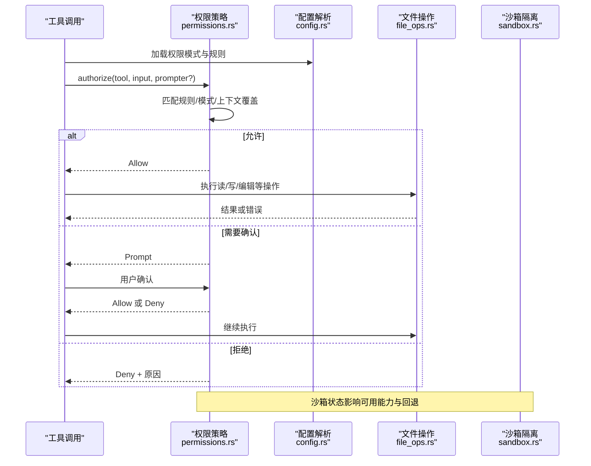
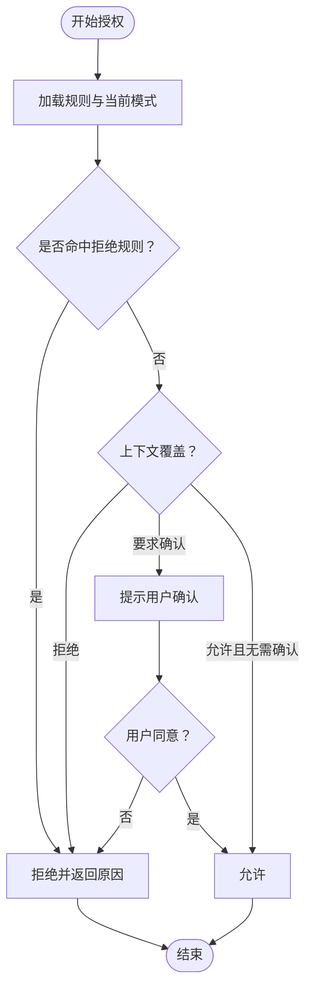
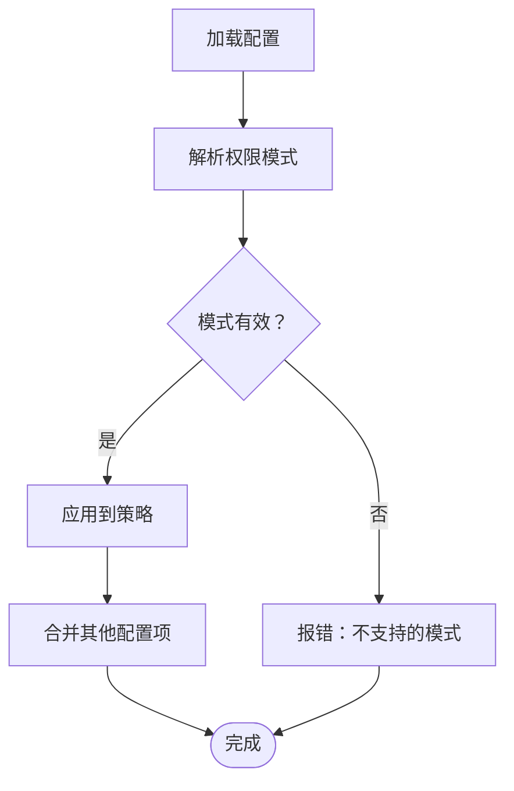
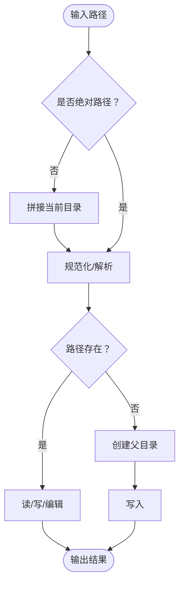
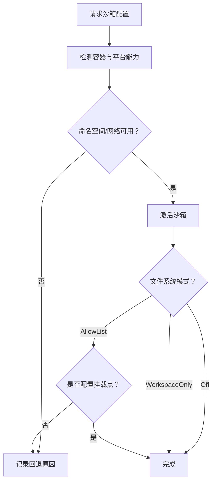
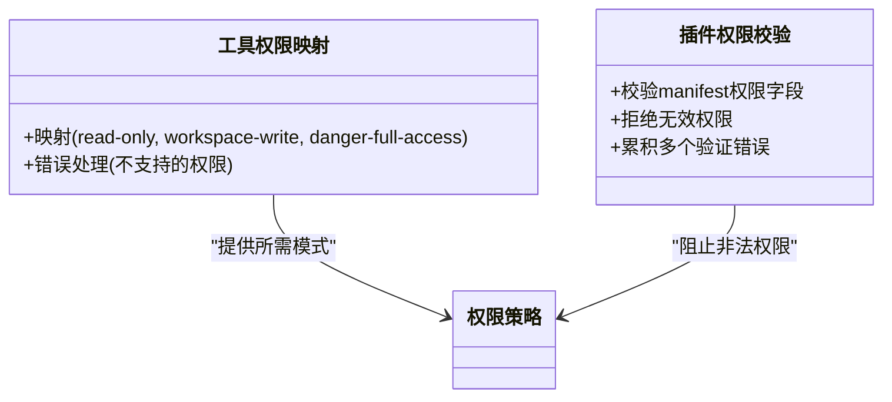
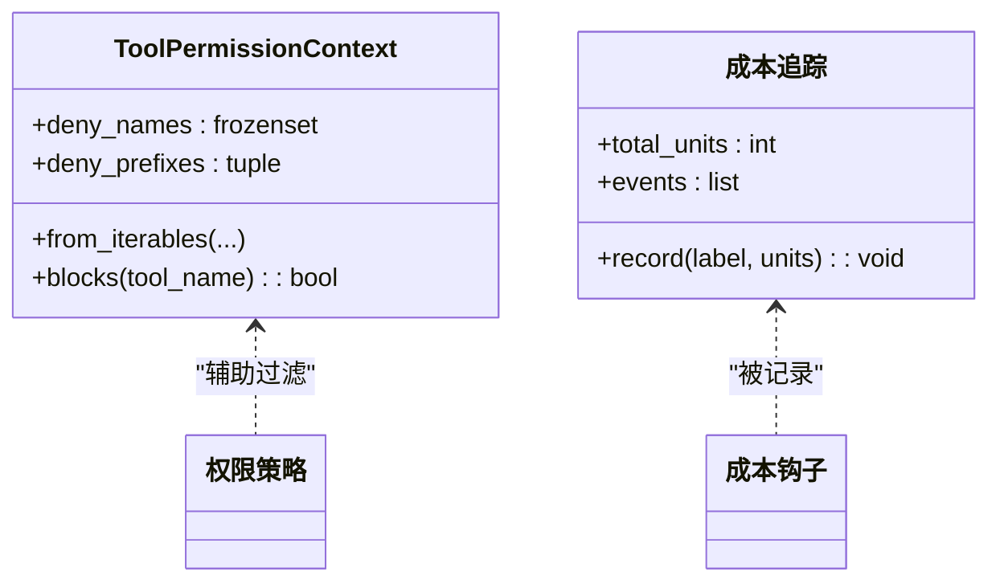
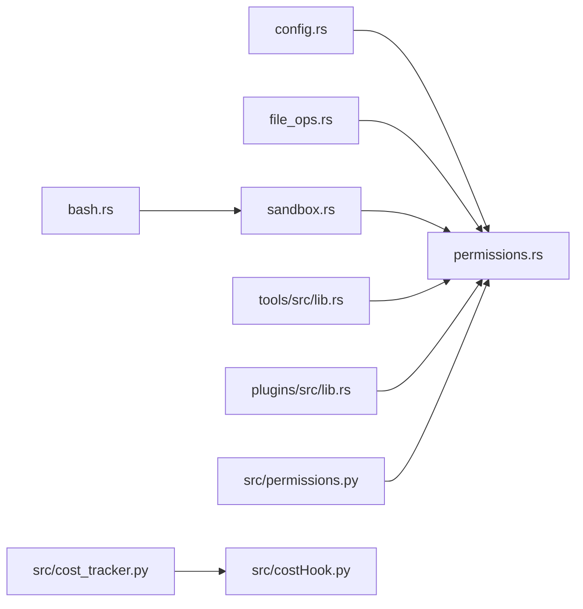

# 权限错误

<cite>
**本文引用的文件**
- [src/permissions.py](file://src/permissions.py)
- [src/cost_tracker.py](file://src/cost_tracker.py)
- [src/costHook.py](file://src/costHook.py)
- [rust/crates/runtime/src/permissions.rs](file://rust/crates/runtime/src/permissions.rs)
- [rust/crates/runtime/src/config.rs](file://rust/crates/runtime/src/config.rs)
- [rust/crates/runtime/src/file_ops.rs](file://rust/crates/runtime/src/file_ops.rs)
- [rust/crates/runtime/src/sandbox.rs](file://rust/crates/runtime/src/sandbox.rs)
- [rust/crates/runtime/src/bash.rs](file://rust/crates/runtime/src/bash.rs)
- [rust/crates/tools/src/lib.rs](file://rust/crates/tools/src/lib.rs)
- [rust/crates/plugins/src/lib.rs](file://rust/crates/plugins/src/lib.rs)
- [.claude.json](file://.claude.json)
</cite>

## 目录
1. [简介](#简介)
2. [项目结构](#项目结构)
3. [核心组件](#核心组件)
4. [架构总览](#架构总览)
5. [详细组件分析](#详细组件分析)
6. [依赖分析](#依赖分析)
7. [性能考量](#性能考量)
8. [故障排查指南](#故障排查指南)
9. [结论](#结论)
10. [附录](#附录)

## 简介
本指南聚焦于 CLAW 项目中“权限错误”的排查与修复，覆盖以下方面：
- 权限验证失败的常见场景：文件访问权限、目录权限、执行权限、网络权限
- 成本追踪相关的权限问题与解决方案
- 不同操作系统（尤其是 Linux）下的权限设置差异与注意事项
- 权限继承与访问控制列表（ACL）在沙箱中的配置方法
- 如何诊断与解决因权限不足导致的功能异常

本指南以代码为依据，结合实际实现细节，帮助开发者快速定位并解决问题。

## 项目结构
围绕权限与安全的关键模块分布如下：
- 运行时权限策略与规则解析：rust/crates/runtime/src/permissions.rs
- 配置加载与权限模式解析：rust/crates/runtime/src/config.rs
- 文件系统操作与路径规范化：rust/crates/runtime/src/file_ops.rs
- 沙箱隔离与容器环境检测：rust/crates/runtime/src/sandbox.rs、rust/crates/runtime/src/bash.rs
- 工具权限模式映射与插件权限校验：rust/crates/tools/src/lib.rs、rust/crates/plugins/src/lib.rs
- Python 侧权限上下文与成本追踪：src/permissions.py、src/cost_tracker.py、src/costHook.py
- 用户默认权限模式配置：.claude.json

**图表来源**
- [rust/crates/runtime/src/permissions.rs:1-676](file://rust/crates/runtime/src/permissions.rs#L1-L676)
- [rust/crates/runtime/src/config.rs:1-1389](file://rust/crates/runtime/src/config.rs#L1-L1389)
- [rust/crates/runtime/src/file_ops.rs:1-551](file://rust/crates/runtime/src/file_ops.rs#L1-L551)
- [rust/crates/runtime/src/sandbox.rs:1-364](file://rust/crates/runtime/src/sandbox.rs#L1-L364)
- [rust/crates/runtime/src/bash.rs:167-207](file://rust/crates/runtime/src/bash.rs#L167-L207)
- [rust/crates/tools/src/lib.rs:281-290](file://rust/crates/tools/src/lib.rs#L281-L290)
- [rust/crates/plugins/src/lib.rs:2311-2336](file://rust/crates/plugins/src/lib.rs#L2311-L2336)
- [src/permissions.py:1-21](file://src/permissions.py#L1-L21)
- [src/cost_tracker.py:1-14](file://src/cost_tracker.py#L1-L14)
- [src/costHook.py:1-9](file://src/costHook.py#L1-L9)
- [.claude.json:1-5](file://.claude.json#L1-L5)

**章节来源**
- [rust/crates/runtime/src/permissions.rs:1-676](file://rust/crates/runtime/src/permissions.rs#L1-L676)
- [rust/crates/runtime/src/config.rs:1-1389](file://rust/crates/runtime/src/config.rs#L1-L1389)
- [rust/crates/runtime/src/file_ops.rs:1-551](file://rust/crates/runtime/src/file_ops.rs#L1-L551)
- [rust/crates/runtime/src/sandbox.rs:1-364](file://rust/crates/runtime/src/sandbox.rs#L1-L364)
- [rust/crates/runtime/src/bash.rs:167-207](file://rust/crates/runtime/src/bash.rs#L167-L207)
- [rust/crates/tools/src/lib.rs:281-290](file://rust/crates/tools/src/lib.rs#L281-L290)
- [rust/crates/plugins/src/lib.rs:2311-2336](file://rust/crates/plugins/src/lib.rs#L2311-L2336)
- [src/permissions.py:1-21](file://src/permissions.py#L1-L21)
- [src/cost_tracker.py:1-14](file://src/cost_tracker.py#L1-L14)
- [src/costHook.py:1-9](file://src/costHook.py#L1-L9)
- [.claude.json:1-5](file://.claude.json#L1-L5)

## 核心组件
- 权限模式与策略
  - 权限模式：只读、工作区写入、危险全权、提示、允许
  - 规则匹配：允许/拒绝/询问规则，支持通配与前缀匹配
  - 上下文覆盖：钩子可强制允许/拒绝/要求确认
- 配置与默认值
  - 默认权限模式可通过用户配置文件指定
  - 支持从 JSON 合并多源配置
- 文件系统与网络隔离
  - 路径规范化与安全读写
  - 沙箱隔离：命名空间、网络、文件系统白名单
- 成本追踪
  - 记录事件与单位，便于审计与计费

**章节来源**
- [rust/crates/runtime/src/permissions.rs:7-14](file://rust/crates/runtime/src/permissions.rs#L7-L14)
- [rust/crates/runtime/src/permissions.rs:91-153](file://rust/crates/runtime/src/permissions.rs#L91-L153)
- [rust/crates/runtime/src/permissions.rs:327-383](file://rust/crates/runtime/src/permissions.rs#L327-L383)
- [rust/crates/runtime/src/config.rs:18-23](file://rust/crates/runtime/src/config.rs#L18-L23)
- [rust/crates/runtime/src/config.rs:687-719](file://rust/crates/runtime/src/config.rs#L687-L719)
- [rust/crates/runtime/src/file_ops.rs:132-178](file://rust/crates/runtime/src/file_ops.rs#L132-L178)
- [rust/crates/runtime/src/sandbox.rs:7-68](file://rust/crates/runtime/src/sandbox.rs#L7-L68)
- [src/cost_tracker.py:6-14](file://src/cost_tracker.py#L6-L14)

## 架构总览
权限流程序列图（从工具调用到最终授权）：

**图表来源**
- [rust/crates/runtime/src/permissions.rs:156-284](file://rust/crates/runtime/src/permissions.rs#L156-L284)
- [rust/crates/runtime/src/config.rs:647-719](file://rust/crates/runtime/src/config.rs#L647-L719)
- [rust/crates/runtime/src/file_ops.rs:132-178](file://rust/crates/runtime/src/file_ops.rs#L132-L178)
- [rust/crates/runtime/src/sandbox.rs:161-208](file://rust/crates/runtime/src/sandbox.rs#L161-L208)

## 详细组件分析

### 权限策略与规则匹配
- 权限模式等级：只读 < 工作区写入 < 危险全权；当请求模式高于当前模式时，可能触发确认或直接拒绝
- 规则类型：
  - 允许规则：满足条件即放行
  - 拒绝规则：命中即拒绝
  - 询问规则：即使当前模式允许，仍需确认
- 规则语法：工具名(参数匹配表达式)，支持任意(*)、精确匹配、前缀匹配，转义括号与反斜杠
- 上下文覆盖：钩子可强制拒绝、要求确认、或允许但受询问规则约束

**图表来源**
- [rust/crates/runtime/src/permissions.rs:165-284](file://rust/crates/runtime/src/permissions.rs#L165-L284)
- [rust/crates/runtime/src/permissions.rs:341-383](file://rust/crates/runtime/src/permissions.rs#L341-L383)
- [rust/crates/runtime/src/permissions.rs:439-461](file://rust/crates/runtime/src/permissions.rs#L439-L461)

**章节来源**
- [rust/crates/runtime/src/permissions.rs:7-14](file://rust/crates/runtime/src/permissions.rs#L7-L14)
- [rust/crates/runtime/src/permissions.rs:91-153](file://rust/crates/runtime/src/permissions.rs#L91-L153)
- [rust/crates/runtime/src/permissions.rs:327-383](file://rust/crates/runtime/src/permissions.rs#L327-L383)
- [rust/crates/runtime/src/permissions.rs:439-461](file://rust/crates/runtime/src/permissions.rs#L439-L461)

### 配置与默认权限模式
- 默认权限模式来源：用户配置文件中的 permissions.defaultMode 字段
- 支持模式标签映射：read-only、workspace-write、danger-full-access 等别名
- 配置合并：从用户、项目、本地等多源合并，生成最终策略

**图表来源**
- [rust/crates/runtime/src/config.rs:687-719](file://rust/crates/runtime/src/config.rs#L687-L719)
- [rust/crates/runtime/src/config.rs:647-655](file://rust/crates/runtime/src/config.rs#L647-L655)
- [.claude.json:1-5](file://.claude.json#L1-L5)

**章节来源**
- [rust/crates/runtime/src/config.rs:687-719](file://rust/crates/runtime/src/config.rs#L687-L719)
- [rust/crates/runtime/src/config.rs:647-655](file://rust/crates/runtime/src/config.rs#L647-L655)
- [.claude.json:1-5](file://.claude.json#L1-L5)

### 文件系统与路径规范化
- 安全读取：规范化路径后读取，支持偏移与限制行数
- 安全写入：规范化路径，必要时创建父目录，记录原始内容用于补丁
- 编辑：替换旧字符串为新字符串，支持全部替换与首处替换
- 路径归一化：相对路径转绝对路径并规范化，缺失路径尝试保留文件名

**图表来源**
- [rust/crates/runtime/src/file_ops.rs:448-478](file://rust/crates/runtime/src/file_ops.rs#L448-L478)
- [rust/crates/runtime/src/file_ops.rs:132-178](file://rust/crates/runtime/src/file_ops.rs#L132-L178)

**章节来源**
- [rust/crates/runtime/src/file_ops.rs:132-178](file://rust/crates/runtime/src/file_ops.rs#L132-L178)
- [rust/crates/runtime/src/file_ops.rs:448-478](file://rust/crates/runtime/src/file_ops.rs#L448-L478)

### 沙箱隔离与容器环境
- 沙箱状态：启用、命名空间隔离、网络隔离、文件系统模式、挂载点
- 可用性检测：Linux 且存在 unshare 命令时才启用命名空间/网络隔离
- 文件系统白名单：需要显式配置允许挂载点，否则回退
- Linux 启动器：使用 unshare 构建带隔离的命令，注入 HOME/TMPDIR 等环境变量

**图表来源**
- [rust/crates/runtime/src/sandbox.rs:161-208](file://rust/crates/runtime/src/sandbox.rs#L161-L208)
- [rust/crates/runtime/src/sandbox.rs:211-262](file://rust/crates/runtime/src/sandbox.rs#L211-L262)
- [rust/crates/runtime/src/bash.rs:167-207](file://rust/crates/runtime/src/bash.rs#L167-L207)

**章节来源**
- [rust/crates/runtime/src/sandbox.rs:161-208](file://rust/crates/runtime/src/sandbox.rs#L161-L208)
- [rust/crates/runtime/src/sandbox.rs:211-262](file://rust/crates/runtime/src/sandbox.rs#L211-L262)
- [rust/crates/runtime/src/bash.rs:167-207](file://rust/crates/runtime/src/bash.rs#L167-L207)

### 工具与插件权限
- 工具权限映射：插件声明的权限字符串映射到运行时权限模式
- 插件权限校验：无效权限（如 admin）将被拒绝并报告多个验证错误

**图表来源**
- [rust/crates/tools/src/lib.rs:281-290](file://rust/crates/tools/src/lib.rs#L281-L290)
- [rust/crates/plugins/src/lib.rs:2311-2336](file://rust/crates/plugins/src/lib.rs#L2311-L2336)
- [rust/crates/plugins/src/lib.rs:2382-2418](file://rust/crates/plugins/src/lib.rs#L2382-L2418)

**章节来源**
- [rust/crates/tools/src/lib.rs:281-290](file://rust/crates/tools/src/lib.rs#L281-L290)
- [rust/crates/plugins/src/lib.rs:2311-2336](file://rust/crates/plugins/src/lib.rs#L2311-L2336)
- [rust/crates/plugins/src/lib.rs:2382-2418](file://rust/crates/plugins/src/lib.rs#L2382-L2418)

### Python 侧权限上下文与成本追踪
- ToolPermissionContext：用于工具名称与前缀的拒绝集合，支持大小写不敏感匹配
- 成本追踪：记录事件与单位，配合钩子进行审计

**图表来源**
- [src/permissions.py:6-21](file://src/permissions.py#L6-L21)
- [src/cost_tracker.py:6-14](file://src/cost_tracker.py#L6-L14)
- [src/costHook.py:6-9](file://src/costHook.py#L6-L9)

**章节来源**
- [src/permissions.py:6-21](file://src/permissions.py#L6-L21)
- [src/cost_tracker.py:6-14](file://src/cost_tracker.py#L6-L14)
- [src/costHook.py:6-9](file://src/costHook.py#L6-L9)

## 依赖分析
- 权限策略依赖配置解析与规则定义
- 文件操作依赖路径规范化与沙箱状态
- 沙箱隔离依赖平台能力检测与容器环境识别
- 工具与插件权限映射为策略提供所需模式与合法性校验

**图表来源**
- [rust/crates/runtime/src/config.rs:647-719](file://rust/crates/runtime/src/config.rs#L647-L719)
- [rust/crates/runtime/src/permissions.rs:156-284](file://rust/crates/runtime/src/permissions.rs#L156-L284)
- [rust/crates/runtime/src/file_ops.rs:132-178](file://rust/crates/runtime/src/file_ops.rs#L132-L178)
- [rust/crates/runtime/src/sandbox.rs:161-208](file://rust/crates/runtime/src/sandbox.rs#L161-L208)
- [rust/crates/runtime/src/bash.rs:167-207](file://rust/crates/runtime/src/bash.rs#L167-L207)
- [rust/crates/tools/src/lib.rs:281-290](file://rust/crates/tools/src/lib.rs#L281-L290)
- [rust/crates/plugins/src/lib.rs:2311-2336](file://rust/crates/plugins/src/lib.rs#L2311-L2336)
- [src/permissions.py:6-21](file://src/permissions.py#L6-L21)
- [src/cost_tracker.py:6-14](file://src/cost_tracker.py#L6-L14)
- [src/costHook.py:6-9](file://src/costHook.py#L6-L9)

**章节来源**
- [rust/crates/runtime/src/config.rs:647-719](file://rust/crates/runtime/src/config.rs#L647-L719)
- [rust/crates/runtime/src/permissions.rs:156-284](file://rust/crates/runtime/src/permissions.rs#L156-L284)
- [rust/crates/runtime/src/file_ops.rs:132-178](file://rust/crates/runtime/src/file_ops.rs#L132-L178)
- [rust/crates/runtime/src/sandbox.rs:161-208](file://rust/crates/runtime/src/sandbox.rs#L161-L208)
- [rust/crates/runtime/src/bash.rs:167-207](file://rust/crates/runtime/src/bash.rs#L167-L207)
- [rust/crates/tools/src/lib.rs:281-290](file://rust/crates/tools/src/lib.rs#L281-L290)
- [rust/crates/plugins/src/lib.rs:2311-2336](file://rust/crates/plugins/src/lib.rs#L2311-L2336)
- [src/permissions.py:6-21](file://src/permissions.py#L6-L21)
- [src/cost_tracker.py:6-14](file://src/cost_tracker.py#L6-L14)
- [src/costHook.py:6-9](file://src/costHook.py#L6-L9)

## 性能考量
- 规则匹配：线性扫描规则列表，建议合理组织 allow/deny/ask 规则顺序，优先命中高频规则
- 文件搜索：glob 与正则匹配可能产生大量 IO，建议限制范围与数量，避免在大仓库上进行全量扫描
- 沙箱启动：unshare 启动开销较高，仅在需要时启用，并尽量减少挂载点数量
- 成本追踪：记录事件与累计单位，注意避免频繁小粒度记录带来的开销

[本节为通用指导，无需特定文件来源]

## 故障排查指南

### 一、权限验证失败的常见情况与排查步骤
- 模式不足
  - 现象：请求高权限工具被拒绝
  - 排查：确认当前权限模式与工具所需模式关系；查看规则是否命中拒绝或询问
  - 修复：提升权限模式或调整规则；必要时通过确认流程放行
  - 参考
    - [rust/crates/runtime/src/permissions.rs:156-284](file://rust/crates/runtime/src/permissions.rs#L156-L284)
    - [rust/crates/runtime/src/config.rs:687-719](file://rust/crates/runtime/src/config.rs#L687-L719)
- 规则误判
  - 现象：允许/拒绝/询问规则未按预期生效
  - 排查：核对规则语法（工具名+参数匹配）、转义字符、通配符与前缀
  - 修复：修正规则表达式；确保输入 JSON 中包含 command/path/url 等键以便提取
  - 参考
    - [rust/crates/runtime/src/permissions.rs:341-383](file://rust/crates/runtime/src/permissions.rs#L341-L383)
    - [rust/crates/runtime/src/permissions.rs:439-461](file://rust/crates/runtime/src/permissions.rs#L439-L461)
- 上下文覆盖
  - 现象：钩子强制拒绝或要求确认
  - 排查：检查钩子返回的覆盖决策与原因
  - 修复：调整钩子逻辑或在策略中明确 ask 规则
  - 参考
    - [rust/crates/runtime/src/permissions.rs:188-234](file://rust/crates/runtime/src/permissions.rs#L188-L234)

### 二、文件访问权限与目录权限问题
- 路径不存在或不可达
  - 现象：读写失败或权限不足
  - 排查：确认路径规范化后的绝对路径；检查父目录是否存在与可写
  - 修复：创建缺失父目录；调整文件/目录权限
  - 参考
    - [rust/crates/runtime/src/file_ops.rs:448-478](file://rust/crates/runtime/src/file_ops.rs#L448-L478)
    - [rust/crates/runtime/src/file_ops.rs:158-178](file://rust/crates/runtime/src/file_ops.rs#L158-L178)
- 文件系统白名单限制
  - 现象：沙箱启用但无法访问某些路径
  - 排查：确认文件系统模式与允许挂载点配置
  - 修复：添加允许挂载点或切换到工作区模式
  - 参考
    - [rust/crates/runtime/src/sandbox.rs:161-208](file://rust/crates/runtime/src/sandbox.rs#L161-L208)

### 三、执行权限与网络权限问题
- Linux 平台能力缺失
  - 现象：命名空间/网络隔离不可用
  - 排查：确认系统为 Linux 且存在 unshare 命令
  - 修复：安装 unshare 或在非 Linux 环境禁用相关隔离
  - 参考
    - [rust/crates/runtime/src/sandbox.rs:161-177](file://rust/crates/runtime/src/sandbox.rs#L161-L177)
- Bash 命令执行受限
  - 现象：命令在沙箱中无法执行或被拒绝
  - 排查：检查沙箱状态与隔离级别；确认 HOME/TMPDIR 环境变量
  - 修复：调整沙箱配置或在策略中放宽规则
  - 参考
    - [rust/crates/runtime/src/bash.rs:167-207](file://rust/crates/runtime/src/bash.rs#L167-L207)
    - [rust/crates/runtime/src/sandbox.rs:211-262](file://rust/crates/runtime/src/sandbox.rs#L211-L262)

### 四、成本追踪相关的权限问题
- 成本记录未生效
  - 现象：成本统计为空或不准确
  - 排查：确认成本钩子是否正确调用；检查事件标签与单位
  - 修复：确保钩子链路完整；避免重复或遗漏记录
  - 参考
    - [src/costHook.py:6-9](file://src/costHook.py#L6-L9)
    - [src/cost_tracker.py:6-14](file://src/cost_tracker.py#L6-L14)

### 五、不同操作系统下的权限设置差异
- Linux
  - 使用 unshare 实现命名空间与网络隔离
  - 文件系统白名单需显式配置挂载点
- 非 Linux
  - 沙箱隔离不可用，自动回退
  - 文件系统访问受宿主系统权限限制

**章节来源**
- [rust/crates/runtime/src/sandbox.rs:161-208](file://rust/crates/runtime/src/sandbox.rs#L161-L208)
- [rust/crates/runtime/src/bash.rs:167-207](file://rust/crates/runtime/src/bash.rs#L167-L207)
- [src/costHook.py:6-9](file://src/costHook.py#L6-L9)
- [src/cost_tracker.py:6-14](file://src/cost_tracker.py#L6-L14)

### 六、权限继承与访问控制列表（ACL）
- 文件系统 ACL
  - 在 Linux 上可结合文件系统 ACL 控制细粒度权限
  - 与沙箱 allow-list 模式配合，仅暴露必要路径
- 规则继承
  - 将常用规则集中管理，通过配置合并机制在用户/项目/本地层叠加
- 最佳实践
  - 最小权限原则：仅授予工具所需的最小权限
  - 明确拒绝优先：对高风险操作使用拒绝规则
  - 询问规则兜底：对潜在危险操作强制人工确认

[本节为通用指导，无需特定文件来源]

### 七、诊断与修复流程（实操清单）
- 快速自检
  - 当前权限模式与工具所需模式是否匹配？
  - 是否命中拒绝/询问规则？
  - 是否存在上下文覆盖（钩子）？
  - 沙箱是否启用且可用？
  - 路径是否存在且可读写？
- 逐步排查
  - 修改规则表达式并重试
  - 调整默认权限模式配置
  - 在非 Linux 环境禁用隔离功能
  - 为路径添加允许挂载点或调整文件权限
- 验证修复
  - 重新执行工具调用，观察授权结果
  - 检查成本追踪事件是否正确记录

**章节来源**
- [rust/crates/runtime/src/permissions.rs:156-284](file://rust/crates/runtime/src/permissions.rs#L156-L284)
- [rust/crates/runtime/src/config.rs:687-719](file://rust/crates/runtime/src/config.rs#L687-L719)
- [rust/crates/runtime/src/sandbox.rs:161-208](file://rust/crates/runtime/src/sandbox.rs#L161-L208)
- [rust/crates/runtime/src/file_ops.rs:132-178](file://rust/crates/runtime/src/file_ops.rs#L132-L178)

## 结论
权限错误的根因通常来自“模式不足、规则误判、上下文覆盖、沙箱不可用、路径不可达”等几个维度。通过理解权限策略、规则匹配、配置来源与沙箱隔离机制，可以系统性地定位并修复问题。建议在生产环境中遵循最小权限原则，结合规则与沙箱策略，确保安全与可用性的平衡。

[本节为总结，无需特定文件来源]

## 附录
- 关键配置项参考
  - 默认权限模式：permissions.defaultMode
  - 权限规则：permissions.allow/deny/ask
  - 沙箱配置：sandbox.enabled/namespaceRestrictions/networkIsolation/filesystemMode/allowedMounts
- 常用工具权限映射
  - read-only → 只读
  - workspace-write → 工作区写入
  - danger-full-access → 危险全权

**章节来源**
- [.claude.json:1-5](file://.claude.json#L1-L5)
- [rust/crates/runtime/src/config.rs:647-719](file://rust/crates/runtime/src/config.rs#L647-L719)
- [rust/crates/tools/src/lib.rs:281-290](file://rust/crates/tools/src/lib.rs#L281-L290)