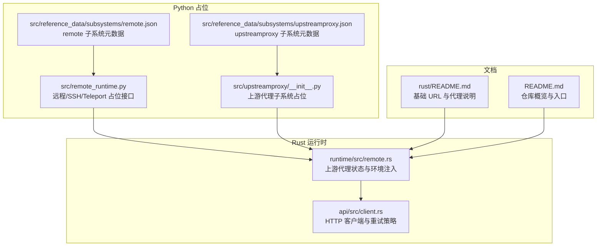
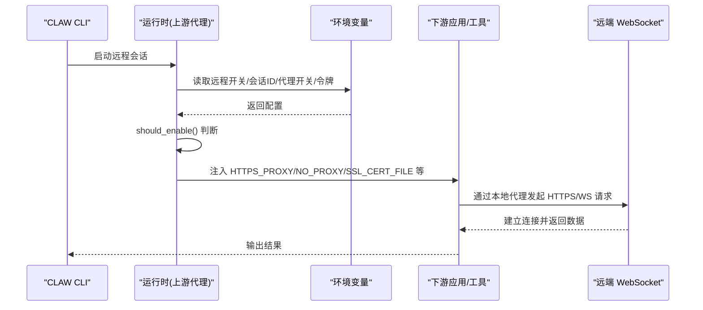
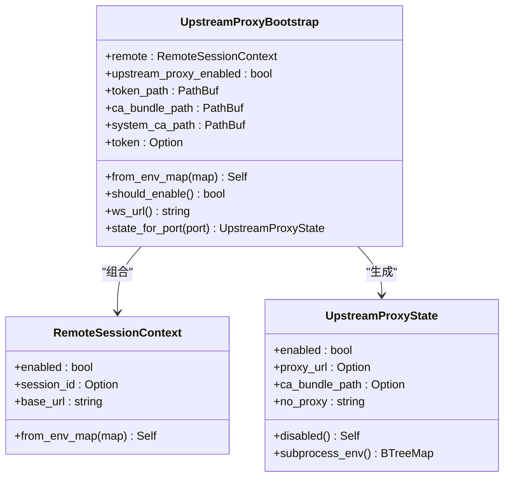
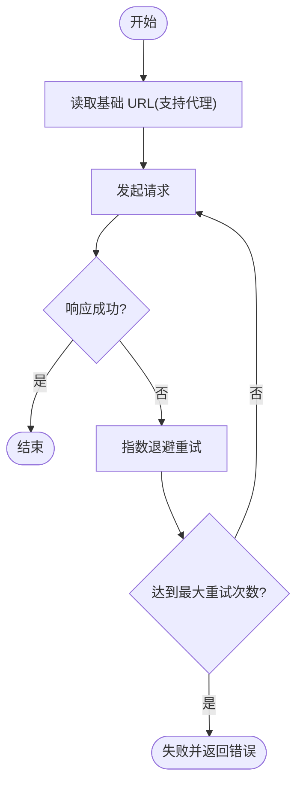

# 网络问题

<cite>
**本文引用的文件**
- [README.md](file://README.md)
- [rust/README.md](file://rust/README.md)
- [rust/crates/runtime/src/remote.rs](file://rust/crates/runtime/src/remote.rs)
- [rust/crates/api/src/client.rs](file://rust/crates/api/src/client.rs)
- [src/remote_runtime.py](file://src/remote_runtime.py)
- [src/upstreamproxy/__init__.py](file://src/upstreamproxy/__init__.py)
- [src/reference_data/subsystems/remote.json](file://src/reference_data/subsystems/remote.json)
- [src/reference_data/subsystems/upstreamproxy.json](file://src/reference_data/subsystems/upstreamproxy.json)
</cite>

## 目录
1. [简介](#简介)
2. [项目结构](#项目结构)
3. [核心组件](#核心组件)
4. [架构总览](#架构总览)
5. [详细组件分析](#详细组件分析)
6. [依赖关系分析](#依赖关系分析)
7. [性能考量](#性能考量)
8. [故障排查指南](#故障排查指南)
9. [结论](#结论)
10. [附录](#附录)

## 简介
本指南聚焦于 CLAW 项目在“远程运行模式”下的网络连接问题排查，涵盖 SSH 连接失败、代理配置错误、超时与断开重连等常见问题，并提供网络诊断命令、连接测试方法、上游代理配置与故障排除步骤、防火墙与安全组配置建议，以及不同网络环境下的配置模板与最佳实践。同时解释如何应对网络不稳定与带宽限制带来的影响。

## 项目结构
CLAW 的 Rust 实现负责高性能的 CLI 与运行时，其中远程运行模式通过“上游代理”机制实现对远端服务的安全访问；Python 层提供占位模块以保留历史子系统结构。下图展示与网络连接直接相关的模块与文件：

**图表来源**
- [rust/crates/runtime/src/remote.rs](file://rust/crates/runtime/src/remote.rs)
- [rust/crates/api/src/client.rs](file://rust/crates/api/src/client.rs)
- [src/remote_runtime.py](file://src/remote_runtime.py)
- [src/upstreamproxy/__init__.py](file://src/upstreamproxy/__init__.py)
- [src/reference_data/subsystems/remote.json](file://src/reference_data/subsystems/remote.json)
- [src/reference_data/subsystems/upstreamproxy.json](file://src/reference_data/subsystems/upstreamproxy.json)
- [rust/README.md](file://rust/README.md)
- [README.md](file://README.md)

**章节来源**
- [README.md:1-192](file://README.md#L1-L192)
- [rust/README.md:1-222](file://rust/README.md#L1-L222)

## 核心组件
- 上游代理引导与状态
  - 从环境变量解析远程会话上下文、令牌路径、CA 证书路径与系统 CA 路径
  - 判断是否启用上游代理（需满足远程开关、代理开关、会话 ID 与令牌均存在）
  - 计算 WebSocket 地址与本地回环代理端口映射
  - 生成子进程可继承的 HTTPS/NO_PROXY/证书等环境变量
- HTTP 客户端与重试策略
  - 基于指数退避的重试策略，避免瞬时网络抖动导致的失败放大
  - 支持自定义基础 URL（可通过代理或上游代理层转发）
- Python 占位模块
  - remote_runtime.py 提供远程/SSH/Teleport 模式占位接口，便于后续对接真实远程控制
  - upstreamproxy 包为上游代理子系统占位，保留历史模块引用

**章节来源**
- [rust/crates/runtime/src/remote.rs:58-183](file://rust/crates/runtime/src/remote.rs#L58-L183)
- [rust/crates/runtime/src/remote.rs:200-251](file://rust/crates/runtime/src/remote.rs#L200-L251)
- [rust/crates/api/src/client.rs:325-333](file://rust/crates/api/src/client.rs#L325-L333)
- [src/remote_runtime.py:1-25](file://src/remote_runtime.py#L1-L25)
- [src/upstreamproxy/__init__.py:1-16](file://src/upstreamproxy/__init__.py#L1-L16)

## 架构总览
远程运行模式通过“本地上游代理 + 远端 WebSocket”通道实现安全访问。客户端在本地启动一个 HTTP 代理（通常为 127.0.0.1:端口），并将 HTTPS 请求经由该代理转发到远端服务。代理状态由环境变量驱动，且会注入标准代理与证书相关环境变量，确保下游工具链（如 Python/Node/curl）使用一致的代理与证书链。

**图表来源**
- [rust/crates/runtime/src/remote.rs:72-183](file://rust/crates/runtime/src/remote.rs#L72-L183)
- [rust/crates/api/src/client.rs:511-511](file://rust/crates/api/src/client.rs#L511-L511)

## 详细组件分析

### 组件：上游代理状态与环境注入
- 关键职责
  - 解析远程开关、会话 ID、基础 URL
  - 解析上游代理开关、令牌路径、CA 证书路径、系统 CA 路径
  - 计算 WebSocket URL（自动根据 http/https 推导 wss/ws）
  - 生成子进程可用的代理与证书环境变量（HTTPS_PROXY、NO_PROXY、SSL_CERT_FILE 等）
- 重要行为
  - 仅当远程开关开启、代理开关开启、会话 ID 与令牌均存在时才启用
  - 默认 CA 证书路径位于用户家目录下的特定子路径
  - NO_PROXY 列表默认包含若干域名，避免内部服务走代理

**图表来源**
- [rust/crates/runtime/src/remote.rs:58-183](file://rust/crates/runtime/src/remote.rs#L58-L183)

**章节来源**
- [rust/crates/runtime/src/remote.rs:58-183](file://rust/crates/runtime/src/remote.rs#L58-L183)
- [rust/crates/runtime/src/remote.rs:200-251](file://rust/crates/runtime/src/remote.rs#L200-L251)

### 组件：HTTP 客户端与重试策略
- 关键职责
  - 基于环境变量确定基础 URL（支持通过代理或上游代理层转发）
  - 实施指数退避重试，避免瞬时网络波动导致失败
- 适用场景
  - 远程模式下，所有对外请求应通过本地代理进行，确保统一的代理与证书链

**图表来源**
- [rust/crates/api/src/client.rs:325-333](file://rust/crates/api/src/client.rs#L325-L333)
- [rust/crates/api/src/client.rs:511-511](file://rust/crates/api/src/client.rs#L511-L511)

**章节来源**
- [rust/crates/api/src/client.rs:325-333](file://rust/crates/api/src/client.rs#L325-L333)
- [rust/crates/api/src/client.rs:511-511](file://rust/crates/api/src/client.rs#L511-L511)

### 组件：Python 占位模块（远程/上游代理）
- remote_runtime.py
  - 提供远程/SSH/Teleport 模式占位接口，便于后续对接真实远程控制
- upstreamproxy 包
  - 作为上游代理子系统的占位包，保留历史模块引用，便于迁移与对齐

**章节来源**
- [src/remote_runtime.py:1-25](file://src/remote_runtime.py#L1-L25)
- [src/upstreamproxy/__init__.py:1-16](file://src/upstreamproxy/__init__.py#L1-L16)
- [src/reference_data/subsystems/remote.json:1-11](file://src/reference_data/subsystems/remote.json#L1-L11)
- [src/reference_data/subsystems/upstreamproxy.json:1-9](file://src/reference_data/subsystems/upstreamproxy.json#L1-L9)

## 依赖关系分析
- 运行时依赖
  - 运行时通过环境变量驱动上游代理状态，进而影响下游工具链的代理与证书链
  - HTTP 客户端读取基础 URL，支持通过代理或上游代理层转发
- 子系统依赖
  - remote 与 upstreamproxy 子系统在 Python 层以占位形式保留，便于后续对接真实远程控制与代理逻辑

**图表来源**
- [rust/crates/runtime/src/remote.rs:72-183](file://rust/crates/runtime/src/remote.rs#L72-L183)
- [rust/crates/api/src/client.rs:511-511](file://rust/crates/api/src/client.rs#L511-L511)

**章节来源**
- [rust/crates/runtime/src/remote.rs:72-183](file://rust/crates/runtime/src/remote.rs#L72-L183)
- [rust/crates/api/src/client.rs:511-511](file://rust/crates/api/src/client.rs#L511-L511)

## 性能考量
- 重试策略
  - 指数退避可有效缓解瞬时网络抖动，但需设置合理上限，避免长时间占用资源
- 代理与证书链
  - 使用本地回环代理可减少跨网络传输延迟；确保 CA 证书链正确，避免握手失败导致的额外重试
- 带宽与稳定性
  - 在弱网环境下，适当增大超时阈值与重试间隔，结合断线重连策略提升成功率

[本节为通用指导，无需列出具体文件来源]

## 故障排查指南

### 一、SSH 连接失败
- 常见原因
  - 认证失败（密钥/密码不匹配）、目标主机不可达、端口被阻断
- 诊断命令
  - 使用 SSH 自检：ssh -vvv 用户@主机 -p 端口
  - 检查端口连通性：telnet/nc 主机 端口 或使用 nmap 扫描
  - 查看系统防火墙与安全组规则
- 处理步骤
  - 确认密钥权限与受信列表
  - 在代理/跳板机场景下，先验证跳板连通性
  - 如需代理穿透，确认代理服务器允许 TCP 隧道

[本小节为通用指导，无需列出具体文件来源]

### 二、代理配置错误
- 环境变量检查
  - 必须同时具备 HTTPS_PROXY 与 SSL_CERT_FILE，否则不会注入上游代理环境
  - NO_PROXY 应包含内网域名与本地服务地址
- 证书链
  - 确保 SSL_CERT_FILE 指向有效的 CA 证书链
  - 若使用系统 CA，确认 CCR_SYSTEM_CA_BUNDLE 路径正确
- 下游工具链
  - Python/Node/curl 等应遵循注入的 HTTPS_PROXY/NO_PROXY/SSL_CERT_FILE

**章节来源**
- [rust/crates/runtime/src/remote.rs:221-235](file://rust/crates/runtime/src/remote.rs#L221-L235)
- [rust/crates/runtime/src/remote.rs:161-182](file://rust/crates/runtime/src/remote.rs#L161-L182)

### 三、超时与断开重连
- 超时
  - 增大请求超时阈值，结合指数退避重试
  - 对于长连接（如 WebSocket），在客户端实现心跳与自动重连
- 断开重连
  - 记录会话 ID 并在断线后尝试恢复
  - 保持代理与证书链稳定，避免握手失败导致频繁断开

**章节来源**
- [rust/crates/api/src/client.rs:325-333](file://rust/crates/api/src/client.rs#L325-L333)

### 四、上游代理配置与故障排除
- 启用条件
  - CLAUDE_CODE_REMOTE=1、CCR_UPSTREAM_PROXY_ENABLED=true、CLAUDE_CODE_REMOTE_SESSION_ID 存在、令牌文件存在
- WebSocket 地址
  - 基于 ANTHROPIC_BASE_URL 自动推导 wss:// 或 ws://
- 环境注入
  - 成功启用后，注入 HTTPS_PROXY、NO_PROXY、SSL_CERT_FILE 等环境变量
- 常见问题
  - 令牌或会话缺失导致代理未启用
  - 基础 URL 不规范导致 WS 地址错误
  - 证书链不匹配导致握手失败

**章节来源**
- [rust/crates/runtime/src/remote.rs:72-147](file://rust/crates/runtime/src/remote.rs#L72-L147)
- [rust/crates/runtime/src/remote.rs:200-211](file://rust/crates/runtime/src/remote.rs#L200-L211)

### 五、防火墙与安全组配置建议
- 入站规则
  - 开放 SSH 端口（默认 22）与代理监听端口
  - 限制来源 IP，仅放行可信网段
- 出站规则
  - 允许访问上游代理与目标服务域名
  - 对外出站流量进行 DNS/HTTPS 代理白名单控制
- 安全组
  - 与云厂商安全组联动，确保实例与 VPC 内部网络策略一致

[本小节为通用指导，无需列出具体文件来源]

### 六、不同网络环境下的配置模板与最佳实践
- 企业内网（有代理）
  - 设置 HTTPS_PROXY=http://代理:端口
  - 设置 NO_PROXY=内网域名,localhost,127.0.0.1
  - 设置 SSL_CERT_FILE=/path/to/ca-bundle.crt
- 公网直连
  - 无需代理，仅设置 SSL_CERT_FILE
- 代理穿透（跳板机）
  - 先建立 SSH 隧道或 SOCKS 代理，再通过 HTTPS_PROXY 指向本地端口
- 最佳实践
  - 将代理与证书配置集中管理，避免散落各处
  - 使用会话 ID 与令牌配合，确保断线可恢复
  - 在弱网环境下适当放宽超时与重试策略

[本小节为通用指导，无需列出具体文件来源]

### 七、网络不稳定与带宽限制
- 策略
  - 增加重试间隔与最大重试次数
  - 对长连接启用心跳与自动重连
  - 降低并发度，避免拥塞
- 工具
  - 使用带宽测试工具评估可用带宽
  - 使用丢包/延迟模拟工具验证健壮性

[本小节为通用指导，无需列出具体文件来源]

## 结论
CLAW 的远程运行模式通过“上游代理 + 本地回环代理 + 统一证书链”的方式，在保证安全性的同时简化了网络配置。排查网络问题的关键在于：确认上游代理启用条件、校验代理与证书环境变量、优化重试与超时策略，并结合防火墙与安全组规则进行端到端验证。针对不同网络环境，建议采用标准化的配置模板与最佳实践，以提升稳定性与可维护性。

[本节为总结性内容，无需列出具体文件来源]

## 附录

### A. 环境变量清单（与上游代理相关）
- CLAUDE_CODE_REMOTE：启用远程运行模式
- CLAUDE_CODE_REMOTE_SESSION_ID：远程会话 ID
- ANTHROPIC_BASE_URL：基础 URL（用于推导 WS 地址）
- CCR_UPSTREAM_PROXY_ENABLED：启用上游代理
- CCR_SESSION_TOKEN_PATH：会话令牌文件路径
- CCR_CA_BUNDLE_PATH：CA 证书路径
- CCR_SYSTEM_CA_BUNDLE：系统 CA 证书路径
- HTTPS_PROXY/https_proxy：HTTP(S) 代理地址
- NO_PROXY/no_proxy：代理豁免列表
- SSL_CERT_FILE/NODE_EXTRA_CA_CERTS/REQUESTS_CA_BUNDLE/CURL_CA_BUNDLE：证书链文件路径

**章节来源**
- [rust/crates/runtime/src/remote.rs:72-119](file://rust/crates/runtime/src/remote.rs#L72-L119)
- [rust/crates/runtime/src/remote.rs:161-182](file://rust/crates/runtime/src/remote.rs#L161-L182)
- [rust/README.md:22-30](file://rust/README.md#L22-L30)

### B. 参考文档与入口
- 仓库概览与快速开始
  - [README.md](file://README.md)
- Rust 实现与代理说明
  - [rust/README.md](file://rust/README.md)

**章节来源**
- [README.md:1-192](file://README.md#L1-L192)
- [rust/README.md:1-222](file://rust/README.md#L1-L222)